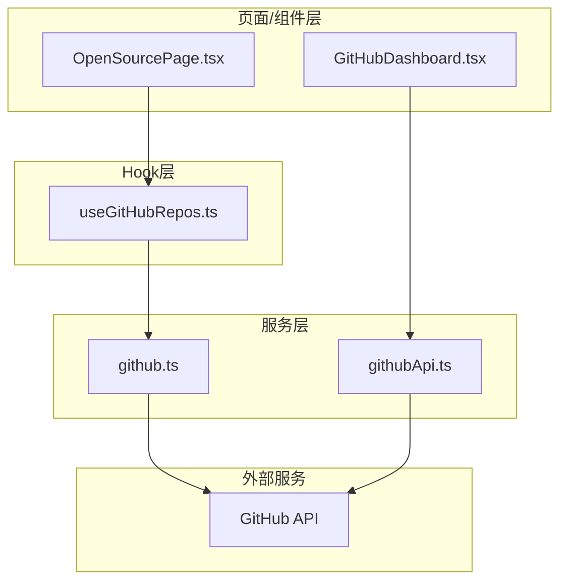
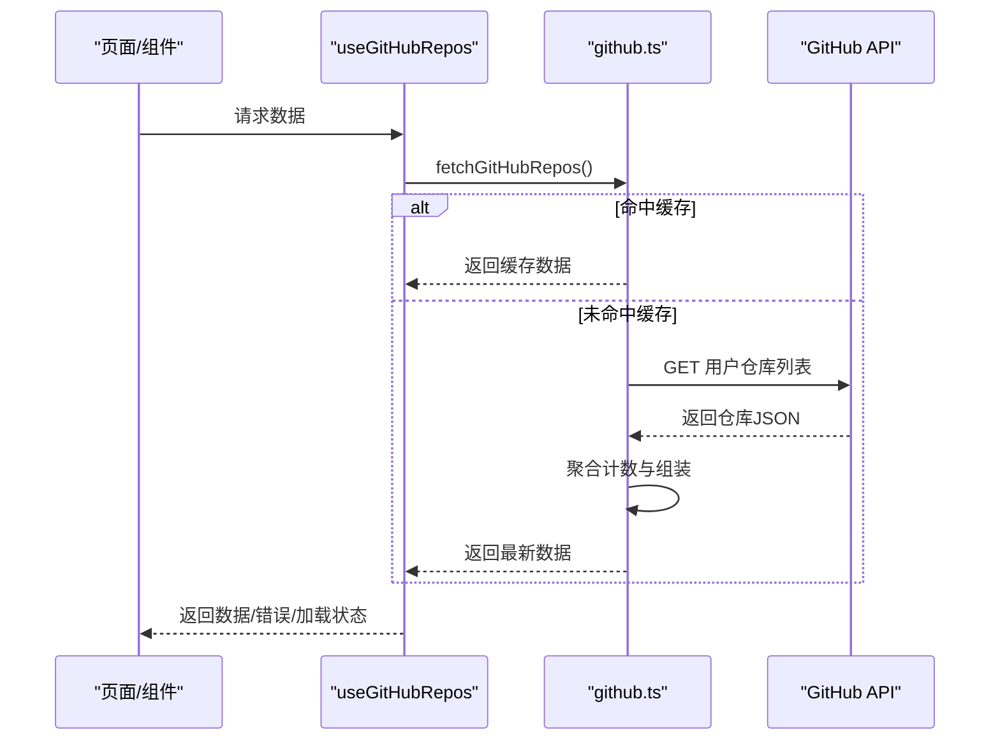
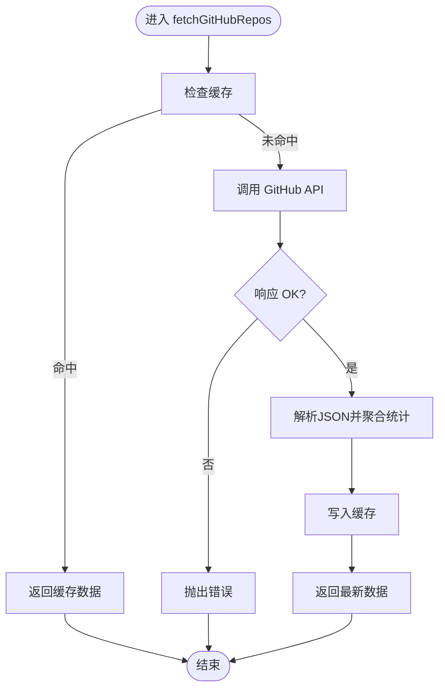
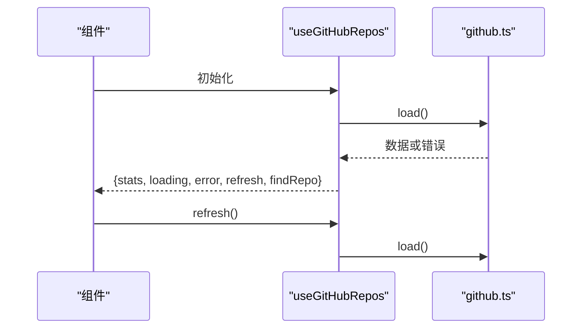
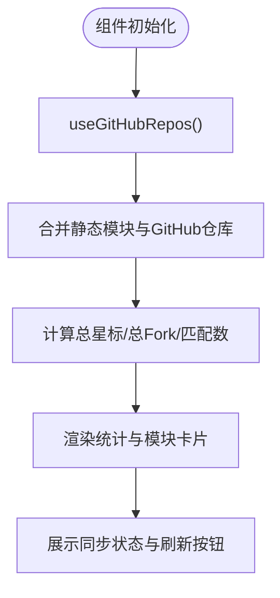
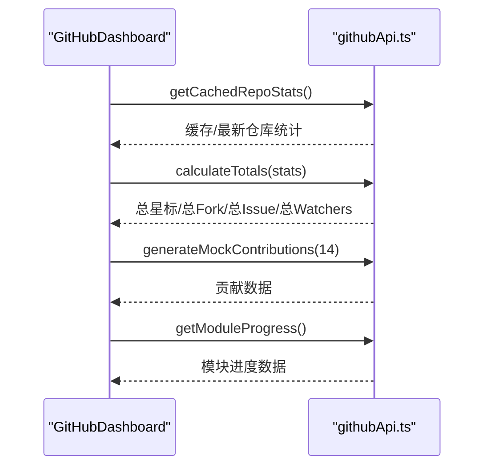
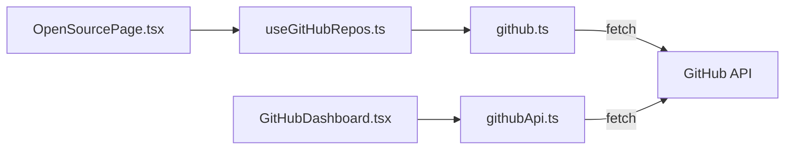

# API集成

<cite>
**本文引用的文件**
- [src/services/github.ts](file://src/services/github.ts)
- [src/hooks/useGitHubRepos.ts](file://src/hooks/useGitHubRepos.ts)
- [src/pages/OpenSourcePage.tsx](file://src/pages/OpenSourcePage.tsx)
- [src/components/GitHubDashboard.tsx](file://src/components/GitHubDashboard.tsx)
- [src/services/githubApi.ts](file://src/services/githubApi.ts)
- [src/data/modules.ts](file://src/data/modules.ts)
- [package.json](file://package.json)
- [README.md](file://README.md)
</cite>

## 目录
1. [简介](#简介)
2. [项目结构](#项目结构)
3. [核心组件](#核心组件)
4. [架构总览](#架构总览)
5. [组件详解](#组件详解)
6. [依赖关系分析](#依赖关系分析)
7. [性能与限流](#性能与限流)
8. [故障排查](#故障排查)
9. [结论](#结论)
10. [附录](#附录)

## 简介
本文件面向YuleTech社区技术平台的API集成，重点覆盖GitHub API的集成实现、认证机制与调用策略、请求封装与错误处理、重试策略、数据获取流程、缓存策略与实时更新机制、限流与性能优化、扩展指南与第三方服务集成、安全与密钥管理、测试与联调流程，以及开发者定制与扩展的开发指导。

## 项目结构
本项目采用前端React + TypeScript架构，API集成主要集中在服务层与页面/组件层之间，形成清晰的分层：
- 服务层：封装GitHub API调用与缓存逻辑
- Hook层：封装数据加载、错误与刷新逻辑
- 页面/组件层：消费数据并渲染UI，展示实时统计与图表

**图表来源**
- [src/pages/OpenSourcePage.tsx:120-170](file://src/pages/OpenSourcePage.tsx#L120-L170)
- [src/components/GitHubDashboard.tsx:32-58](file://src/components/GitHubDashboard.tsx#L32-L58)
- [src/hooks/useGitHubRepos.ts:13-44](file://src/hooks/useGitHubRepos.ts#L13-L44)
- [src/services/github.ts:52-80](file://src/services/github.ts#L52-L80)
- [src/services/githubApi.ts:65-149](file://src/services/githubApi.ts#L65-L149)

**章节来源**
- [README.md:1-95](file://README.md#L1-L95)
- [package.json:1-46](file://package.json#L1-L46)

## 核心组件
- GitHub API服务（用户仓库统计）
  - 提供用户仓库列表、聚合统计与本地缓存
  - 文件路径：[src/services/github.ts:52-80](file://src/services/github.ts#L52-L80)
- GitHub API服务（开源项目统计与图表数据）
  - 提供多仓库统计、总量计算、模拟贡献数据与模块进度
  - 文件路径：[src/services/githubApi.ts:65-149](file://src/services/githubApi.ts#L65-L149)
- 自定义Hook（useGitHubRepos）
  - 负责加载、错误处理与刷新
  - 文件路径：[src/hooks/useGitHubRepos.ts:13-44](file://src/hooks/useGitHubRepos.ts#L13-L44)
- 页面组件（OpenSourcePage）
  - 融合静态模块数据与GitHub API数据，展示统计与同步状态
  - 文件路径：[src/pages/OpenSourcePage.tsx:120-170](file://src/pages/OpenSourcePage.tsx#L120-L170)
- 图表组件（GitHubDashboard）
  - 展示仓库统计、模块进度与贡献活跃度
  - 文件路径：[src/components/GitHubDashboard.tsx:32-58](file://src/components/GitHubDashboard.tsx#L32-L58)

**章节来源**
- [src/services/github.ts:1-97](file://src/services/github.ts#L1-L97)
- [src/services/githubApi.ts:1-150](file://src/services/githubApi.ts#L1-L150)
- [src/hooks/useGitHubRepos.ts:1-45](file://src/hooks/useGitHubRepos.ts#L1-L45)
- [src/pages/OpenSourcePage.tsx:120-170](file://src/pages/OpenSourcePage.tsx#L120-L170)
- [src/components/GitHubDashboard.tsx:32-58](file://src/components/GitHubDashboard.tsx#L32-L58)

## 架构总览
整体调用链路如下：
- 页面/组件通过Hook获取数据
- Hook调用服务层API
- 服务层封装fetch请求、解析响应、聚合统计、缓存
- GitHub API返回原始数据，前端进行二次加工与展示

**图表来源**
- [src/pages/OpenSourcePage.tsx:120-170](file://src/pages/OpenSourcePage.tsx#L120-L170)
- [src/hooks/useGitHubRepos.ts:18-29](file://src/hooks/useGitHubRepos.ts#L18-L29)
- [src/services/github.ts:52-80](file://src/services/github.ts#L52-L80)

## 组件详解

### GitHub API服务（用户仓库统计）
- 功能
  - 从GitHub获取指定用户的公开仓库列表
  - 解析并聚合总数（仓库数、星标数、Fork数）
  - 使用sessionStorage进行本地缓存，避免重复请求
- 关键点
  - 请求头：Accept: application/vnd.github.v3+json
  - 缓存键名与TTL常量定义
  - 错误处理：当响应非OK时抛出异常
- 适用场景
  - 页面级“开源模块”统计与同步状态展示

**图表来源**
- [src/services/github.ts:28-80](file://src/services/github.ts#L28-L80)

**章节来源**
- [src/services/github.ts:1-97](file://src/services/github.ts#L1-L97)

### 自定义Hook（useGitHubRepos）
- 功能
  - 管理加载状态、错误状态与数据
  - 提供刷新方法，便于手动触发重新拉取
  - 提供按模块名查找对应仓库的能力
- 关键点
  - 使用useMemo与useCallback优化重渲染
  - 错误捕获并统一设置错误消息
- 适用场景
  - 所有需要GitHub仓库数据的页面/组件

**图表来源**
- [src/hooks/useGitHubRepos.ts:13-44](file://src/hooks/useGitHubRepos.ts#L13-L44)
- [src/services/github.ts:52-80](file://src/services/github.ts#L52-L80)

**章节来源**
- [src/hooks/useGitHubRepos.ts:1-45](file://src/hooks/useGitHubRepos.ts#L1-L45)

### 页面组件（OpenSourcePage）
- 功能
  - 融合静态模块数据与GitHub API数据
  - 计算总星标、总Fork，并统计已匹配仓库数量
  - 展示同步状态与刷新按钮
- 关键点
  - 使用useMemo计算聚合指标
  - 通过findRepo按模块名匹配仓库
  - 展示“正在同步/失败/已同步”的状态提示

**图表来源**
- [src/pages/OpenSourcePage.tsx:120-170](file://src/pages/OpenSourcePage.tsx#L120-L170)
- [src/hooks/useGitHubRepos.ts:13-44](file://src/hooks/useGitHubRepos.ts#L13-L44)

**章节来源**
- [src/pages/OpenSourcePage.tsx:120-170](file://src/pages/OpenSourcePage.tsx#L120-L170)

### 图表组件（GitHubDashboard）
- 功能
  - 展示仓库统计卡片、模块进度条与贡献折线图
  - 使用缓存服务获取仓库统计数据
- 关键点
  - 使用generateMockContributions生成模拟贡献数据
  - 使用getModuleProgress生成模块完成度数据
  - 使用getCachedRepoStats进行缓存读取

**图表来源**
- [src/components/GitHubDashboard.tsx:32-58](file://src/components/GitHubDashboard.tsx#L32-L58)
- [src/services/githubApi.ts:65-149](file://src/services/githubApi.ts#L65-L149)

**章节来源**
- [src/components/GitHubDashboard.tsx:32-58](file://src/components/GitHubDashboard.tsx#L32-L58)
- [src/services/githubApi.ts:65-149](file://src/services/githubApi.ts#L65-L149)

### 模块元数据接口（modules.ts）
- 作用
  - 定义模块详情的数据结构，包括名称、层级、状态、版本、API与配置等
- 适用场景
  - 作为模块详情页的数据契约，便于前后端协作与类型约束

**章节来源**
- [src/data/modules.ts:1-32](file://src/data/modules.ts#L1-L32)

## 依赖关系分析
- 组件依赖
  - OpenSourcePage依赖useGitHubRepos
  - GitHubDashboard依赖githubApi服务
- 服务依赖
  - github.ts依赖浏览器fetch与sessionStorage
  - githubApi.ts独立于认证，直接调用公共API
- 第三方依赖
  - React、Recharts、Lucide等

**图表来源**
- [src/pages/OpenSourcePage.tsx:23-123](file://src/pages/OpenSourcePage.tsx#L23-L123)
- [src/hooks/useGitHubRepos.ts:1-3](file://src/hooks/useGitHubRepos.ts#L1-L3)
- [src/services/github.ts:52-80](file://src/services/github.ts#L52-L80)
- [src/components/GitHubDashboard.tsx:25-30](file://src/components/GitHubDashboard.tsx#L25-L30)
- [src/services/githubApi.ts:33-60](file://src/services/githubApi.ts#L33-L60)

**章节来源**
- [package.json:12-26](file://package.json#L12-L26)

## 性能与限流
- 缓存策略
  - 用户仓库统计：sessionStorage缓存，TTL 5分钟
  - 开源项目统计：内存缓存，TTL 5分钟
- 并发与批量
  - 使用Promise.all并发获取多个仓库统计
- 限流与退避
  - 当前实现未内置指数退避或队列限流；如需增强，可在服务层增加重试与退避逻辑
- 优化建议
  - 对高频页面引入节流/防抖
  - 对图表数据使用虚拟滚动与懒加载
  - 对静态模块数据进行本地持久化，减少网络请求

**章节来源**
- [src/services/github.ts:19-21](file://src/services/github.ts#L19-L21)
- [src/services/github.ts:28-50](file://src/services/github.ts#L28-L50)
- [src/services/githubApi.ts:132-149](file://src/services/githubApi.ts#L132-L149)
- [src/services/githubApi.ts:65-70](file://src/services/githubApi.ts#L65-L70)

## 故障排查
- 常见问题
  - GitHub API响应非OK：会抛出错误，页面显示“GitHub 数据同步失败，显示缓存数据”
  - 缓存失效：TTL到期后自动刷新
  - 仓库未匹配：模块名与仓库名不一致时无法匹配
- 定位步骤
  - 检查网络面板与控制台错误
  - 确认缓存是否命中
  - 核对模块名与候选匹配规则
- 修复建议
  - 在Hook层增加重试与降级策略
  - 在页面层提供“刷新”按钮并提示用户

**章节来源**
- [src/pages/OpenSourcePage.tsx:248-278](file://src/pages/OpenSourcePage.tsx#L248-L278)
- [src/hooks/useGitHubRepos.ts:18-29](file://src/hooks/useGitHubRepos.ts#L18-L29)
- [src/services/github.ts:65-67](file://src/services/github.ts#L65-L67)

## 结论
本项目对GitHub API的集成采用简洁高效的分层设计：服务层负责请求封装与缓存，Hook层负责状态管理与刷新，页面/组件层负责数据融合与展示。当前实现具备基本的缓存与错误提示能力，适合中小型社区站点的开源数据展示需求。若需进一步提升稳定性与性能，可在服务层引入重试与限流策略，并对高频交互进行优化。

## 附录

### API调用封装与错误处理
- 请求封装
  - 统一设置Accept头
  - 使用try/catch捕获异常
- 错误处理
  - 页面层显示“同步失败，显示缓存数据”
  - Hook层统一设置错误消息
- 重试策略
  - 当前未实现；建议在服务层增加指数退避与最大重试次数

**章节来源**
- [src/services/github.ts:56-67](file://src/services/github.ts#L56-L67)
- [src/pages/OpenSourcePage.tsx:256-261](file://src/pages/OpenSourcePage.tsx#L256-L261)
- [src/hooks/useGitHubRepos.ts:24-25](file://src/hooks/useGitHubRepos.ts#L24-L25)

### 数据获取流程与实时更新
- 数据来源
  - 用户仓库：github.ts
  - 项目统计与图表：githubApi.ts
- 实时更新
  - 页面层提供“刷新”按钮
  - 缓存TTL到期后自动刷新

**章节来源**
- [src/pages/OpenSourcePage.tsx:268-277](file://src/pages/OpenSourcePage.tsx#L268-L277)
- [src/services/github.ts:19-21](file://src/services/github.ts#L19-L21)
- [src/services/githubApi.ts:132-134](file://src/services/githubApi.ts#L132-L134)

### 安全性与密钥管理
- 当前实现
  - 使用公共API，无需认证
- 安全建议
  - 如需私有仓库或更高配额，应引入认证（如Token），并将其存储在受控环境变量中
  - 不要在客户端暴露敏感凭据

**章节来源**
- [src/services/github.ts:56-62](file://src/services/github.ts#L56-L62)
- [src/services/githubApi.ts:33-39](file://src/services/githubApi.ts#L33-L39)

### 扩展指南与第三方服务集成
- 新API接入流程
  - 在服务层新增API函数，封装fetch与解析
  - 在Hook层新增或复用Hook，管理状态与刷新
  - 在页面/组件层消费数据并渲染
- 第三方服务集成
  - 可复用现有缓存与错误处理模式
  - 注意统一的错误上报与降级策略

**章节来源**
- [src/services/github.ts:52-80](file://src/services/github.ts#L52-L80)
- [src/hooks/useGitHubRepos.ts:13-44](file://src/hooks/useGitHubRepos.ts#L13-L44)
- [src/pages/OpenSourcePage.tsx:120-170](file://src/pages/OpenSourcePage.tsx#L120-L170)

### 测试方法与Mock数据
- Mock数据
  - 图表组件使用模拟测试数据与覆盖率数据
- 联调流程
  - 页面层通过Hook联调服务层
  - 建议在开发环境启用断点与日志，观察缓存与错误分支

**章节来源**
- [src/components/TestCoverageDashboard.tsx:44-79](file://src/components/TestCoverageDashboard.tsx#L44-L79)
- [src/pages/OpenSourcePage.tsx:120-170](file://src/pages/OpenSourcePage.tsx#L120-L170)