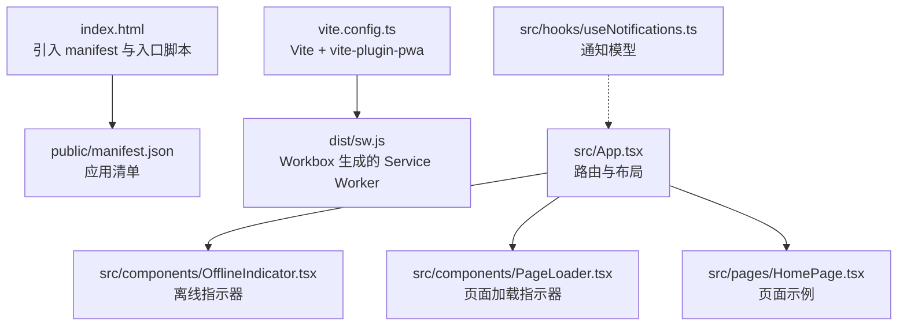
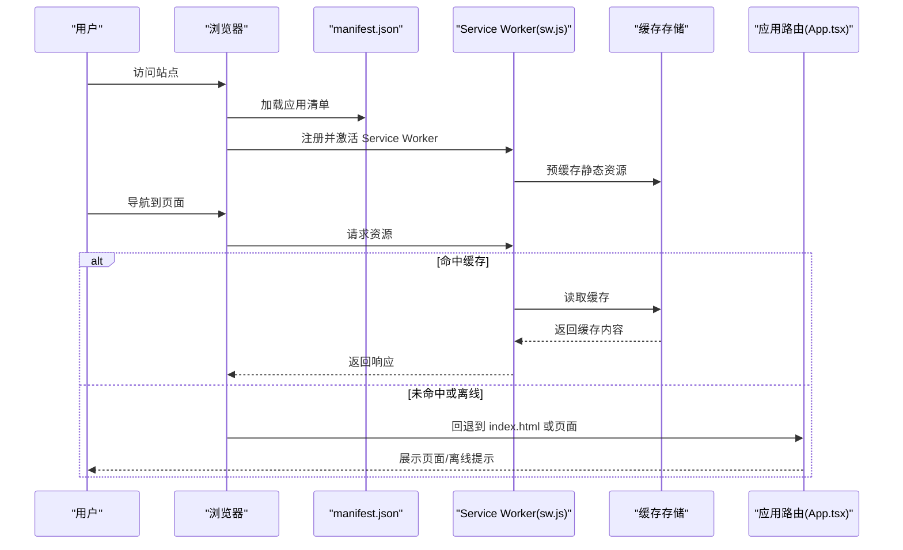
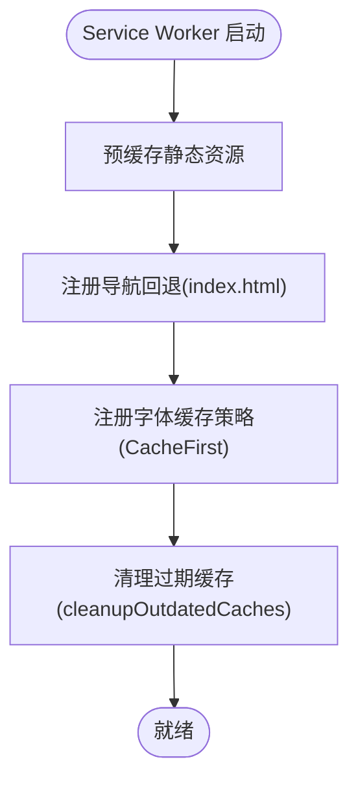
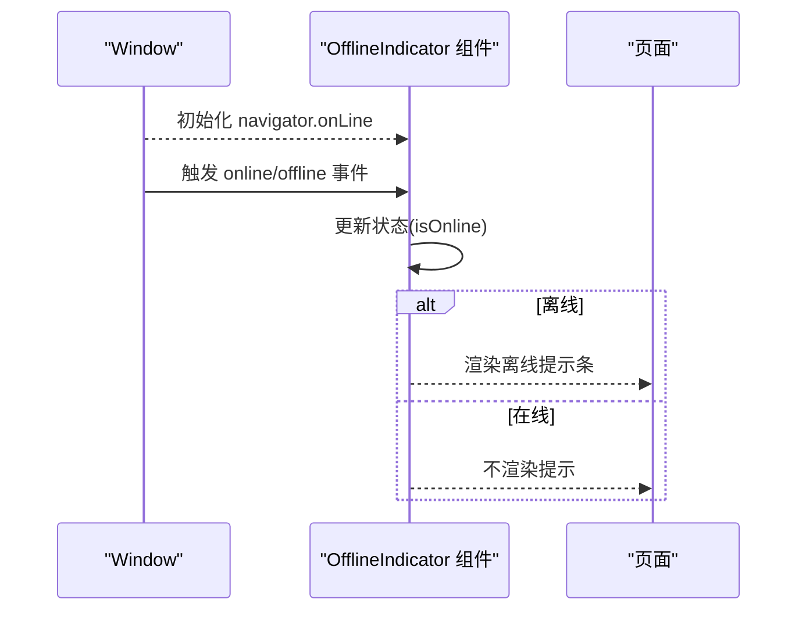
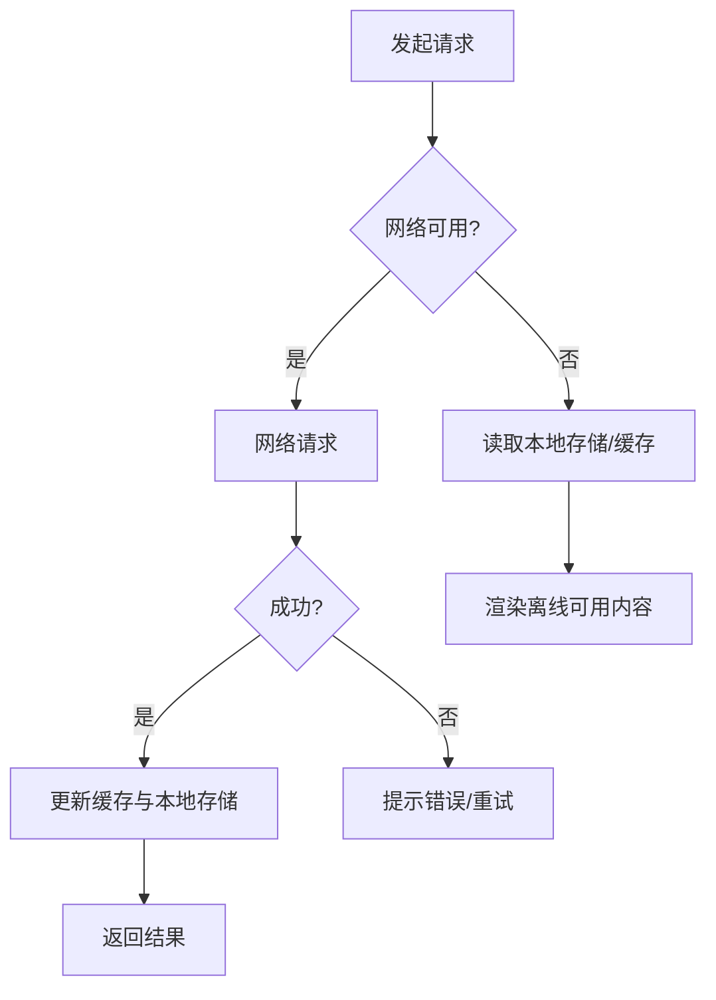
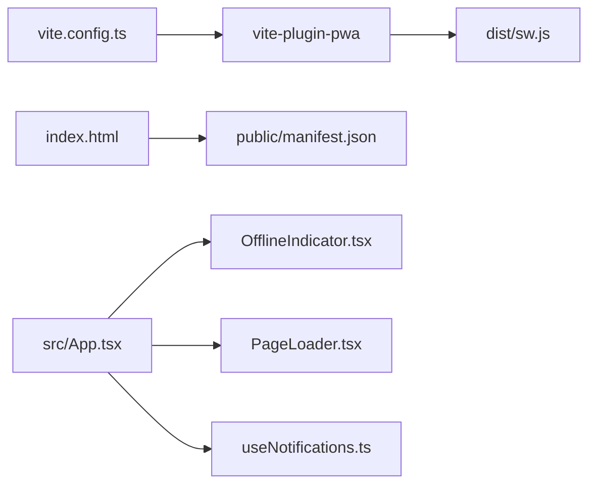

# PWA与离线功能

<cite>
**本文引用的文件**
- [index.html](file://index.html)
- [manifest.json](file://public/manifest.json)
- [vite.config.ts](file://vite.config.ts)
- [package.json](file://package.json)
- [sw.js](file://dist/sw.js)
- [App.tsx](file://src/App.tsx)
- [OfflineIndicator.tsx](file://src/components/OfflineIndicator.tsx)
- [PageLoader.tsx](file://src/components/PageLoader.tsx)
- [HomePage.tsx](file://src/pages/HomePage.tsx)
- [useNotifications.ts](file://src/hooks/useNotifications.ts)
</cite>

## 目录
1. [简介](#简介)
2. [项目结构](#项目结构)
3. [核心组件](#核心组件)
4. [架构总览](#架构总览)
5. [详细组件分析](#详细组件分析)
6. [依赖关系分析](#依赖关系分析)
7. [性能考量](#性能考量)
8. [故障排查指南](#故障排查指南)
9. [结论](#结论)
10. [附录](#附录)

## 简介
本文件系统性梳理 YuleTech 社区技术平台的 PWA 与离线能力，覆盖以下主题：
- PWA 配置策略与构建流程
- Service Worker 的生成与缓存策略
- 离线检测机制与网络状态监控
- 应用清单（manifest）配置与安装体验
- 推送通知能力与本地存储通知模型
- 离线页面展示与数据处理思路
- 数据同步与冲突解决策略建议
- 性能优化、缓存清理与版本更新管理
- 跨平台兼容性与渐进式增强
- 测试方法、调试技巧与部署注意事项
- 扩展与定制开发指导

## 项目结构
该仓库采用多包/多入口的组织方式，PWA 相关的关键位置如下：
- HTML 入口与清单链接：index.html
- 应用清单：public/manifest.json
- 构建与 PWA 插件：vite.config.ts（集成 vite-plugin-pwa）
- 依赖声明：package.json（包含 vites-plugin-pwa）
- 产物 Service Worker：dist/sw.js（由 Workbox 生成）
- 应用根路由与离线指示器：src/App.tsx
- 离线指示器组件：src/components/OfflineIndicator.tsx
- 页面加载指示器：src/components/PageLoader.tsx
- 首页示例页面（演示本地存储与加载行为）：src/pages/HomePage.tsx
- 通知钩子（本地存储通知模型）：src/hooks/useNotifications.ts

图表来源
- [index.html:1-18](file://index.html#L1-L18)
- [manifest.json:1-22](file://public/manifest.json#L1-L22)
- [vite.config.ts:1-32](file://vite.config.ts#L1-L32)
- [sw.js:1-2](file://dist/sw.js#L1-L2)
- [App.tsx:1-118](file://src/App.tsx#L1-L118)
- [OfflineIndicator.tsx:1-29](file://src/components/OfflineIndicator.tsx#L1-L29)
- [PageLoader.tsx:1-11](file://src/components/PageLoader.tsx#L1-L11)
- [HomePage.tsx:1-88](file://src/pages/HomePage.tsx#L1-L88)
- [useNotifications.ts:1-50](file://src/hooks/useNotifications.ts#L1-L50)

章节来源
- [index.html:1-18](file://index.html#L1-L18)
- [manifest.json:1-22](file://public/manifest.json#L1-L22)
- [vite.config.ts:1-32](file://vite.config.ts#L1-L32)
- [package.json:1-46](file://package.json#L1-L46)

## 核心组件
- 应用清单与安装体验
  - 清单字段：名称、短名、描述、起始路径、显示模式、背景色、主题色、图标集等，确保安装到主屏后的视觉与行为一致。
  - 安装入口：HTML 中通过 manifest 链接触发安装提示；iOS 通过 Apple Touch Icon 提升安装体验。
- Service Worker 与缓存策略
  - 构建阶段由 Workbox 生成 sw.js，并预缓存静态资源与路由回退至 index.html。
  - 运行时对 Google Fonts 使用 CacheFirst 缓存策略，提升字体加载稳定性。
- 离线检测与提示
  - 通过 window.navigator.onLine 事件监听在线/离线状态，在离线时展示顶部警示条。
- 页面加载与占位
  - PageLoader 提供统一的加载指示器，改善首屏与路由切换体验。
- 通知与本地存储
  - useNotifications 提供基于本地存储的通知列表，支持新增、标记已读、未读计数等。

章节来源
- [manifest.json:1-22](file://public/manifest.json#L1-L22)
- [index.html:1-18](file://index.html#L1-L18)
- [vite.config.ts:10-24](file://vite.config.ts#L10-L24)
- [sw.js:1-2](file://dist/sw.js#L1-L2)
- [OfflineIndicator.tsx:1-29](file://src/components/OfflineIndicator.tsx#L1-L29)
- [PageLoader.tsx:1-11](file://src/components/PageLoader.tsx#L1-L11)
- [useNotifications.ts:1-50](file://src/hooks/useNotifications.ts#L1-L50)

## 架构总览
下图展示了从用户访问到 PWA 缓存命中、离线提示与页面加载的整体流程：

图表来源
- [index.html:9](file://index.html#L9)
- [manifest.json:1-22](file://public/manifest.json#L1-L22)
- [sw.js:1-2](file://dist/sw.js#L1-L2)
- [vite.config.ts:10-24](file://vite.config.ts#L10-L24)
- [App.tsx:75](file://src/App.tsx#L75)

## 详细组件分析

### PWA 配置与构建
- 构建基座与插件
  - 使用 Vite 作为构建工具，启用 vite-plugin-pwa 插件以生成 Service Worker 并注入清单。
  - 设置 base 路径为 /yuleCommunity/，确保资源与路由在子路径下正确解析。
- Workbox 配置要点
  - 自动更新注册：registerType: autoUpdate
  - 预缓存：globPatterns 匹配常见静态资源类型
  - 运行时缓存：Google Fonts 使用 CacheFirst，命名缓存空间 google-fonts-cache
  - 最大文件尺寸：maximumFileSizeToCacheInBytes 控制大文件缓存策略
- 产物与运行
  - 构建后生成 dist/sw.js，内含 Workbox 预缓存清单与导航回退路由

章节来源
- [vite.config.ts:1-32](file://vite.config.ts#L1-L32)
- [package.json:25](file://package.json#L25)
- [sw.js:1-2](file://dist/sw.js#L1-L2)

### Service Worker 实现与缓存策略
- 预缓存清单
  - sw.js 内包含大量静态资源的 URL 与 revision，用于首次安装时缓存。
- 导航回退
  - 注册 NavigationRoute，将未匹配的导航请求回退到 index.html，支撑 SPA 路由。
- 字体缓存
  - 对 Google Fonts 使用 CacheFirst 策略，避免跨域请求失败导致字体丢失。
- 缓存清理
  - cleanupOutdatedCaches 在新版本激活后清理旧缓存，避免磁盘膨胀。

图表来源
- [sw.js:1-2](file://dist/sw.js#L1-L2)
- [vite.config.ts:16-22](file://vite.config.ts#L16-L22)

章节来源
- [sw.js:1-2](file://dist/sw.js#L1-L2)
- [vite.config.ts:13-23](file://vite.config.ts#L13-L23)

### 离线检测机制与网络状态监控
- 组件实现
  - OfflineIndicator 通过 window.navigator.onLine 初始状态判断，并监听 online/offline 事件动态更新。
  - 在离线状态下固定显示顶部警示条，提示用户当前为离线模式。
- 应用集成
  - App.tsx 将 OfflineIndicator 放置于公共路由区域，确保所有页面均可见离线状态。

图表来源
- [OfflineIndicator.tsx:1-29](file://src/components/OfflineIndicator.tsx#L1-L29)
- [App.tsx:75](file://src/App.tsx#L75)

章节来源
- [OfflineIndicator.tsx:1-29](file://src/components/OfflineIndicator.tsx#L1-L29)
- [App.tsx:75](file://src/App.tsx#L75)

### 应用清单配置与安装体验
- 关键字段
  - name/short_name/description：提升安装后可读性
  - start_url/display/background_color/theme_color：控制启动页与外观
  - icons：提供 192x192 与 512x512 SVG 图标，满足不同密度需求
- 安装入口
  - HTML 中通过 <link rel="manifest"> 引入清单
  - iOS 通过 <link rel="apple-touch-icon"> 提升安装提示质量

章节来源
- [manifest.json:1-22](file://public/manifest.json#L1-L22)
- [index.html:9-11](file://index.html#L9-L11)

### 页面加载与占位体验
- PageLoader 提供统一的加载指示器，结合 React Suspense 的懒加载路由，改善首屏与路由切换体验。
- HomePage 展示了本地存储的最小化模式开关，体现离线场景下的持久化偏好。

章节来源
- [PageLoader.tsx:1-11](file://src/components/PageLoader.tsx#L1-L11)
- [HomePage.tsx:13-31](file://src/pages/HomePage.tsx#L13-L31)

### 通知与本地存储模型
- useNotifications 提供通知的增删改查与未读计数，使用本地存储持久化，适合离线场景下的消息提醒。
- 适用范围：回复通知、问答通知、活动开始、积分变化等类型。

章节来源
- [useNotifications.ts:1-50](file://src/hooks/useNotifications.ts#L1-L50)

### 离线页面展示与数据处理思路
- 导航回退：sw.js 注册导航回退到 index.html，使 SPA 在离线时仍可访问可用页面骨架。
- 页面降级：App.tsx 的公共路由区域优先渲染 OfflineIndicator 与 Navbar，再按需加载页面内容。
- 数据处理建议（概念性说明）：
  - 读取：优先从缓存获取，失败则回退到本地存储或空态
  - 写入：离线时写入本地存储，联网后进行批量同步
  - 冲突：基于时间戳或版本号合并，必要时提供用户选择界面

图表来源
- [sw.js:1-2](file://dist/sw.js#L1-L2)
- [App.tsx:75](file://src/App.tsx#L75)

## 依赖关系分析
- 构建与插件
  - vite.config.ts 依赖 vite-plugin-pwa，后者在构建时生成 sw.js 并注入清单。
- 运行时依赖
  - index.html 依赖 manifest.json 与入口脚本
  - App.tsx 依赖 OfflineIndicator 与 PageLoader
  - useNotifications 依赖本地存储持久化

图表来源
- [vite.config.ts:1-32](file://vite.config.ts#L1-L32)
- [package.json:25](file://package.json#L25)
- [index.html:9](file://index.html#L9)
- [manifest.json:1-22](file://public/manifest.json#L1-L22)
- [App.tsx:75](file://src/App.tsx#L75)
- [OfflineIndicator.tsx:1-29](file://src/components/OfflineIndicator.tsx#L1-L29)
- [PageLoader.tsx:1-11](file://src/components/PageLoader.tsx#L1-L11)
- [useNotifications.ts:1-50](file://src/hooks/useNotifications.ts#L1-L50)

章节来源
- [vite.config.ts:1-32](file://vite.config.ts#L1-L32)
- [package.json:25](file://package.json#L25)
- [index.html:9](file://index.html#L9)
- [App.tsx:75](file://src/App.tsx#L75)

## 性能考量
- 缓存策略
  - 静态资源：预缓存 + 合理的 revision 管理，减少重复下载
  - 字体资源：CacheFirst，降低跨域失败概率
  - 大文件：通过 maximumFileSizeToCacheInBytes 控制缓存大小
- 版本更新
  - autoUpdate 自动更新，结合 cleanupOutdatedCaches 清理旧缓存
- 资源体积
  - 合理拆分路由组件，配合 Suspense 与懒加载，降低初始包体
- 用户感知
  - PageLoader 与骨架屏提升感知性能

章节来源
- [vite.config.ts:13-23](file://vite.config.ts#L13-L23)
- [sw.js:1-2](file://dist/sw.js#L1-L2)

## 故障排查指南
- 安装与清单问题
  - 确认 HTML 中 manifest 链接路径正确，且服务器返回正确的 MIME 类型
  - 检查 start_url 与 base 路径是否匹配
- Service Worker 注册与更新
  - 查看浏览器开发者工具 Application/Service Workers 面板，确认注册状态与版本
  - 若更新不生效，检查 revision 是否随构建变化
- 离线提示无效
  - 确认 OfflineIndicator 已被渲染（公共路由区域），并检查 window.navigator.onLine 事件绑定
- 字体加载失败
  - 检查 Google Fonts 缓存策略与网络环境，必要时替换为本地字体或 CDN 可靠域名
- 通知未持久化
  - 确认本地存储可用，useNotifications 的存储键值正确

章节来源
- [index.html:9](file://index.html#L9)
- [manifest.json:5](file://public/manifest.json#L5)
- [vite.config.ts:11](file://vite.config.ts#L11)
- [sw.js:1-2](file://dist/sw.js#L1-L2)
- [OfflineIndicator.tsx:1-29](file://src/components/OfflineIndicator.tsx#L1-L29)
- [useNotifications.ts:17-18](file://src/hooks/useNotifications.ts#L17-L18)

## 结论
本项目已具备完善的 PWA 基础设施：应用清单、Service Worker 预缓存与导航回退、字体缓存策略、在线/离线状态监控与统一加载体验。在此基础上，建议进一步完善数据层的离线写入与同步、冲突合并策略，并持续优化缓存与版本管理，以获得更稳健的离线体验与更好的性能表现。

## 附录

### 推送通知与离线数据处理（扩展建议）
- 推送通知
  - 当前仓库未见推送服务端实现；如需推送，可在 Service Worker 中注册 push 事件并结合后端推送服务
- 离线数据处理
  - 写入：离线时将变更写入 IndexedDB 或本地存储
  - 同步：联网后按模块批量提交，失败重试
  - 冲突：基于时间戳/版本号合并，必要时弹出冲突面板供用户选择

### 跨平台兼容性与渐进式增强
- 浏览器支持
  - Service Worker 与 PWA 在现代浏览器中广泛支持；可通过 caniuse 查询具体版本
- 渐进式增强
  - 无 JS 时提供基础 HTML；有 JS 时启用 SPA 与离线缓存
  - iOS Safari 安装体验可通过 Apple Touch Icon 与主题色优化

### 测试方法与调试技巧
- 测试
  - 使用 Lighthouse 检查 PWA 指标（安装性、性能、离线可用性）
  - 使用浏览器开发者工具模拟离线与慢网速
- 调试
  - Application 面板查看 Manifest、Service Workers、Cache Storage
  - Console 查看 Workbox 日志与错误

### 部署注意事项
- 子路径部署
  - base 与 start_url 必须与部署路径一致，避免资源 404
- 缓存更新
  - 发布新版本后，确保 cleanupOutdatedCaches 生效，避免旧缓存占用空间