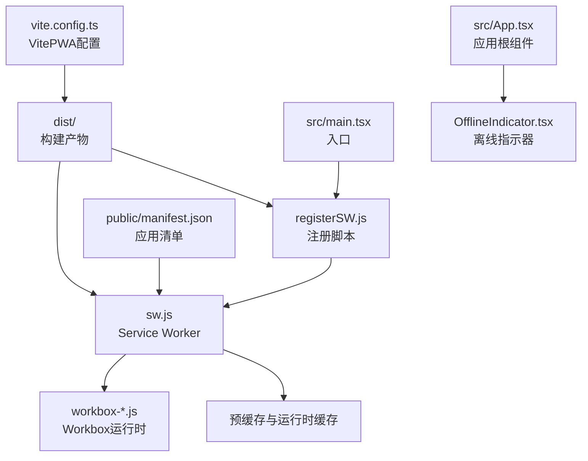
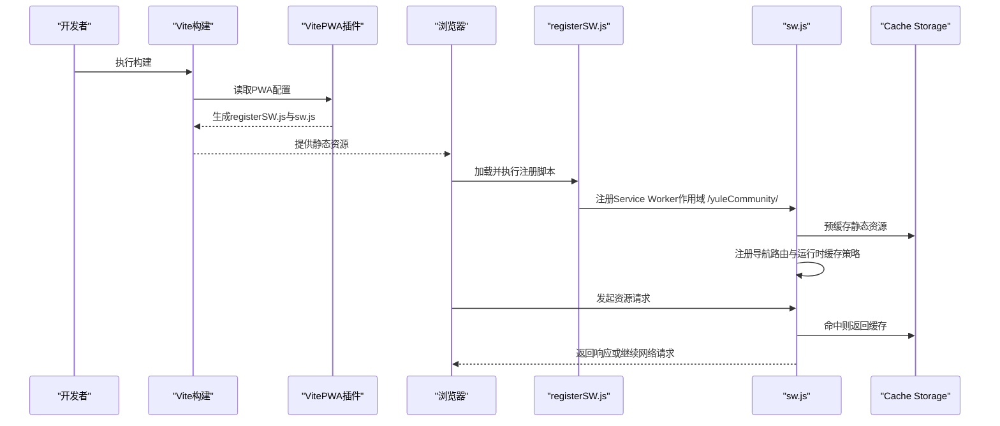
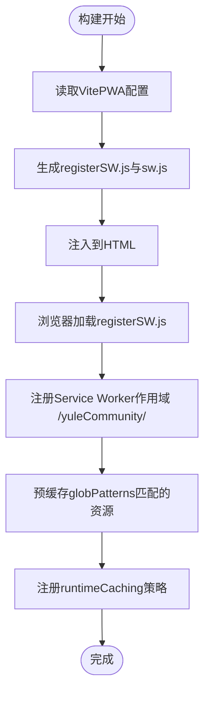
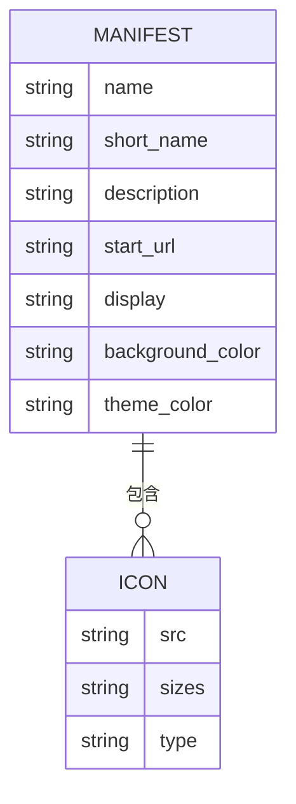
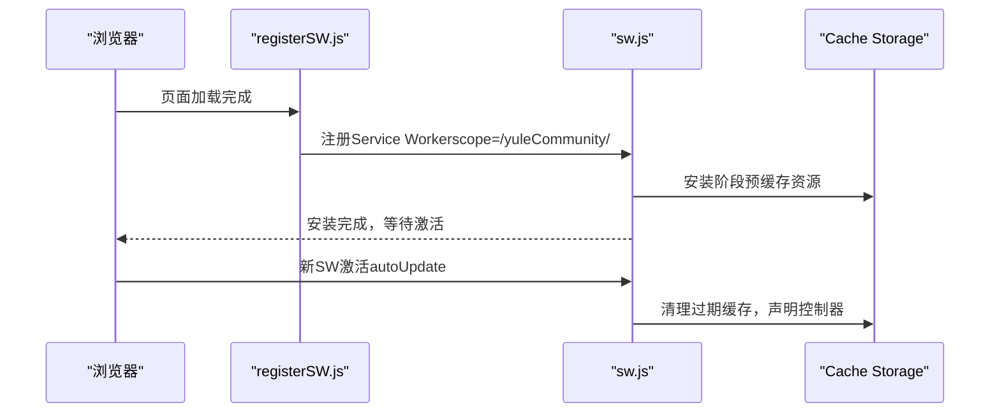
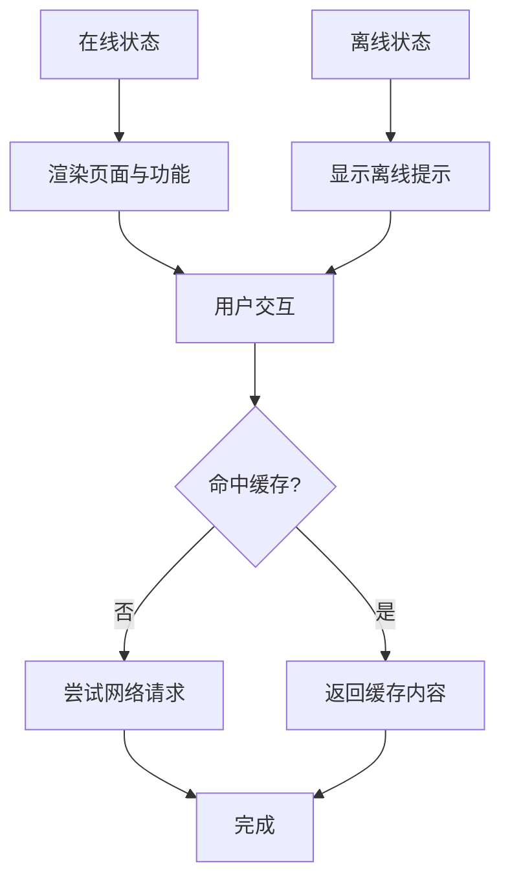
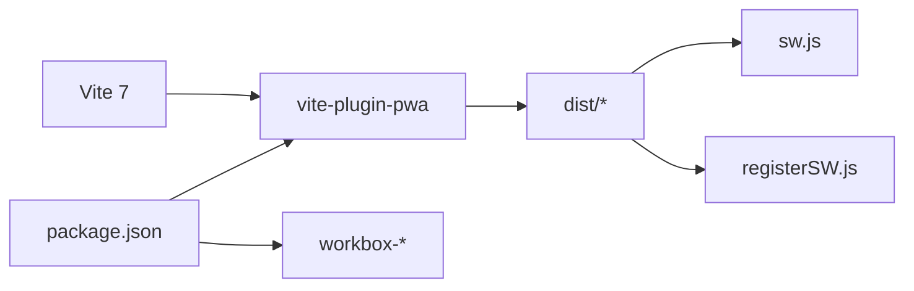

# PWA配置与安装

<cite>
**本文引用的文件**
- [vite.config.ts](file://vite.config.ts)
- [package.json](file://package.json)
- [public/manifest.json](file://public/manifest.json)
- [src/main.tsx](file://src/main.tsx)
- [src/App.tsx](file://src/App.tsx)
- [src/components/OfflineIndicator.tsx](file://src/components/OfflineIndicator.tsx)
- [src/pages/AdminDashboard.tsx](file://src/pages/AdminDashboard.tsx)
- [dist/registerSW.js](file://dist/registerSW.js)
- [dist/sw.js](file://dist/sw.js)
- [dist/workbox-cee25bd0.js](file://dist/workbox-cee25bd0.js)
</cite>

## 目录
1. [简介](#简介)
2. [项目结构](#项目结构)
3. [核心组件](#核心组件)
4. [架构总览](#架构总览)
5. [详细组件分析](#详细组件分析)
6. [依赖关系分析](#依赖关系分析)
7. [性能考量](#性能考量)
8. [故障排除指南](#故障排除指南)
9. [结论](#结论)
10. [附录](#附录)

## 简介
本文件面向YuleTech社区技术平台的PWA配置与安装能力，系统化梳理VitePWA插件配置、Service Worker与Workbox集成、应用清单（manifest）结构与字段、以及安装与离线体验实现方式。文档同时覆盖不同浏览器的兼容性差异、安装触发条件、用户提示策略、安装状态检测与离线可用性验证，并给出最佳实践与性能优化建议。

## 项目结构
围绕PWA的关键文件与产物如下：
- 构建配置：vite.config.ts中启用VitePWA插件并配置registerType、Workbox策略与缓存规则
- 应用清单：public/manifest.json定义应用名称、显示模式、主题色、背景色与图标集
- 运行时注入：构建后生成dist/registerSW.js用于在浏览器加载完成后注册Service Worker
- Service Worker与预缓存：dist/sw.js由Workbox生成，包含预缓存清单、导航路由与运行时缓存策略
- 前端集成：src/main.tsx中通过插件自动注入的registerSW.js完成注册；src/App.tsx挂载离线指示器等组件
- 状态展示：src/pages/AdminDashboard.tsx展示“PWA状态”等系统信息

**图表来源**
- [vite.config.ts:1-32](file://vite.config.ts#L1-L32)
- [dist/registerSW.js:1-1](file://dist/registerSW.js#L1-L1)
- [dist/sw.js:1-2](file://dist/sw.js#L1-L2)
- [dist/workbox-cee25bd0.js:1-2](file://dist/workbox-cee25bd0.js#L1-L2)
- [public/manifest.json:1-22](file://public/manifest.json#L1-L22)
- [src/main.tsx:1-22](file://src/main.tsx#L1-L22)
- [src/App.tsx:1-118](file://src/App.tsx#L1-L118)
- [src/components/OfflineIndicator.tsx:1-28](file://src/components/OfflineIndicator.tsx#L1-L28)

**章节来源**
- [vite.config.ts:1-32](file://vite.config.ts#L1-L32)
- [public/manifest.json:1-22](file://public/manifest.json#L1-L22)
- [dist/registerSW.js:1-1](file://dist/registerSW.js#L1-L1)
- [dist/sw.js:1-2](file://dist/sw.js#L1-L2)
- [src/main.tsx:1-22](file://src/main.tsx#L1-L22)
- [src/App.tsx:1-118](file://src/App.tsx#L1-L118)

## 核心组件
- VitePWA插件配置
  - registerType: autoUpdate（自动更新）
  - manifest: false（不自动生成，使用自定义清单）
  - Workbox:
    - globPatterns: 缓存静态资源类型
    - maximumFileSizeToCacheInBytes: 最大缓存文件大小
    - runtimeCaching: 对外部字体CDN采用CacheFirst策略并指定缓存名
- 应用清单（manifest）
  - name/short_name/description：应用名称与描述
  - start_url/display/background_color/theme_color：启动路径、显示模式与主题色
  - icons：图标集（SVG格式，192x192与512x512）
- Service Worker注册与生命周期
  - 注册脚本：dist/registerSW.js在window load事件后注册sw.js，作用域为/yuleCommunity/
  - SW主文件：dist/sw.js由Workbox生成，执行skipWaiting、clientsClaim、预缓存与导航路由注册
- 离线体验
  - OfflineIndicator组件监听online/offline事件，离线时固定顶部提示
  - AdminDashboard页面展示“PWA状态”用于运维监控

**章节来源**
- [vite.config.ts:10-25](file://vite.config.ts#L10-L25)
- [public/manifest.json:1-22](file://public/manifest.json#L1-L22)
- [dist/registerSW.js:1-1](file://dist/registerSW.js#L1-L1)
- [dist/sw.js:1-2](file://dist/sw.js#L1-L2)
- [src/components/OfflineIndicator.tsx:1-28](file://src/components/OfflineIndicator.tsx#L1-L28)
- [src/pages/AdminDashboard.tsx:288-297](file://src/pages/AdminDashboard.tsx#L288-L297)

## 架构总览
下图展示了从构建到运行时的PWA全链路：VitePWA生成Service Worker与注册脚本，浏览器加载时执行注册，SW接管网络请求并进行预缓存与运行时缓存，前端组件提供离线提示与状态展示。

**图表来源**
- [vite.config.ts:10-25](file://vite.config.ts#L10-L25)
- [dist/registerSW.js:1-1](file://dist/registerSW.js#L1-L1)
- [dist/sw.js:1-2](file://dist/sw.js#L1-L2)

## 详细组件分析

### VitePWA配置与Workbox策略
- 关键参数说明
  - registerType: autoUpdate
    - 含义：启用自动更新模式，当新版本就绪时自动激活并刷新页面
    - 影响：提升用户体验，减少手动刷新成本
  - manifest: false
    - 含义：禁用插件自动生成manifest，使用自定义清单文件
    - 影响：便于精确控制图标、主题色、启动路径等
  - workbox.globPatterns
    - 含义：匹配需要缓存的静态资源类型（如js/css/html/ico/png/svg/woff2）
    - 影响：决定预缓存清单规模与离线可用范围
  - workbox.maximumFileSizeToCacheInBytes
    - 含义：超过阈值的文件不会被缓存
    - 影响：避免大体积资源占用缓存空间
  - workbox.runtimeCaching
    - 含义：对特定URL模式（如外部字体CDN）采用CacheFirst策略并指定缓存名
    - 影响：提升第三方资源加载稳定性与性能

**图表来源**
- [vite.config.ts:10-25](file://vite.config.ts#L10-L25)
- [dist/registerSW.js:1-1](file://dist/registerSW.js#L1-L1)
- [dist/sw.js:1-2](file://dist/sw.js#L1-L2)

**章节来源**
- [vite.config.ts:10-25](file://vite.config.ts#L10-L25)

### 应用清单（manifest）结构与字段
- 字段说明
  - name：完整应用名称
  - short_name：短名称，用于桌面/启动器显示
  - description：应用描述
  - start_url：应用启动路径
  - display：显示模式（standalone）
  - background_color：背景色
  - theme_color：主题色
  - icons：图标数组，包含192x192与512x512 SVG图标
- 设计要点
  - 图标采用SVG格式，利于缩放与主题适配
  - 主题色与背景色与品牌一致，确保安装后视觉统一
  - 启动路径与构建base一致，避免安装后跳转异常

**图表来源**
- [public/manifest.json:1-22](file://public/manifest.json#L1-L22)

**章节来源**
- [public/manifest.json:1-22](file://public/manifest.json#L1-L22)

### Service Worker注册流程与安装触发条件
- 注册流程
  - 浏览器加载registerSW.js后，在window load事件触发时调用navigator.serviceWorker.register
  - 注册目标为/yuleCommunity/sw.js，作用域为/yuleCommunity/
- 安装触发条件
  - 首次访问或刷新页面会触发Service Worker安装
  - 当存在新版本且registerType为autoUpdate时，会自动激活并更新
- 用户交互优化
  - 通过AdminDashboard展示“PWA状态”，便于运维与用户感知
  - OfflineIndicator在离线时提供即时反馈，改善体验

**图表来源**
- [dist/registerSW.js:1-1](file://dist/registerSW.js#L1-L1)
- [dist/sw.js:1-2](file://dist/sw.js#L1-L2)
- [src/pages/AdminDashboard.tsx:288-297](file://src/pages/AdminDashboard.tsx#L288-L297)

**章节来源**
- [dist/registerSW.js:1-1](file://dist/registerSW.js#L1-L1)
- [dist/sw.js:1-2](file://dist/sw.js#L1-L2)
- [src/pages/AdminDashboard.tsx:288-297](file://src/pages/AdminDashboard.tsx#L288-L297)

### 离线可用性与用户体验
- 离线指示器
  - 组件监听online/offline事件，离线时在页面顶部固定提示
  - 有助于用户理解当前网络状态与功能限制
- 导航与资源缓存
  - Workbox注册NavigationRoute，确保单页应用路由在离线时可回退到index.html
  - 第三方字体采用CacheFirst策略，降低CDN波动带来的影响

**图表来源**
- [src/components/OfflineIndicator.tsx:1-28](file://src/components/OfflineIndicator.tsx#L1-L28)
- [dist/sw.js:1-2](file://dist/sw.js#L1-L2)

**章节来源**
- [src/components/OfflineIndicator.tsx:1-28](file://src/components/OfflineIndicator.tsx#L1-L28)
- [dist/sw.js:1-2](file://dist/sw.js#L1-L2)

## 依赖关系分析
- 构建与运行时依赖
  - 依赖vite-plugin-pwa以启用PWA能力
  - 依赖workbox相关包以生成Service Worker与缓存策略
- 版本与兼容性
  - 插件与Workbox版本要求Node 16及以上
  - 项目使用Vite 7与React生态，配合Workbox 7

**图表来源**
- [package.json:25-25](file://package.json#L25-L25)
- [package.json:43-43](file://package.json#L43-L43)

**章节来源**
- [package.json:25-25](file://package.json#L25-L25)
- [package.json:43-43](file://package.json#L43-L43)

## 性能考量
- 缓存策略优化
  - 使用globPatterns限定缓存范围，避免不必要的资源进入缓存
  - 对大文件设置maximumFileSizeToCacheInBytes上限，防止缓存膨胀
  - 对第三方字体采用CacheFirst并命名缓存，提升稳定性与复用率
- 预缓存与清理
  - 预缓存静态资源，缩短首开时间
  - 在激活阶段清理过期缓存，保持缓存集合整洁
- 资源加载
  - 将关键资源纳入预缓存清单，确保离线可用
  - 对非关键资源采用按需加载与运行时缓存策略

[本节为通用性能建议，无需具体文件引用]

## 故障排除指南
- 安装状态检测
  - 在AdminDashboard中查看“PWA状态”，若显示“已注册”，表示Service Worker已成功注册
  - 若显示“未支持”或“未注册”，检查浏览器是否支持Service Worker与registerSW.js是否正确注入
- 离线功能验证
  - 切换至离线模式，观察OfflineIndicator是否出现
  - 访问关键页面，确认导航路由是否能回退到index.html
- 缓存问题排查
  - 清理浏览器缓存与Service Worker后重新加载
  - 检查sw.js中的预缓存清单与runtimeCaching配置是否符合预期
- 安装体验差异
  - 不同浏览器对PWA安装提示与行为存在差异，建议在主流浏览器中分别测试
  - 确保manifest字段完整且图标规格齐全，避免安装失败或显示异常

**章节来源**
- [src/pages/AdminDashboard.tsx:288-297](file://src/pages/AdminDashboard.tsx#L288-L297)
- [src/components/OfflineIndicator.tsx:1-28](file://src/components/OfflineIndicator.tsx#L1-L28)
- [dist/sw.js:1-2](file://dist/sw.js#L1-L2)

## 结论
本项目通过VitePWA插件与Workbox实现了完整的PWA能力：自动更新、预缓存与运行时缓存、导航路由回退、离线提示与状态展示。结合自定义manifest与作用域配置，提供了稳定、一致的跨浏览器安装与使用体验。建议持续关注缓存策略与第三方资源的稳定性，并在多浏览器环境下进行安装与离线场景的回归测试。

[本节为总结性内容，无需具体文件引用]

## 附录
- 最佳实践
  - 明确registerType与更新策略，权衡用户体验与资源消耗
  - 精准配置globPatterns与runtimeCaching，避免缓存膨胀
  - 完善manifest字段与图标规格，确保安装体验一致
  - 在AdminDashboard中持续监控PWA状态与本地存储使用情况
- 兼容性提示
  - Node 16+环境以满足插件与Workbox要求
  - 不同浏览器对PWA安装提示与行为存在差异，建议在Chrome、Edge、Firefox、Safari中分别验证

[本节为通用建议，无需具体文件引用]