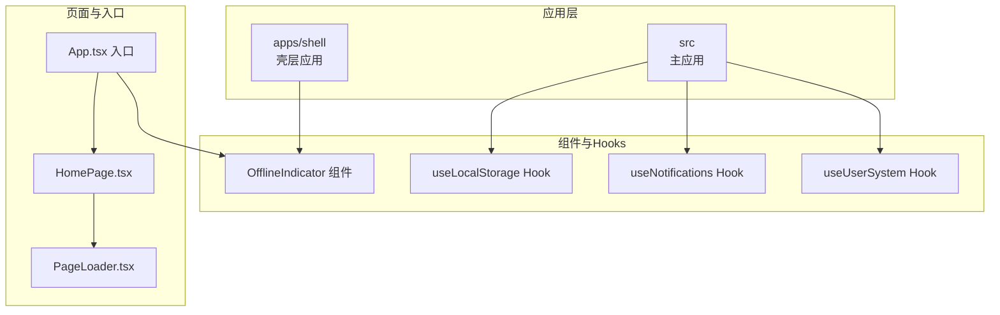
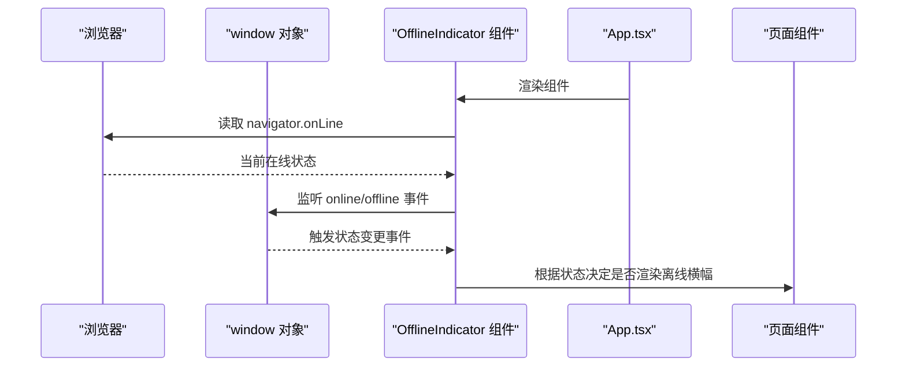
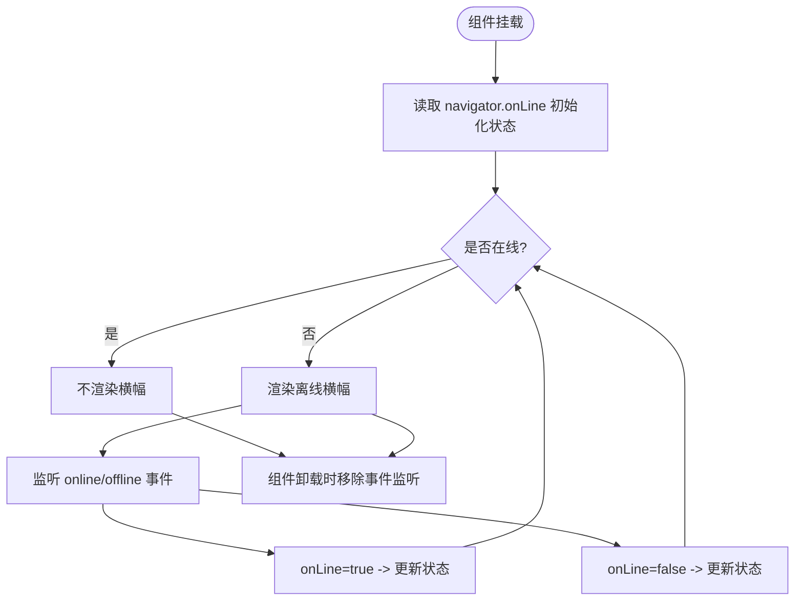
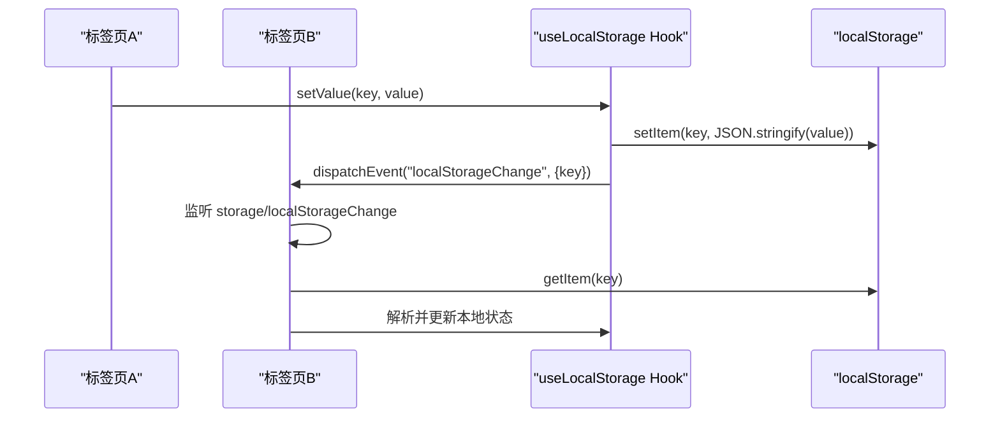
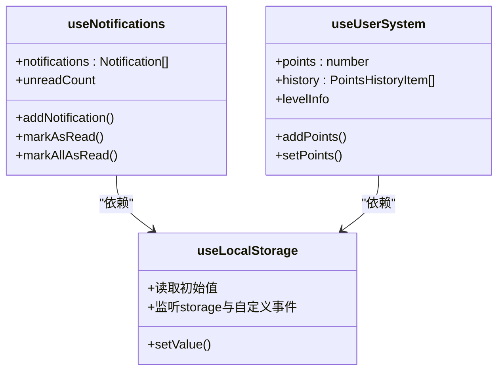
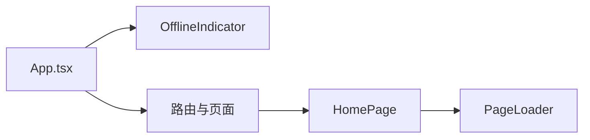
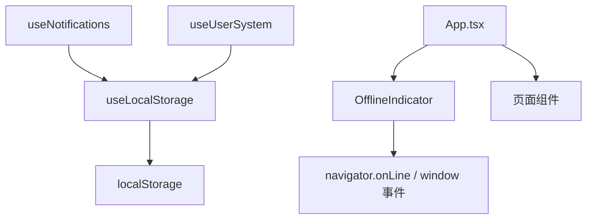

# 离线检测与网络监控

<cite>
**本文引用的文件**
- [OfflineIndicator.tsx](file://src/components/OfflineIndicator.tsx)
- [OfflineIndicator.js](file://apps/shell/src/components/OfflineIndicator.js)
- [useLocalStorage.ts](file://src/hooks/useLocalStorage.ts)
- [useNotifications.ts](file://src/hooks/useNotifications.ts)
- [useUserSystem.ts](file://src/hooks/useUserSystem.ts)
- [App.tsx](file://src/App.tsx)
- [PageLoader.tsx](file://src/components/PageLoader.tsx)
- [HomePage.tsx](file://src/pages/HomePage.tsx)
- [communityData.ts](file://src/data/communityData.ts)
- [package.json](file://package.json)
</cite>

## 目录
1. [简介](#简介)
2. [项目结构](#项目结构)
3. [核心组件](#核心组件)
4. [架构总览](#架构总览)
5. [详细组件分析](#详细组件分析)
6. [依赖关系分析](#依赖关系分析)
7. [性能考量](#性能考量)
8. [故障排查指南](#故障排查指南)
9. [结论](#结论)
10. [附录](#附录)

## 简介
本文件面向 YuleTech 社区技术平台的离线检测与网络监控能力，围绕 navigator.onLine API 的使用与事件监听机制、OfflineIndicator 组件的实现原理、网络状态持久化与本地存储同步策略、以及离线模式下的用户体验优化与错误处理进行系统化文档化。文档同时给出关键流程图与时序图，帮助开发者快速理解与扩展。

## 项目结构
YuleTech 采用多应用架构，核心功能集中在 apps/shell 与 src 目录中：
- apps/shell 提供壳层应用与通用组件（含 OfflineIndicator）
- src 提供主应用入口、页面、组件与 hooks（含 useLocalStorage、useNotifications、useUserSystem）

图表来源
- [App.tsx](file://src/App.tsx)
- [OfflineIndicator.tsx](file://src/components/OfflineIndicator.tsx)
- [useLocalStorage.ts](file://src/hooks/useLocalStorage.ts)
- [useNotifications.ts](file://src/hooks/useNotifications.ts)
- [useUserSystem.ts](file://src/hooks/useUserSystem.ts)
- [HomePage.tsx](file://src/pages/HomePage.tsx)
- [PageLoader.tsx](file://src/components/PageLoader.tsx)

章节来源
- [App.tsx](file://src/App.tsx)
- [OfflineIndicator.tsx](file://src/components/OfflineIndicator.tsx)
- [useLocalStorage.ts](file://src/hooks/useLocalStorage.ts)
- [useNotifications.ts](file://src/hooks/useNotifications.ts)
- [useUserSystem.ts](file://src/hooks/useUserSystem.ts)
- [HomePage.tsx](file://src/pages/HomePage.tsx)
- [PageLoader.tsx](file://src/components/PageLoader.tsx)

## 核心组件
- OfflineIndicator：基于 navigator.onLine 与浏览器 online/offline 事件，实时感知网络状态并在离线时以横幅形式向用户反馈。
- useLocalStorage：封装 localStorage 读写与跨标签页同步，提供键级变更监听与自定义事件分发。
- useNotifications：基于 useLocalStorage 的通知持久化存储，支持新增、标记已读、未读计数等。
- useUserSystem：基于 useLocalStorage 的用户积分与等级持久化，支持规则与阈值的本地配置覆盖。
- App.tsx：应用入口，挂载 OfflineIndicator 与页面路由，负责整体布局与加载态展示。
- HomePage：演示本地存储的最小化模式开关，体现本地状态持久化与恢复。
- PageLoader：页面懒加载时的骨架屏组件，提升离线或弱网场景下的感知体验。

章节来源
- [OfflineIndicator.tsx](file://src/components/OfflineIndicator.tsx)
- [useLocalStorage.ts](file://src/hooks/useLocalStorage.ts)
- [useNotifications.ts](file://src/hooks/useNotifications.ts)
- [useUserSystem.ts](file://src/hooks/useUserSystem.ts)
- [App.tsx](file://src/App.tsx)
- [HomePage.tsx](file://src/pages/HomePage.tsx)
- [PageLoader.tsx](file://src/components/PageLoader.tsx)

## 架构总览
离线检测与网络监控的总体思路：
- 使用 navigator.onLine 初始状态与 window.online/offline 事件作为“主信号”
- OfflineIndicator 仅负责 UI 层的可见性控制与提示
- 业务侧通过 useLocalStorage 等 hook 实现数据持久化与跨标签页同步
- 页面加载与切换通过 PageLoader 提升弱网/离线体验

图表来源
- [OfflineIndicator.tsx](file://src/components/OfflineIndicator.tsx)
- [App.tsx](file://src/App.tsx)

## 详细组件分析

### OfflineIndicator 组件
- 状态来源：初始化读取 navigator.onLine；随后订阅 window.online 与 window.offline 事件动态更新
- 渲染策略：在线返回空（不渲染），离线渲染固定顶部横幅，包含图标与提示文案
- 生命周期：组件挂载时注册事件监听，卸载时移除，避免内存泄漏

图表来源
- [OfflineIndicator.tsx](file://src/components/OfflineIndicator.tsx)

章节来源
- [OfflineIndicator.tsx](file://src/components/OfflineIndicator.tsx)
- [OfflineIndicator.js](file://apps/shell/src/components/OfflineIndicator.js)

### 网络状态持久化与跨标签页同步
- useLocalStorage 封装了 localStorage 的读写、解析与异常处理
- 通过原生 storage 事件与自定义 localStorageChange 事件实现跨标签页同步
- setValue 内部会 dispatch 自定义事件，其他窗口监听后主动从 localStorage 读取最新值

图表来源
- [useLocalStorage.ts](file://src/hooks/useLocalStorage.ts)

章节来源
- [useLocalStorage.ts](file://src/hooks/useLocalStorage.ts)

### 通知与用户系统的持久化
- useNotifications 基于 useLocalStorage 存储通知列表，支持新增、标记已读、批量标记与未读计数
- useUserSystem 基于 useLocalStorage 存储用户积分与历史，支持规则与等级阈值的本地覆盖

图表来源
- [useNotifications.ts](file://src/hooks/useNotifications.ts)
- [useUserSystem.ts](file://src/hooks/useUserSystem.ts)
- [useLocalStorage.ts](file://src/hooks/useLocalStorage.ts)

章节来源
- [useNotifications.ts](file://src/hooks/useNotifications.ts)
- [useUserSystem.ts](file://src/hooks/useUserSystem.ts)
- [useLocalStorage.ts](file://src/hooks/useLocalStorage.ts)

### 页面加载与离线体验
- App.tsx 在公共路由区域挂载 OfflineIndicator 与 Navbar/Footer，保证全局离线提示
- PageLoader 在路由懒加载时提供骨架屏，改善弱网/离线时的感知体验
- HomePage 展示本地存储的最小化模式开关，体现本地状态恢复

图表来源
- [App.tsx](file://src/App.tsx)
- [HomePage.tsx](file://src/pages/HomePage.tsx)
- [PageLoader.tsx](file://src/components/PageLoader.tsx)

章节来源
- [App.tsx](file://src/App.tsx)
- [HomePage.tsx](file://src/pages/HomePage.tsx)
- [PageLoader.tsx](file://src/components/PageLoader.tsx)

## 依赖关系分析
- OfflineIndicator 依赖浏览器 navigator.onLine 与 window 事件，无第三方网络库依赖
- useLocalStorage 依赖浏览器 localStorage 与 storage 事件，无外部持久化依赖
- useNotifications 与 useUserSystem 依赖 useLocalStorage，间接依赖 localStorage
- App.tsx 依赖 OfflineIndicator 与页面组件，负责全局布局与加载态
- package.json 中未发现与离线检测直接相关的第三方网络库，项目采用浏览器原生能力

图表来源
- [OfflineIndicator.tsx](file://src/components/OfflineIndicator.tsx)
- [useLocalStorage.ts](file://src/hooks/useLocalStorage.ts)
- [useNotifications.ts](file://src/hooks/useNotifications.ts)
- [useUserSystem.ts](file://src/hooks/useUserSystem.ts)
- [App.tsx](file://src/App.tsx)

章节来源
- [package.json](file://package.json)

## 性能考量
- 事件监听轻量：OfflineIndicator 仅在组件生命周期内注册/移除 online/offline 监听，避免常驻开销
- localStorage 访问：useLocalStorage 采用 JSON 序列化/反序列化，注意大对象写入的性能影响；可通过拆分键或延迟写入优化
- 跨标签页同步：storage 事件与自定义事件均在主线程触发，避免阻塞；建议在高频写入场景下合并更新批次
- 页面懒加载：PageLoader 提升弱网/离线体验，减少首屏资源压力

## 故障排查指南
- 离线横幅不出现
  - 检查 navigator.onLine 初始值与 window 事件是否正常触发
  - 确认组件未被条件渲染提前退出
- 离线状态不更新
  - 确认组件卸载时是否正确移除了事件监听
  - 检查是否存在全局样式覆盖导致视觉不可见
- 本地存储不同步
  - 确认 storage 事件与自定义 localStorageChange 事件监听是否生效
  - 检查 JSON 解析异常分支是否被触发（parse error 会被忽略）
- 通知/积分丢失
  - 检查 localStorage 可用性与容量上限
  - 确认 setValue 异常捕获日志，定位写入失败原因
- 页面加载缓慢
  - 检查懒加载路由与 PageLoader 的使用
  - 评估静态资源与第三方脚本对首屏的影响

章节来源
- [OfflineIndicator.tsx](file://src/components/OfflineIndicator.tsx)
- [useLocalStorage.ts](file://src/hooks/useLocalStorage.ts)
- [useNotifications.ts](file://src/hooks/useNotifications.ts)
- [useUserSystem.ts](file://src/hooks/useUserSystem.ts)
- [App.tsx](file://src/App.tsx)
- [PageLoader.tsx](file://src/components/PageLoader.tsx)

## 结论
YuleTech 社区技术平台的离线检测与网络监控以浏览器原生能力为核心，结合轻量的 React 组件与本地存储持久化，实现了：
- 实时在线状态感知与 UI 反馈
- 跨标签页状态同步
- 通知与用户系统的本地持久化
- 离线/弱网场景下的体验优化

该方案具备实现简单、可维护性强、无需额外网络库的优势，适合在前端单页应用中快速落地。

## 附录
- 术语
  - 离线模式：浏览器 navigator.onLine 为 false 的状态
  - 跨标签页同步：通过 storage 事件与自定义事件实现的多标签页状态一致性
- 最佳实践
  - 仅在必要时进行网络请求，离线时提供降级 UI
  - 对高频写入的本地存储进行节流/去抖
  - 在关键业务（如通知、积分）增加本地回退与提示