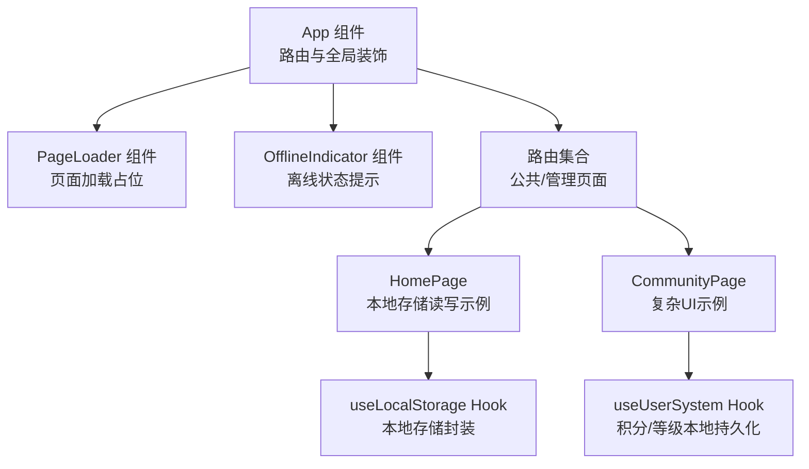
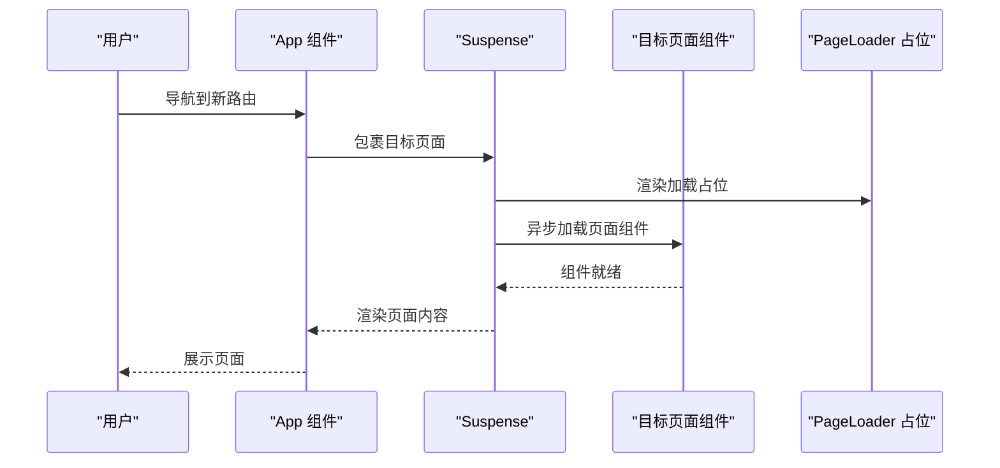
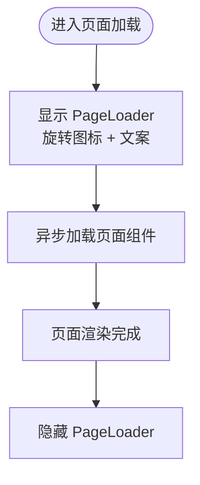
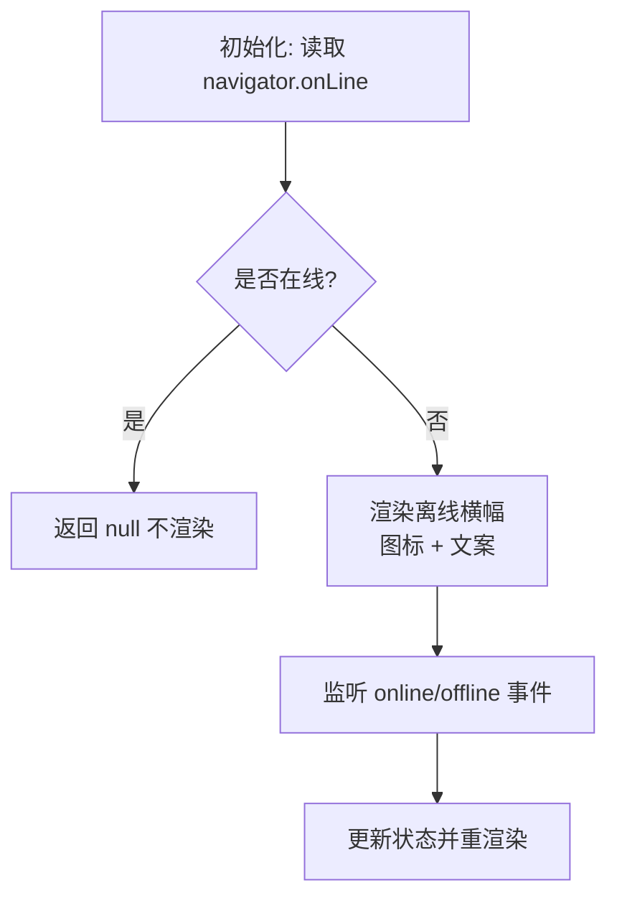
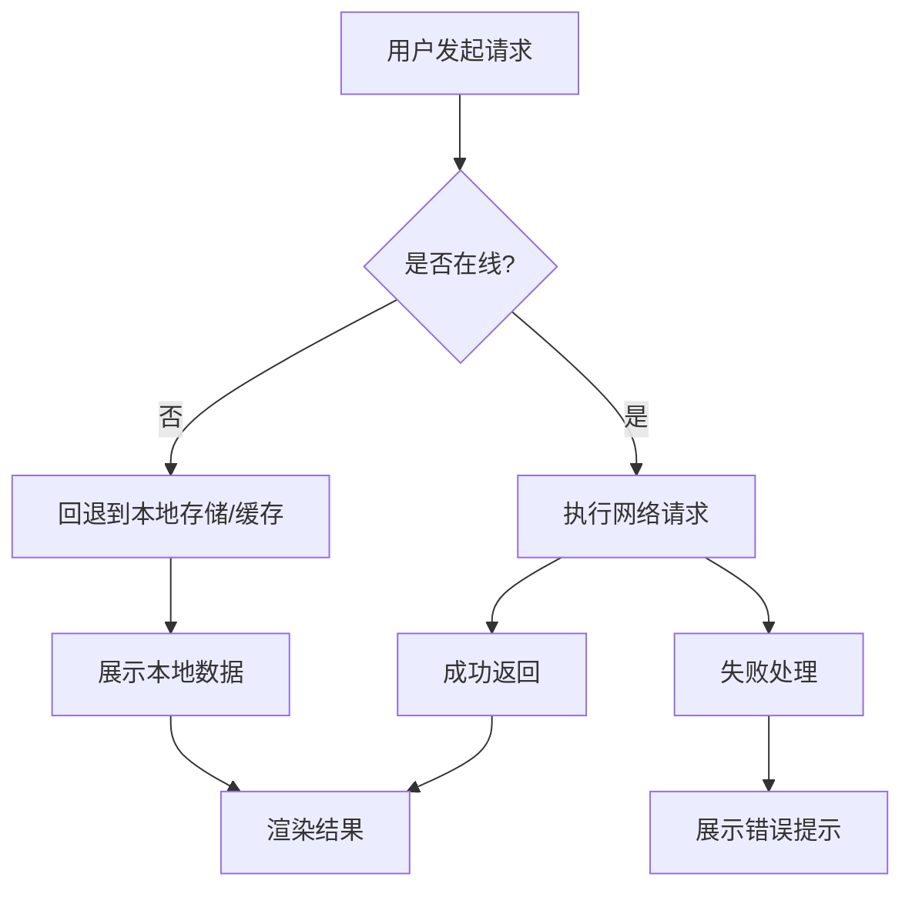
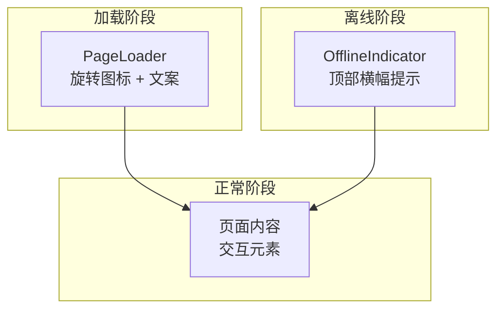
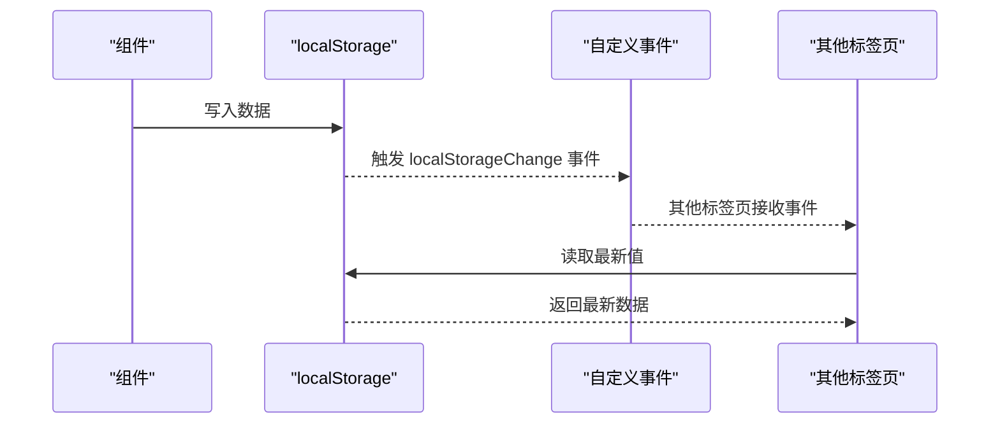
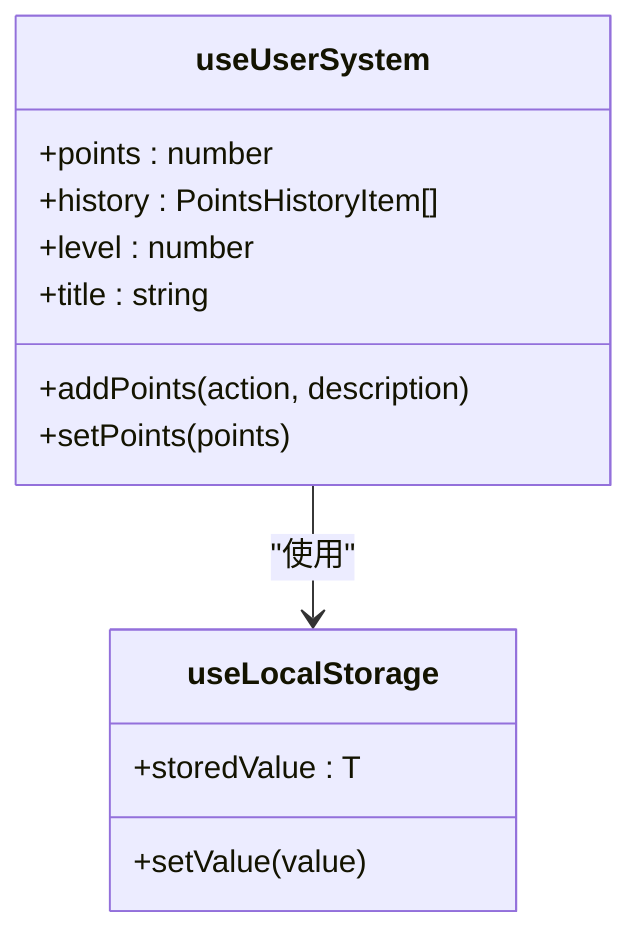
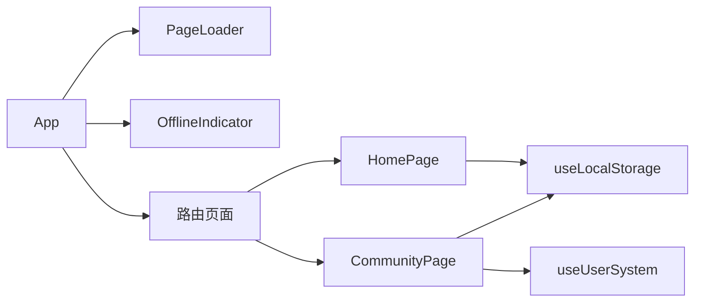

# 离线用户体验设计

<cite>
**本文档引用的文件**
- [src/components/PageLoader.tsx](file://src/components/PageLoader.tsx)
- [src/components/OfflineIndicator.tsx](file://src/components/OfflineIndicator.tsx)
- [src/App.tsx](file://src/App.tsx)
- [src/hooks/useLocalStorage.ts](file://src/hooks/useLocalStorage.ts)
- [src/hooks/useUserSystem.ts](file://src/hooks/useUserSystem.ts)
- [apps/admin/src/hooks/useLocalStorage.js](file://apps/admin/src/hooks/useLocalStorage.js)
- [apps/admin/src/hooks/useUserSystem.js](file://apps/admin/src/hooks/useUserSystem.js)
- [apps/shell/src/components/PageLoader.js](file://apps/shell/src/components/PageLoader.js)
- [apps/shell/src/components/OfflineIndicator.js](file://apps/shell/src/components/OfflineIndicator.js)
- [src/pages/HomePage.tsx](file://src/pages/HomePage.tsx)
- [src/pages/CommunityPage.tsx](file://src/pages/CommunityPage.tsx)
</cite>

## 目录
1. [简介](#简介)
2. [项目结构](#项目结构)
3. [核心组件](#核心组件)
4. [架构总览](#架构总览)
5. [详细组件分析](#详细组件分析)
6. [依赖关系分析](#依赖关系分析)
7. [性能考虑](#性能考虑)
8. [故障排除指南](#故障排除指南)
9. [结论](#结论)
10. [附录](#附录)

## 简介
本文件面向YuleTech社区技术平台的离线用户体验设计，系统性梳理离线页面展示逻辑、加载状态管理、离线提示设计、功能降级策略、响应式交互、本地存储与同步机制、视觉设计规范以及用户测试与持续优化方法。文档以仓库现有代码为基础，结合组件职责与调用关系，给出可落地的设计与实现建议。

## 项目结构
YuleTech采用多应用架构（apps目录）与共享核心（src目录）相结合的方式组织代码。离线体验相关的关键位置如下：
- 根组件App负责路由与全局加载器/离线指示器的挂载
- PageLoader用于页面切换时的加载占位
- OfflineIndicator用于实时显示离线状态
- useLocalStorage与useUserSystem提供本地持久化能力
- 各页面组件在渲染时读取本地存储，确保离线可用

**图表来源**
- [src/App.tsx:30-115](file://src/App.tsx#L30-L115)
- [src/components/PageLoader.tsx:3-10](file://src/components/PageLoader.tsx#L3-L10)
- [src/components/OfflineIndicator.tsx:4-27](file://src/components/OfflineIndicator.tsx#L4-L27)
- [src/hooks/useLocalStorage.ts:3-58](file://src/hooks/useLocalStorage.ts#L3-L58)
- [src/hooks/useUserSystem.ts:91-132](file://src/hooks/useUserSystem.ts#L91-L132)
- [src/pages/HomePage.tsx:15-87](file://src/pages/HomePage.tsx#L15-L87)
- [src/pages/CommunityPage.tsx:245-666](file://src/pages/CommunityPage.tsx#L245-L666)

**章节来源**
- [src/App.tsx:30-115](file://src/App.tsx#L30-L115)

## 核心组件
本节聚焦离线体验的核心组件及其职责边界：
- PageLoader：统一的页面加载占位，提供一致的加载反馈
- OfflineIndicator：全局离线提示，基于浏览器在线事件动态更新
- useLocalStorage：通用本地存储Hook，支持跨标签页事件同步
- useUserSystem：用户积分与等级的本地持久化与计算

**章节来源**
- [src/components/PageLoader.tsx:3-10](file://src/components/PageLoader.tsx#L3-L10)
- [src/components/OfflineIndicator.tsx:4-27](file://src/components/OfflineIndicator.tsx#L4-L27)
- [src/hooks/useLocalStorage.ts:3-58](file://src/hooks/useLocalStorage.ts#L3-L58)
- [src/hooks/useUserSystem.ts:91-132](file://src/hooks/useUserSystem.ts#L91-L132)

## 架构总览
离线体验的运行时架构由“全局装饰 + 页面懒加载 + 本地存储”构成。App作为根组件，统一注入PageLoader与OfflineIndicator；页面通过Suspense懒加载，避免阻塞；本地存储为离线场景提供数据保障。

**图表来源**
- [src/App.tsx:36-106](file://src/App.tsx#L36-L106)
- [src/components/PageLoader.tsx:3-10](file://src/components/PageLoader.tsx#L3-L10)

**章节来源**
- [src/App.tsx:30-115](file://src/App.tsx#L30-L115)

## 详细组件分析

### PageLoader 组件
- 设计目标：在页面切换或异步加载时提供明确的加载反馈，避免空白屏造成的不确定性
- 实现要点：
  - 使用旋转加载图标与文案提示，居中布局，最小高度保证在移动端有足够占位
  - 与Suspense配合，作为fallback直接替换页面内容
- 适用场景：所有通过Suspense包裹的页面组件

**图表来源**
- [src/components/PageLoader.tsx:3-10](file://src/components/PageLoader.tsx#L3-L10)
- [src/App.tsx:36-106](file://src/App.tsx#L36-L106)

**章节来源**
- [src/components/PageLoader.tsx:3-10](file://src/components/PageLoader.tsx#L3-L10)
- [apps/shell/src/components/PageLoader.js:3-5](file://apps/shell/src/components/PageLoader.js#L3-L5)

### OfflineIndicator 组件
- 设计目标：在离线状态下向用户发出明确提示，避免误以为页面异常
- 实现要点：
  - 初始状态根据navigator.onLine判断
  - 监听online/offline事件动态更新状态
  - 在线时返回null，离线时固定顶部横幅提示
- 视觉设计：使用醒目的背景色与对比色文本，包含简洁图标与说明文案

**图表来源**
- [src/components/OfflineIndicator.tsx:4-27](file://src/components/OfflineIndicator.tsx#L4-L27)
- [src/App.tsx:75-75](file://src/App.tsx#L75-L75)

**章节来源**
- [src/components/OfflineIndicator.tsx:4-27](file://src/components/OfflineIndicator.tsx#L4-L27)
- [apps/shell/src/components/OfflineIndicator.js:4-18](file://apps/shell/src/components/OfflineIndicator.js#L4-L18)
- [src/App.tsx:75-75](file://src/App.tsx#L75-L75)

### 加载状态管理与功能降级策略
- 加载状态管理：
  - 通过Suspense + PageLoader实现统一的页面级加载反馈
  - 对于需要即时渲染的装饰层（如离线提示），直接在App根部挂载，不依赖懒加载
- 功能降级策略：
  - 可访问功能：静态内容、本地存储读取、离线缓存数据
  - 不可用功能：网络请求、实时同步、需要在线验证的功能
  - 优雅降级：对不可用功能提供替代方案或禁用态提示

**图表来源**
- [src/App.tsx:36-106](file://src/App.tsx#L36-L106)
- [src/hooks/useLocalStorage.ts:3-58](file://src/hooks/useLocalStorage.ts#L3-L58)

**章节来源**
- [src/App.tsx:30-115](file://src/App.tsx#L30-L115)

### 响应式设计与交互反馈
- 加载动画：PageLoader采用稳定旋转动画，适配不同屏幕尺寸
- 错误状态：通过页面级错误边界与404页面提供清晰反馈
- 操作反馈：离线横幅固定顶部，避免遮挡主要内容；按钮在离线时可禁用或提示

**图表来源**
- [src/components/PageLoader.tsx:3-10](file://src/components/PageLoader.tsx#L3-L10)
- [src/components/OfflineIndicator.tsx:22-26](file://src/components/OfflineIndicator.tsx#L22-L26)
- [src/App.tsx:75-106](file://src/App.tsx#L75-L106)

**章节来源**
- [src/components/PageLoader.tsx:3-10](file://src/components/PageLoader.tsx#L3-L10)
- [src/components/OfflineIndicator.tsx:4-27](file://src/components/OfflineIndicator.tsx#L4-L27)

### 本地存储与同步机制
- 数据优先级：
  - 本地存储优先：页面首次渲染时从localStorage读取，保证离线可用
  - 远端数据次之：在线后异步拉取最新数据并合并
- 冲突解决：
  - 本地修改与远端变更冲突时，采用“最后写入获胜”或“合并策略”
  - 对于用户行为类数据（如积分、设置），优先保留本地最新值
- 一致性保证：
  - 通过自定义事件实现跨标签页同步
  - 对localStorage读写进行错误捕获，避免崩溃影响整体体验

**图表来源**
- [src/hooks/useLocalStorage.ts:14-25](file://src/hooks/useLocalStorage.ts#L14-L25)
- [src/hooks/useLocalStorage.ts:37-49](file://src/hooks/useLocalStorage.ts#L37-L49)

**章节来源**
- [src/hooks/useLocalStorage.ts:3-58](file://src/hooks/useLocalStorage.ts#L3-L58)
- [apps/admin/src/hooks/useLocalStorage.js:1-59](file://apps/admin/src/hooks/useLocalStorage.js#L1-L59)

### 用户系统与离线数据示例
- 用户系统数据（积分、历史记录、等级阈值）通过useUserSystem与useLocalStorage组合实现：
  - 默认规则与阈值可被管理员通过本地存储覆盖
  - 等级计算基于当前积分，离线时仍可正确显示

**图表来源**
- [src/hooks/useUserSystem.ts:91-132](file://src/hooks/useUserSystem.ts#L91-L132)
- [src/hooks/useLocalStorage.ts:3-58](file://src/hooks/useLocalStorage.ts#L3-L58)

**章节来源**
- [src/hooks/useUserSystem.ts:91-132](file://src/hooks/useUserSystem.ts#L91-L132)
- [apps/admin/src/hooks/useUserSystem.js:64-101](file://apps/admin/src/hooks/useUserSystem.js#L64-L101)

### 页面示例与离线可用性
- HomePage：演示本地存储读写与极简模式切换，离线时仍可读取历史设置
- CommunityPage：复杂UI示例，离线时可展示静态内容与本地缓存数据

**章节来源**
- [src/pages/HomePage.tsx:15-87](file://src/pages/HomePage.tsx#L15-L87)
- [src/pages/CommunityPage.tsx:245-666](file://src/pages/CommunityPage.tsx#L245-L666)

## 依赖关系分析
- 组件耦合：
  - App对PageLoader与OfflineIndicator存在直接依赖
  - 页面组件对useLocalStorage与useUserSystem存在间接依赖
- 外部依赖：
  - 浏览器在线状态API（navigator.onLine）
  - localStorage与自定义事件（localStorageChange）

**图表来源**
- [src/App.tsx:30-115](file://src/App.tsx#L30-L115)
- [src/pages/HomePage.tsx:15-87](file://src/pages/HomePage.tsx#L15-L87)
- [src/pages/CommunityPage.tsx:245-666](file://src/pages/CommunityPage.tsx#L245-L666)
- [src/hooks/useLocalStorage.ts:3-58](file://src/hooks/useLocalStorage.ts#L3-L58)
- [src/hooks/useUserSystem.ts:91-132](file://src/hooks/useUserSystem.ts#L91-L132)

**章节来源**
- [src/App.tsx:30-115](file://src/App.tsx#L30-L115)

## 性能考虑
- 懒加载与骨架屏：通过Suspense + PageLoader减少首屏阻塞，提升感知性能
- 本地优先：优先读取本地存储，避免网络抖动带来的卡顿
- 事件去抖：离线提示监听online/offline事件，避免频繁重渲染
- 存储优化：对localStorage读写进行错误捕获，防止异常扩散

## 故障排除指南
- 离线提示不出现：
  - 检查App中是否正确挂载OfflineIndicator
  - 确认浏览器支持navigator.onLine
- 加载占位不消失：
  - 检查Suspense包裹的页面组件是否正确导出
  - 确认异步模块加载无错误
- 本地数据未同步：
  - 检查自定义事件localStorageChange是否触发
  - 确认其他标签页是否监听storage与localStorageChange事件

**章节来源**
- [src/App.tsx:75-106](file://src/App.tsx#L75-L106)
- [src/components/OfflineIndicator.tsx:7-18](file://src/components/OfflineIndicator.tsx#L7-L18)
- [src/hooks/useLocalStorage.ts:37-55](file://src/hooks/useLocalStorage.ts#L37-L55)

## 结论
YuleTech的离线体验以“全局装饰 + 懒加载 + 本地存储”为核心，通过PageLoader与OfflineIndicator提供明确的加载与离线反馈，结合useLocalStorage与useUserSystem实现数据的本地持久化与跨标签页同步。该方案在保证离线可用性的同时，维持了良好的用户体验与可维护性。后续可在冲突解决策略、缓存更新机制与用户测试闭环方面进一步完善。

## 附录

### 视觉设计指南（离线状态）
- 颜色编码：使用高对比度的警示色（如暖色调）突出离线状态
- 图标选择：采用直观的网络/信号类图标，避免歧义
- 文案设计：简洁明确，说明当前状态与可能的影响范围
- 位置与层级：离线横幅固定顶部，确保可见性且不影响主要内容

### 用户测试与持续优化
- 测试方法：
  - 离线模式模拟：断开网络或使用开发者工具切换离线模式
  - 场景覆盖：页面切换、数据读取、交互反馈、错误处理
- 反馈收集：通过用户调研、埋点与日志分析收集离线体验数据
- 持续优化：基于反馈迭代加载策略、提示文案与功能降级方案