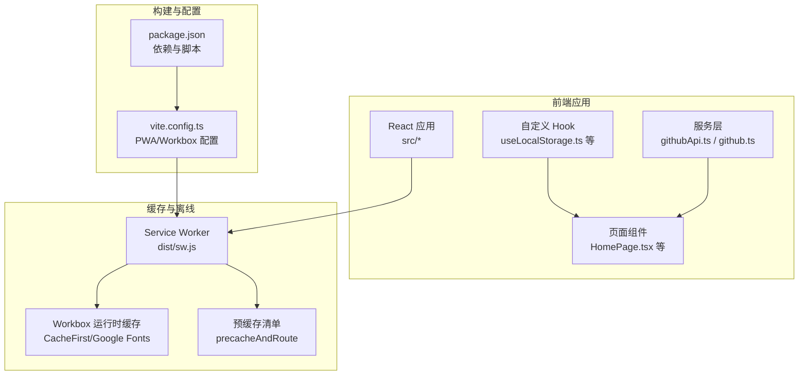
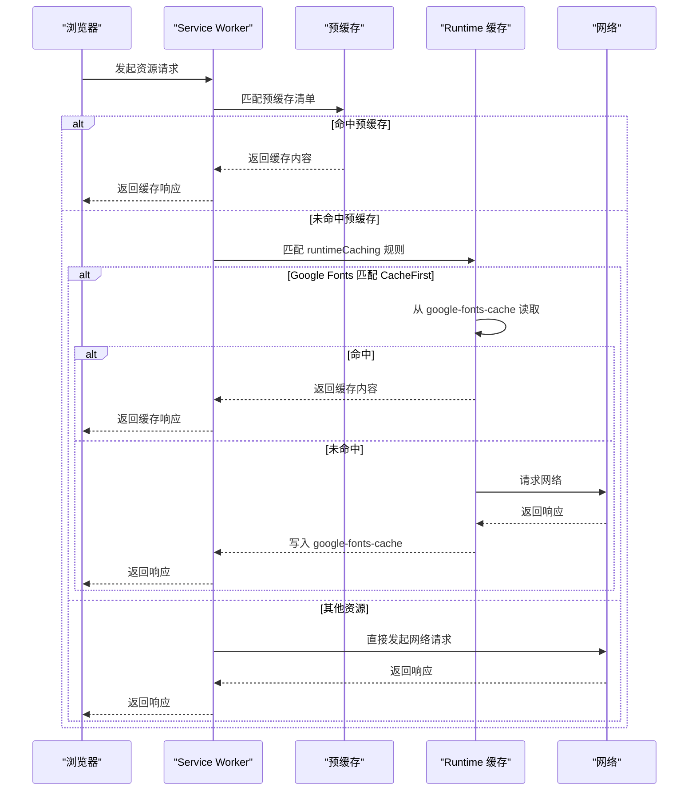
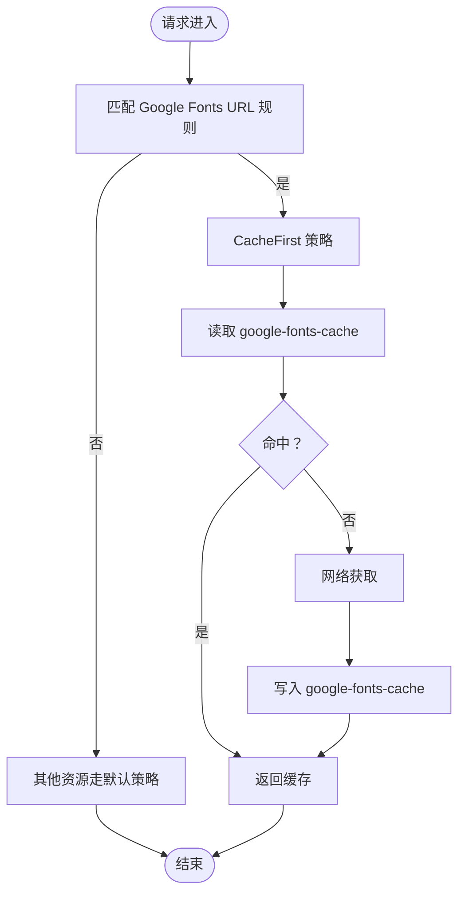
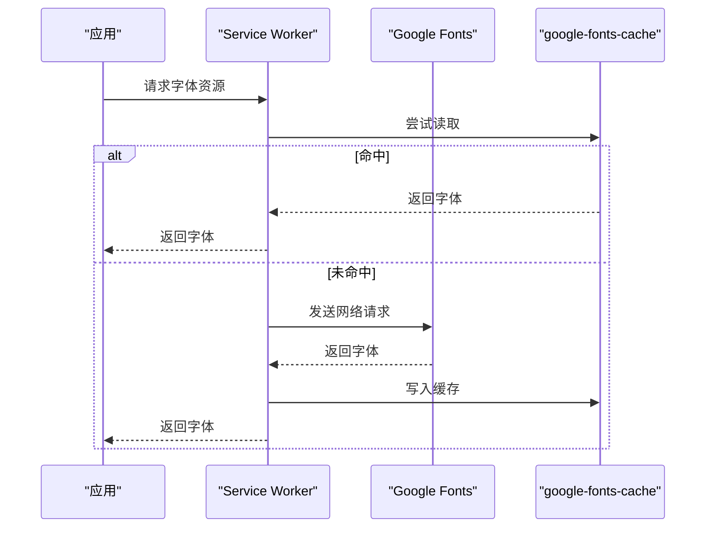
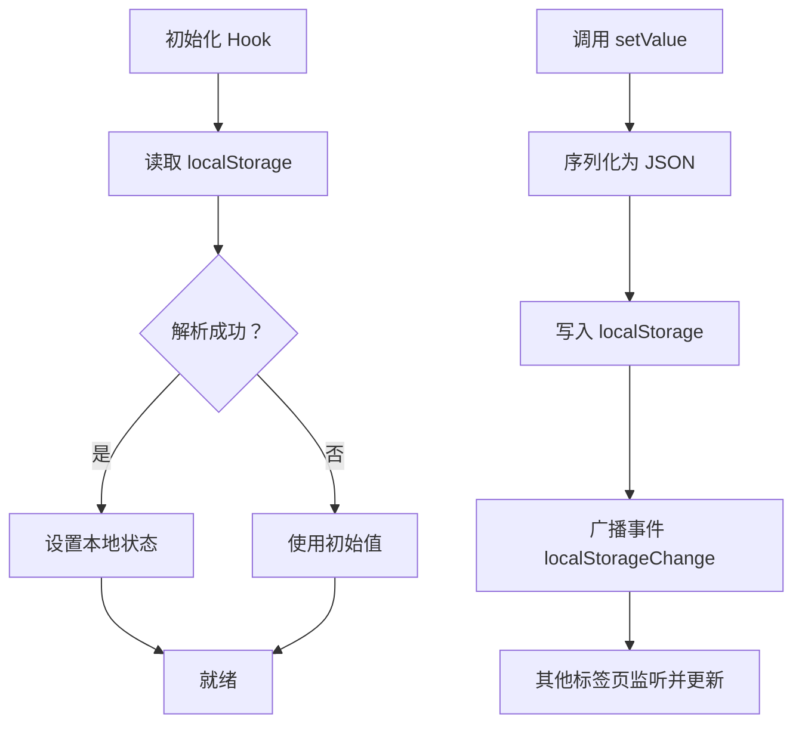
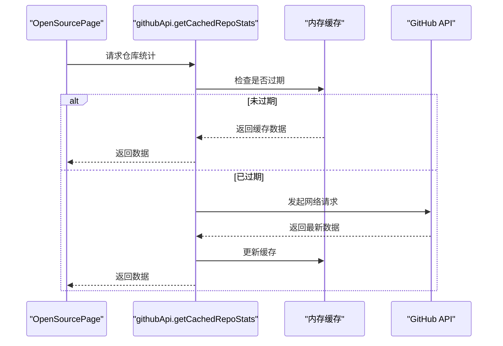
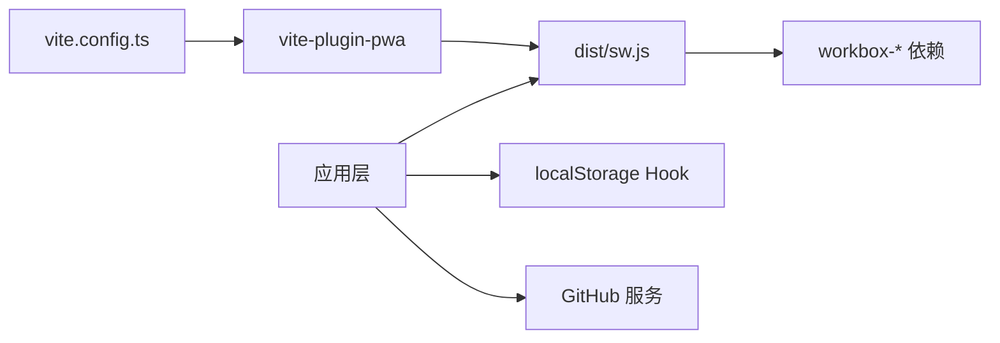

# 缓存策略与数据管理

<cite>
**本文引用的文件**
- [vite.config.ts](file://vite.config.ts)
- [package.json](file://package.json)
- [sw.js](file://dist/sw.js)
- [useLocalStorage.ts](file://src/hooks/useLocalStorage.ts)
- [useLocalStorage.js（admin）](file://apps/admin/src/hooks/useLocalStorage.js)
- [useLocalStorage.js（community）](file://apps/community/src/hooks/useLocalStorage.js)
- [HomePage.tsx](file://src/pages/HomePage.tsx)
- [ThemeToggle.tsx](file://src/components/ThemeToggle.tsx)
- [githubApi.ts](file://src/services/githubApi.ts)
- [github.ts](file://src/services/github.ts)
- [OpenSourcePage.tsx](file://src/pages/OpenSourcePage.tsx)
</cite>

## 目录
1. [简介](#简介)
2. [项目结构](#项目结构)
3. [核心组件](#核心组件)
4. [架构总览](#架构总览)
5. [详细组件分析](#详细组件分析)
6. [依赖关系分析](#依赖关系分析)
7. [性能考量](#性能考量)
8. [故障排查指南](#故障排查指南)
9. [结论](#结论)
10. [附录](#附录)

## 简介
本文件围绕 YuleTech 社区技术平台的缓存策略与数据管理展开，重点覆盖以下方面：
- Workbox 的 runtimeCaching 配置：CacheFirst 策略在 Google Fonts 场景下的应用与优势
- maximumFileSizeToCacheInBytes 的大小限制与大文件处理策略
- globPatterns 的文件匹配规则与静态资源缓存范围
- 自定义缓存命名策略（如 google-fonts-cache）
- localStorage 的数据持久化机制：用户偏好、会话状态与临时数据的存储策略
- 缓存清理、版本管理与数据同步的实现方案
- 缓存命中率优化、存储空间管理与性能监控方法

## 项目结构
本项目采用 Vite + React 技术栈，并通过 vite-plugin-pwa 启用 PWA 能力。Service Worker 由 Workbox 生成并注入，静态资源通过 precache 与 runtime caching 双通道进行缓存。

图表来源
- [vite.config.ts:10-25](file://vite.config.ts#L10-L25)
- [sw.js:1](file://dist/sw.js#L1)
- [package.json:25](file://package.json#L25)

章节来源
- [vite.config.ts:1-32](file://vite.config.ts#L1-L32)
- [package.json:1-46](file://package.json#L1-L46)

## 核心组件
- Workbox RuntimeCaching：针对外部字体（Google Fonts）采用 CacheFirst 策略，提升加载稳定性与性能
- 预缓存（Precache）：将构建产物与关键资源纳入离线可用清单
- localStorage Hook：统一管理用户偏好与本地状态，跨标签页同步
- GitHub 数据缓存：基于内存的短期缓存与错误降级策略

章节来源
- [vite.config.ts:13-23](file://vite.config.ts#L13-L23)
- [sw.js:1](file://dist/sw.js#L1)
- [useLocalStorage.ts:1-60](file://src/hooks/useLocalStorage.ts#L1-L60)
- [githubApi.ts:131-149](file://src/services/githubApi.ts#L131-L149)

## 架构总览
下图展示浏览器请求在不同阶段的缓存路径与决策流程，涵盖预缓存命中、runtime 缓存与网络回退。

图表来源
- [sw.js:1](file://dist/sw.js#L1)
- [vite.config.ts:16-22](file://vite.config.ts#L16-L22)

## 详细组件分析

### Workbox 配置与 runtimeCaching
- globPatterns：限定静态资源匹配范围，包含 js、css、html、ico、png、svg、woff2 等
- maximumFileSizeToCacheInBytes：默认 5MB，超过该阈值的资源不会被缓存
- runtimeCaching：对 Google Fonts 使用 CacheFirst 并指定独立缓存命名空间 google-fonts-cache

图表来源
- [vite.config.ts:14](file://vite.config.ts#L14)
- [vite.config.ts:16-22](file://vite.config.ts#L16-L22)
- [sw.js:1](file://dist/sw.js#L1)

章节来源
- [vite.config.ts:13-23](file://vite.config.ts#L13-L23)
- [sw.js:1](file://dist/sw.js#L1)

### Google Fonts 缓存优化
- 策略：CacheFirst
- 命名：google-fonts-cache
- 优势：降低字体加载抖动，提升离线可用性；避免重复下载相同字形

图表来源
- [vite.config.ts:16-22](file://vite.config.ts#L16-L22)
- [sw.js:1](file://dist/sw.js#L1)

章节来源
- [vite.config.ts:16-22](file://vite.config.ts#L16-L22)
- [sw.js:1](file://dist/sw.js#L1)

### maximumFileSizeToCacheInBytes 与大文件处理
- 阈值：5MB（默认）
- 处理策略：超过阈值的资源不参与缓存，直接走网络或预缓存逻辑
- 建议：对大体积资源（如视频、大型图片）避免缓存，改用按需加载与分片策略

章节来源
- [vite.config.ts:15](file://vite.config.ts#L15)

### globPatterns 与静态资源缓存范围
- 匹配规则：**/*.{js,css,html,ico,png,svg,woff2}
- 覆盖范围：前端构建产物与常用静态资源
- 影响：提升首屏与二次访问性能，减少网络往返

章节来源
- [vite.config.ts:14](file://vite.config.ts#L14)

### 自定义缓存命名策略
- google-fonts-cache：隔离字体缓存，便于独立管理与清理
- 建议：为不同资源类型设置独立缓存命名空间，便于版本控制与容量治理

章节来源
- [vite.config.ts:20](file://vite.config.ts#L20)
- [sw.js:1](file://dist/sw.js#L1)

### localStorage 数据持久化机制
- 统一 Hook：useLocalStorage 提供读写与跨标签页同步能力
- 错误处理：读写异常记录日志，保证应用稳定性
- 用户偏好示例：首页极简模式开关、主题切换等

图表来源
- [useLocalStorage.ts:1-60](file://src/hooks/useLocalStorage.ts#L1-L60)

章节来源
- [useLocalStorage.ts:1-60](file://src/hooks/useLocalStorage.ts#L1-L60)
- [useLocalStorage.js（admin）:1-60](file://apps/admin/src/hooks/useLocalStorage.js#L1-L60)
- [useLocalStorage.js（community）:1-60](file://apps/community/src/hooks/useLocalStorage.js#L1-L60)
- [HomePage.tsx:13-31](file://src/pages/HomePage.tsx#L13-L31)
- [ThemeToggle.tsx:1-120](file://src/components/ThemeToggle.tsx#L1-L120)

### GitHub 数据缓存与同步
- 内存缓存：短期缓存（默认 5 分钟），减少频繁请求
- 错误降级：网络异常时返回缓存数据，保证用户体验
- 手动刷新：页面提供刷新按钮以主动更新

图表来源
- [githubApi.ts:131-149](file://src/services/githubApi.ts#L131-L149)
- [github.ts:65-80](file://src/services/github.ts#L65-L80)
- [OpenSourcePage.tsx:248-280](file://src/pages/OpenSourcePage.tsx#L248-L280)

章节来源
- [githubApi.ts:131-149](file://src/services/githubApi.ts#L131-L149)
- [github.ts:65-80](file://src/services/github.ts#L65-L80)
- [OpenSourcePage.tsx:248-280](file://src/pages/OpenSourcePage.tsx#L248-L280)

## 依赖关系分析
- 构建与插件：vite.config.ts 依赖 vite-plugin-pwa，后者生成 Service Worker 与预缓存清单
- 运行时依赖：workbox-* 系列包提供 precache、routing、strategies 等能力
- 应用层：页面与服务通过 Hook 与缓存策略协同工作

图表来源
- [vite.config.ts:10-25](file://vite.config.ts#L10-L25)
- [package.json:25](file://package.json#L25)
- [sw.js:1](file://dist/sw.js#L1)

章节来源
- [package.json:12-26](file://package.json#L12-L26)
- [vite.config.ts:10-25](file://vite.config.ts#L10-L25)

## 性能考量
- 缓存命中率优化
  - 将高频静态资源纳入预缓存（globPatterns）
  - 对外部字体使用 CacheFirst，减少网络抖动
  - 控制最大缓存尺寸，避免大文件挤占空间
- 存储空间管理
  - 为不同资源类型设置独立缓存命名空间，便于清理与扩容
  - 定期清理过期缓存（如 google-fonts-cache），释放空间
- 性能监控
  - 结合浏览器 DevTools Network 面板观察缓存命中与回退情况
  - 在应用层埋点统计关键接口的缓存命中率与耗时

## 故障排查指南
- Google Fonts 无法加载
  - 检查 runtimeCaching 是否正确匹配 fonts.googleapis.com
  - 清理 google-fonts-cache 后重试
- 预缓存资源未生效
  - 确认构建后 dist 中的 sw.js 与 precache 清单存在
  - 检查 base 路径与部署路径是否一致
- localStorage 写入失败
  - 查看控制台错误日志
  - 检查浏览器隐私模式或存储配额限制
- GitHub 数据长时间未更新
  - 检查内存缓存时间（默认 5 分钟）
  - 使用页面“刷新”按钮强制更新

章节来源
- [vite.config.ts:13-23](file://vite.config.ts#L13-L23)
- [sw.js:1](file://dist/sw.js#L1)
- [useLocalStorage.ts:1-60](file://src/hooks/useLocalStorage.ts#L1-L60)
- [githubApi.ts:131-149](file://src/services/githubApi.ts#L131-L149)

## 结论
本项目的缓存体系以 Workbox 为核心，结合预缓存与 runtimeCaching，实现了对静态资源与外部字体的高效缓存；通过 localStorage Hook 与内存缓存策略，保障了用户偏好与数据的持久化与一致性。建议在后续迭代中完善缓存清理与版本管理机制，持续优化缓存命中率与存储空间利用率。

## 附录
- 关键配置参考
  - [vite.config.ts:13-23](file://vite.config.ts#L13-L23)
  - [sw.js:1](file://dist/sw.js#L1)
- 示例与实践
  - [useLocalStorage.ts:1-60](file://src/hooks/useLocalStorage.ts#L1-L60)
  - [HomePage.tsx:13-31](file://src/pages/HomePage.tsx#L13-L31)
  - [githubApi.ts:131-149](file://src/services/githubApi.ts#L131-L149)