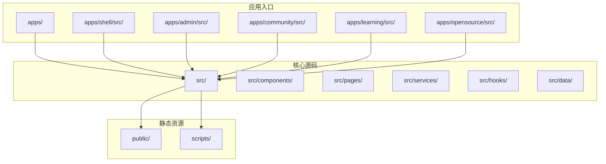
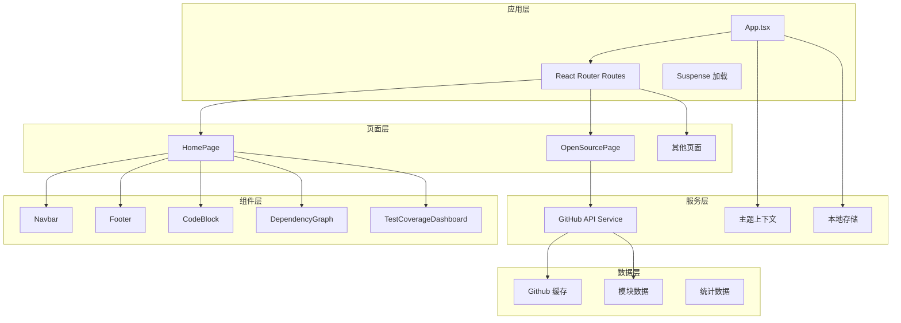
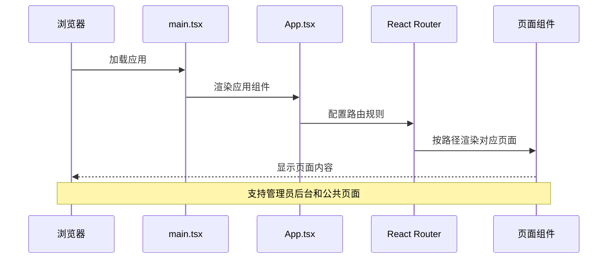
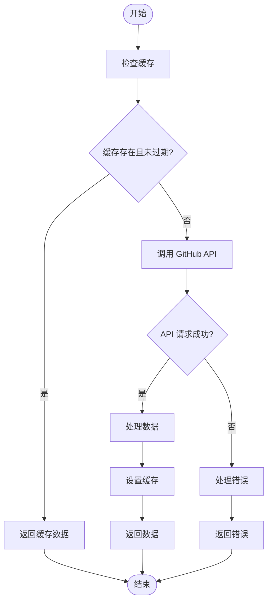
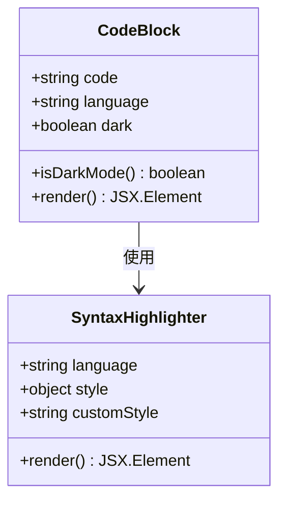
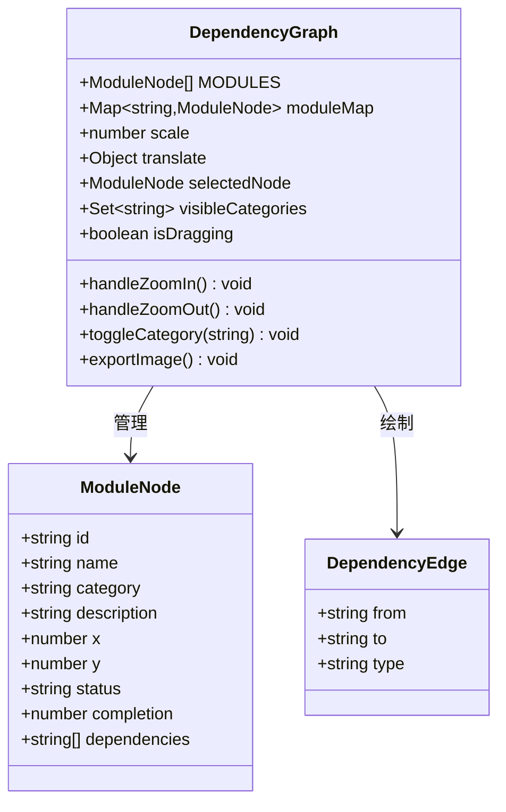
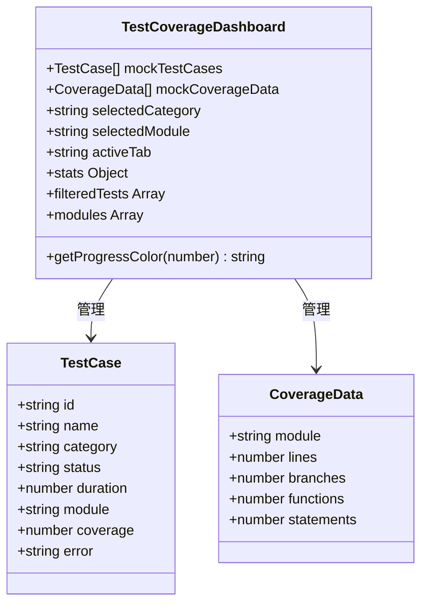

# 开发工具

<cite>
**本文档引用的文件**
- [README.md](file://README.md)
- [package.json](file://package.json)
- [src/App.tsx](file://src/App.tsx)
- [src/main.tsx](file://src/main.tsx)
- [src/components/Navbar.tsx](file://src/components/Navbar.tsx)
- [src/components/Footer.tsx](file://src/components/Footer.tsx)
- [src/pages/HomePage.tsx](file://src/pages/HomePage.tsx)
- [src/pages/OpenSourcePage.tsx](file://src/pages/OpenSourcePage.tsx)
- [src/components/CodeBlock.tsx](file://src/components/CodeBlock.tsx)
- [src/hooks/useGitHubRepos.ts](file://src/hooks/useGitHubRepos.ts)
- [src/services/github.ts](file://src/services/github.ts)
- [src/components/DependencyGraph.tsx](file://src/components/DependencyGraph.tsx)
- [src/components/TestCoverageDashboard.tsx](file://src/components/TestCoverageDashboard.tsx)
- [src/data/modules.ts](file://src/data/modules.ts)
</cite>

## 目录
1. [项目简介](#项目简介)
2. [项目结构](#项目结构)
3. [核心组件](#核心组件)
4. [架构总览](#架构总览)
5. [详细组件分析](#详细组件分析)
6. [依赖关系分析](#依赖关系分析)
7. [性能考虑](#性能考虑)
8. [故障排除指南](#故障排除指南)
9. [结论](#结论)

## 项目简介
本项目是 YuleTech 开源技术社区的官方网站，面向 AutoSAR BSW 开发者、汽车电子工程师、芯片厂商和高校研究人员，提供开源代码、工具链、学习成长平台和硬件开发板等一站式技术社区服务。项目采用 React 19 + TypeScript + Vite 6 + Tailwind CSS 4 技术栈，具备现代化的前端开发体验与良好的可维护性。

## 项目结构
项目采用按功能模块划分的组织方式，主要目录包括：
- apps：多应用入口（admin、community、learning、opensource、shell）
- src：核心源代码（组件、页面、服务、数据）
- public：静态资源
- scripts：构建脚本
- docs：文档资源
- archive：历史版本备份



**图表来源**
- [package.json:1-48](file://package.json#L1-L48)
- [README.md:20-46](file://README.md#L20-L46)

**章节来源**
- [README.md:20-46](file://README.md#L20-L46)
- [package.json:1-48](file://package.json#L1-L48)

## 核心组件
项目的核心组件包括导航栏、页脚、主页、开源代码页面等，这些组件共同构成了用户交互的主要界面。

### 导航栏组件
导航栏组件提供了响应式的菜单系统，支持桌面端和移动端的不同布局，并集成了搜索、通知、主题切换等功能。

### 页脚组件
页脚组件包含多列导航链接，涵盖平台、学习、合作、关于等分类，为用户提供便捷的站点导航。

### 主页组件
主页组件实现了品牌展示、功能特性、GitHub 仪表盘、每日代码、统计数据、开源架构、社区活动和行动号召等功能模块。

### 开源代码页面
开源代码页面展示了 AutoSAR BSW 的四层架构（MCAL、ECUAL、Service、RTE + ASW），包含模块列表、搜索过滤、GitHub 数据同步、测试覆盖率和依赖关系图等功能。

**章节来源**
- [src/components/Navbar.tsx:1-204](file://src/components/Navbar.tsx#L1-L204)
- [src/components/Footer.tsx:1-95](file://src/components/Footer.tsx#L1-L95)
- [src/pages/HomePage.tsx:1-102](file://src/pages/HomePage.tsx#L1-L102)
- [src/pages/OpenSourcePage.tsx:1-469](file://src/pages/OpenSourcePage.tsx#L1-L469)

## 架构总览
项目采用现代前端架构，结合了路由管理、状态管理、数据获取和服务封装等设计模式。



**图表来源**
- [src/App.tsx:32-123](file://src/App.tsx#L32-L123)
- [src/main.tsx:1-23](file://src/main.tsx#L1-L23)
- [src/services/github.ts:52-97](file://src/services/github.ts#L52-L97)

## 详细组件分析

### 应用入口与路由系统
应用入口文件配置了完整的路由体系，支持管理员后台和公共页面的分离管理。



**图表来源**
- [src/main.tsx:9-19](file://src/main.tsx#L9-L19)
- [src/App.tsx:38-117](file://src/App.tsx#L38-L117)

**章节来源**
- [src/main.tsx:1-23](file://src/main.tsx#L1-L23)
- [src/App.tsx:32-123](file://src/App.tsx#L32-L123)

### GitHub 数据同步机制
项目实现了智能的 GitHub 数据缓存和同步机制，确保页面加载性能和数据准确性。



**图表来源**
- [src/services/github.ts:28-80](file://src/services/github.ts#L28-L80)
- [src/hooks/useGitHubRepos.ts:13-44](file://src/hooks/useGitHubRepos.ts#L13-L44)

**章节来源**
- [src/services/github.ts:1-97](file://src/services/github.ts#L1-L97)
- [src/hooks/useGitHubRepos.ts:1-45](file://src/hooks/useGitHubRepos.ts#L1-L45)

### 代码高亮组件
代码高亮组件支持暗色和亮色主题的自动切换，提供良好的代码阅读体验。



**图表来源**
- [src/components/CodeBlock.tsx:14-48](file://src/components/CodeBlock.tsx#L14-L48)

**章节来源**
- [src/components/CodeBlock.tsx:1-49](file://src/components/CodeBlock.tsx#L1-L49)

### 依赖关系图组件
依赖关系图组件提供了 AutoSAR BSW 模块间的可视化展示，支持缩放、拖拽、图层控制和详情查看等功能。



**图表来源**
- [src/components/DependencyGraph.tsx:92-531](file://src/components/DependencyGraph.tsx#L92-L531)

**章节来源**
- [src/components/DependencyGraph.tsx:1-531](file://src/components/DependencyGraph.tsx#L1-L531)

### 测试覆盖率仪表盘
测试覆盖率仪表盘提供了全面的测试执行状态展示，包括统计卡片、趋势图表、用例列表和覆盖率分析。



**图表来源**
- [src/components/TestCoverageDashboard.tsx:96-462](file://src/components/TestCoverageDashboard.tsx#L96-L462)

**章节来源**
- [src/components/TestCoverageDashboard.tsx:1-462](file://src/components/TestCoverageDashboard.tsx#L1-L462)

### 模块数据管理系统
模块数据管理系统提供了完整的 AutoSAR BSW 模块信息，包括 API 接口、配置参数、依赖关系和变更日志等。

**章节来源**
- [src/data/modules.ts:1-800](file://src/data/modules.ts#L1-L800)

## 依赖关系分析

```mermaid
graph LR
subgraph "运行时依赖"
React[react@^19.2.5]
ReactDOM[react-dom@^19.2.5]
Router[react-router-dom@^7.14.2]
FramerMotion[framer-motion@^12.38.0]
TailwindCSS[tailwindcss@^3.4.17]
LucideReact[lucide-react@^1.8.0]
end
subgraph "开发时依赖"
Vite[vite@^7.3.2]
TypeScript[typeScript@~6.0.2]
ESLint[eslint@^9.39.4]
PostCSS[postcss@^8.5.10]
Sharp[sharp@^0.34.5]
end
subgraph "构建工具"
VitePluginPWA[vite-plugin-pwa@^1.2.0]
Autoprefixer[autoprefixer@^10.5.0]
TailwindMerge[tailwind-merge@^3.5.0]
end
React --> ReactDOM
React --> Router
React --> FramerMotion
FramerMotion --> LucideReact
TailwindCSS --> PostCSS
PostCSS --> Autoprefixer
Vite --> VitePluginPWA
Vite --> TailwindMerge
```

**图表来源**
- [package.json:12-46](file://package.json#L12-L46)

**章节来源**
- [package.json:1-48](file://package.json#L1-L48)

## 性能考虑
项目在性能方面采用了多项优化策略：

1. **懒加载与代码分割**：使用 React.lazy 和 Suspense 实现页面级别的懒加载
2. **缓存策略**：GitHub API 数据使用 sessionStorage 缓存，TTL 为 5 分钟
3. **虚拟滚动**：大型列表使用虚拟化技术提升渲染性能
4. **主题切换优化**：CSS 变量配合类名切换实现无重绘的主题切换
5. **图片优化**：使用 sharp 进行图片压缩和格式优化
6. **构建优化**：Vite 提供快速的开发服务器和高效的生产构建

## 故障排除指南

### 常见问题与解决方案

**GitHub API 请求失败**
- 检查网络连接和 API 限制
- 查看浏览器控制台的错误信息
- 确认缓存是否正常工作

**页面加载缓慢**
- 检查网络状况和 CDN 配置
- 验证图片资源是否正确压缩
- 确认代码分割是否生效

**主题切换异常**
- 检查 CSS 变量是否正确设置
- 验证 localStorage 权限
- 确认系统主题变化监听器

**章节来源**
- [src/services/github.ts:28-50](file://src/services/github.ts#L28-L50)
- [src/components/CodeBlock.tsx:10-23](file://src/components/CodeBlock.tsx#L10-L23)

## 结论
本开发工具项目展现了现代化前端开发的最佳实践，通过合理的架构设计、完善的组件体系和优化的性能策略，为用户提供了优质的开发体验。项目的技术栈选择恰当，代码结构清晰，具有良好的扩展性和维护性。建议在后续开发中继续关注性能优化、用户体验改进和功能扩展，以更好地服务于 AutoSAR BSW 开发社区。