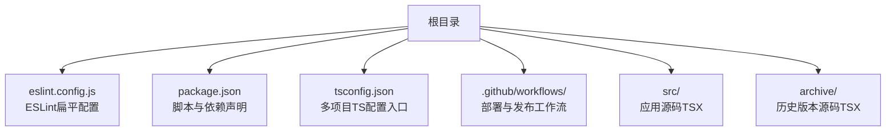
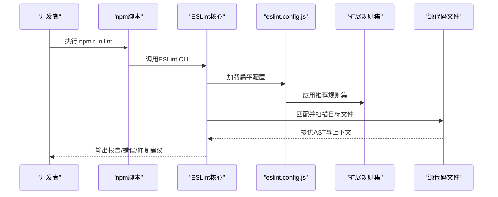
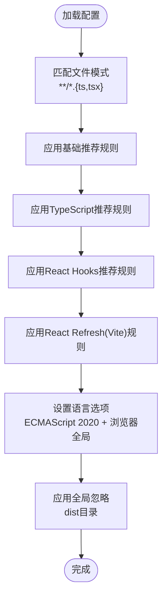
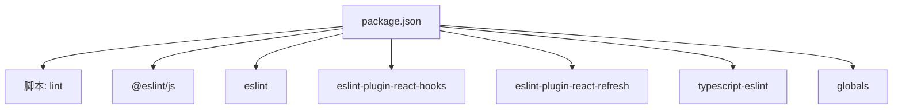

# ESLint代码规范

<cite>
**本文引用的文件**
- [eslint.config.js](file://eslint.config.js)
- [package.json](file://package.json)
- [.github/workflows/deploy.yml](file://.github/workflows/deploy.yml)
- [.github/workflows/deploy-static.yml](file://.github/workflows/deploy-static.yml)
- [tsconfig.json](file://tsconfig.json)
- [src/App.tsx](file://src/App.tsx)
- [src/main.tsx](file://src/main.tsx)
- [archive/src/App.tsx](file://archive/src/App.tsx)
- [archive/src/main.tsx](file://archive/src/main.tsx)
</cite>

## 目录
1. [简介](#简介)
2. [项目结构](#项目结构)
3. [核心组件](#核心组件)
4. [架构总览](#架构总览)
5. [详细组件分析](#详细组件分析)
6. [依赖关系分析](#依赖关系分析)
7. [性能考虑](#性能考虑)
8. [故障排查指南](#故障排查指南)
9. [结论](#结论)
10. [附录](#附录)

## 简介
本文件为ESLint代码规范工具的综合文档，面向团队协作与持续集成场景，系统性说明当前项目的ESLint配置、TypeScript支持、React相关规则、代码质量检查策略、格式化与自动修复能力、CI/CD集成与质量门禁、规则定制与忽略文件配置、性能优化建议，以及常见问题的检测与修复思路。文档同时提供可操作的最佳实践与开发体验优化建议。

## 项目结构
本项目采用Vite + React + TypeScript技术栈，并通过ESLint进行代码质量管控。ESLint配置采用ESLint v9的flat配置风格，集中于根目录的配置文件中，覆盖TypeScript与React生态的关键规则集，并对构建产物目录进行全局忽略。

图表来源
- [eslint.config.js:1-24](file://eslint.config.js#L1-L24)
- [package.json:1-46](file://package.json#L1-L46)
- [tsconfig.json:1-8](file://tsconfig.json#L1-L8)

章节来源
- [eslint.config.js:1-24](file://eslint.config.js#L1-L24)
- [package.json:1-46](file://package.json#L1-L46)
- [tsconfig.json:1-8](file://tsconfig.json#L1-L8)

## 核心组件
- ESLint扁平配置：集中定义文件匹配、扩展规则集、语言选项与全局忽略。
- 规则扩展集：
  - 基础推荐规则：来自官方JS推荐配置。
  - TypeScript推荐规则：来自typescript-eslint推荐配置。
  - React Hooks推荐规则：来自eslint-plugin-react-hooks推荐配置。
  - Vite相关刷新规则：来自eslint-plugin-react-refresh的Vite配置。
- 语言与环境：
  - 语言版本：ECMAScript 2020。
  - 全局变量：浏览器环境。
- 忽略策略：全局忽略构建产物目录，避免对生成文件进行扫描。

章节来源
- [eslint.config.js:8-23](file://eslint.config.js#L8-L23)

## 架构总览
下图展示ESLint在项目中的运行架构：从命令行触发到配置加载、规则扩展、文件匹配与执行，最终输出报告或错误。

图表来源
- [package.json:9](file://package.json#L9)
- [eslint.config.js:8-23](file://eslint.config.js#L8-L23)

## 详细组件分析

### ESLint配置文件分析
- 文件匹配范围：仅对TypeScript与TSX文件生效，确保类型安全与React生态规则覆盖。
- 规则扩展链路：基础推荐 → TypeScript推荐 → React Hooks推荐 → Vite刷新规则，形成从通用到专用的规则叠加。
- 语言选项：指定ECMAScript版本与浏览器全局变量，适配现代前端开发环境。
- 忽略策略：全局忽略构建产物目录，减少不必要的扫描开销并避免误报。

图表来源
- [eslint.config.js:10-23](file://eslint.config.js#L10-L23)

章节来源
- [eslint.config.js:8-23](file://eslint.config.js#L8-L23)

### TypeScript支持配置
- 多项目配置入口：通过根TS配置聚合多个子配置，便于在不同应用或工具链中共享类型检查策略。
- 与ESLint的协同：ESLint的TypeScript规则集基于typescript-eslint，确保对类型信息的正确解析与规则应用。

章节来源
- [tsconfig.json:1-8](file://tsconfig.json#L1-L8)

### React特定规则与代码质量检查
- React Hooks规则：通过推荐配置启用对Hook使用模式的检查，帮助识别潜在的依赖缺失、无效依赖等常见问题。
- React Refresh规则：针对Vite开发场景的热更新与组件刷新行为进行规则约束，提升开发体验与稳定性。
- 实践参考：项目中存在对React Hooks依赖数组的显式禁用注释，提示在特定场景下需要谨慎处理依赖项，建议结合规则进行规范化处理。

章节来源
- [eslint.config.js:12-17](file://eslint.config.js#L12-L17)
- [src/App.tsx:52](file://src/App.tsx#L52)

### 代码格式化与自动修复
- 自动修复能力：ESLint支持对可自动修复的问题进行批量修复，建议在本地提交前与CI中均执行修复流程，以保持代码风格一致。
- 配置建议：如需引入格式化工具，可在现有ESLint基础上增加格式化插件或独立的格式化任务，但需注意与ESLint规则的协调与冲突处理。

[本节为通用指导，不直接分析具体文件]

### 团队协作与质量门禁
- 统一规范：通过集中式ESLint配置与脚本，确保所有开发者在相同规则下进行开发，降低因风格差异导致的审查成本。
- CI集成：在CI中加入ESLint检查步骤，作为合并前的质量门禁，阻止不符合规范的代码进入主分支。

章节来源
- [package.json:9](file://package.json#L9)
- [.github/workflows/deploy.yml:1-54](file://.github/workflows/deploy.yml#L1-L54)
- [.github/workflows/deploy-static.yml:1-43](file://.github/workflows/deploy-static.yml#L1-L43)

### 规则定制与忽略文件配置
- 规则定制：可在现有扩展规则基础上进行局部覆盖或新增规则，建议以“最小必要”原则进行定制，避免过度放宽规则。
- 忽略文件：除全局忽略外，还可通过.eslintignore或在配置中使用忽略数组实现更细粒度的控制；对于第三方库或生成文件，应优先通过忽略策略屏蔽。

章节来源
- [eslint.config.js:9](file://eslint.config.js#L9)

### 性能优化建议
- 文件匹配优化：尽量缩小匹配范围，避免对大体积目录进行扫描；当前已针对TS/TSX文件进行精确匹配。
- 规则选择：仅启用必要的规则集，避免启用过于宽泛或高计算复杂度的规则。
- 缓存与增量：利用ESLint缓存机制与增量检查能力，减少重复扫描时间。

章节来源
- [eslint.config.js:10-11](file://eslint.config.js#L10-L11)

### 常见问题检测与修复
- React Hooks依赖问题：当依赖数组不完整或冗余时，可通过自动修复或手动调整解决；对于复杂逻辑，建议拆分函数或使用useMemo/useCallback进行优化。
- 类型相关问题：结合typescript-eslint规则，及时修正类型断言滥用、未使用的变量与参数等问题。
- 开发体验：在Vite环境下，配合React Refresh规则可减少不必要的重渲染与刷新失败。

章节来源
- [eslint.config.js:12-17](file://eslint.config.js#L12-L17)
- [src/App.tsx:52](file://src/App.tsx#L52)

## 依赖关系分析
ESLint相关依赖与脚本在package.json中集中声明，形成“脚本驱动 + 依赖管理”的闭环。

图表来源
- [package.json:6-44](file://package.json#L6-L44)

章节来源
- [package.json:6-44](file://package.json#L6-L44)

## 性能考虑
- 启动与扫描阶段：通过精确的文件匹配与全局忽略，减少不必要的扫描路径。
- 规则执行阶段：优先启用轻量规则，对高成本规则进行按需启用或关闭。
- 缓存与并行：合理利用ESLint缓存与并行处理能力，缩短整体执行时间。

[本节为通用指导，不直接分析具体文件]

## 故障排查指南
- 规则冲突：若出现规则冲突，优先检查扩展规则集的叠加顺序与局部覆盖配置，确保规则优先级清晰。
- 忽略失效：确认忽略列表是否正确匹配目标文件路径，避免误将源文件排除或误将产物包含。
- CI失败：在CI日志中定位具体文件与规则名称，结合本地复现与自动修复进行处理。

章节来源
- [eslint.config.js:9-11](file://eslint.config.js#L9-L11)

## 结论
本项目的ESLint配置以扁平化方式实现了对TypeScript与React生态的全面覆盖，结合推荐规则集与语言选项，能够有效保障代码质量与一致性。通过在CI中集成检查与自动修复流程，可进一步强化质量门禁，提升团队协作效率与交付质量。

[本节为总结性内容，不直接分析具体文件]

## 附录

### CI/CD集成要点
- 在构建前执行ESLint检查，作为质量门禁的一部分。
- 对不同工作流（静态部署与动态部署）保持一致的检查策略，确保产物与源码均符合规范。

章节来源
- [.github/workflows/deploy.yml:1-54](file://.github/workflows/deploy.yml#L1-L54)
- [.github/workflows/deploy-static.yml:1-43](file://.github/workflows/deploy-static.yml#L1-L43)

### 示例：React路由与Suspense下的规则实践
- 在路由懒加载与Suspense组合场景中，注意避免不必要的依赖数组与副作用，确保组件生命周期与刷新行为符合预期。

章节来源
- [src/App.tsx:10-28](file://src/App.tsx#L10-L28)
- [src/main.tsx:9-19](file://src/main.tsx#L9-L19)