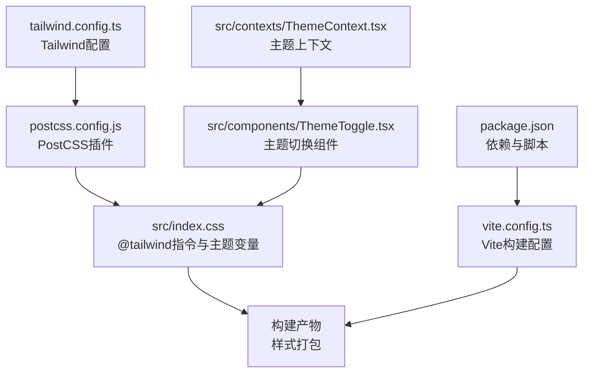
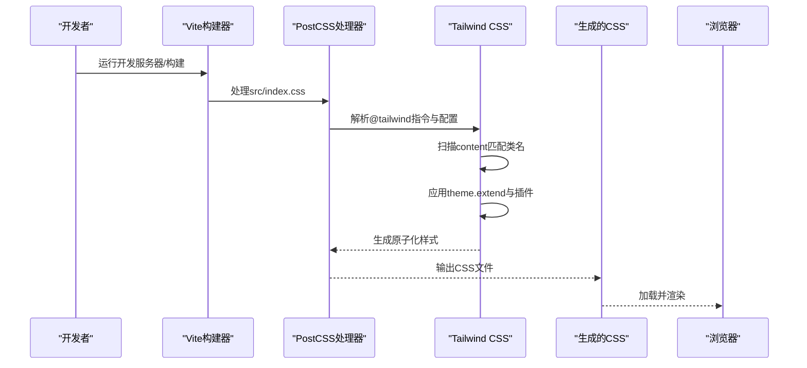
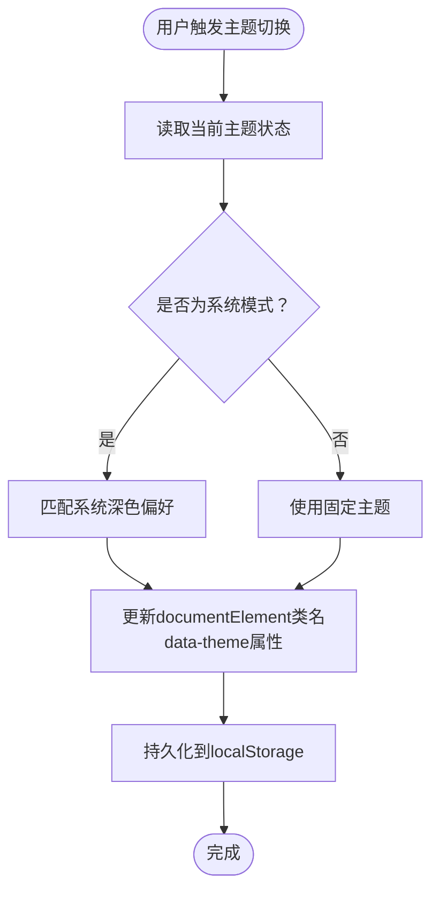
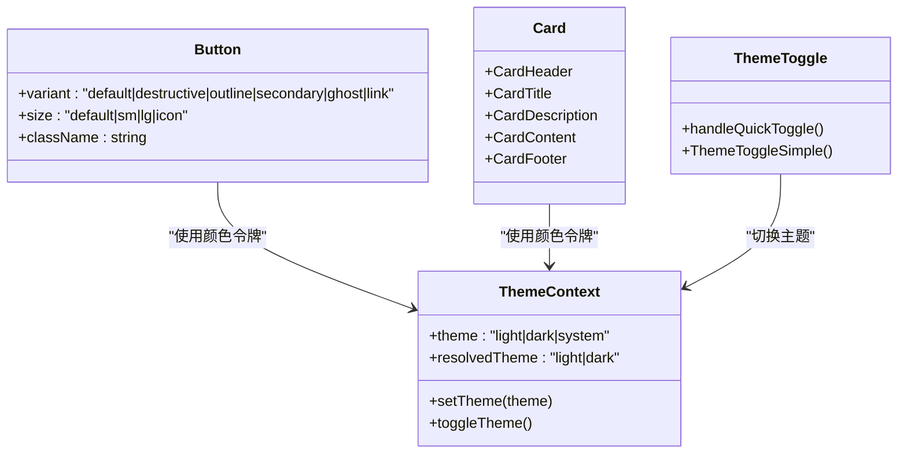
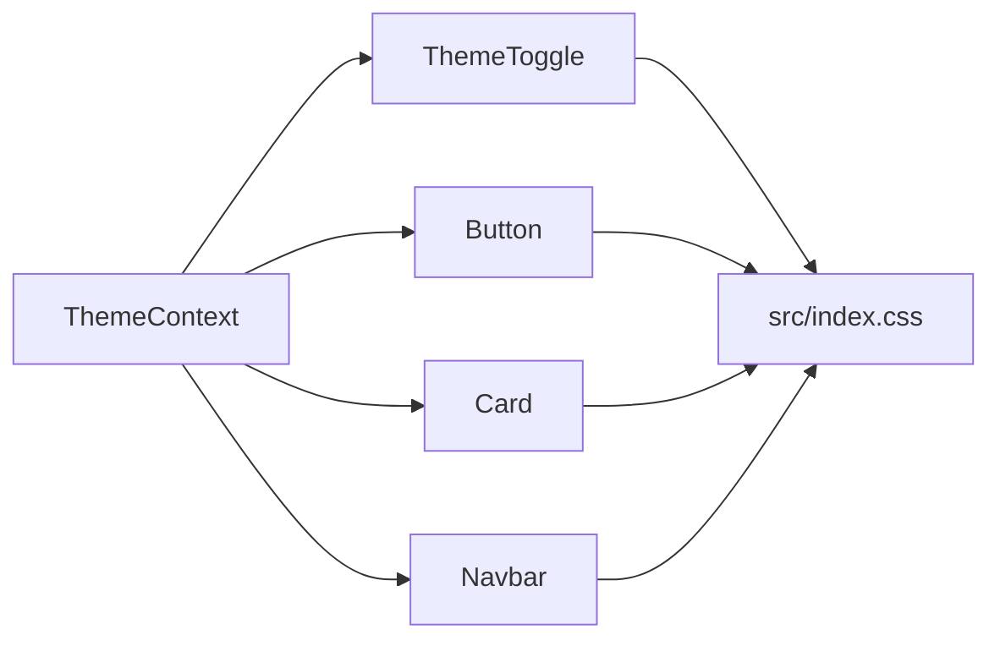

# Tailwind CSS配置

<cite>
**本文档引用的文件**
- [tailwind.config.ts](file://tailwind.config.ts)
- [postcss.config.js](file://postcss.config.js)
- [package.json](file://package.json)
- [vite.config.ts](file://vite.config.ts)
- [src/index.css](file://src/index.css)
- [src/App.css](file://src/App.css)
- [src/contexts/ThemeContext.tsx](file://src/contexts/ThemeContext.tsx)
- [src/components/ThemeToggle.tsx](file://src/components/ThemeToggle.tsx)
- [src/lib/utils.ts](file://src/lib/utils.ts)
- [src/components/ui/button.tsx](file://src/components/ui/button.tsx)
- [src/components/ui/card.tsx](file://src/components/ui/card.tsx)
- [src/components/Hero.tsx](file://src/components/Hero.tsx)
- [src/components/Navbar.tsx](file://src/components/Navbar.tsx)
- [src/pages/HomePage.tsx](file://src/pages/HomePage.tsx)
</cite>

## 目录
1. [简介](#简介)
2. [项目结构](#项目结构)
3. [核心组件](#核心组件)
4. [架构总览](#架构总览)
5. [详细组件分析](#详细组件分析)
6. [依赖关系分析](#依赖关系分析)
7. [性能考虑](#性能考虑)
8. [故障排除指南](#故障排除指南)
9. [结论](#结论)
10. [附录](#附录)

## 简介
本文件为该工程的Tailwind CSS配置与使用文档，围绕tailwind.config.ts配置文件展开，系统性说明颜色系统、字体家族、间距单位、响应式断点、PostCSS集成、插件系统、构建优化、自定义工具类、动态类名生成、样式优先级控制、深色模式支持、动画配置、浏览器兼容性、样式组织最佳实践、性能优化技巧以及与React组件的集成方式、主题定制与品牌色彩管理。

## 项目结构
该项目采用Vite + React + Tailwind CSS的现代前端栈，样式通过PostCSS在构建时处理，Tailwind负责原子化样式生成与主题扩展。关键配置文件与样式入口如下：

图表来源
- [tailwind.config.ts:1-79](file://tailwind.config.ts#L1-L79)
- [postcss.config.js:1-7](file://postcss.config.js#L1-L7)
- [src/index.css:1-112](file://src/index.css#L1-L112)
- [vite.config.ts:1-32](file://vite.config.ts#L1-L32)
- [package.json:1-46](file://package.json#L1-L46)
- [src/contexts/ThemeContext.tsx:1-127](file://src/contexts/ThemeContext.tsx#L1-L127)
- [src/components/ThemeToggle.tsx:1-120](file://src/components/ThemeToggle.tsx#L1-L120)

章节来源
- [tailwind.config.ts:1-79](file://tailwind.config.ts#L1-L79)
- [postcss.config.js:1-7](file://postcss.config.js#L1-L7)
- [src/index.css:1-112](file://src/index.css#L1-L112)
- [vite.config.ts:1-32](file://vite.config.ts#L1-L32)
- [package.json:1-46](file://package.json#L1-L46)

## 核心组件
本节聚焦tailwind.config.ts中的关键配置项及其作用域，帮助快速理解主题扩展与构建范围。

- 内容扫描范围（content）
  - 负责告知Tailwind在哪些文件中查找需要生成样式的类名，避免无用样式被包含，提升构建效率与产物体积。
  - 当前配置扫描根目录HTML与src目录下的TypeScript/TSX文件。

- 深色模式（darkMode）
  - 使用类名驱动的深色模式，通过在根元素上切换类名实现主题切换，与React主题上下文配合使用。

- 主题扩展（theme.extend）
  - 颜色系统：基于CSS自定义属性（HSL）定义语义化颜色令牌，并映射到Tailwind颜色别名，便于在组件中直接使用。
  - 圆角半径：通过CSS变量统一管理圆角，支持不同层级的圆角变体。
  - 关键帧与动画：定义可复用的动画序列，用于组件交互（如折叠面板等）。

- 插件（plugins）
  - 引入tailwindcss-animate插件，提供更丰富的内置动画类与过渡效果，简化动画配置。

章节来源
- [tailwind.config.ts:3-79](file://tailwind.config.ts#L3-L79)

## 架构总览
Tailwind在本项目中的工作流如下：PostCSS在构建阶段解析@tailwind指令，结合Tailwind配置与CSS变量，生成最终样式；React组件通过类名与主题上下文协作，实现动态主题切换与品牌色彩应用。

图表来源
- [postcss.config.js:1-7](file://postcss.config.js#L1-L7)
- [tailwind.config.ts:3-79](file://tailwind.config.ts#L3-L79)
- [src/index.css:1-112](file://src/index.css#L1-L112)

## 详细组件分析

### 配置文件分析（tailwind.config.ts）
- 配置要点
  - 深色模式：类名驱动，与主题上下文联动。
  - 内容扫描：限定扫描范围，减少无用样式。
  - 主题扩展：颜色、圆角、动画与关键帧。
  - 插件：tailwindcss-animate提供动画增强。

- 数据结构与复杂度
  - 颜色令牌映射为O(1)访问，主题扩展按需加载。
  - 动画与关键帧以命名空间组织，便于复用与维护。

- 错误处理与边界
  - 若未正确引入插件或未启用深色模式类名，可能导致主题切换无效。
  - content范围不全会导致某些类名未生成，需确保扫描路径覆盖所有组件文件。

- 性能影响
  - 合理的content范围可显著降低构建时间与产物体积。
  - 主题扩展应避免过度冗余，保持简洁可维护。

章节来源
- [tailwind.config.ts:3-79](file://tailwind.config.ts#L3-L79)

### PostCSS集成（postcss.config.js）
- 配置要点
  - 启用tailwindcss与autoprefixer插件，自动处理Tailwind输出与浏览器兼容性前缀。
  - 无需额外手动添加前缀，提升开发体验。

- 依赖关系
  - 与tailwind.config.ts协同工作，确保@tailwind指令生效。

章节来源
- [postcss.config.js:1-7](file://postcss.config.js#L1-L7)

### 构建与脚本（package.json, vite.config.ts）
- 依赖与版本
  - Tailwind CSS、PostCSS、Autoprefixer、tailwindcss-animate等核心依赖均已声明。
  - Vite作为构建工具，提供快速热更新与生产构建能力。

- Vite配置
  - 别名@指向src目录，便于组件导入。
  - PWA相关配置（与样式缓存相关），有助于静态资源优化。

章节来源
- [package.json:1-46](file://package.json#L1-L46)
- [vite.config.ts:1-32](file://vite.config.ts#L1-L32)

### 主题系统与深色模式（CSS变量、主题上下文、切换组件）
- CSS变量层（src/index.css）
  - 在@layer base中定义明/暗两套HSL变量，形成完整的语义化颜色体系。
  - 定义自定义设计令牌（如渐变、阴影、过渡），统一品牌视觉语言。
  - 提供常用工具类（文本渐变、背景渐变、阴影等）。

- 主题上下文（ThemeContext）
  - 支持light、dark、system三种模式，持久化存储于localStorage。
  - 通过在documentElement上添加/移除类名实现主题切换，与Tailwind深色模式类名一致。

- 主题切换组件（ThemeToggle）
  - 提供快速切换与下拉菜单两种交互方式，支持动画反馈。
  - 与UI组件（如按钮、卡片）的颜色令牌联动，保证视觉一致性。

图表来源
- [src/contexts/ThemeContext.tsx:41-82](file://src/contexts/ThemeContext.tsx#L41-L82)
- [src/components/ThemeToggle.tsx:11-98](file://src/components/ThemeToggle.tsx#L11-L98)

章节来源
- [src/index.css:5-112](file://src/index.css#L5-L112)
- [src/contexts/ThemeContext.tsx:1-127](file://src/contexts/ThemeContext.tsx#L1-L127)
- [src/components/ThemeToggle.tsx:1-120](file://src/components/ThemeToggle.tsx#L1-L120)

### 自定义工具类与动态类名生成
- 工具类定义
  - 在@layer utilities中定义文本渐变、背景渐变、阴影等复用样式，便于跨组件使用。
  - 通过CSS变量与HSL值组合，确保明/暗主题下的一致表现。

- 动态类名生成
  - 组件内部根据状态（如激活、悬停、禁用）动态拼接类名。
  - 使用clsx与tailwind-merge进行类名合并与冲突消解，避免重复与覆盖问题。

- 品牌色彩管理
  - 通过CSS变量集中管理主色、强调色与渐变，组件中直接引用，便于品牌升级与维护。

章节来源
- [src/index.css:89-112](file://src/index.css#L89-L112)
- [src/lib/utils.ts:1-7](file://src/lib/utils.ts#L1-L7)
- [src/components/Hero.tsx:17-45](file://src/components/Hero.tsx#L17-L45)
- [src/components/Navbar.tsx:44-121](file://src/components/Navbar.tsx#L44-L121)

### 动画配置与交互
- 动画与关键帧
  - 在theme.extend.keyframes与theme.extend.animation中定义折叠面板等常见动画。
  - 通过插件tailwindcss-animate进一步增强动画类，减少手写样式。

- 组件交互
  - 导航栏滚动时的背景模糊与阴影变化、按钮悬停动画、主题切换图标旋转等，均通过类名与CSS变量实现。

章节来源
- [tailwind.config.ts:59-72](file://tailwind.config.ts#L59-L72)
- [src/components/Navbar.tsx:15-28](file://src/components/Navbar.tsx#L15-L28)
- [src/components/ThemeToggle.tsx:32-44](file://src/components/ThemeToggle.tsx#L32-L44)

### 浏览器兼容性与构建优化
- Autoprefixer
  - 自动为CSS规则添加浏览器前缀，确保在目标浏览器中的兼容性。

- 构建优化
  - 通过合理的content扫描范围与插件使用，减少构建体积。
  - Vite的按需加载与PWA缓存策略有助于提升首屏与离线体验。

章节来源
- [postcss.config.js:1-7](file://postcss.config.js#L1-L7)
- [vite.config.ts:10-24](file://vite.config.ts#L10-L24)

### 与React组件的集成方式
- 组件样式组织
  - 使用CVA（Class Variance Authority）定义可变组件（如Button），通过variants与sizes抽象不同风格与尺寸。
  - 卡片组件（Card）采用语义化容器类名，统一边框、背景与阴影。

- 页面与布局
  - 首页（HomePage）提供“极简模式”开关，通过本地存储持久化用户偏好，动态控制内容渲染。
  - 导航栏（Navbar）在滚动时改变外观，移动端适配良好，主题切换集成自然。

图表来源
- [src/components/ui/button.tsx:1-49](file://src/components/ui/button.tsx#L1-L49)
- [src/components/ui/card.tsx:1-47](file://src/components/ui/card.tsx#L1-L47)
- [src/contexts/ThemeContext.tsx:1-127](file://src/contexts/ThemeContext.tsx#L1-L127)
- [src/components/ThemeToggle.tsx:1-120](file://src/components/ThemeToggle.tsx#L1-L120)

章节来源
- [src/components/ui/button.tsx:1-49](file://src/components/ui/button.tsx#L1-L49)
- [src/components/ui/card.tsx:1-47](file://src/components/ui/card.tsx#L1-L47)
- [src/pages/HomePage.tsx:15-87](file://src/pages/HomePage.tsx#L15-L87)
- [src/components/Navbar.tsx:9-203](file://src/components/Navbar.tsx#L9-L203)

## 依赖关系分析
- 组件耦合与内聚
  - 主题上下文与切换组件高内聚，通过React Context向下传递状态。
  - UI组件（Button、Card）与主题系统松耦合，仅依赖语义化颜色令牌。

- 外部依赖
  - Tailwind CSS、PostCSS、Autoprefixer、tailwindcss-animate构成样式管线。
  - Vite提供构建与开发环境，clsx与tailwind-merge保障类名合并质量。

图表来源
- [src/contexts/ThemeContext.tsx:1-127](file://src/contexts/ThemeContext.tsx#L1-L127)
- [src/components/ThemeToggle.tsx:1-120](file://src/components/ThemeToggle.tsx#L1-L120)
- [src/components/ui/button.tsx:1-49](file://src/components/ui/button.tsx#L1-L49)
- [src/components/ui/card.tsx:1-47](file://src/components/ui/card.tsx#L1-L47)
- [src/components/Navbar.tsx:1-204](file://src/components/Navbar.tsx#L1-L204)
- [src/index.css:1-112](file://src/index.css#L1-L112)

章节来源
- [package.json:12-44](file://package.json#L12-L44)

## 性能考虑
- 构建性能
  - 严格控制content扫描范围，避免扫描node_modules或无关目录。
  - 合理拆分@layer，减少重复计算与样式冲突。

- 运行时性能
  - 使用CSS变量与语义化颜色令牌，避免重复定义与多处修改。
  - 类名合并使用clsx与tailwind-merge，减少DOM操作与重排。

- 缓存与加载
  - Vite与PWA配置有助于静态资源缓存与预加载，改善首屏与离线体验。

## 故障排除指南
- 深色模式不生效
  - 检查是否在documentElement上正确添加/移除类名，确认与Tailwind深色模式类名一致。
  - 确认CSS变量在@layer base中已正确定义。

- 新增类名未生成
  - 确认新增组件文件位于content扫描范围内，或调整tailwind.config.ts的content配置。

- 动画效果异常
  - 检查keyframes与animation名称是否一致，确认插件已正确引入。

- 类名冲突或样式错乱
  - 使用clsx与tailwind-merge进行类名合并，避免重复与覆盖。

章节来源
- [src/contexts/ThemeContext.tsx:41-82](file://src/contexts/ThemeContext.tsx#L41-L82)
- [tailwind.config.ts:59-72](file://tailwind.config.ts#L59-L72)
- [src/lib/utils.ts:1-7](file://src/lib/utils.ts#L1-L7)

## 结论
本项目通过Tailwind CSS与PostCSS的有机结合，辅以React主题上下文与组件化设计，实现了可维护、高性能且具备品牌一致性的样式体系。建议在后续迭代中持续优化content扫描范围、精简主题扩展、强化类名合并策略，并完善动画与交互的统一规范，以进一步提升开发体验与用户体验。

## 附录
- 最佳实践清单
  - 使用CSS变量集中管理品牌色彩与设计令牌。
  - 通过CVA定义组件变体，保持样式一致性与可扩展性。
  - 合理划分@layer，明确基础、组件与工具类职责。
  - 严格控制content扫描范围，提升构建效率。
  - 使用clsx与tailwind-merge进行类名合并，避免冲突。

- 维护策略
  - 定期审查主题扩展与动画配置，去除不再使用的变体与关键帧。
  - 建立组件样式变更的评审流程，确保品牌视觉统一。
  - 对第三方插件进行版本管理与回归测试，避免破坏性更新。