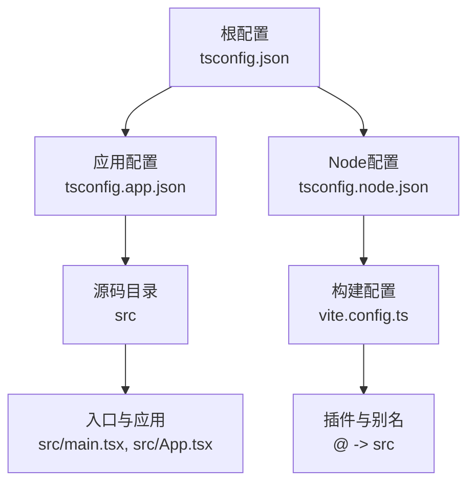
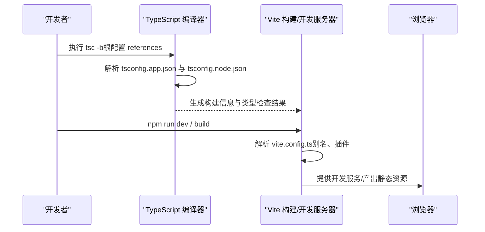
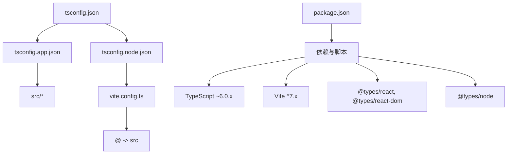

# TypeScript配置

<cite>
**本文档引用的文件**
- [tsconfig.json](file://tsconfig.json)
- [tsconfig.app.json](file://tsconfig.app.json)
- [tsconfig.node.json](file://tsconfig.node.json)
- [package.json](file://package.json)
- [vite.config.ts](file://vite.config.ts)
- [src/App.tsx](file://src/App.tsx)
- [src/main.tsx](file://src/main.tsx)
- [src/hooks/useUserSystem.ts](file://src/hooks/useUserSystem.ts)
- [src/data/communityData.ts](file://src/data/communityData.ts)
- [eslint.config.js](file://eslint.config.js)
- [tailwind.config.ts](file://tailwind.config.ts)
- [postcss.config.js](file://postcss.config.js)
- [README.md](file://README.md)
</cite>

## 目录
1. [引言](#引言)
2. [项目结构](#项目结构)
3. [核心组件](#核心组件)
4. [架构总览](#架构总览)
5. [详细组件分析](#详细组件分析)
6. [依赖关系分析](#依赖关系分析)
7. [性能考虑](#性能考虑)
8. [故障排除指南](#故障排除指南)
9. [结论](#结论)
10. [附录](#附录)

## 引言
本文件系统化梳理本项目的 TypeScript 编译配置，覆盖以下主题：
- 编译选项、路径映射、模块解析与输出配置
- 不同环境配置（app 与 node）的差异与用途
- 类型检查策略与严格性设置
- 装饰器支持、实验性特性与第三方库类型声明
- 项目引用、增量编译与构建性能优化
- 类型安全最佳实践、常见类型错误解决方案与调试技巧
- 团队协作中的类型一致性保证与版本兼容性管理

## 项目结构
本项目采用“根配置 + 分环境子配置”的组织方式，通过根 tsconfig.json 使用 references 将 app 与 node 两套配置纳入统一编译体系；Vite 作为构建与开发服务器，配合 React 19 + TypeScript 运行时。

图表来源
- [tsconfig.json:1-8](file://tsconfig.json#L1-L8)
- [tsconfig.app.json:1-35](file://tsconfig.app.json#L1-L35)
- [tsconfig.node.json:1-25](file://tsconfig.node.json#L1-L25)
- [vite.config.ts:1-32](file://vite.config.ts#L1-L32)

章节来源
- [tsconfig.json:1-8](file://tsconfig.json#L1-L8)
- [tsconfig.app.json:1-35](file://tsconfig.app.json#L1-L35)
- [tsconfig.node.json:1-25](file://tsconfig.node.json#L1-L25)
- [vite.config.ts:1-32](file://vite.config.ts#L1-L32)

## 核心组件
- 根配置（references）
  - 通过 references 将 tsconfig.app.json 与 tsconfig.node.json 纳入同一编译上下文，便于项目引用与增量编译协同工作。
- 应用配置（tsconfig.app.json）
  - 面向浏览器端应用，启用 JSX、DOM 类库、路径别名、严格未使用检测等。
- Node 配置（tsconfig.node.json）
  - 面向构建脚本（vite.config.ts），启用 Node 类库类型与严格未使用检测。
- 构建与运行时（package.json + vite.config.ts）
  - 使用 Vite 作为开发服务器与打包工具，定义构建脚本与别名映射。

章节来源
- [tsconfig.json:1-8](file://tsconfig.json#L1-L8)
- [tsconfig.app.json:1-35](file://tsconfig.app.json#L1-L35)
- [tsconfig.node.json:1-25](file://tsconfig.node.json#L1-L25)
- [package.json:1-46](file://package.json#L1-L46)
- [vite.config.ts:1-32](file://vite.config.ts#L1-L32)

## 架构总览
TypeScript 编译与构建流程概览：

图表来源
- [tsconfig.json:1-8](file://tsconfig.json#L1-L8)
- [tsconfig.app.json:1-35](file://tsconfig.app.json#L1-L35)
- [tsconfig.node.json:1-25](file://tsconfig.node.json#L1-L25)
- [package.json:6-11](file://package.json#L6-L11)
- [vite.config.ts:1-32](file://vite.config.ts#L1-L32)

## 详细组件分析

### 根配置（tsconfig.json）
- 作用
  - 通过 references 将应用与 Node 两套配置纳入统一编译上下文，便于跨配置的增量编译与类型共享。
- 关键点
  - files 为空，完全依赖 references 管理包含范围。
  - references 指向 tsconfig.app.json 与 tsconfig.node.json。

章节来源
- [tsconfig.json:1-8](file://tsconfig.json#L1-L8)

### 应用配置（tsconfig.app.json）
- 编译目标与库
  - target 与 lib 指定 ES2023 与 DOM，满足现代浏览器与 React 运行时需求。
- 模块与解析
  - module 为 esnext，moduleResolution 为 bundler，结合 verbatimModuleSyntax 与 moduleDetection=force，确保与 Vite 打包器协同。
- 类型与检查
  - types 包含 vite/client，提供 Vite 环境类型；启用 skipLibCheck 降低类型检查开销。
  - 启用 noEmit、noUnusedLocals、noUnusedParameters、noFallthroughCasesInSwitch 等严格性规则。
  - erasableSyntaxOnly 与 ignoreDeprecations=6.0 用于过渡期的语法与废弃警告控制。
- 路径映射
  - baseUrl 与 paths 配合 Vite 别名，实现 @/* -> ./src/* 的统一导入风格。
- 包含范围
  - include 仅包含 src，避免无关文件参与编译。

章节来源
- [tsconfig.app.json:1-35](file://tsconfig.app.json#L1-L35)
- [vite.config.ts:26-30](file://vite.config.ts#L26-L30)

### Node 配置（tsconfig.node.json）
- 目标
  - 为构建脚本（vite.config.ts）提供类型支持，启用 Node 类库类型与严格未使用检测。
- 关键点
  - include 限定为 vite.config.ts，缩小编译范围。
  - 与应用配置保持一致的模块解析与严格性设置，确保团队一致性。

章节来源
- [tsconfig.node.json:1-25](file://tsconfig.node.json#L1-L25)

### 路径映射与模块解析
- Vite 别名
  - vite.config.ts 中将 @ 指向 src，与 tsconfig.app.json 的 baseUrl/paths 协同，统一导入风格。
- 模块解析策略
  - bundler 模式与 verbatimModuleSyntax 结合，避免 CommonJS 与 ES 混用带来的歧义。
- 导入示例
  - src/App.tsx 中大量使用相对路径与模块解析，确保类型检查与打包器行为一致。

章节来源
- [vite.config.ts:26-30](file://vite.config.ts#L26-L30)
- [tsconfig.app.json:25-30](file://tsconfig.app.json#L25-L30)
- [src/App.tsx:1-28](file://src/App.tsx#L1-L28)

### 类型检查策略与严格性
- 严格性规则
  - 未使用本地变量与参数、switch 穿透检查、erasableSyntaxOnly 等，提升代码质量。
- 废弃警告控制
  - ignoreDeprecations=6.0 用于过渡期抑制特定版本的废弃警告。
- 第三方类型
  - @types/react、@types/react-dom、@types/node 等由 package.json 管理，tsconfig.app.json 的 types 与 tsconfig.node.json 的 types 分别提供运行时与构建时类型。

章节来源
- [tsconfig.app.json:18-24](file://tsconfig.app.json#L18-L24)
- [tsconfig.node.json:7,18-21](file://tsconfig.node.json#L7,L18-L21)
- [package.json:27-31](file://package.json#L27-L31)

### 装饰器支持与实验性特性
- 当前配置未启用装饰器或实验性特性相关选项。
- 若需使用装饰器，请在 compilerOptions 中添加相应标志，并确保与打包器兼容。

章节来源
- [tsconfig.app.json:2-35](file://tsconfig.app.json#L2-L35)
- [tsconfig.node.json:2-24](file://tsconfig.node.json#L2-L24)

### 第三方库类型声明
- React 生态类型
  - @types/react、@types/react-dom 由 package.json 提供，tsconfig.app.json 的 types 与 types/react-dom 一起生效。
- Node 类型
  - @types/node 由 package.json 提供，tsconfig.node.json 的 types=node 生效。
- Vite 环境类型
  - vite/client 由 tsconfig.app.json 的 types 提供，支持 Vite 特有 API 与环境变量类型。

章节来源
- [package.json:12-31](file://package.json#L12-L31)
- [tsconfig.app.json:10-12](file://tsconfig.app.json#L10-L12)
- [tsconfig.node.json:7](file://tsconfig.node.json#L7)

### 项目引用、增量编译与构建性能
- 项目引用
  - 根配置通过 references 将应用与 Node 配置纳入统一编译图，便于增量编译与类型共享。
- 增量编译
  - tsBuildInfoFile 指定构建信息缓存位置，提升二次编译速度。
- 构建性能
  - skipLibCheck 降低类型检查开销；noEmit 仅进行类型检查，不输出 JS 文件，适合纯类型校验场景。

章节来源
- [tsconfig.json:1-8](file://tsconfig.json#L1-L8)
- [tsconfig.app.json:3](file://tsconfig.app.json#L3)
- [tsconfig.node.json:3](file://tsconfig.node.json#L3)
- [tsconfig.app.json:13](file://tsconfig.app.json#L13)

### 类型安全最佳实践
- 使用明确的数据接口
  - 示例：src/data/communityData.ts 中定义了 ForumPost、Question、Answer 等接口，确保数据结构稳定。
- Hook 类型约束
  - 示例：src/hooks/useUserSystem.ts 中定义了 PointsAction、PointsHistoryItem、UserSystemState 等类型，配合 React Hooks 使用。
- 组件属性与状态
  - 示例：src/App.tsx 中的路由与懒加载组件，配合 React Router 类型，确保路由参数与组件类型一致。

章节来源
- [src/data/communityData.ts:1-371](file://src/data/communityData.ts#L1-L371)
- [src/hooks/useUserSystem.ts:1-135](file://src/hooks/useUserSystem.ts#L1-L135)
- [src/App.tsx:1-118](file://src/App.tsx#L1-L118)

### 常见类型错误与解决方案
- 路径别名不匹配
  - 症状：导入 @/* 报错。
  - 解决：确保 tsconfig.app.json 的 baseUrl/paths 与 vite.config.ts 的 alias 一致。
- 未使用变量/参数
  - 症状：noUnusedLocals/noUnusedParameters 触发。
  - 解决：删除或启用参数命名以消除未使用警告。
- switch 穿透
  - 症状：noFallthroughCasesInSwitch 触发。
  - 解决：为每个 case 添加 break 或注释说明意图。
- 废弃 API 警告
  - 症状：ignoreDeprecations 控制下的废弃 API 警告。
  - 解决：按版本计划迁移至新 API。

章节来源
- [tsconfig.app.json:18-24](file://tsconfig.app.json#L18-L24)
- [vite.config.ts:26-30](file://vite.config.ts#L26-L30)

### 调试技巧
- 使用 ESLint 配置
  - eslint.config.js 同时启用 TypeScript 与 React Hooks 规则，辅助发现潜在类型问题。
- Tailwind 与 PostCSS
  - tailwind.config.ts 与 postcss.config.js 确保样式类名与构建流程正常，避免因样式导致的运行时异常。
- 构建脚本
  - package.json 中的 scripts 定义了 dev/build/preview 流程，结合 TypeScript 与 Vite 快速定位问题。

章节来源
- [eslint.config.js:1-24](file://eslint.config.js#L1-L24)
- [tailwind.config.ts:1-79](file://tailwind.config.ts#L1-L79)
- [postcss.config.js:1-7](file://postcss.config.js#L1-L7)
- [package.json:6-11](file://package.json#L6-L11)

## 依赖关系分析
TypeScript 配置与构建工具的耦合关系：

图表来源
- [tsconfig.json:1-8](file://tsconfig.json#L1-L8)
- [tsconfig.app.json:1-35](file://tsconfig.app.json#L1-L35)
- [tsconfig.node.json:1-25](file://tsconfig.node.json#L1-L25)
- [vite.config.ts:1-32](file://vite.config.ts#L1-L32)
- [package.json:12-44](file://package.json#L12-L44)

章节来源
- [tsconfig.json:1-8](file://tsconfig.json#L1-L8)
- [tsconfig.app.json:1-35](file://tsconfig.app.json#L1-L35)
- [tsconfig.node.json:1-25](file://tsconfig.node.json#L1-L25)
- [vite.config.ts:1-32](file://vite.config.ts#L1-L32)
- [package.json:12-44](file://package.json#L12-L44)

## 性能考虑
- 类型检查性能
  - skipLibCheck 可显著降低类型检查时间，适合大型项目。
  - 严格性规则越多，类型检查越严格但也更耗时。
- 增量编译
  - tsBuildInfoFile 缓存构建信息，二次编译更快。
- 构建与开发体验
  - noEmit 仅做类型检查，适合快速迭代；生产构建由 Vite 与 tsc -b 协同完成。

章节来源
- [tsconfig.app.json:3,13,18-24](file://tsconfig.app.json#L3,L13,L18-L24)
- [tsconfig.node.json:3,18-21](file://tsconfig.node.json#L3,L18-L21)

## 故障排除指南
- 路径别名不生效
  - 检查 tsconfig.app.json 的 baseUrl/paths 与 vite.config.ts 的 alias 是否一致。
- 类型检查失败
  - 确认 @types/* 依赖已安装且版本兼容；必要时调整 ignoreDeprecations 或升级依赖。
- 构建失败
  - 查看 package.json 中的 scripts 与 Vite 插件配置，确保开发与生产流程一致。
- ESLint 冲突
  - 检查 eslint.config.js 的 extends 与语言选项，确保与 TypeScript 配置一致。

章节来源
- [vite.config.ts:26-30](file://vite.config.ts#L26-L30)
- [package.json:12-44](file://package.json#L12-L44)
- [eslint.config.js:8-23](file://eslint.config.js#L8-L23)

## 结论
本项目的 TypeScript 配置通过根配置与分环境配置的清晰分离，结合 Vite 的 bundler 模式与严格性规则，实现了高效、一致且可扩展的前端工程化体系。建议在团队内统一遵循相同的路径别名、严格性规则与类型声明策略，以保障长期演进中的类型一致性与构建稳定性。

## 附录
- 版本与工具链
  - TypeScript: ~6.0.x
  - Vite: ^7.x
  - React: ^19.x
  - Tailwind CSS: ^3.x
- 构建命令
  - 开发：npm run dev
  - 构建：npm run build
  - 预览：npm run preview

章节来源
- [package.json:12-44](file://package.json#L12-L44)
- [README.md:68-82](file://README.md#L68-L82)