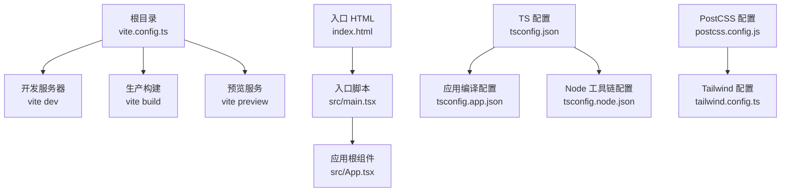
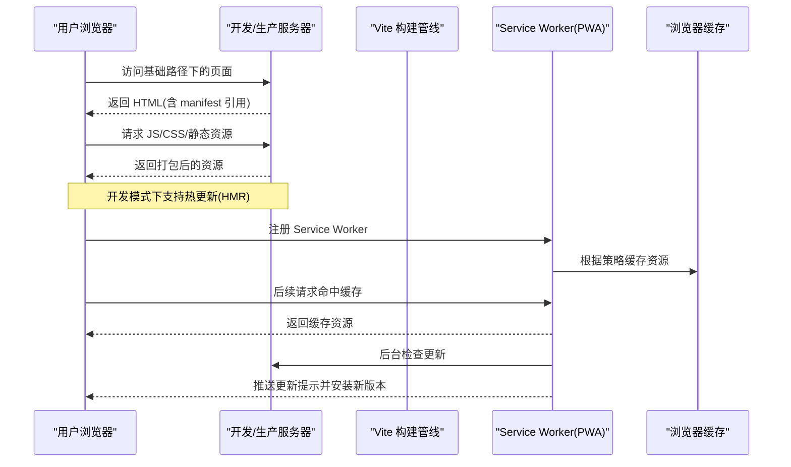
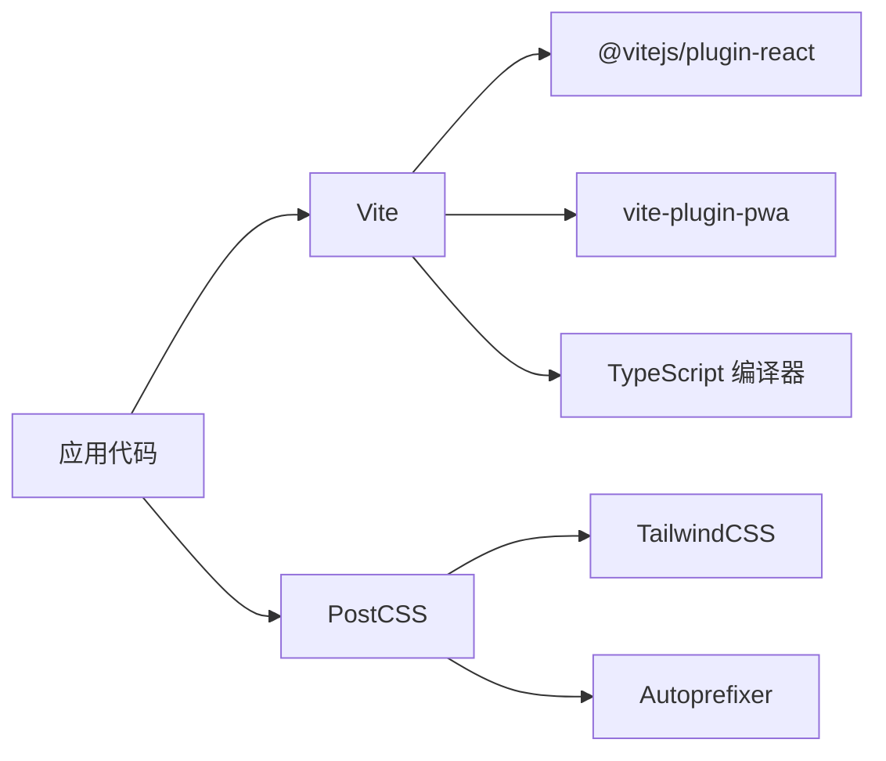

# Vite构建配置

<cite>
**本文引用的文件**
- [vite.config.ts](file://vite.config.ts)
- [package.json](file://package.json)
- [index.html](file://index.html)
- [public/manifest.json](file://public/manifest.json)
- [tsconfig.json](file://tsconfig.json)
- [tsconfig.app.json](file://tsconfig.app.json)
- [tsconfig.node.json](file://tsconfig.node.json)
- [tailwind.config.ts](file://tailwind.config.ts)
- [postcss.config.js](file://postcss.config.js)
- [eslint.config.js](file://eslint.config.js)
- [src/main.tsx](file://src/main.tsx)
- [src/App.tsx](file://src/App.tsx)
</cite>

## 目录
1. [简介](#简介)
2. [项目结构](#项目结构)
3. [核心组件](#核心组件)
4. [架构总览](#架构总览)
5. [详细组件分析](#详细组件分析)
6. [依赖关系分析](#依赖关系分析)
7. [性能考量](#性能考量)
8. [故障排查指南](#故障排查指南)
9. [结论](#结论)
10. [附录](#附录)

## 简介
本文件面向使用 Vite 的前端工程团队与个人开发者，系统化梳理本项目的构建配置与运行机制，重点覆盖以下方面：
- 基础路径与部署路径配置
- 插件体系：React 插件与 PWA 插件的启用与参数
- 路径别名与 TypeScript 路径映射
- 开发服务器与预览命令
- PWA 配置要点：自动更新、缓存策略、字体缓存优化、文件大小限制
- 代码分割与路由懒加载实践
- 构建输出与静态资源处理
- 开发与生产环境差异、热重载原理与自定义构建流程
- 性能优化建议、调试技巧与常见问题

## 项目结构
本项目采用多包/多入口的单仓库组织方式，核心应用位于根目录，同时包含多个子应用与归档版本。构建配置集中在根目录的 Vite 配置文件中，并通过 TypeScript 编译与 PostCSS/Tailwind 进行样式管线。

图表来源
- [vite.config.ts:1-32](file://vite.config.ts#L1-L32)
- [index.html:1-18](file://index.html#L1-L18)
- [src/main.tsx:1-23](file://src/main.tsx#L1-L23)
- [src/App.tsx:1-118](file://src/App.tsx#L1-L118)
- [tsconfig.json:1-8](file://tsconfig.json#L1-L8)
- [tsconfig.app.json:1-35](file://tsconfig.app.json#L1-L35)
- [tsconfig.node.json:1-25](file://tsconfig.node.json#L1-L25)
- [postcss.config.js:1-7](file://postcss.config.js#L1-L7)
- [tailwind.config.ts:1-79](file://tailwind.config.ts#L1-L79)

章节来源
- [vite.config.ts:1-32](file://vite.config.ts#L1-L32)
- [package.json:1-46](file://package.json#L1-L46)
- [index.html:1-18](file://index.html#L1-L18)
- [tsconfig.json:1-8](file://tsconfig.json#L1-L8)
- [tsconfig.app.json:1-35](file://tsconfig.app.json#L1-L35)
- [tsconfig.node.json:1-25](file://tsconfig.node.json#L1-L25)
- [postcss.config.js:1-7](file://postcss.config.js#L1-L7)
- [tailwind.config.ts:1-79](file://tailwind.config.ts#L1-L79)

## 核心组件
- 基础路径与部署位置
  - 通过基础路径配置实现子路径部署，便于在子路径下托管站点。
  - 参考：[vite.config.ts:7](file://vite.config.ts#L7)
- 插件系统
  - React 插件：启用 JSX 转换与开发时优化。
  - PWA 插件：生成 Service Worker、配置缓存策略与自动更新。
  - 参考：[vite.config.ts:8-25](file://vite.config.ts#L8-L25)
- 路径别名与 TS 路径映射
  - 使用路径别名统一导入前缀，提升可维护性。
  - 参考：[vite.config.ts:26-31](file://vite.config.ts#L26-L31)、[tsconfig.app.json:26-30](file://tsconfig.app.json#L26-L30)
- 开发服务器与预览
  - 开发命令、构建命令、预览命令由包脚本定义。
  - 参考：[package.json:6-11](file://package.json#L6-L11)
- PWA 清单与图标
  - HTML 中引用清单文件，清单内容在 public 目录中。
  - 参考：[index.html:9](file://index.html#L9)、[public/manifest.json:1-22](file://public/manifest.json#L1-L22)

章节来源
- [vite.config.ts:6-31](file://vite.config.ts#L6-L31)
- [package.json:6-11](file://package.json#L6-L11)
- [index.html:9](file://index.html#L9)
- [public/manifest.json:1-22](file://public/manifest.json#L1-L22)
- [tsconfig.app.json:26-30](file://tsconfig.app.json#L26-L30)

## 架构总览
下图展示从浏览器请求到应用渲染、再到 PWA 缓存与更新的整体流程。

图表来源
- [vite.config.ts:7-25](file://vite.config.ts#L7-L25)
- [index.html:9](file://index.html#L9)
- [public/manifest.json:1-22](file://public/manifest.json#L1-L22)
- [src/main.tsx:21-22](file://src/main.tsx#L21-L22)

## 详细组件分析

### 基础路径与部署配置
- 基础路径用于在子路径下正确加载静态资源与路由。
- 在生产环境中，若部署于子路径，需确保基础路径与实际部署路径一致。
- 参考：[vite.config.ts:7](file://vite.config.ts#L7)、[index.html:9](file://index.html#L9)、[public/manifest.json:5](file://public/manifest.json#L5)

章节来源
- [vite.config.ts:7](file://vite.config.ts#L7)
- [index.html:9](file://index.html#L9)
- [public/manifest.json:5](file://public/manifest.json#L5)

### 插件系统：React 插件与 PWA 插件
- React 插件
  - 提供 JSX 转换、开发时优化与按需注入等能力。
  - 参考：[vite.config.ts:8-9](file://vite.config.ts#L8-L9)
- PWA 插件
  - 自动注册类型：自动更新。
  - 清单：禁用自动生成，使用自定义清单。
  - Workbox 配置要点：
    - 缓存模式：globPatterns 与 runtimeCaching。
    - 字体缓存优化：Google Fonts 使用 CacheFirst 并指定独立缓存名。
    - 文件大小限制：maximumFileSizeToCacheInBytes。
  - 参考：[vite.config.ts:10-24](file://vite.config.ts#L10-L24)

章节来源
- [vite.config.ts:8-24](file://vite.config.ts#L8-L24)

### 路径别名与 TypeScript 路径映射
- Vite 层面通过解析器别名简化导入路径。
- TypeScript 层面通过路径映射保持编译期一致性。
- 参考：[vite.config.ts:26-31](file://vite.config.ts#L26-L31)、[tsconfig.app.json:26-30](file://tsconfig.app.json#L26-L30)

章节来源
- [vite.config.ts:26-31](file://vite.config.ts#L26-L31)
- [tsconfig.app.json:26-30](file://tsconfig.app.json#L26-L30)

### 开发服务器与预览
- 开发命令：启动 Vite 开发服务器，支持热更新。
- 构建命令：先执行 TypeScript 编译，再进行 Vite 生产构建。
- 预览命令：本地预览生产构建产物。
- 参考：[package.json:6-11](file://package.json#L6-L11)

章节来源
- [package.json:6-11](file://package.json#L6-L11)

### PWA 配置详解
- 自动更新
  - 通过 registerType: autoUpdate 实现后台自动检查与安装更新。
  - 参考：[vite.config.ts:11](file://vite.config.ts#L11)
- 缓存策略
  - 全站资源缓存：globPatterns 匹配常见静态资源扩展名。
  - 字体缓存优化：Google Fonts 使用 CacheFirst，并指定独立缓存名以隔离字体缓存。
  - 参考：[vite.config.ts:14-22](file://vite.config.ts#L14-L22)
- 文件大小限制
  - maximumFileSizeToCacheInBytes 控制可缓存的最大文件体积，避免大文件占用缓存空间。
  - 参考：[vite.config.ts:15](file://vite.config.ts#L15)
- 清单与图标
  - HTML 中引用清单文件；清单文件定义应用名称、图标与启动路径。
  - 参考：[index.html:9](file://index.html#L9)、[public/manifest.json:1-22](file://public/manifest.json#L1-L22)

章节来源
- [vite.config.ts:10-24](file://vite.config.ts#L10-L24)
- [index.html:9](file://index.html#L9)
- [public/manifest.json:1-22](file://public/manifest.json#L1-L22)

### 代码分割与资源优化
- 路由级懒加载
  - 应用通过 React.lazy 结合 Suspense 实现路由级代码分割，减少首屏体积。
  - 参考：[src/App.tsx:10-28](file://src/App.tsx#L10-L28)
- 构建输出与资源处理
  - Vite 默认按需切分模块；结合 PWA 缓存策略，可进一步优化重复访问体验。
  - 参考：[vite.config.ts:14](file://vite.config.ts#L14)

章节来源
- [src/App.tsx:10-28](file://src/App.tsx#L10-L28)
- [vite.config.ts:14](file://vite.config.ts#L14)

### 开发与生产环境差异
- 开发环境
  - 使用 Vite 开发服务器，支持热更新与快速错误反馈。
  - 参考：[package.json:7](file://package.json#L7)
- 生产环境
  - 使用 TypeScript 编译后进行 Vite 构建，产出静态资源并启用 PWA 缓存策略。
  - 参考：[package.json:8](file://package.json#L8)、[vite.config.ts:10-24](file://vite.config.ts#L10-L24)

章节来源
- [package.json:7-8](file://package.json#L7-L8)
- [vite.config.ts:10-24](file://vite.config.ts#L10-L24)

### 热重载机制工作原理
- Vite 在开发时通过 WebSocket 与浏览器通信，当检测到文件变更时仅刷新受影响模块或触发局部更新，从而显著缩短等待时间。
- 该机制与 React 插件协同，确保组件更新即时可见。
- 参考：[vite.config.ts:8-9](file://vite.config.ts#L8-L9)

章节来源
- [vite.config.ts:8-9](file://vite.config.ts#L8-L9)

### 自定义构建流程
- 当前流程：TypeScript 编译 → Vite 生产构建。
- 可扩展点：
  - 在 Vite 配置中添加自定义插件或修改 Rollup 输出选项。
  - 在构建前后增加校验或报告步骤。
- 参考：[package.json:8](file://package.json#L8)、[vite.config.ts:1-32](file://vite.config.ts#L1-L32)

章节来源
- [package.json:8](file://package.json#L8)
- [vite.config.ts:1-32](file://vite.config.ts#L1-L32)

## 依赖关系分析
- 构建与开发工具
  - Vite、@vitejs/plugin-react、vite-plugin-pwa、TypeScript、ESLint、TailwindCSS、Autoprefixer。
- 运行时依赖
  - React 生态、路由、UI 组件库与工具类库。
- 关键依赖关系
  - Vite 依赖 React 插件进行 JSX 处理；PWA 插件依赖 Workbox 进行缓存策略；Tailwind 通过 PostCSS 注入。

图表来源
- [package.json:12-44](file://package.json#L12-L44)
- [postcss.config.js:1-7](file://postcss.config.js#L1-L7)
- [tailwind.config.ts:1-79](file://tailwind.config.ts#L1-L79)

章节来源
- [package.json:12-44](file://package.json#L12-L44)
- [postcss.config.js:1-7](file://postcss.config.js#L1-L7)
- [tailwind.config.ts:1-79](file://tailwind.config.ts#L1-L79)

## 性能考量
- 资源缓存与字体优化
  - 对 Google Fonts 使用 CacheFirst 并单独命名缓存，降低网络往返与提升加载稳定性。
  - 参考：[vite.config.ts:16-22](file://vite.config.ts#L16-L22)
- 文件大小控制
  - 通过 maximumFileSizeToCacheInBytes 限制大文件进入缓存，避免缓存膨胀。
  - 参考：[vite.config.ts:15](file://vite.config.ts#L15)
- 代码分割
  - 路由懒加载减少首屏 JavaScript 体积，配合 PWA 缓存提升二次访问速度。
  - 参考：[src/App.tsx:10-28](file://src/App.tsx#L10-L28)
- 构建与样式管线
  - Tailwind 内容扫描范围明确，有助于 Tree Shaking；PostCSS/Autoprefixer 保证兼容性。
  - 参考：[tailwind.config.ts:5-7](file://tailwind.config.ts#L5-L7)、[postcss.config.js:1-7](file://postcss.config.js#L1-L7)

章节来源
- [vite.config.ts:15-22](file://vite.config.ts#L15-L22)
- [src/App.tsx:10-28](file://src/App.tsx#L10-L28)
- [tailwind.config.ts:5-7](file://tailwind.config.ts#L5-L7)
- [postcss.config.js:1-7](file://postcss.config.js#L1-L7)

## 故障排查指南
- PWA 未生效
  - 确认基础路径与部署路径一致；确认 HTML 中的 manifest 引用路径正确。
  - 参考：[vite.config.ts:7](file://vite.config.ts#L7)、[index.html:9](file://index.html#L9)
- 字体加载缓慢
  - 检查 Google Fonts 的缓存策略是否生效；确认缓存名与策略配置无误。
  - 参考：[vite.config.ts:16-22](file://vite.config.ts#L16-L22)
- 构建后资源 404
  - 检查基础路径与静态资源引用是否匹配；确认 public 目录中的图标与清单路径。
  - 参考：[index.html:9](file://index.html#L9)、[public/manifest.json:5](file://public/manifest.json#L5)
- TypeScript 类型错误
  - 确保 tsconfig.app.json 的路径映射与 Vite 别名一致；检查编译选项与模块解析。
  - 参考：[tsconfig.app.json:26-30](file://tsconfig.app.json#L26-L30)、[vite.config.ts:26-31](file://vite.config.ts#L26-L31)
- ESLint/Vite 协同问题
  - 确保 ESLint 配置启用 Vite 特定规则集，避免开发体验异常。
  - 参考：[eslint.config.js:1-24](file://eslint.config.js#L1-L24)

章节来源
- [vite.config.ts:7](file://vite.config.ts#L7)
- [index.html:9](file://index.html#L9)
- [public/manifest.json:5](file://public/manifest.json#L5)
- [vite.config.ts:16-22](file://vite.config.ts#L16-L22)
- [tsconfig.app.json:26-30](file://tsconfig.app.json#L26-L30)
- [vite.config.ts:26-31](file://vite.config.ts#L26-L31)
- [eslint.config.js:1-24](file://eslint.config.js#L1-L24)

## 结论
本项目的 Vite 配置围绕“子路径部署 + React + PWA”展开，通过合理的缓存策略、字体优化与代码分割，在开发体验与用户体验之间取得平衡。建议在后续迭代中持续关注缓存命中率、构建体积与更新频率之间的权衡，并结合业务场景调整 PWA 策略与构建参数。

## 附录
- 关键配置速览
  - 基础路径：[vite.config.ts:7](file://vite.config.ts#L7)
  - React 插件：[vite.config.ts:8-9](file://vite.config.ts#L8-L9)
  - PWA 插件：[vite.config.ts:10-24](file://vite.config.ts#L10-L24)
  - 路径别名：[vite.config.ts:26-31](file://vite.config.ts#L26-L31)
  - TypeScript 路径映射：[tsconfig.app.json:26-30](file://tsconfig.app.json#L26-L30)
  - 构建命令：[package.json:8](file://package.json#L8)
  - 清单与图标：[index.html:9](file://index.html#L9)、[public/manifest.json:1-22](file://public/manifest.json#L1-L22)