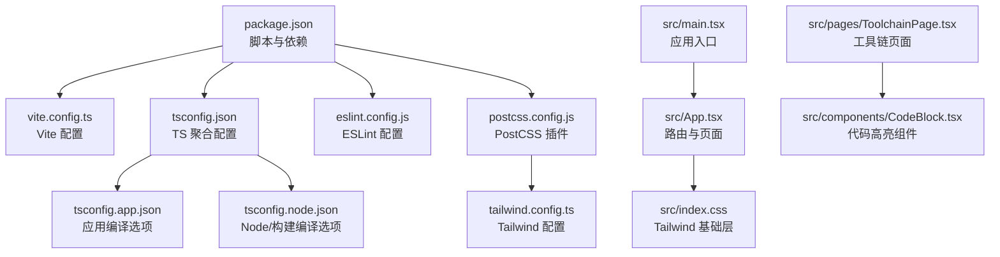
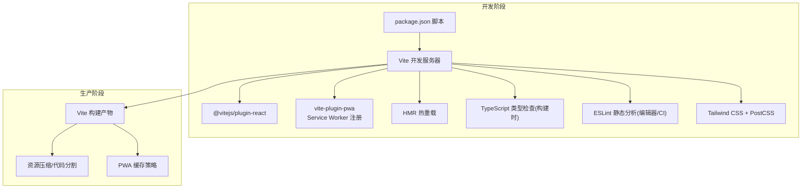
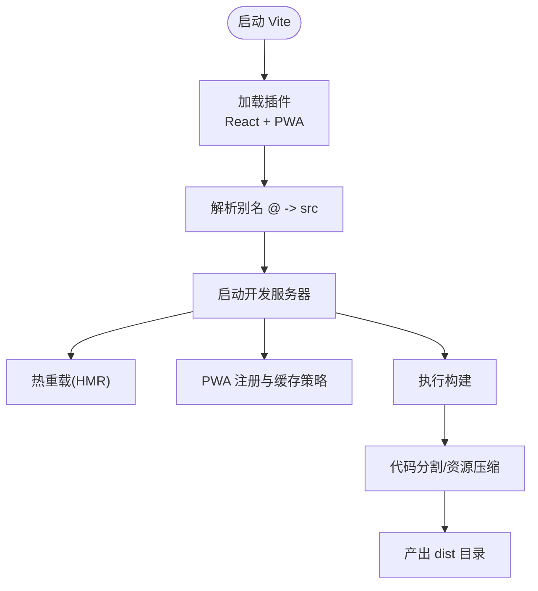
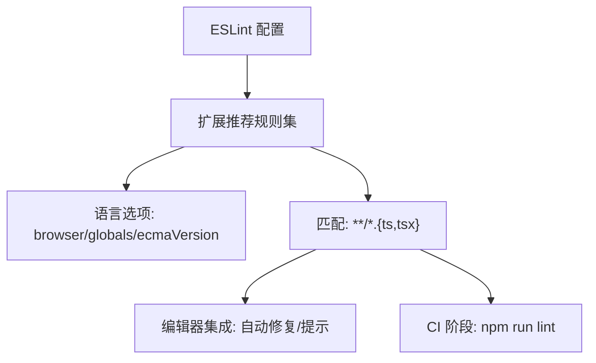
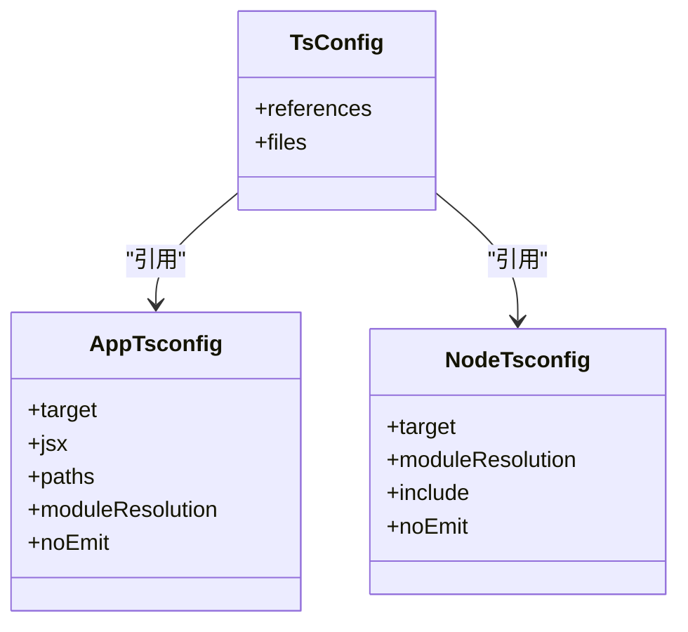
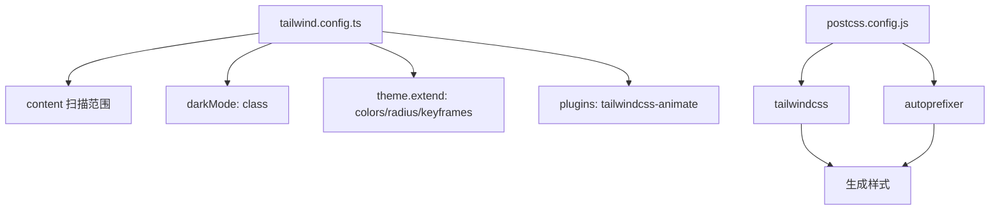
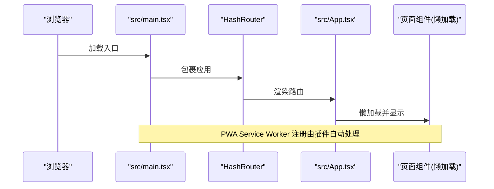
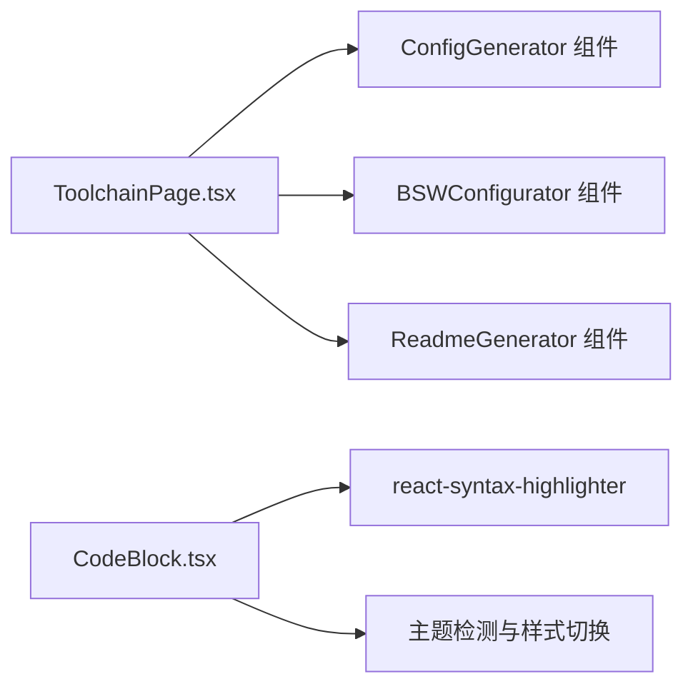
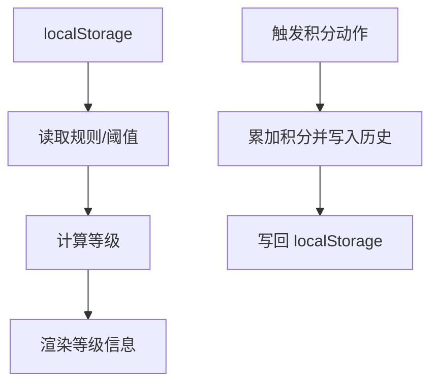
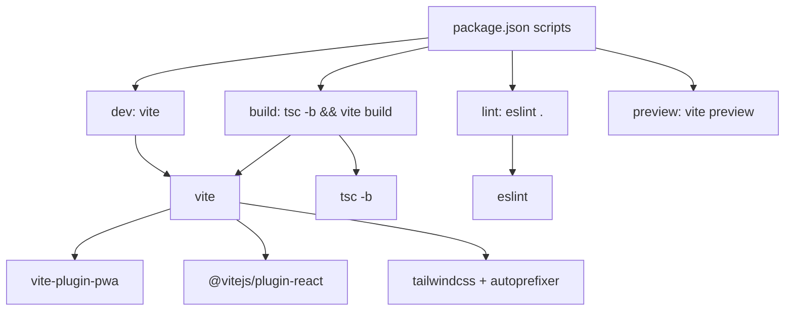

# 开发工具

<cite>
**本文引用的文件**
- [vite.config.ts](file://vite.config.ts)
- [package.json](file://package.json)
- [eslint.config.js](file://eslint.config.js)
- [tsconfig.json](file://tsconfig.json)
- [tsconfig.app.json](file://tsconfig.app.json)
- [tsconfig.node.json](file://tsconfig.node.json)
- [tailwind.config.ts](file://tailwind.config.ts)
- [postcss.config.js](file://postcss.config.js)
- [src/main.tsx](file://src/main.tsx)
- [src/App.tsx](file://src/App.tsx)
- [src/index.css](file://src/index.css)
- [src/pages/ToolchainPage.tsx](file://src/pages/ToolchainPage.tsx)
- [src/components/CodeBlock.tsx](file://src/components/CodeBlock.tsx)
- [src/hooks/useUserSystem.ts](file://src/hooks/useUserSystem.ts)
- [README.md](file://README.md)
</cite>

## 目录
1. [引言](#引言)
2. [项目结构](#项目结构)
3. [核心组件](#核心组件)
4. [架构总览](#架构总览)
5. [详细组件分析](#详细组件分析)
6. [依赖关系分析](#依赖关系分析)
7. [性能考量](#性能考量)
8. [故障排查指南](#故障排查指南)
9. [结论](#结论)
10. [附录](#附录)

## 引言
本文件为 YuleTech 社区技术平台的开发工具链综合文档，聚焦于以下方面：
- Vite 构建工具的配置策略、插件系统与开发服务器功能
- ESLint 代码规范配置、TypeScript 编译配置与 Tailwind CSS 工具配置
- 开发环境搭建、热重载机制与调试工具使用
- 代码格式化、自动修复与静态分析工具的集成
- 开发效率提升技巧、IDE 配置建议与团队协作规范
- 构建优化、代码分割与资源压缩策略
- 开发工具的性能监控、错误追踪与调试技巧
- 工具链定制与扩展的配置指导

## 项目结构
该仓库采用多应用单体结构，核心入口位于 src/main.tsx，路由由 src/App.tsx 统一管理；样式体系由 Tailwind CSS 与 PostCSS 驱动；构建与开发工具链由 Vite、ESLint、TypeScript 配置共同组成。

图表来源
- [package.json:1-46](file://package.json#L1-L46)
- [vite.config.ts:1-32](file://vite.config.ts#L1-L32)
- [tsconfig.json:1-8](file://tsconfig.json#L1-L8)
- [tsconfig.app.json:1-35](file://tsconfig.app.json#L1-L35)
- [tsconfig.node.json:1-25](file://tsconfig.node.json#L1-L25)
- [eslint.config.js:1-24](file://eslint.config.js#L1-L24)
- [postcss.config.js:1-7](file://postcss.config.js#L1-L7)
- [tailwind.config.ts:1-79](file://tailwind.config.ts#L1-L79)
- [src/main.tsx:1-23](file://src/main.tsx#L1-L23)
- [src/App.tsx:1-118](file://src/App.tsx#L1-L118)
- [src/index.css:1-112](file://src/index.css#L1-L112)
- [src/pages/ToolchainPage.tsx:1-380](file://src/pages/ToolchainPage.tsx#L1-L380)
- [src/components/CodeBlock.tsx:1-49](file://src/components/CodeBlock.tsx#L1-L49)

章节来源
- [README.md:1-95](file://README.md#L1-L95)
- [package.json:1-46](file://package.json#L1-L46)

## 核心组件
- Vite 构建与开发服务器：启用 React 插件、PWA 支持、路径别名与工作缓存策略
- ESLint：基于 flat 配置，启用 TS 推荐规则、React Hooks、React Refresh 与浏览器全局
- TypeScript：分层 tsconfig，分别面向应用与 Node/构建脚本
- Tailwind CSS：暗色模式、内容扫描、动画插件与 PostCSS 自动前缀
- 应用入口与路由：HashRouter、HelmetProvider、主题上下文与按需加载页面

章节来源
- [vite.config.ts:1-32](file://vite.config.ts#L1-L32)
- [eslint.config.js:1-24](file://eslint.config.js#L1-L24)
- [tsconfig.json:1-8](file://tsconfig.json#L1-L8)
- [tsconfig.app.json:1-35](file://tsconfig.app.json#L1-L35)
- [tsconfig.node.json:1-25](file://tsconfig.node.json#L1-L25)
- [tailwind.config.ts:1-79](file://tailwind.config.ts#L1-L79)
- [postcss.config.js:1-7](file://postcss.config.js#L1-L7)
- [src/main.tsx:1-23](file://src/main.tsx#L1-L23)
- [src/App.tsx:1-118](file://src/App.tsx#L1-L118)

## 架构总览
下图展示了前端工具链在开发与生产阶段的交互关系与职责边界。

图表来源
- [package.json:6-11](file://package.json#L6-L11)
- [vite.config.ts:8-25](file://vite.config.ts#L8-L25)
- [postcss.config.js:1-7](file://postcss.config.js#L1-L7)
- [tailwind.config.ts:1-79](file://tailwind.config.ts#L1-L79)

## 详细组件分析

### Vite 构建与开发服务器
- 基础路径与别名：设置 base 与 @ 到 src 的路径别名，便于统一导入
- 插件体系：
  - React 插件：启用 React JSX 转换与 React Refresh
  - PWA 插件：自动更新注册类型、缓存模式与运行时缓存策略（字体 CDN 缓存、最大文件大小限制）
- 资源缓存与离线体验：针对 Google Fonts 的 CacheFirst 策略与较大资源阈值，平衡加载速度与存储占用
- 适用场景：本地开发（HMR）、预览（静态服务器）与生产构建（配合 TypeScript 与 Tailwind）

图表来源
- [vite.config.ts:6-31](file://vite.config.ts#L6-L31)

章节来源
- [vite.config.ts:1-32](file://vite.config.ts#L1-L32)
- [package.json:6-11](file://package.json#L6-L11)

### ESLint 代码规范配置
- 使用 flat 配置风格，对 TS/TSX 文件启用推荐规则
- 扩展项：JS 推荐规则、TS ESLint 推荐规则、React Hooks 推荐规则、React Refresh（Vite 场景）
- 语言环境：浏览器全局变量，目标 ECMAScript 版本 2020
- 集成建议：在 IDE 中启用 ESLint，结合保存时自动修复；CI 中执行 lint 脚本

图表来源
- [eslint.config.js:8-23](file://eslint.config.js#L8-L23)

章节来源
- [eslint.config.js:1-24](file://eslint.config.js#L1-L24)
- [package.json:9](file://package.json#L9)

### TypeScript 编译配置
- 聚合配置：通过 references 引用应用与 Node/构建配置
- 应用配置（app）：
  - 目标 ES2023、React JSX、路径别名 @/*
  - bundler 模式、严格未使用检查、无 emit（仅类型检查）
- Node/构建配置（node）：
  - 目标 ES2023、仅包含 vite.config.ts
  - bundler 模式、严格未使用检查、无 emit
- 与 Vite 协作：Vite 在开发时进行按需编译与类型检查，生产构建通过 tsc -b 与 vite build 并行优化

图表来源
- [tsconfig.json:1-8](file://tsconfig.json#L1-L8)
- [tsconfig.app.json:1-35](file://tsconfig.app.json#L1-L35)
- [tsconfig.node.json:1-25](file://tsconfig.node.json#L1-L25)

章节来源
- [tsconfig.json:1-8](file://tsconfig.json#L1-L8)
- [tsconfig.app.json:1-35](file://tsconfig.app.json#L1-L35)
- [tsconfig.node.json:1-25](file://tsconfig.node.json#L1-L25)
- [package.json:8](file://package.json#L8)

### Tailwind CSS 工具配置
- 内容扫描：index.html 与 src 下 TS/TSX 文件，确保按需生成样式
- 暗色模式：基于 class 策略，根元素切换 .dark 控制主题
- 主题扩展：容器、颜色系统、圆角、关键帧与动画
- 插件：tailwindcss-animate 动画插件
- PostCSS：Tailwind 与 Autoprefixer 自动前缀

图表来源
- [tailwind.config.ts:3-76](file://tailwind.config.ts#L3-L76)
- [postcss.config.js:1-7](file://postcss.config.js#L1-L7)
- [src/index.css:1-3](file://src/index.css#L1-L3)

章节来源
- [tailwind.config.ts:1-79](file://tailwind.config.ts#L1-L79)
- [postcss.config.js:1-7](file://postcss.config.js#L1-L7)
- [src/index.css:1-112](file://src/index.css#L1-L112)

### 应用入口与路由
- 入口：ReactDOM 渲染，提供 HelmetProvider、主题上下文与 HashRouter
- 路由：使用 React Router DOM 的懒加载与 Suspense，按需加载各页面组件
- PWA：入口注释指出 Service Worker 由 vite-plugin-pwa 自动注入

图表来源
- [src/main.tsx:1-23](file://src/main.tsx#L1-L23)
- [src/App.tsx:10-28](file://src/App.tsx#L10-L28)

章节来源
- [src/main.tsx:1-23](file://src/main.tsx#L1-L23)
- [src/App.tsx:1-118](file://src/App.tsx#L1-L118)

### 工具链页面与代码高亮
- 工具链页面：集中展示配置工具、编译脚本、调试工具与测试验证类工具
- 代码高亮组件：根据主题动态选择语法高亮样式，并适配背景色

图表来源
- [src/pages/ToolchainPage.tsx:17-19](file://src/pages/ToolchainPage.tsx#L17-L19)
- [src/components/CodeBlock.tsx:14-26](file://src/components/CodeBlock.tsx#L14-L26)

章节来源
- [src/pages/ToolchainPage.tsx:1-380](file://src/pages/ToolchainPage.tsx#L1-L380)
- [src/components/CodeBlock.tsx:1-49](file://src/components/CodeBlock.tsx#L1-L49)

### 用户积分与等级系统（Hook 示例）
- 本地存储：用户积分与历史记录持久化
- 可配置规则：支持从本地存储覆盖默认积分规则与等级阈值
- 等级计算：根据当前积分落在阈值区间返回对应等级信息

图表来源
- [src/hooks/useUserSystem.ts:91-132](file://src/hooks/useUserSystem.ts#L91-L132)

章节来源
- [src/hooks/useUserSystem.ts:1-135](file://src/hooks/useUserSystem.ts#L1-L135)

## 依赖关系分析
- 脚本与任务：
  - dev：启动 Vite 开发服务器
  - build：先执行 tsc -b 进行类型检查与增量构建，再执行 vite build 产出生产包
  - lint：执行 ESLint 对项目进行静态分析
  - preview：预览生产构建结果
- 关键依赖：
  - Vite 与 React 插件：提供开发与构建能力
  - PWA 插件：提供 Service Worker 与缓存策略
  - Tailwind CSS 与 PostCSS：提供原子化样式与自动前缀
  - TypeScript 与 ESLint：提供类型安全与代码规范

图表来源
- [package.json:6-11](file://package.json#L6-L11)
- [vite.config.ts:2](file://vite.config.ts#L2)
- [vite.config.ts:3](file://vite.config.ts#L3)
- [postcss.config.js:1-7](file://postcss.config.js#L1-L7)

章节来源
- [package.json:1-46](file://package.json#L1-L46)

## 性能考量
- 构建优化
  - 代码分割：路由懒加载与组件按需导入，减少首屏体积
  - 资源压缩：Vite 默认启用压缩与最小化
  - PWA 缓存：针对字体等静态资源采用 CacheFirst，提升二次访问性能
- 开发体验
  - HMR：组件热替换，保持状态的同时快速反馈修改
  - 类型检查：开发阶段由 Vite 进行按需类型检查，避免全量 tsc 带来的等待
- 样式与资源
  - Tailwind 按需生成，结合 PostCSS 自动前缀，减少冗余样式
  - 图片与字体资源通过 PWA 缓存策略优化加载

[本节为通用性能建议，不直接分析具体文件]

## 故障排查指南
- 开发服务器无法启动或端口冲突
  - 检查 Vite 配置与端口占用情况
  - 确认插件加载顺序与别名解析是否正确
- PWA 不生效或缓存异常
  - 检查 PWA 插件配置与运行时缓存策略
  - 确认 Service Worker 注入与注册流程
- ESLint 报错或规则冲突
  - 使用编辑器集成自动修复
  - 在 CI 中执行 npm run lint，定位并修正问题
- Tailwind 样式未生效
  - 确认 content 扫描范围包含相关文件
  - 检查 PostCSS 插件顺序与 Tailwind 版本兼容性
- TypeScript 类型错误
  - 使用 tsc -b 或在 IDE 中查看类型错误
  - 检查 tsconfig.app 与 tsconfig.node 的 moduleResolution 与 bundler 模式一致性

章节来源
- [vite.config.ts:1-32](file://vite.config.ts#L1-L32)
- [eslint.config.js:1-24](file://eslint.config.js#L1-L24)
- [tailwind.config.ts:1-79](file://tailwind.config.ts#L1-L79)
- [postcss.config.js:1-7](file://postcss.config.js#L1-L7)
- [tsconfig.app.json:1-35](file://tsconfig.app.json#L1-L35)
- [tsconfig.node.json:1-25](file://tsconfig.node.json#L1-L25)

## 结论
本工具链以 Vite 为核心，结合 React 插件、PWA、ESLint、TypeScript 与 Tailwind CSS，形成一套现代化、高性能且易于扩展的前端开发与构建体系。通过懒加载、按需样式与缓存策略，兼顾开发效率与用户体验；通过类型检查与静态分析，保障代码质量与可维护性。团队可在现有配置基础上，按需扩展插件与规则，持续优化工具链以适应业务演进。

[本节为总结性内容，不直接分析具体文件]

## 附录
- 开发环境搭建
  - 安装依赖：npm install
  - 启动开发：npm run dev
  - 生产构建：npm run build
  - 预览构建：npm run preview
  - 代码检查：npm run lint
- IDE 配置建议
  - 启用 ESLint 与 Prettier（如使用）自动修复
  - 配置 TypeScript 与 Tailwind CSS 插件以获得最佳提示
- 团队协作规范
  - 统一 ESLint 规则与提交前检查
  - 优先使用路由与组件懒加载，控制首屏体积
  - PWA 缓存策略遵循“静态资源优先”的原则

章节来源
- [README.md:68-82](file://README.md#L68-L82)
- [package.json:6-11](file://package.json#L6-L11)