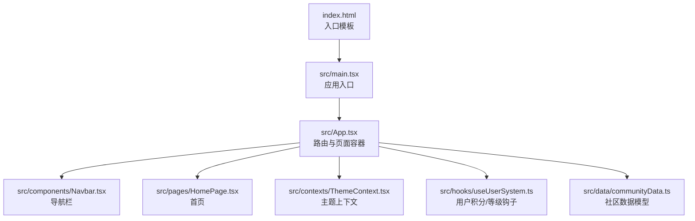
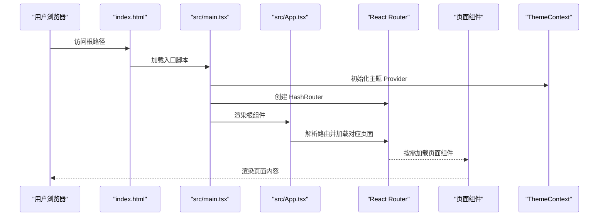
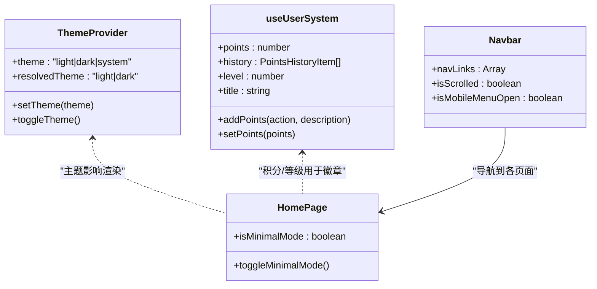
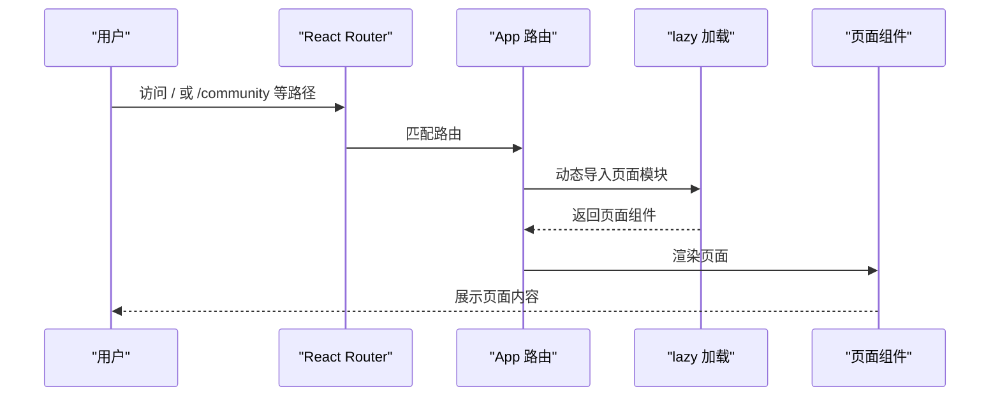
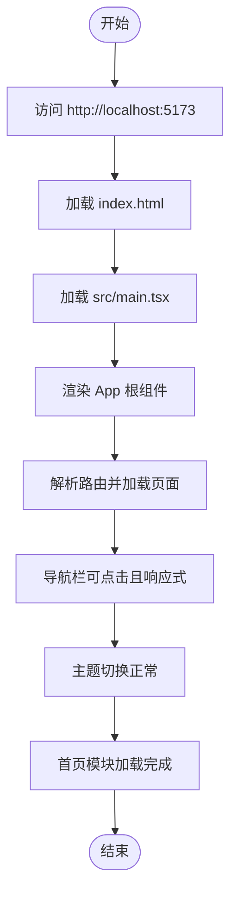

# 快速开始

<cite>
**本文引用的文件**
- [README.md](file://README.md)
- [package.json](file://package.json)
- [vite.config.ts](file://vite.config.ts)
- [tsconfig.json](file://tsconfig.json)
- [tsconfig.app.json](file://tsconfig.app.json)
- [tsconfig.node.json](file://tsconfig.node.json)
- [tailwind.config.ts](file://tailwind.config.ts)
- [index.html](file://index.html)
- [src/main.tsx](file://src/main.tsx)
- [src/App.tsx](file://src/App.tsx)
- [src/components/Navbar.tsx](file://src/components/Navbar.tsx)
- [src/pages/HomePage.tsx](file://src/pages/HomePage.tsx)
- [src/contexts/ThemeContext.tsx](file://src/contexts/ThemeContext.tsx)
- [src/hooks/useUserSystem.ts](file://src/hooks/useUserSystem.ts)
- [src/data/communityData.ts](file://src/data/communityData.ts)
- [RELEASE_NOTES.md](file://RELEASE_NOTES.md)
- [ROADMAP.md](file://ROADMAP.md)
</cite>

## 目录
1. [简介](#简介)
2. [项目结构](#项目结构)
3. [核心组件](#核心组件)
4. [架构总览](#架构总览)
5. [详细组件分析](#详细组件分析)
6. [依赖分析](#依赖分析)
7. [性能考虑](#性能考虑)
8. [故障排除指南](#故障排除指南)
9. [结论](#结论)
10. [附录](#附录)

## 简介
本指南面向初次接触 YuleTech 社区技术平台的开发者，帮助你在本地快速搭建开发环境、运行项目并进行首次验证。内容涵盖环境要求、项目克隆与依赖安装、开发服务器启动流程、常见问题排查、项目结构概览、首次运行验证步骤与预期结果。

## 项目结构
该项目采用多页面应用（SPA）架构，基于 React 19 + TypeScript，使用 Vite 作为构建工具与开发服务器，Tailwind CSS 作为样式基础，配合 PWA 插件提供离线与安装能力。应用入口位于 src/main.tsx，根组件 App.tsx 负责路由与页面组织；公共组件与页面分别位于 src/components 与 src/pages；主题与用户系统通过 Context 与 Hooks 管理。

**图表来源**
- [index.html](file://index.html)
- [src/main.tsx](file://src/main.tsx)
- [src/App.tsx](file://src/App.tsx)
- [src/components/Navbar.tsx](file://src/components/Navbar.tsx)
- [src/pages/HomePage.tsx](file://src/pages/HomePage.tsx)
- [src/contexts/ThemeContext.tsx](file://src/contexts/ThemeContext.tsx)
- [src/hooks/useUserSystem.ts](file://src/hooks/useUserSystem.ts)
- [src/data/communityData.ts](file://src/data/communityData.ts)

**章节来源**
- [README.md](file://README.md)
- [src/main.tsx](file://src/main.tsx)
- [src/App.tsx](file://src/App.tsx)

## 核心组件
- 应用入口与上下文
  - 入口文件负责挂载 React 根节点、注入 Helmet Provider、主题 Provider 与 HashRouter，并引入全局样式。
  - 参考路径：[src/main.tsx](file://src/main.tsx)
- 根组件与路由
  - 根组件集中声明公开路由与管理后台路由，使用 React.lazy 实现按需加载与 Suspense 占位。
  - 参考路径：[src/App.tsx](file://src/App.tsx)
- 导航栏
  - 提供桌面与移动端导航、搜索、通知、主题切换、管理员入口等能力。
  - 参考路径：[src/components/Navbar.tsx](file://src/components/Navbar.tsx)
- 首页
  - 首页聚合 Hero、Features、GitHub 仪表盘、每日代码、统计、开源架构、社区与 CTA 等模块，并支持“极简模式”切换。
  - 参考路径：[src/pages/HomePage.tsx](file://src/pages/HomePage.tsx)
- 主题系统
  - 通过 Context 管理 light/dark/system 三种主题模式，持久化存储并监听系统偏好变化。
  - 参考路径：[src/contexts/ThemeContext.tsx](file://src/contexts/ThemeContext.tsx)
- 用户系统
  - 提供积分、等级阈值、行为计分与历史记录管理，数据持久化于本地存储。
  - 参考路径：[src/hooks/useUserSystem.ts](file://src/hooks/useUserSystem.ts)
- 社区数据模型
  - 定义论坛、问答、活动等数据接口与初始示例数据，支撑前端页面展示。
  - 参考路径：[src/data/communityData.ts](file://src/data/communityData.ts)

**章节来源**
- [src/main.tsx](file://src/main.tsx)
- [src/App.tsx](file://src/App.tsx)
- [src/components/Navbar.tsx](file://src/components/Navbar.tsx)
- [src/pages/HomePage.tsx](file://src/pages/HomePage.tsx)
- [src/contexts/ThemeContext.tsx](file://src/contexts/ThemeContext.tsx)
- [src/hooks/useUserSystem.ts](file://src/hooks/useUserSystem.ts)
- [src/data/communityData.ts](file://src/data/communityData.ts)

## 架构总览
下图展示了从浏览器请求到页面渲染的关键路径，包括路由解析、组件加载、主题与上下文注入、PWA 注册与缓存策略。

**图表来源**
- [index.html](file://index.html)
- [src/main.tsx](file://src/main.tsx)
- [src/App.tsx](file://src/App.tsx)

## 详细组件分析

### 组件类图（代码级）

**图表来源**
- [src/contexts/ThemeContext.tsx](file://src/contexts/ThemeContext.tsx)
- [src/hooks/useUserSystem.ts](file://src/hooks/useUserSystem.ts)
- [src/components/Navbar.tsx](file://src/components/Navbar.tsx)
- [src/pages/HomePage.tsx](file://src/pages/HomePage.tsx)

**章节来源**
- [src/contexts/ThemeContext.tsx](file://src/contexts/ThemeContext.tsx)
- [src/hooks/useUserSystem.ts](file://src/hooks/useUserSystem.ts)
- [src/components/Navbar.tsx](file://src/components/Navbar.tsx)
- [src/pages/HomePage.tsx](file://src/pages/HomePage.tsx)

### 路由与页面加载序列图

**图表来源**
- [src/App.tsx](file://src/App.tsx)

**章节来源**
- [src/App.tsx](file://src/App.tsx)

### 首次运行验证流程图

**图表来源**
- [index.html](file://index.html)
- [src/main.tsx](file://src/main.tsx)
- [src/App.tsx](file://src/App.tsx)
- [src/components/Navbar.tsx](file://src/components/Navbar.tsx)
- [src/pages/HomePage.tsx](file://src/pages/HomePage.tsx)

**章节来源**
- [index.html](file://index.html)
- [src/main.tsx](file://src/main.tsx)
- [src/App.tsx](file://src/App.tsx)
- [src/components/Navbar.tsx](file://src/components/Navbar.tsx)
- [src/pages/HomePage.tsx](file://src/pages/HomePage.tsx)

## 依赖分析
- 构建与开发
  - Vite 作为开发服务器与打包工具，配置别名 @ 指向 src 目录，启用 PWA 插件并设置 base 路径。
  - 参考路径：[vite.config.ts](file://vite.config.ts)
- 类型与编译
  - TypeScript 采用多项目引用（references），分别针对应用与 Node 工具链配置。
  - 参考路径：[tsconfig.json](file://tsconfig.json)、[tsconfig.app.json](file://tsconfig.app.json)、[tsconfig.node.json](file://tsconfig.node.json)
- 样式与主题
  - Tailwind CSS 配置 content 范围与动画插件，支持暗色模式 class 前缀。
  - 参考路径：[tailwind.config.ts](file://tailwind.config.ts)
- 运行与脚本
  - package.json 定义 dev/build/lint/preview 脚本，依赖 react、react-router-dom、tailwind 等。
  - 参考路径：[package.json](file://package.json)

**章节来源**
- [vite.config.ts](file://vite.config.ts)
- [tsconfig.json](file://tsconfig.json)
- [tsconfig.app.json](file://tsconfig.app.json)
- [tsconfig.node.json](file://tsconfig.node.json)
- [tailwind.config.ts](file://tailwind.config.ts)
- [package.json](file://package.json)

## 性能考虑
- 代码分割与懒加载
  - App 中使用 React.lazy 与 Suspense 对页面进行按需加载，降低首屏体积与等待时间。
  - 参考路径：[src/App.tsx](file://src/App.tsx)
- 路由模式
  - 使用 HashRouter，避免服务端配置即可本地开发与部署。
  - 参考路径：[src/main.tsx](file://src/main.tsx)
- PWA 缓存策略
  - VitePWA 配置 runtime caching 与最大文件尺寸，提升离线与重复访问体验。
  - 参考路径：[vite.config.ts](file://vite.config.ts)
- 样式范围
  - Tailwind content 仅扫描 src 与 index.html，避免无关文件参与样式扫描。
  - 参考路径：[tailwind.config.ts](file://tailwind.config.ts)

**章节来源**
- [src/App.tsx](file://src/App.tsx)
- [src/main.tsx](file://src/main.tsx)
- [vite.config.ts](file://vite.config.ts)
- [tailwind.config.ts](file://tailwind.config.ts)

## 故障排除指南
- 依赖安装失败（Node 版本不兼容）
  - 现象：npm ci/npm install 报错，提示 peer 依赖冲突或 Node 版本过低。
  - 处理：确保使用 Node.js 与 npm 的稳定 LTS 版本；若仍失败，清理 node_modules 与缓存后重试。
  - 参考路径：[package.json](file://package.json)
- 构建失败（Vite 与 PWA 版本冲突）
  - 现象：构建时报错，提示 Vite 与 vite-plugin-pwa 的 peer 依赖不匹配。
  - 处理：遵循项目已修复的版本约束，使用与配置一致的 Vite/PWA 版本。
  - 参考路径：[RELEASE_NOTES.md](file://RELEASE_NOTES.md)
- 开发服务器无法启动（端口占用）
  - 现象：npm run dev 启动失败，提示端口被占用。
  - 处理：更换端口或释放占用端口后重试。
  - 参考路径：[package.json](file://package.json)
- 路由 404 或刷新后空白
  - 现象：使用 History 路由时刷新页面出现 404。
  - 处理：项目使用 HashRouter，无需额外配置；若自定义部署，请确保服务端支持前端路由回退。
  - 参考路径：[src/main.tsx](file://src/main.tsx)
- PWA 注册冲突
  - 现象：控制台出现重复 Service Worker 注册或缓存异常。
  - 处理：移除手动注册，使用 VitePWA 自动注入；确保只存在一个 SW。
  - 参考路径：[src/main.tsx](file://src/main.tsx)、[vite.config.ts](file://vite.config.ts)
- 主题切换无效
  - 现象：切换主题后未生效或刷新后恢复默认。
  - 处理：确认 ThemeProvider 正常包裹应用根节点，检查本地存储权限与键值。
  - 参考路径：[src/contexts/ThemeContext.tsx](file://src/contexts/ThemeContext.tsx)
- 首页模块缺失或极简模式异常
  - 现象：首页缺少部分模块或极简模式开关无效。
  - 处理：检查 localStorage 中相关键值是否存在；确认页面加载完成后再操作。
  - 参考路径：[src/pages/HomePage.tsx](file://src/pages/HomePage.tsx)

**章节来源**
- [package.json](file://package.json)
- [RELEASE_NOTES.md](file://RELEASE_NOTES.md)
- [src/main.tsx](file://src/main.tsx)
- [vite.config.ts](file://vite.config.ts)
- [src/contexts/ThemeContext.tsx](file://src/contexts/ThemeContext.tsx)
- [src/pages/HomePage.tsx](file://src/pages/HomePage.tsx)

## 结论
通过本指南，你已完成 YuleTech 社区技术平台的环境准备、项目启动与基础验证。建议在本地开发过程中结合版本说明与路线图，逐步完善主题、搜索、文档与用户系统等功能模块，持续优化用户体验与社区生态。

## 附录

### 环境要求与前置条件
- Node.js 与包管理器
  - 使用 Node.js 的稳定 LTS 版本，配合 npm（建议使用与 Node LTS 对应的 npm 版本）。
  - 参考路径：[package.json](file://package.json)
- 构建工具
  - Vite 作为开发服务器与打包工具，Tailwind CSS 作为样式基础。
  - 参考路径：[vite.config.ts](file://vite.config.ts)、[tailwind.config.ts](file://tailwind.config.ts)
- TypeScript
  - 多项目引用配置，分别针对应用与 Node 工具链。
  - 参考路径：[tsconfig.json](file://tsconfig.json)、[tsconfig.app.json](file://tsconfig.app.json)、[tsconfig.node.json](file://tsconfig.node.json)

**章节来源**
- [package.json](file://package.json)
- [vite.config.ts](file://vite.config.ts)
- [tailwind.config.ts](file://tailwind.config.ts)
- [tsconfig.json](file://tsconfig.json)
- [tsconfig.app.json](file://tsconfig.app.json)
- [tsconfig.node.json](file://tsconfig.node.json)

### 逐步操作指南
- 克隆与安装
  - 克隆仓库后，在项目根目录执行依赖安装命令。
  - 参考路径：[README.md](file://README.md)
- 启动开发服务器
  - 使用开发脚本启动本地服务，默认端口为 5173。
  - 参考路径：[package.json](file://package.json)
- 预览生产构建
  - 生成生产构建产物并本地预览。
  - 参考路径：[package.json](file://package.json)

**章节来源**
- [README.md](file://README.md)
- [package.json](file://package.json)

### 首次运行验证清单
- 页面可访问
  - 成功打开 http://localhost:5173，首页内容完整加载。
  - 参考路径：[src/pages/HomePage.tsx](file://src/pages/HomePage.tsx)
- 导航功能
  - 导航栏可点击，移动端菜单正常展开与收起。
  - 参考路径：[src/components/Navbar.tsx](file://src/components/Navbar.tsx)
- 主题切换
  - 切换主题后页面样式即时更新，刷新后保持一致。
  - 参考路径：[src/contexts/ThemeContext.tsx](file://src/contexts/ThemeContext.tsx)
- 路由与页面
  - 访问 /community、/learning、/blog 等路由，页面按需加载成功。
  - 参考路径：[src/App.tsx](file://src/App.tsx)
- PWA 与缓存
  - 控制台无重复 Service Worker 注册警告，缓存命中正常。
  - 参考路径：[src/main.tsx](file://src/main.tsx)、[vite.config.ts](file://vite.config.ts)

**章节来源**
- [src/pages/HomePage.tsx](file://src/pages/HomePage.tsx)
- [src/components/Navbar.tsx](file://src/components/Navbar.tsx)
- [src/contexts/ThemeContext.tsx](file://src/contexts/ThemeContext.tsx)
- [src/App.tsx](file://src/App.tsx)
- [src/main.tsx](file://src/main.tsx)
- [vite.config.ts](file://vite.config.ts)

### 项目结构速览
- 根目录
  - package.json、vite.config.ts、tsconfig.*、tailwind.config.ts 等配置文件。
  - 参考路径：[package.json](file://package.json)、[vite.config.ts](file://vite.config.ts)、[tsconfig.json](file://tsconfig.json)、[tailwind.config.ts](file://tailwind.config.ts)
- public
  - 静态资源与 manifest 文件，用于 PWA 与图标。
  - 参考路径：[index.html](file://index.html)
- src
  - components（通用组件）、pages（页面）、contexts（上下文）、hooks（自定义 Hook）、data（数据模型）。
  - 参考路径：[src/main.tsx](file://src/main.tsx)、[src/App.tsx](file://src/App.tsx)

**章节来源**
- [package.json](file://package.json)
- [vite.config.ts](file://vite.config.ts)
- [tsconfig.json](file://tsconfig.json)
- [tailwind.config.ts](file://tailwind.config.ts)
- [index.html](file://index.html)
- [src/main.tsx](file://src/main.tsx)
- [src/App.tsx](file://src/App.tsx)

### 版本与路线图参考
- 版本说明
  - 查看发布说明以了解已修复问题与部署状态。
  - 参考路径：[RELEASE_NOTES.md](file://RELEASE_NOTES.md)
- 优化路线图
  - 了解后续阶段目标与任务优先级，便于规划功能增强。
  - 参考路径：[ROADMAP.md](file://ROADMAP.md)

**章节来源**
- [RELEASE_NOTES.md](file://RELEASE_NOTES.md)
- [ROADMAP.md](file://ROADMAP.md)