# GitHub API集成

<cite>
**本文档引用的文件**
- [githubApi.ts](file://src/services/githubApi.ts)
- [github.ts](file://src/services/github.ts)
- [useGitHubRepos.ts](file://src/hooks/useGitHubRepos.ts)
- [GitHubDashboard.tsx](file://src/components/GitHubDashboard.tsx)
- [OpenSourcePage.tsx](file://src/pages/OpenSourcePage.tsx)
- [modules.ts](file://src/data/modules.ts)
</cite>

## 目录
1. [简介](#简介)
2. [项目结构](#项目结构)
3. [核心组件](#核心组件)
4. [架构概览](#架构概览)
5. [详细组件分析](#详细组件分析)
6. [依赖关系分析](#依赖关系分析)
7. [性能考虑](#性能考虑)
8. [故障排除指南](#故障排除指南)
9. [结论](#结论)
10. [扩展指南](#扩展指南)

## 简介

YuleTech社区的GitHub API集成功能是一个完整的开源项目数据管理系统，旨在为AutoSAR BSW开源社区提供实时的GitHub仓库统计信息和项目数据展示。该系统通过两个主要的数据源为用户提供全面的开源项目信息：GitHub官方API和静态模块数据。

系统的核心目标是：
- 实时获取GitHub仓库的stars、forks、watchers等统计数据
- 提供智能的模块名称匹配功能，将静态模块数据与GitHub仓库关联
- 实现高效的缓存机制，减少API调用频率
- 为开发者提供直观的项目数据可视化界面

## 项目结构

GitHub API集成功能分布在以下关键文件中：

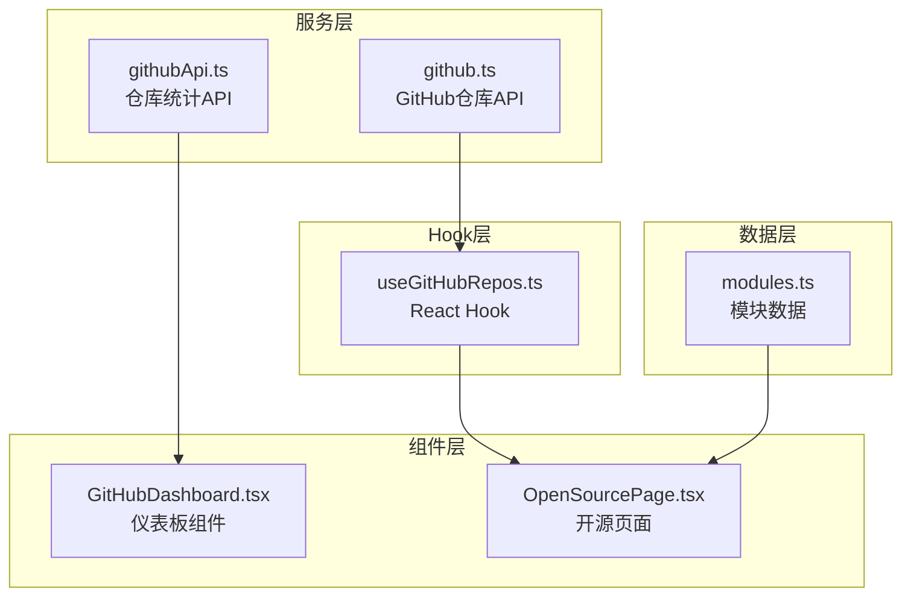

**图表来源**
- [githubApi.ts:1-150](file://src/services/githubApi.ts#L1-L150)
- [github.ts:1-97](file://src/services/github.ts#L1-L97)
- [useGitHubRepos.ts:1-45](file://src/hooks/useGitHubRepos.ts#L1-L45)
- [GitHubDashboard.tsx:1-281](file://src/components/GitHubDashboard.tsx#L1-L281)
- [OpenSourcePage.tsx:1-469](file://src/pages/OpenSourcePage.tsx#L1-L469)

**章节来源**
- [githubApi.ts:1-150](file://src/services/githubApi.ts#L1-L150)
- [github.ts:1-97](file://src/services/github.ts#L1-L97)
- [useGitHubRepos.ts:1-45](file://src/hooks/useGitHubRepos.ts#L1-L45)

## 核心组件

### 数据模型设计

系统采用清晰的数据模型设计，确保类型安全和数据完整性：

#### GitHubRepo数据模型
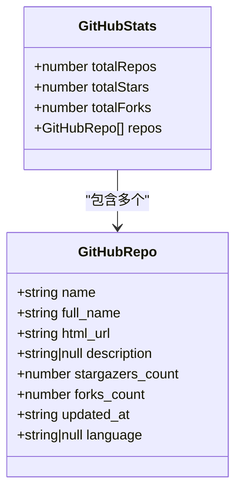

**图表来源**
- [github.ts:1-17](file://src/services/github.ts#L1-L17)

#### GitHubRepo数据模型（仓库统计）
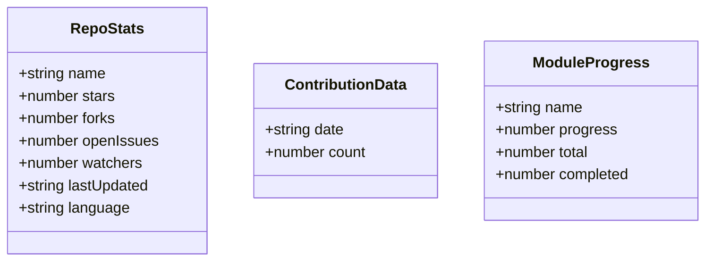

**图表来源**
- [githubApi.ts:6-19](file://src/services/githubApi.ts#L6-L19)
- [githubApi.ts:116-129](file://src/services/githubApi.ts#L116-L129)

**章节来源**
- [github.ts:1-17](file://src/services/github.ts#L1-L17)
- [githubApi.ts:6-19](file://src/services/githubApi.ts#L6-L19)

## 架构概览

系统采用分层架构设计，实现了清晰的关注点分离：

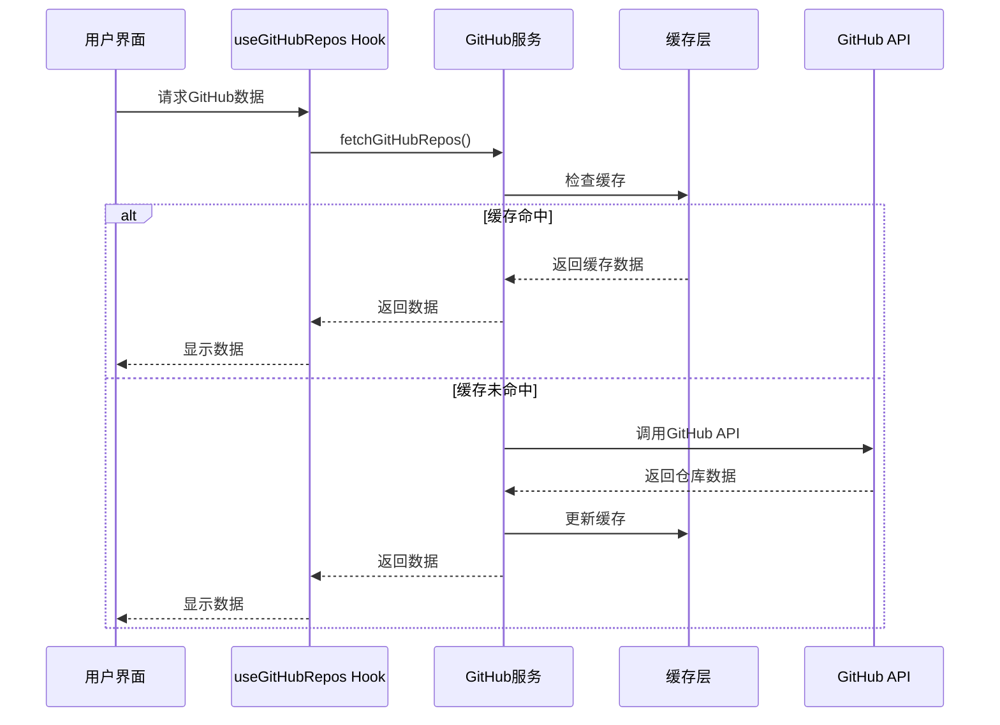

**图表来源**
- [useGitHubRepos.ts:18-29](file://src/hooks/useGitHubRepos.ts#L18-L29)
- [github.ts:52-80](file://src/services/github.ts#L52-L80)

## 详细组件分析

### GitHub API服务层

#### GitHubStats服务实现
GitHubStats服务负责从GitHub官方API获取用户的所有公共仓库信息：

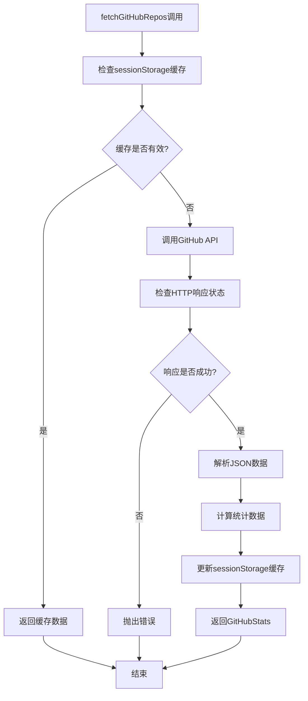

**图表来源**
- [github.ts:28-50](file://src/services/github.ts#L28-L50)
- [github.ts:52-80](file://src/services/github.ts#L52-L80)

#### RepoStats服务实现
RepoStats服务专注于特定仓库的详细统计信息获取：

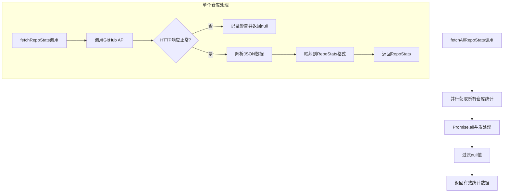

**图表来源**
- [githubApi.ts:65-70](file://src/services/githubApi.ts#L65-L70)
- [githubApi.ts:33-60](file://src/services/githubApi.ts#L33-L60)

**章节来源**
- [github.ts:52-80](file://src/services/github.ts#L52-L80)
- [githubApi.ts:65-85](file://src/services/githubApi.ts#L65-L85)

### 缓存策略实现

#### sessionStorage缓存机制
系统实现了两级缓存策略，确保最佳的用户体验和性能表现：

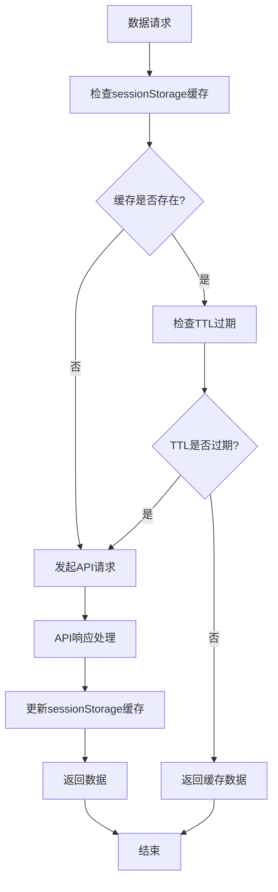

**图表来源**
- [github.ts:28-41](file://src/services/github.ts#L28-L41)
- [github.ts:43-50](file://src/services/github.ts#L43-L50)

#### TTL过期机制
缓存系统采用5分钟TTL（Time-To-Live）策略，平衡了数据新鲜度和性能需求：

- **缓存键**: `yuletech_github_cache`
- **TTL时长**: 5分钟（300,000毫秒）
- **缓存格式**: 包含数据和时间戳的对象结构
- **失效处理**: 自动删除过期缓存条目

**章节来源**
- [github.ts:19-26](file://src/services/github.ts#L19-L26)
- [github.ts:28-41](file://src/services/github.ts#L28-L41)

### findRepoByModuleName智能匹配算法

#### 命名规则匹配策略
findRepoByModuleName函数实现了智能的仓库名称匹配算法，支持多种命名约定：

```mermaid
flowchart TD
A[输入模块名称] --> B[生成候选名称列表]
B --> C[候选1: 模块名小写]
B --> D[候选2: yuletech-{模块名}]
B --> E[候选3: autosar-{模块名}]
B --> F[候选4: bsw-{模块名}]
C --> G[遍历仓库列表]
D --> G
E --> G
F --> G
G --> H{仓库名称匹配?}
H --> |是| I[返回匹配的仓库]
H --> |否| J[继续下一个候选]
J --> G
I --> K[结束]
G --> L[无匹配返回undefined]
L --> K
```

**图表来源**
- [github.ts:82-96](file://src/services/github.ts#L82-L96)

#### 匹配算法特点
- **大小写不敏感**: 所有比较均转换为小写进行
- **多格式支持**: 支持标准名称和带前缀的名称格式
- **优先级排序**: 按候选列表顺序进行匹配
- **性能优化**: 使用Array.find方法进行高效查找

**章节来源**
- [github.ts:82-96](file://src/services/github.ts#L82-L96)

### React Hook集成

#### useGitHubRepos Hook实现
useGitHubRepos Hook提供了完整的GitHub数据管理功能：

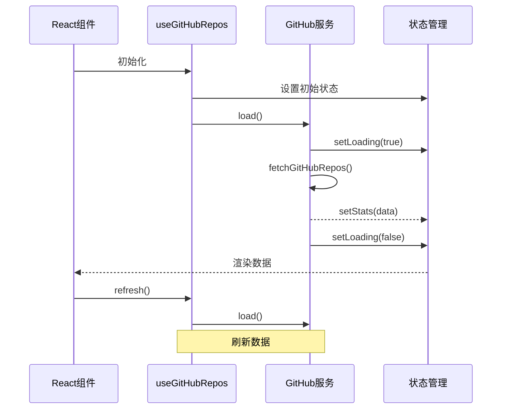

**图表来源**
- [useGitHubRepos.ts:13-44](file://src/hooks/useGitHubRepos.ts#L13-L44)

**章节来源**
- [useGitHubRepos.ts:13-44](file://src/hooks/useGitHubRepos.ts#L13-L44)

### UI组件集成

#### GitHubDashboard仪表板
GitHubDashboard组件展示了仓库统计信息的可视化界面：

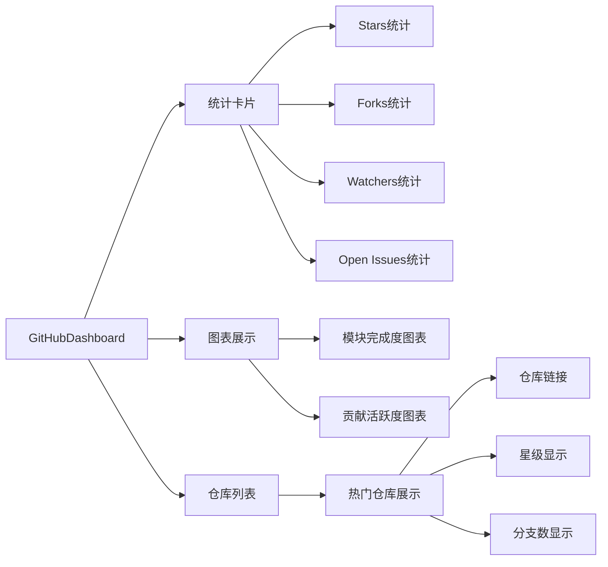

**图表来源**
- [GitHubDashboard.tsx:105-137](file://src/components/GitHubDashboard.tsx#L105-L137)
- [GitHubDashboard.tsx:140-218](file://src/components/GitHubDashboard.tsx#L140-L218)

**章节来源**
- [GitHubDashboard.tsx:32-281](file://src/components/GitHubDashboard.tsx#L32-L281)

## 依赖关系分析

### 组件依赖图

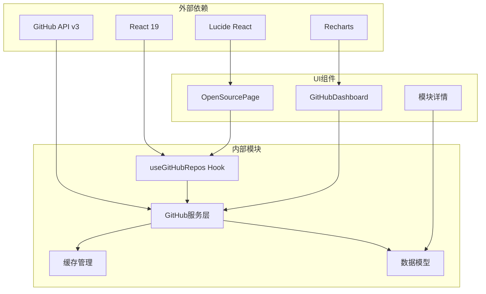

**图表来源**
- [OpenSourcePage.tsx:23](file://src/pages/OpenSourcePage.tsx#L23)
- [GitHubDashboard.tsx:25-30](file://src/components/GitHubDashboard.tsx#L25-L30)

### 数据流分析

系统实现了清晰的数据流向：

1. **数据获取**: GitHub API → 服务层 → Hook → 组件
2. **缓存流程**: Hook → 缓存层 → API → 缓存更新
3. **匹配流程**: 模块名称 → 候选列表 → 仓库匹配 → 数据合并

**章节来源**
- [useGitHubRepos.ts:1-45](file://src/hooks/useGitHubRepos.ts#L1-L45)
- [github.ts:1-97](file://src/services/github.ts#L1-L97)

## 性能考虑

### 缓存优化策略

#### 多级缓存架构
系统采用了多层次的缓存策略来优化性能：

- **内存缓存**: JavaScript对象缓存（用于仪表板统计）
- **持久缓存**: sessionStorage缓存（用于仓库列表数据）
- **TTL控制**: 5分钟缓存过期时间

#### 并发处理优化
- **Promise.all并发**: 同时获取多个仓库统计信息
- **防抖处理**: 避免频繁的API调用
- **状态管理**: 使用React状态避免不必要的重新渲染

### API限制遵守

#### GitHub API限制
- **速率限制**: 60次请求/小时（未认证）和5000次请求/小时（已认证）
- **请求头**: 设置Accept: application/vnd.github.v3+json
- **错误处理**: 实现适当的错误重试机制

#### 最佳实践
- **缓存优先**: 优先使用缓存数据减少API调用
- **批量请求**: 使用Promise.all进行并发请求
- **优雅降级**: API失败时显示缓存数据

## 故障排除指南

### 常见错误类型及解决方案

#### 网络异常处理
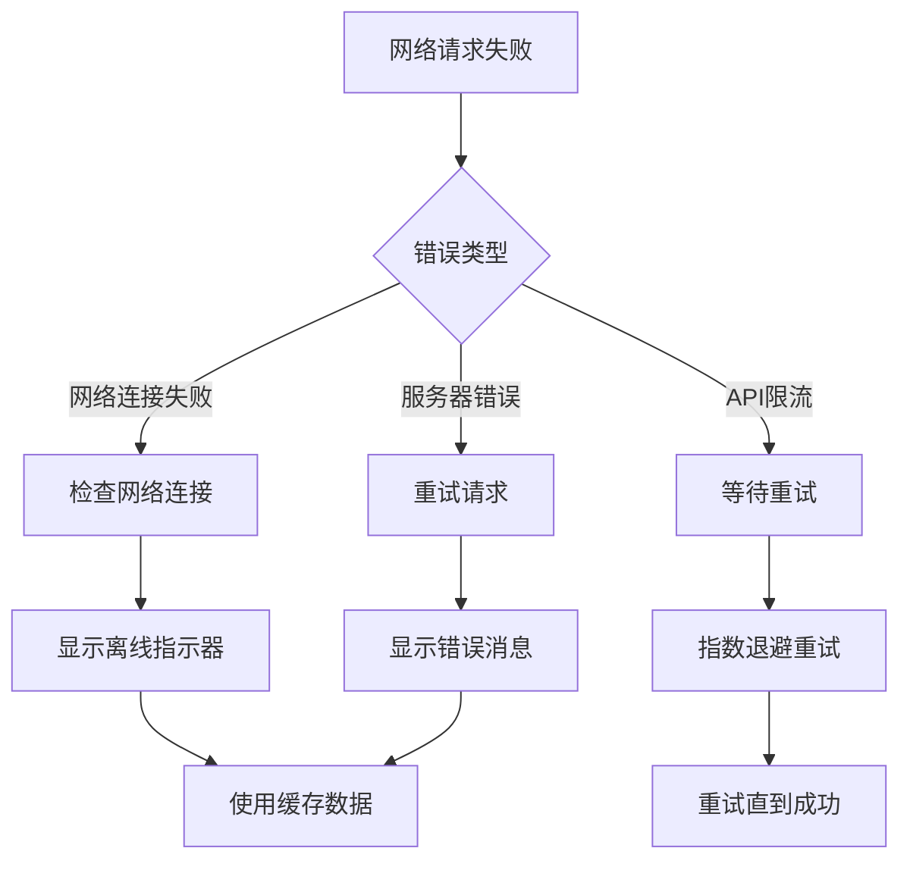

#### 认证失败处理
- **错误状态**: 401 Unauthorized
- **处理策略**: 清除缓存，提示用户重新登录
- **预防措施**: 实现OAuth认证流程

#### 数据解析错误
- **JSON解析失败**: 检查API响应格式
- **字段缺失**: 实现默认值处理
- **数据格式错误**: 添加数据验证和清理

**章节来源**
- [github.ts:65-67](file://src/services/github.ts#L65-L67)
- [useGitHubRepos.ts:24-26](file://src/hooks/useGitHubRepos.ts#L24-L26)

### 调试和监控

#### 开发者工具
- **浏览器开发者工具**: 监控网络请求和响应
- **React DevTools**: 检查组件状态和props
- **Console日志**: 记录API调用和错误信息

#### 性能监控
- **加载时间**: 监控API响应时间和渲染时间
- **缓存命中率**: 统计缓存使用效率
- **错误率**: 跟踪API调用成功率

## 结论

YuleTech社区的GitHub API集成功能展现了现代前端开发的最佳实践。通过精心设计的数据模型、高效的缓存策略和智能的匹配算法，系统为用户提供了流畅的开源项目浏览体验。

### 主要优势
- **高性能**: 多级缓存和并发处理确保快速响应
- **可靠性**: 完善的错误处理和降级机制
- **可扩展性**: 模块化的架构设计便于功能扩展
- **用户体验**: 直观的界面和实时数据展示

### 技术亮点
- **智能匹配算法**: 支持多种命名约定的仓库匹配
- **TTL缓存机制**: 平衡数据新鲜度和性能表现
- **React Hook集成**: 提供简洁的组件数据管理
- **类型安全**: TypeScript确保代码质量和开发体验

## 扩展指南

### 自定义GitHub集成

#### 添加新的数据源
要扩展系统以支持其他GitHub仓库或组织，可以：

1. **修改仓库列表**: 更新REPOS数组添加新仓库
2. **扩展数据模型**: 添加新的接口定义
3. **更新匹配逻辑**: 扩展findRepoByModuleName函数
4. **更新UI组件**: 添加新的数据展示组件

#### 高级缓存策略
```typescript
// 示例：实现更复杂的缓存策略
interface AdvancedCacheStrategy {
  get(key: string): Promise<any>;
  set(key: string, value: any, ttl?: number): Promise<void>;
  invalidate(key: string): Promise<void>;
  clearExpired(): Promise<void>;
}
```

#### 错误处理增强
```typescript
// 示例：实现重试机制
async function retryWithBackoff<T>(
  operation: () => Promise<T>,
  maxRetries: number = 3,
  baseDelay: number = 1000
): Promise<T> {
  let lastError: Error;
  
  for (let i = 0; i < maxRetries; i++) {
    try {
      return await operation();
    } catch (error) {
      lastError = error as Error;
      if (i < maxRetries - 1) {
        const delay = baseDelay * Math.pow(2, i);
        await new Promise(resolve => setTimeout(resolve, delay));
      }
    }
  }
  
  throw lastError!;
}
```

#### 性能优化建议
1. **懒加载**: 实现按需加载仓库数据
2. **虚拟滚动**: 对大量仓库列表使用虚拟滚动
3. **请求去重**: 避免重复的相同请求
4. **增量更新**: 实现部分数据更新而非全量刷新

通过这些扩展和优化，YuleTech社区的GitHub API集成功能可以更好地满足不断增长的用户需求和技术要求。