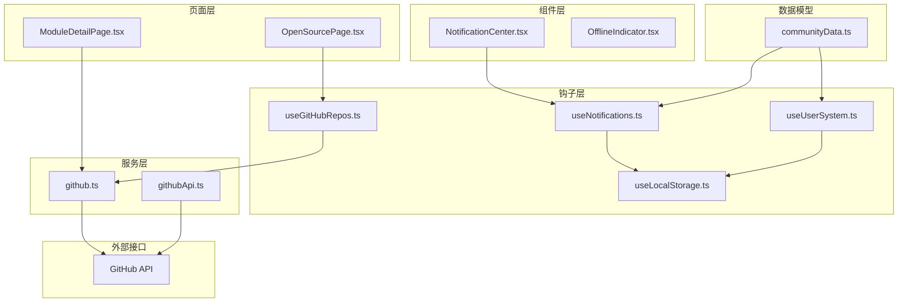
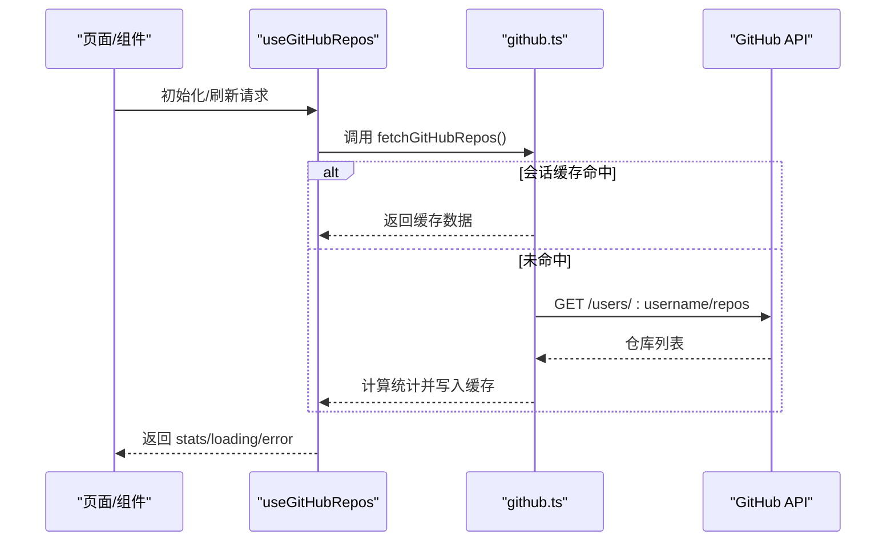
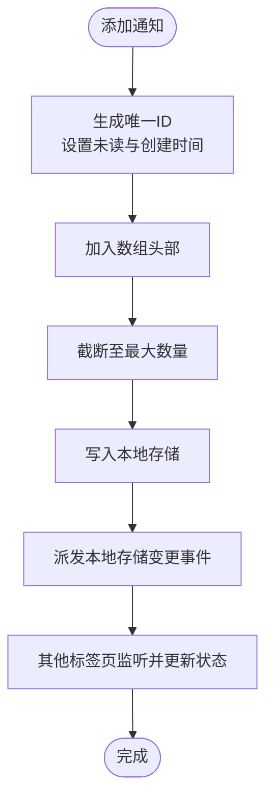
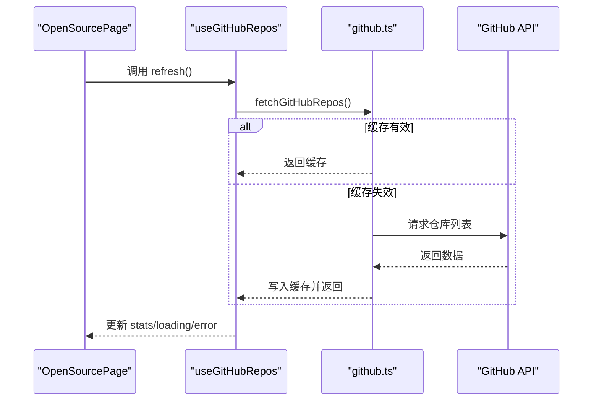
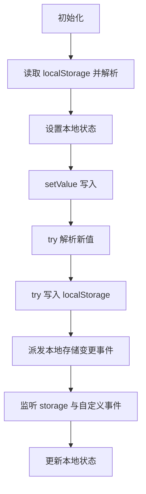
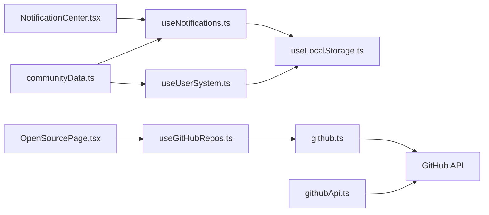

# 数据同步机制

<cite>
**本文引用的文件**
- [useNotifications.ts](file://src/hooks/useNotifications.ts)
- [useGitHubRepos.ts](file://src/hooks/useGitHubRepos.ts)
- [github.ts](file://src/services/github.ts)
- [githubApi.ts](file://src/services/githubApi.ts)
- [communityData.ts](file://src/data/communityData.ts)
- [useLocalStorage.ts](file://src/hooks/useLocalStorage.ts)
- [NotificationCenter.tsx](file://src/components/NotificationCenter.tsx)
- [OfflineIndicator.tsx](file://src/components/OfflineIndicator.tsx)
- [OpenSourcePage.tsx](file://src/pages/OpenSourcePage.tsx)
- [ModuleDetailPage.tsx](file://src/pages/ModuleDetailPage.tsx)
- [useUserSystem.ts](file://src/hooks/useUserSystem.ts)
- [package.json](file://package.json)
</cite>

## 目录
1. [引言](#引言)
2. [项目结构](#项目结构)
3. [核心组件](#核心组件)
4. [架构总览](#架构总览)
5. [详细组件分析](#详细组件分析)
6. [依赖分析](#依赖分析)
7. [性能考虑](#性能考虑)
8. [故障排查指南](#故障排查指南)
9. [结论](#结论)
10. [附录](#附录)

## 引言
本文件系统性梳理 YuleTech 社区的数据同步机制，覆盖客户端与服务器之间的数据同步策略、实时更新机制、通知系统、GitHub 数据自动刷新与增量更新、离线数据与冲突处理、一致性与事务、网络状态监控与断线重连、版本控制与变更追踪，以及面向开发者的可扩展实践与性能优化建议。目标是帮助开发者快速理解并高效扩展数据同步能力。

## 项目结构
围绕数据同步的关键目录与文件组织如下：
- 钩子层：useNotifications、useGitHubRepos、useLocalStorage、useUserSystem
- 服务层：github（会话存储缓存）、githubApi（全局仓库统计缓存）
- 页面层：OpenSourcePage、ModuleDetailPage（展示与触发刷新）
- 组件层：NotificationCenter（通知展示与交互）、OfflineIndicator（离线提示）
- 数据模型：communityData（生成 ID、迁移等）

图表来源
- [OpenSourcePage.tsx:248-278](file://src/pages/OpenSourcePage.tsx#L248-L278)
- [useGitHubRepos.ts:13-44](file://src/hooks/useGitHubRepos.ts#L13-L44)
- [github.ts:52-80](file://src/services/github.ts#L52-L80)
- [useNotifications.ts:17-49](file://src/hooks/useNotifications.ts#L17-L49)
- [useLocalStorage.ts:3-59](file://src/hooks/useLocalStorage.ts#L3-L59)
- [useUserSystem.ts:91-132](file://src/hooks/useUserSystem.ts#L91-L132)
- [communityData.ts:361-363](file://src/data/communityData.ts#L361-L363)

章节来源
- [package.json:12-26](file://package.json#L12-L26)

## 核心组件
- 通知系统 useNotifications：基于本地存储的通知队列，支持新增、标记已读、批量已读与未读计数；通过本地事件广播实现跨标签页同步。
- GitHub 数据钩子 useGitHubRepos：封装 GitHub 仓库统计拉取、错误处理、加载状态与手动刷新；内部使用会话存储缓存。
- 通用本地存储 useLocalStorage：封装 localStorage 读写与跨标签页事件监听，提供一致的本地状态同步。
- 用户体系 useUserSystem：基于本地存储的积分与等级系统，支持规则与阈值的本地持久化与动态计算。
- 通知中心 NotificationCenter：UI 展示通知、点击跳转、标记已读与一键已读。
- 离线指示 OfflineIndicator：检测 navigator.onLine 并在离线时全局提示。

章节来源
- [useNotifications.ts:17-49](file://src/hooks/useNotifications.ts#L17-L49)
- [useGitHubRepos.ts:13-44](file://src/hooks/useGitHubRepos.ts#L13-L44)
- [useLocalStorage.ts:3-59](file://src/hooks/useLocalStorage.ts#L3-L59)
- [useUserSystem.ts:91-132](file://src/hooks/useUserSystem.ts#L91-L132)
- [NotificationCenter.tsx:14-102](file://src/components/NotificationCenter.tsx#L14-L102)
- [OfflineIndicator.tsx:4-28](file://src/components/OfflineIndicator.tsx#L4-L28)

## 架构总览
整体采用“页面/组件 -> 钩子 -> 服务 -> 外部 API”的分层架构，结合本地存储与会话存储实现离线可用与跨标签页同步。

图表来源
- [useGitHubRepos.ts:18-33](file://src/hooks/useGitHubRepos.ts#L18-L33)
- [github.ts:52-80](file://src/services/github.ts#L52-L80)

## 详细组件分析

### 通知系统 useNotifications
- 数据结构：通知类型枚举、通知对象包含唯一 id、类型、标题、消息、是否已读、创建时间与可选链接。
- 存储策略：使用本地存储键管理通知数组，限制长度以避免无限增长。
- 实时同步：通过本地事件广播与 storage 事件监听，实现跨标签页通知状态同步。
- 交互行为：新增通知自动置于顶部、支持单条与全部标记已读、未读计数用于徽标显示。

图表来源
- [useNotifications.ts:20-28](file://src/hooks/useNotifications.ts#L20-L28)
- [useLocalStorage.ts:14-25](file://src/hooks/useLocalStorage.ts#L14-L25)

章节来源
- [useNotifications.ts:17-49](file://src/hooks/useNotifications.ts#L17-L49)
- [useLocalStorage.ts:3-59](file://src/hooks/useLocalStorage.ts#L3-L59)
- [communityData.ts:361-363](file://src/data/communityData.ts#L361-L363)
- [NotificationCenter.tsx:14-102](file://src/components/NotificationCenter.tsx#L14-L102)

### GitHub 数据自动刷新与增量更新 useGitHubRepos
- 自动加载：组件挂载时自动拉取一次数据。
- 手动刷新：提供 refresh 方法，用于用户主动触发。
- 错误处理：捕获异常并设置错误状态，便于 UI 提示。
- 增量更新：通过 findRepoByModuleName 与模块名进行匹配，实现局部更新与展示。
- 缓存策略：使用会话存储缓存，TTL 5 分钟，避免频繁请求 API。

图表来源
- [useGitHubRepos.ts:18-33](file://src/hooks/useGitHubRepos.ts#L18-L33)
- [github.ts:52-80](file://src/services/github.ts#L52-L80)
- [OpenSourcePage.tsx:268-275](file://src/pages/OpenSourcePage.tsx#L268-L275)

章节来源
- [useGitHubRepos.ts:13-44](file://src/hooks/useGitHubRepos.ts#L13-L44)
- [github.ts:19-80](file://src/services/github.ts#L19-L80)
- [OpenSourcePage.tsx:248-278](file://src/pages/OpenSourcePage.tsx#L248-L278)

### 通用本地存储 useLocalStorage
- 读取：初始化时从 localStorage 解析初始值，异常时回退到默认值。
- 写入：统一通过 setValue 写入，并派发自定义事件；同时监听 storage 与自定义事件，实现跨标签页同步。
- 安全性：对解析与写入过程进行 try/catch，避免异常影响应用。

图表来源
- [useLocalStorage.ts:3-59](file://src/hooks/useLocalStorage.ts#L3-L59)

章节来源
- [useLocalStorage.ts:3-59](file://src/hooks/useLocalStorage.ts#L3-L59)

### 用户体系与积分历史 useUserSystem
- 积分规则与等级阈值：支持从本地存储读取自定义规则，否则使用默认规则。
- 历史记录：每次动作产生一条历史记录，包含动作类型、描述、积分与时间戳。
- 等级计算：根据当前积分在阈值区间内确定等级信息。

章节来源
- [useUserSystem.ts:91-132](file://src/hooks/useUserSystem.ts#L91-L132)
- [communityData.ts:361-363](file://src/data/communityData.ts#L361-L363)

### 通知中心 NotificationCenter
- 展示：按类型分类图标与颜色，支持未读徽章与一键已读。
- 行为：点击通知标记已读并跳转到指定链接（如存在）。

章节来源
- [NotificationCenter.tsx:14-102](file://src/components/NotificationCenter.tsx#L14-L102)
- [useNotifications.ts:17-49](file://src/hooks/useNotifications.ts#L17-L49)

### 离线指示 OfflineIndicator
- 监听：注册 online/offline 事件，切换全局离线提示。
- 体验：仅在离线时显示提示，避免干扰在线体验。

章节来源
- [OfflineIndicator.tsx:4-28](file://src/components/OfflineIndicator.tsx#L4-L28)

## 依赖分析
- 组件耦合：NotificationCenter 依赖 useNotifications；OpenSourcePage 依赖 useGitHubRepos；useNotifications 与 useUserSystem 依赖 useLocalStorage。
- 外部依赖：github.ts 依赖浏览器 fetch 与 GitHub API；githubApi.ts 依赖浏览器 fetch 与 GitHub API。
- 缓存策略：github.ts 使用 sessionStorage；githubApi.ts 使用内存缓存与时间戳。

图表来源
- [useNotifications.ts:17-49](file://src/hooks/useNotifications.ts#L17-L49)
- [useGitHubRepos.ts:13-44](file://src/hooks/useGitHubRepos.ts#L13-L44)
- [github.ts:52-80](file://src/services/github.ts#L52-L80)
- [useLocalStorage.ts:3-59](file://src/hooks/useLocalStorage.ts#L3-L59)
- [useUserSystem.ts:91-132](file://src/hooks/useUserSystem.ts#L91-L132)
- [communityData.ts:361-363](file://src/data/communityData.ts#L361-L363)
- [OpenSourcePage.tsx:248-278](file://src/pages/OpenSourcePage.tsx#L248-L278)

## 性能考虑
- 缓存策略
  - 会话存储缓存：github.ts 对 GitHub 数据做 5 分钟 TTL 的会话缓存，降低 API 调用频率。
  - 内存缓存：githubApi.ts 对仓库统计做内存缓存与时间戳校验，同样 5 分钟有效期。
- 并发与批处理
  - githubApi.ts 使用 Promise.all 并行拉取固定仓库列表，缩短等待时间。
- UI 渲染优化
  - 通知列表限制长度，避免长列表带来的渲染压力。
- 网络与离线
  - 使用 navigator.onLine 快速判断离线状态，减少无效请求。
- 建议
  - 对高频读取的本地数据（如通知、用户系统）可引入轻量内存缓存，减少重复解析。
  - 对第三方 API 增加指数退避与去抖策略，避免抖动导致的频繁请求。
  - 对大列表（如模块列表）启用虚拟滚动或分页加载。

## 故障排查指南
- 通知不同步
  - 检查本地事件广播与监听是否正常，确认自定义事件与 storage 事件均注册。
  - 确认本地存储写入成功且未抛出异常。
- GitHub 数据不刷新
  - 确认 refresh 是否被调用；检查错误状态与加载状态；确认会话缓存是否过期。
  - 若 API 返回非 2xx，需在 UI 层提示并引导用户重试。
- 离线状态下功能受限
  - 离线提示组件仅在离线时显示，属于预期行为；建议在离线时禁用写操作或延迟提交。
- 积分/等级异常
  - 检查本地存储中的自定义规则与阈值是否合法；确认阈值边界与默认值合并逻辑。

章节来源
- [useLocalStorage.ts:27-56](file://src/hooks/useLocalStorage.ts#L27-L56)
- [useGitHubRepos.ts:18-33](file://src/hooks/useGitHubRepos.ts#L18-L33)
- [github.ts:65-67](file://src/services/github.ts#L65-L67)
- [OfflineIndicator.tsx:4-28](file://src/components/OfflineIndicator.tsx#L4-L28)
- [useUserSystem.ts:36-79](file://src/hooks/useUserSystem.ts#L36-L79)

## 结论
YuleTech 社区的数据同步机制以本地存储为核心，结合会话存储与内存缓存实现高效、可靠的前端数据管理。通知系统与用户体系通过统一的本地存储钩子实现跨标签页同步与一致性；GitHub 数据通过钩子与服务层实现自动刷新与增量匹配；离线指示与网络状态监控提升用户体验。开发者可在现有基础上扩展自定义同步策略、增强缓存与错误处理，并遵循性能优化建议持续改进。

## 附录
- 关键实现路径
  - 通知系统：[useNotifications.ts:17-49](file://src/hooks/useNotifications.ts#L17-L49)
  - 本地存储：[useLocalStorage.ts:3-59](file://src/hooks/useLocalStorage.ts#L3-L59)
  - GitHub 钩子：[useGitHubRepos.ts:13-44](file://src/hooks/useGitHubRepos.ts#L13-L44)
  - GitHub 服务：[github.ts:52-80](file://src/services/github.ts#L52-L80)
  - GitHub API 服务：[githubApi.ts:65-149](file://src/services/githubApi.ts#L65-L149)
  - 通知中心：[NotificationCenter.tsx:14-102](file://src/components/NotificationCenter.tsx#L14-L102)
  - 离线指示：[OfflineIndicator.tsx:4-28](file://src/components/OfflineIndicator.tsx#L4-L28)
  - 页面集成：[OpenSourcePage.tsx:248-278](file://src/pages/OpenSourcePage.tsx#L248-L278)
  - 数据模型：[communityData.ts:361-363](file://src/data/communityData.ts#L361-L363)
  - 用户体系：[useUserSystem.ts:91-132](file://src/hooks/useUserSystem.ts#L91-L132)