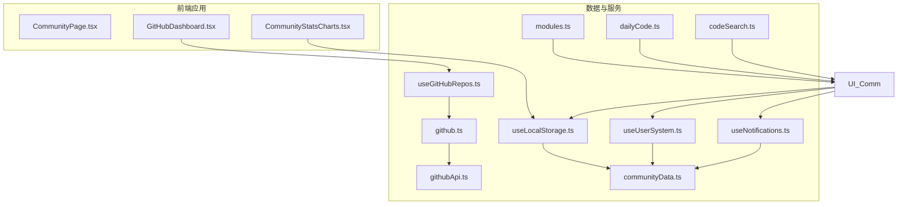
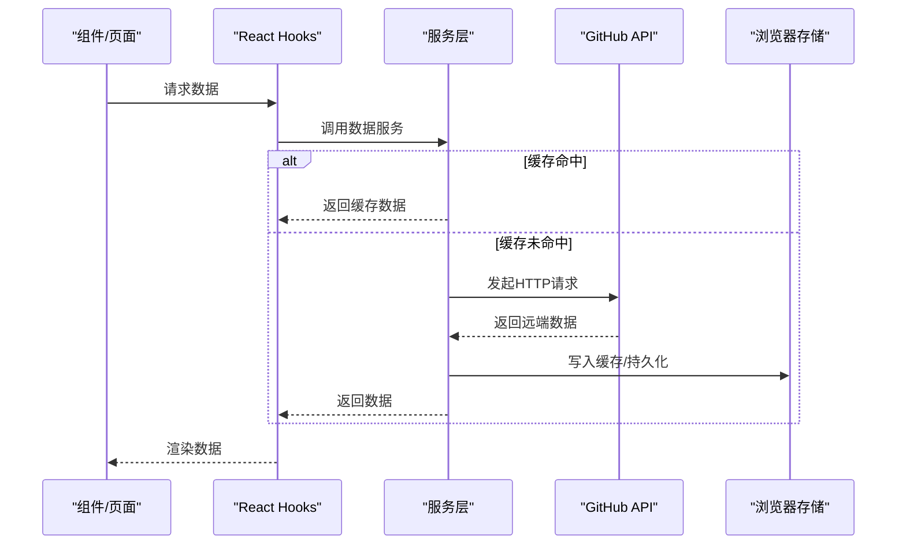
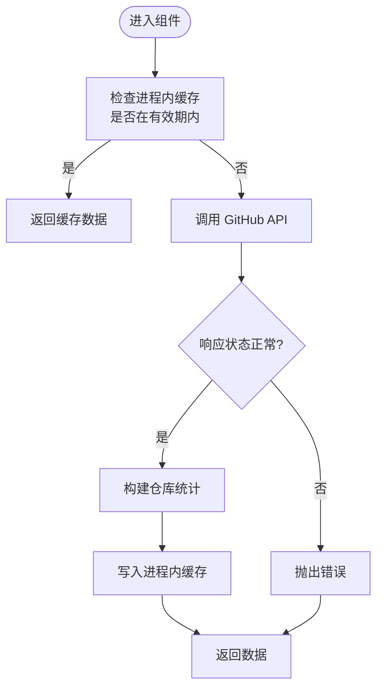
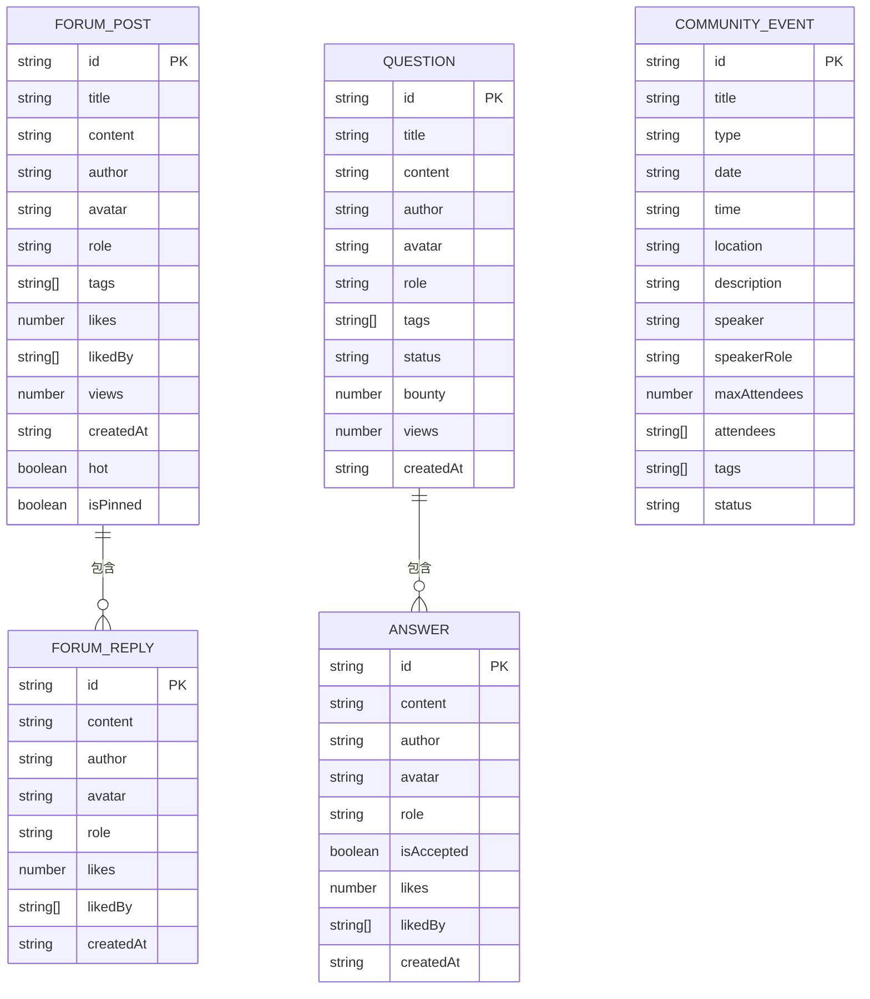
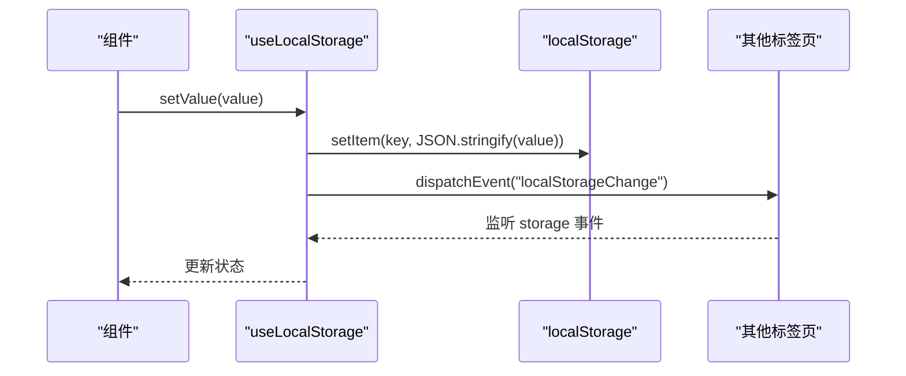
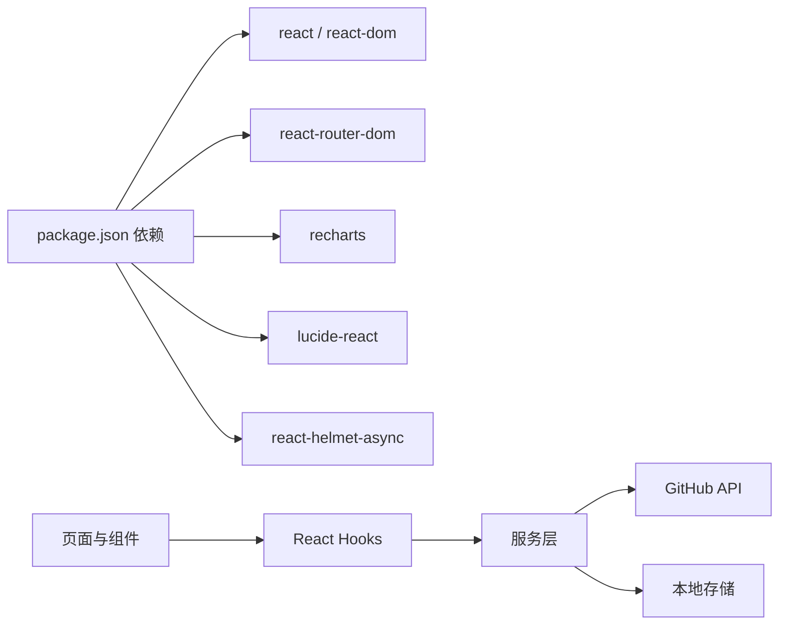

# 数据管理

<cite>
**本文引用的文件**
- [README.md](file://README.md)
- [package.json](file://package.json)
- [src/data/communityData.ts](file://src/data/communityData.ts)
- [src/data/modules.ts](file://src/data/modules.ts)
- [src/data/dailyCode.ts](file://src/data/dailyCode.ts)
- [src/data/codeSearch.ts](file://src/data/codeSearch.ts)
- [src/services/github.ts](file://src/services/github.ts)
- [src/services/githubApi.ts](file://src/services/githubApi.ts)
- [src/hooks/useGitHubRepos.ts](file://src/hooks/useGitHubRepos.ts)
- [src/hooks/useLocalStorage.ts](file://src/hooks/useLocalStorage.ts)
- [src/hooks/useUserSystem.ts](file://src/hooks/useUserSystem.ts)
- [src/hooks/useNotifications.ts](file://src/hooks/useNotifications.ts)
- [src/components/GitHubDashboard.tsx](file://src/components/GitHubDashboard.tsx)
- [src/components/admin/CommunityStatsCharts.tsx](file://src/components/admin/CommunityStatsCharts.tsx)
- [src/pages/CommunityPage.tsx](file://src/pages/CommunityPage.tsx)
</cite>

## 目录
1. [简介](#简介)
2. [项目结构](#项目结构)
3. [核心组件](#核心组件)
4. [架构总览](#架构总览)
5. [详细组件分析](#详细组件分析)
6. [依赖关系分析](#依赖关系分析)
7. [性能考量](#性能考量)
8. [故障排查指南](#故障排查指南)
9. [结论](#结论)
10. [附录](#附录)

## 简介
本文件为 YuleTech 社区技术平台的数据管理系统提供全面文档，覆盖数据获取策略、API 集成方式、数据缓存机制、社区数据模型与验证规则、本地存储与同步、离线处理、安全与隐私、迁移与版本管理、扩展与定制指导，以及性能优化与最佳实践。

## 项目结构
- 采用多应用架构（apps/admin、apps/community、apps/learning、apps/opensource、apps/shell），共享核心数据与服务（src/data、src/services、src/hooks）。
- 数据管理主要集中在：
  - 社区数据模型与初始数据：src/data/communityData.ts
  - 模块化数据与 AutoSAR BSW 模块详情：src/data/modules.ts
  - 日常代码片段与代码搜索：src/data/dailyCode.ts、src/data/codeSearch.ts
  - GitHub API 集成与缓存：src/services/github.ts、src/services/githubApi.ts
  - React Hooks：本地存储、用户系统、通知、GitHub 仓库钩子
  - 可视化组件：GitHub 仪表盘、社区统计图表

**图示来源**
- [src/pages/CommunityPage.tsx:1-667](file://src/pages/CommunityPage.tsx#L1-L667)
- [src/components/GitHubDashboard.tsx:1-281](file://src/components/GitHubDashboard.tsx#L1-L281)
- [src/components/admin/CommunityStatsCharts.tsx:1-172](file://src/components/admin/CommunityStatsCharts.tsx#L1-L172)
- [src/hooks/useLocalStorage.ts:1-60](file://src/hooks/useLocalStorage.ts#L1-L60)
- [src/hooks/useUserSystem.ts:1-135](file://src/hooks/useUserSystem.ts#L1-L135)
- [src/hooks/useNotifications.ts:1-50](file://src/hooks/useNotifications.ts#L1-L50)
- [src/hooks/useGitHubRepos.ts:1-45](file://src/hooks/useGitHubRepos.ts#L1-L45)
- [src/services/github.ts:1-97](file://src/services/github.ts#L1-L97)
- [src/services/githubApi.ts:1-150](file://src/services/githubApi.ts#L1-L150)
- [src/data/communityData.ts:1-371](file://src/data/communityData.ts#L1-L371)
- [src/data/modules.ts:1-800](file://src/data/modules.ts#L1-L800)
- [src/data/dailyCode.ts:1-239](file://src/data/dailyCode.ts#L1-L239)
- [src/data/codeSearch.ts:1-540](file://src/data/codeSearch.ts#L1-L540)

**章节来源**
- [README.md:1-95](file://README.md#L1-L95)
- [package.json:1-46](file://package.json#L1-L46)

## 核心组件
- 社区数据模型与初始数据：定义论坛、问答、活动等实体及迁移与辅助函数，支撑前端展示与本地持久化。
- GitHub API 服务：封装仓库统计、贡献活跃度、模块进度等数据获取与缓存。
- 本地存储与用户系统：提供跨标签页同步、用户积分与等级、通知管理。
- 代码与模块数据：模块详情、每日代码片段、代码搜索索引，支持社区学习与检索。
- 可视化组件：GitHub 仪表盘、社区内容分布与活动趋势图，直观呈现数据。

**章节来源**
- [src/data/communityData.ts:1-371](file://src/data/communityData.ts#L1-L371)
- [src/services/github.ts:1-97](file://src/services/github.ts#L1-L97)
- [src/services/githubApi.ts:1-150](file://src/services/githubApi.ts#L1-L150)
- [src/hooks/useLocalStorage.ts:1-60](file://src/hooks/useLocalStorage.ts#L1-L60)
- [src/hooks/useUserSystem.ts:1-135](file://src/hooks/useUserSystem.ts#L1-L135)
- [src/hooks/useNotifications.ts:1-50](file://src/hooks/useNotifications.ts#L1-L50)
- [src/data/modules.ts:1-800](file://src/data/modules.ts#L1-L800)
- [src/data/dailyCode.ts:1-239](file://src/data/dailyCode.ts#L1-L239)
- [src/data/codeSearch.ts:1-540](file://src/data/codeSearch.ts#L1-L540)

## 架构总览
数据流从 GitHub API 获取实时开源项目数据，结合本地存储与缓存策略，渲染社区页面与统计图表；社区内容（论坛、问答、活动）与用户行为（积分、通知）同样持久化至本地存储，形成“远端数据 + 本地缓存 + 本地持久化”的混合架构。

**图示来源**
- [src/hooks/useGitHubRepos.ts:1-45](file://src/hooks/useGitHubRepos.ts#L1-L45)
- [src/services/github.ts:52-80](file://src/services/github.ts#L52-L80)
- [src/services/githubApi.ts:139-149](file://src/services/githubApi.ts#L139-L149)
- [src/hooks/useLocalStorage.ts:1-60](file://src/hooks/useLocalStorage.ts#L1-L60)

## 详细组件分析

### GitHub API 集成与缓存
- 数据模型：GitHubRepo、GitHubStats；仓库统计 RepoStats、贡献数据 ContributionData。
- 缓存策略：
  - 会话缓存：sessionStorage + TTL（5 分钟），避免频繁请求。
  - 进程内缓存：内存缓存 + 时间戳（5 分钟），提升组件内二次渲染性能。
- 关键函数：
  - fetchGitHubRepos：获取仓库列表并计算 Stars/Forks 总量。
  - getCachedRepoStats：Promise 并行获取多仓库统计并缓存。
  - calculateTotals：聚合统计指标。
  - generateMockContributions：模拟近 14 天贡献活跃度。
  - findRepoByModuleName：按模块名匹配仓库名候选集合。
- 错误处理：响应非 OK 抛出错误；组件层捕获并降级显示。

**图示来源**
- [src/services/githubApi.ts:139-149](file://src/services/githubApi.ts#L139-L149)
- [src/services/github.ts:52-80](file://src/services/github.ts#L52-L80)

**章节来源**
- [src/services/github.ts:1-97](file://src/services/github.ts#L1-L97)
- [src/services/githubApi.ts:1-150](file://src/services/githubApi.ts#L1-L150)
- [src/hooks/useGitHubRepos.ts:1-45](file://src/hooks/useGitHubRepos.ts#L1-L45)

### 社区数据模型与验证规则
- 数据模型：
  - 论坛帖子/回复：包含作者、角色、标签、点赞、浏览、时间等字段。
  - 问答/答案：包含状态、赏金、浏览、采纳标记等。
  - 社区活动：包含类型、时间、地点、最大人数、报名人员、标签、状态等。
- 初始数据：提供初始数组，便于首次渲染与演示。
- 迁移与兼容：提供迁移函数，确保旧数据结构向新结构演进（如默认字段）。
- 验证规则（示例）：
  - 字段存在性：必填字段（如 id、title、content、author、createdAt）。
  - 类型约束：时间字符串遵循 ISO 格式；数值字段非负。
  - 枚举约束：status（open/resolved）、活动状态（upcoming/ongoing/ended）。
  - 业务约束：赏金与点赞数应为非负整数；活动报名人数不超过上限。

**图示来源**
- [src/data/communityData.ts:1-371](file://src/data/communityData.ts#L1-L371)

**章节来源**
- [src/data/communityData.ts:1-371](file://src/data/communityData.ts#L1-L371)

### 本地数据存储策略与同步
- 本地存储钩子：封装 localStorage 读写、跨标签页同步事件、异常处理。
- 用户系统：积分与等级持久化，支持规则与阈值的本地可配置。
- 通知系统：消息持久化，支持未读计数与批量标记。
- 社区内容：论坛、问答、活动等数据通过本地存储进行持久化与增量更新。
- 同步机制：监听 storage 事件与自定义事件，保证多标签页一致。

**图示来源**
- [src/hooks/useLocalStorage.ts:1-60](file://src/hooks/useLocalStorage.ts#L1-L60)
- [src/hooks/useUserSystem.ts:91-132](file://src/hooks/useUserSystem.ts#L91-L132)
- [src/hooks/useNotifications.ts:17-49](file://src/hooks/useNotifications.ts#L17-L49)

**章节来源**
- [src/hooks/useLocalStorage.ts:1-60](file://src/hooks/useLocalStorage.ts#L1-L60)
- [src/hooks/useUserSystem.ts:1-135](file://src/hooks/useUserSystem.ts#L1-L135)
- [src/hooks/useNotifications.ts:1-50](file://src/hooks/useNotifications.ts#L1-L50)

### 数据转换与错误处理
- GitHub 数据转换：将 API 响应映射为 RepoStats，计算总量与平均值。
- 社区数据转换：将时间戳转换为日粒度统计，生成 14 天活跃趋势。
- 错误处理：
  - API 非 OK 状态抛错，组件层捕获并提示。
  - 本地存储异常记录日志，回退到初始值。
  - 搜索与过滤：模糊匹配与评分排序，限制返回条数。

**章节来源**
- [src/services/githubApi.ts:33-70](file://src/services/githubApi.ts#L33-L70)
- [src/components/admin/CommunityStatsCharts.tsx:83-171](file://src/components/admin/CommunityStatsCharts.tsx#L83-L171)
- [src/data/codeSearch.ts:447-484](file://src/data/codeSearch.ts#L447-L484)

### 离线数据处理
- 会话缓存：sessionStorage + TTL，保证刷新或短暂网络异常下的可用性。
- 进程内缓存：5 分钟有效期，减少重复请求。
- 本地持久化：论坛、问答、活动、通知、用户系统均持久化，支持离线浏览与基本交互。

**章节来源**
- [src/services/github.ts:28-50](file://src/services/github.ts#L28-L50)
- [src/services/githubApi.ts:131-149](file://src/services/githubApi.ts#L131-L149)
- [src/hooks/useLocalStorage.ts:1-60](file://src/hooks/useLocalStorage.ts#L1-L60)

### 数据安全、访问控制与隐私
- 安全措施：
  - GitHub API 使用标准 Accept 头，避免不必要的信息泄露。
  - 本地存储仅保存公开数据与用户偏好，不存储敏感凭证。
- 访问控制：社区页面无强制登录，但用户系统与通知支持匿名与登录态切换。
- 隐私保护：不收集用户 IP 或设备指纹；统计图表使用模拟数据，避免暴露真实贡献者信息。

**章节来源**
- [src/services/github.ts:56-63](file://src/services/github.ts#L56-L63)
- [src/services/githubApi.ts:89-111](file://src/services/githubApi.ts#L89-L111)

### 数据迁移、版本管理与向后兼容
- 迁移函数：提供 migrateForumPosts 等，确保旧数据结构兼容新字段。
- 版本管理：模块详情包含版本号与变更日志，便于追踪演进。
- 向后兼容：本地存储键名前缀统一，避免命名冲突；默认值与类型断言保证读取安全。

**章节来源**
- [src/data/communityData.ts:365-371](file://src/data/communityData.ts#L365-L371)
- [src/data/modules.ts:34-522](file://src/data/modules.ts#L34-L522)

### 开发者扩展与定制指导
- 扩展数据源：新增服务层接口，遵循现有缓存与错误处理模式。
- 自定义本地规则：通过 localStorage 键（如积分规则、等级阈值）进行配置化扩展。
- 组件化复用：将数据获取与渲染分离，便于替换数据源或图表库。

**章节来源**
- [src/hooks/useUserSystem.ts:36-79](file://src/hooks/useUserSystem.ts#L36-L79)
- [src/services/githubApi.ts:1-150](file://src/services/githubApi.ts#L1-L150)

## 依赖关系分析

**图示来源**
- [package.json:12-26](file://package.json#L12-L26)
- [src/pages/CommunityPage.tsx:1-667](file://src/pages/CommunityPage.tsx#L1-L667)
- [src/components/GitHubDashboard.tsx:1-281](file://src/components/GitHubDashboard.tsx#L1-L281)
- [src/hooks/useGitHubRepos.ts:1-45](file://src/hooks/useGitHubRepos.ts#L1-L45)
- [src/services/github.ts:1-97](file://src/services/github.ts#L1-L97)

**章节来源**
- [package.json:1-46](file://package.json#L1-L46)

## 性能考量
- 缓存策略：会话缓存与进程内缓存双重保障，减少重复请求与渲染成本。
- 并行请求：Promise.all 并行获取多仓库统计，缩短等待时间。
- 懒加载与虚拟化：社区内容较多时，建议对长列表进行懒加载或分页。
- 图表优化：使用 ResponsiveContainer 与轻量级数据集，避免高频重绘。
- 本地存储：批量写入与去抖，减少主线程阻塞。

## 故障排查指南
- GitHub API 错误：检查响应状态与网络连通性；组件层已捕获并降级显示。
- 本地存储异常：查看控制台错误日志；确认浏览器未禁用 localStorage。
- 缓存失效：清理 sessionStorage/LocalStorage 或等待 TTL 过期。
- 数据不一致：确认多标签页事件监听是否生效；必要时手动刷新。

**章节来源**
- [src/services/github.ts:65-67](file://src/services/github.ts#L65-L67)
- [src/hooks/useLocalStorage.ts:8-11](file://src/hooks/useLocalStorage.ts#L8-L11)

## 结论
本数据管理系统通过“远端 API + 会话缓存 + 进程内缓存 + 本地持久化”的多层策略，实现了高性能、可扩展且具备良好用户体验的数据管理方案。社区数据模型清晰、缓存与错误处理完善、本地存储与同步机制健全，并提供可配置的用户系统与通知体系，满足社区平台的多样化需求。

## 附录
- 术语
  - TTL：Time-To-Live，缓存存活时间
  - DTO：数据传输对象，用于前后端数据结构映射
- 最佳实践清单
  - 为每次 API 请求设置合理的 TTL
  - 对长列表进行分页或虚拟化
  - 使用 useMemo/useCallback 优化渲染
  - 本地存储键名统一前缀，避免冲突
  - 对用户输入与外部数据进行类型校验与边界检查