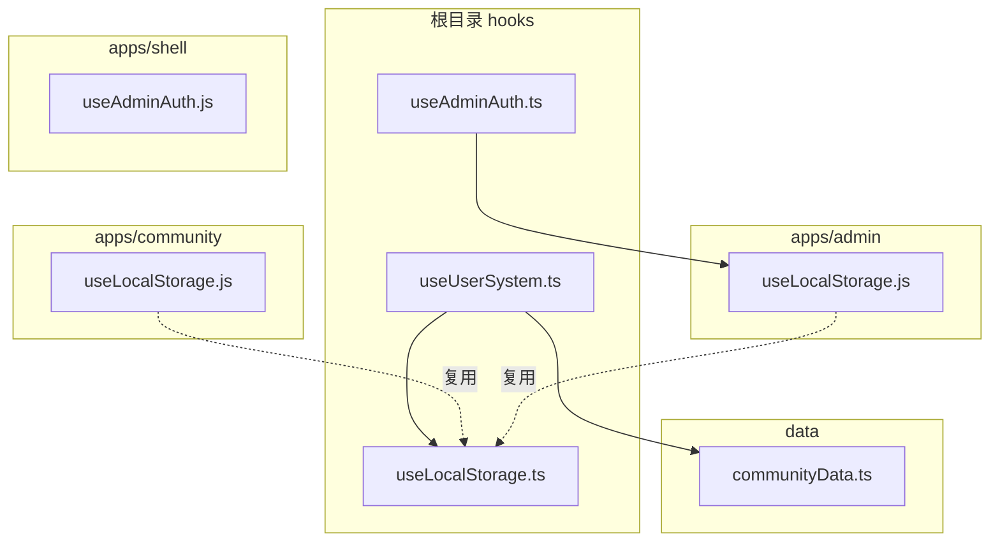
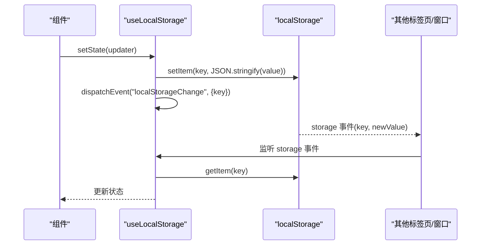
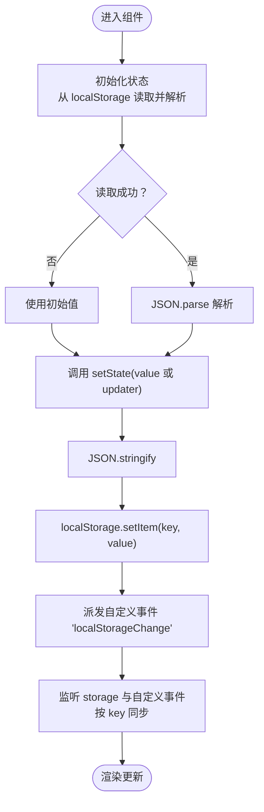
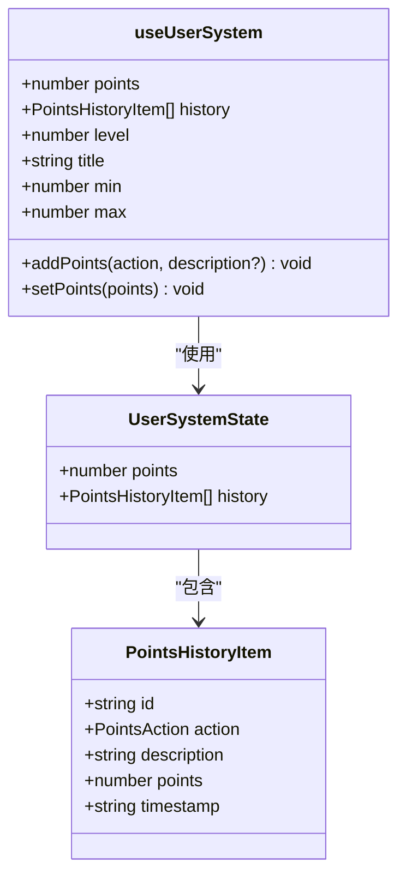
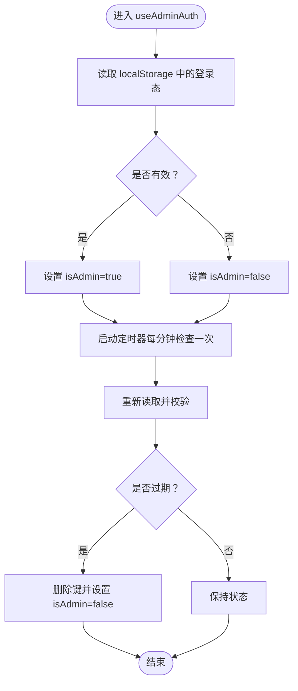
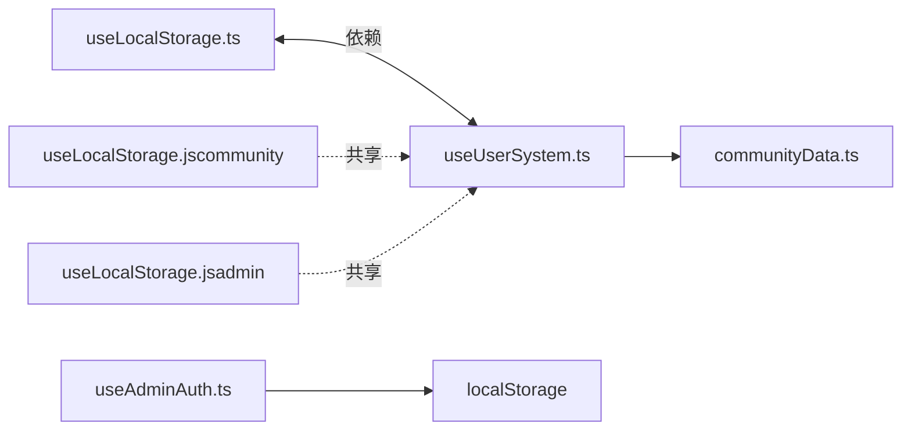

# 本地存储管理

<cite>
**本文引用的文件**
- [useLocalStorage.ts](file://src/hooks/useLocalStorage.ts)
- [useUserSystem.ts](file://src/hooks/useUserSystem.ts)
- [useAdminAuth.ts](file://src/hooks/useAdminAuth.ts)
- [communityData.ts](file://src/data/communityData.ts)
- [useLocalStorage.js（community 应用）](file://apps/community/src/hooks/useLocalStorage.js)
- [useLocalStorage.js（admin 应用）](file://apps/admin/src/hooks/useLocalStorage.js)
- [useAdminAuth.js（shell 应用）](file://apps/shell/src/hooks/useAdminAuth.js)
</cite>

## 目录
1. [简介](#简介)
2. [项目结构](#项目结构)
3. [核心组件](#核心组件)
4. [架构总览](#架构总览)
5. [组件详解](#组件详解)
6. [依赖关系分析](#依赖关系分析)
7. [性能与容量管理](#性能与容量管理)
8. [故障排查指南](#故障排查指南)
9. [结论](#结论)
10. [附录](#附录)

## 简介
本文件面向 YuleTech 社区的前端工程，系统化梳理本地存储管理方案，重点覆盖以下主题：
- localStorage 与 sessionStorage 的使用策略与持久化机制
- 自定义 Hook useLocalStorage 的实现原理与使用模式
- 用户系统状态的本地存储方案（认证信息、积分与等级、偏好设置等）
- 数据序列化与反序列化的最佳实践
- 存储容量管理、数据清理与垃圾回收策略
- 跨浏览器兼容性与存储限制应对
- 数据加密与安全存储的实现思路
- 性能优化与故障恢复指导原则

## 项目结构
YuleTech 社区采用多包/多应用结构，本地存储相关逻辑主要分布在：
- 根目录 hooks：通用的 useLocalStorage、useUserSystem、useAdminAuth
- 各子应用 hooks：在不同应用中复用或独立实现的 useLocalStorage
- 数据模型：generateId 等用于生成稳定键值的工具

图表来源
- [useLocalStorage.ts:1-59](file://src/hooks/useLocalStorage.ts#L1-L59)
- [useUserSystem.ts:1-135](file://src/hooks/useUserSystem.ts#L1-L135)
- [useAdminAuth.ts:1-67](file://src/hooks/useAdminAuth.ts#L1-L67)
- [communityData.ts:361-363](file://src/data/communityData.ts#L361-L363)
- [useLocalStorage.js（community 应用）:1-59](file://apps/community/src/hooks/useLocalStorage.js#L1-L59)
- [useLocalStorage.js（admin 应用）:1-59](file://apps/admin/src/hooks/useLocalStorage.js#L1-L59)
- [useAdminAuth.js（shell 应用）:1-31](file://apps/shell/src/hooks/useAdminAuth.js#L1-L31)

章节来源
- [useLocalStorage.ts:1-59](file://src/hooks/useLocalStorage.ts#L1-L59)
- [useUserSystem.ts:1-135](file://src/hooks/useUserSystem.ts#L1-L135)
- [useAdminAuth.ts:1-67](file://src/hooks/useAdminAuth.ts#L1-L67)
- [communityData.ts:361-363](file://src/data/communityData.ts#L361-L363)
- [useLocalStorage.js（community 应用）:1-59](file://apps/community/src/hooks/useLocalStorage.js#L1-L59)
- [useLocalStorage.js（admin 应用）:1-59](file://apps/admin/src/hooks/useLocalStorage.js#L1-L59)
- [useAdminAuth.js（shell 应用）:1-31](file://apps/shell/src/hooks/useAdminAuth.js#L1-L31)

## 核心组件
- useLocalStorage：封装 localStorage 的读写、跨标签页同步与自定义事件同步，提供类型安全的泛型支持
- useUserSystem：基于 useLocalStorage 维护用户积分与等级体系，支持动态规则与阈值
- useAdminAuth：基于 localStorage 的管理员会话管理，包含登录态校验与自动登出

章节来源
- [useLocalStorage.ts:1-59](file://src/hooks/useLocalStorage.ts#L1-L59)
- [useUserSystem.ts:91-132](file://src/hooks/useUserSystem.ts#L91-L132)
- [useAdminAuth.ts:29-66](file://src/hooks/useAdminAuth.ts#L29-L66)

## 架构总览
本地存储在应用中的交互流程如下：

图表来源
- [useLocalStorage.ts:14-25](file://src/hooks/useLocalStorage.ts#L14-L25)
- [useLocalStorage.ts:27-56](file://src/hooks/useLocalStorage.ts#L27-L56)

## 组件详解

### useLocalStorage：本地存储 Hook
- 设计目标
  - 提供类型安全的本地存储读写
  - 支持跨标签页同步（storage 事件）
  - 支持同一页面内多实例更新的自定义事件同步
  - 异常兜底，避免因存储异常影响应用运行
- 关键机制
  - 初始化：从 localStorage 取值并 JSON.parse，失败则回退初始值
  - 写入：JSON.stringify 后 setItem，同时派发自定义事件“localStorageChange”
  - 同步：监听 storage 事件与自定义事件，按 key 对齐更新状态
  - 清理：组件卸载时移除事件监听
- 使用模式
  - 传入唯一 key 与初始值，返回 [state, setState]
  - setState 支持函数式更新，确保并发写入的一致性
  - 适用于用户偏好、主题、语言、积分历史等场景

图表来源
- [useLocalStorage.ts:3-12](file://src/hooks/useLocalStorage.ts#L3-L12)
- [useLocalStorage.ts:14-25](file://src/hooks/useLocalStorage.ts#L14-L25)
- [useLocalStorage.ts:27-56](file://src/hooks/useLocalStorage.ts#L27-L56)

章节来源
- [useLocalStorage.ts:1-59](file://src/hooks/useLocalStorage.ts#L1-L59)
- [useLocalStorage.js（community 应用）:1-59](file://apps/community/src/hooks/useLocalStorage.js#L1-L59)
- [useLocalStorage.js（admin 应用）:1-59](file://apps/admin/src/hooks/useLocalStorage.js#L1-L59)

### useUserSystem：用户系统状态本地存储
- 数据模型
  - 积分与历史：points、history（含动作、描述、时间戳等）
  - 动作规则与等级阈值：可从 localStorage 动态覆盖默认规则
- 关键能力
  - addPoints：根据动作类型累加积分并追加历史项
  - setPoints：设置积分（非负）
  - getActionPoints/getLevelThresholds：从 localStorage 读取可配置规则
  - getLevelInfo：根据当前积分计算等级信息
- 本地存储键
  - 用户系统状态：'yuletech-user-system'
  - 动作规则：'yuletech-point-rules'
  - 等级阈值：'yuletech-level-thresholds'

图表来源
- [useUserSystem.ts:7-18](file://src/hooks/useUserSystem.ts#L7-L18)
- [useUserSystem.ts:91-132](file://src/hooks/useUserSystem.ts#L91-L132)

章节来源
- [useUserSystem.ts:1-135](file://src/hooks/useUserSystem.ts#L1-L135)
- [communityData.ts:361-363](file://src/data/communityData.ts#L361-L363)

### useAdminAuth：管理员会话管理
- 会话键：'yuletech-admin-auth'
- 登录：写入 { loggedInAt } 到 localStorage，标记登录态
- 校验：定期检查当前时间与登录时间差是否超过会话有效期（毫秒）
- 自动登出：超时后清除键并更新状态
- 退出：主动删除键并重置状态

图表来源
- [useAdminAuth.ts:12-27](file://src/hooks/useAdminAuth.ts#L12-L27)
- [useAdminAuth.ts:29-48](file://src/hooks/useAdminAuth.ts#L29-L48)
- [useAdminAuth.ts:50-63](file://src/hooks/useAdminAuth.ts#L50-L63)

章节来源
- [useAdminAuth.ts:1-67](file://src/hooks/useAdminAuth.ts#L1-L67)
- [useAdminAuth.js（shell 应用）:1-31](file://apps/shell/src/hooks/useAdminAuth.js#L1-L31)

## 依赖关系分析
- useUserSystem 依赖 useLocalStorage 以持久化用户状态；同时依赖 generateId 生成历史项 ID
- useAdminAuth 依赖 localStorage 进行会话持久化
- 多应用共享 useLocalStorage 的 JS 实现，保证行为一致

图表来源
- [useUserSystem.ts:1-3](file://src/hooks/useUserSystem.ts#L1-L3)
- [useLocalStorage.ts:1-1](file://src/hooks/useLocalStorage.ts#L1-L1)
- [communityData.ts:361-363](file://src/data/communityData.ts#L361-L363)
- [useLocalStorage.js（community 应用）:1-1](file://apps/community/src/hooks/useLocalStorage.js#L1-L1)
- [useLocalStorage.js（admin 应用）:1-1](file://apps/admin/src/hooks/useLocalStorage.js#L1-L1)
- [useAdminAuth.ts:1-1](file://src/hooks/useAdminAuth.ts#L1-L1)

章节来源
- [useUserSystem.ts:1-3](file://src/hooks/useUserSystem.ts#L1-L3)
- [useLocalStorage.ts:1-1](file://src/hooks/useLocalStorage.ts#L1-L1)
- [communityData.ts:361-363](file://src/data/communityData.ts#L361-L363)
- [useLocalStorage.js（community 应用）:1-1](file://apps/community/src/hooks/useLocalStorage.js#L1-L1)
- [useLocalStorage.js（admin 应用）:1-1](file://apps/admin/src/hooks/useLocalStorage.js#L1-L1)
- [useAdminAuth.ts:1-1](file://src/hooks/useAdminAuth.ts#L1-L1)

## 性能与容量管理
- 写入优化
  - setState 支持函数式更新，减少闭包捕获与中间变量
  - 仅在必要时进行 JSON.stringify 与 setItem
- 同步策略
  - storage 事件与自定义事件双通道同步，避免竞态
  - 事件监听在组件卸载时清理，防止内存泄漏
- 容量与清理
  - 建议为不同模块划分独立键空间，避免相互污染
  - 对历史类数据（如积分历史）设定上限，定期裁剪
  - 对大对象拆分存储或压缩序列化（谨慎评估 CPU 开销）
- 兼容性与限制
  - iOS Safari 阅读模式可能禁用 localStorage，需降级提示
  - 移动端无痕模式、隐私模式下 localStorage 不可用，应提供兜底方案（内存状态）
  - 不同浏览器厂商对 localStorage 容量限制不同，建议监控使用量并在接近阈值时提示用户清理
- 安全与加密
  - 对敏感信息（如会话令牌）不建议直接明文存储
  - 可考虑对关键字段进行轻量加密（如对称密钥 + base64），并结合 CSP 与 HttpOnly Cookie（服务端）实现多层防护
  - 会话有效期与自动登出机制可降低泄露风险
- 故障恢复
  - 解析失败时回退到初始值，避免应用崩溃
  - 对异常写入进行日志记录与告警，便于定位问题

## 故障排查指南
- 症状：状态不同步
  - 检查是否正确派发与监听“localStorageChange”事件
  - 确认 storage 事件监听是否生效
- 症状：频繁刷新丢失状态
  - 检查键名是否一致，是否存在命名冲突
  - 确认 JSON 序列化/反序列化是否正确
- 症状：移动端 Safari 无法保存
  - 检查是否处于阅读模式或无痕模式
  - 提供兜底提示与引导用户关闭无痕模式
- 症状：管理员会话不自动登出
  - 检查定时器是否正常运行与清理
  - 确认 loggedAt 时间戳是否正确写入与读取

章节来源
- [useLocalStorage.ts:27-56](file://src/hooks/useLocalStorage.ts#L27-L56)
- [useAdminAuth.ts:35-48](file://src/hooks/useAdminAuth.ts#L35-L48)

## 结论
YuleTech 社区的本地存储管理通过统一的 useLocalStorage Hook 实现了类型安全、跨标签页同步与异常兜底，结合 useUserSystem 与 useAdminAuth 形成了完整的用户与会话状态持久化方案。建议在生产环境中进一步完善容量监控、数据清理策略与安全加固，并针对不同浏览器与设备场景提供更完善的降级与提示。

## 附录
- 最佳实践清单
  - 为每个模块定义明确的键前缀与命名规范
  - 对大体量数据进行分片或版本化管理
  - 为关键字段增加校验与默认值
  - 在高并发写入场景下优先使用函数式 setState
  - 对敏感信息采用加密存储与服务端协同
  - 提供容量预警与一键清理入口