# 社区数据模型

<cite>
**本文档引用的文件**
- [communityData.ts](file://src/data/communityData.ts)
- [codeSearch.ts](file://src/data/codeSearch.ts)
- [modules.ts](file://src/data/modules.ts)
- [dailyCode.ts](file://src/data/dailyCode.ts)
- [ForumPage.tsx](file://src/pages/ForumPage.tsx)
- [QAPage.tsx](file://src/pages/QAPage.tsx)
- [EventsPage.tsx](file://src/pages/EventsPage.tsx)
- [GlobalSearch.tsx](file://src/components/GlobalSearch.tsx)
- [CodeSearch.tsx](file://src/components/CodeSearch.tsx)
- [useLocalStorage.ts](file://src/hooks/useLocalStorage.ts)
- [useUserSystem.ts](file://src/hooks/useUserSystem.ts)
- [useNotifications.ts](file://src/hooks/useNotifications.ts)
- [README.md](file://README.md)
</cite>

## 目录
1. [简介](#简介)
2. [项目结构](#项目结构)
3. [核心数据模型](#核心数据模型)
4. [架构概览](#架构概览)
5. [详细组件分析](#详细组件分析)
6. [依赖关系分析](#依赖关系分析)
7. [性能考虑](#性能考虑)
8. [故障排除指南](#故障排除指南)
9. [结论](#结论)

## 简介

YuleTech社区数据模型系统是一个面向AutoSAR BSW开发者的开源技术社区平台。该系统提供了完整的社区功能，包括技术论坛、问答系统、活动管理和代码搜索等功能模块。本文档详细介绍了社区数据结构的设计理念、数据模型定义、验证规则和业务约束，并提供了扩展指南和性能优化建议。

## 项目结构

项目采用模块化架构，主要分为以下几个核心部分：

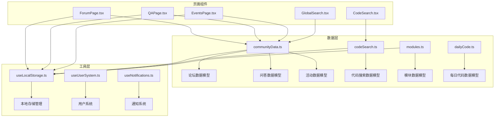

**图表来源**
- [communityData.ts:1-371](file://src/data/communityData.ts#L1-L371)
- [codeSearch.ts:1-540](file://src/data/codeSearch.ts#L1-L540)
- [modules.ts:1-800](file://src/data/modules.ts#L1-L800)

**章节来源**
- [README.md:20-46](file://README.md#L20-L46)

## 核心数据模型

### 论坛数据模型

论坛系统包含完整的帖子和回复数据结构：

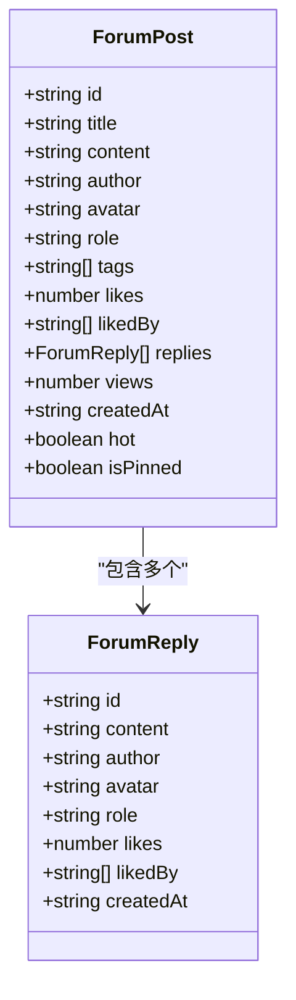

**图表来源**
- [communityData.ts:12-27](file://src/data/communityData.ts#L12-L27)
- [communityData.ts:1-10](file://src/data/communityData.ts#L1-L10)

### 问答系统数据模型

问答系统提供了完整的悬赏问答功能：

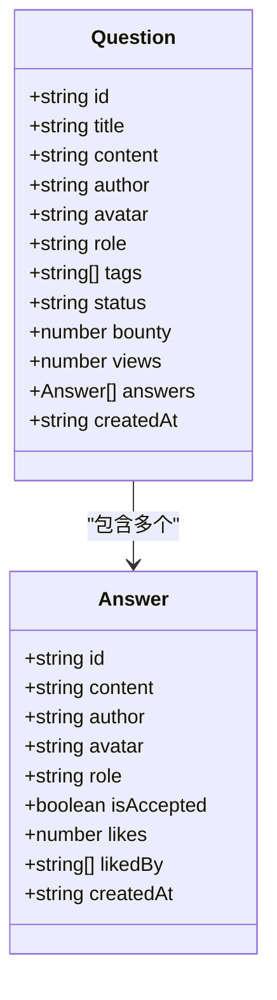

**图表来源**
- [communityData.ts:41-54](file://src/data/communityData.ts#L41-L54)
- [communityData.ts:29-39](file://src/data/communityData.ts#L29-L39)

### 活动管理数据模型

活动管理系统支持线上线下活动的完整生命周期：

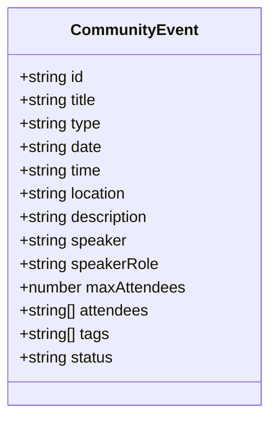

**图表来源**
- [communityData.ts:56-70](file://src/data/communityData.ts#L56-L70)

### 代码搜索数据模型

代码搜索系统提供了丰富的代码片段管理：

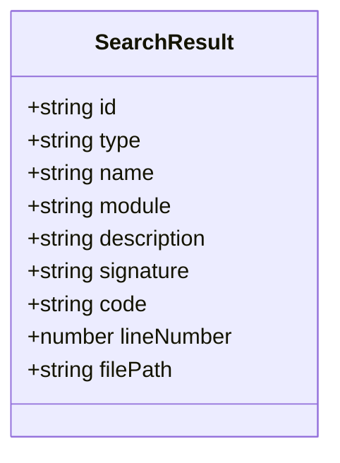

**图表来源**
- [codeSearch.ts:6-16](file://src/data/codeSearch.ts#L6-L16)

**章节来源**
- [communityData.ts:1-371](file://src/data/communityData.ts#L1-L371)
- [codeSearch.ts:1-540](file://src/data/codeSearch.ts#L1-L540)

## 架构概览

系统采用分层架构设计，确保数据模型的清晰分离和可维护性：

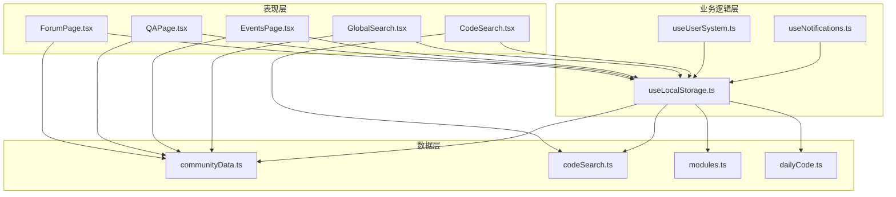

**图表来源**
- [ForumPage.tsx:1-544](file://src/pages/ForumPage.tsx#L1-L544)
- [QAPage.tsx:1-504](file://src/pages/QAPage.tsx#L1-L504)
- [EventsPage.tsx:1-498](file://src/pages/EventsPage.tsx#L1-L498)

## 详细组件分析

### 论坛页面组件

论坛页面组件实现了完整的帖子管理功能：

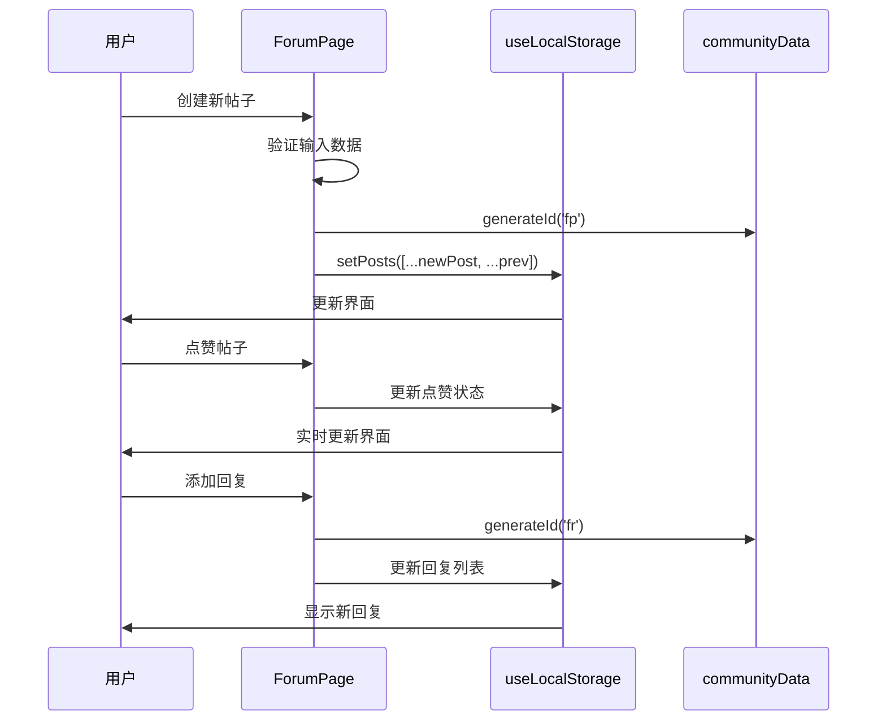

**图表来源**
- [ForumPage.tsx:167-194](file://src/pages/ForumPage.tsx#L167-L194)
- [ForumPage.tsx:105-137](file://src/pages/ForumPage.tsx#L105-L137)
- [communityData.ts:361-363](file://src/data/communityData.ts#L361-L363)

### 问答页面组件

问答系统提供了专业的技术问答功能：

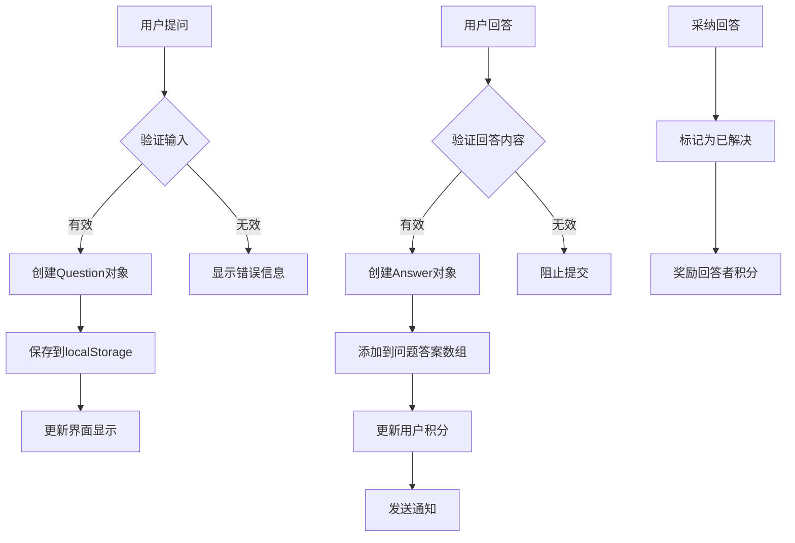

**图表来源**
- [QAPage.tsx:144-171](file://src/pages/QAPage.tsx#L144-L171)
- [QAPage.tsx:115-142](file://src/pages/QAPage.tsx#L115-L142)

### 活动管理组件

活动管理系统支持完整的活动生命周期：

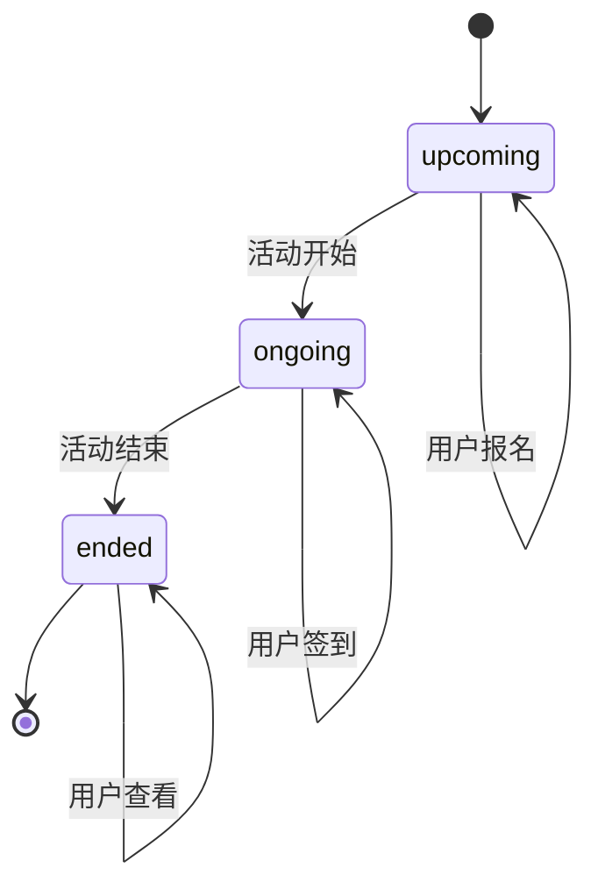

**图表来源**
- [EventsPage.tsx:65-88](file://src/pages/EventsPage.tsx#L65-L88)

### 代码搜索组件

代码搜索系统提供了强大的代码检索功能：

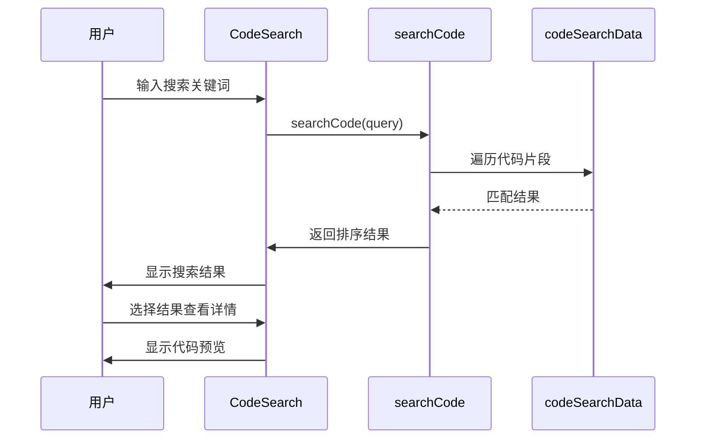

**图表来源**
- [CodeSearch.tsx:26-34](file://src/components/CodeSearch.tsx#L26-L34)
- [codeSearch.ts:447-484](file://src/data/codeSearch.ts#L447-L484)

**章节来源**
- [ForumPage.tsx:1-544](file://src/pages/ForumPage.tsx#L1-L544)
- [QAPage.tsx:1-504](file://src/pages/QAPage.tsx#L1-L504)
- [EventsPage.tsx:1-498](file://src/pages/EventsPage.tsx#L1-L498)
- [CodeSearch.tsx:1-339](file://src/components/CodeSearch.tsx#L1-L339)

## 依赖关系分析

系统中的数据模型依赖关系如下：

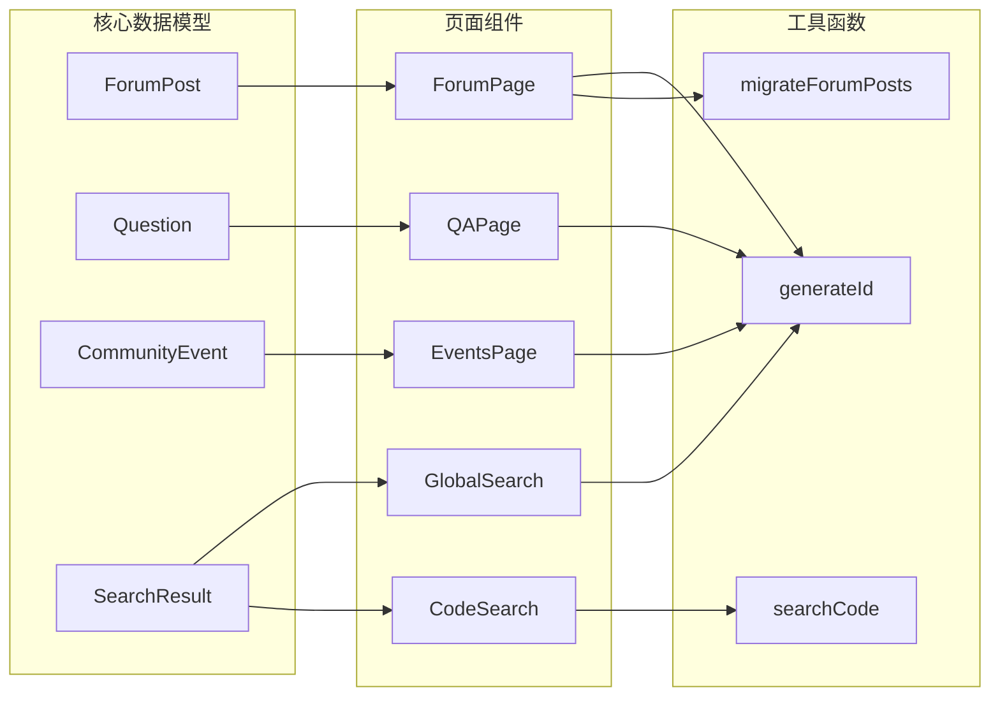

**图表来源**
- [communityData.ts:361-370](file://src/data/communityData.ts#L361-L370)
- [codeSearch.ts:447-484](file://src/data/codeSearch.ts#L447-L484)

**章节来源**
- [communityData.ts:1-371](file://src/data/communityData.ts#L1-L371)
- [codeSearch.ts:1-540](file://src/data/codeSearch.ts#L1-L540)

## 性能考虑

### 数据存储优化

系统采用localStorage作为主要数据存储方案，具有以下特点：

1. **本地缓存优势**：
   - 减少服务器负载
   - 提升响应速度
   - 支持离线访问

2. **数据持久化策略**：
   - 使用useLocalStorage Hook确保数据一致性
   - 支持跨标签页同步
   - 自动序列化/反序列化

### 搜索性能优化

代码搜索系统采用了多级匹配策略：

1. **优先级匹配**：
   - 名称匹配 (权重100)
   - 模块匹配 (权重80)
   - 描述匹配 (权重60)
   - 代码内容匹配 (权重40)

2. **性能优化措施**：
   - 限制返回结果数量 (前10个)
   - 使用字符串预处理减少比较成本
   - 懒加载搜索结果

### 内存管理

系统通过以下方式优化内存使用：

1. **数据结构优化**：
   - 使用扁平化数据结构
   - 避免循环引用
   - 及时清理不需要的数据

2. **组件优化**：
   - 使用React.memo避免不必要的重渲染
   - 合理使用useState和useEffect
   - 及时清理事件监听器

## 故障排除指南

### 常见问题及解决方案

#### 数据丢失问题
**症状**：用户数据在浏览器重启后丢失
**原因**：localStorage访问权限问题或存储空间不足
**解决方案**：
1. 检查浏览器隐私设置
2. 清理浏览器缓存
3. 确保localStorage可用性

#### 搜索结果异常
**症状**：代码搜索结果不准确或无结果
**原因**：搜索算法问题或数据格式错误
**解决方案**：
1. 验证搜索关键词格式
2. 检查数据模型一致性
3. 重新初始化搜索数据

#### 性能问题
**症状**：页面加载缓慢或交互卡顿
**原因**：大数据量处理或内存泄漏
**解决方案**：
1. 实施数据分页加载
2. 优化组件渲染逻辑
3. 使用虚拟滚动技术

**章节来源**
- [useLocalStorage.ts:1-60](file://src/hooks/useLocalStorage.ts#L1-L60)
- [useUserSystem.ts:1-135](file://src/hooks/useUserSystem.ts#L1-L135)
- [useNotifications.ts:1-50](file://src/hooks/useNotifications.ts#L1-L50)

## 结论

YuleTech社区数据模型系统通过精心设计的数据结构和模块化架构，为AutoSAR BSW开发者提供了一个功能完整、性能优良的技术社区平台。系统的主要优势包括：

1. **清晰的数据模型**：每个数据实体都有明确的职责和边界
2. **灵活的扩展性**：支持自定义字段和业务规则
3. **优秀的用户体验**：实时数据更新和流畅的交互体验
4. **可靠的性能表现**：优化的搜索算法和数据存储策略

未来的发展方向包括：
- 增强数据验证和业务规则
- 扩展移动端适配
- 优化大数据量处理能力
- 增加数据分析和统计功能

该系统为开发者提供了一个坚实的基础，可以在此基础上进一步扩展和完善社区功能。