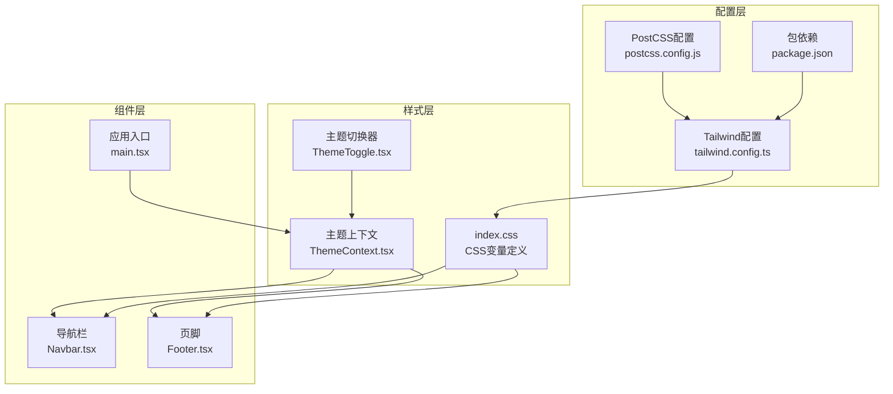
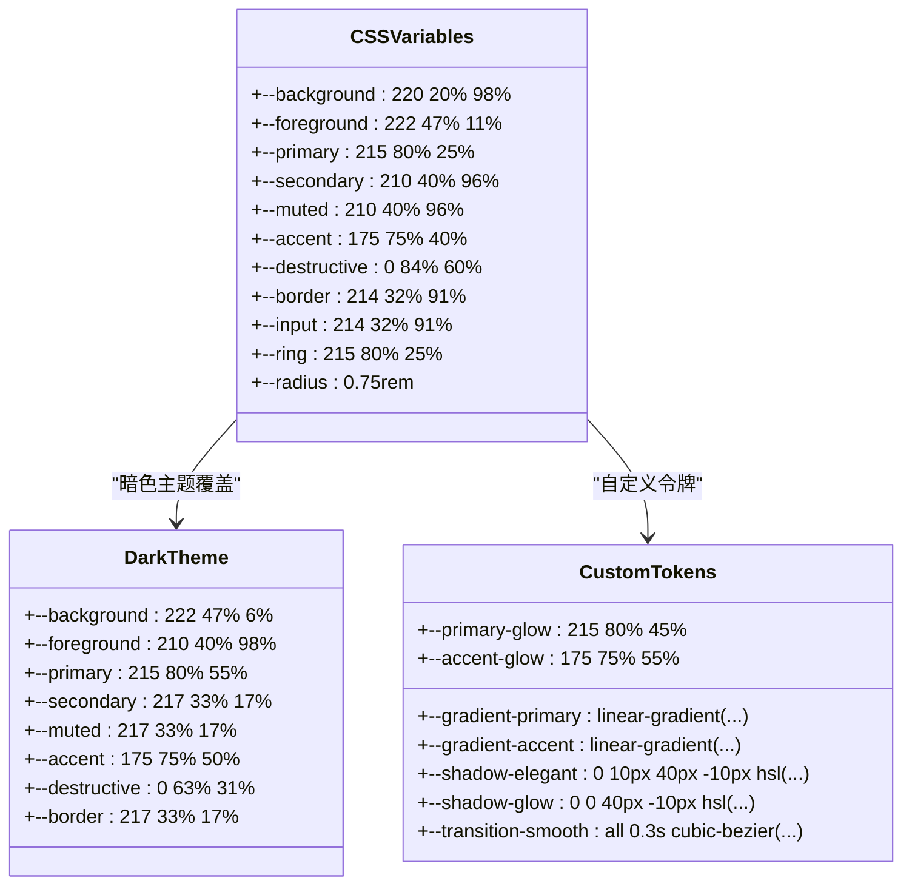
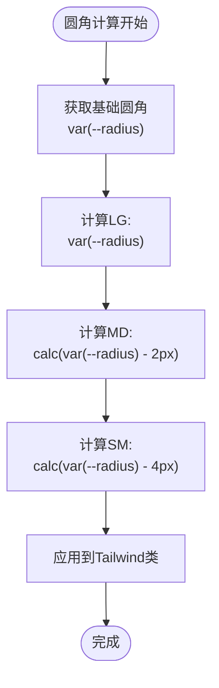
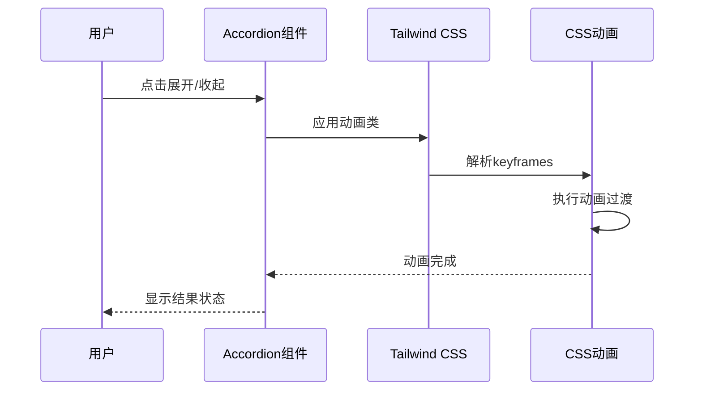
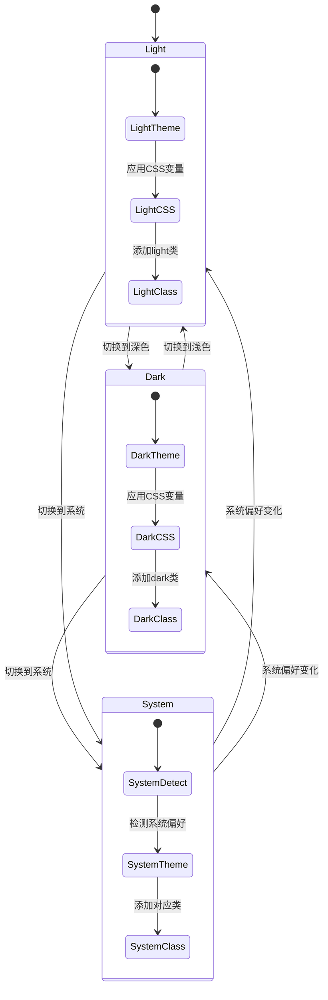
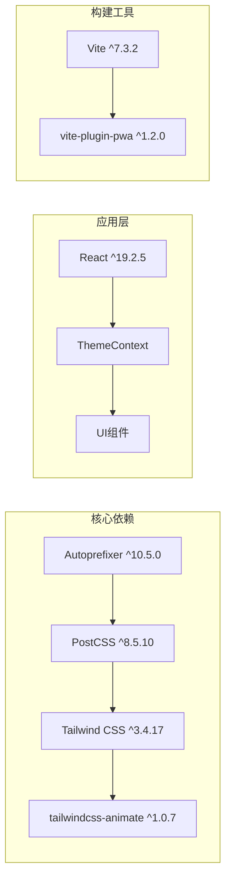
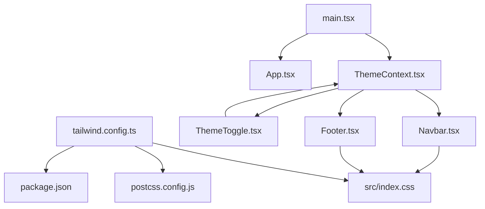

# Tailwind CSS配置

<cite>
**本文档引用的文件**
- [tailwind.config.ts](file://tailwind.config.ts)
- [index.css](file://src/index.css)
- [postcss.config.js](file://postcss.config.js)
- [ThemeContext.tsx](file://src/contexts/ThemeContext.tsx)
- [ThemeToggle.tsx](file://src/components/ThemeToggle.tsx)
- [Navbar.tsx](file://src/components/Navbar.tsx)
- [Footer.tsx](file://src/components/Footer.tsx)
- [main.tsx](file://src/main.tsx)
- [package.json](file://package.json)
- [vite.config.ts](file://vite.config.ts)
</cite>

## 目录
1. [简介](#简介)
2. [项目结构](#项目结构)
3. [核心配置组件](#核心配置组件)
4. [架构概览](#架构概览)
5. [详细组件分析](#详细组件分析)
6. [依赖关系分析](#依赖关系分析)
7. [性能考虑](#性能考虑)
8. [故障排除指南](#故障排除指南)
9. [结论](#结论)
10. [附录](#附录)

## 简介

本项目采用现代化的Tailwind CSS配置系统，实现了完整的暗色模式支持、CSS变量驱动的设计系统和响应式设计。该配置系统基于CSS自定义属性（CSS Variables）和HSL颜色空间，提供了灵活的主题切换机制和丰富的视觉效果。

项目的核心特色包括：
- 基于CSS变量的动态主题系统
- 完整的暗色模式支持（light/dark/system）
- 渐变背景和发光效果的自定义属性
- 动画插件集成（tailwindcss-animate）
- 响应式容器和断点配置

## 项目结构

该项目采用单体应用架构，Tailwind CSS配置集中在一个配置文件中，并与CSS变量系统紧密结合：



**图表来源**
- [tailwind.config.ts:1-79](file://tailwind.config.ts#L1-L79)
- [index.css:1-112](file://src/index.css#L1-L112)
- [ThemeContext.tsx:1-127](file://src/contexts/ThemeContext.tsx#L1-L127)

**章节来源**
- [tailwind.config.ts:1-79](file://tailwind.config.ts#L1-L79)
- [index.css:1-112](file://src/index.css#L1-L112)
- [package.json:1-46](file://package.json#L1-L46)

## 核心配置组件

### 配置文件结构分析

Tailwind CSS配置文件采用了模块化的配置结构，包含以下关键部分：

#### 基础配置选项

| 配置项 | 类型 | 默认值 | 说明 |
|--------|------|--------|------|
| `darkMode` | string[] | `["class"]` | 暗色模式触发方式，使用class类名 |
| `content` | string[] | 当前目录和src目录 | 内容扫描路径，用于Tree Shaking |
| `prefix` | string | `""` | CSS类名前缀，当前为空 |

#### 主题扩展配置

配置系统通过`theme.extend`实现了深度定制，主要包括：

1. **颜色系统扩展**：基于CSS变量的颜色映射
2. **圆角半径变量**：动态圆角半径计算
3. **动画效果**：Accordion组件的展开收起动画
4. **容器配置**：响应式容器尺寸控制

**章节来源**
- [tailwind.config.ts:3-79](file://tailwind.config.ts#L3-L79)

## 架构概览

整个Tailwind CSS配置系统采用分层架构，从底层的CSS变量到上层的React组件，形成了完整的样式体系：

```mermaid
graph TD
subgraph "数据层"
CSSVARS[CSS变量<br/>:root和.dark]
COLORS[颜色令牌<br/>hsl(var(--color))]
RADIUS[圆角令牌<br/>var(--radius)]
end
subgraph "配置层"
TWC[Tailwind配置<br/>tailwind.config.ts]
EXTEND[主题扩展<br/>colors/borderRadius/keyframes]
PLUGINS[插件系统<br/>tailwindcss-animate]
end
subgraph "运行时层"
THEMECTX[主题上下文<br/>ThemeContext.tsx]
DOCROOT[文档根元素<br/>documentElement]
CLASSES[动态类名<br/>light/dark/class]
end
subgraph "表现层"
NAVCOMP[导航组件<br/>Navbar.tsx]
FOOTCOMP[页脚组件<br/>Footer.tsx]
UTILCOMP[工具组件<br/>各种UI组件]
end
CSSVARS --> COLORS
COLORS --> TWC
RADIUS --> TWC
TWC --> THEMECTX
THEMECTX --> DOCROOT
DOCROOT --> CLASSES
CLASSES --> NAVCOMP
CLASSES --> FOOTCOMP
CLASSES --> UTILCOMP
```

**图表来源**
- [index.css:5-60](file://src/index.css#L5-L60)
- [tailwind.config.ts:10-75](file://tailwind.config.ts#L10-L75)
- [ThemeContext.tsx:41-82](file://src/contexts/ThemeContext.tsx#L41-L82)

## 详细组件分析

### CSS变量系统

#### 变量定义结构

CSS变量系统采用HSL颜色空间，提供了完整的明暗两套主题：



**图表来源**
- [index.css:6-37](file://src/index.css#L6-L37)
- [index.css:39-59](file://src/index.css#L39-L59)
- [index.css:28-37](file://src/index.css#L28-L37)

#### 颜色系统扩展

Tailwind配置通过`theme.extend.colors`将CSS变量映射到Tailwind类名：

| 颜色类别 | CSS变量 | Tailwind类名 | 使用场景 |
|----------|---------|--------------|----------|
| 基础色 | `--background` | `bg-background` | 背景容器 |
| 强调色 | `--primary` | `bg-primary` | 主要按钮 |
| 辅助色 | `--secondary` | `bg-secondary` | 次要按钮 |
| 危险色 | `--destructive` | `bg-destructive` | 删除操作 |
| 弹出层 | `--popover` | `bg-popover` | 下拉菜单 |
| 卡片色 | `--card` | `bg-card` | 卡片组件 |

**章节来源**
- [tailwind.config.ts:18-53](file://tailwind.config.ts#L18-L53)
- [index.css:6-59](file://src/index.css#L6-L59)

### 圆角半径系统

圆角半径通过CSS变量实现动态计算：



**图表来源**
- [tailwind.config.ts:54-58](file://tailwind.config.ts#L54-L58)
- [index.css:26](file://src/index.css#L26)

### 动画系统

配置集成了tailwindcss-animate插件，提供了Accordion组件的动画效果：



**图表来源**
- [tailwind.config.ts:59-72](file://tailwind.config.ts#L59-L72)
- [tailwind.config.ts:75](file://tailwind.config.ts#L75)

**章节来源**
- [tailwind.config.ts:59-75](file://tailwind.config.ts#L59-L75)

### 主题切换机制

主题切换通过React Context实现，结合CSS变量系统：



**图表来源**
- [ThemeContext.tsx:41-82](file://src/contexts/ThemeContext.tsx#L41-L82)
- [ThemeToggle.tsx:11-99](file://src/components/ThemeToggle.tsx#L11-L99)

**章节来源**
- [ThemeContext.tsx:1-127](file://src/contexts/ThemeContext.tsx#L1-L127)
- [ThemeToggle.tsx:1-120](file://src/components/ThemeToggle.tsx#L1-L120)

### 组件中的样式使用

在实际组件中，开发者可以使用多种方式应用样式：

#### 基础颜色应用
```jsx
// 使用CSS变量颜色
<button className="bg-[hsl(var(--primary))] text-primary-foreground">
  主要按钮
</button>

// 使用Tailwind内置颜色
<div className="bg-background text-foreground">
  默认背景
</div>
```

#### 渐变效果应用
```jsx
// 使用自定义渐变
<h1 className="text-gradient">渐变标题</h1>
<div className="bg-gradient-hero">Hero区域</div>
```

#### 阴影效果应用
```jsx
// 使用发光阴影
<div className="shadow-glow">发光效果</div>
<div className="shadow-elegant">优雅阴影</div>
```

**章节来源**
- [Navbar.tsx:54-121](file://src/components/Navbar.tsx#L54-L121)
- [Footer.tsx:36-92](file://src/components/Footer.tsx#L36-L92)
- [index.css:89-111](file://src/index.css#L89-L111)

## 依赖关系分析

### 外部依赖关系



**图表来源**
- [package.json:12-44](file://package.json#L12-L44)

### 内部依赖关系



**图表来源**
- [tailwind.config.ts:1-79](file://tailwind.config.ts#L1-L79)
- [ThemeContext.tsx:1-127](file://src/contexts/ThemeContext.tsx#L1-L127)
- [main.tsx:1-23](file://src/main.tsx#L1-L23)

**章节来源**
- [package.json:12-44](file://package.json#L12-L44)
- [vite.config.ts:1-32](file://vite.config.ts#L1-L32)

## 性能考虑

### Tree Shaking优化

Tailwind CSS配置通过精确的内容扫描路径实现Tree Shaking：

```mermaid
flowchart LR
SRC[src/**/*.{ts,tsx}] --> SCAN[内容扫描]
HTML[index.html] --> SCAN
SCAN --> BUILD[构建优化]
BUILD --> MINIFY[CSS压缩]
MINIFY --> OUTPUT[最终输出]
subgraph "优化策略"
OPT1[精确路径匹配]
OPT2[按需生成]
OPT3[无用类移除]
end
SCAN --> OPT1
OPT1 --> OPT2
OPT2 --> OPT3
```

**图表来源**
- [tailwind.config.ts:5-8](file://tailwind.config.ts#L5-L8)

### CSS变量性能优势

CSS变量系统相比传统CSS具有以下性能优势：

1. **运行时计算**：在浏览器端进行计算，减少CSS文件大小
2. **内存效率**：变量复用，避免重复定义
3. **主题切换**：通过类名切换实现，无需重新加载样式

### 动画性能优化

tailwindcss-animate插件提供了高性能的CSS动画：

- 使用`transform`和`opacity`属性，这些属性具有硬件加速
- 优化的缓动函数，确保流畅的用户体验
- 最小化的JavaScript依赖，减少运行时开销

## 故障排除指南

### 常见问题及解决方案

#### 问题1：主题切换不生效

**症状**：点击主题切换按钮后界面没有变化

**可能原因**：
1. CSS变量未正确应用到`:root`和`.dark`选择器
2. 主题上下文未正确包装应用
3. 文档根元素类名未更新

**解决方案**：
1. 检查CSS变量定义是否完整
2. 确认ThemeContext正确包裹App组件
3. 验证documentElement.classList更新逻辑

**章节来源**
- [ThemeContext.tsx:61-64](file://src/contexts/ThemeContext.tsx#L61-L64)
- [index.css:5-60](file://src/index.css#L5-L60)

#### 问题2：颜色显示异常

**症状**：某些元素颜色不符合预期

**可能原因**：
1. CSS变量值格式错误
2. Tailwind类名拼写错误
3. 颜色空间不匹配

**解决方案**：
1. 验证HSL值格式（色相: 0-360, 饱和度: 0%-100%, 亮度: 0%-100%）
2. 检查Tailwind类名是否正确
3. 确保使用`hsl(var(--variable))`格式

#### 问题3：动画效果不流畅

**症状**：Accordion动画卡顿或不流畅

**可能原因**：
1. 动画帧率不足
2. 过多的DOM操作
3. CSS渲染阻塞

**解决方案**：
1. 检查浏览器性能面板，确认FPS稳定
2. 减少动画期间的重排重绘
3. 确保使用硬件加速的CSS属性

### 调试技巧

#### CSS变量调试

```javascript
// 在浏览器控制台检查CSS变量
console.log(getComputedStyle(document.documentElement).getPropertyValue('--primary'));
console.log(document.documentElement.classList);

// 检查主题类名
document.documentElement.classList.contains('dark');
document.documentElement.getAttribute('data-theme');
```

#### Tailwind类名调试

```javascript
// 检查元素是否包含特定类名
element.classList.contains('bg-background');
element.classList.contains('text-foreground');

// 查看所有应用的类名
element.className.split(' ');
```

## 结论

本Tailwind CSS配置系统展现了现代前端开发的最佳实践，通过CSS变量驱动的设计系统、完善的主题切换机制和高效的构建流程，为开发者提供了一个强大而灵活的样式解决方案。

### 主要优势

1. **设计系统一致性**：基于CSS变量的颜色和间距系统确保设计一致性
2. **主题灵活性**：支持三种主题模式，满足不同用户需求
3. **性能优化**：Tree Shaking和CSS变量减少不必要的样式代码
4. **可维护性**：模块化的配置结构便于维护和扩展

### 未来发展方向

1. **响应式断点扩展**：根据项目需求添加更多断点
2. **动画系统完善**：扩展更多预设动画效果
3. **组件库集成**：与shadcn/ui等组件库深度集成
4. **国际化支持**：添加RTL布局和多语言支持

## 附录

### 配置最佳实践

#### 颜色系统扩展指南

```typescript
// 推荐的颜色扩展格式
theme.extend.colors = {
  // 基础颜色
  primary: {
    DEFAULT: "hsl(var(--primary))",
    foreground: "hsl(var(--primary-foreground))"
  },
  // 状态颜色
  success: {
    DEFAULT: "hsl(var(--success))",
    foreground: "hsl(var(--success-foreground))"
  },
  warning: {
    DEFAULT: "hsl(var(--warning))",
    foreground: "hsl(var(--warning-foreground))"
  }
};
```

#### CSS变量命名规范

1. **语义化命名**：使用描述性的变量名
2. **层次结构**：按照设计层级组织变量
3. **颜色空间统一**：始终使用HSL格式
4. **主题一致性**：确保明暗主题变量对称

#### 性能优化建议

1. **最小化变量数量**：只定义必要的CSS变量
2. **合理使用动画**：避免过度复杂的CSS动画
3. **组件级样式**：优先使用组件级样式而非全局样式
4. **懒加载策略**：对大型组件的样式进行懒加载

### 维护策略

#### 版本升级指南

当升级Tailwind CSS版本时：

1. **检查配置兼容性**：验证新版本的配置选项
2. **测试主题切换**：确保暗色模式正常工作
3. **验证动画效果**：检查所有CSS动画是否正常
4. **更新依赖版本**：同步更新相关插件版本

#### 团队协作规范

1. **命名约定**：统一CSS变量和类名命名
2. **文档维护**：及时更新设计系统文档
3. **代码审查**：审查样式相关代码变更
4. **性能监控**：定期检查CSS文件大小和加载性能