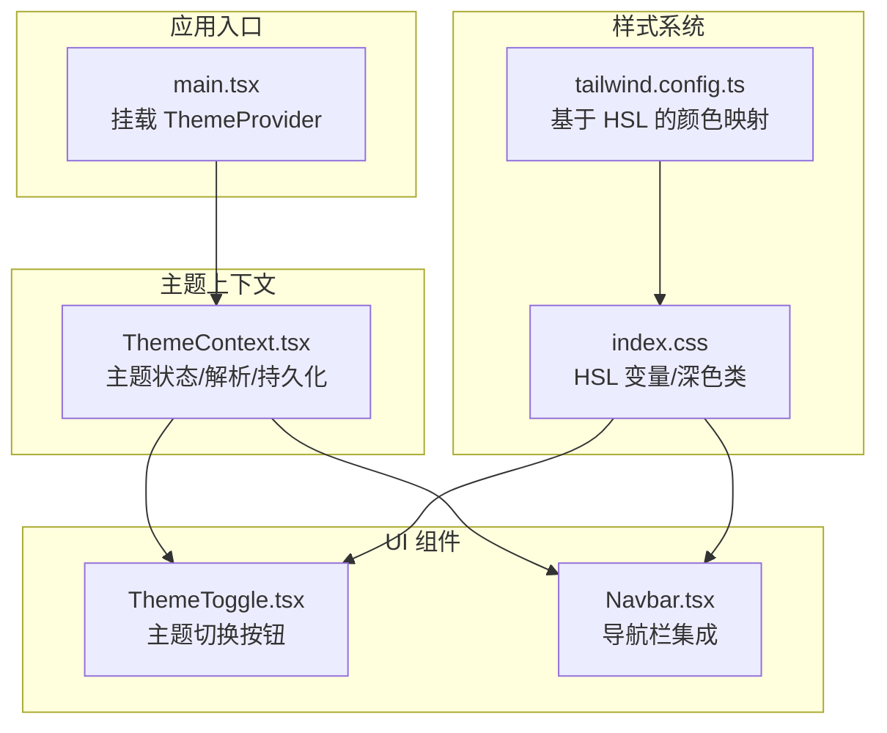
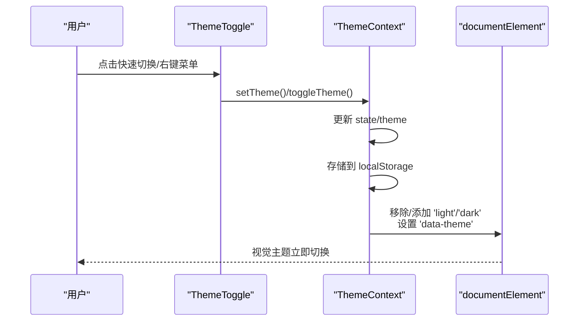
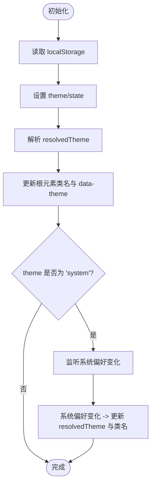
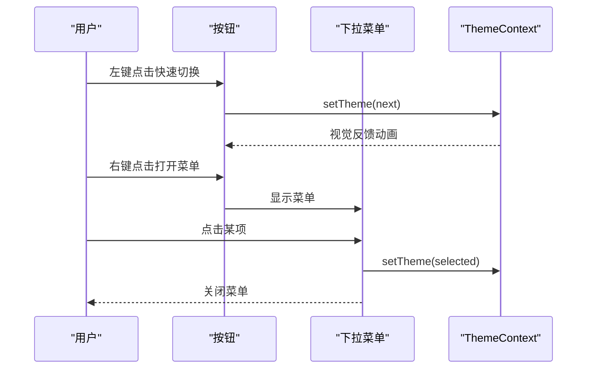
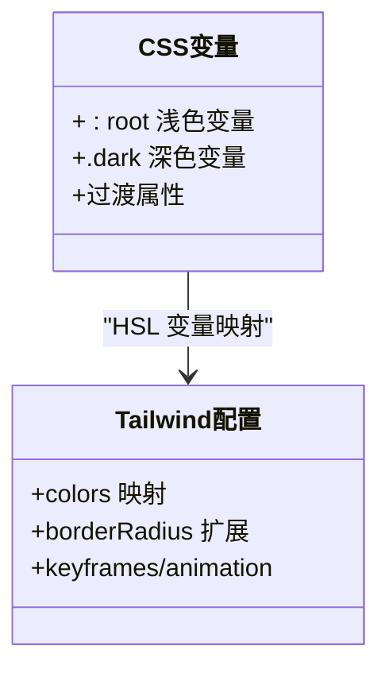
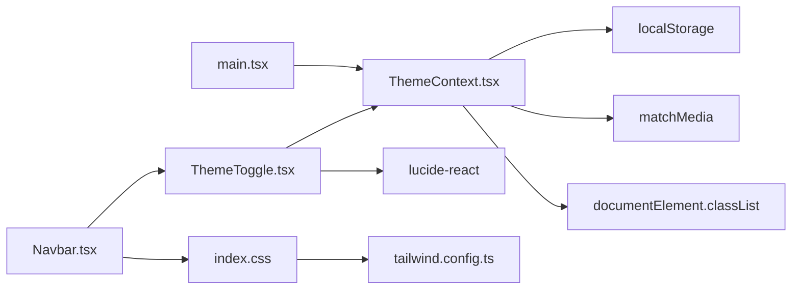

# 主题系统

<cite>
**本文引用的文件**
- [ThemeContext.tsx](file://src/contexts/ThemeContext.tsx)
- [ThemeToggle.tsx](file://src/components/ThemeToggle.tsx)
- [ThemeToggle.tsx（归档版本）](file://archive/src/components/ThemeToggle.tsx)
- [ThemeContext.tsx（归档版本）](file://archive/src/contexts/ThemeContext.tsx)
- [index.css](file://src/index.css)
- [tailwind.config.ts](file://tailwind.config.ts)
- [main.tsx](file://src/main.tsx)
- [Navbar.tsx](file://src/components/Navbar.tsx)
- [useLocalStorage.ts](file://src/hooks/useLocalStorage.ts)
- [ThemeContext.js（Shell 应用）](file://apps/shell/src/contexts/ThemeContext.js)
</cite>

## 目录
1. [简介](#简介)
2. [项目结构](#项目结构)
3. [核心组件](#核心组件)
4. [架构总览](#架构总览)
5. [组件详解](#组件详解)
6. [依赖关系分析](#依赖关系分析)
7. [性能与内存考量](#性能与内存考量)
8. [故障排查指南](#故障排查指南)
9. [结论](#结论)
10. [附录：定制与最佳实践](#附录定制与最佳实践)

## 简介
本主题系统通过 React 上下文与 Tailwind CSS 的 HSL 变量体系，实现了“浅色/深色/跟随系统”三态主题切换，并在客户端完成持久化与即时生效。系统包含主题状态管理、主题切换逻辑、持久化存储、无障碍支持与动画过渡，同时兼容服务端渲染场景下的首屏渲染一致性。

## 项目结构
主题系统的关键文件分布如下：
- 上下文与入口：ThemeContext.tsx、main.tsx
- 组件层：ThemeToggle.tsx、Navbar.tsx
- 样式层：index.css、tailwind.config.ts
- 工具与钩子：useLocalStorage.ts
- 归档与对比：archive 下的对应文件用于历史对照
- Shell 应用主题上下文：apps/shell/src/contexts/ThemeContext.js

**图表来源**
- [main.tsx:9-18](file://src/main.tsx#L9-L18)
- [ThemeContext.tsx:41-116](file://src/contexts/ThemeContext.tsx#L41-L116)
- [ThemeToggle.tsx:11-99](file://src/components/ThemeToggle.tsx#L11-L99)
- [Navbar.tsx:44-121](file://src/components/Navbar.tsx#L44-L121)
- [index.css:5-73](file://src/index.css#L5-L73)
- [tailwind.config.ts:18-53](file://tailwind.config.ts#L18-L53)

**章节来源**
- [main.tsx:9-18](file://src/main.tsx#L9-L18)
- [ThemeContext.tsx:41-116](file://src/contexts/ThemeContext.tsx#L41-L116)
- [ThemeToggle.tsx:11-99](file://src/components/ThemeToggle.tsx#L11-L99)
- [Navbar.tsx:44-121](file://src/components/Navbar.tsx#L44-L121)
- [index.css:5-73](file://src/index.css#L5-L73)
- [tailwind.config.ts:18-53](file://tailwind.config.ts#L18-L53)

## 核心组件
- 主题上下文（ThemeContext）
  - 提供 theme/resolvedTheme/setTheme/toggleTheme 四个核心能力
  - 支持默认主题与系统偏好联动
  - 使用 localStorage 持久化主题选择
- 主题切换器（ThemeToggle）
  - 快速切换：左键循环 light/dark/system
  - 菜单选择：右键弹出菜单，支持图标与文案提示
  - 无障碍：按钮标题与 aria-label 提示当前主题；深色模式下提供屏幕阅读器文本
  - 动画：切换时提供旋转缩放过渡效果

**章节来源**
- [ThemeContext.tsx:3-127](file://src/contexts/ThemeContext.tsx#L3-L127)
- [ThemeToggle.tsx:11-120](file://src/components/ThemeToggle.tsx#L11-L120)

## 架构总览
主题系统采用“上下文驱动 + CSS 变量 + Tailwind 映射”的分层架构：
- 上下文层：负责状态解析与持久化，动态更新根元素类名与 data-theme 属性
- 组件层：ThemeToggle 提供交互入口，Navbar 集成于全局布局
- 样式层：index.css 定义 :root 与 .dark 的 HSL 变量；tailwind.config.ts 将这些变量映射为 Tailwind 类
- 运行时：main.tsx 在应用启动时挂载 ThemeProvider，默认策略为“跟随系统”

**图表来源**
- [ThemeToggle.tsx:32-44](file://src/components/ThemeToggle.tsx#L32-L44)
- [ThemeContext.tsx:84-93](file://src/contexts/ThemeContext.tsx#L84-L93)
- [ThemeContext.tsx:60-65](file://src/contexts/ThemeContext.tsx#L60-L65)

**章节来源**
- [ThemeContext.tsx:41-116](file://src/contexts/ThemeContext.tsx#L41-L116)
- [ThemeToggle.tsx:11-99](file://src/components/ThemeToggle.tsx#L11-L99)
- [main.tsx:9-18](file://src/main.tsx#L9-L18)

## 组件详解

### 主题上下文（ThemeContext）
- 状态与解析
  - theme：用户选择值（'light' | 'dark' | 'system'）
  - resolvedTheme：当前生效值（始终为 'light' 或 'dark'）
  - mounted：防闪烁控制，首次渲染隐藏内容，待初始化完成再显示
- 切换与持久化
  - setTheme：更新状态并写入 localStorage
  - toggleTheme：在 light/dark 间切换（若为 system，则按系统偏好决定当前态）
- 文档根类与属性
  - 切换时移除/添加 'light'/'dark' 类，并设置 data-theme='light'|'dark'
- 系统偏好监听
  - 当 theme 为 'system' 时，监听 prefers-color-scheme 变化，实时更新 resolvedTheme 与根类

**图表来源**
- [ThemeContext.tsx:46-82](file://src/contexts/ThemeContext.tsx#L46-L82)
- [ThemeContext.tsx:60-65](file://src/contexts/ThemeContext.tsx#L60-L65)

**章节来源**
- [ThemeContext.tsx:41-116](file://src/contexts/ThemeContext.tsx#L41-L116)

### 主题切换器（ThemeToggle）
- 快速切换
  - 左键点击：在 ['light','dark','system'] 中循环切换
  - 切换时添加动画类，避免重复触发
- 下拉菜单
  - 右键打开菜单，展示三种主题选项与当前选中指示
  - 点击后关闭菜单并调用 setTheme
- 无障碍与可访问性
  - 按钮 title 与 aria-label 提示当前主题
  - 深色模式下提供 sr-only 文本，便于屏幕阅读器识别
- 样式与图标
  - 根据当前主题选择 Sun/Moon/Monitor 图标
  - 使用 Tailwind 变量与阴影等实用类增强视觉层次

**图表来源**
- [ThemeToggle.tsx:32-44](file://src/components/ThemeToggle.tsx#L32-L44)
- [ThemeToggle.tsx:69-96](file://src/components/ThemeToggle.tsx#L69-L96)

**章节来源**
- [ThemeToggle.tsx:11-120](file://src/components/ThemeToggle.tsx#L11-L120)

### 样式与变量体系
- CSS 变量与深色类
  - :root 定义浅色变量；.dark 定义深色变量
  - 通过根元素类名切换主题，Tailwind 类自动映射到 HSL 值
- 过渡与动效
  - 对 html 及其伪元素统一设置过渡，确保平滑的颜色与阴影变化
- Tailwind 颜色映射
  - tailwind.config.ts 将 --background/--foreground 等变量映射为颜色类
  - 支持自定义半径、渐变、阴影等扩展

**图表来源**
- [index.css:5-73](file://src/index.css#L5-L73)
- [tailwind.config.ts:18-53](file://tailwind.config.ts#L18-L53)

**章节来源**
- [index.css:5-112](file://src/index.css#L5-L112)
- [tailwind.config.ts:18-76](file://tailwind.config.ts#L18-L76)

### 与导航栏的集成
- Navbar 在桌面与移动端均集成了 ThemeToggle
- 使用 Tailwind 变量实现背景、边框、高亮等样式随主题变化
- 滚动时的背景模糊与阴影也受益于主题变量

**章节来源**
- [Navbar.tsx:44-121](file://src/components/Navbar.tsx#L44-L121)

### 持久化与跨标签同步
- 主题上下文直接写入 localStorage，键名为 yule-theme
- useLocalStorage.ts 提供通用的本地存储钩子，支持跨窗口事件同步
- 在多标签页场景下，可通过 storage 事件与自定义事件实现同步刷新

**章节来源**
- [ThemeContext.tsx:14-34](file://src/contexts/ThemeContext.tsx#L14-L34)
- [useLocalStorage.ts:1-60](file://src/hooks/useLocalStorage.ts#L1-L60)

### 服务端渲染（SSR）与首屏一致性
- main.tsx 在客户端挂载 ThemeProvider，默认 defaultTheme="system"
- 首屏渲染由浏览器根据系统偏好或静态 CSS 决定初始外观
- ThemeContext 在 mounted 后才暴露真实上下文，避免 SSR 与 CSR 不一致导致的闪烁

**章节来源**
- [main.tsx:9-18](file://src/main.tsx#L9-L18)
- [ThemeContext.tsx:95-115](file://src/contexts/ThemeContext.tsx#L95-L115)

### Shell 应用的简化主题上下文
- apps/shell/src/contexts/ThemeContext.js 提供了更简化的实现，同样基于 localStorage 与根元素类名切换
- 适用于独立应用或子应用的轻量主题方案

**章节来源**
- [ThemeContext.js（Shell 应用）:1-28](file://apps/shell/src/contexts/ThemeContext.js#L1-L28)

## 依赖关系分析
- ThemeContext 依赖
  - React 上下文与副作用（useEffect）
  - localStorage API（封装在 store/get 函数中）
  - 浏览器媒体查询（prefers-color-scheme）
- ThemeToggle 依赖
  - ThemeContext（useTheme）
  - lucide-react 图标库
  - DOM 事件（click/mousedown）
- 样式依赖
  - index.css 的 HSL 变量与 .dark 类
  - tailwind.config.ts 的颜色映射
- 入口依赖
  - main.tsx 挂载 ThemeProvider 并包裹应用

**图表来源**
- [ThemeContext.tsx:16-34](file://src/contexts/ThemeContext.tsx#L16-L34)
- [ThemeToggle.tsx:1-3](file://src/components/ThemeToggle.tsx#L1-L3)
- [index.css:5-73](file://src/index.css#L5-L73)
- [tailwind.config.ts:18-53](file://tailwind.config.ts#L18-L53)
- [Navbar.tsx:44-121](file://src/components/Navbar.tsx#L44-L121)
- [main.tsx:9-18](file://src/main.tsx#L9-L18)

**章节来源**
- [ThemeContext.tsx:16-34](file://src/contexts/ThemeContext.tsx#L16-L34)
- [ThemeToggle.tsx:1-3](file://src/components/ThemeToggle.tsx#L1-L3)
- [index.css:5-73](file://src/index.css#L5-L73)
- [tailwind.config.ts:18-53](file://tailwind.config.ts#L18-L53)
- [Navbar.tsx:44-121](file://src/components/Navbar.tsx#L44-L121)
- [main.tsx:9-18](file://src/main.tsx#L9-L18)

## 性能与内存考量
- 首屏防闪烁
  - mounted 控制仅在客户端完成初始化后再渲染真实内容，避免 SSR 与 CSR 的不一致
- 事件监听与清理
  - 系统偏好监听在组件卸载时正确移除，防止内存泄漏
- 存储异常处理
  - localStorage 访问失败时静默忽略，保证应用稳定性
- 动画与过渡
  - 统一的过渡属性减少重排与重绘开销；快速切换时通过状态锁避免频繁触发
- Tailwind 变量复用
  - 通过 HSL 变量集中管理颜色，减少重复定义与构建体积

**章节来源**
- [ThemeContext.tsx:95-115](file://src/contexts/ThemeContext.tsx#L95-L115)
- [ThemeContext.tsx:67-82](file://src/contexts/ThemeContext.tsx#L67-L82)
- [ThemeToggle.tsx:32-44](file://src/components/ThemeToggle.tsx#L32-L44)
- [index.css:75-87](file://src/index.css#L75-L87)

## 故障排查指南
- 切换无效
  - 检查 ThemeProvider 是否包裹应用根节点
  - 确认 localStorage 是否可用（部分隐私模式可能禁用）
- 系统偏好未生效
  - 确认 theme 设置为 'system'，并检查浏览器系统主题是否正确
- 闪烁问题
  - 确保 mounted 逻辑正常工作，避免在 SSR 环境提前渲染真实内容
- 无障碍提示缺失
  - 确认按钮 title 与 aria-label 是否存在，深色模式下 sr-only 文本是否可见

**章节来源**
- [main.tsx:9-18](file://src/main.tsx#L9-L18)
- [ThemeContext.tsx:95-115](file://src/contexts/ThemeContext.tsx#L95-L115)
- [ThemeToggle.tsx:56-66](file://src/components/ThemeToggle.tsx#L56-L66)

## 结论
该主题系统以最小依赖实现了稳定、可扩展且具备无障碍支持的主题切换。通过上下文状态与 CSS 变量的解耦，配合 Tailwind 的映射能力，既保证了开发效率，又确保了视觉一致性与性能表现。建议在团队内统一主题变量命名与颜色规范，以便后续品牌化与多应用共享。

## 附录：定制与最佳实践
- 自定义主题变量
  - 在 index.css 的 :root 与 .dark 中新增或调整 HSL 变量，Tailwind 将自动映射
- 品牌色彩集成
  - 将品牌主色与辅助色映射至 --primary 与 --accent，确保在浅/深两套变量中保持一致
- 组件样式适配
  - 使用 Tailwind 变量类（如 bg-background/text-foreground）而非硬编码颜色
- 用户体验优化
  - 提供“跟随系统”选项，尊重用户偏好的同时允许手动覆盖
  - 在切换时提供轻微动画，提升感知流畅度
- 兼容性与回退
  - 为不支持 prefers-color-scheme 的环境提供降级策略（如固定浅色）
  - 在 SSR 场景下确保首屏渲染与客户端一致，避免闪烁

**章节来源**
- [index.css:5-73](file://src/index.css#L5-L73)
- [tailwind.config.ts:18-53](file://tailwind.config.ts#L18-L53)
- [ThemeToggle.tsx:11-120](file://src/components/ThemeToggle.tsx#L11-L120)
- [ThemeContext.tsx:41-116](file://src/contexts/ThemeContext.tsx#L41-L116)