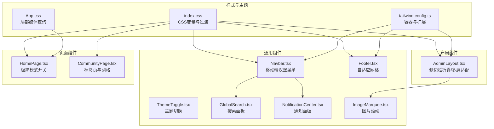
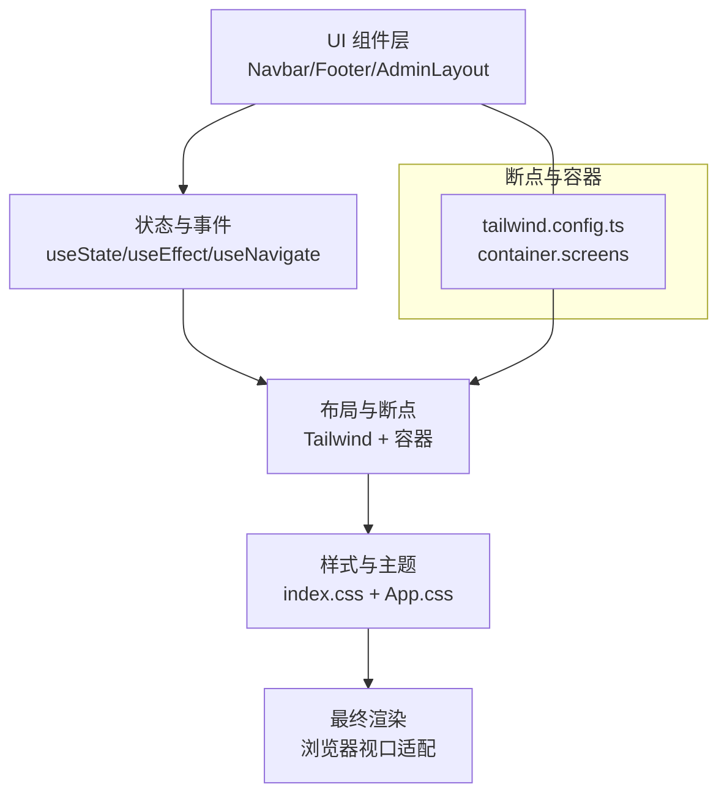
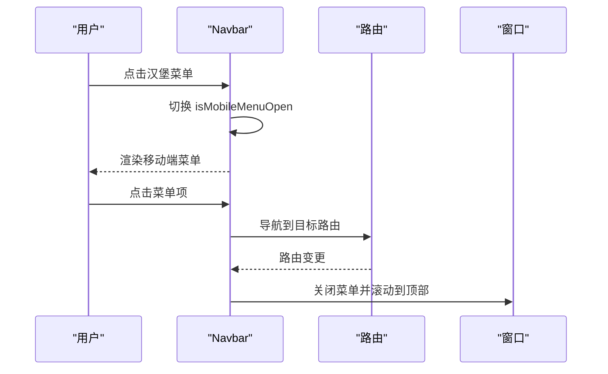
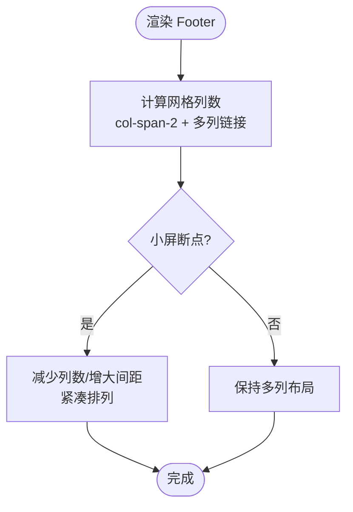
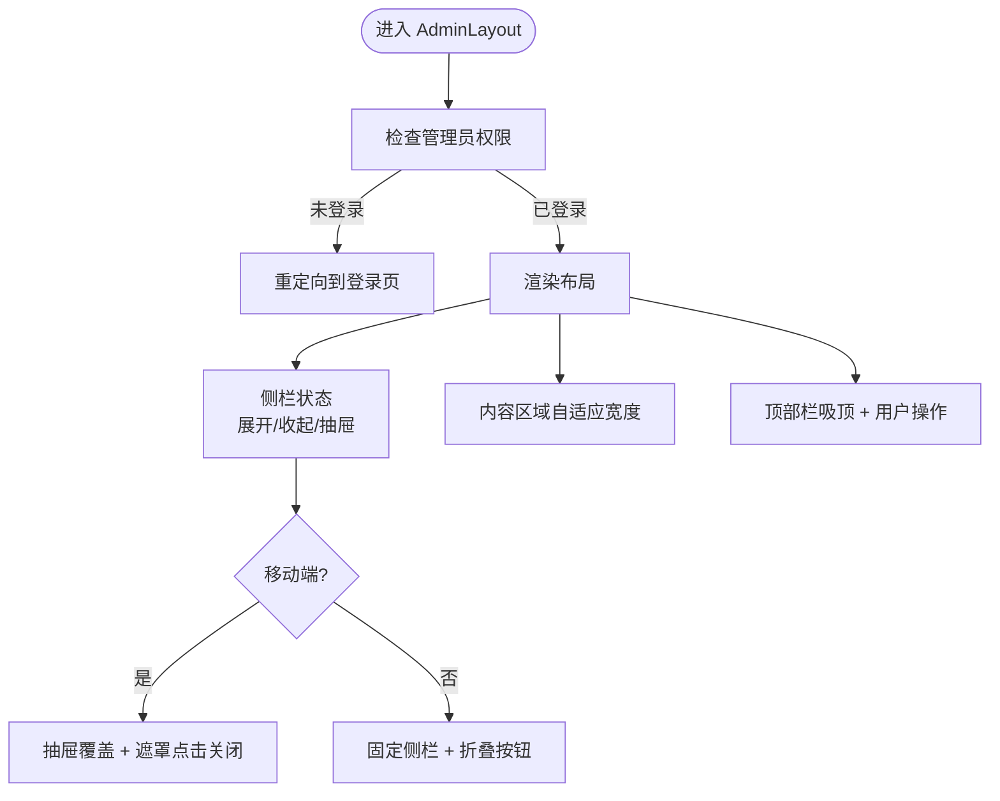
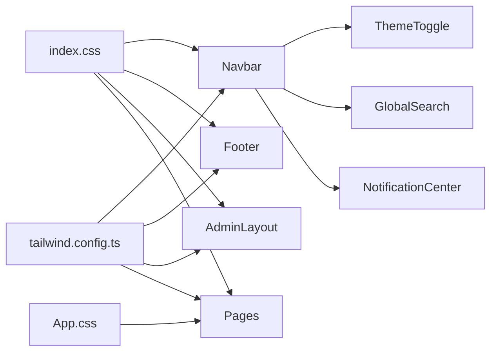

# 响应式设计

<cite>
**本文引用的文件**
- [src/components/Navbar.tsx](file://src/components/Navbar.tsx)
- [src/components/Footer.tsx](file://src/components/Footer.tsx)
- [src/components/AdminLayout.tsx](file://src/components/AdminLayout.tsx)
- [src/components/ThemeToggle.tsx](file://src/components/ThemeToggle.tsx)
- [src/components/GlobalSearch.tsx](file://src/components/GlobalSearch.tsx)
- [src/components/NotificationCenter.tsx](file://src/components/NotificationCenter.tsx)
- [src/components/ImageMarquee.tsx](file://src/components/ImageMarquee.tsx)
- [src/pages/HomePage.tsx](file://src/pages/HomePage.tsx)
- [src/pages/CommunityPage.tsx](file://src/pages/CommunityPage.tsx)
- [src/App.css](file://src/App.css)
- [src/index.css](file://src/index.css)
- [tailwind.config.ts](file://tailwind.config.ts)
</cite>

## 目录
1. [简介](#简介)
2. [项目结构](#项目结构)
3. [核心组件](#核心组件)
4. [架构总览](#架构总览)
5. [详细组件分析](#详细组件分析)
6. [依赖关系分析](#依赖关系分析)
7. [性能考量](#性能考量)
8. [故障排查指南](#故障排查指南)
9. [结论](#结论)
10. [附录](#附录)

## 简介
本文件系统性梳理本项目的响应式设计体系，围绕“移动端优先”的设计理念与断点策略，深入解析导航栏的响应式布局与汉堡菜单实现、页脚组件的自适应网格与内容排列、AdminLayout 的侧边栏折叠机制与多屏适配、以及图片滚动、字体缩放与触摸交互优化。同时总结媒体查询最佳实践、性能影响与调试技巧，并给出跨设备测试策略与用户体验优化建议。

## 项目结构
本项目采用以 Tailwind CSS 为核心的原子化样式方案，结合语义化类名与容器约束，形成移动端优先的栅格与断点体系。全局样式通过 CSS 变量与暗色模式过渡动画统一风格；页面级组件按功能模块拆分，响应式行为主要通过 Tailwind 断点与条件渲染实现。

图表来源
- [src/index.css:1-112](file://src/index.css#L1-L112)
- [src/App.css:1-185](file://src/App.css#L1-L185)
- [tailwind.config.ts:1-79](file://tailwind.config.ts#L1-L79)
- [src/components/Navbar.tsx:1-204](file://src/components/Navbar.tsx#L1-L204)
- [src/components/Footer.tsx:1-95](file://src/components/Footer.tsx#L1-L95)
- [src/components/AdminLayout.tsx:1-178](file://src/components/AdminLayout.tsx#L1-L178)
- [src/components/ThemeToggle.tsx:1-120](file://src/components/ThemeToggle.tsx#L1-L120)
- [src/components/GlobalSearch.tsx:1-216](file://src/components/GlobalSearch.tsx#L1-L216)
- [src/components/NotificationCenter.tsx:1-103](file://src/components/NotificationCenter.tsx#L1-L103)
- [src/components/ImageMarquee.tsx:1-304](file://src/components/ImageMarquee.tsx#L1-L304)
- [src/pages/HomePage.tsx:1-88](file://src/pages/HomePage.tsx#L1-L88)
- [src/pages/CommunityPage.tsx:1-667](file://src/pages/CommunityPage.tsx#L1-L667)

章节来源
- [src/index.css:1-112](file://src/index.css#L1-L112)
- [src/App.css:1-185](file://src/App.css#L1-L185)
- [tailwind.config.ts:1-79](file://tailwind.config.ts#L1-L79)

## 核心组件
- 导航栏（Navbar）
  - 移动端优先：桌面端隐藏的汉堡菜单，点击展开全屏覆盖式菜单；滚动时吸顶并带模糊背景。
  - 条件渲染：根据路由变化自动关闭菜单并回到顶部。
- 页脚（Footer）
  - 自适应网格：品牌区跨列 + 多列链接区，小屏下自动换行与紧凑排布。
- AdminLayout
  - 侧边栏折叠：移动端抽屉式覆盖，桌面端可展开/收起；内容区域自适应宽度。
  - 多屏适配：移动端仅显示菜单按钮，桌面端固定侧栏。
- 主题切换（ThemeToggle）
  - 支持快速循环切换与下拉菜单选择，移动端图标尺寸与间距优化。
- 全局搜索（GlobalSearch）
  - 键盘快捷键（Cmd/Ctrl+K）唤起，支持外部点击关闭，结果列表滚动。
- 通知中心（NotificationCenter）
  - 下拉面板，未读计数气泡，点击外侧关闭。
- 图片滚动（ImageMarquee）
  - CSS 动画实现横向无限滚动，鼠标悬停暂停，移动端更易阅读。

章节来源
- [src/components/Navbar.tsx:1-204](file://src/components/Navbar.tsx#L1-L204)
- [src/components/Footer.tsx:1-95](file://src/components/Footer.tsx#L1-L95)
- [src/components/AdminLayout.tsx:1-178](file://src/components/AdminLayout.tsx#L1-L178)
- [src/components/ThemeToggle.tsx:1-120](file://src/components/ThemeToggle.tsx#L1-L120)
- [src/components/GlobalSearch.tsx:1-216](file://src/components/GlobalSearch.tsx#L1-L216)
- [src/components/NotificationCenter.tsx:1-103](file://src/components/NotificationCenter.tsx#L1-L103)
- [src/components/ImageMarquee.tsx:1-304](file://src/components/ImageMarquee.tsx#L1-L304)

## 架构总览
整体响应式架构以 Tailwind 断点与容器为中心，配合组件内部状态控制移动端交互细节。页面组件负责业务内容与网格布局，通用组件提供一致的交互体验与视觉风格。

图表来源
- [tailwind.config.ts:1-79](file://tailwind.config.ts#L1-L79)
- [src/index.css:1-112](file://src/index.css#L1-L112)
- [src/App.css:1-185](file://src/App.css#L1-L185)

## 详细组件分析

### 导航栏（Navbar）响应式布局与汉堡菜单
- 移动端优先
  - 桌面端使用 `lg:flex` 展示导航与操作按钮；移动端隐藏，通过汉堡菜单按钮切换。
  - 菜单展开为全屏覆盖式抽屉，移动端点击遮罩自动关闭。
- 滚动行为
  - 监听滚动事件，超过阈值时应用吸顶与模糊背景类，提升可读性。
- 路由联动
  - 路由变化时自动关闭菜单并滚动到顶部，避免历史状态残留。
- 无障碍与交互
  - 使用语义化链接与图标，提供标题属性与可访问标签。

图表来源
- [src/components/Navbar.tsx:1-204](file://src/components/Navbar.tsx#L1-L204)

章节来源
- [src/components/Navbar.tsx:1-204](file://src/components/Navbar.tsx#L1-L204)

### 页脚（Footer）自适应网格与内容排列
- 网格系统
  - 使用 `grid grid-cols-2 md:grid-cols-6` 实现品牌区跨两列 + 多列链接区。
  - 小屏时列数减少，内容紧凑排列，避免横向滚动。
- 内容组织
  - 品牌信息 + 社交图标 + 分类链接 + 底部版权信息，层次清晰。
- 响应式断点
  - 在不同断点下调整列数与间距，保证可读性与触达性。

图表来源
- [src/components/Footer.tsx:1-95](file://src/components/Footer.tsx#L1-L95)

章节来源
- [src/components/Footer.tsx:1-95](file://src/components/Footer.tsx#L1-L95)

### AdminLayout 侧边栏折叠机制与多屏适配
- 折叠机制
  - 移动端：抽屉式覆盖，点击遮罩或点击菜单项自动关闭。
  - 桌面端：支持展开/收起，侧栏宽度动态切换，标题与图标按需显示。
- 多屏适配
  - 移动端仅显示菜单按钮；桌面端固定侧栏，内容区域自适应。
- 活跃态与交互
  - 基于路由判断当前活跃菜单项，提供视觉反馈与跳转。
- 顶部栏
  - 包含面包屑式标题与用户操作入口，吸顶设计提升可用性。

图表来源
- [src/components/AdminLayout.tsx:1-178](file://src/components/AdminLayout.tsx#L1-L178)

章节来源
- [src/components/AdminLayout.tsx:1-178](file://src/components/AdminLayout.tsx#L1-L178)

### 主题切换（ThemeToggle）与交互优化
- 快速切换
  - 点击循环切换浅色/深色/系统主题，右键打开下拉菜单精细选择。
- 动画与反馈
  - 切换时的旋转与缩放动画，防止重复触发；下拉菜单带淡入与滑入动画。
- 外部点击关闭
  - 使用 ref 与事件监听，点击外部自动关闭下拉菜单。

章节来源
- [src/components/ThemeToggle.tsx:1-120](file://src/components/ThemeToggle.tsx#L1-L120)

### 全局搜索（GlobalSearch）与键盘/点击交互
- 快捷键
  - Cmd/Ctrl+K 唤起搜索面板，Esc 关闭。
- 外部点击关闭
  - 点击面板外部自动关闭，避免遮挡。
- 结果展示
  - 按类型分类展示，支持点击跳转；空结果提示友好。

章节来源
- [src/components/GlobalSearch.tsx:1-216](file://src/components/GlobalSearch.tsx#L1-L216)

### 通知中心（NotificationCenter）与未读提醒
- 未读计数
  - 圆点徽标显示未读数量，上限显示“99+”。
- 批量已读
  - 提供一键全部标记已读。
- 外部点击关闭与跳转
  - 点击通知项可标记已读并跳转至对应页面。

章节来源
- [src/components/NotificationCenter.tsx:1-103](file://src/components/NotificationCenter.tsx#L1-L103)

### 图片滚动（ImageMarquee）与触摸交互
- 滚动行为
  - CSS 动画实现横向无限滚动，悬停暂停，移动端更易阅读。
- 尺寸与间距
  - 使用 `w-52 h-28` 等固定尺寸，保证在不同断点下的一致观感。

章节来源
- [src/components/ImageMarquee.tsx:1-304](file://src/components/ImageMarquee.tsx#L1-L304)

### 页面级响应式示例
- 首页（HomePage）
  - 极简模式开关：固定悬浮按钮，切换后隐藏部分内容区块，减少信息密度。
- 社区页（CommunityPage）
  - 标签页吸顶：滚动时标签栏固定，提升导航连续性。
  - 网格布局：卡片网格随断点变化列数，保证内容可读性。

章节来源
- [src/pages/HomePage.tsx:1-88](file://src/pages/HomePage.tsx#L1-L88)
- [src/pages/CommunityPage.tsx:1-667](file://src/pages/CommunityPage.tsx#L1-L667)

## 依赖关系分析
- 样式依赖
  - index.css 定义全局 CSS 变量与过渡，确保主题切换与交互的顺滑。
  - App.css 中存在局部媒体查询，用于特定页面的布局微调。
  - tailwind.config.ts 配置容器与扩展，统一断点与圆角、动画等设计令牌。
- 组件依赖
  - Navbar 依赖 ThemeToggle、GlobalSearch、NotificationCenter。
  - AdminLayout 依赖路由与权限钩子，控制侧栏与内容区域。
  - Footer 依赖图标集合，使用 Tailwind 网格实现自适应布局。

图表来源
- [src/index.css:1-112](file://src/index.css#L1-L112)
- [src/App.css:1-185](file://src/App.css#L1-L185)
- [tailwind.config.ts:1-79](file://tailwind.config.ts#L1-L79)
- [src/components/Navbar.tsx:1-204](file://src/components/Navbar.tsx#L1-L204)
- [src/components/Footer.tsx:1-95](file://src/components/Footer.tsx#L1-L95)
- [src/components/AdminLayout.tsx:1-178](file://src/components/AdminLayout.tsx#L1-L178)
- [src/components/ThemeToggle.tsx:1-120](file://src/components/ThemeToggle.tsx#L1-L120)
- [src/components/GlobalSearch.tsx:1-216](file://src/components/GlobalSearch.tsx#L1-L216)
- [src/components/NotificationCenter.tsx:1-103](file://src/components/NotificationCenter.tsx#L1-L103)

章节来源
- [src/index.css:1-112](file://src/index.css#L1-L112)
- [src/App.css:1-185](file://src/App.css#L1-L185)
- [tailwind.config.ts:1-79](file://tailwind.config.ts#L1-L79)

## 性能考量
- 动画与过渡
  - 全局过渡时间统一为 0.3s，减少长距离重绘；滚动吸顶与抽屉切换使用 transform 与 opacity，避免强制同步布局。
- 媒体查询与断点
  - 优先使用 Tailwind 断点，减少自定义媒体查询数量；局部 App.css 媒体查询仅用于特定页面细节。
- 组件渲染
  - Navbar 与 AdminLayout 使用条件渲染与状态控制，避免不必要的 DOM 更新。
- 图片与滚动
  - ImageMarquee 使用 CSS 动画而非 JavaScript 帧动画，降低主线程压力；移动端建议懒加载与尺寸固定，减少重排。

## 故障排查指南
- 搜索面板无法关闭
  - 检查点击外部关闭逻辑是否绑定；确认容器 ref 是否正确传递。
- 通知面板显示异常
  - 确认未读计数计算与本地存储；检查点击外侧关闭事件是否移除。
- AdminLayout 侧栏不响应
  - 检查权限钩子返回值与路由跳转逻辑；确认移动端遮罩点击事件绑定。
- Navbar 菜单不自动关闭
  - 确认路由变化监听是否执行；检查菜单项点击后的关闭逻辑。
- 主题切换无效
  - 检查主题上下文状态更新；确认动画防抖逻辑未阻塞后续切换。

章节来源
- [src/components/GlobalSearch.tsx:1-216](file://src/components/GlobalSearch.tsx#L1-L216)
- [src/components/NotificationCenter.tsx:1-103](file://src/components/NotificationCenter.tsx#L1-L103)
- [src/components/AdminLayout.tsx:1-178](file://src/components/AdminLayout.tsx#L1-L178)
- [src/components/Navbar.tsx:1-204](file://src/components/Navbar.tsx#L1-L204)
- [src/components/ThemeToggle.tsx:1-120](file://src/components/ThemeToggle.tsx#L1-L120)

## 结论
本项目以 Tailwind 断点与容器为核心，结合组件内部状态与事件，实现了移动端优先的响应式体系。Navbar、Footer、AdminLayout、ThemeToggle、GlobalSearch、NotificationCenter 与 ImageMarquee 等组件共同构成一致、流畅且可维护的跨设备体验。通过合理的媒体查询与动画策略，兼顾了性能与交互质量。

## 附录

### 媒体查询最佳实践
- 优先使用语义化断点（sm/md/lg/xl/2xl），避免硬编码像素。
- 局部媒体查询仅用于特定页面细节，避免全局复杂规则。
- 使用容器约束（container.screens）统一最大宽度，减少极端分辨率下的布局灾难。

章节来源
- [tailwind.config.ts:1-79](file://tailwind.config.ts#L1-L79)
- [src/App.css:1-185](file://src/App.css#L1-L185)

### 跨设备测试策略
- 设备与分辨率
  - iPhone SE/Mini、iPhone 12/14、iPad、13/15 英寸笔记本、2K/4K 桌面。
- 交互验证
  - 滚动、点击、悬停、键盘快捷键、触摸手势（如滑动关闭抽屉）。
- 主题与对比度
  - 测试浅色/深色/系统主题在不同光照环境下的可读性。
- 性能监控
  - 使用浏览器性能面板观察主线程占用与重绘次数。

### 用户体验优化建议
- 触摸目标
  - 确保按钮与链接至少 44px 可点击区域，避免过密布局。
- 可访问性
  - 为图标提供标题属性与可读文本；为交互元素提供焦点可见性。
- 一致性
  - 统一断点与间距，避免同一组件在不同页面表现差异过大。
- 渐进增强
  - 在弱网或低性能设备上，优先保证核心内容与交互可用。