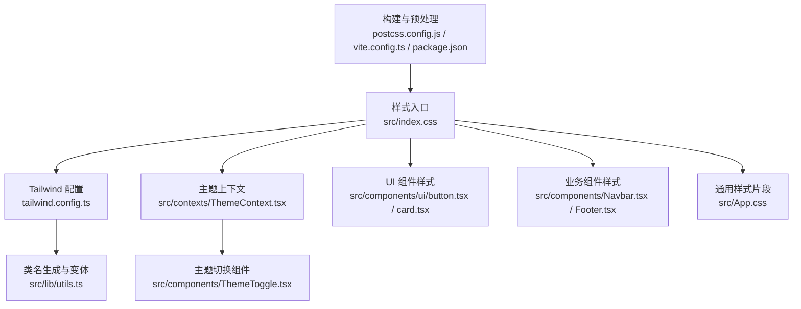
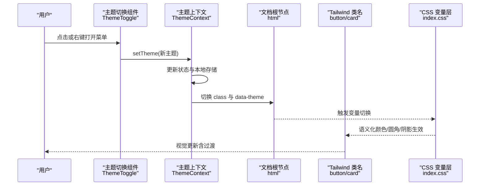
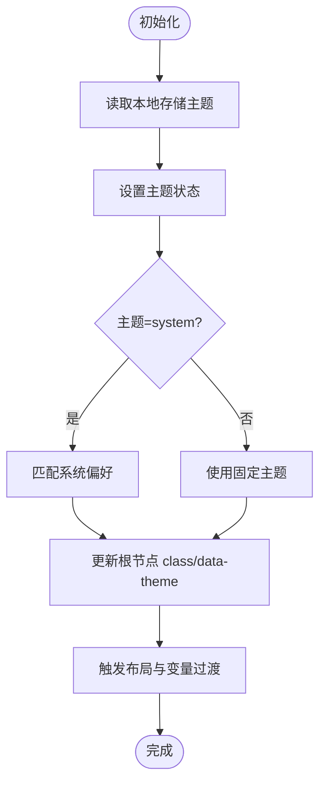
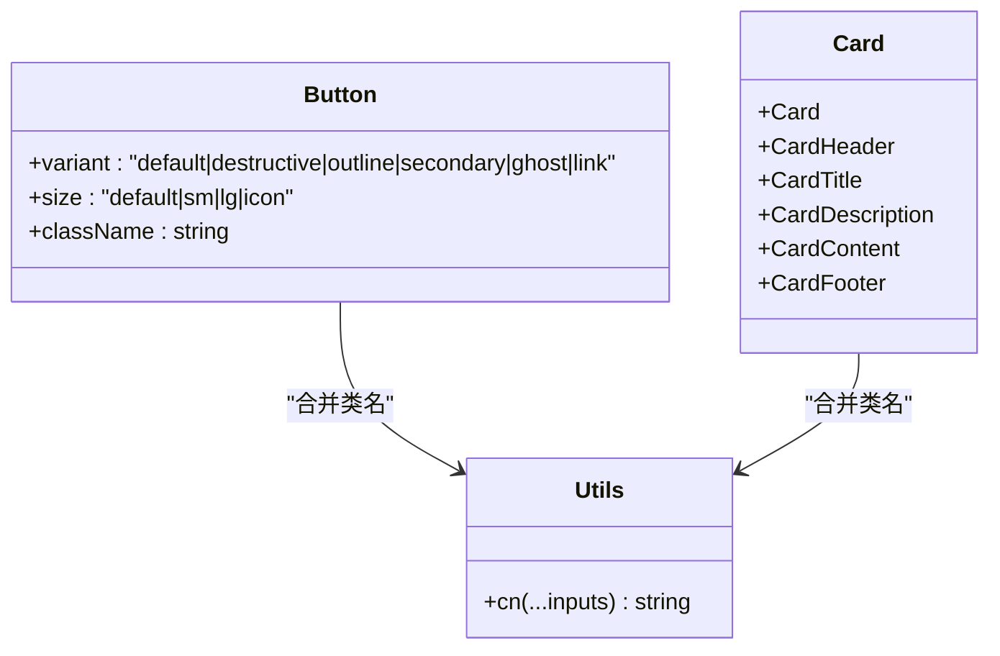
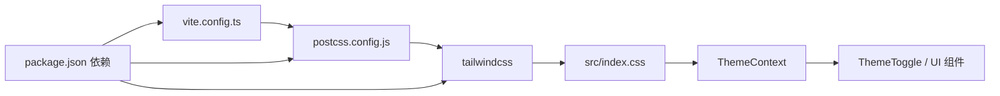

# 样式与主题

<cite>
**本文引用的文件**
- [tailwind.config.ts](file://tailwind.config.ts)
- [postcss.config.js](file://postcss.config.js)
- [package.json](file://package.json)
- [vite.config.ts](file://vite.config.ts)
- [src/index.css](file://src/index.css)
- [src/App.css](file://src/App.css)
- [src/lib/utils.ts](file://src/lib/utils.ts)
- [src/contexts/ThemeContext.tsx](file://src/contexts/ThemeContext.tsx)
- [src/components/ThemeToggle.tsx](file://src/components/ThemeToggle.tsx)
- [src/components/ui/button.tsx](file://src/components/ui/button.tsx)
- [src/components/ui/card.tsx](file://src/components/ui/card.tsx)
- [src/components/Navbar.tsx](file://src/components/Navbar.tsx)
- [src/components/Footer.tsx](file://src/components/Footer.tsx)
- [src/App.tsx](file://src/App.tsx)
</cite>

## 目录
1. [简介](#简介)
2. [项目结构](#项目结构)
3. [核心组件](#核心组件)
4. [架构总览](#架构总览)
5. [详细组件分析](#详细组件分析)
6. [依赖关系分析](#依赖关系分析)
7. [性能考量](#性能考量)
8. [故障排查指南](#故障排查指南)
9. [结论](#结论)
10. [附录](#附录)

## 简介
本文件系统性梳理 YuleTech 社区技术平台的样式与主题体系，围绕 Tailwind CSS 的配置策略、自定义扩展与响应式设计，主题系统的架构与暗色模式支持、主题切换机制进行深入解析；同时说明颜色、字体与间距的统一管理方式，CSS 变量的使用、动画与过渡效果的实现，以及样式定制、组件覆盖与品牌视觉规范。文档还涵盖主题切换的用户体验与无障碍支持、样式性能优化、CSS 打包与 CDN 部署策略，并为开发者提供样式扩展与主题定制的实践指导。

## 项目结构
样式与主题相关的核心文件分布如下：
- 构建与预处理：PostCSS、Vite、PWA 插件
- 样式入口与变量层：全局 CSS 基础层与工具层
- 主题上下文与切换组件：React Context 与主题切换按钮
- 组件样式：通用 UI 组件（按钮、卡片）与业务组件（导航栏、页脚）
- Tailwind 配置：颜色、圆角、动画等扩展

图表来源
- [postcss.config.js:1-7](file://postcss.config.js#L1-L7)
- [vite.config.ts:1-32](file://vite.config.ts#L1-L32)
- [package.json:1-46](file://package.json#L1-L46)
- [src/index.css:1-112](file://src/index.css#L1-L112)
- [tailwind.config.ts:1-79](file://tailwind.config.ts#L1-L79)
- [src/contexts/ThemeContext.tsx:1-127](file://src/contexts/ThemeContext.tsx#L1-L127)
- [src/components/ThemeToggle.tsx:1-120](file://src/components/ThemeToggle.tsx#L1-L120)
- [src/components/ui/button.tsx:1-49](file://src/components/ui/button.tsx#L1-L49)
- [src/components/ui/card.tsx:1-47](file://src/components/ui/card.tsx#L1-L47)
- [src/components/Navbar.tsx:1-204](file://src/components/Navbar.tsx#L1-L204)
- [src/components/Footer.tsx:1-95](file://src/components/Footer.tsx#L1-L95)
- [src/App.css:1-185](file://src/App.css#L1-L185)
- [src/lib/utils.ts:1-7](file://src/lib/utils.ts#L1-L7)

章节来源
- [postcss.config.js:1-7](file://postcss.config.js#L1-L7)
- [vite.config.ts:1-32](file://vite.config.ts#L1-L32)
- [package.json:1-46](file://package.json#L1-L46)
- [src/index.css:1-112](file://src/index.css#L1-L112)
- [tailwind.config.ts:1-79](file://tailwind.config.ts#L1-L79)

## 核心组件
- Tailwind 配置与扩展：启用基于类名的主题切换、容器、圆角变量、动画帧与动画别名，并集成动画插件。
- CSS 变量与主题层：在基础层中定义明/暗两套 HSL 变量，提供渐变、阴影、过渡等自定义 token。
- 主题上下文与切换：提供 light/dark/system 三态主题，持久化存储、系统偏好监听与防闪烁渲染。
- UI 组件样式：通过变体函数与合并工具实现一致的按钮与卡片样式，复用语义化颜色变量。
- 业务组件样式：导航栏与页脚使用主题变量与工具类，确保跨主题一致性与响应式布局。

章节来源
- [tailwind.config.ts:1-79](file://tailwind.config.ts#L1-L79)
- [src/index.css:1-112](file://src/index.css#L1-L112)
- [src/contexts/ThemeContext.tsx:1-127](file://src/contexts/ThemeContext.tsx#L1-L127)
- [src/components/ThemeToggle.tsx:1-120](file://src/components/ThemeToggle.tsx#L1-L120)
- [src/components/ui/button.tsx:1-49](file://src/components/ui/button.tsx#L1-L49)
- [src/components/ui/card.tsx:1-47](file://src/components/ui/card.tsx#L1-L47)
- [src/components/Navbar.tsx:1-204](file://src/components/Navbar.tsx#L1-L204)
- [src/components/Footer.tsx:1-95](file://src/components/Footer.tsx#L1-L95)

## 架构总览
下图展示从构建到运行时的主题切换与样式应用路径：

图表来源
- [src/components/ThemeToggle.tsx:1-120](file://src/components/ThemeToggle.tsx#L1-L120)
- [src/contexts/ThemeContext.tsx:1-127](file://src/contexts/ThemeContext.tsx#L1-L127)
- [src/index.css:1-112](file://src/index.css#L1-L112)
- [src/components/ui/button.tsx:1-49](file://src/components/ui/button.tsx#L1-L49)
- [src/components/ui/card.tsx:1-47](file://src/components/ui/card.tsx#L1-L47)

## 详细组件分析

### Tailwind 配置与扩展
- 模式控制：通过类名模式启用暗色模式，配合 CSS 变量与工具类实现主题切换。
- 内容扫描：包含 HTML 与 TSX 范围，确保按需生成类名。
- 主题扩展：
  - 颜色：映射至 CSS 变量，支持 primary/secondary/muted/accent 等语义层级。
  - 圆角：使用 CSS 变量统一管理容器圆角与派生值。
  - 动画：定义手风琴展开/收起的 keyframes 与动画别名，结合动画插件。
- 插件：tailwindcss-animate 提供更丰富的内置动画。

章节来源
- [tailwind.config.ts:1-79](file://tailwind.config.ts#L1-L79)

### CSS 变量与主题层
- 基础层（base）：
  - 定义明/暗两套 HSL 变量，覆盖背景、前景、卡片、弹出层、输入框、环形光晕等。
  - 自定义 token：主/辅渐变、优雅阴影、发光阴影、平滑过渡。
- 工具层（utilities）：
  - 文本渐变、背景渐变、阴影工具类，便于快速应用品牌视觉。
- 全局过渡：
  - 对 html 及其伪元素设置统一过渡属性，保证主题切换时的顺滑体验。

章节来源
- [src/index.css:1-112](file://src/index.css#L1-L112)

### 主题上下文与切换机制
- 主题状态：
  - 支持 light/dark/system 三种状态，默认 system。
  - 使用 localStorage 持久化，避免每次刷新重置。
- 运行时行为：
  - 初始化读取存储；渲染前防止闪烁；根据系统偏好动态更新。
  - 切换时更新 documentElement 的 class 与 data-theme 属性，驱动 CSS 变量生效。
- 切换组件：
  - 快速切换：循环 light → dark → system。
  - 下拉菜单：右键唤起，支持选中态高亮与图标反馈。
  - 动画：旋转与缩放反馈，配合过渡时长与缓动曲线。

图表来源
- [src/contexts/ThemeContext.tsx:1-127](file://src/contexts/ThemeContext.tsx#L1-L127)
- [src/components/ThemeToggle.tsx:1-120](file://src/components/ThemeToggle.tsx#L1-L120)
- [src/index.css:1-112](file://src/index.css#L1-L112)

章节来源
- [src/contexts/ThemeContext.tsx:1-127](file://src/contexts/ThemeContext.tsx#L1-L127)
- [src/components/ThemeToggle.tsx:1-120](file://src/components/ThemeToggle.tsx#L1-L120)

### UI 组件样式（按钮与卡片）
- 按钮：
  - 使用变体函数定义不同 variant 与 size，自动组合 hover/focus/disabled 状态。
  - 复用语义化颜色变量，确保与主题一致。
- 卡片：
  - 统一圆角、边框与阴影，内容区与头部区排版分离，便于扩展。

图表来源
- [src/components/ui/button.tsx:1-49](file://src/components/ui/button.tsx#L1-L49)
- [src/components/ui/card.tsx:1-47](file://src/components/ui/card.tsx#L1-L47)
- [src/lib/utils.ts:1-7](file://src/lib/utils.ts#L1-L7)

章节来源
- [src/components/ui/button.tsx:1-49](file://src/components/ui/button.tsx#L1-L49)
- [src/components/ui/card.tsx:1-47](file://src/components/ui/card.tsx#L1-L47)
- [src/lib/utils.ts:1-7](file://src/lib/utils.ts#L1-L7)

### 业务组件样式（导航栏与页脚）
- 导航栏：
  - 滚动时添加模糊背景与阴影，提升可读性。
  - 使用渐变色徽标与文本渐变强调品牌。
  - 移动端折叠菜单与主题切换入口。
- 页脚：
  - 采用网格布局分组链接，品牌区使用渐变色徽标与社交图标。

章节来源
- [src/components/Navbar.tsx:1-204](file://src/components/Navbar.tsx#L1-L204)
- [src/components/Footer.tsx:1-95](file://src/components/Footer.tsx#L1-L95)

### 通用样式片段与响应式
- 通用样式片段（App.css）：
  - 使用 CSS 变量统一边框、背景、阴影等，便于主题切换。
  - 在不同断点下调整布局与间距，适配移动端。
- 响应式设计：
  - 导航栏与页脚均采用断点策略，移动端优先与自适应布局。

章节来源
- [src/App.css:1-185](file://src/App.css#L1-L185)
- [src/components/Navbar.tsx:1-204](file://src/components/Navbar.tsx#L1-L204)
- [src/components/Footer.tsx:1-95](file://src/components/Footer.tsx#L1-L95)

## 依赖关系分析
- 构建链路：
  - PostCSS 与 Autoprefixer 在构建阶段处理 Tailwind 输出。
  - Vite 负责开发服务器、打包与 PWA 缓存策略。
  - Tailwind 生成类名，CSS 变量驱动主题切换。
- 运行时链路：
  - 主题上下文负责状态管理与 DOM 属性更新。
  - 组件通过语义化类名与工具类消费主题变量。

图表来源
- [postcss.config.js:1-7](file://postcss.config.js#L1-L7)
- [vite.config.ts:1-32](file://vite.config.ts#L1-L32)
- [package.json:1-46](file://package.json#L1-L46)
- [src/index.css:1-112](file://src/index.css#L1-L112)
- [src/contexts/ThemeContext.tsx:1-127](file://src/contexts/ThemeContext.tsx#L1-L127)
- [src/components/ThemeToggle.tsx:1-120](file://src/components/ThemeToggle.tsx#L1-L120)

章节来源
- [postcss.config.js:1-7](file://postcss.config.js#L1-L7)
- [vite.config.ts:1-32](file://vite.config.ts#L1-L32)
- [package.json:1-46](file://package.json#L1-L46)
- [src/index.css:1-112](file://src/index.css#L1-L112)

## 性能考量
- CSS 体积与按需生成：
  - Tailwind 内容扫描范围明确，避免生成未使用类名。
  - 使用工具类减少自定义 CSS 数量，降低维护成本。
- 主题切换性能：
  - CSS 变量与过渡统一在基础层声明，切换时仅变更变量与 class，避免重排与重绘抖动。
- 打包与缓存：
  - Vite PWA 配置开启自动更新与缓存策略，对静态资源与字体进行缓存优化。
  - 增大最大文件尺寸阈值以容纳较大资源。
- 字体与网络：
  - 配置 Google Fonts 缓存策略，减少首屏加载时间。

章节来源
- [tailwind.config.ts:1-79](file://tailwind.config.ts#L1-L79)
- [src/index.css:1-112](file://src/index.css#L1-L112)
- [vite.config.ts:1-32](file://vite.config.ts#L1-L32)

## 故障排查指南
- 主题不生效或闪烁：
  - 检查根节点 class 与 data-theme 是否正确更新。
  - 确认本地存储键值存在且可写。
- 切换后样式异常：
  - 核对 CSS 变量是否完整覆盖目标层级。
  - 检查工具层类名是否与主题变量一致。
- 动画与过渡不流畅：
  - 确认基础层过渡声明未被局部样式覆盖。
  - 避免在高频渲染场景中强制同步布局读取。
- PWA 缓存问题：
  - 清理浏览器缓存或禁用缓存调试，确认资源更新。
  - 检查缓存命中与最大文件大小阈值。

章节来源
- [src/contexts/ThemeContext.tsx:1-127](file://src/contexts/ThemeContext.tsx#L1-L127)
- [src/index.css:1-112](file://src/index.css#L1-L112)
- [vite.config.ts:1-32](file://vite.config.ts#L1-L32)

## 结论
本项目通过 Tailwind CSS 与 CSS 变量的协同，实现了以语义化颜色为核心的主题系统，结合 React Context 与本地存储，提供了稳定、可访问且高性能的主题切换体验。组件层采用变体函数与工具类，确保风格一致与易于扩展。整体架构兼顾开发效率与运行性能，适合在多端与多主题场景下持续演进。

## 附录

### 样式定制与主题扩展指南
- 颜色系统
  - 新增语义色阶：在基础层新增变量，映射到 Tailwind 主题扩展，保持命名一致性。
  - 使用工具类快速应用：如文本渐变、背景渐变与阴影工具类。
- 字体系统
  - 在基础层声明字体特性与字形设置，确保跨主题一致。
- 间距系统
  - 使用 Tailwind 内置 spacing 与容器 padding，配合 CSS 变量统一圆角。
- 动画与过渡
  - 通过 Tailwind 动画别名与基础层过渡声明，统一交互反馈节奏。
- 组件覆盖
  - 优先使用变体函数与工具类；必要时在组件层局部覆盖，避免破坏全局一致性。
- 品牌视觉规范
  - 徽标、渐变与阴影作为品牌资产，集中定义在工具层，确保复用与一致性。

章节来源
- [src/index.css:1-112](file://src/index.css#L1-L112)
- [tailwind.config.ts:1-79](file://tailwind.config.ts#L1-L79)
- [src/components/ui/button.tsx:1-49](file://src/components/ui/button.tsx#L1-L49)
- [src/components/ui/card.tsx:1-47](file://src/components/ui/card.tsx#L1-L47)

### 用户体验与无障碍支持
- 主题切换
  - 提供快速切换与下拉菜单两种方式，满足不同操作习惯。
  - 使用 aria-label 与 sr-only 文本增强可访问性。
- 系统偏好
  - 默认跟随系统偏好，尊重用户设置。
- 无障碍建议
  - 为按钮与菜单提供键盘可达性与焦点可见性。
  - 保持对比度与可读性，避免纯色高亮造成视觉负担。

章节来源
- [src/components/ThemeToggle.tsx:1-120](file://src/components/ThemeToggle.tsx#L1-L120)
- [src/contexts/ThemeContext.tsx:1-127](file://src/contexts/ThemeContext.tsx#L1-L127)

### 样式性能优化与部署策略
- 构建优化
  - 使用 PostCSS 与 Autoprefixer，确保兼容性与最小化输出。
  - Tailwind 按需生成，减少未使用类名。
- 运行优化
  - CSS 变量与过渡集中在基础层，避免重复计算。
  - 组件层尽量使用语义化类名，减少内联样式。
- 部署策略
  - Vite PWA 自动更新与缓存策略，提升离线与弱网体验。
  - 字体资源缓存与最大文件阈值配置，平衡加载速度与资源体积。

章节来源
- [postcss.config.js:1-7](file://postcss.config.js#L1-L7)
- [vite.config.ts:1-32](file://vite.config.ts#L1-L32)
- [package.json:1-46](file://package.json#L1-L46)