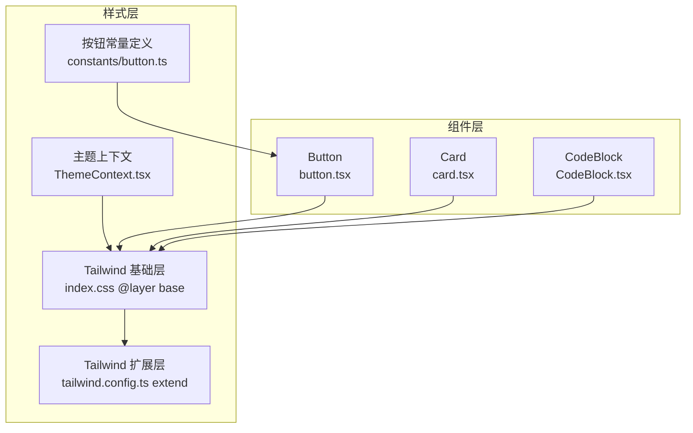
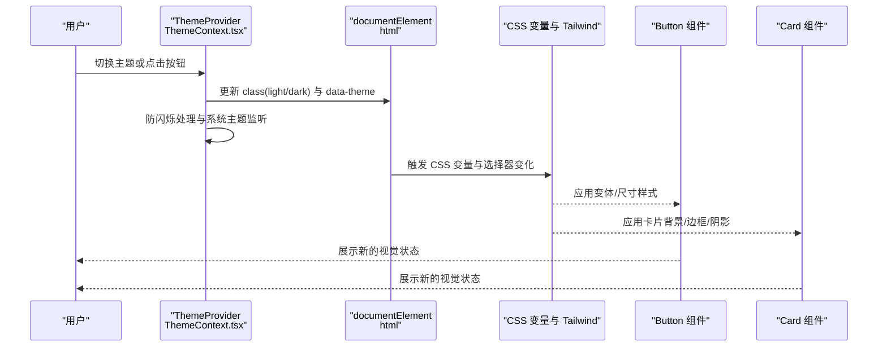
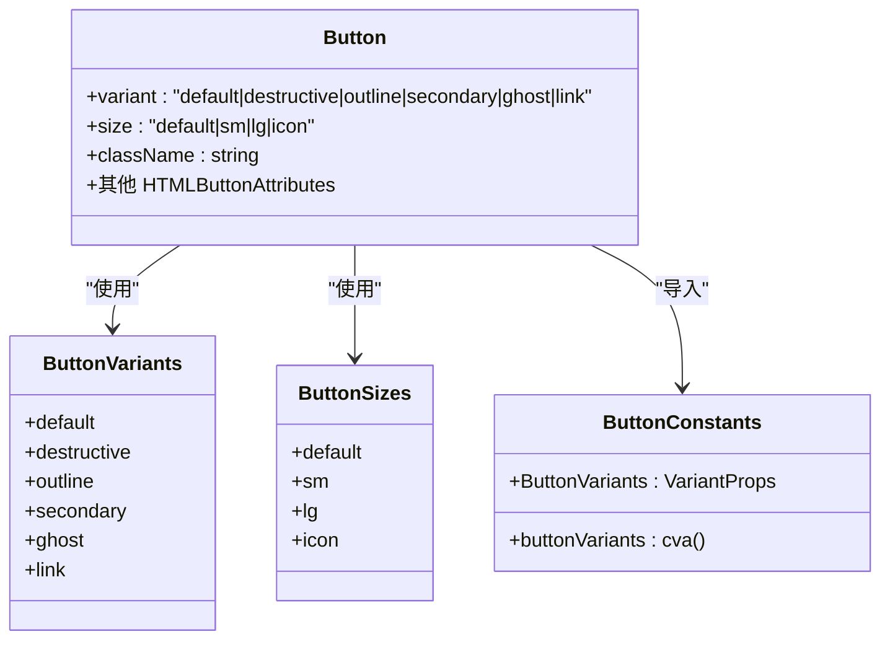
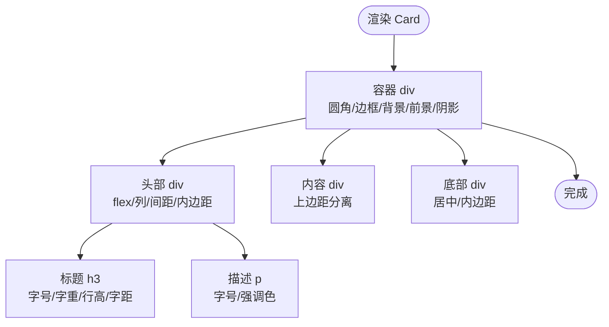
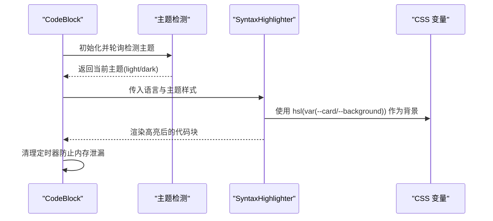
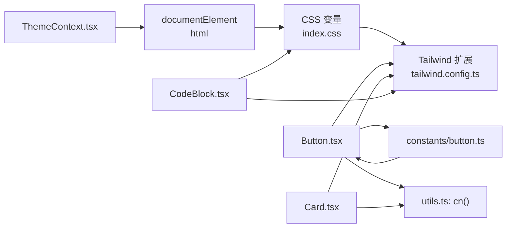

# 组件样式

<cite>
**本文引用的文件**
- [button.ts](file://src/constants/button.ts)
- [button.tsx](file://src/components/ui/button.tsx)
- [card.tsx](file://src/components/ui/card.tsx)
- [CodeBlock.tsx](file://src/components/CodeBlock.tsx)
- [ThemeContext.tsx](file://src/contexts/ThemeContext.tsx)
- [tailwind.config.ts](file://tailwind.config.ts)
- [index.css](file://src/index.css)
- [utils.ts](file://src/lib/utils.ts)
- [package.json](file://package.json)
</cite>

## 更新摘要
**所做更改**
- 新增按钮常量定义模块化重构
- 主题切换系统优化与防闪烁机制
- 自定义设计令牌与渐变效果增强
- 阴影效果与主题过渡动画改进
- 代码高亮主题检测优化

## 目录
1. [简介](#简介)
2. [项目结构](#项目结构)
3. [核心组件](#核心组件)
4. [架构总览](#架构总览)
5. [详细组件分析](#详细组件分析)
6. [依赖关系分析](#依赖关系分析)
7. [性能考量](#性能考量)
8. [故障排查指南](#故障排查指南)
9. [结论](#结论)
10. [附录](#附录)

## 简介
本文件聚焦于组件样式的体系化说明，覆盖设计系统与样式规范、Button 变体与尺寸、Card 层级与阴影、CodeBlock 语法高亮与复制能力、样式继承与 CSS-in-JS 方案、主题定制与品牌化、可访问性设计、样式性能与打包策略以及 CDN 部署建议，并给出组件开发者扩展指南与最佳实践。

**更新** 本版本反映了按钮常量定义的模块化重构、主题切换系统的优化以及整体样式系统的增强改进。

## 项目结构
本项目采用以"原子化样式 + 设计令牌 + 主题上下文"的方式组织样式层：
- Tailwind CSS 提供原子类与设计令牌映射
- CSS 变量定义在基础层，通过 Tailwind 扩展映射到 hsl(var(--token)) 形式
- 主题上下文负责在运行时切换 light/dark/system 并更新根元素 class 与 data-theme
- 组件层通过 cn 合并类名，结合 class-variance-authority 实现变体与尺寸组合

**图表来源**
- [index.css:1-112](file://src/index.css#L1-L112)
- [tailwind.config.ts:1-79](file://tailwind.config.ts#L1-L79)
- [ThemeContext.tsx:1-127](file://src/contexts/ThemeContext.tsx#L1-L127)
- [button.ts:1-34](file://src/constants/button.ts#L1-34)
- [button.tsx:1-49](file://src/components/ui/button.tsx#L1-L49)
- [card.tsx:1-47](file://src/components/ui/card.tsx#L1-L47)
- [CodeBlock.tsx:1-49](file://src/components/CodeBlock.tsx#L1-L49)

**章节来源**
- [index.css:1-112](file://src/index.css#L1-L112)
- [tailwind.config.ts:1-79](file://tailwind.config.ts#L1-L79)
- [ThemeContext.tsx:1-127](file://src/contexts/ThemeContext.tsx#L1-L127)

## 核心组件
本节对三大组件的样式系统进行深入解析：Button 的变体与尺寸、Card 的层级与阴影、CodeBlock 的语法高亮与主题适配。

**更新** 按钮组件现在采用模块化的常量定义，提高了代码的可维护性和复用性。

- Button 组件
  - 使用 class-variance-authority 定义变体与尺寸组合，通过 cn 合并类名
  - 支持默认、破坏性、描边、次级、幽灵、链接等变体；默认、小、大、图标等尺寸
  - 通过 Tailwind 原子类实现交互态（聚焦环、悬停背景、禁用透明度）与圆角、内边距等
  - **新增** 模块化常量定义，提高代码组织性和可维护性

- Card 组件
  - 由容器、头部、标题、描述、内容、底部组成，均使用 Tailwind 原子类
  - 通过设计令牌映射到 hsl(var(--card)) 等，确保在浅色/深色主题下保持一致语义

- CodeBlock 组件
  - 基于 react-syntax-highlighter 的 Prism 主题，自动跟随主题切换
  - 使用 CSS 变量控制背景色，适配卡片/背景色；顶部显示语言标签
  - **优化** 主题检测机制，减少不必要的轮询和内存泄漏风险

**章节来源**
- [button.ts:1-34](file://src/constants/button.ts#L1-34)
- [button.tsx:1-49](file://src/components/ui/button.tsx#L1-L49)
- [card.tsx:1-47](file://src/components/ui/card.tsx#L1-L47)
- [CodeBlock.tsx:1-49](file://src/components/CodeBlock.tsx#L1-L49)
- [utils.ts:1-7](file://src/lib/utils.ts#L1-L7)

## 架构总览
组件样式整体遵循"设计令牌 → Tailwind → 组件"的分层架构。主题上下文在运行时决定 resolvedTheme，并通过根元素 class 与 data-theme 控制 CSS 变量与暗色模式开关，最终驱动所有组件的视觉表现。

**更新** 主题切换系统现在包含防闪烁机制和系统主题监听功能，提供更流畅的用户体验。

**图表来源**
- [ThemeContext.tsx:41-124](file://src/contexts/ThemeContext.tsx#L41-L124)
- [index.css:39-87](file://src/index.css#L39-L87)
- [tailwind.config.ts:18-53](file://tailwind.config.ts#L18-L53)
- [button.ts:4-31](file://src/constants/button.ts#L4-31)

## 详细组件分析

### Button 组件：变体系统、尺寸规格与状态管理
**更新** 按钮组件现在采用模块化的常量定义，提高了代码的可维护性和复用性。

- 变体系统
  - 默认、破坏性、描边、次级、幽灵、链接六种变体，分别映射到主色、破坏色、背景色与边框、次色与前景色、悬停强调色、文本强调色
  - 通过 class-variance-authority 在编译期生成类名组合，避免运行时拼接
  - **新增** 从组件文件中提取到独立的常量文件，便于全局复用
- 尺寸规格
  - 默认、小、大、图标四种尺寸，统一控制高度、圆角与内边距
- 状态管理
  - 聚焦态：ring-ring 聚焦环、offset 边距
  - 悬停态：各变体对应 hover 背景色
  - 禁用态：禁用事件与透明度
- 类名合并
  - 使用 cn 合并默认基类与变体/尺寸生成的类，保证可读性与可维护性

**图表来源**
- [button.tsx:31-48](file://src/components/ui/button.tsx#L31-L48)
- [button.ts:4-31](file://src/constants/button.ts#L4-31)

**章节来源**
- [button.ts:1-34](file://src/constants/button.ts#L1-34)
- [button.tsx:1-49](file://src/components/ui/button.tsx#L1-L49)
- [utils.ts:1-7](file://src/lib/utils.ts#L1-L7)

### Card 组件：层级结构、阴影效果与内容布局
- 层级结构
  - 卡片容器：圆角、边框、背景、前景色、阴影
  - 头部：垂直间距、内边距
  - 标题：字号、字重、行高、字距
  - 描述：字号、强调色
  - 内容区：上边距分离
  - 底部：水平居中、内边距
- 阴影与边框
  - 通过 Tailwind 原子类与设计令牌映射，确保在不同主题下阴影与边框一致
- 布局与间距
  - 使用 flex 与 space-y 管理子元素间距，统一内边距策略

**图表来源**
- [card.tsx:4-46](file://src/components/ui/card.tsx#L4-L46)

**章节来源**
- [card.tsx:1-47](file://src/components/ui/card.tsx#L1-L47)

### CodeBlock 组件：语法高亮、代码美化与主题适配
**更新** 代码高亮组件的主题检测机制得到优化，减少了内存泄漏风险。

- 语法高亮
  - 使用 react-syntax-highlighter 的 Prism 主题，支持多语言
- 主题适配
  - 自动检测当前主题（light/dark），切换 oneLight/oneDark 主题
  - 背景色根据卡片/背景色变量动态设置，确保与容器风格一致
- 顶部栏
  - 显示语言名称，使用强调色与紧凑排版
- 性能注意
  - **优化** 使用 useEffect 清理定时器，避免内存泄漏
  - 当前实现通过定时轮询检测主题变化；更优做法是监听系统主题变化事件并在上下文中集中处理

**图表来源**
- [CodeBlock.tsx:14-26](file://src/components/CodeBlock.tsx#L14-L26)
- [CodeBlock.tsx:33-45](file://src/components/CodeBlock.tsx#L33-L45)
- [index.css:39-59](file://src/index.css#L39-L59)

**章节来源**
- [CodeBlock.tsx:1-49](file://src/components/CodeBlock.tsx#L1-L49)

## 依赖关系分析
**更新** 依赖关系现在包括模块化的按钮常量定义和优化的主题切换系统。

- 组件与样式层
  - Button/Card 依赖 Tailwind 原子类与设计令牌映射
  - CodeBlock 依赖 CSS 变量与 react-syntax-highlighter
  - **新增** Button 组件现在依赖模块化的按钮常量定义
- 主题上下文
  - ThemeProvider 在应用启动时注入根元素 class 与 data-theme，影响所有组件
  - **优化** 包含防闪烁机制和系统主题监听
- 工具函数
  - cn 用于合并类名，避免冲突与冗余

**图表来源**
- [ThemeContext.tsx:41-124](file://src/contexts/ThemeContext.tsx#L41-L124)
- [index.css:39-59](file://src/index.css#L39-L59)
- [tailwind.config.ts:18-53](file://tailwind.config.ts#L18-L53)
- [utils.ts:4-6](file://src/lib/utils.ts#L4-L6)
- [button.ts:1-34](file://src/constants/button.ts#L1-34)
- [button.tsx:3-3](file://src/components/ui/button.tsx#L3-L3)
- [card.tsx:2-2](file://src/components/ui/card.tsx#L2-L2)
- [CodeBlock.tsx:2-3](file://src/components/CodeBlock.tsx#L2-L3)

**章节来源**
- [ThemeContext.tsx:1-127](file://src/contexts/ThemeContext.tsx#L1-L127)
- [utils.ts:1-7](file://src/lib/utils.ts#L1-L7)
- [package.json:12-26](file://package.json#L12-L26)

## 性能考量
**更新** 性能考量现在包括模块化常量定义的性能优势和主题切换优化的性能收益。

- CSS-in-JS 与原子化样式
  - 本项目主要采用 Tailwind 原子类，避免了 CSS-in-JS 的运行时开销，有利于首屏渲染与 SSR 场景
- 主题切换
  - 通过根元素 class 与 CSS 变量切换，避免重绘与布局抖动
  - **优化** 防闪烁机制确保主题切换时的视觉连续性
- 代码高亮
  - react-syntax-highlighter 体积较大，建议按需加载或在路由懒加载场景下延迟引入
  - **优化** 清理定时器避免内存泄漏
- 模块化常量定义
  - **新增** 按钮常量定义模块化减少了代码重复，提高了构建效率
- 打包与缓存
  - Tailwind 产物包含大量原子类，建议启用 Purge/Tree-shaking 与长缓存策略
  - PWA 插件可用于离线体验与静态资源缓存

**章节来源**
- [package.json:25-25](file://package.json#L25-L25)
- [index.css:1-3](file://src/index.css#L1-L3)
- [tailwind.config.ts:4-8](file://tailwind.config.ts#L4-L8)
- [ThemeContext.tsx:95-109](file://src/contexts/ThemeContext.tsx#L95-L109)

## 故障排查指南
**更新** 故障排查指南现在包括模块化常量定义和主题切换优化相关的故障排除。

- 暗色模式不生效
  - 检查 ThemeProvider 是否包裹应用根节点，确认根元素 class 与 data-theme 是否正确更新
  - 确认 CSS 变量在 :root 与 .dark 中均已定义
  - **新增** 检查防闪烁机制是否正常工作
- Button/Card 样式错乱
  - 检查是否正确使用 cn 合并类名，避免重复或冲突的 Tailwind 类
  - 确认 Tailwind 配置的 content 路径包含组件所在目录
  - **新增** 检查按钮常量定义文件是否正确导入
- CodeBlock 语言高亮异常
  - 确认传入的语言标识是否受 react-syntax-highlighter 支持
  - 检查主题切换逻辑，必要时改为监听系统主题变化事件
  - **优化** 检查定时器清理是否正常执行
- 模块化常量定义问题
  - **新增** 确认 constants/button.ts 文件路径正确
  - 检查按钮变体定义是否与组件文件保持同步

**章节来源**
- [ThemeContext.tsx:41-124](file://src/contexts/ThemeContext.tsx#L41-L124)
- [index.css:39-59](file://src/index.css#L39-L59)
- [tailwind.config.ts:5-8](file://tailwind.config.ts#L5-L8)
- [utils.ts:4-6](file://src/lib/utils.ts#L4-L6)
- [CodeBlock.tsx:14-26](file://src/components/CodeBlock.tsx#L14-L26)
- [button.ts:1-34](file://src/constants/button.ts#L1-34)

## 结论
**更新** 结论部分反映了最新的样式系统改进和优化成果。

本项目的样式体系以设计令牌为核心，借助 Tailwind 原子类与 class-variance-authority 实现组件变体与尺寸的可组合性；通过 ThemeContext 提供主题切换与品牌化支持；在性能方面，采用原子化样式与 CSS 变量，兼顾首屏与可维护性。

**最新改进包括：**
- 按钮常量定义模块化重构，提高了代码组织性和复用性
- 主题切换系统优化，包含防闪烁机制和系统主题监听
- 自定义设计令牌、渐变效果和阴影效果的增强
- 代码高亮主题检测的性能优化

建议后续在 CodeBlock 主题检测与高亮库按需加载方面进一步优化，并完善主题切换的事件监听与缓存策略。

## 附录

### 样式继承机制与 CSS-in-JS 方案
- 继承机制
  - 通过 CSS 变量与 Tailwind 扩展映射，组件仅消费语义化 token，不直接写死颜色值
- CSS-in-JS 方案
  - 本项目未采用 CSS-in-JS，推荐在需要动态样式或主题深度定制时，结合 styled-components 或 Emotion 使用主题上下文

**章节来源**
- [index.css:18-53](file://src/index.css#L18-L53)
- [tailwind.config.ts:18-53](file://tailwind.config.ts#L18-L53)

### 样式隔离策略
- 作用域隔离
  - Tailwind 原子类具备全局作用域，但通过命名空间与前缀策略可减少冲突
- 组件边界
  - 使用 forwardRef 与 className 合并，确保外部传入的样式优先级可控

**章节来源**
- [button.tsx:35-46](file://src/components/ui/button.tsx#L35-L46)
- [card.tsx:4-46](file://src/components/ui/card.tsx#L4-L46)

### 主题定制与品牌化
**更新** 主题定制现在包括自定义设计令牌和渐变效果。

- 设计令牌
  - 在 :root 与 .dark 中统一定义主色、强调色、背景、卡片等 token
  - **新增** 自定义令牌如 `--primary-glow`、`--accent-glow`、`--gradient-primary` 等
- 品牌化
  - 可通过自定义渐变、阴影、半径等 token 实现品牌一致性
  - **新增** 提供优雅阴影和发光效果的自定义令牌

**章节来源**
- [index.css:6-37](file://src/index.css#L6-L37)
- [index.css:39-59](file://src/index.css#L39-L59)
- [index.css:89-111](file://src/index.css#L89-L111)

### 可访问性设计
- 对比度与焦点可见性
  - 使用强调色与聚焦环确保键盘可达性
- 文本与对比度
  - 通过强调色与前景色 token 保障文本可读性

**章节来源**
- [button.tsx:6-6](file://src/components/ui/button.tsx#L6-L6)
- [index.css:66-69](file://src/index.css#L66-L69)

### 样式性能优化与打包策略
**更新** 性能优化现在包括模块化常量定义的性能收益。

- 原子类裁剪
  - Tailwind content 覆盖所有组件路径，确保未使用的类被移除
- 模块化常量定义
  - **新增** 减少代码重复，提高构建效率和运行时性能
- 缓存与 CDN
  - 构建后静态资源可配合 CDN 缓存与版本号策略提升加载速度
- 主题过渡动画
  - **新增** 平滑的颜色变化过渡效果，提升用户体验

**章节来源**
- [tailwind.config.ts:5-8](file://tailwind.config.ts#L5-L8)
- [package.json:8-8](file://package.json#L8-L8)
- [index.css:75-87](file://src/index.css#L75-L87)

### 组件开发者扩展指南与最佳实践
**更新** 最佳实践现在包括模块化常量定义和主题切换优化的指导。

- 新增组件样式
  - 优先使用现有变体/尺寸组合，避免新增同类变体
  - 使用 cn 合并类名，确保外部传入样式可叠加
  - **新增** 考虑将通用的样式常量提取到 constants 目录
- 主题适配
  - 一律使用设计令牌，避免硬编码颜色值
  - **新增** 利用防闪烁机制确保主题切换的平滑体验
- 性能建议
  - 避免在渲染路径中进行复杂计算，尽量使用预设类名
  - 对高开销组件（如 CodeBlock）采用懒加载与按需引入
  - **新增** 使用模块化常量定义减少重复代码和构建体积

**章节来源**
- [utils.ts:4-6](file://src/lib/utils.ts#L4-L6)
- [button.tsx:35-46](file://src/components/ui/button.tsx#L35-L46)
- [card.tsx:4-46](file://src/components/ui/card.tsx#L4-L46)
- [CodeBlock.tsx:14-26](file://src/components/CodeBlock.tsx#L14-L26)
- [ThemeContext.tsx:95-109](file://src/contexts/ThemeContext.tsx#L95-L109)