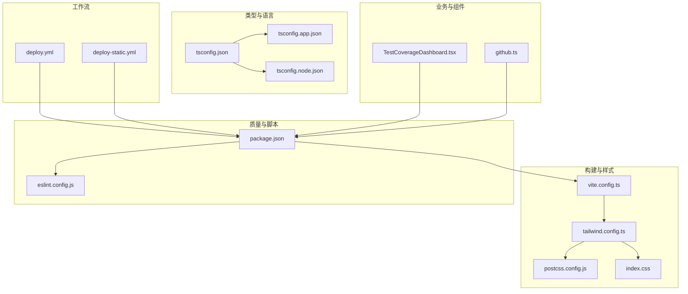
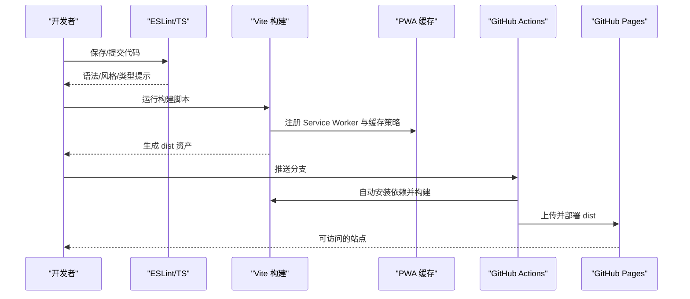
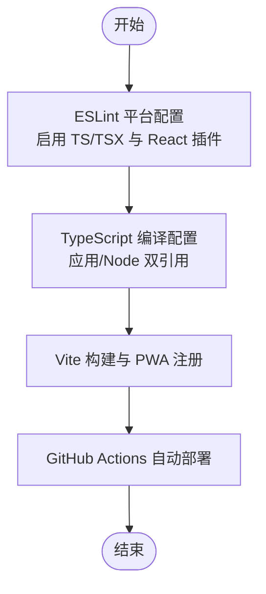
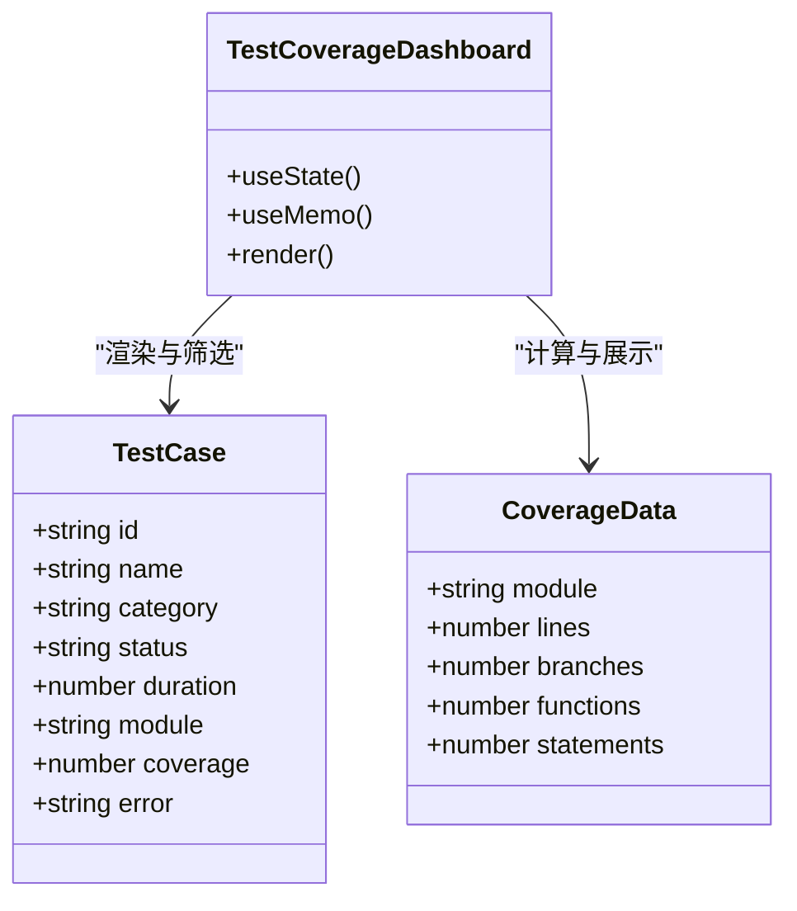
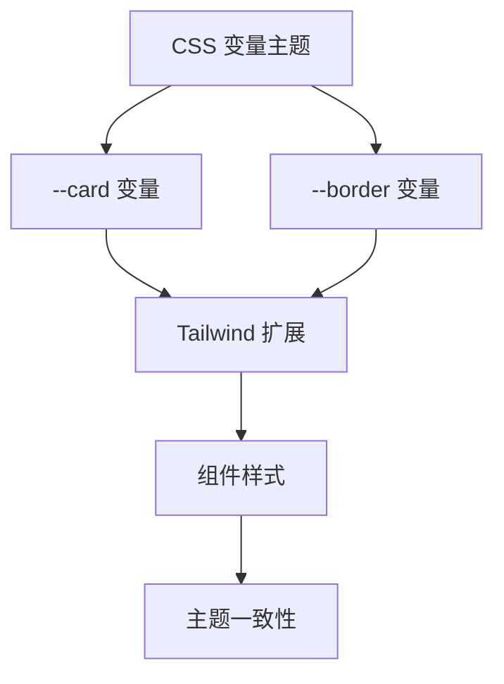
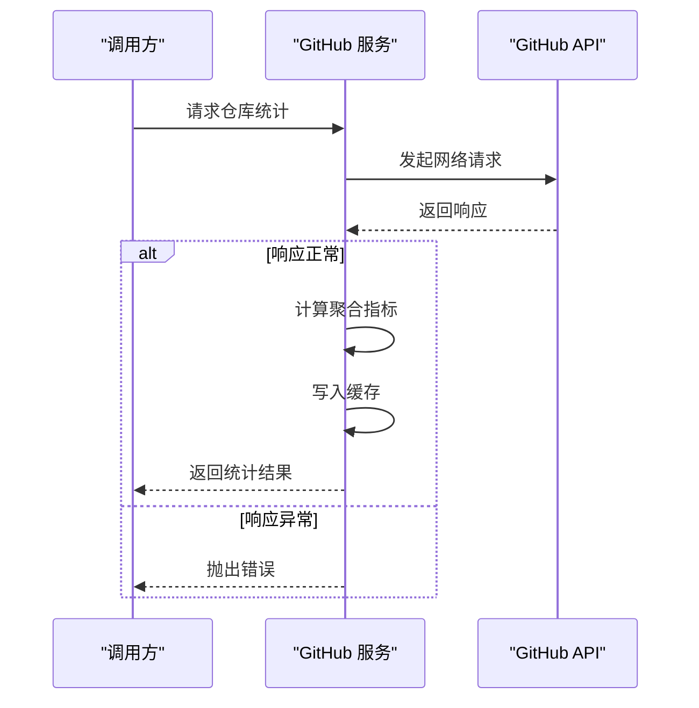
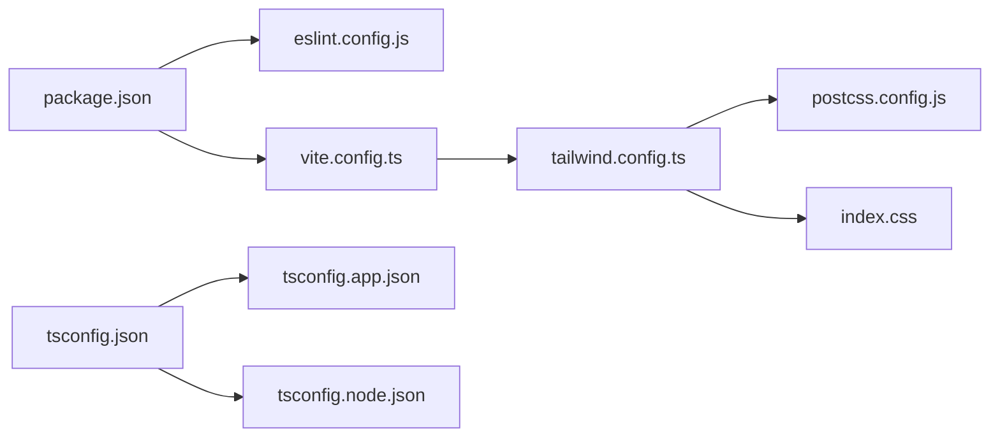

# 测试与质量保证

<cite>
**本文引用的文件**
- [package.json](file://package.json)
- [eslint.config.js](file://eslint.config.js)
- [tsconfig.json](file://tsconfig.json)
- [tsconfig.app.json](file://tsconfig.app.json)
- [tsconfig.node.json](file://tsconfig.node.json)
- [vite.config.ts](file://vite.config.ts)
- [tailwind.config.ts](file://tailwind.config.ts)
- [postcss.config.js](file://postcss.config.js)
- [.github/workflows/deploy.yml](file://.github/workflows/deploy.yml)
- [.github/workflows/deploy-static.yml](file://.github/workflows/deploy-static.yml)
- [src/components/TestCoverageDashboard.tsx](file://src/components/TestCoverageDashboard.tsx)
- [src/services/github.ts](file://src/services/github.ts)
- [src/index.css](file://src/index.css)
</cite>

## 更新摘要
**所做更改**
- 更新测试覆盖率仪表板主题一致性章节，反映背景色从bg-white标准化为bg-card的改进
- 新增主题系统与CSS变量配置的详细说明
- 补充边框类统一使用border-border的实现细节
- 增强UI组件主题一致性的分析

## 目录
1. [简介](#简介)
2. [项目结构](#项目结构)
3. [核心组件](#核心组件)
4. [架构总览](#架构总览)
5. [详细组件分析](#详细组件分析)
6. [依赖关系分析](#依赖关系分析)
7. [性能考虑](#性能考虑)
8. [故障排查指南](#故障排查指南)
9. [结论](#结论)
10. [附录](#附录)

## 简介
本文件面向 YuleTech 社区技术平台，系统化梳理测试与质量保证（QA）体系，涵盖代码质量检查策略、静态分析工具与代码规范执行、TypeScript 类型检查、ESLint 配置与代码格式化标准、单元测试与覆盖率展示、测试数据管理与模拟策略、代码审查流程、质量门禁与持续改进机制，以及性能测试、安全测试与兼容性测试的实施方法。文档同时提供测试环境搭建、测试数据管理与回归测试策略，并给出开发者测试最佳实践与质量保证指导。

## 项目结构
项目采用多应用单仓结构，包含多个前端应用与共享组件库，使用 Vite 构建、TailwindCSS 与 PostCSS 打包，配合 TypeScript 与 ESLint 实现类型与风格约束。质量保障相关的关键配置集中在根目录的构建与 lint 配置文件中，测试覆盖率可视化组件位于共享组件库中。

**图表来源**
- [vite.config.ts:1-32](file://vite.config.ts#L1-L32)
- [tailwind.config.ts:1-79](file://tailwind.config.ts#L1-L79)
- [postcss.config.js:1-7](file://postcss.config.js#L1-L7)
- [tsconfig.json:1-8](file://tsconfig.json#L1-L8)
- [tsconfig.app.json:1-35](file://tsconfig.app.json#L1-L35)
- [tsconfig.node.json:1-25](file://tsconfig.node.json#L1-L25)
- [package.json:1-46](file://package.json#L1-L46)
- [eslint.config.js:1-24](file://eslint.config.js#L1-L24)
- [.github/workflows/deploy.yml:1-54](file://.github/workflows/deploy.yml#L1-L54)
- [.github/workflows/deploy-static.yml:1-43](file://.github/workflows/deploy-static.yml#L1-L43)
- [src/components/TestCoverageDashboard.tsx:1-462](file://src/components/TestCoverageDashboard.tsx#L1-L462)
- [src/services/github.ts:65-96](file://src/services/github.ts#L65-L96)
- [src/index.css:37-93](file://src/index.css#L37-L93)

**章节来源**
- [package.json:1-46](file://package.json#L1-L46)
- [vite.config.ts:1-32](file://vite.config.ts#L1-L32)
- [tsconfig.json:1-8](file://tsconfig.json#L1-L8)
- [tsconfig.app.json:1-35](file://tsconfig.app.json#L1-L35)
- [tsconfig.node.json:1-25](file://tsconfig.node.json#L1-L25)
- [eslint.config.js:1-24](file://eslint.config.js#L1-L24)
- [tailwind.config.ts:1-79](file://tailwind.config.ts#L1-L79)
- [postcss.config.js:1-7](file://postcss.config.js#L1-L7)
- [src/index.css:37-93](file://src/index.css#L37-L93)

## 核心组件
- 代码质量与静态分析：ESLint 与 TypeScript 编译器共同构成类型检查与风格约束基础；ESLint 使用 flat 配置与推荐集，覆盖 TS/TSX、React Hooks、React Refresh 与浏览器全局变量。
- 类型检查与编译：双 tsconfig 引用模式，分别针对应用与 Node 工具链；严格未使用项与语法检测选项提升代码健康度。
- 构建与打包：Vite 配置启用 PWA 与缓存策略，路径别名统一为 @，便于跨应用复用组件与服务。
- 质量可视化：测试覆盖率仪表盘组件提供测试用例概览、分类筛选、模块维度覆盖率与失败告警，支撑质量门禁与回归分析。
- 主题系统：基于 Tailwind CSS 的 CSS 变量主题系统，统一使用 `bg-card` 和 `border-border` 类实现视觉一致性。
- 服务层示例：GitHub 仓库统计服务演示了错误处理与缓存策略，可作为测试数据与模拟对象的参考实现。

**章节来源**
- [eslint.config.js:1-24](file://eslint.config.js#L1-L24)
- [tsconfig.json:1-8](file://tsconfig.json#L1-L8)
- [tsconfig.app.json:1-35](file://tsconfig.app.json#L1-L35)
- [tsconfig.node.json:1-25](file://tsconfig.node.json#L1-L25)
- [vite.config.ts:1-32](file://vite.config.ts#L1-L32)
- [src/components/TestCoverageDashboard.tsx:1-462](file://src/components/TestCoverageDashboard.tsx#L1-L462)
- [src/services/github.ts:65-96](file://src/services/github.ts#L65-L96)
- [tailwind.config.ts:18-53](file://tailwind.config.ts#L18-L53)
- [src/index.css:37-69](file://src/index.css#L37-L69)

## 架构总览
下图展示了从开发到部署的端到端质量保障路径：本地开发阶段由 ESLint 与 TypeScript 提供即时反馈；构建阶段由 Vite/PWA 产出产物；工作流负责自动化构建与发布；覆盖率仪表盘用于质量监控与门禁。

**图表来源**
- [package.json:6-11](file://package.json#L6-L11)
- [vite.config.ts:6-31](file://vite.config.ts#L6-L31)
- [.github/workflows/deploy.yml:17-53](file://.github/workflows/deploy.yml#L17-L53)
- [.github/workflows/deploy-static.yml:17-42](file://.github/workflows/deploy-static.yml#L17-L42)

## 详细组件分析

### 代码质量检查与静态分析
- ESLint 配置采用 flat 形态，扩展推荐集以启用 TS/TSX、React Hooks、React Refresh 与浏览器全局变量；对 TS 文件进行集中校验，确保一致的风格与最佳实践。
- TypeScript 编译配置采用双引用模式，应用侧启用 JSX、路径别名与严格未使用项检查；Node 侧聚焦工具链与无输出编译，避免污染应用构建。
- 代码规范执行：在本地与 CI 中统一执行 lint 脚本，结合编辑器插件实现即时反馈；类型检查在构建前执行，减少运行时风险。

**图表来源**
- [eslint.config.js:8-23](file://eslint.config.js#L8-L23)
- [tsconfig.app.json:2-35](file://tsconfig.app.json#L2-L35)
- [tsconfig.node.json:2-24](file://tsconfig.node.json#L2-L24)
- [vite.config.ts:6-31](file://vite.config.ts#L6-L31)
- [.github/workflows/deploy.yml:17-53](file://.github/workflows/deploy.yml#L17-L53)

**章节来源**
- [eslint.config.js:1-24](file://eslint.config.js#L1-L24)
- [tsconfig.json:1-8](file://tsconfig.json#L1-L8)
- [tsconfig.app.json:1-35](file://tsconfig.app.json#L1-L35)
- [tsconfig.node.json:1-25](file://tsconfig.node.json#L1-L25)
- [vite.config.ts:1-32](file://vite.config.ts#L1-L32)

### 测试覆盖率可视化组件
- 组件职责：提供测试用例概览、按类别与模块筛选、覆盖率汇总与模块级覆盖率列表、失败用例告警与操作入口。
- 数据模型：测试用例包含标识、名称、类别、状态、耗时、模块与覆盖率等字段；覆盖率数据包含模块与行/分支/函数/语句覆盖率。
- 交互设计：支持标签页切换、筛选器联动、失败用例重跑与详情查看，辅助质量门禁与回归分析。
- **主题一致性改进**：组件已统一使用 `bg-card` 背景色替代之前的多种背景色方案，边框统一使用 `border-border` 类，确保视觉一致性与主题协调。

**图表来源**
- [src/components/TestCoverageDashboard.tsx:23-42](file://src/components/TestCoverageDashboard.tsx#L23-L42)
- [src/components/TestCoverageDashboard.tsx:96-131](file://src/components/TestCoverageDashboard.tsx#L96-L131)

**章节来源**
- [src/components/TestCoverageDashboard.tsx:1-462](file://src/components/TestCoverageDashboard.tsx#L1-L462)

### 主题系统与CSS变量配置
- **CSS变量主题**：项目采用基于 CSS 变量的主题系统，定义了 `--card`、`--border`、`--background` 等核心变量，支持明暗主题切换。
- **Tailwind扩展**：在 `tailwind.config.ts` 中扩展了颜色系统，将 `card` 和 `border` 映射到对应的 CSS 变量，确保组件间的一致性。
- **全局样式**：通过 `@apply border-border` 在全局应用边框样式，简化组件开发中的样式声明。
- **背景色统一**：所有容器组件统一使用 `bg-card` 类，替代之前的多种背景色方案，提升视觉一致性。

**图表来源**
- [tailwind.config.ts:18-53](file://tailwind.config.ts#L18-L53)
- [src/index.css:37-69](file://src/index.css#L37-L69)

**章节来源**
- [tailwind.config.ts:18-53](file://tailwind.config.ts#L18-L53)
- [src/index.css:37-69](file://src/index.css#L37-L69)

### 服务层错误处理与缓存策略
- 错误处理：当第三方 API 返回非 OK 状态时抛出明确错误，便于上层捕获与日志记录。
- 缓存策略：将聚合统计结果写入缓存，降低重复请求成本，提升响应速度。
- 模块匹配：提供候选命名集合，增强模块名查找的鲁棒性。

**图表来源**
- [src/services/github.ts:65-80](file://src/services/github.ts#L65-L80)

**章节来源**
- [src/services/github.ts:65-96](file://src/services/github.ts#L65-L96)

### 单元测试、集成测试与端到端测试组织
- 单元测试：针对纯函数与独立逻辑编写，优先验证边界条件与异常路径；建议使用最小化依赖与模拟策略，确保测试稳定与可重复。
- 集成测试：围绕服务层与组件交互进行，关注数据流、错误传播与副作用；通过真实或模拟的外部依赖验证端到端行为。
- 端到端测试：覆盖用户关键路径，如登录、导航、内容加载与交互反馈；建议在隔离环境中运行，使用真实浏览器与最小化外部依赖。
- 覆盖率要求：建议行覆盖率不低于 80%，关键路径不低于 90%；对失败用例与边界条件设置强制通过策略。
- 测试数据管理：使用固定种子数据与工厂函数生成可预测输入；对外部依赖使用模拟对象或内存存储，避免真实网络与数据库。
- 回归测试策略：对重大变更与高风险模块执行回归测试；结合覆盖率仪表盘识别薄弱环节并补充用例。

### 性能测试、安全测试与兼容性测试
- 性能测试：测量关键页面与交互的加载时间、首屏时间与交互延迟；在不同设备与网络条件下评估表现。
- 安全测试：扫描常见漏洞（如 XSS、CSRF），验证认证与授权流程；对第三方依赖进行供应链安全审计。
- 兼容性测试：在主流浏览器与操作系统版本上验证功能一致性；关注 PWA 缓存与离线能力。

### 代码审查流程、质量门禁与持续改进
- 代码审查：采用 Pull Request 流程，至少一名 reviewer 通过；审查重点包括代码正确性、可读性、安全性与性能影响。
- 质量门禁：CI 中强制执行 lint 与类型检查；覆盖率阈值作为合并门禁之一；失败用例不得合入主干。
- 持续改进：定期回顾测试覆盖率与失败用例趋势，优化测试策略与用例设计；引入自动化修复建议与重构工具。

## 依赖关系分析
- 构建与样式：Vite 依赖 React 插件与 PWA 插件；TailwindCSS 与 Autoprefixer 通过 PostCSS 配置启用；路径别名为 @，统一指向 src。
- 类型与语言：tsconfig.json 通过引用分别指向应用与 Node 配置；应用侧启用 JSX 与路径映射，Node 侧聚焦工具链。
- 质量与脚本：package.json 定义 lint 与构建脚本；ESLint 与 TypeScript 配置共同作用于开发体验与构建稳定性。
- **主题系统**：Tailwind 配置扩展 CSS 变量主题，全局样式应用统一边框样式，确保组件间视觉一致性。

**图表来源**
- [package.json:1-46](file://package.json#L1-L46)
- [eslint.config.js:1-24](file://eslint.config.js#L1-L24)
- [vite.config.ts:1-32](file://vite.config.ts#L1-L32)
- [tailwind.config.ts:1-79](file://tailwind.config.ts#L1-L79)
- [postcss.config.js:1-7](file://postcss.config.js#L1-L7)
- [src/index.css:37-93](file://src/index.css#L37-L93)
- [tsconfig.json:1-8](file://tsconfig.json#L1-L8)
- [tsconfig.app.json:1-35](file://tsconfig.app.json#L1-L35)
- [tsconfig.node.json:1-25](file://tsconfig.node.json#L1-L25)

**章节来源**
- [package.json:1-46](file://package.json#L1-L46)
- [vite.config.ts:1-32](file://vite.config.ts#L1-L32)
- [tsconfig.json:1-8](file://tsconfig.json#L1-L8)

## 性能考虑
- 构建性能：利用 Vite 的按需编译与缓存；合理拆分依赖与动态导入，减少初始包体。
- 运行性能：PWA 缓存策略与 Workbox 配置提升资源加载效率；TailwindCSS 的按需扫描减少样式体积。
- 开发体验：TypeScript 严格模式与 ESLint 推荐集在本地尽早暴露问题，降低调试成本。
- **主题性能**：CSS 变量主题系统通过单一变量控制，减少样式计算开销，提升渲染性能。

## 故障排查指南
- 构建失败：检查 tsconfig 引用与路径别名配置；确认 Node 版本与依赖版本兼容。
- Lint 失败：根据 ESLint 输出修正语法与风格问题；必要时调整规则或忽略特定文件。
- PWA 缓存异常：核对缓存模式与白名单；清理浏览器缓存后重试。
- 部署失败：检查 GitHub Actions 权限与工作流配置；确认 dist 目录内容与发布路径。
- **主题显示异常**：检查 CSS 变量是否正确加载，确认 `bg-card` 和 `border-border` 类是否被正确解析。

**章节来源**
- [vite.config.ts:6-31](file://vite.config.ts#L6-L31)
- [.github/workflows/deploy.yml:17-53](file://.github/workflows/deploy.yml#L17-L53)
- [.github/workflows/deploy-static.yml:17-42](file://.github/workflows/deploy-static.yml#L17-L42)

## 结论
本项目已建立完善的代码质量与构建基础设施：ESLint 与 TypeScript 提供强约束的静态检查；Vite 与 PWA 支持高效的构建与缓存；TailwindCSS 与 PostCSS 保证样式一致性。测试覆盖率可视化组件为质量门禁与回归分析提供了直观支撑。**最新的主题一致性改进**通过统一使用 `bg-card` 和 `border-border` 类，显著提升了组件间的视觉一致性与主题协调性。建议在此基础上进一步完善单元/集成/端到端测试体系，强化覆盖率与失败用例治理，并将质量门禁纳入 CI，形成持续改进的闭环。

## 附录

### 测试与质量保证最佳实践清单
- 在本地与 CI 中统一执行 lint 与类型检查。
- 为关键模块设定覆盖率阈值，定期审查失败用例。
- 使用模拟对象与固定种子数据，确保测试可重复。
- 对外部依赖进行隔离与缓存，避免真实网络与数据库。
- 将覆盖率仪表盘纳入每日站会与评审流程。
- 在 PR 中强制通过质量门禁，阻断低质量代码入库。
- **遵循主题一致性规范**：统一使用 `bg-card` 背景色和 `border-border` 边框类。