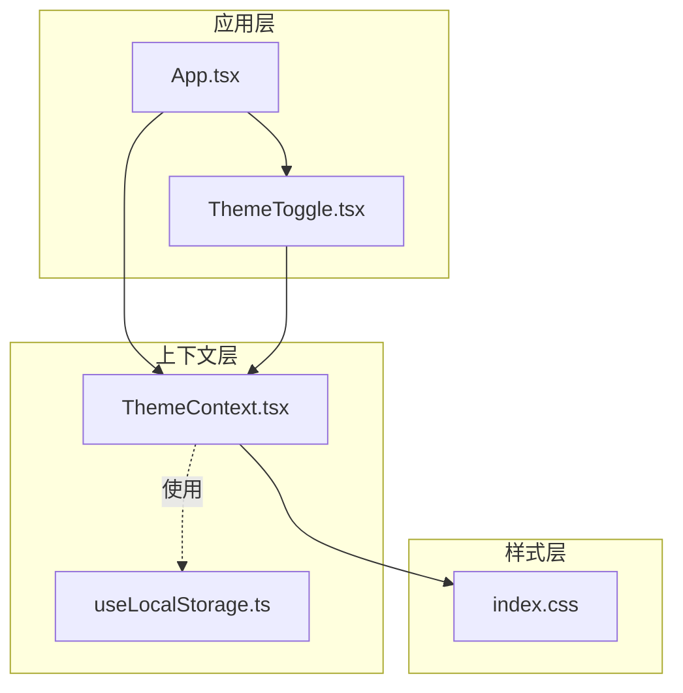
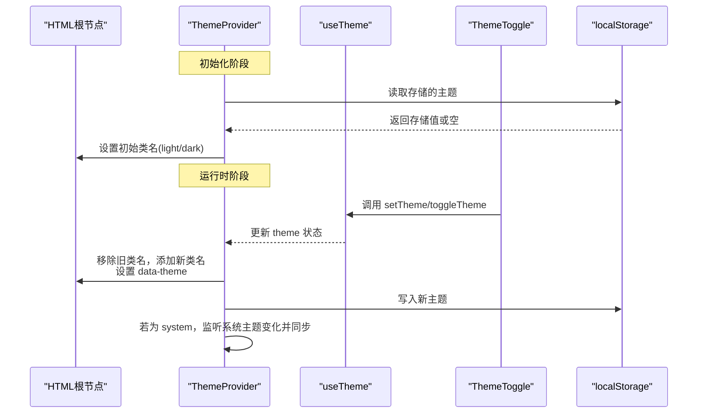
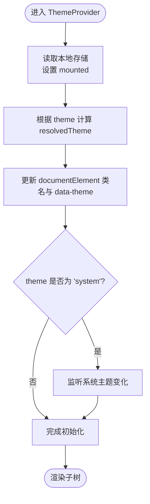
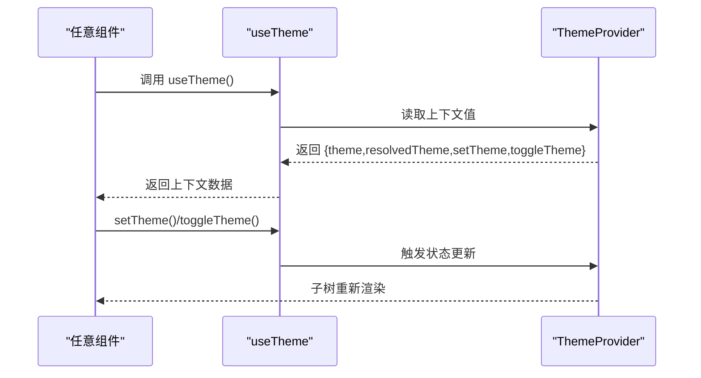
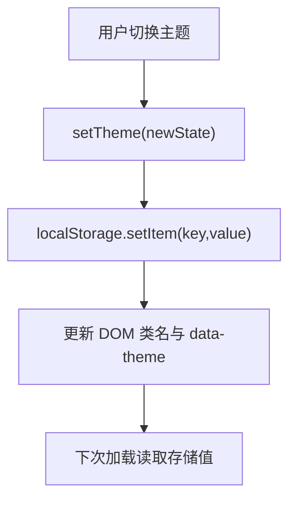
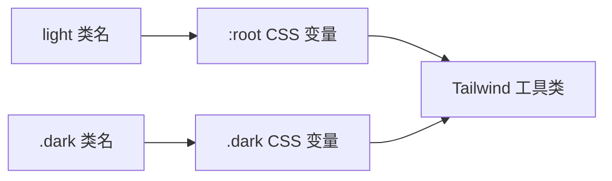
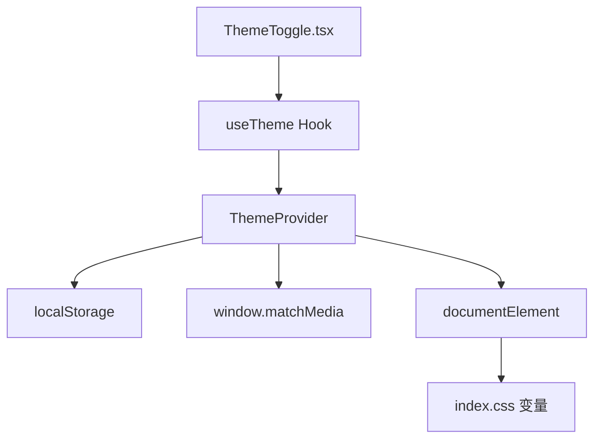

# 上下文系统

<cite>
**本文引用的文件**
- [ThemeContext.tsx](file://src/contexts/ThemeContext.tsx)
- [ThemeToggle.tsx](file://src/components/ThemeToggle.tsx)
- [useLocalStorage.ts](file://src/hooks/useLocalStorage.ts)
- [index.css](file://src/index.css)
- [App.tsx](file://src/App.tsx)
- [ThemeContext.js](file://apps/shell/src/contexts/ThemeContext.js)
- [App.js](file://apps/shell/src/App.js)
- [ThemeContext.tsx（archive）](file://archive/src/contexts/ThemeContext.tsx)
- [ThemeToggle.tsx（archive）](file://archive/src/components/ThemeToggle.tsx)
- [useLocalStorage.ts（archive）](file://archive/src/hooks/useLocalStorage.ts)
- [ThemeToggle.tsx（backup）](file://backup/src-backup-20260425/components/ThemeToggle.tsx)
- [ThemeContext.tsx（backup）](file://backup/src-backup-20260425/contexts/ThemeContext.tsx)
</cite>

## 目录
1. [简介](#简介)
2. [项目结构](#项目结构)
3. [核心组件](#核心组件)
4. [架构总览](#架构总览)
5. [详细组件分析](#详细组件分析)
6. [依赖关系分析](#依赖关系分析)
7. [性能考量](#性能考量)
8. [故障排查指南](#故障排查指南)
9. [结论](#结论)
10. [附录：最佳实践与扩展方案](#附录最佳实践与扩展方案)

## 简介
本文件系统性梳理 YuleTech 社区技术平台中“上下文系统”的设计与实现，重点围绕 ThemeContext 主题上下文展开，涵盖 Provider 包装器、消费者 Hook 的使用方式、主题状态传播机制、状态更新触发流程、与本地存储的持久化结合、性能优化策略、常见陷阱与最佳实践，并给出扩展与自定义上下文的指导。

## 项目结构
- 主题上下文与组件集中在 src 目录：
  - 上下文定义：src/contexts/ThemeContext.tsx
  - 主题切换按钮：src/components/ThemeToggle.tsx
  - 通用本地存储 Hook：src/hooks/useLocalStorage.ts
  - 全局样式与主题变量：src/index.css
  - 应用入口：src/App.tsx
- 同时存在 archive 与 backup 历史版本，以及 apps/shell 的独立打包应用，展示了不同阶段的主题上下文实现与集成方式。

**图表来源**
- [App.tsx:1-118](file://src/App.tsx#L1-L118)
- [ThemeContext.tsx:1-127](file://src/contexts/ThemeContext.tsx#L1-L127)
- [ThemeToggle.tsx:1-120](file://src/components/ThemeToggle.tsx#L1-L120)
- [useLocalStorage.ts:1-60](file://src/hooks/useLocalStorage.ts#L1-L60)
- [index.css:1-112](file://src/index.css#L1-L112)

**章节来源**
- [App.tsx:1-118](file://src/App.tsx#L1-L118)
- [ThemeContext.tsx:1-127](file://src/contexts/ThemeContext.tsx#L1-L127)
- [ThemeToggle.tsx:1-120](file://src/components/ThemeToggle.tsx#L1-L120)
- [useLocalStorage.ts:1-60](file://src/hooks/useLocalStorage.ts#L1-L60)
- [index.css:1-112](file://src/index.css#L1-L112)

## 核心组件
- ThemeContext.tsx
  - 定义主题类型 Theme 及上下文接口 ThemeContextType
  - 提供 ThemeProvider：初始化主题、监听系统主题变化、写入本地存储、设置根节点类名与 data-theme 属性
  - 提供 useTheme Hook：安全地从上下文中读取主题状态与操作函数
- ThemeToggle.tsx
  - 消费 useTheme，提供快速切换与下拉菜单两种交互方式
  - 支持点击切换与右键打开菜单，内部处理点击外部关闭等交互细节
- useLocalStorage.ts
  - 封装 localStorage 读写与跨标签页同步事件，支持 JSON 序列化与错误处理
- index.css
  - 定义 :root 与 .dark 的 CSS 变量，配合 HTML 根元素类名实现主题切换

**章节来源**
- [ThemeContext.tsx:1-127](file://src/contexts/ThemeContext.tsx#L1-L127)
- [ThemeToggle.tsx:1-120](file://src/components/ThemeToggle.tsx#L1-L120)
- [useLocalStorage.ts:1-60](file://src/hooks/useLocalStorage.ts#L1-L60)
- [index.css:1-112](file://src/index.css#L1-L112)

## 架构总览
ThemeContext 的运行时架构由“状态初始化—状态变更—DOM 同步—持久化”构成，同时通过系统媒体查询监听实现“系统主题联动”。

**图表来源**
- [ThemeContext.tsx:41-116](file://src/contexts/ThemeContext.tsx#L41-L116)
- [ThemeToggle.tsx:11-98](file://src/components/ThemeToggle.tsx#L11-L98)
- [index.css:39-79](file://src/index.css#L39-L79)

## 详细组件分析

### ThemeProvider 实现与状态传播
- 状态拆分
  - theme：用户选择的值（'light' | 'dark' | 'system'）
  - resolvedTheme：最终生效的主题（'light' | 'dark'），用于 UI 与样式
  - mounted：SSR/首屏保护标志，避免闪烁
- 生命周期与副作用
  - 初始化：读取本地存储，设置 mounted
  - 主题变更：计算 resolvedTheme，更新 documentElement 类名与 data-theme
  - 系统主题监听：当 theme 为 'system' 时，监听 prefers-color-scheme 变化并同步
- Provider 值
  - 暴露 theme/resolvedTheme/setTheme/toggleTheme
  - 首帧渲染期间返回占位值，避免闪烁

**图表来源**
- [ThemeContext.tsx:41-116](file://src/contexts/ThemeContext.tsx#L41-L116)

**章节来源**
- [ThemeContext.tsx:41-116](file://src/contexts/ThemeContext.tsx#L41-L116)

### useTheme Hook 与消费者组件
- useTheme
  - 严格校验上下文是否存在，避免误用
  - 返回主题状态与操作函数，供组件消费
- ThemeToggle
  - 快速切换：循环 light → dark → system
  - 下拉菜单：展示三种主题并可直接选择
  - 外部点击关闭、动画防抖、无障碍标题与标签

**图表来源**
- [ThemeToggle.tsx:11-98](file://src/components/ThemeToggle.tsx#L11-L98)
- [ThemeContext.tsx:118-124](file://src/contexts/ThemeContext.tsx#L118-L124)

**章节来源**
- [ThemeToggle.tsx:1-120](file://src/components/ThemeToggle.tsx#L1-L120)
- [ThemeContext.tsx:118-124](file://src/contexts/ThemeContext.tsx#L118-L124)

### 与本地存储的持久化结合
- 读取策略
  - 首次挂载从 localStorage 读取主题，若存在则覆盖默认值
- 写入策略
  - setTheme 调用后立即写入 localStorage
  - 保证跨页面、跨刷新一致
- 错误处理
  - 读写异常静默忽略，避免阻塞渲染
- 与 useLocalStorage Hook 的关系
  - ThemeContext 自带轻量持久化逻辑
  - useLocalStorage.ts 更通用，支持跨标签页事件同步与 JSON 序列化

**图表来源**
- [ThemeContext.tsx:20-34](file://src/contexts/ThemeContext.tsx#L20-L34)
- [ThemeContext.tsx:84-93](file://src/contexts/ThemeContext.tsx#L84-L93)

**章节来源**
- [ThemeContext.tsx:20-34](file://src/contexts/ThemeContext.tsx#L20-L34)
- [ThemeContext.tsx:84-93](file://src/contexts/ThemeContext.tsx#L84-L93)
- [useLocalStorage.ts:1-60](file://src/hooks/useLocalStorage.ts#L1-L60)

### 样式与主题映射
- CSS 变量
  - :root 定义浅色变量；.dark 定义深色变量
- DOM 类名驱动
  - ThemeProvider 在 documentElement 上添加 'light'/'dark' 类名
  - Tailwind 通过这些类名应用对应颜色体系
- 主题过渡
  - 全局过渡声明，使颜色切换更顺滑

**图表来源**
- [index.css:5-79](file://src/index.css#L5-L79)

**章节来源**
- [index.css:1-112](file://src/index.css#L1-L112)

### 不同版本与集成差异
- apps/shell
  - 独立应用，直接在 App.js 中包裹 ThemeProvider
  - ThemeContext.js 为较简化的实现（无 system 模式与 mounted 保护）
- archive 与 backup
  - 保留历史实现，便于对比与迁移

**章节来源**
- [App.js:1-30](file://apps/shell/src/App.js#L1-L30)
- [ThemeContext.js:1-29](file://apps/shell/src/contexts/ThemeContext.js#L1-L29)
- [ThemeContext.tsx（archive）:1-127](file://archive/src/contexts/ThemeContext.tsx#L1-L127)
- [ThemeToggle.tsx（archive）:1-109](file://archive/src/components/ThemeToggle.tsx#L1-L109)
- [ThemeContext.tsx（backup）:1-127](file://backup/src-backup-20260425/contexts/ThemeContext.tsx#L1-L127)
- [ThemeToggle.tsx（backup）:1-36](file://backup/src-backup-20260425/components/ThemeToggle.tsx#L1-L36)

## 依赖关系分析
- 组件依赖
  - ThemeToggle 依赖 useTheme，间接依赖 ThemeProvider
  - ThemeProvider 依赖 localStorage 与 window.matchMedia
- 样式依赖
  - index.css 依赖根元素类名（由 ThemeProvider 控制）
- 数据流
  - 用户交互 → useTheme → ThemeProvider 状态更新 → DOM 类名与存储同步

**图表来源**
- [ThemeToggle.tsx:1-120](file://src/components/ThemeToggle.tsx#L1-L120)
- [ThemeContext.tsx:1-127](file://src/contexts/ThemeContext.tsx#L1-L127)
- [index.css:1-112](file://src/index.css#L1-L112)

**章节来源**
- [ThemeToggle.tsx:1-120](file://src/components/ThemeToggle.tsx#L1-L120)
- [ThemeContext.tsx:1-127](file://src/contexts/ThemeContext.tsx#L1-L127)
- [index.css:1-112](file://src/index.css#L1-L112)

## 性能考量
- 首屏闪烁防护
  - mounted 标志与占位 Provider，避免 SSR 或首帧渲染时的错误主题闪烁
- 最小化重渲染
  - 仅在 theme 变化时更新 resolvedTheme 与 DOM 类名
  - toggleTheme 仅在 theme=system 时监听系统主题变化
- 本地存储写入
  - setTheme 写入 localStorage，避免频繁 I/O；异常静默处理
- 动画与交互
  - ThemeToggle 对快速切换加防抖与过渡动画，提升体验

**章节来源**
- [ThemeContext.tsx:95-116](file://src/contexts/ThemeContext.tsx#L95-L116)
- [ThemeToggle.tsx:32-44](file://src/components/ThemeToggle.tsx#L32-L44)

## 故障排查指南
- 问题：切换主题无效
  - 检查是否在 ThemeProvider 包裹范围内调用 useTheme
  - 确认 documentElement 类名是否正确更新
- 问题：深色/浅色不生效
  - 检查 index.css 中 :root 与 .dark 变量是否完整
  - 确认 data-theme 与类名是否一致
- 问题：系统主题切换未响应
  - 确认 theme 是否为 'system'
  - 检查 window.matchMedia 监听是否注册
- 问题：本地存储读写失败
  - 浏览器隐私模式或禁用 localStorage 会导致异常
  - 查看控制台错误日志，确认异常已被捕获

**章节来源**
- [ThemeContext.tsx:67-82](file://src/contexts/ThemeContext.tsx#L67-L82)
- [ThemeContext.tsx:20-34](file://src/contexts/ThemeContext.tsx#L20-L34)
- [index.css:39-79](file://src/index.css#L39-L79)

## 结论
ThemeContext 在本项目中以“轻量 Provider + Hook 消费”的模式实现了主题状态的集中管理与持久化。通过 documentElement 类名与 CSS 变量的解耦，样式层无需感知上下文细节即可响应主题变化。配合 mounted 保护、系统主题监听与本地存储写入，整体具备良好的可用性与性能表现。建议在更大规模的状态管理需求下，结合 useLocalStorage Hook 与自定义上下文进行模块化演进。

## 附录：最佳实践与扩展方案
- 最佳实践
  - 所有主题相关组件必须在 ThemeProvider 内部使用 useTheme
  - 避免在 Provider 外部直接访问 localStorage，优先通过 setTheme 写入
  - 使用 mounted 占位与不可见容器防止首屏闪烁
  - 保持 CSS 变量与类名约定一致，避免样式冲突
- 性能优化
  - 将主题切换逻辑收敛在单一 Provider，减少多上下文嵌套导致的重渲染
  - 对频繁切换的 UI 加入节流/防抖
- 常见陷阱
  - 忽略 useTheme 的上下文校验，导致运行时报错
  - 直接修改 DOM 类名而非通过 setTheme，破坏状态一致性
  - 未处理 localStorage 异常，导致功能中断
- 扩展方案
  - 多上下文拆分：将主题、语言、布局等拆分为独立上下文，按需组合
  - 与路由/页面状态联动：在路由切换时根据页面特性动态调整主题
  - 自定义 Hook：封装主题偏好读取、系统主题监听、跨标签页同步等能力
- 自定义上下文创建指导
  - 定义类型与上下文接口
  - 设计 Provider 的初始化与副作用
  - 提供 Hook 并进行上下文校验
  - 明确与 localStorage 或全局状态的集成点
  - 编写最小可验证用例（如按钮切换 + 样式生效）

**章节来源**
- [ThemeContext.tsx:1-127](file://src/contexts/ThemeContext.tsx#L1-L127)
- [ThemeToggle.tsx:1-120](file://src/components/ThemeToggle.tsx#L1-L120)
- [useLocalStorage.ts:1-60](file://src/hooks/useLocalStorage.ts#L1-L60)
- [index.css:1-112](file://src/index.css#L1-L112)