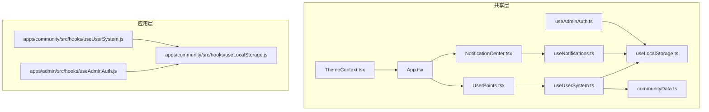
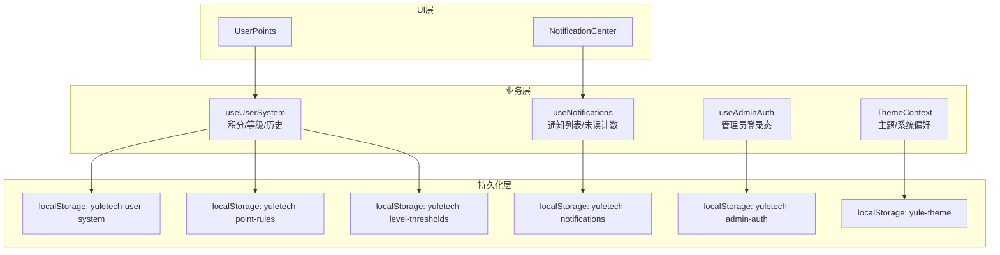
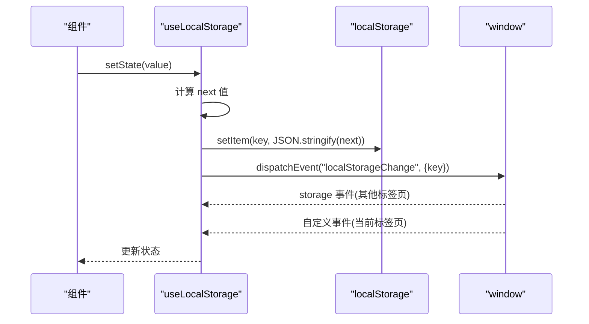
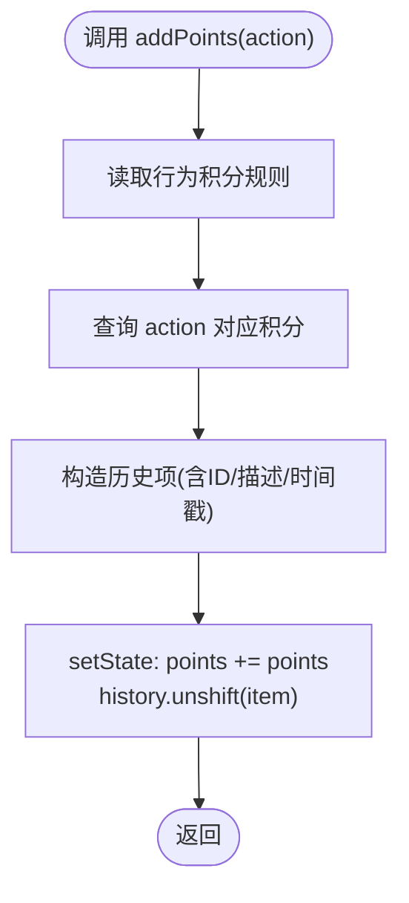
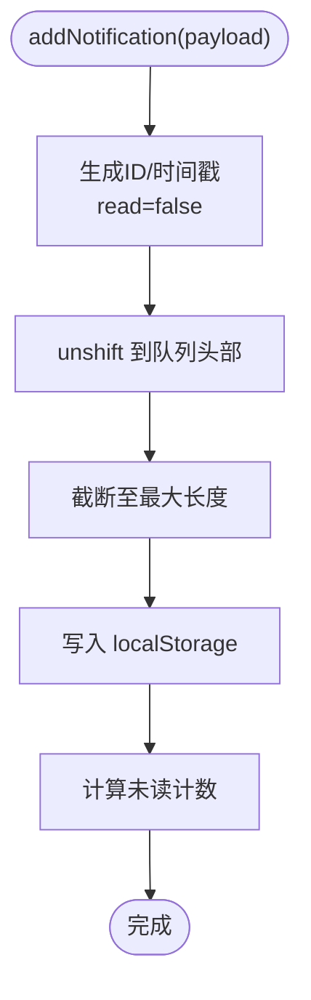
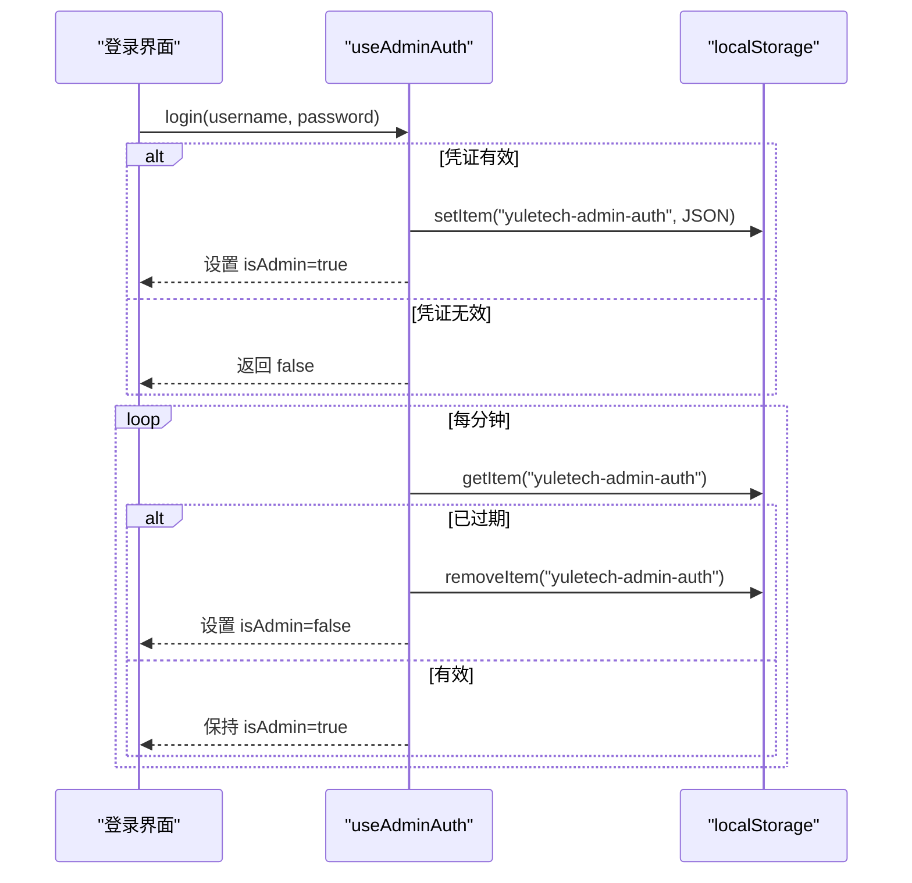
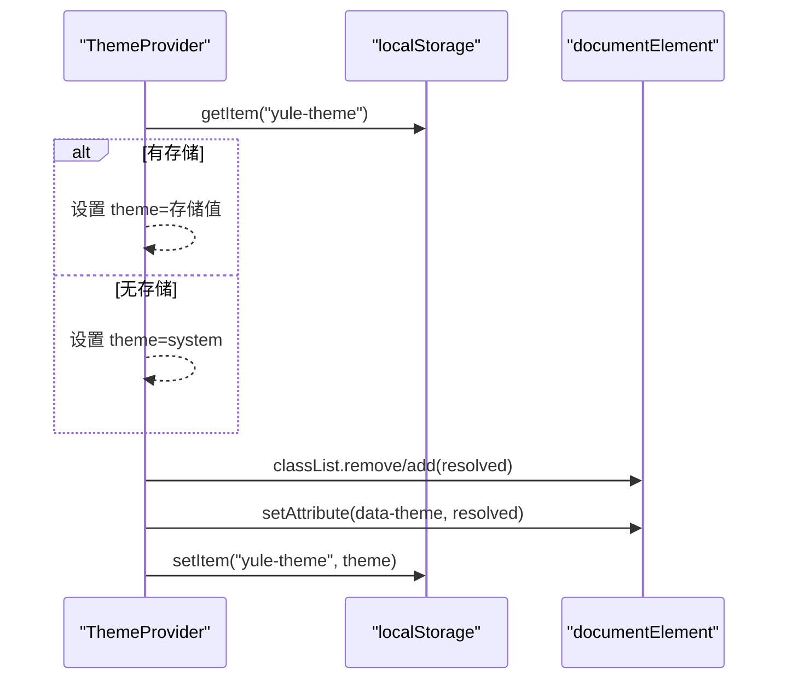
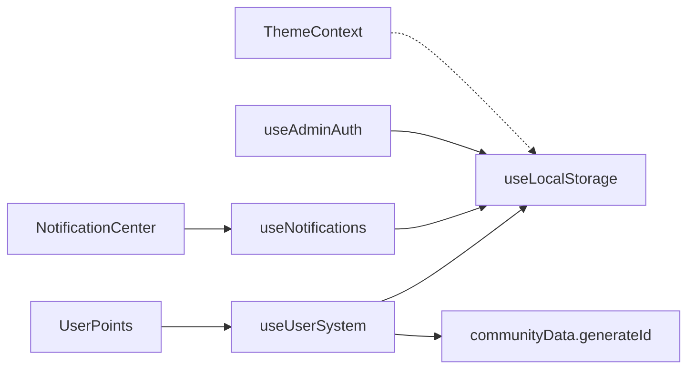

# 全局状态管理

<cite>
**本文引用的文件**
- [useLocalStorage.ts](file://src/hooks/useLocalStorage.ts)
- [useUserSystem.ts](file://src/hooks/useUserSystem.ts)
- [useAdminAuth.ts](file://src/hooks/useAdminAuth.ts)
- [ThemeContext.tsx](file://src/contexts/ThemeContext.tsx)
- [useNotifications.ts](file://src/hooks/useNotifications.ts)
- [communityData.ts](file://src/data/communityData.ts)
- [App.tsx](file://src/App.tsx)
- [UserPoints.tsx](file://src/components/UserPoints.tsx)
- [NotificationCenter.tsx](file://src/components/NotificationCenter.tsx)
- [useLocalStorage.js（社区应用）](file://apps/community/src/hooks/useLocalStorage.js)
- [useUserSystem.js（社区应用）](file://apps/community/src/hooks/useUserSystem.js)
- [useAdminAuth.js（管理后台）](file://apps/admin/src/hooks/useAdminAuth.js)
- [package.json](file://package.json)
</cite>

## 目录
1. [引言](#引言)
2. [项目结构](#项目结构)
3. [核心组件](#核心组件)
4. [架构总览](#架构总览)
5. [详细组件分析](#详细组件分析)
6. [依赖关系分析](#依赖关系分析)
7. [性能考量](#性能考量)
8. [故障排查指南](#故障排查指南)
9. [结论](#结论)
10. [附录](#附录)

## 引言
本文件系统性梳理 YuleTech 社区技术平台的全局状态管理方案，覆盖整体架构、状态分层策略、用户认证状态、主题状态与应用配置状态的管理方式，详解 localStorage 持久化与状态恢复机制，说明状态更新触发时机与副作用处理，阐述与局部状态、路由与页面组件的协同方式，并给出性能优化、内存管理、错误处理、调试与监控的最佳实践与扩展建议。

## 项目结构
YuleTech 采用多应用（apps/*）与共享库（src/*）并行的组织方式。全局状态管理的关键实现集中在共享 hooks 与 contexts 中，同时在各应用目录保留了对应实现的副本以适配不同构建目标或历史版本。

- 共享层（src）
  - hooks：useLocalStorage、useUserSystem、useNotifications、useAdminAuth
  - contexts：ThemeContext（主题）
  - data：communityData（生成 ID、迁移等）
  - components：UserPoints、NotificationCenter（消费全局状态）
  - App.tsx：路由与页面挂载入口
- 应用层（apps/*）
  - community：社区前端应用，包含对应 hooks 副本
  - admin：管理后台应用，包含对应 hooks 副本

图表来源
- [App.tsx:30-115](file://src/App.tsx#L30-L115)
- [UserPoints.tsx:8-10](file://src/components/UserPoints.tsx#L8-L10)
- [NotificationCenter.tsx:14-18](file://src/components/NotificationCenter.tsx#L14-L18)
- [useUserSystem.ts:91-132](file://src/hooks/useUserSystem.ts#L91-L132)
- [useNotifications.ts:17-49](file://src/hooks/useNotifications.ts#L17-L49)
- [useLocalStorage.ts:3-59](file://src/hooks/useLocalStorage.ts#L3-L59)
- [useAdminAuth.ts:29-66](file://src/hooks/useAdminAuth.ts#L29-L66)
- [ThemeContext.tsx:41-116](file://src/contexts/ThemeContext.tsx#L41-L116)
- [communityData.ts:361-363](file://src/data/communityData.ts#L361-L363)

章节来源
- [App.tsx:30-115](file://src/App.tsx#L30-L115)
- [package.json:1-46](file://package.json#L1-L46)

## 核心组件
- 本地存储 Hook：useLocalStorage 提供键值状态与 localStorage 的双向同步，内置跨标签页事件广播与解析容错。
- 用户系统 Hook：useUserSystem 维护积分与等级体系，支持动态规则与阈值持久化，提供增减积分与历史记录能力。
- 通知系统 Hook：useNotifications 维护通知列表，支持新增、标记已读、批量已读与未读计数。
- 管理员认证 Hook：useAdminAuth 维护管理员登录态与会话有效期，支持自动清理过期状态。
- 主题上下文：ThemeContext 提供主题切换与系统主题监听，持久化用户选择并避免首屏闪烁。
- 页面与组件：UserPoints、NotificationCenter 将全局状态以 UI 形式呈现，贯穿路由与导航栏。

章节来源
- [useLocalStorage.ts:3-59](file://src/hooks/useLocalStorage.ts#L3-L59)
- [useUserSystem.ts:91-132](file://src/hooks/useUserSystem.ts#L91-L132)
- [useNotifications.ts:17-49](file://src/hooks/useNotifications.ts#L17-L49)
- [useAdminAuth.ts:29-66](file://src/hooks/useAdminAuth.ts#L29-L66)
- [ThemeContext.tsx:41-116](file://src/contexts/ThemeContext.tsx#L41-L116)
- [UserPoints.tsx:8-10](file://src/components/UserPoints.tsx#L8-L10)
- [NotificationCenter.tsx:14-18](file://src/components/NotificationCenter.tsx#L14-L18)

## 架构总览
全局状态管理采用“共享 hooks + 上下文”的分层策略：
- 分层一：原子状态（localStorage）——通过 useLocalStorage 抽象键值持久化，保证跨组件可复用与跨标签页同步。
- 分层二：业务状态（用户系统/通知/认证）——通过 useUserSystem、useNotifications、useAdminAuth 聚合原子状态，提供领域 API。
- 分层三：UI 层（组件）——通过 UserPoints、NotificationCenter 等组件消费业务状态，渲染与交互。
- 分层四：主题层（ThemeContext）——独立于业务状态，负责外观与系统偏好同步。

图表来源
- [useUserSystem.ts:91-132](file://src/hooks/useUserSystem.ts#L91-L132)
- [useNotifications.ts:17-49](file://src/hooks/useNotifications.ts#L17-L49)
- [useAdminAuth.ts:29-66](file://src/hooks/useAdminAuth.ts#L29-L66)
- [ThemeContext.tsx:41-116](file://src/contexts/ThemeContext.tsx#L41-L116)
- [UserPoints.tsx:8-10](file://src/components/UserPoints.tsx#L8-L10)
- [NotificationCenter.tsx:14-18](file://src/components/NotificationCenter.tsx#L14-L18)

## 详细组件分析

### 本地存储 Hook：useLocalStorage
- 设计要点
  - 初始化：从 localStorage 取值并 JSON 解析；失败则回退初始值。
  - 写入：setState 支持函数式更新；写入 localStorage 后派发自定义事件，用于跨标签页同步。
  - 同步：监听 storage 与自定义事件，当键匹配时重新解析并更新状态。
  - 容错：解析异常与写入异常均捕获并记录，避免中断 UI 渲染。
- 性能与内存
  - 仅在状态变化时写入 localStorage，避免频繁 IO。
  - 使用 useCallback 包装 setter，降低重渲染风险。
- 适用范围
  - 用户系统、通知、管理员认证、主题等键值状态。

图表来源
- [useLocalStorage.ts:14-25](file://src/hooks/useLocalStorage.ts#L14-L25)
- [useLocalStorage.ts:27-56](file://src/hooks/useLocalStorage.ts#L27-L56)

章节来源
- [useLocalStorage.ts:3-59](file://src/hooks/useLocalStorage.ts#L3-L59)

### 用户系统 Hook：useUserSystem
- 状态模型
  - points：累计积分
  - history：积分变更历史（含动作、描述、时间戳）
- 动态规则与阈值
  - 行为积分规则与等级阈值可通过 localStorage 覆盖默认值，实现运营可配置。
- 等级计算
  - 根据当前积分在阈值区间内确定等级信息。
- 生成 ID
  - 使用 communityData.generateId 保证唯一性与可读性。

图表来源
- [useUserSystem.ts:97-111](file://src/hooks/useUserSystem.ts#L97-L111)
- [useUserSystem.ts:36-47](file://src/hooks/useUserSystem.ts#L36-L47)
- [useUserSystem.ts:63-79](file://src/hooks/useUserSystem.ts#L63-L79)
- [communityData.ts:361-363](file://src/data/communityData.ts#L361-L363)

章节来源
- [useUserSystem.ts:91-132](file://src/hooks/useUserSystem.ts#L91-L132)
- [communityData.ts:361-363](file://src/data/communityData.ts#L361-L363)

### 通知系统 Hook：useNotifications
- 状态模型
  - notifications：通知数组，按时间倒序，最多保留固定条目。
  - unreadCount：未读计数。
- 能力
  - 新增通知（自动生成 ID 与时间戳）
  - 标记单条/全部已读
  - 未读计数统计

图表来源
- [useNotifications.ts:20-28](file://src/hooks/useNotifications.ts#L20-L28)
- [useNotifications.ts:40](file://src/hooks/useNotifications.ts#L40)

章节来源
- [useNotifications.ts:17-49](file://src/hooks/useNotifications.ts#L17-L49)

### 管理员认证 Hook：useAdminAuth
- 登录态
  - 以对象形式保存登录时间，序列化到 localStorage。
- 会话有效期
  - 默认 2 小时；每分钟轮询检查，过期自动登出并清理。
- 登录/登出
  - 登录成功写入状态并更新内存态；登出删除状态并更新内存态。

图表来源
- [useAdminAuth.ts:50-63](file://src/hooks/useAdminAuth.ts#L50-L63)
- [useAdminAuth.ts:35-48](file://src/hooks/useAdminAuth.ts#L35-L48)

章节来源
- [useAdminAuth.ts:29-66](file://src/hooks/useAdminAuth.ts#L29-L66)

### 主题上下文：ThemeContext
- 初始化
  - 从 localStorage 读取主题；若为空则使用系统偏好。
- 系统主题监听
  - 当主题为 system 时，监听 prefers-color-scheme 变化并实时更新 resolvedTheme。
- 首屏防闪烁
  - mounted 控制渲染，未挂载时提供空 Provider，避免样式抖动。
- 存储与应用
  - 切换主题时写入 localStorage，并更新 documentElement 类名与属性。

图表来源
- [ThemeContext.tsx:47-65](file://src/contexts/ThemeContext.tsx#L47-L65)
- [ThemeContext.tsx:68-82](file://src/contexts/ThemeContext.tsx#L68-L82)
- [ThemeContext.tsx:84-93](file://src/contexts/ThemeContext.tsx#L84-L93)

章节来源
- [ThemeContext.tsx:41-116](file://src/contexts/ThemeContext.tsx#L41-L116)

### 页面与组件集成
- App 路由挂载
  - App 负责公共布局、导航、页脚与懒加载页面，作为全局状态的承载容器。
- UserPoints
  - 消费 useUserSystem，展示积分、等级与进度条。
- NotificationCenter
  - 消费 useNotifications，展示通知列表与未读角标，支持点击跳转与一键已读。

章节来源
- [App.tsx:30-115](file://src/App.tsx#L30-L115)
- [UserPoints.tsx:8-10](file://src/components/UserPoints.tsx#L8-L10)
- [NotificationCenter.tsx:14-18](file://src/components/NotificationCenter.tsx#L14-L18)

## 依赖关系分析
- 组件依赖
  - UserPoints 依赖 useUserSystem
  - NotificationCenter 依赖 useNotifications
- 业务依赖
  - useUserSystem 依赖 useLocalStorage 与 communityData.generateId
  - useNotifications 依赖 useLocalStorage
  - useAdminAuth 依赖 useLocalStorage
  - ThemeContext 独立于业务状态，仅依赖 localStorage 与系统媒体查询
- 应用层一致性
  - apps/community 与 apps/admin 各自提供对应 hooks 副本，确保各自构建产物的独立性与兼容性。

图表来源
- [UserPoints.tsx:8-10](file://src/components/UserPoints.tsx#L8-L10)
- [NotificationCenter.tsx:14-18](file://src/components/NotificationCenter.tsx#L14-L18)
- [useUserSystem.ts:91-132](file://src/hooks/useUserSystem.ts#L91-L132)
- [useNotifications.ts:17-49](file://src/hooks/useNotifications.ts#L17-L49)
- [useAdminAuth.ts:29-66](file://src/hooks/useAdminAuth.ts#L29-L66)
- [ThemeContext.tsx:41-116](file://src/contexts/ThemeContext.tsx#L41-L116)
- [communityData.ts:361-363](file://src/data/communityData.ts#L361-L363)

章节来源
- [useUserSystem.ts:91-132](file://src/hooks/useUserSystem.ts#L91-L132)
- [useNotifications.ts:17-49](file://src/hooks/useNotifications.ts#L17-L49)
- [useAdminAuth.ts:29-66](file://src/hooks/useAdminAuth.ts#L29-L66)
- [ThemeContext.tsx:41-116](file://src/contexts/ThemeContext.tsx#L41-L116)
- [communityData.ts:361-363](file://src/data/communityData.ts#L361-L363)

## 性能考量
- 写入节流
  - 通过函数式 setState 与一次性 JSON 序列化，减少多次写入与重复解析。
- 跨标签页同步
  - 使用自定义事件与 storage 事件，避免轮询带来的性能损耗。
- 未读计数
  - 通过过滤计算未读数量，避免在渲染中重复计算。
- 首屏渲染
  - ThemeContext 通过 mounted 与空 Provider 避免闪烁，提升感知性能。
- 内存管理
  - 通知列表截断与历史记录长度控制，防止无限增长。
- 依赖优化
  - useCallback 包装 setter 与回调，降低重渲染频率。

[本节为通用性能建议，不直接分析具体文件，故无章节来源]

## 故障排查指南
- localStorage 不可用
  - 现象：初始化或写入时报错，状态不更新。
  - 处理：检查浏览器隐私模式或存储配额；代码已捕获错误并回退初始值。
- 跨标签页不同步
  - 现象：在 A 标签页修改状态，B 标签页未刷新。
  - 处理：确认自定义事件与 storage 事件监听正常；检查键名一致。
- 通知过多导致卡顿
  - 现象：通知列表过长影响滚动。
  - 处理：确认截断逻辑生效；必要时缩短最大条目数。
- 等级阈值/积分规则异常
  - 现象：等级显示异常或积分规则不生效。
  - 处理：检查 localStorage 中对应键值格式与解析；确保数组非空且包含边界值。
- 主题切换无效
  - 现象：切换主题后未生效。
  - 处理：确认存储键值与系统监听逻辑；检查 documentElement 类名更新。

章节来源
- [useLocalStorage.ts:27-56](file://src/hooks/useLocalStorage.ts#L27-L56)
- [useNotifications.ts:27](file://src/hooks/useNotifications.ts#L27)
- [useUserSystem.ts:36-47](file://src/hooks/useUserSystem.ts#L36-L47)
- [ThemeContext.tsx:68-82](file://src/contexts/ThemeContext.tsx#L68-L82)

## 结论
YuleTech 的全局状态管理以 useLocalStorage 为核心，结合 useUserSystem、useNotifications、useAdminAuth 与 ThemeContext，形成清晰的分层与职责边界。通过 localStorage 的持久化与跨标签页同步、函数式更新与容错处理，实现了稳定、可扩展且易维护的状态体系。配合路由与组件层的解耦，满足了社区平台在用户互动、通知与主题偏好等方面的多样化需求。

[本节为总结性内容，不直接分析具体文件，故无章节来源]

## 附录

### 状态持久化与恢复策略
- 键命名规范
  - 用户系统：yuletech-user-system
  - 通知：yuletech-notifications
  - 管理员认证：yuletech-admin-auth
  - 主题：yule-theme
  - 积分规则：yuletech-point-rules
  - 等级阈值：yuletech-level-thresholds
- 恢复流程
  - 组件挂载时从 localStorage 读取并解析；失败回退初始值；随后通过事件监听保持同步。

章节来源
- [useUserSystem.ts:92](file://src/hooks/useUserSystem.ts#L92)
- [useNotifications.ts:18](file://src/hooks/useNotifications.ts#L18)
- [useAdminAuth.ts:3](file://src/hooks/useAdminAuth.ts#L3)
- [ThemeContext.tsx:14](file://src/contexts/ThemeContext.tsx#L14)
- [useUserSystem.ts:38](file://src/hooks/useUserSystem.ts#L38)
- [useUserSystem.ts:65](file://src/hooks/useUserSystem.ts#L65)

### 状态更新触发时机与副作用
- 触发时机
  - 用户操作（如添加积分、新增通知、登录/登出、主题切换）
- 副作用
  - 写入 localStorage、跨标签页事件广播、系统主题监听、未读计数更新

章节来源
- [useLocalStorage.ts:14-25](file://src/hooks/useLocalStorage.ts#L14-L25)
- [useLocalStorage.ts:27-56](file://src/hooks/useLocalStorage.ts#L27-L56)
- [ThemeContext.tsx:68-82](file://src/contexts/ThemeContext.tsx#L68-L82)
- [useNotifications.ts:20-38](file://src/hooks/useNotifications.ts#L20-L38)
- [useAdminAuth.ts:50-63](file://src/hooks/useAdminAuth.ts#L50-L63)

### 与其他状态管理方式的协调
- 与局部状态
  - 局部状态（如页面 tab、表单输入）与全局状态解耦，避免污染全局。
- 与路由
  - App 路由负责页面级状态与懒加载，全局状态在页面组件中按需消费。
- 与应用层
  - apps/* 下的 hooks 副本确保各自构建产物的独立性，同时共享核心逻辑。

章节来源
- [App.tsx:30-115](file://src/App.tsx#L30-L115)
- [useUserSystem.js（社区应用）:64-101](file://apps/community/src/hooks/useUserSystem.js#L64-L101)
- [useLocalStorage.js（社区应用）:1-60](file://apps/community/src/hooks/useLocalStorage.js#L1-L60)
- [useAdminAuth.js（管理后台）:24-55](file://apps/admin/src/hooks/useAdminAuth.js#L24-L55)

### 调试技巧与监控
- 调试技巧
  - 打开浏览器开发者工具的 Application/Storage 面板查看 localStorage 键值。
  - 在 Console 中手动修改键值观察 UI 变化。
  - 使用 React DevTools 检查组件 props 与状态变化。
- 监控建议
  - 记录关键事件（登录、加积分、新增通知）到埋点系统。
  - 监控 localStorage 写入失败率与跨标签页同步延迟。

[本节为通用调试与监控建议，不直接分析具体文件，故无章节来源]

### 最佳实践与扩展指导
- 最佳实践
  - 为每个全局状态键提供默认值与解析容错。
  - 使用函数式 setState 与批量更新，减少不必要的渲染。
  - 控制持久化数据规模，定期清理或截断。
  - 将 UI 与业务逻辑分离，保持 hooks 的纯函数特性。
- 扩展指导
  - 新增业务状态：优先复用 useLocalStorage，封装为独立 hook。
  - 动态配置：通过 localStorage 键暴露运营可配置项。
  - 多应用一致性：在 apps/* 中维护对应 hooks 副本，确保构建产物独立。

[本节为通用最佳实践与扩展建议，不直接分析具体文件，故无章节来源]