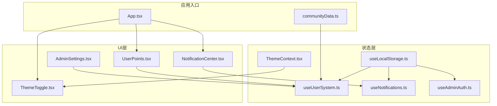
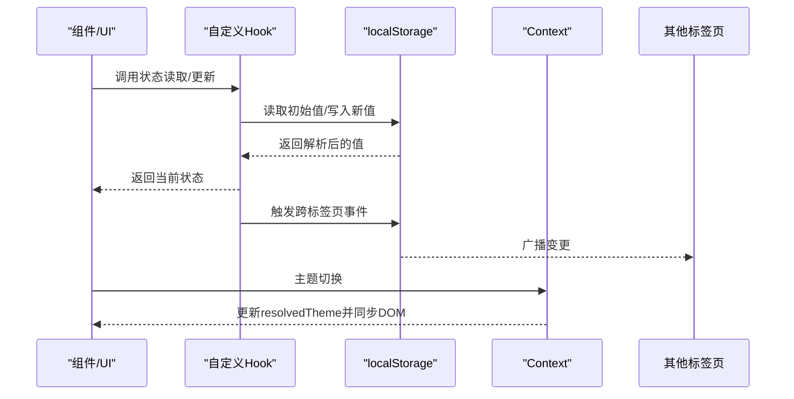
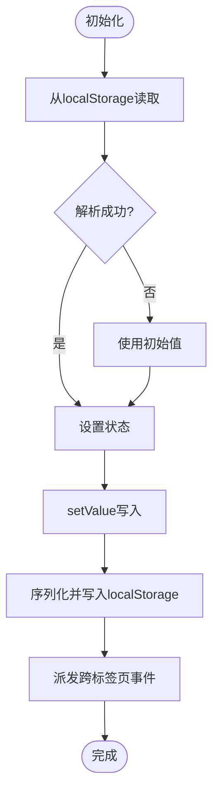
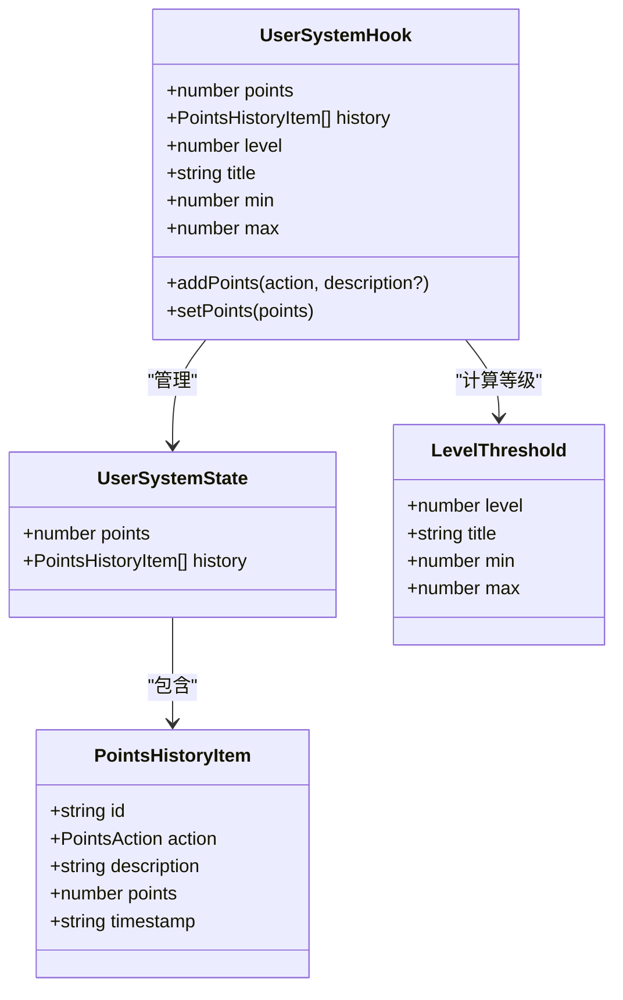
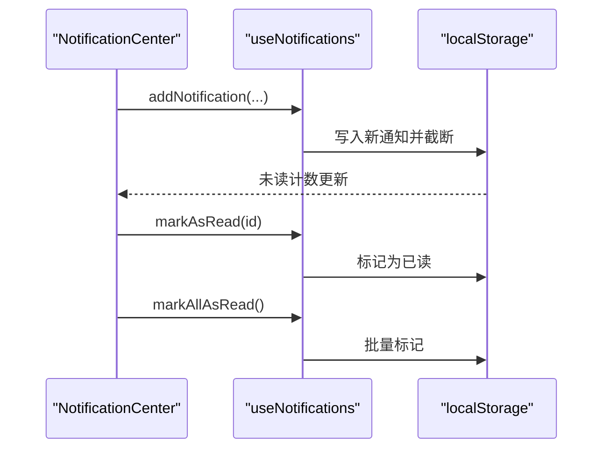
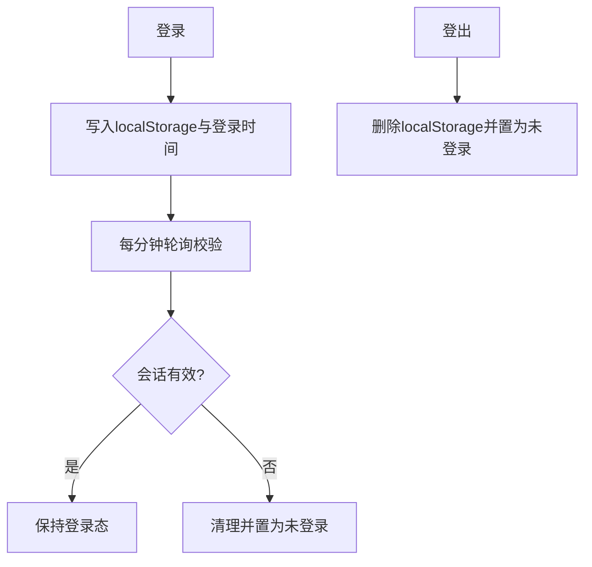
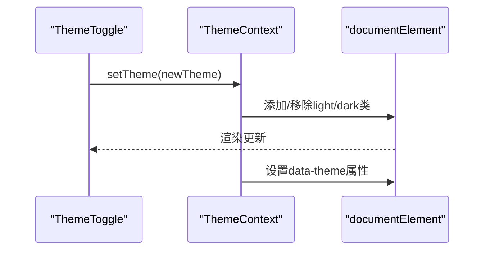
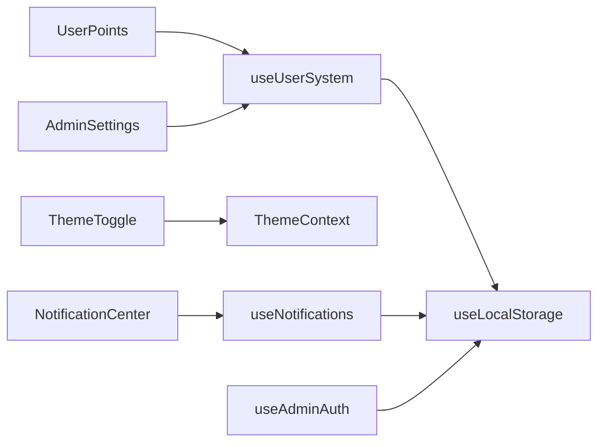

# 状态管理

<cite>
**本文引用的文件**
- [useUserSystem.ts](file://src/hooks/useUserSystem.ts)
- [useNotifications.ts](file://src/hooks/useNotifications.ts)
- [useLocalStorage.ts](file://src/hooks/useLocalStorage.ts)
- [useAdminAuth.ts](file://src/hooks/useAdminAuth.ts)
- [ThemeContext.tsx](file://src/contexts/ThemeContext.tsx)
- [NotificationCenter.tsx](file://src/components/NotificationCenter.tsx)
- [ThemeToggle.tsx](file://src/components/ThemeToggle.tsx)
- [UserPoints.tsx](file://src/components/UserPoints.tsx)
- [AdminSettings.tsx](file://src/pages/AdminSettings.tsx)
- [App.tsx](file://src/App.tsx)
- [communityData.ts](file://src/data/communityData.ts)
- [package.json](file://package.json)
</cite>

## 目录
1. [引言](#引言)
2. [项目结构](#项目结构)
3. [核心组件](#核心组件)
4. [架构总览](#架构总览)
5. [详细组件分析](#详细组件分析)
6. [依赖分析](#依赖分析)
7. [性能考量](#性能考量)
8. [故障排查指南](#故障排查指南)
9. [结论](#结论)
10. [附录](#附录)

## 引言
本文件面向YuleTech社区技术平台，系统性阐述其前端状态管理架构与实现。平台采用以React Hooks为核心的本地状态与持久化策略，结合Context提供主题等跨组件共享状态；同时通过自定义Hook封装用户积分、通知与管理员认证等业务状态，形成“局部状态 + 全局共享 + 本地持久化”的分层治理模型。本文将解释选择React Hooks的原因、各自定义Hook的设计原理、API与使用场景，并给出最佳实践、性能优化、调试技巧与扩展建议。

## 项目结构
围绕状态管理的关键目录与文件：
- hooks：自定义Hook集中地，包含用户系统、通知、本地存储、管理员认证等
- contexts：主题Context提供跨组件的主题状态与切换能力
- components：消费状态的UI组件，如通知中心、主题切换、用户积分展示
- pages：业务页面，如管理员设置页用于动态调整用户系统规则
- data：通用数据生成与迁移工具，如ID生成器

图表来源
- [useUserSystem.ts:91-132](file://src/hooks/useUserSystem.ts#L91-L132)
- [useNotifications.ts:17-49](file://src/hooks/useNotifications.ts#L17-L49)
- [useLocalStorage.ts:3-59](file://src/hooks/useLocalStorage.ts#L3-L59)
- [useAdminAuth.ts:29-66](file://src/hooks/useAdminAuth.ts#L29-L66)
- [ThemeContext.tsx:41-115](file://src/contexts/ThemeContext.tsx#L41-L115)
- [NotificationCenter.tsx:14-102](file://src/components/NotificationCenter.tsx#L14-L102)
- [ThemeToggle.tsx:11-99](file://src/components/ThemeToggle.tsx#L11-L99)
- [UserPoints.tsx:8-81](file://src/components/UserPoints.tsx#L8-L81)
- [AdminSettings.tsx:27-70](file://src/pages/AdminSettings.tsx#L27-L70)
- [App.tsx:30-115](file://src/App.tsx#L30-L115)
- [communityData.ts:361-363](file://src/data/communityData.ts#L361-L363)

章节来源
- [App.tsx:30-115](file://src/App.tsx#L30-L115)

## 核心组件
本节概览平台状态管理的核心模块及其职责：
- useLocalStorage：通用本地持久化Hook，提供双向同步与跨标签页事件广播
- useUserSystem：用户积分与等级体系的业务状态，支持规则与阈值持久化
- useNotifications：通知列表、未读计数与标记逻辑
- useAdminAuth：管理员登录态与会话有效期校验
- ThemeContext：主题状态（浅色/深色/系统）与DOM类名同步
- ThemeToggle：主题切换UI与快速切换交互
- NotificationCenter：通知中心UI与导航跳转
- UserPoints：用户积分与等级进度展示
- AdminSettings：管理员可调整积分规则与等级阈值

章节来源
- [useLocalStorage.ts:3-59](file://src/hooks/useLocalStorage.ts#L3-L59)
- [useUserSystem.ts:91-132](file://src/hooks/useUserSystem.ts#L91-L132)
- [useNotifications.ts:17-49](file://src/hooks/useNotifications.ts#L17-L49)
- [useAdminAuth.ts:29-66](file://src/hooks/useAdminAuth.ts#L29-L66)
- [ThemeContext.tsx:41-115](file://src/contexts/ThemeContext.tsx#L41-L115)
- [ThemeToggle.tsx:11-99](file://src/components/ThemeToggle.tsx#L11-L99)
- [NotificationCenter.tsx:14-102](file://src/components/NotificationCenter.tsx#L14-L102)
- [UserPoints.tsx:8-81](file://src/components/UserPoints.tsx#L8-L81)
- [AdminSettings.tsx:27-70](file://src/pages/AdminSettings.tsx#L27-L70)

## 架构总览
平台采用“自定义Hook + Context”的分层状态管理：
- 局部状态：组件内部useState用于页面级或组件级的临时状态（如主页极简模式开关）
- 全局共享状态：Context提供主题状态，供全站组件共享
- 业务状态：自定义Hook封装用户系统、通知、管理员认证等，统一读写与持久化
- 持久化：useLocalStorage统一处理localStorage读写、错误捕获与跨标签页同步

图表来源
- [useLocalStorage.ts:14-56](file://src/hooks/useLocalStorage.ts#L14-L56)
- [ThemeContext.tsx:41-82](file://src/contexts/ThemeContext.tsx#L41-L82)

## 详细组件分析

### 自定义Hook：useLocalStorage
- 设计目标：为任意类型状态提供本地持久化，自动处理序列化/反序列化、异常容错与跨标签页同步
- 关键特性
  - 初始化：从localStorage读取，失败则回退到初始值
  - 写入：原子性写入localStorage并派发自定义事件，监听方同步更新
  - 同步：监听storage与自定义事件，保证多标签页一致
- 性能与健壮性
  - 使用useCallback包裹setValue，避免闭包陷阱
  - 对parse/JSON.stringify进行try/catch，防止异常中断渲染
  - 仅在key变化时注册/移除事件监听，降低开销

图表来源
- [useLocalStorage.ts:3-59](file://src/hooks/useLocalStorage.ts#L3-L59)

章节来源
- [useLocalStorage.ts:3-59](file://src/hooks/useLocalStorage.ts#L3-L59)

### 自定义Hook：useUserSystem
- 业务目标：维护用户积分与历史，计算等级并暴露增减积分的方法
- 数据结构
  - UserSystemState：points、history
  - PointsHistoryItem：动作、描述、积分、时间戳
  - LevelThreshold：等级阈值（含默认与可持久化）
- 规则与阈值
  - 默认积分规则与等级阈值可通过localStorage覆盖
  - 提供读取规则与阈值的辅助函数，兼容缺失/非法数据
- API
  - 状态：points、history、level、title、min、max
  - 方法：addPoints(action, description?)、setPoints(points)
- 使用场景
  - 用户互动产生积分（发帖、回复、答题、被采纳、活动）
  - 展示用户等级进度与历史记录
  - 管理员在后台动态调整规则与阈值

图表来源
- [useUserSystem.ts:5-132](file://src/hooks/useUserSystem.ts#L5-L132)

章节来源
- [useUserSystem.ts:5-132](file://src/hooks/useUserSystem.ts#L5-L132)
- [communityData.ts:361-363](file://src/data/communityData.ts#L361-L363)

### 自定义Hook：useNotifications
- 业务目标：维护通知列表、未读计数与标记逻辑
- 数据结构：Notification（含类型、标题、消息、链接、时间戳、已读标志）
- API
  - 状态：notifications、unreadCount
  - 方法：addNotification(notif)、markAsRead(id)、markAllAsRead()
- 限制：最多保留固定数量的通知项，超出按时间截断

图表来源
- [useNotifications.ts:17-49](file://src/hooks/useNotifications.ts#L17-L49)
- [NotificationCenter.tsx:14-102](file://src/components/NotificationCenter.tsx#L14-L102)

章节来源
- [useNotifications.ts:17-49](file://src/hooks/useNotifications.ts#L17-L49)
- [NotificationCenter.tsx:14-102](file://src/components/NotificationCenter.tsx#L14-L102)

### 自定义Hook：useAdminAuth
- 业务目标：管理员登录态与会话有效期校验
- 机制
  - 登录成功写入localStorage并设置登录时间
  - 启动时与定时器定期校验会话是否过期
  - 过期自动清理并置为未登录
- API：isAdmin、login(username, password)、logout()

图表来源
- [useAdminAuth.ts:29-66](file://src/hooks/useAdminAuth.ts#L29-L66)

章节来源
- [useAdminAuth.ts:29-66](file://src/hooks/useAdminAuth.ts#L29-L66)

### 主题Context：ThemeContext
- 作用：提供主题状态（light/dark/system）与切换能力，同步DOM类名与data-theme属性
- 机制
  - 初始化：从localStorage读取，否则默认system
  - 切换：setTheme写入localStorage并更新DOM
  - 系统跟随：当主题为system时监听prefers-color-scheme变化
  - 防闪烁：SSR/首屏挂载期间返回空Provider内容
- API：useTheme()返回theme/resolvedTheme/setTheme/toggleTheme

图表来源
- [ThemeContext.tsx:41-115](file://src/contexts/ThemeContext.tsx#L41-L115)
- [ThemeToggle.tsx:11-99](file://src/components/ThemeToggle.tsx#L11-L99)

章节来源
- [ThemeContext.tsx:41-115](file://src/contexts/ThemeContext.tsx#L41-L115)
- [ThemeToggle.tsx:11-99](file://src/components/ThemeToggle.tsx#L11-L99)

### 页面与组件集成
- AdminSettings：通过useLocalStorage直接读写积分规则与等级阈值，实现管理员动态配置
- NotificationCenter：消费useNotifications，支持点击跳转与批量已读
- ThemeToggle：消费ThemeContext，提供快速切换与下拉菜单
- UserPoints：消费useUserSystem，展示积分、等级与进度条

章节来源
- [AdminSettings.tsx:27-70](file://src/pages/AdminSettings.tsx#L27-L70)
- [NotificationCenter.tsx:14-102](file://src/components/NotificationCenter.tsx#L14-L102)
- [ThemeToggle.tsx:11-99](file://src/components/ThemeToggle.tsx#L11-L99)
- [UserPoints.tsx:8-81](file://src/components/UserPoints.tsx#L8-L81)

## 依赖分析
- 组件耦合
  - UI组件依赖对应Hook（如NotificationCenter依赖useNotifications）
  - Hook之间低耦合，均通过useLocalStorage实现持久化
  - ThemeContext独立于业务Hook，仅提供主题状态
- 外部依赖
  - react、react-router-dom、lucide-react等
- 潜在风险
  - localStorage异常或容量不足可能影响状态读写
  - 多标签页并发写入需依赖事件广播与幂等逻辑

图表来源
- [NotificationCenter.tsx:14-102](file://src/components/NotificationCenter.tsx#L14-L102)
- [ThemeToggle.tsx:11-99](file://src/components/ThemeToggle.tsx#L11-L99)
- [UserPoints.tsx:8-81](file://src/components/UserPoints.tsx#L8-L81)
- [useUserSystem.ts:91-132](file://src/hooks/useUserSystem.ts#L91-L132)
- [useNotifications.ts:17-49](file://src/hooks/useNotifications.ts#L17-L49)
- [useAdminAuth.ts:29-66](file://src/hooks/useAdminAuth.ts#L29-L66)
- [AdminSettings.tsx:27-70](file://src/pages/AdminSettings.tsx#L27-L70)

章节来源
- [package.json:12-26](file://package.json#L12-L26)

## 性能考量
- Hook粒度与重渲染
  - 使用useCallback包裹回调，避免子组件不必要的重渲染
  - useLocalStorage内部对setValue进行记忆化，减少无效写入
- 持久化成本
  - localStorage写入为I/O操作，应避免高频连续写入；可在业务侧做节流/防抖
  - 通知列表截断与积分历史截断控制内存占用
- 主题切换
  - DOM类名切换为O(1)，系统主题监听仅在system模式启用
- 路由与懒加载
  - 页面组件懒加载减少首屏负担，与Suspense结合提升体验

## 故障排查指南
- 症状：状态不刷新或不同步
  - 检查localStorage是否可用，确认跨标签页事件是否正常派发
  - 章节来源
    - [useLocalStorage.ts:14-56](file://src/hooks/useLocalStorage.ts#L14-L56)
- 症状：主题切换无效
  - 确认ThemeContext Provider包裹范围与DOM根节点类名更新
  - 章节来源
    - [ThemeContext.tsx:41-82](file://src/contexts/ThemeContext.tsx#L41-L82)
- 症状：通知未显示或未计入未读
  - 检查addNotification调用与未读字段，确认截断逻辑
  - 章节来源
    - [useNotifications.ts:17-49](file://src/hooks/useNotifications.ts#L17-L49)
    - [NotificationCenter.tsx:14-102](file://src/components/NotificationCenter.tsx#L14-L102)
- 症状：管理员会话频繁失效
  - 检查定时器轮询与会话有效期常量，确认localStorage写入
  - 章节来源
    - [useAdminAuth.ts:29-66](file://src/hooks/useAdminAuth.ts#L29-L66)

## 结论
YuleTech社区采用以React Hooks为中心的状态管理策略，结合useLocalStorage实现可靠持久化，辅以Context提供主题等全局状态。该方案具备以下优势：
- 低侵入：Hook封装业务细节，UI组件仅关注消费
- 可扩展：新增业务状态只需新增Hook并复用持久化机制
- 可维护：统一的错误处理与跨标签页同步，降低维护成本
建议在后续迭代中进一步引入轻量级状态库（如zustand）以承载更大规模的全局状态，或在高频写入场景引入队列/批处理策略。

## 附录
- 最佳实践
  - 为每个业务状态定义清晰的数据契约与默认值
  - 对外暴露稳定的Hook API，隐藏内部存储细节
  - 在页面/组件层做必要的本地状态收敛，避免过度分散
- 性能优化
  - 对高频写入的Hook增加节流/防抖
  - 控制持久化数据体积，必要时做归档/截断
  - 合理拆分Context，避免无关订阅
- 扩展与定制
  - 新增业务状态：复制useLocalStorage使用模式，封装读写与默认值
  - 新增主题：在ThemeContext中扩展枚举与样式映射
  - 新增通知类型：在useNotifications中扩展类型与UI配置