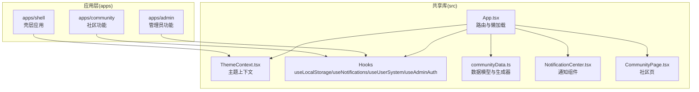
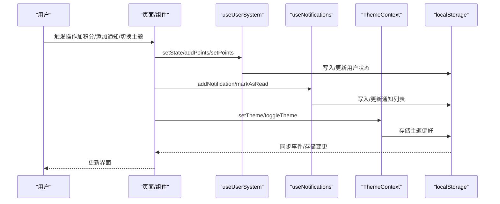
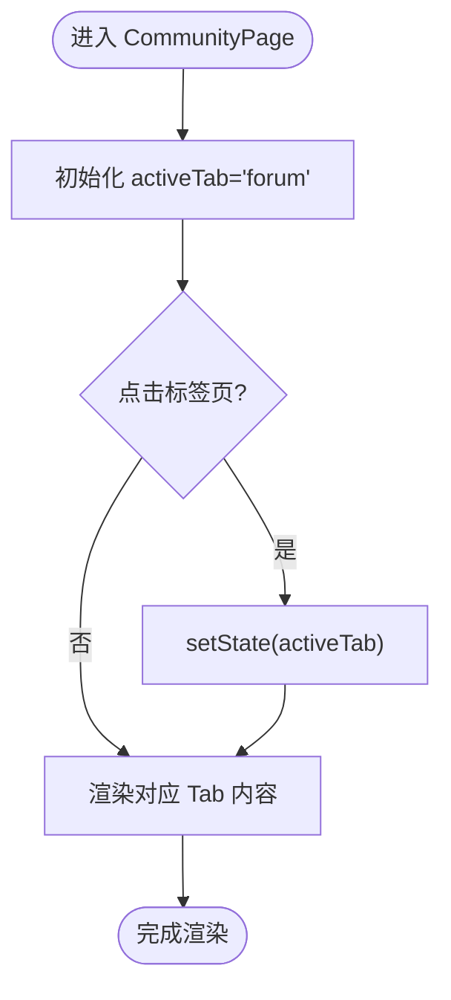
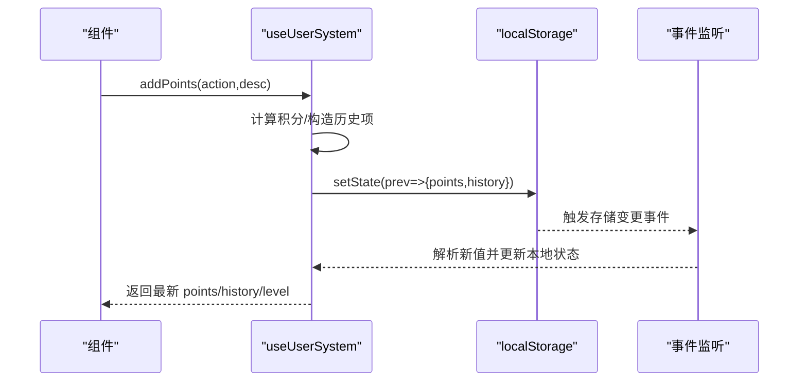
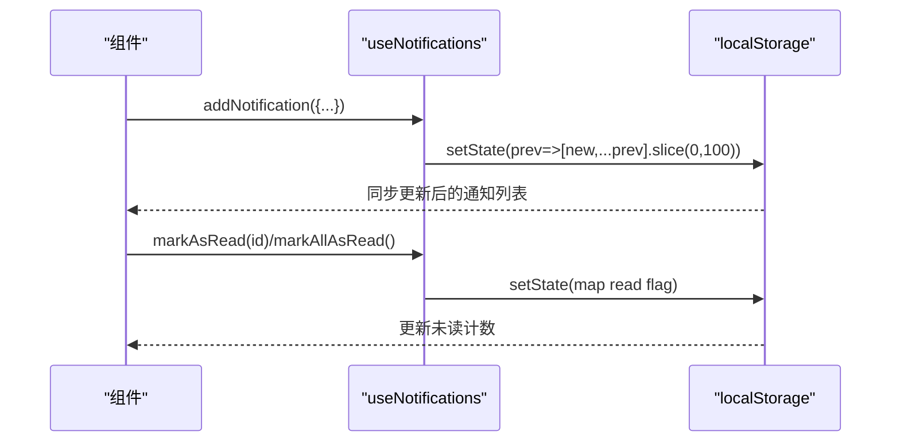
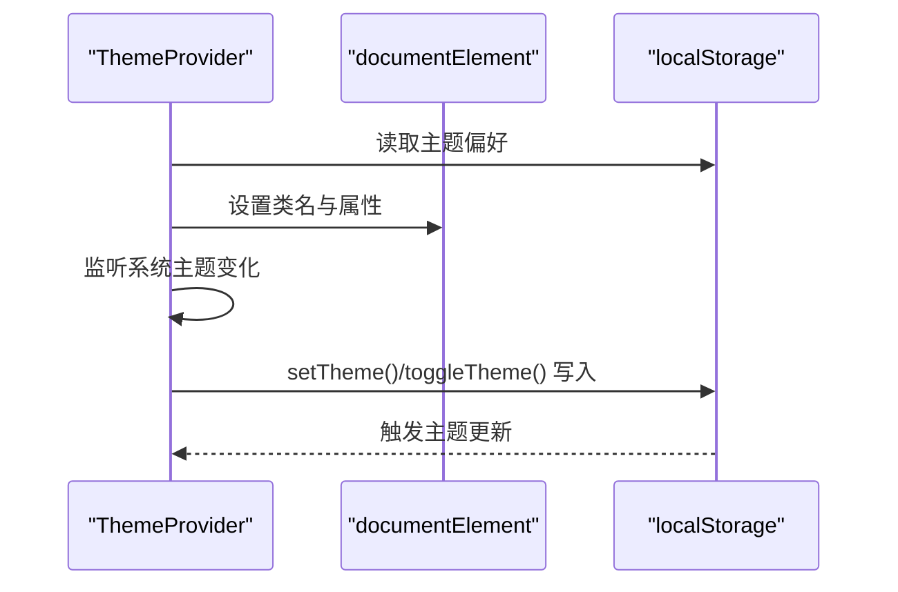
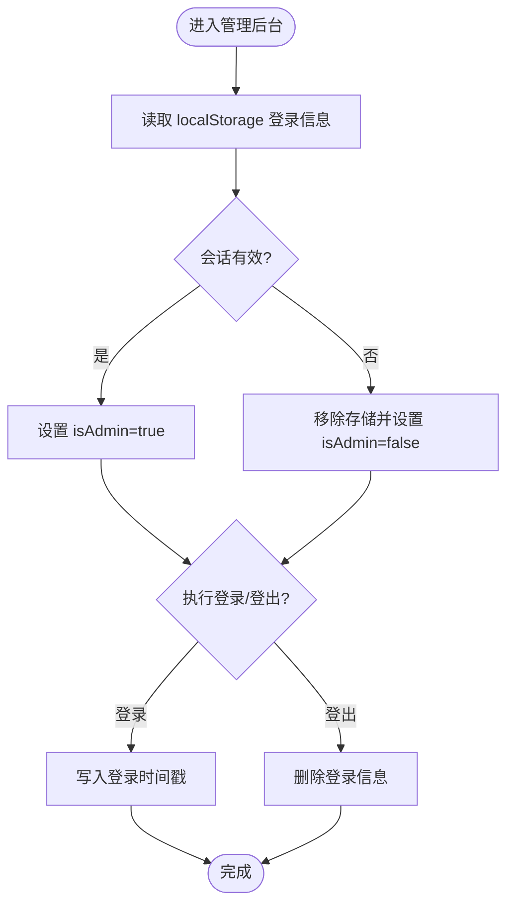
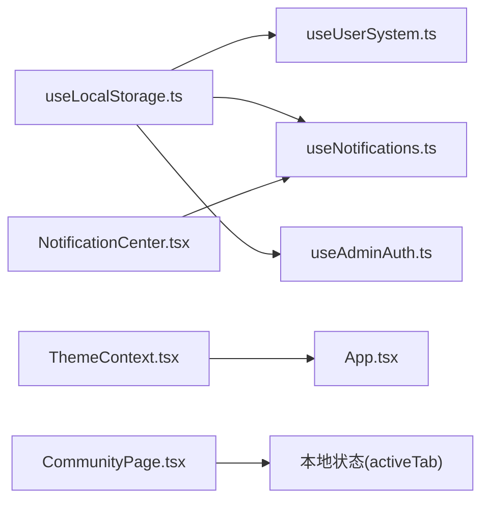

# 状态管理模式

<cite>
**本文引用的文件**
- [useUserSystem.ts](file://src/hooks/useUserSystem.ts)
- [useNotifications.ts](file://src/hooks/useNotifications.ts)
- [useLocalStorage.ts](file://src/hooks/useLocalStorage.ts)
- [ThemeContext.tsx](file://src/contexts/ThemeContext.tsx)
- [useAdminAuth.ts](file://src/hooks/useAdminAuth.ts)
- [communityData.ts](file://src/data/communityData.ts)
- [App.tsx](file://src/App.tsx)
- [CommunityPage.tsx](file://src/pages/CommunityPage.tsx)
- [NotificationCenter.tsx](file://src/components/NotificationCenter.tsx)
- [useUserSystem.js（admin）](file://apps/admin/src/hooks/useUserSystem.js)
- [useUserSystem.js（community）](file://apps/community/src/hooks/useUserSystem.js)
- [useAdminAuth.js（admin）](file://apps/admin/src/hooks/useAdminAuth.js)
- [ThemeContext.js（shell）](file://apps/shell/src/contexts/ThemeContext.js)
- [App.js（shell）](file://apps/shell/src/App.js)
</cite>

## 目录
1. [引言](#引言)
2. [项目结构](#项目结构)
3. [核心组件](#核心组件)
4. [架构总览](#架构总览)
5. [详细组件分析](#详细组件分析)
6. [依赖关系分析](#依赖关系分析)
7. [性能考量](#性能考量)
8. [故障排查指南](#故障排查指南)
9. [结论](#结论)
10. [附录](#附录)

## 引言
本文件系统性梳理 YuleTech 社区技术平台的状态管理模式，覆盖本地状态、状态提升与下沉、共享状态、React Hooks 模式优势与边界、状态持久化策略、性能与内存优化、渲染优化、迁移方案与最佳实践。文档以代码为依据，结合可视化图示帮助读者快速理解与落地。

## 项目结构
平台采用多应用（apps）与共享库（src）并存的组织方式：
- 共享库（src）：通用 Hooks、Context、数据模型、页面骨架与路由入口。
- 应用层（apps/*）：独立子应用（admin、community、learning、opensource、shell），各自复用共享能力或提供差异化实现。
- 路由与布局：通过主应用入口集中挂载各页面与子应用。

图表来源
- [App.tsx:30-115](file://src/App.tsx#L30-L115)
- [ThemeContext.tsx:41-115](file://src/contexts/ThemeContext.tsx#L41-L115)
- [useLocalStorage.ts:3-58](file://src/hooks/useLocalStorage.ts#L3-L58)
- [useNotifications.ts:17-48](file://src/hooks/useNotifications.ts#L17-L48)
- [useUserSystem.ts:91-131](file://src/hooks/useUserSystem.ts#L91-L131)
- [useAdminAuth.ts:29-65](file://src/hooks/useAdminAuth.ts#L29-L65)
- [communityData.ts:361-371](file://src/data/communityData.ts#L361-L371)
- [NotificationCenter.tsx:14-80](file://src/components/NotificationCenter.tsx#L14-L80)
- [CommunityPage.tsx:245-666](file://src/pages/CommunityPage.tsx#L245-L666)

章节来源
- [App.tsx:30-115](file://src/App.tsx#L30-L115)

## 核心组件
- 本地状态（Local State）
  - 页面级状态：如 CommunityPage 中的标签页切换状态，用于控制视图切换，不跨组件共享。
  - 组件内状态：如 NotificationCenter 中的下拉开关状态，仅影响当前组件 UI。
- 提升状态（Lifted State）
  - 用户积分与等级：useUserSystem 提升“积分/历史/等级”到 Hook，供多组件共享与持久化。
  - 通知系统：useNotifications 提升“通知列表/未读计数/标记已读”到 Hook，持久化存储。
  - 主题偏好：ThemeContext 提升“主题模式/解析主题”到 Context，供全站使用。
  - 管理员认证：useAdminAuth 提升“登录态/登录/登出”到 Hook，持久化会话。
- 共享状态（Shared State）
  - 通过自定义 Hooks 与 Context 将状态暴露给多个组件，避免重复逻辑与分散状态。
- React Hooks 模式优势
  - 组合性强：将状态与行为封装为可复用 Hook，便于在不同页面/模块间共享。
  - 可测试性：纯函数式 Hook 易于单元测试。
  - 渲染可控：通过 useCallback/useMemo 控制渲染边界，降低重渲染。
- 状态下沉（Descent）
  - 将共享状态通过 props 下沉至子组件，保持数据流向清晰，避免过度提升造成复杂度。

章节来源
- [CommunityPage.tsx:246-406](file://src/pages/CommunityPage.tsx#L246-L406)
- [NotificationCenter.tsx:14-80](file://src/components/NotificationCenter.tsx#L14-L80)
- [useUserSystem.ts:91-131](file://src/hooks/useUserSystem.ts#L91-L131)
- [useNotifications.ts:17-48](file://src/hooks/useNotifications.ts#L17-L48)
- [ThemeContext.tsx:41-115](file://src/contexts/ThemeContext.tsx#L41-L115)
- [useAdminAuth.ts:29-65](file://src/hooks/useAdminAuth.ts#L29-L65)

## 架构总览
平台状态流以“本地状态 + Hook 提升 + Context 共享 + 本地存储持久化”为核心，辅以路由与页面组件进行渲染与交互。

图表来源
- [useUserSystem.ts:91-131](file://src/hooks/useUserSystem.ts#L91-L131)
- [useNotifications.ts:17-48](file://src/hooks/useNotifications.ts#L17-L48)
- [ThemeContext.tsx:41-115](file://src/contexts/ThemeContext.tsx#L41-L115)
- [useLocalStorage.ts:3-58](file://src/hooks/useLocalStorage.ts#L3-L58)

## 详细组件分析

### 本地状态与页面级状态
- 页面标签切换：CommunityPage 使用本地状态 activeTab 控制 Tab 内容渲染，避免跨页面共享。
- 组件下拉面板：NotificationCenter 使用本地状态 isOpen 控制弹层显示，仅影响当前组件。

图表来源
- [CommunityPage.tsx:246-406](file://src/pages/CommunityPage.tsx#L246-L406)

章节来源
- [CommunityPage.tsx:246-406](file://src/pages/CommunityPage.tsx#L246-L406)

### 用户积分与等级（Hook 提升 + 本地持久化）
- 状态结构：points、history（积分明细）、level/title/min/max（等级信息）。
- 行为接口：addPoints、setPoints；等级计算基于阈值表。
- 持久化策略：使用 useLocalStorage 将状态写入 localStorage，并监听变化事件同步。

图表来源
- [useUserSystem.ts:91-131](file://src/hooks/useUserSystem.ts#L91-L131)
- [useLocalStorage.ts:3-58](file://src/hooks/useLocalStorage.ts#L3-L58)
- [communityData.ts:361-363](file://src/data/communityData.ts#L361-L363)

章节来源
- [useUserSystem.ts:91-131](file://src/hooks/useUserSystem.ts#L91-L131)
- [useLocalStorage.ts:3-58](file://src/hooks/useLocalStorage.ts#L3-L58)
- [communityData.ts:361-363](file://src/data/communityData.ts#L361-L363)

### 通知系统（Hook 提升 + 本地持久化）
- 状态结构：通知数组、未读计数。
- 行为接口：addNotification、markAsRead、markAllAsRead。
- 持久化策略：使用 useLocalStorage 持久化通知列表，限制长度，保证性能。

图表来源
- [useNotifications.ts:17-48](file://src/hooks/useNotifications.ts#L17-L48)
- [useLocalStorage.ts:3-58](file://src/hooks/useLocalStorage.ts#L3-L58)

章节来源
- [useNotifications.ts:17-48](file://src/hooks/useNotifications.ts#L17-L48)
- [useLocalStorage.ts:3-58](file://src/hooks/useLocalStorage.ts#L3-L58)

### 主题偏好（Context 共享 + 本地持久化）
- 状态结构：theme、resolvedTheme、setTheme、toggleTheme。
- 行为接口：切换主题、持久化存储、响应系统主题变化。
- 设计要点：首次渲染避免主题闪烁，解析系统主题，动态更新 DOM 类名与属性。

图表来源
- [ThemeContext.tsx:41-115](file://src/contexts/ThemeContext.tsx#L41-L115)

章节来源
- [ThemeContext.tsx:41-115](file://src/contexts/ThemeContext.tsx#L41-L115)

### 管理员认证（Hook 提升 + 本地持久化）
- 状态结构：isAdmin、login、logout。
- 行为接口：登录校验、登出清理、定时检查会话有效性。
- 持久化策略：使用 localStorage 存储登录时间戳，按会话有效期判断登录态。

图表来源
- [useAdminAuth.ts:29-65](file://src/hooks/useAdminAuth.ts#L29-L65)

章节来源
- [useAdminAuth.ts:29-65](file://src/hooks/useAdminAuth.ts#L29-L65)

### 多应用中的状态一致性
- apps/admin 与 apps/community 复用各自的 useUserSystem/useAdminAuth，分别维护独立的 localStorage 键空间，避免冲突。
- apps/shell 提供简化的 ThemeContext.js，与 src/ThemeContext.tsx 功能一致，保障壳层主题一致性。

章节来源
- [useUserSystem.js（admin）:64-101](file://apps/admin/src/hooks/useUserSystem.js#L64-L101)
- [useUserSystem.js（community）:64-101](file://apps/community/src/hooks/useUserSystem.js#L64-L101)
- [useAdminAuth.js（admin）:24-55](file://apps/admin/src/hooks/useAdminAuth.js#L24-L55)
- [ThemeContext.js（shell）:4-21](file://apps/shell/src/contexts/ThemeContext.js#L4-L21)
- [App.js（shell）:26-29](file://apps/shell/src/App.js#L26-L29)

## 依赖关系分析
- 自定义 Hook 依赖关系
  - useUserSystem/useNotifications/useAdminAuth 均依赖 useLocalStorage。
  - useLocalStorage 依赖浏览器 localStorage 与自定义事件，实现跨组件同步。
- Context 与页面
  - ThemeContext 作为全局主题提供者，贯穿主应用入口。
  - NotificationCenter 通过 useNotifications 获取通知状态并驱动 UI。
- 页面与数据
  - CommunityPage 作为聚合页，内部使用本地状态控制 Tab 切换，不依赖外部共享状态。

图表来源
- [useLocalStorage.ts:3-58](file://src/hooks/useLocalStorage.ts#L3-L58)
- [useUserSystem.ts:91-131](file://src/hooks/useUserSystem.ts#L91-L131)
- [useNotifications.ts:17-48](file://src/hooks/useNotifications.ts#L17-L48)
- [useAdminAuth.ts:29-65](file://src/hooks/useAdminAuth.ts#L29-L65)
- [ThemeContext.tsx:41-115](file://src/contexts/ThemeContext.tsx#L41-L115)
- [App.tsx:30-115](file://src/App.tsx#L30-L115)
- [NotificationCenter.tsx:14-80](file://src/components/NotificationCenter.tsx#L14-L80)
- [CommunityPage.tsx:246-406](file://src/pages/CommunityPage.tsx#L246-L406)

章节来源
- [useLocalStorage.ts:3-58](file://src/hooks/useLocalStorage.ts#L3-L58)
- [useUserSystem.ts:91-131](file://src/hooks/useUserSystem.ts#L91-L131)
- [useNotifications.ts:17-48](file://src/hooks/useNotifications.ts#L17-L48)
- [useAdminAuth.ts:29-65](file://src/hooks/useAdminAuth.ts#L29-L65)
- [ThemeContext.tsx:41-115](file://src/contexts/ThemeContext.tsx#L41-L115)
- [App.tsx:30-115](file://src/App.tsx#L30-L115)
- [NotificationCenter.tsx:14-80](file://src/components/NotificationCenter.tsx#L14-L80)
- [CommunityPage.tsx:246-406](file://src/pages/CommunityPage.tsx#L246-L406)

## 性能考量
- 渲染优化
  - 使用 useCallback 包裹派生状态与回调，减少子组件重渲染。
  - 通过本地状态隔离页面级状态，避免无关组件订阅。
- 内存优化
  - 通知列表限制长度（slice(0,100)），防止无限增长。
  - 等级阈值与积分规则从 localStorage 动态读取，避免硬编码膨胀。
- 存储与同步
  - useLocalStorage 在 setValue 后派发自定义事件，跨标签页同步；同时监听 storage 事件，保证多窗口一致性。
- 渲染边界
  - App 使用 Suspense + lazy 分包加载，减少首屏压力。
  - ThemeContext 首次渲染隐藏内容，避免主题闪烁。

章节来源
- [useNotifications.ts:27-28](file://src/hooks/useNotifications.ts#L27-L28)
- [useLocalStorage.ts:14-25](file://src/hooks/useLocalStorage.ts#L14-L25)
- [useLocalStorage.ts:27-56](file://src/hooks/useLocalStorage.ts#L27-L56)
- [App.tsx:30-115](file://src/App.tsx#L30-L115)
- [ThemeContext.tsx:96-109](file://src/contexts/ThemeContext.tsx#L96-L109)

## 故障排查指南
- 本地存储异常
  - 现象：状态不更新、跨标签页不一致。
  - 排查：检查 localStorage 可用性与键名一致性；确认自定义事件是否触发。
- 通知列表异常
  - 现象：通知过多不截断、未读计数不更新。
  - 排查：确认 slice(0,100) 是否生效；核对 markAsRead/markAllAsRead 的 id 匹配。
- 主题切换异常
  - 现象：主题不生效、闪烁。
  - 排查：确认 ThemeProvider 包裹范围；检查系统主题监听与 DOM 类名更新。
- 管理员会话过期
  - 现象：登录态异常。
  - 排查：确认会话有效期与定时清理逻辑；检查登录时间戳写入。

章节来源
- [useLocalStorage.ts:27-56](file://src/hooks/useLocalStorage.ts#L27-L56)
- [useNotifications.ts:27-38](file://src/hooks/useNotifications.ts#L27-L38)
- [ThemeContext.tsx:68-82](file://src/contexts/ThemeContext.tsx#L68-L82)
- [useAdminAuth.ts:35-48](file://src/hooks/useAdminAuth.ts#L35-L48)

## 结论
YuleTech 社区技术平台采用“本地状态 + Hook 提升 + Context 共享 + 本地存储持久化”的混合模式：
- 局部状态用于页面/组件内的 UI 控制，简单高效；
- Hook 提升将用户积分、通知、认证等跨组件状态集中管理，便于复用与测试；
- Context 提供全局共享状态（主题），统一风格；
- 本地存储保障状态在刷新与跨标签页间持久化；
- 通过 useCallback、事件同步与懒加载等手段优化性能与体验。

## 附录

### 状态管理模式选择指导
- 何时使用本地状态
  - 组件内 UI 状态（如抽屉开关、表单输入）；页面级视图切换。
- 何时使用 Hook 提升
  - 跨组件共享且与业务强相关的状态（积分、通知、认证）。
- 何时使用 Context
  - 全局共享且影响范围广的状态（主题、语言、权限）。
- 何时持久化
  - 用户偏好、会话、轻量业务数据（注意容量与性能）。

### 迁移方案
- 从本地状态迁移到 Hook 提升
  - 将 setState 逻辑抽取为自定义 Hook；引入 useLocalStorage；替换组件内状态。
- 从 Hook 提升迁移到 Context
  - 将共享状态提升至 Context Provider；组件通过 useContext 使用；避免深层传递。
- 从 localStorage 迁移到 IndexedDB（大数据量）
  - 对超大列表或复杂对象，考虑 IndexedDB；仍保留 localStorage 存放轻量偏好。

### 最佳实践
- 使用 useCallback/useMemo 控制渲染边界；
- 限制持久化数据规模，定期清理；
- 为关键状态提供默认值与容错处理；
- 为跨标签页场景提供事件同步；
- 为全局状态提供 Provider 包裹范围检查。