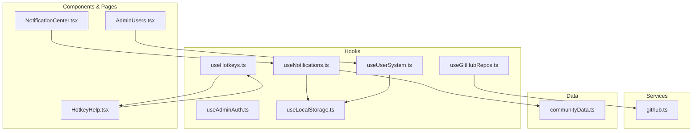
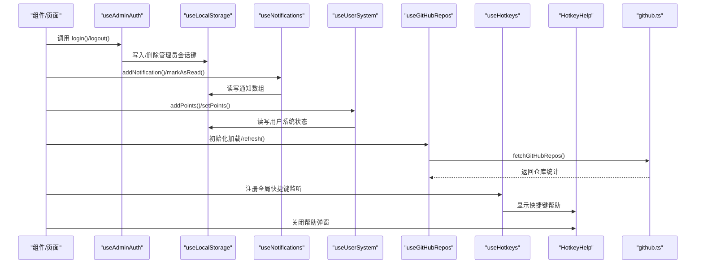
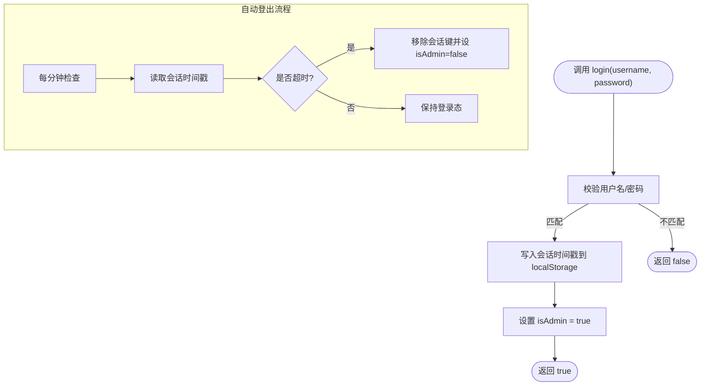
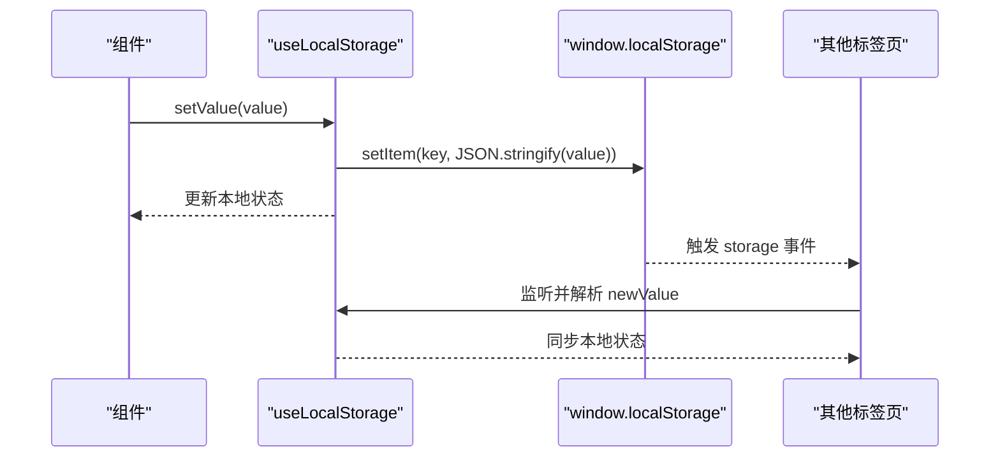
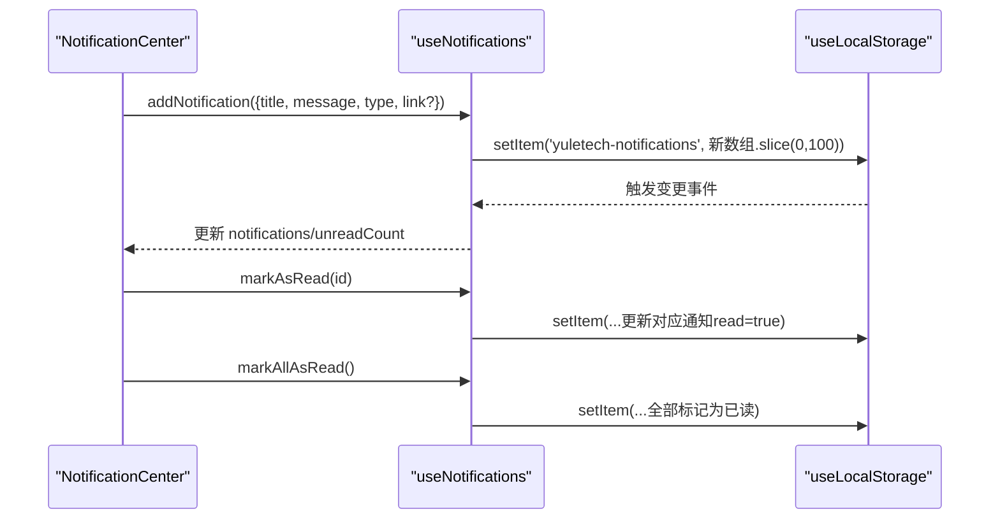
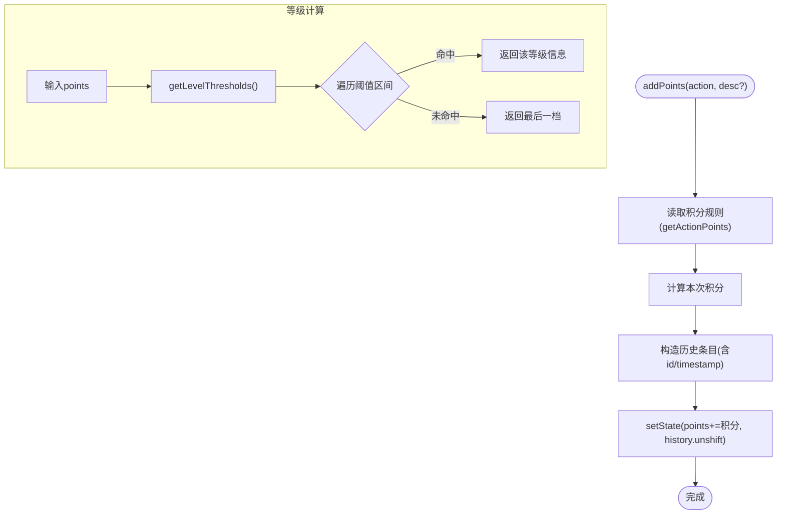
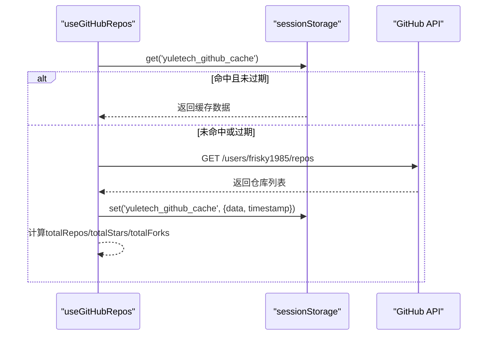
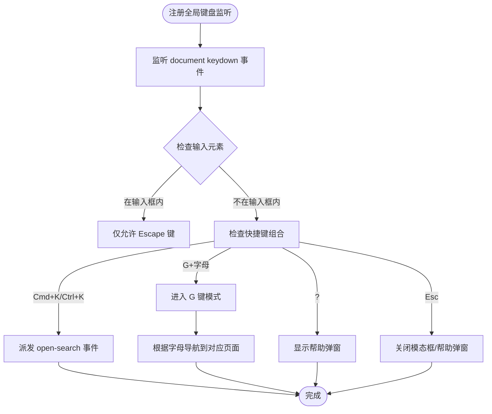
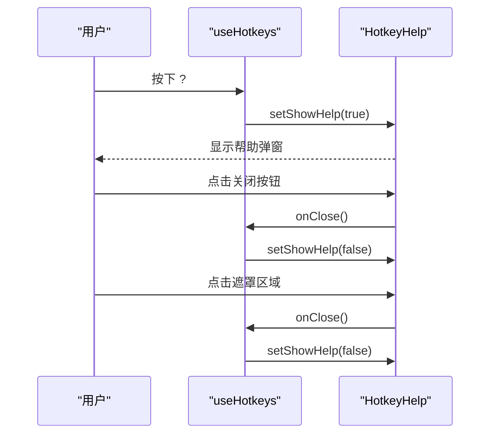
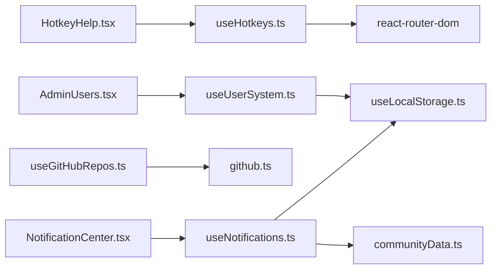

# 自定义Hook

<cite>
**本文引用的文件**
- [useAdminAuth.ts](file://src/hooks/useAdminAuth.ts)
- [useLocalStorage.ts](file://src/hooks/useLocalStorage.ts)
- [useNotifications.ts](file://src/hooks/useNotifications.ts)
- [useUserSystem.ts](file://src/hooks/useUserSystem.ts)
- [useGitHubRepos.ts](file://src/hooks/useGitHubRepos.ts)
- [useHotkeys.ts](file://src/hooks/useHotkeys.ts)
- [HotkeyHelp.tsx](file://src/components/HotkeyHelp.tsx)
- [github.ts](file://src/services/github.ts)
- [communityData.ts](file://src/data/communityData.ts)
- [NotificationCenter.tsx](file://src/components/NotificationCenter.tsx)
- [AdminUsers.tsx](file://src/pages/AdminUsers.tsx)
</cite>

## 更新摘要
**所做更改**
- 新增全局键盘快捷键系统：useHotkeys Hook 和 HotkeyHelp 组件
- 更新架构总览图以包含新的键盘快捷键系统
- 更新依赖关系分析以反映键盘快捷键系统的集成
- 新增键盘快捷键功能的详细使用说明和最佳实践

## 目录
1. [简介](#简介)
2. [项目结构](#项目结构)
3. [核心组件](#核心组件)
4. [架构总览](#架构总览)
5. [详细组件分析](#详细组件分析)
6. [依赖关系分析](#依赖关系分析)
7. [性能考量](#性能考量)
8. [故障排查指南](#故障排查指南)
9. [结论](#结论)
10. [附录](#附录)

## 简介
本文件系统性梳理 YuleTech 社区技术平台的自定义 Hook，重点覆盖以下模块：
- useAdminAuth 管理员认证 Hook：登录验证、会话管理、自动登出
- useLocalStorage 本地存储 Hook：数据持久化与跨标签页同步
- useNotifications 通知系统 Hook：消息推送与状态同步
- useUserSystem 用户系统 Hook：用户积分与等级体系
- useGitHubRepos GitHub 仓库 Hook：数据获取与状态更新
- **新增** useHotkeys 全局键盘快捷键 Hook：Cmd+K 全局搜索、G+字母导航、'?' 帮助等功能

文档提供 API 接口说明、参数与返回值类型、使用场景、最佳实践与常见问题排查，帮助开发者快速理解与集成。

## 项目结构
自定义 Hook 分布于 src/hooks 目录，并通过 src/services 与 src/data 提供外部数据与工具支持；UI 组件通过 src/components 与页面通过 src/pages 使用这些 Hook。

**图表来源**
- [useAdminAuth.ts:1-67](file://src/hooks/useAdminAuth.ts#L1-L67)
- [useLocalStorage.ts:1-60](file://src/hooks/useLocalStorage.ts#L1-L60)
- [useNotifications.ts:1-50](file://src/hooks/useNotifications.ts#L1-L50)
- [useUserSystem.ts:1-135](file://src/hooks/useUserSystem.ts#L1-L135)
- [useGitHubRepos.ts:1-45](file://src/hooks/useGitHubRepos.ts#L1-L45)
- [useHotkeys.ts:1-78](file://src/hooks/useHotkeys.ts#L1-L78)
- [HotkeyHelp.tsx:1-146](file://src/components/HotkeyHelp.tsx#L1-L146)
- [github.ts:1-97](file://src/services/github.ts#L1-L97)
- [communityData.ts:361-363](file://src/data/communityData.ts#L361-L363)
- [NotificationCenter.tsx:1-80](file://src/components/NotificationCenter.tsx#L1-L80)
- [AdminUsers.tsx:1-25](file://src/pages/AdminUsers.tsx#L1-L25)

**章节来源**
- [useAdminAuth.ts:1-67](file://src/hooks/useAdminAuth.ts#L1-L67)
- [useLocalStorage.ts:1-60](file://src/hooks/useLocalStorage.ts#L1-L60)
- [useNotifications.ts:1-50](file://src/hooks/useNotifications.ts#L1-L50)
- [useUserSystem.ts:1-135](file://src/hooks/useUserSystem.ts#L1-L135)
- [useGitHubRepos.ts:1-45](file://src/hooks/useGitHubRepos.ts#L1-L45)
- [useHotkeys.ts:1-78](file://src/hooks/useHotkeys.ts#L1-L78)
- [HotkeyHelp.tsx:1-146](file://src/components/HotkeyHelp.tsx#L1-L146)
- [github.ts:1-97](file://src/services/github.ts#L1-L97)
- [communityData.ts:361-363](file://src/data/communityData.ts#L361-L363)
- [NotificationCenter.tsx:1-80](file://src/components/NotificationCenter.tsx#L1-L80)
- [AdminUsers.tsx:1-25](file://src/pages/AdminUsers.tsx#L1-L25)

## 核心组件
- useAdminAuth：管理员登录态校验、会话有效期控制、自动登出与手动登出
- useLocalStorage：通用本地存储封装，支持跨标签页事件同步
- useNotifications：通知列表、未读计数、新增与标记已读
- useUserSystem：积分增减、历史记录、等级阈值与动态计算
- useGitHubRepos：GitHub 仓库统计与查询，带缓存与错误处理
- **新增** useHotkeys：全局键盘快捷键系统，支持 Cmd+K 搜索、G+字母导航、'?' 帮助等

**章节来源**
- [useAdminAuth.ts:29-66](file://src/hooks/useAdminAuth.ts#L29-L66)
- [useLocalStorage.ts:3-59](file://src/hooks/useLocalStorage.ts#L3-L59)
- [useNotifications.ts:17-49](file://src/hooks/useNotifications.ts#L17-L49)
- [useUserSystem.ts:91-132](file://src/hooks/useUserSystem.ts#L91-L132)
- [useGitHubRepos.ts:13-44](file://src/hooks/useGitHubRepos.ts#L13-L44)
- [useHotkeys.ts:6-77](file://src/hooks/useHotkeys.ts#L6-L77)

## 架构总览
Hook 间协作关系与数据流向如下：

**图表来源**
- [useAdminAuth.ts:50-63](file://src/hooks/useAdminAuth.ts#L50-L63)
- [useLocalStorage.ts:14-25](file://src/hooks/useLocalStorage.ts#L14-L25)
- [useNotifications.ts:20-38](file://src/hooks/useNotifications.ts#L20-L38)
- [useUserSystem.ts:97-118](file://src/hooks/useUserSystem.ts#L97-L118)
- [useGitHubRepos.ts:18-33](file://src/hooks/useGitHubRepos.ts#L18-L33)
- [useHotkeys.ts:10-62](file://src/hooks/useHotkeys.ts#L10-L62)
- [HotkeyHelp.tsx:84-145](file://src/components/HotkeyHelp.tsx#L84-L145)
- [github.ts:52-80](file://src/services/github.ts#L52-L80)

## 详细组件分析

### useAdminAuth 管理员认证 Hook
- 设计理念
  - 基于 localStorage 存储管理员登录时间戳，结合固定会话时长进行有效性判断
  - 后台定时轮询检查会话是否过期，过期则自动清除并标记未登录
- 关键行为
  - 登录：用户名/密码匹配时写入当前时间戳，标记已登录
  - 登出：移除存储项并标记未登录
  - 自动登出：每分钟检查一次，超时则清理并重置
- API
  - 返回值：{ isAdmin: boolean, login(username, password): boolean, logout(): void }
- 使用场景
  - 管理后台登录页校验
  - 页面级权限控制（如 AdminDashboard）
  - 会话过期自动跳转登录页

**图表来源**
- [useAdminAuth.ts:12-27](file://src/hooks/useAdminAuth.ts#L12-L27)
- [useAdminAuth.ts:35-48](file://src/hooks/useAdminAuth.ts#L35-L48)
- [useAdminAuth.ts:50-63](file://src/hooks/useAdminAuth.ts#L50-L63)

**章节来源**
- [useAdminAuth.ts:29-66](file://src/hooks/useAdminAuth.ts#L29-L66)

### useLocalStorage 本地存储 Hook
- 设计理念
  - 封装 localStorage 读写，提供初始值回退与异常捕获
  - 通过 storage 事件与自定义事件实现跨标签页同步
- API
  - 参数：key: string, initialValue: T
  - 返回：[storedValue: T, setValue: (value | (prev)=>value) => void]
- 行为特性
  - 初次渲染从 localStorage 解析值，失败则使用初始值
  - setValue 支持函数式更新，写入 localStorage 并广播变更事件
  - 监听 storage 与自定义事件，当监听到自身 key 变更时同步本地状态
- 使用场景
  - 任意需要持久化的 UI 状态或用户偏好
  - 作为其他 Hook 的底层存储（如通知、用户系统）

**图表来源**
- [useLocalStorage.ts:14-25](file://src/hooks/useLocalStorage.ts#L14-L25)
- [useLocalStorage.ts:27-56](file://src/hooks/useLocalStorage.ts#L27-L56)

**章节来源**
- [useLocalStorage.ts:3-59](file://src/hooks/useLocalStorage.ts#L3-L59)

### useNotifications 通知系统 Hook
- 设计理念
  - 基于 useLocalStorage 维护通知数组，支持新增、标记已读、批量已读与未读计数
  - 通知类型枚举化，统一标题、消息、链接等字段
- API
  - 返回值：{
      notifications: Notification[]
      unreadCount: number
      addNotification(notification): void
      markAsRead(id): void
      markAllAsRead(): void
    }
- 数据模型
  - Notification: { id, type, title, message, read, createdAt, link? }
  - NotificationType: 'reply' | 'answer' | 'event_start' | 'points_change'
- 使用场景
  - 论坛回复、问答、活动开始、积分变动等事件推送
  - 通知中心组件展示与交互

**图表来源**
- [useNotifications.ts:17-49](file://src/hooks/useNotifications.ts#L17-L49)
- [useNotifications.ts:20-38](file://src/hooks/useNotifications.ts#L20-L38)
- [useLocalStorage.ts:14-25](file://src/hooks/useLocalStorage.ts#L14-L25)
- [communityData.ts:361-363](file://src/data/communityData.ts#L361-L363)
- [NotificationCenter.tsx:14-36](file://src/components/NotificationCenter.tsx#L14-L36)

**章节来源**
- [useNotifications.ts:5-49](file://src/hooks/useNotifications.ts#L5-L49)
- [communityData.ts:361-363](file://src/data/communityData.ts#L361-L363)
- [NotificationCenter.tsx:1-80](file://src/components/NotificationCenter.tsx#L1-L80)

### useUserSystem 用户系统 Hook
- 设计理念
  - 统一管理用户积分与历史记录，支持动态调整积分规则与等级阈值
  - 等级根据累计积分落在不同区间，提供等级标题与范围
- API
  - 返回值：{
      points: number
      history: PointsHistoryItem[]
      level: number
      title: string
      min: number
      max: number
      addPoints(action, description?): void
      setPoints(points): void
    }
- 数据模型
  - PointsAction: 'post' | 'reply' | 'answer' | 'accepted' | 'event'
  - PointsHistoryItem: { id, action, description, points, timestamp }
- 规则与阈值
  - 默认积分规则与中文描述可通过本地存储覆盖
  - 等级阈值默认四档，可从本地存储读取并兼容边界
- 使用场景
  - 社区互动积分发放
  - 等级徽章与排行榜展示
  - 管理员手动调整积分

**图表来源**
- [useUserSystem.ts:97-118](file://src/hooks/useUserSystem.ts#L97-L118)
- [useUserSystem.ts:36-47](file://src/hooks/useUserSystem.ts#L36-L47)
- [useUserSystem.ts:63-89](file://src/hooks/useUserSystem.ts#L63-L89)

**章节来源**
- [useUserSystem.ts:1-135](file://src/hooks/useUserSystem.ts#L1-L135)

### useGitHubRepos GitHub 仓库 Hook
- 设计理念
  - 拉取指定用户的公开仓库，聚合总数、星数、叉数与仓库列表
  - 使用 sessionStorage 缓存 5 分钟，避免频繁请求
  - 提供按模块名查找仓库的辅助方法
- API
  - 返回值：{
      stats: GitHubStats | null
      loading: boolean
      error: string | null
      refresh(): Promise<void>
      findRepo(moduleName): GitHubRepo | undefined
    }
- 数据模型
  - GitHubRepo: { name, full_name, html_url, description, stargazers_count, forks_count, updated_at, language }
  - GitHubStats: { totalRepos, totalStars, totalForks, repos }
- 使用场景
  - 开源页面展示仓库统计
  - 模块详情页根据模块名定位仓库

**图表来源**
- [useGitHubRepos.ts:18-33](file://src/hooks/useGitHubRepos.ts#L18-L33)
- [github.ts:28-50](file://src/services/github.ts#L28-L50)
- [github.ts:52-80](file://src/services/github.ts#L52-L80)

**章节来源**
- [useGitHubRepos.ts:1-45](file://src/hooks/useGitHubRepos.ts#L1-L45)
- [github.ts:1-97](file://src/services/github.ts#L1-L97)

### useHotkeys 全局键盘快捷键系统
- 设计理念
  - 提供全局键盘快捷键监听，支持跨组件共享快捷键状态
  - 通过自定义事件与路由导航实现快捷键功能解耦
  - 集成帮助弹窗组件，提供快捷键提示
- 快捷键功能
  - Cmd+K/Ctrl+K：打开全局搜索
  - G+O：导航到开源页面
  - G+T：导航到工具链页面  
  - G+L：导航到学习页面
  - G+B：导航到博客页面
  - G+D：导航到文档页面
  - G+H：导航到硬件页面
  - ?：显示快捷键帮助
  - Esc：关闭模态框/帮助弹窗
- API
  - 返回值：{ showHelp: boolean, setShowHelp: (boolean) => void }
- 事件通信
  - 打开搜索：document.dispatchEvent(new CustomEvent('open-search'))
  - 关闭模态框：document.dispatchEvent(new CustomEvent('close-modal'))
- 使用场景
  - 提升用户体验的键盘导航
  - 快速访问常用功能页面
  - 辅助功能支持

**图表来源**
- [useHotkeys.ts:10-62](file://src/hooks/useHotkeys.ts#L10-L62)
- [useHotkeys.ts:64-74](file://src/hooks/useHotkeys.ts#L64-L74)

**章节来源**
- [useHotkeys.ts:1-78](file://src/hooks/useHotkeys.ts#L1-L78)

### HotkeyHelp 快捷键帮助组件
- 设计理念
  - 提供快捷键功能的可视化帮助界面
  - 支持键盘快捷键与鼠标点击两种关闭方式
  - 使用语义化标签和无障碍设计
- 功能特性
  - 固定居中布局，半透明背景遮罩
  - 响应式设计，适配移动端显示
  - 支持点击遮罩区域关闭
  - 包含所有可用快捷键的完整列表
- 使用场景
  - 首次使用时的快捷键介绍
  - 快捷键查询与复习
  - 用户引导与帮助

**图表来源**
- [HotkeyHelp.tsx:84-145](file://src/components/HotkeyHelp.tsx#L84-L145)
- [useHotkeys.ts:51-61](file://src/hooks/useHotkeys.ts#L51-L61)

**章节来源**
- [HotkeyHelp.tsx:1-146](file://src/components/HotkeyHelp.tsx#L1-L146)

## 依赖关系分析
- useNotifications 依赖 useLocalStorage 与 communityData 的 ID 生成
- useUserSystem 依赖 useLocalStorage 与本地存储的规则/阈值
- useGitHubRepos 依赖 github.ts 的网络请求与缓存逻辑
- **新增** useHotkeys 依赖 react-router-dom 的导航功能
- **新增** HotkeyHelp 依赖 useHotkeys 的状态管理
- UI 组件通过 NotificationCenter、AdminUsers、HotkeyHelp 使用上述 Hook

**图表来源**
- [useNotifications.ts:1-3](file://src/hooks/useNotifications.ts#L1-L3)
- [useUserSystem.ts:1-3](file://src/hooks/useUserSystem.ts#L1-L3)
- [useGitHubRepos.ts:1-3](file://src/hooks/useGitHubRepos.ts#L1-L3)
- [useHotkeys.ts:1-2](file://src/hooks/useHotkeys.ts#L1-L2)
- [HotkeyHelp.tsx:1-2](file://src/components/HotkeyHelp.tsx#L1-L2)
- [github.ts:1-3](file://src/services/github.ts#L1-L3)
- [communityData.ts:361-363](file://src/data/communityData.ts#L361-L363)
- [NotificationCenter.tsx:1-5](file://src/components/NotificationCenter.tsx#L1-L5)
- [AdminUsers.tsx:1-4](file://src/pages/AdminUsers.tsx#L1-L4)

**章节来源**
- [useNotifications.ts:1-3](file://src/hooks/useNotifications.ts#L1-L3)
- [useUserSystem.ts:1-3](file://src/hooks/useUserSystem.ts#L1-L3)
- [useGitHubRepos.ts:1-3](file://src/hooks/useGitHubRepos.ts#L1-L3)
- [useHotkeys.ts:1-2](file://src/hooks/useHotkeys.ts#L1-L2)
- [HotkeyHelp.tsx:1-2](file://src/components/HotkeyHelp.tsx#L1-L2)
- [github.ts:1-3](file://src/services/github.ts#L1-L3)
- [communityData.ts:361-363](file://src/data/communityData.ts#L361-L363)
- [NotificationCenter.tsx:1-5](file://src/components/NotificationCenter.tsx#L1-L5)
- [AdminUsers.tsx:1-4](file://src/pages/AdminUsers.tsx#L1-L4)

## 性能考量
- useGitHubRepos
  - 使用 sessionStorage 缓存 5 分钟，降低 API 调用频率
  - 首次加载时仅一次请求，后续刷新需显式调用 refresh
- useLocalStorage
  - setValue 后广播事件，避免重复渲染与跨标签页同步开销
  - 读取失败使用初始值，保证稳定性
- useNotifications
  - 通知列表最多保留 100 条，防止内存膨胀
- useUserSystem
  - 等级阈值与积分规则从本地存储读取，避免重复计算
  - 历史记录采用头插法，便于展示最新记录
- **新增** useHotkeys
  - 使用单例监听器，避免重复绑定导致的内存泄漏
  - 通过防抖和一次性监听器优化性能
  - 仅在需要时显示帮助弹窗，减少不必要的渲染

## 故障排查指南
- 管理员登录无效
  - 检查用户名/密码常量与传参是否一致
  - 确认 localStorage 可用且未被浏览器隐私模式禁用
  - 查看自动登出定时器是否正常运行
- 通知不显示或未更新
  - 确认通知数组长度未超过上限
  - 检查跨标签页事件是否触发（storage 与自定义事件）
- 积分/等级异常
  - 检查本地存储的积分规则与等级阈值格式是否正确
  - 确认 points 未出现负值（setPoints 有最小值约束）
- GitHub 仓库数据不更新
  - 清除 sessionStorage 缓存或等待 5 分钟过期
  - 检查网络请求是否返回 2xx，错误信息会写入 error 字段
- **新增** 快捷键不响应
  - 检查浏览器是否阻止了键盘事件监听
  - 确认输入框元素不会拦截快捷键事件（Esc 键除外）
  - 验证自定义事件是否正确派发和接收
  - 检查路由配置是否正确，导航目标是否存在

**章节来源**
- [useAdminAuth.ts:50-63](file://src/hooks/useAdminAuth.ts#L50-L63)
- [useNotifications.ts:20-38](file://src/hooks/useNotifications.ts#L20-L38)
- [useUserSystem.ts:113-118](file://src/hooks/useUserSystem.ts#L113-L118)
- [useGitHubRepos.ts:18-29](file://src/hooks/useGitHubRepos.ts#L18-L29)
- [github.ts:52-67](file://src/services/github.ts#L52-L67)
- [useHotkeys.ts:10-62](file://src/hooks/useHotkeys.ts#L10-L62)

## 结论
上述 Hook 形成完整的前端状态与数据层：认证、本地持久化、通知、用户系统、外部数据获取和**新增的全局键盘快捷键系统**。它们通过清晰的 API 与稳定的依赖关系，支撑社区平台的核心功能。新增的键盘快捷键系统进一步提升了用户体验，提供了高效的操作方式。建议在业务组件中统一通过这些 Hook 管理状态，遵循本文的最佳实践，确保一致性与可维护性。

## 附录

### API 接口说明与返回值类型

- useAdminAuth
  - 输入：login(username: string, password: string) -> boolean
  - 输出：{ isAdmin: boolean, login, logout }
- useLocalStorage
  - 输入：useLocalStorage<T>(key: string, initialValue: T)
  - 输出：[T, (value | (prev)=>value)=>void]
- useNotifications
  - 输入：addNotification(notification: Omit<Notification,'id'|'read'|'createdAt'>)
  - 输出：{ notifications: Notification[], unreadCount: number, addNotification, markAsRead, markAllAsRead }
- useUserSystem
  - 输入：addPoints(action: PointsAction, description?: string), setPoints(points: number)
  - 输出：{ points, history, level, title, min, max, addPoints, setPoints }
- useGitHubRepos
  - 输入：无（内部自动加载），refresh()
  - 输出：{ stats: GitHubStats|null, loading: boolean, error: string|null, refresh, findRepo }
- **新增** useHotkeys
  - 输入：无（自动注册全局监听）
  - 输出：{ showHelp: boolean, setShowHelp: (boolean) => void }
  - 快捷键事件：open-search（打开搜索）、close-modal（关闭模态框）

**章节来源**
- [useAdminAuth.ts:29-66](file://src/hooks/useAdminAuth.ts#L29-L66)
- [useLocalStorage.ts:3-59](file://src/hooks/useLocalStorage.ts#L3-L59)
- [useNotifications.ts:17-49](file://src/hooks/useNotifications.ts#L17-L49)
- [useUserSystem.ts:91-132](file://src/hooks/useUserSystem.ts#L91-L132)
- [useGitHubRepos.ts:13-44](file://src/hooks/useGitHubRepos.ts#L13-L44)
- [useHotkeys.ts:6-77](file://src/hooks/useHotkeys.ts#L6-L77)

### 最佳实践
- 认证与会话
  - 登录成功后立即设置 isAdmin，避免二次渲染延迟
  - 定时器仅在挂载时创建，卸载时清理
- 本地存储
  - 对外暴露的 key 建议统一前缀，避免命名冲突
  - setValue 使用函数式更新，避免并发写入丢失
- 通知系统
  - 控制通知数量上限，定期清理旧通知
  - 未读计数用于 UI 提示，注意批量已读操作
- 用户系统
  - 积分规则与等级阈值通过本地存储动态配置，便于运营调整
  - 历史记录按时间倒序展示，首屏加载时可截断长度
- GitHub 仓库
  - 首次渲染即触发加载，避免空白状态
  - 提供 refresh 方法应对缓存过期或数据变更
- **新增** 全局键盘快捷键
  - 在应用根组件中注册 useHotkeys，确保全局可用
  - 避免与浏览器默认快捷键冲突，如 Ctrl+W
  - 在输入表单中合理处理键盘事件，避免影响用户输入
  - 使用语义化的方式处理焦点管理，提升无障碍体验
  - 通过 HotkeyHelp 组件提供快捷键提示，改善用户体验