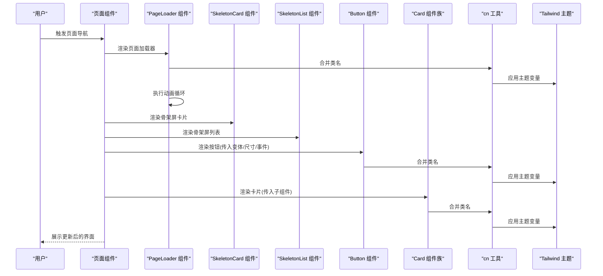
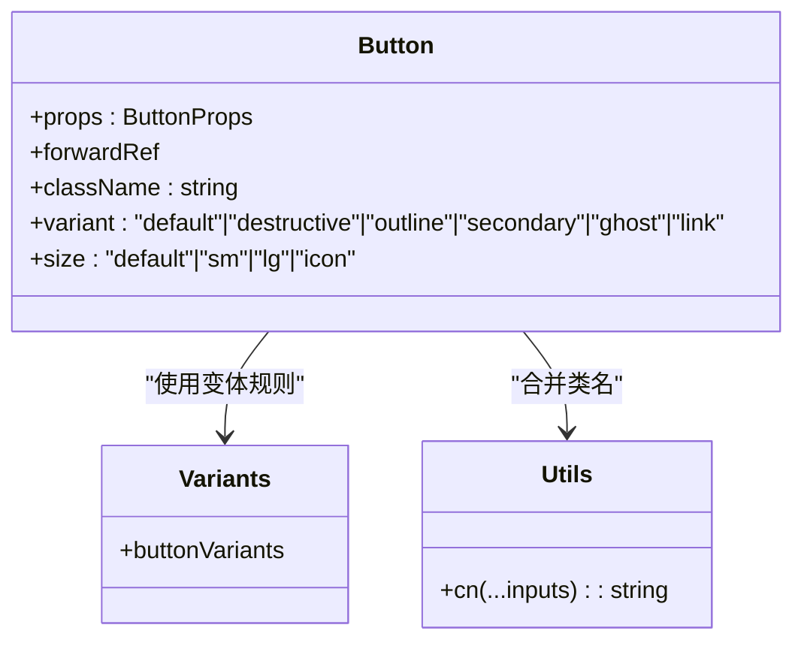
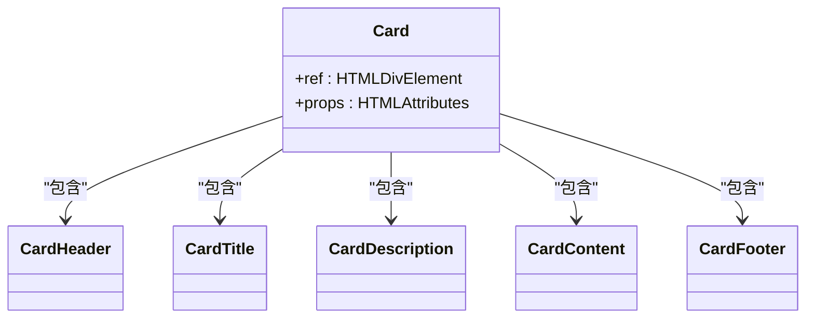
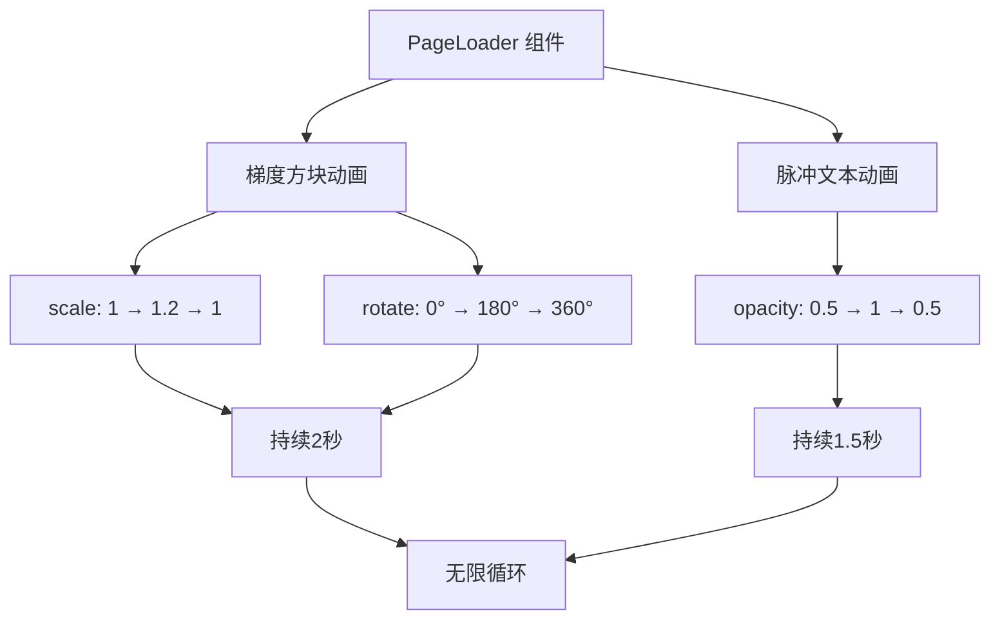
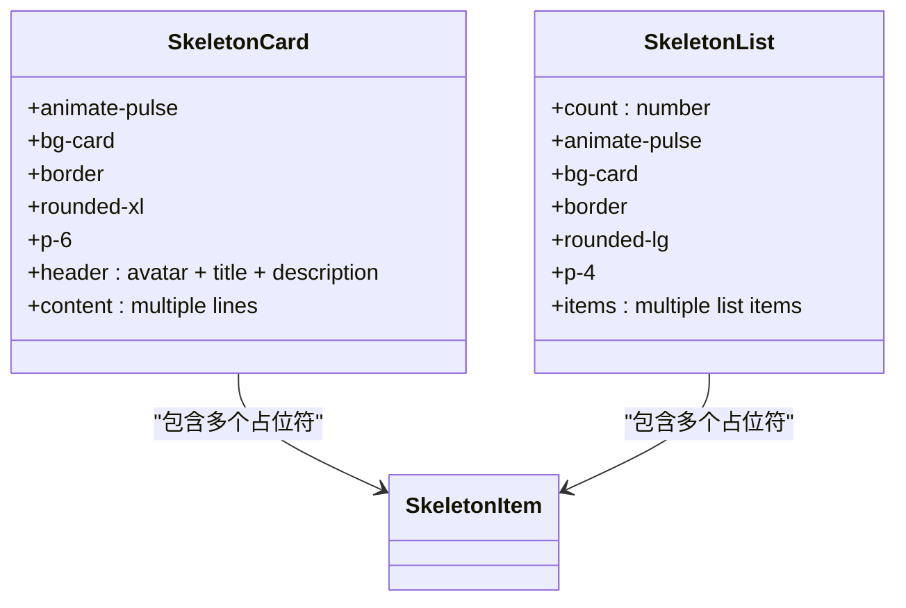
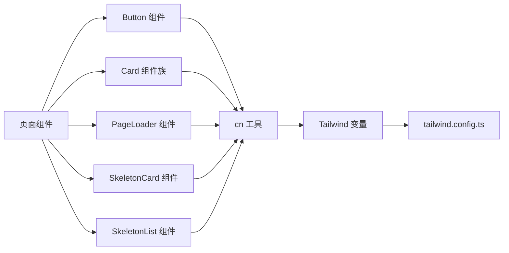

# UI基础组件

<cite>
**本文档引用的文件**
- [button.tsx](file://src/components/ui/button.tsx)
- [card.tsx](file://src/components/ui/card.tsx)
- [PageLoader.tsx](file://src/components/PageLoader.tsx)
- [PageLoader.js](file://apps/shell/src/components/PageLoader.js)
- [utils.ts](file://src/lib/utils.ts)
- [tailwind.config.ts](file://tailwind.config.ts)
- [App.tsx](file://src/App.tsx)
- [AdminLoginPage.tsx](file://src/pages/AdminLoginPage.tsx)
- [DownloadPage.tsx](file://src/pages/DownloadPage.tsx)
- [CommunityPage.tsx](file://src/pages/CommunityPage.tsx)
- [HardwarePage.tsx](file://archive/src/pages/HardwarePage.tsx)
- [DailyCodeWidget.tsx](file://src/components/DailyCodeWidget.tsx)
- [ThemeToggle.tsx](file://src/components/ThemeToggle.tsx)
- [ThemeContext.tsx](file://src/contexts/ThemeContext.tsx)
- [OfflineIndicator.tsx](file://src/components/OfflineIndicator.tsx)
- [BSWConfigurator.tsx](file://src/components/BSWConfigurator.tsx)
- [CodeSearch.tsx](file://src/components/CodeSearch.tsx)
</cite>

## 更新摘要
**所做更改**
- 新增 PageLoader 页面加载器组件的详细文档，包含动画梯度方块、连续旋转和脉冲透明度效果
- 新增 SkeletonCard 和 SkeletonList 骨架屏组件的完整文档
- 更新路由懒加载机制的使用说明
- 扩展了页面加载和骨架屏的最佳实践指导

## 目录
1. [简介](#简介)
2. [项目结构](#项目结构)
3. [核心组件](#核心组件)
4. [架构总览](#架构总览)
5. [详细组件分析](#详细组件分析)
6. [依赖关系分析](#依赖关系分析)
7. [性能考量](#性能考量)
8. [故障排查指南](#故障排查指南)
9. [结论](#结论)
10. [附录](#附录)

## 简介
本文件系统性梳理并文档化本仓库中的UI基础组件，重点覆盖按钮(Button)、卡片(Card)两大核心组件，以及新增的页面加载器(PageLoader)和骨架屏(Skeleton)组件。文档同时涵盖输入(Input)、选择器(Select)等基础交互形态，给出API说明、样式变体、交互状态、响应式与无障碍支持建议，以及可复用的最佳实践与扩展思路。文档展示组件在真实页面中的使用方式，帮助开发者正确使用与扩展这些基础组件。

## 项目结构
UI基础组件主要位于 src/components/ui 目录下，配合 Tailwind CSS 变量系统与 cn 工具函数实现一致的样式与类名合并策略；页面层通过直接引入组件或使用语义化类名组合出复杂界面。新增的 PageLoader 和骨架屏组件为用户体验提供了更好的加载状态反馈。

```mermaid
graph TB
subgraph "核心UI组件"
BTN["Button 组件<br/>src/components/ui/button.tsx"]
CARD["Card 组件族<br/>src/components/ui/card.tsx"]
END
subgraph "加载与骨架屏组件"
PLOAD["PageLoader 页面加载器<br/>src/components/PageLoader.tsx"]
SCARD["SkeletonCard 骨架屏卡片<br/>src/components/PageLoader.tsx"]
SLIST["SkeletonList 骨架屏列表<br/>src/components/PageLoader.tsx"]
END
subgraph "样式与工具"
UTILS["cn 合并工具<br/>src/lib/utils.ts"]
TWCFG["Tailwind 配置<br/>tailwind.config.ts"]
END
subgraph "页面与示例"
APP["应用入口<br/>src/App.tsx"]
DL["下载页示例<br/>src/pages/DownloadPage.tsx"]
COMM["社区页示例<br/>src/pages/CommunityPage.tsx"]
HW["硬件页示例<br/>archive/src/pages/HardwarePage.tsx"]
LOGIN["登录页输入示例<br/>src/pages/AdminLoginPage.tsx"]
THEME["主题切换组件<br/>src/components/ThemeToggle.tsx"]
END
BTN --> UTILS
CARD --> UTILS
PLOAD --> UTILS
SCARD --> UTILS
SLIST --> UTILS
UTILS --> TWCFG
APP --> BTN
APP --> CARD
APP --> PLOAD
APP --> SCARD
APP --> SLIST
DL --> CARD
COMM --> CARD
HW --> CARD
LOGIN --> UTILS
THEME --> TWCFG
```

**图表来源**
- [button.tsx:1-49](file://src/components/ui/button.tsx#L1-L49)
- [card.tsx:1-47](file://src/components/ui/card.tsx#L1-L47)
- [PageLoader.tsx:1-67](file://src/components/PageLoader.tsx#L1-L67)
- [utils.ts:1-7](file://src/lib/utils.ts#L1-L7)
- [tailwind.config.ts:1-79](file://tailwind.config.ts#L1-L79)
- [App.tsx:1-123](file://src/App.tsx#L1-L123)

**章节来源**
- [button.tsx:1-49](file://src/components/ui/button.tsx#L1-L49)
- [card.tsx:1-47](file://src/components/ui/card.tsx#L1-L47)
- [PageLoader.tsx:1-67](file://src/components/PageLoader.tsx#L1-L67)
- [utils.ts:1-7](file://src/lib/utils.ts#L1-L7)
- [tailwind.config.ts:1-79](file://tailwind.config.ts#L1-L79)
- [App.tsx:1-123](file://src/App.tsx#L1-L123)

## 核心组件
本节聚焦 Button、Card、PageLoader 和 Skeleton 三大核心组件群，说明设计理念、样式变体、交互状态与可扩展性。

- Button 组件
  - 设计理念：以 class-variance-authority 提供变体与尺寸的声明式组合，统一交互态（悬停、焦点、禁用），通过 cn 合并传入的自定义类名，保证与 Tailwind 主题变量一致。
  - 样式变体：默认(default)、破坏性(destructive)、描边(outline)、次级(secondary)、幽灵(ghost)、链接(link)。
  - 尺寸变体：默认(default)、小(sm)、大(lg)、图标(icon)。
  - 交互状态：聚焦可见环(focus-visible ring)、禁用态(disabled)、悬停(hover)。
  - 可扩展性：通过 Variants 接口扩展新变体；通过传入 className 覆盖局部样式。

- Card 组件族
  - 设计理念：以语义化子组件组织卡片结构，提供 Header/Title/Description/Content/Footer 等模块化片段，便于灵活拼装。
  - 样式基线：圆角、边框、背景、阴影、前景色均来自主题变量，确保深浅色一致体验。
  - 结构化布局：Header/Content/Footer 明确内容分区；Title/Description 控制层级与对比度。

- PageLoader 页面加载器
  - 设计理念：使用 Framer Motion 创建流畅的动画效果，包含梯度背景方块的缩放旋转动画和脉冲透明度效果，提供现代化的加载体验。
  - 动画特性：梯度方块连续旋转(180°→360°)、缩放变换(1→1.2→1)、透明度脉冲(0.5→1→0.5)，所有动画无限循环播放。
  - 响应式设计：全屏高度适配，居中布局，支持不同屏幕尺寸。

- Skeleton 骨架屏组件族
  - 设计理念：使用 animate-pulse 实现骨架屏效果，模拟内容加载过程中的占位符，提升用户体验。
  - SkeletonCard：完整的卡片骨架屏，包含头像、标题、描述和内容区域的占位符。
  - SkeletonList：列表形式的骨架屏，支持可配置的数量参数，适合列表页面的加载状态。

**章节来源**
- [button.tsx:31-49](file://src/components/ui/button.tsx#L31-L49)
- [card.tsx:4-46](file://src/components/ui/card.tsx#L4-L46)
- [PageLoader.tsx:3-29](file://src/components/PageLoader.tsx#L3-L29)
- [PageLoader.tsx:31-66](file://src/components/PageLoader.tsx#L31-L66)

## 架构总览
UI基础组件与页面层的协作关系如下：



**图表来源**
- [PageLoader.tsx:3-29](file://src/components/PageLoader.tsx#L3-L29)
- [PageLoader.tsx:31-66](file://src/components/PageLoader.tsx#L31-L66)
- [button.tsx:35-46](file://src/components/ui/button.tsx#L35-L46)
- [card.tsx:4-46](file://src/components/ui/card.tsx#L4-L46)
- [utils.ts:4-6](file://src/lib/utils.ts#L4-L6)
- [tailwind.config.ts:18-73](file://tailwind.config.ts#L18-L73)

## 详细组件分析

### Button 按钮组件
- 设计要点
  - 使用 Variants 定义变体与尺寸，集中管理视觉与尺寸差异。
  - 通过 forwardRef 透传 ref，兼容原生 button 属性与事件。
  - 与 cn 工具配合，确保传入 className 与默认类名合并时无冲突。
- 样式变体与尺寸
  - 变体：default、destructive、outline、secondary、ghost、link。
  - 尺寸：default、sm、lg、icon。
- 交互状态
  - 焦点可见环：focus-visible:outline-none + focus-visible:ring-2。
  - 禁用态：disabled:pointer-events-none + disabled:opacity-50。
  - 悬停态：各变体 hover 效果由变体规则定义。
- API 概览
  - 属性：className、variant、size，继承自原生 button。
  - 事件：onClick、onFocus、onBlur 等原生事件均可透传。
  - 默认值：variant/default、size/default。
- 使用示例与场景
  - 登录页密码可见切换按钮：用于切换输入类型与显示隐藏图标。
  - 下载页卡片底部操作按钮：用于触发下载动作。
  - 主题切换下拉菜单项按钮：用于切换主题。
- 最佳实践
  - 优先使用变体表达语义（如 destructive 表达危险操作）。
  - 图标按钮请使用 icon 尺寸并设置 aria-label。
  - 禁用态需明确提示，避免误触。



**图表来源**
- [button.tsx:31-49](file://src/components/ui/button.tsx#L31-L49)
- [utils.ts:4-6](file://src/lib/utils.ts#L4-L6)

**章节来源**
- [button.tsx:5-29](file://src/components/ui/button.tsx#L5-L29)
- [button.tsx:31-49](file://src/components/ui/button.tsx#L31-L49)
- [AdminLoginPage.tsx:88-96](file://src/pages/AdminLoginPage.tsx#L88-L96)
- [DownloadPage.tsx:227-228](file://src/pages/DownloadPage.tsx#L227-L228)
- [ThemeToggle.tsx:64-70](file://src/components/ThemeToggle.tsx#L64-L70)

### Card 卡片组件族
- 设计要点
  - 子组件解耦：Header/Title/Description/Content/Footer 各司其职，便于按需组合。
  - 语义化结构：Title/Description 采用合适的语义标签与字号权重，提升可读性与无障碍友好度。
  - 主题一致性：统一使用 card、foreground、border、shadow 等主题变量。
- 组件清单
  - Card：容器根元素。
  - CardHeader：卡片头部容器，控制内边距与间距。
  - CardTitle：标题，强调层级与字重。
  - CardDescription：描述文本，弱化对比度。
  - CardContent：主体内容区，控制上边距。
  - CardFooter：底部操作区，对齐与留白。
- 使用示例与场景
  - 社区页教程卡片：标题+描述+外部链接图标组合。
  - 下载页资源卡片：图标+名称+版本+描述+操作按钮组合。
  - 硬件页教程卡片：标题+描述+外部链接图标组合。
- 最佳实践
  - 标题与描述应有清晰的层级关系，避免滥用粗体或过小字号。
  - 内容区与操作区分离，Footer 中放置操作按钮组。
  - 在列表中使用卡片时，保持统一的内边距与阴影策略。



**图表来源**
- [card.tsx:4-46](file://src/components/ui/card.tsx#L4-L46)

**章节来源**
- [card.tsx:4-46](file://src/components/ui/card.tsx#L4-L46)
- [CommunityPage.tsx:136-150](file://src/pages/CommunityPage.tsx#L136-L150)
- [DownloadPage.tsx:207-228](file://src/pages/DownloadPage.tsx#L207-L228)
- [HardwarePage.tsx:136-150](file://archive/src/pages/HardwarePage.tsx#L136-L150)

### PageLoader 页面加载器
- 设计要点
  - 使用 Framer Motion 创建复杂的动画效果，包含梯度背景方块的缩放和旋转动画。
  - 文本采用脉冲透明度动画，营造动态加载感。
  - 响应式布局：全屏高度适配，居中对齐，支持不同设备尺寸。
- 动画特性
  - 梯度方块动画：scale [1, 1.2, 1]（缩放）、rotate [0, 180, 360]（旋转），持续2秒，无限循环，easeInOut 缓动。
  - 文本脉冲：opacity [0.5, 1, 0.5]，持续1.5秒，无限循环。
- 样式设计
  - 使用主题变量：from-[hsl(var(--primary))] to-[hsl(var(--accent))] 创建渐变背景。
  - 背景使用 bg-background，文本使用 text-muted-foreground。
- 使用场景
  - 路由懒加载时的页面级加载状态。
  - 页面首次渲染时的加载指示器。
  - 异步数据加载时的页面遮罩。
- 最佳实践
  - 在 Suspense 边界中使用，确保路由切换时的平滑过渡。
  - 避免在移动端使用过于复杂的动画，影响性能。
  - 与骨架屏组件配合使用，提供更丰富的加载体验。



**图表来源**
- [PageLoader.tsx:7-28](file://src/components/PageLoader.tsx#L7-L28)

**章节来源**
- [PageLoader.tsx:3-29](file://src/components/PageLoader.tsx#L3-L29)
- [App.tsx:40-75](file://src/App.tsx#L40-L75)
- [PageLoader.js:3-5](file://apps/shell/src/components/PageLoader.js#L3-L5)

### Skeleton 骨架屏组件族
- 设计理念
  - 使用 animate-pulse 实现骨架屏效果，模拟内容加载过程中的占位符。
  - 通过 bg-muted 创建灰色占位符，与卡片背景形成对比。
  - 支持不同尺寸的占位符，模拟真实内容的布局结构。
- SkeletonCard 组件
  - 结构：头像占位符 + 标题占位符 + 描述占位符 + 内容占位符。
  - 尺寸：头像 12×12，标题 1/3 宽度，描述 1/2 宽度，内容多行。
  - 样式：使用 bg-card、border、rounded-xl、p-6 等卡片样式。
- SkeletonList 组件
  - 结构：多个列表项，每项包含头像、标题、描述。
  - 可配置：count 参数控制列表项数量，默认5个。
  - 尺寸：头像 10×10，标题 1/4 宽度，描述 1/3 宽度。
  - 样式：使用 bg-card、border、rounded-lg、p-4 等列表项样式。
- 使用场景
  - 列表页面的数据加载状态。
  - API 请求时的内容占位。
  - 需要预览内容布局的场景。
- 最佳实践
  - 与实际内容布局保持一致的比例关系。
  - 避免使用过多的占位符，影响加载速度。
  - 与 PageLoader 组件配合使用，提供完整的加载体验。



**图表来源**
- [PageLoader.tsx:32-48](file://src/components/PageLoader.tsx#L32-L48)
- [PageLoader.tsx:50-66](file://src/components/PageLoader.tsx#L50-L66)

**章节来源**
- [PageLoader.tsx:31-66](file://src/components/PageLoader.tsx#L31-L66)

### 输入与选择器（Input/Select）
- 输入(Input)
  - 登录页密码输入：支持切换可见性，带前缀图标与右侧显隐按钮，使用 focus-ring 强化焦点反馈。
  - 活动页多处表单输入：统一使用 bg/background、border/border、rounded、text/sm 等语义化类名。
- 选择器(Select)
  - 项目中未发现独立 Select 组件实现，但存在多处表单输入与下拉菜单组合使用场景（如主题切换下拉菜单）。建议基于现有 Button/Dialog/Card 组件组合实现 Select，或引入第三方库并在主题变量下统一样式。
- 最佳实践
  - 输入框统一使用 focus-visible ring 与 focus-ring，确保键盘可达性。
  - 图标与输入组合时，注意垂直居中与左右内边距协调。
  - 多字段表单建议使用 Grid 或 Flex 布局，保持对齐与间距一致。

**章节来源**
- [AdminLoginPage.tsx:77-96](file://src/pages/AdminLoginPage.tsx#L77-L96)
- [EventsPage.tsx:426-472](file://archive/src/pages/EventsPage.tsx#L426-L472)
- [ThemeToggle.tsx:59-70](file://src/components/ThemeToggle.tsx#L59-L70)

### 对话框(Dialog)
- 项目现状
  - 未在 src/components/ui 中发现独立 Dialog 组件实现。主题切换组件使用了浮层菜单，可作为对话框样式的参考实现。
- 建议实现
  - 基于 Portal 与遮罩层实现模态对话框，支持 ESC 关闭、点击遮罩关闭、Tab 循环焦点。
  - 使用 Card 组件作为对话框主体，结合 Header/Title/Content/Footer 组织结构。
  - 通过 CSS 动画实现淡入淡出与缩放过渡，提升交互质感。
- 最佳实践
  - 对话框内容应聚焦单一任务，避免信息过载。
  - 操作按钮置于底部右侧，确认按钮使用强调变体，取消按钮使用次要变体。

**章节来源**
- [ThemeToggle.tsx:59-70](file://src/components/ThemeToggle.tsx#L59-L70)

## 依赖关系分析
- 组件到工具
  - Button、Card、PageLoader、Skeleton 组件均依赖 cn 工具进行类名合并，确保与 Tailwind 主题变量协同工作。
- 工具到样式
  - cn 依赖 clsx 与 tailwind-merge，保证类名冲突合并与最小化输出。
- 样式到主题
  - Tailwind 配置将语义化颜色映射到 hsl(--*) 变量，Button、Card、PageLoader、Skeleton 的变体与尺寸直接消费这些变量，实现深浅色一致。
- 页面到组件
  - 页面通过 Suspense 组件使用 PageLoader 作为路由懒加载的回退组件，体现组件与页面的低耦合高内聚。
  - Skeleton 组件在页面渲染时提供占位符，改善用户体验。



**图表来源**
- [button.tsx:3-6](file://src/components/ui/button.tsx#L3-L6)
- [card.tsx:2-3](file://src/components/ui/card.tsx#L2-L3)
- [PageLoader.tsx:1](file://src/components/PageLoader.tsx#L1)
- [utils.ts:1-7](file://src/lib/utils.ts#L1-L7)
- [tailwind.config.ts:18-53](file://tailwind.config.ts#L18-L53)
- [App.tsx:1-123](file://src/App.tsx#L1-L123)

**章节来源**
- [utils.ts:1-7](file://src/lib/utils.ts#L1-L7)
- [tailwind.config.ts:18-53](file://tailwind.config.ts#L18-L53)

## 性能考量
- 类名合并优化
  - 使用 cn 合并类名，避免重复与冲突，减少运行时样式抖动。
- 动画性能
  - PageLoader 使用 transform 和 opacity 动画属性，浏览器可以更好地优化 GPU 加速。
  - Skeleton 组件使用 animate-pulse，性能开销较小。
- 变体与尺寸
  - Variants 仅定义必要变体，避免过度细分导致 CSS 体积膨胀。
- 主题变量
  - 通过 Tailwind 变量统一颜色与圆角，减少硬编码样式数量。
- 组件渲染
  - Button、Card、PageLoader、Skeleton 为轻量无状态组件，渲染成本低；在列表中使用时建议配合虚拟化或分页策略。
- 路由懒加载
  - 使用 Suspense 和 lazy 加载路由组件，提升首屏加载性能。

## 故障排查指南
- 焦点环缺失或样式异常
  - 检查是否正确引入 focus-visible 相关 Tailwind 指令与 ring 配置。
  - 确认未被全局样式覆盖。
- 禁用态无效
  - 确保传入 disabled 属性且未被外层容器阻止事件冒泡。
- 深浅色不一致
  - 检查主题变量是否在 tailwind.config.ts 中正确映射。
  - 确认根节点 class 与系统主题同步。
- 输入焦点反馈不佳
  - 确认使用 focus:outline-none 与 focus-visible:ring-* 的组合，避免视觉冲突。
- 主题切换闪烁
  - 使用 ThemeContext 预挂载阶段隐藏内容，避免闪烁。
- PageLoader 动画问题
  - 确认已安装 framer-motion 依赖。
  - 检查动画属性是否正确配置，避免过度复杂的动画影响性能。
- Skeleton 组件显示异常
  - 确认 animate-pulse 类名正确应用。
  - 检查占位符尺寸与布局是否合理。
- 路由懒加载失效
  - 确认 Suspense 组件正确包裹路由组件。
  - 检查 lazy 导入的路径是否正确。

**章节来源**
- [tailwind.config.ts:18-73](file://tailwind.config.ts#L18-L73)
- [ThemeContext.tsx:95-109](file://src/contexts/ThemeContext.tsx#L95-L109)
- [AdminLoginPage.tsx:77-96](file://src/pages/AdminLoginPage.tsx#L77-L96)
- [PageLoader.tsx:1](file://src/components/PageLoader.tsx#L1)
- [App.tsx:40-75](file://src/App.tsx#L40-L75)

## 结论
本项目的 UI 基础组件以 Button、Card 为核心，新增的 PageLoader 和 Skeleton 组件进一步完善了用户体验。PageLoader 使用 Framer Motion 提供现代化的加载动画，Skeleton 组件则通过占位符技术改善了异步内容加载的体验。借助 Variants 与 cn 工具实现一致的样式与交互体验；Tailwind 主题变量确保深浅色一致。页面层通过 Suspense 和 lazy 加载路由组件，配合 PageLoader 提供流畅的页面切换体验。建议后续补充 Dialog 组件，并在表单场景中引入 Select 组件，完善基础交互闭环。遵循本文的 API、样式与无障碍建议，可帮助团队在保持一致性的同时高效扩展组件体系。

## 附录

### API 接口文档（概要）

- Button
  - 属性
    - className: string
    - variant: "default" | "destructive" | "outline" | "secondary" | "ghost" | "link"
    - size: "default" | "sm" | "lg" | "icon"
    - 其他原生 button 属性（如 onClick、disabled、type 等）
  - 事件
    - onClick、onFocus、onBlur 等原生事件透传
  - 默认值
    - variant: "default"
    - size: "default"

- Card 组件族
  - Card
    - 属性：className、...HTMLDivElementAttributes
  - CardHeader
    - 属性：className、...HTMLDivElementAttributes
  - CardTitle
    - 属性：className、...HTMLHeadingElementAttributes
  - CardDescription
    - 属性：className、...HTMLParagraphElementAttributes
  - CardContent
    - 属性：className、...HTMLDivElementAttributes
  - CardFooter
    - 属性：className、...HTMLDivElementAttributes

- PageLoader 页面加载器
  - 属性：无特定属性，使用默认布局和动画
  - 动画特性：梯度方块缩放旋转、脉冲透明度
  - 使用场景：路由懒加载、页面首次渲染、异步数据加载

- Skeleton 骨架屏组件族
  - SkeletonCard
    - 属性：无特定属性，使用默认卡片布局
    - 结构：头像 + 标题 + 描述 + 内容
  - SkeletonList
    - 属性：count?: number（默认5）
    - 结构：多个列表项，每项包含头像、标题、描述

- Input（页面使用示例）
  - 属性：type、value、onChange、placeholder、className 等
  - 示例：登录页密码输入框、活动页文本输入框、多行文本域等

- Select（建议实现）
  - 属性：value、onChange、options、placeholder、disabled 等
  - 事件：onOpen、onClose、onSelect
  - 样式：建议基于 Button/Dialog/Card 组合实现，使用主题变量统一外观

**章节来源**
- [button.tsx:31-49](file://src/components/ui/button.tsx#L31-L49)
- [card.tsx:4-46](file://src/components/ui/card.tsx#L4-L46)
- [PageLoader.tsx:3-66](file://src/components/PageLoader.tsx#L3-L66)
- [AdminLoginPage.tsx:77-96](file://src/pages/AdminLoginPage.tsx#L77-L96)
- [EventsPage.tsx:426-472](file://archive/src/pages/EventsPage.tsx#L426-L472)

### 响应式设计与无障碍支持
- 响应式
  - 页面普遍使用 sm/md/lg 断点与 Flex/Grid 布局，组件本身不包含断点逻辑，建议在页面层统一处理。
  - PageLoader 采用全屏高度适配和居中布局，支持不同屏幕尺寸。
  - Skeleton 组件使用相对宽度和弹性布局，适应不同容器尺寸。
- 无障碍
  - Button 建议为图标按钮提供 aria-label。
  - 输入组件建议提供 label 与 aria-describedby。
  - 对话框建议实现焦点陷阱与 ESC 关闭。
  - PageLoader 提供视觉反馈，但不包含语音描述，建议在需要时添加适当的 ARIA 属性。

**章节来源**
- [button.tsx:35-46](file://src/components/ui/button.tsx#L35-L46)
- [AdminLoginPage.tsx:88-96](file://src/pages/AdminLoginPage.tsx#L88-L96)
- [PageLoader.tsx:3-29](file://src/components/PageLoader.tsx#L3-L29)

### 使用示例与最佳实践
- 使用示例
  - 登录页密码输入与切换按钮：[AdminLoginPage.tsx:77-96](file://src/pages/AdminLoginPage.tsx#L77-L96)
  - 下载页卡片与操作按钮：[DownloadPage.tsx:207-228](file://src/pages/DownloadPage.tsx#L207-L228)
  - 社区页教程卡片：[CommunityPage.tsx:136-150](file://src/pages/CommunityPage.tsx#L136-L150)
  - 硬件页教程卡片：[HardwarePage.tsx:136-150](file://archive/src/pages/HardwarePage.tsx#L136-L150)
  - 主题切换下拉菜单：[ThemeToggle.tsx:59-70](file://src/components/ThemeToggle.tsx#L59-L70)
  - 路由懒加载页面：[App.tsx:40-75](file://src/App.tsx#L40-L75)
- 最佳实践
  - 优先使用组件提供的变体与尺寸，避免直接写死样式。
  - 在列表或网格中统一卡片内外边距与阴影，保持视觉节奏。
  - 输入与按钮组合时，确保图标与文字垂直居中，内边距一致。
  - PageLoader 与 Skeleton 组件配合使用，提供完整的加载体验。
  - 路由懒加载时，确保 Suspense 正确包裹路由组件，提供良好的用户体验。
  - 避免在移动端使用过于复杂的动画，影响性能和电池续航。
  - Skeleton 组件的尺寸应与实际内容保持合理的比例关系。

**章节来源**
- [DownloadPage.tsx:207-228](file://src/pages/DownloadPage.tsx#L207-L228)
- [CommunityPage.tsx:136-150](file://src/pages/CommunityPage.tsx#L136-L150)
- [HardwarePage.tsx:136-150](file://archive/src/pages/HardwarePage.tsx#L136-L150)
- [ThemeToggle.tsx:59-70](file://src/components/ThemeToggle.tsx#L59-L70)
- [App.tsx:40-75](file://src/App.tsx#L40-L75)
- [PageLoader.tsx:3-66](file://src/components/PageLoader.tsx#L3-L66)