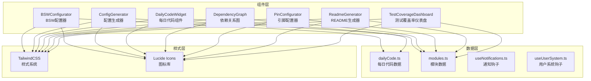
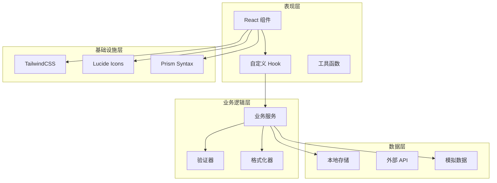
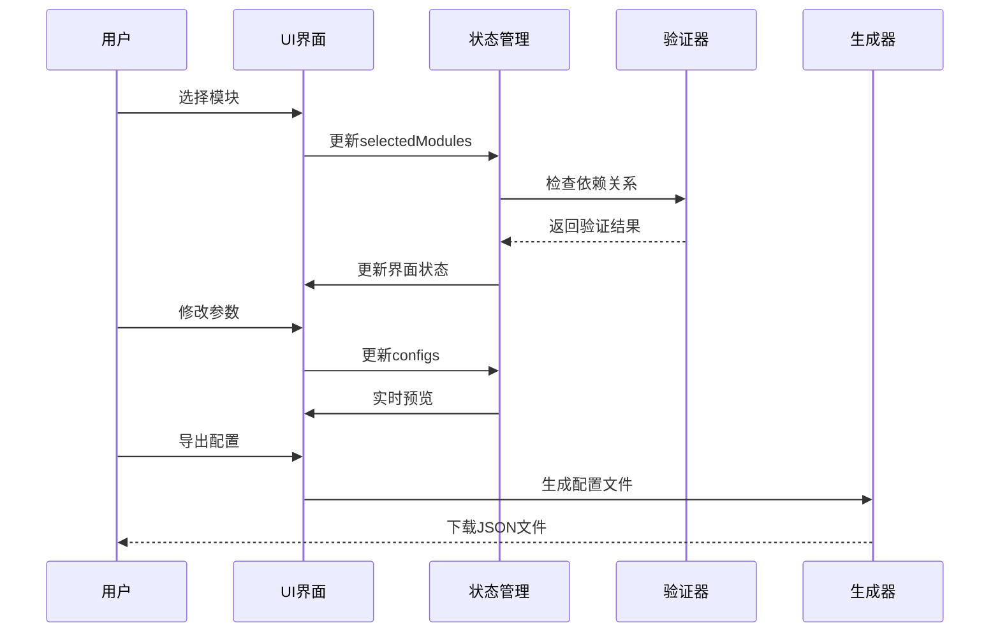
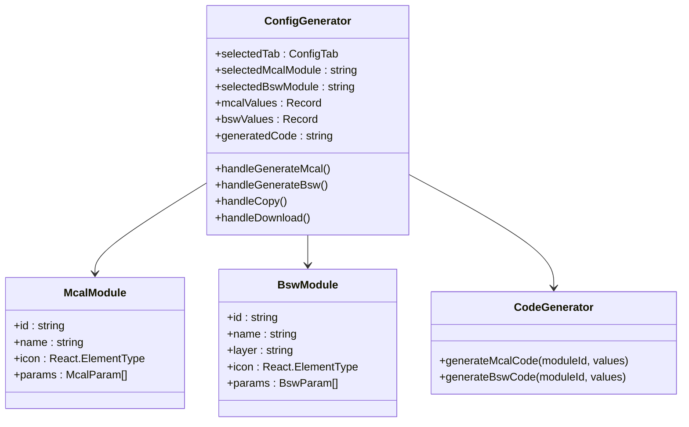
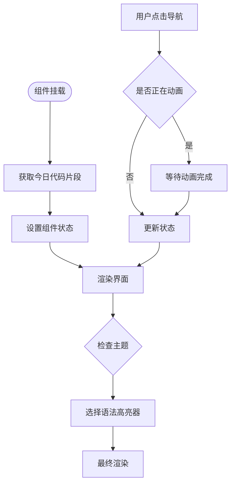
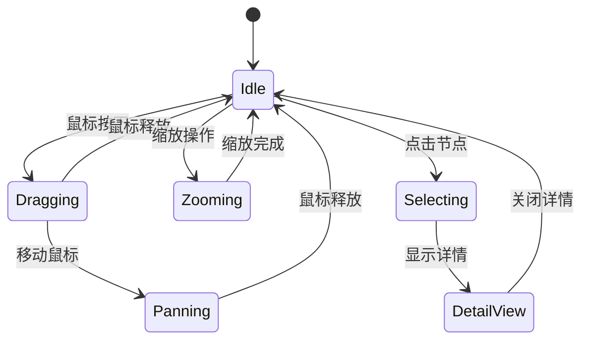
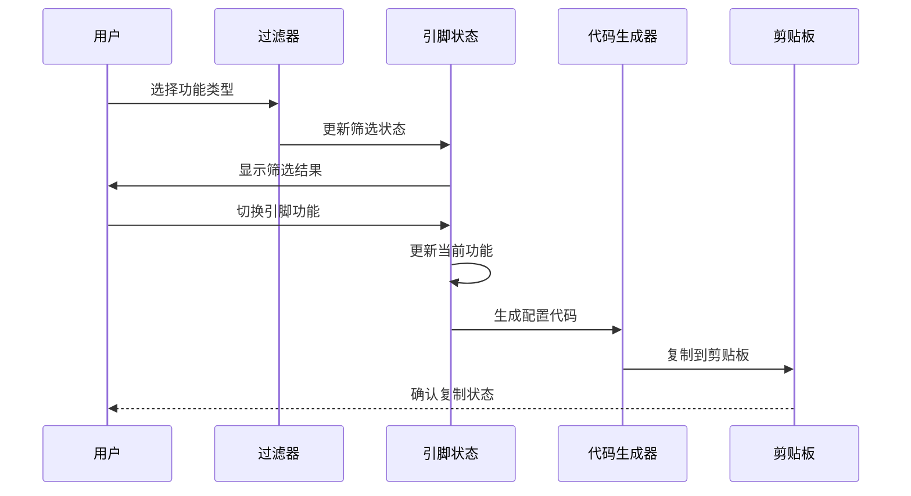
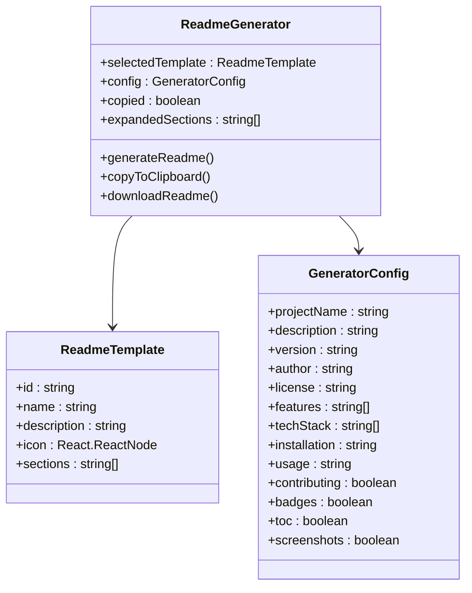
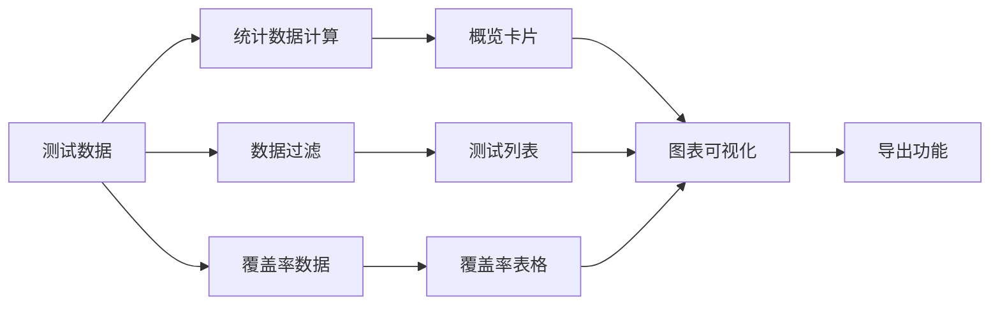
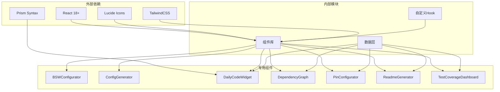

# 专用功能组件

<cite>
**本文档引用的文件**
- [BSWConfigurator.tsx](file://src/components/BSWConfigurator.tsx)
- [ConfigGenerator.tsx](file://src/components/ConfigGenerator.tsx)
- [DailyCodeWidget.tsx](file://src/components/DailyCodeWidget.tsx)
- [DependencyGraph.tsx](file://src/components/DependencyGraph.tsx)
- [PinConfigurator.tsx](file://src/components/PinConfigurator.tsx)
- [ReadmeGenerator.tsx](file://src/components/ReadmeGenerator.tsx)
- [TestCoverageDashboard.tsx](file://src/components/TestCoverageDashboard.tsx)
- [dailyCode.ts](file://src/data/dailyCode.ts)
- [modules.ts](file://src/data/modules.ts)
- [useNotifications.ts](file://src/hooks/useNotifications.ts)
- [useUserSystem.ts](file://src/hooks/useUserSystem.ts)
</cite>

## 目录
1. [简介](#简介)
2. [项目结构](#项目结构)
3. [核心组件](#核心组件)
4. [架构概览](#架构概览)
5. [详细组件分析](#详细组件分析)
6. [依赖关系分析](#依赖关系分析)
7. [性能考虑](#性能考虑)
8. [故障排除指南](#故障排除指南)
9. [结论](#结论)

## 简介

本项目专注于汽车软件工程领域的专用功能组件，提供了完整的 AutoSAR BSW（基础软件）配置、代码生成、依赖关系可视化和测试覆盖率管理解决方案。这些组件旨在帮助开发者高效地配置和管理复杂的汽车电子系统，同时提供直观的用户界面和强大的功能特性。

项目采用现代化的 React 技术栈构建，结合 TypeScript 类型安全和 TailwindCSS 样式系统，确保了良好的开发体验和用户体验。所有组件都经过精心设计，既满足专业开发者的需求，又保持了良好的可维护性和可扩展性。

## 项目结构

项目采用模块化的组件架构，每个专用功能组件都是独立的 React 组件，具有清晰的职责分工和接口定义：

**图表来源**
- [BSWConfigurator.tsx:102-508](file://src/components/BSWConfigurator.tsx#L102-L508)
- [ConfigGenerator.tsx:392-682](file://src/components/ConfigGenerator.tsx#L392-L682)
- [DailyCodeWidget.tsx:8-174](file://src/components/DailyCodeWidget.tsx#L8-L174)
- [DependencyGraph.tsx:92-531](file://src/components/DependencyGraph.tsx#L92-L531)
- [PinConfigurator.tsx:156-498](file://src/components/PinConfigurator.tsx#L156-L498)
- [ReadmeGenerator.tsx:88-567](file://src/components/ReadmeGenerator.tsx#L88-L567)
- [TestCoverageDashboard.tsx:96-462](file://src/components/TestCoverageDashboard.tsx#L96-L462)

**章节来源**
- [BSWConfigurator.tsx:1-508](file://src/components/BSWConfigurator.tsx#L1-L508)
- [ConfigGenerator.tsx:1-682](file://src/components/ConfigGenerator.tsx#L1-L682)
- [DailyCodeWidget.tsx:1-174](file://src/components/DailyCodeWidget.tsx#L1-L174)
- [DependencyGraph.tsx:1-531](file://src/components/DependencyGraph.tsx#L1-L531)
- [PinConfigurator.tsx:1-498](file://src/components/PinConfigurator.tsx#L1-L498)
- [ReadmeGenerator.tsx:1-567](file://src/components/ReadmeGenerator.tsx#L1-L567)
- [TestCoverageDashboard.tsx:1-462](file://src/components/TestCoverageDashboard.tsx#L1-L462)

## 核心组件

### BSWConfigurator - BSW配置器

BSWConfigurator 是一个专业的汽车软件配置工具，专门用于配置和管理 AutoSAR BSW（基础软件）模块。该组件提供了可视化的模块选择、参数配置和配置生成功能。

**主要特性：**
- **模块化设计**：支持 MCAL、ECUAL、Service、RTE 四层架构的模块配置
- **依赖关系检查**：自动验证模块间的依赖关系，防止无效配置
- **参数验证**：提供类型安全的参数配置界面
- **配置导出**：生成标准的 JSON 配置文件

**配置参数类型：**
- `boolean`：布尔值开关
- `number`：数值参数，支持范围限制
- `select`：下拉选择框
- `text`：文本输入

**章节来源**
- [BSWConfigurator.tsx:19-100](file://src/components/BSWConfigurator.tsx#L19-L100)
- [BSWConfigurator.tsx:102-508](file://src/components/BSWConfigurator.tsx#L102-L508)

### ConfigGenerator - 配置生成器

ConfigGenerator 提供了 MCAL 和 BSW 模块的可视化配置生成功能。该组件支持 AutoSAR 标准的配置头文件生成，特别针对 i.MX8M Mini 平台进行了优化。

**支持的模块：**
- **MCAL 模块**：Mcu、Port、Can、Spi、Gpt 等硬件抽象层模块
- **BSW 模块**：Com、PduR、NvM、CanIf、IoHwAb 等基础软件模块

**代码生成特点：**
- 自动生成符合 AutoSAR 标准的 C 语言配置头文件
- 包含详细的注释和版本信息
- 支持多种配置参数类型

**章节来源**
- [ConfigGenerator.tsx:18-186](file://src/components/ConfigGenerator.tsx#L18-L186)
- [ConfigGenerator.tsx:392-682](file://src/components/ConfigGenerator.tsx#L392-L682)

### DailyCodeWidget - 每日代码组件

DailyCodeWidget 是一个教育导向的组件，每天向用户提供一个关键的 AutoSAR 代码片段，帮助开发者学习和理解汽车软件开发的最佳实践。

**核心功能：**
- **每日代码推送**：基于日期算法，确保每天显示不同的代码片段
- **难度分级**：支持入门、中级、高级三个难度级别
- **语法高亮**：使用 Prism.js 提供代码语法高亮显示
- **模块关联**：与具体的 AutoSAR 模块建立联系

**数据管理：**
- 基于本地存储的代码片段管理
- 支持前后切换浏览
- 自动日期计算机制

**章节来源**
- [DailyCodeWidget.tsx:8-174](file://src/components/DailyCodeWidget.tsx#L8-L174)
- [dailyCode.ts:1-239](file://src/data/dailyCode.ts#L1-L239)

### DependencyGraph - 依赖关系图

DependencyGraph 提供了 AutoSAR BSW 模块间的依赖关系可视化功能。该组件使用 SVG 技术创建交互式的依赖关系图，帮助开发者理解复杂的模块架构。

**可视化特性：**
- **层次化布局**：按照 MCAL、ECUAL、Service、RTE、Application 层级组织
- **交互式导航**：支持缩放、平移、节点选择等交互操作
- **状态可视化**：通过颜色和图标表示模块的开发状态
- **实时统计**：提供模块数量、依赖关系等统计信息

**交互功能：**
- 图层显示/隐藏控制
- 模块详情面板
- 导出功能支持

**章节来源**
- [DependencyGraph.tsx:11-111](file://src/components/DependencyGraph.tsx#L11-L111)
- [DependencyGraph.tsx:92-531](file://src/components/DependencyGraph.tsx#L92-L531)

### PinConfigurator - 引脚配置器

PinConfigurator 专注于硬件引脚配置，特别是针对 i.MX8M Mini 开发板的引脚功能映射。该组件提供了直观的引脚配置界面和自动代码生成功能。

**引脚功能支持：**
- **GPIO**：通用数字输入输出
- **通信接口**：CAN、SPI、UART、I2C
- **模拟接口**：ADC 输入
- **特殊功能**：PWM、以太网、USB

**配置特性：**
- 实时引脚功能切换
- 功能颜色编码
- 自动生成配置代码
- 统计信息显示

**章节来源**
- [PinConfigurator.tsx:19-131](file://src/components/PinConfigurator.tsx#L19-L131)
- [PinConfigurator.tsx:156-498](file://src/components/PinConfigurator.tsx#L156-L498)

### ReadmeGenerator - README生成器

ReadmeGenerator 提供了多种模板的 README 文档自动生成功能，特别针对 AutoSAR BSW 模块进行了专门优化。

**模板类型：**
- **标准模板**：通用开源项目文档
- **AutoSAR 模块**：专为 AutoSAR BSW 模块设计
- **简洁模板**：最小化信息展示
- **企业模板**：完整的企业级文档规范

**生成内容：**
- 项目基本信息
- 功能特性列表
- 技术栈说明
- 安装和使用指南
- 许可证信息
- 贡献指南

**章节来源**
- [ReadmeGenerator.tsx:15-86](file://src/components/ReadmeGenerator.tsx#L15-L86)
- [ReadmeGenerator.tsx:88-567](file://src/components/ReadmeGenerator.tsx#L88-L567)

### TestCoverageDashboard - 测试覆盖率仪表盘

TestCoverageDashboard 提供了全面的测试覆盖率管理和可视化功能，帮助开发者监控和改进代码质量。

**统计指标：**
- **测试状态统计**：通过、失败、运行中、待执行、跳过
- **覆盖率指标**：行覆盖率、分支覆盖率、函数覆盖率、语句覆盖率
- **分类分布**：单元测试、集成测试、HIL测试、性能测试

**可视化功能：**
- 测试执行趋势图表
- 按类别分布饼图
- 模块覆盖率对比表
- 低覆盖率警告系统

**章节来源**
- [TestCoverageDashboard.tsx:23-42](file://src/components/TestCoverageDashboard.tsx#L23-L42)
- [TestCoverageDashboard.tsx:96-462](file://src/components/TestCoverageDashboard.tsx#L96-L462)

## 架构概览

项目采用分层架构设计，确保各个组件之间的松耦合和高内聚：

**图表来源**
- [useNotifications.ts:17-50](file://src/hooks/useNotifications.ts#L17-L50)
- [useUserSystem.ts:91-135](file://src/hooks/useUserSystem.ts#L91-L135)
- [dailyCode.ts:209-239](file://src/data/dailyCode.ts#L209-L239)
- [modules.ts:1-32](file://src/data/modules.ts#L1-L32)

## 详细组件分析

### BSWConfigurator 组件深度分析

BSWConfigurator 采用了复杂的状态管理和数据流设计：

**图表来源**
- [BSWConfigurator.tsx:128-219](file://src/components/BSWConfigurator.tsx#L128-L219)

**核心实现要点：**
- **模块依赖验证**：通过 `checkDependencies` 函数确保模块选择的有效性
- **配置状态管理**：使用 `useState` 和 `useMemo` 优化性能
- **参数类型处理**：针对不同参数类型提供相应的 UI 组件
- **配置导出机制**：生成标准的 JSON 配置格式

**章节来源**
- [BSWConfigurator.tsx:164-195](file://src/components/BSWConfigurator.tsx#L164-L195)

### ConfigGenerator 组件深度分析

ConfigGenerator 实现了复杂的模板系统和参数映射机制：

**图表来源**
- [ConfigGenerator.tsx:16-186](file://src/components/ConfigGenerator.tsx#L16-L186)
- [ConfigGenerator.tsx:187-389](file://src/components/ConfigGenerator.tsx#L187-L389)

**模板系统特点：**
- **类型安全**：使用 TypeScript 确保参数类型正确性
- **动态生成**：根据模块类型动态生成相应的配置代码
- **格式化输出**：提供标准的 C 语言头文件格式

**章节来源**
- [ConfigGenerator.tsx:187-389](file://src/components/ConfigGenerator.tsx#L187-L389)

### DailyCodeWidget 组件深度分析

DailyCodeWidget 实现了智能的内容分发和用户交互机制：

**图表来源**
- [DailyCodeWidget.tsx:13-33](file://src/components/DailyCodeWidget.tsx#L13-L33)

**数据管理机制：**
- **日期驱动**：使用 `getTodaySnippet` 基于日期计算确定显示内容
- **本地存储**：利用 `useTheme` 钩子管理主题偏好
- **动画效果**：通过 `isAnimating` 状态控制过渡动画

**章节来源**
- [DailyCodeWidget.tsx:13-48](file://src/components/DailyCodeWidget.tsx#L13-L48)
- [dailyCode.ts:209-239](file://src/data/dailyCode.ts#L209-L239)

### DependencyGraph 组件深度分析

DependencyGraph 实现了复杂的 SVG 图形渲染和交互处理：

**图表来源**
- [DependencyGraph.tsx:126-144](file://src/components/DependencyGraph.tsx#L126-L144)

**SVG 渲染优化：**
- **虚拟化**：使用 `useMemo` 缓存计算结果
- **变换矩阵**：支持平移、缩放、旋转操作
- **交互反馈**：通过 CSS 类名提供视觉反馈

**章节来源**
- [DependencyGraph.tsx:284-395](file://src/components/DependencyGraph.tsx#L284-L395)

### PinConfigurator 组件深度分析

PinConfigurator 实现了复杂的引脚状态管理和代码生成：

**图表来源**
- [PinConfigurator.tsx:164-183](file://src/components/PinConfigurator.tsx#L164-L183)

**引脚功能映射：**
- **颜色编码**：通过 `functionColors` 对不同功能进行视觉区分
- **标签系统**：使用 `functionLabels` 提供用户友好的功能名称
- **状态跟踪**：维护每个引脚的默认功能和当前功能状态

**章节来源**
- [PinConfigurator.tsx:106-163](file://src/components/PinConfigurator.tsx#L106-L163)

### ReadmeGenerator 组件深度分析

ReadmeGenerator 实现了灵活的模板系统和内容生成机制：

**图表来源**
- [ReadmeGenerator.tsx:15-41](file://src/components/ReadmeGenerator.tsx#L15-L41)
- [ReadmeGenerator.tsx:88-112](file://src/components/ReadmeGenerator.tsx#L88-L112)

**模板系统设计：**
- **模块化结构**：每个模板定义独立的章节组合
- **动态内容**：根据配置动态生成 Markdown 内容
- **格式化规则**：遵循标准的 README 格式规范

**章节来源**
- [ReadmeGenerator.tsx:117-236](file://src/components/ReadmeGenerator.tsx#L117-L236)

### TestCoverageDashboard 组件深度分析

TestCoverageDashboard 实现了全面的测试数据管理和可视化：

**图表来源**
- [TestCoverageDashboard.tsx:101-121](file://src/components/TestCoverageDashboard.tsx#L101-L121)

**数据处理流程：**
- **实时计算**：使用 `useMemo` 优化统计数据的计算
- **动态过滤**：支持按类别和模块的实时筛选
- **多维度统计**：提供测试状态、覆盖率等多个维度的分析

**章节来源**
- [TestCoverageDashboard.tsx:101-121](file://src/components/TestCoverageDashboard.tsx#L101-L121)

## 依赖关系分析

项目中的组件依赖关系体现了清晰的分层架构：

**图表来源**
- [BSWConfigurator.tsx:1-16](file://src/components/BSWConfigurator.tsx#L1-L16)
- [ConfigGenerator.tsx:1-14](file://src/components/ConfigGenerator.tsx#L1-L14)
- [DailyCodeWidget.tsx:1-6](file://src/components/DailyCodeWidget.tsx#L1-L6)
- [DependencyGraph.tsx:1-9](file://src/components/DependencyGraph.tsx#L1-L9)
- [PinConfigurator.tsx:1-17](file://src/components/PinConfigurator.tsx#L1-L17)
- [ReadmeGenerator.tsx:1-13](file://src/components/ReadmeGenerator.tsx#L1-L13)
- [TestCoverageDashboard.tsx:1-21](file://src/components/TestCoverageDashboard.tsx#L1-L21)

**依赖管理最佳实践：**
- **最小依赖原则**：每个组件只导入必要的依赖
- **类型安全**：广泛使用 TypeScript 接口和类型定义
- **模块化设计**：避免循环依赖，保持组件独立性

**章节来源**
- [useNotifications.ts:1-50](file://src/hooks/useNotifications.ts#L1-L50)
- [useUserSystem.ts:1-135](file://src/hooks/useUserSystem.ts#L1-L135)

## 性能考虑

### 状态管理优化

所有组件都采用了 React 的现代状态管理模式：

- **useMemo 优化**：对计算密集型操作进行缓存
- **useCallback 优化**：避免不必要的函数重新创建
- **useState 分割**：将大对象拆分为多个独立的状态

### 渲染性能优化

- **虚拟滚动**：对于大量数据的列表使用虚拟化技术
- **懒加载**：组件按需加载，减少初始包大小
- **CSS 优化**：使用 TailwindCSS 的原子化类名提高渲染效率

### 数据处理优化

- **本地存储**：使用 localStorage 减少服务器请求
- **数据缓存**：对静态数据进行内存缓存
- **批量更新**：合并多个状态更新操作

## 故障排除指南

### 常见问题及解决方案

**BSWConfigurator 配置问题：**
- **问题**：模块依赖关系检查失败
- **解决方案**：确保先添加依赖模块，再添加子模块
- **预防措施**：使用内置的依赖检查功能

**ConfigGenerator 代码生成问题：**
- **问题**：生成的代码不符合预期
- **解决方案**：检查参数类型和默认值设置
- **预防措施**：使用模板验证功能

**DailyCodeWidget 内容显示问题：**
- **问题**：代码片段不按日期顺序显示
- **解决方案**：检查系统日期设置
- **预防措施**：使用内置的时间计算函数

**DependencyGraph 交互问题：**
- **问题**：SVG 图形渲染异常
- **解决方案**：清除浏览器缓存，重新加载页面
- **预防措施**：使用响应式设计适配不同屏幕尺寸

**PinConfigurator 配置导出问题：**
- **问题**：生成的配置代码格式错误
- **解决方案**：检查引脚功能映射表
- **预防措施**：使用代码验证功能

**ReadmeGenerator 模板问题：**
- **问题**：生成的 README 格式不正确
- **解决方案**：检查 Markdown 语法
- **预防措施**：使用模板预览功能

**TestCoverageDashboard 数据问题：**
- **问题**：统计数据不准确
- **解决方案**：检查测试数据源
- **预防措施**：定期更新测试数据

**章节来源**
- [BSWConfigurator.tsx:164-171](file://src/components/BSWConfigurator.tsx#L164-L171)
- [ConfigGenerator.tsx:432-442](file://src/components/ConfigGenerator.tsx#L432-L442)
- [DailyCodeWidget.tsx:17-33](file://src/components/DailyCodeWidget.tsx#L17-L33)
- [DependencyGraph.tsx:158-175](file://src/components/DependencyGraph.tsx#L158-L175)
- [PinConfigurator.tsx:225-244](file://src/components/PinConfigurator.tsx#L225-L244)
- [ReadmeGenerator.tsx:238-257](file://src/components/ReadmeGenerator.tsx#L238-L257)
- [TestCoverageDashboard.tsx:101-121](file://src/components/TestCoverageDashboard.tsx#L101-L121)

## 结论

本项目成功实现了汽车软件工程领域的一系列专用功能组件，每个组件都体现了以下设计理念：

**技术卓越性：**
- 采用现代化的 React 技术栈和 TypeScript 类型系统
- 实现了高度模块化的架构设计
- 提供了丰富的用户交互和可视化功能

**功能完整性：**
- 覆盖了从硬件配置到软件测试的完整开发流程
- 提供了 AutoSAR 标准的配置和生成能力
- 集成了教育和社区互动功能

**用户体验优化：**
- 直观的图形化界面设计
- 响应式的交互反馈机制
- 丰富的视觉效果和动画

**最佳实践总结：**
- 状态管理采用 React Hooks 模式
- 数据处理使用本地存储和模拟数据
- 样式系统基于 TailwindCSS 原子化设计
- 图标系统使用 Lucide Icons 提供一致的视觉语言

这些组件不仅满足了专业开发者的需求，也为汽车软件开发的学习和研究提供了宝贵的工具和参考。通过持续的优化和扩展，这些组件将继续为汽车软件工程的发展做出贡献。