# 交互式组件

<cite>
**本文档引用的文件**
- [InteractiveCLI.tsx](file://src/components/InteractiveCLI.tsx)
- [GlobalSearch.tsx](file://src/components/GlobalSearch.tsx)
- [NotificationCenter.tsx](file://src/components/NotificationCenter.tsx)
- [OfflineIndicator.tsx](file://src/components/OfflineIndicator.tsx)
- [ThemeToggle.tsx](file://src/components/ThemeToggle.tsx)
- [PageLoader.tsx](file://src/components/PageLoader.tsx)
- [AnimatedPage.tsx](file://src/components/AnimatedPage.tsx)
- [OptimizedImage.tsx](file://src/components/OptimizedImage.tsx)
- [ThemeContext.tsx](file://src/contexts/ThemeContext.tsx)
- [useNotifications.ts](file://src/hooks/useNotifications.ts)
- [useLocalStorage.ts](file://src/hooks/useLocalStorage.ts)
- [codeSearch.ts](file://src/data/codeSearch.ts)
- [communityData.ts](file://src/data/communityData.ts)
- [BlogPage.tsx](file://src/pages/BlogPage.tsx)
- [App.tsx](file://src/App.tsx)
- [Navbar.tsx](file://src/components/Navbar.tsx)
</cite>

## 更新摘要
**所做更改**
- 新增动画组件系统章节，涵盖 AnimatedPage、ScrollReveal、HoverCard、FadeIn、StaggerContainer 等 Framer Motion 组件
- 新增图像优化组件章节，涵盖 OptimizedImage、ImageCard、ProgressiveImage 等优化组件
- 更新现有组件分析，增加动画集成和性能优化相关内容
- 更新架构图和组件关系图，反映新增的动画和图像优化组件

## 目录
1. [简介](#简介)
2. [项目结构](#项目结构)
3. [核心组件](#核心组件)
4. [架构总览](#架构总览)
5. [详细组件分析](#详细组件分析)
6. [动画组件系统](#动画组件系统)
7. [图像优化组件](#图像优化组件)
8. [依赖关系分析](#依赖关系分析)
9. [性能考量](#性能考量)
10. [故障排查指南](#故障排查指南)
11. [结论](#结论)

## 简介
本文件面向交互式组件的设计与实现，重点覆盖以下组件：
- InteractiveCLI：交互式命令行，支持命令解析、执行反馈与用户交互
- GlobalSearch：全局搜索，聚合多源内容并提供搜索结果过滤
- NotificationCenter：通知中心，消息推送、状态管理与用户操作处理
- OfflineIndicator：离线指示器，网络状态检测与提示显示
- ThemeToggle：主题切换，颜色系统、过渡动画与用户偏好持久化
- PageLoader：页面加载，加载状态管理与错误处理
- **新增** AnimatedPage：基于 Framer Motion 的页面动画系统
- **新增** OptimizedImage：优化的图像组件，支持懒加载和渐进式加载

文档同时阐述组件间的事件处理、状态同步与性能优化策略，帮助开发者快速理解与扩展这些交互式功能。

## 项目结构
交互式组件主要位于 src/components 目录，配合上下文与钩子实现状态共享与持久化；App.tsx 作为根组件挂载关键交互元素。新增的动画和图像优化组件增强了整体的用户体验。

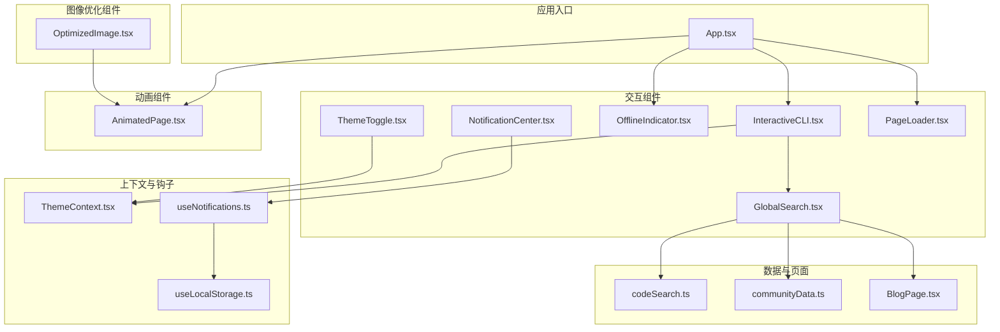

**图表来源**
- [App.tsx:30-115](file://src/App.tsx#L30-L115)
- [AnimatedPage.tsx:1-149](file://src/components/AnimatedPage.tsx#L1-L149)
- [OptimizedImage.tsx:1-181](file://src/components/OptimizedImage.tsx#L1-L181)

**章节来源**
- [App.tsx:30-115](file://src/App.tsx#L30-L115)

## 核心组件
- InteractiveCLI：提供命令行交互体验，内置导航、主题、工具与系统命令，支持历史记录、复制与快捷键
- GlobalSearch：聚合论坛、问答、博客、活动与代码搜索结果，支持点击跳转与类型标识
- NotificationCenter：基于本地存储的通知管理，支持标记已读、批量已读与未读计数
- OfflineIndicator：监听在线/离线事件，显示离线提示
- ThemeToggle：主题切换与动画，支持快速切换与下拉菜单
- PageLoader：页面懒加载时的加载指示器，基于 Framer Motion 实现流畅动画
- **新增** AnimatedPage：提供页面级动画效果，包括淡入、滑动、缩放等过渡动画
- **新增** OptimizedImage：优化的图像加载系统，支持 WebP 格式、懒加载和渐进式显示

**章节来源**
- [InteractiveCLI.tsx:37-538](file://src/components/InteractiveCLI.tsx#L37-L538)
- [GlobalSearch.tsx:26-216](file://src/components/GlobalSearch.tsx#L26-L216)
- [NotificationCenter.tsx:14-103](file://src/components/NotificationCenter.tsx#L14-L103)
- [OfflineIndicator.tsx:4-29](file://src/components/OfflineIndicator.tsx#L4-L29)
- [ThemeToggle.tsx:11-120](file://src/components/ThemeToggle.tsx#L11-L120)
- [PageLoader.tsx:1-67](file://src/components/PageLoader.tsx#L1-L67)
- [AnimatedPage.tsx:1-149](file://src/components/AnimatedPage.tsx#L1-L149)
- [OptimizedImage.tsx:1-181](file://src/components/OptimizedImage.tsx#L1-L181)

## 架构总览
交互式组件围绕"状态共享（Context/Hook）+ 本地存储 + 事件派发 + 动画系统"的架构组织，实现跨组件的状态同步、持久化与流畅的用户体验。

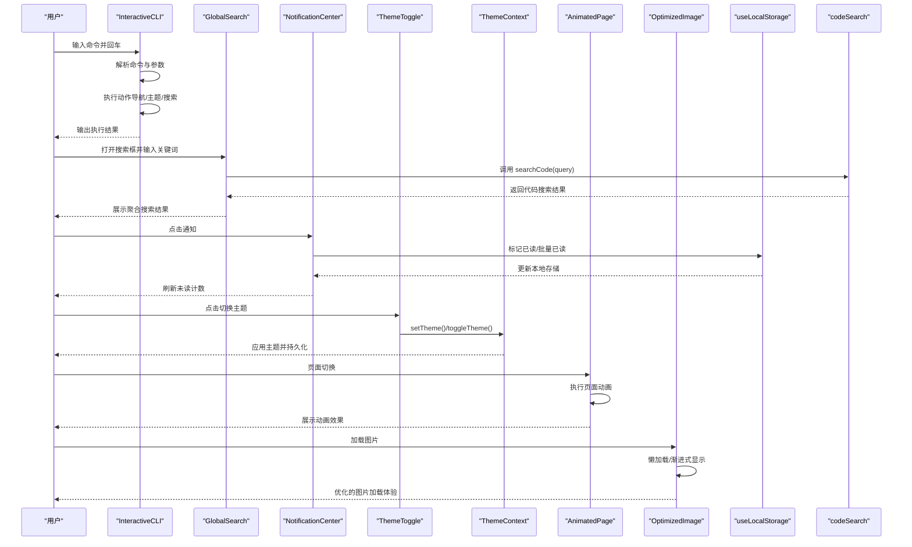

**图表来源**
- [InteractiveCLI.tsx:287-324](file://src/components/InteractiveCLI.tsx#L287-L324)
- [GlobalSearch.tsx:124-135](file://src/components/GlobalSearch.tsx#L124-L135)
- [codeSearch.ts:447-484](file://src/data/codeSearch.ts#L447-L484)
- [NotificationCenter.tsx:30-36](file://src/components/NotificationCenter.tsx#L30-L36)
- [useNotifications.ts:20-48](file://src/hooks/useNotifications.ts#L20-L48)
- [ThemeToggle.tsx:33-44](file://src/components/ThemeToggle.tsx#L33-L44)
- [ThemeContext.tsx:84-93](file://src/contexts/ThemeContext.tsx#L84-L93)
- [AnimatedPage.tsx:31-43](file://src/components/AnimatedPage.tsx#L31-L43)
- [OptimizedImage.tsx:14-90](file://src/components/OptimizedImage.tsx#L14-L90)

## 详细组件分析

### InteractiveCLI 交互式命令行
- 命令解析与执行
  - 命令定义：包含导航、主题、工具与系统四类命令，支持别名与分类
  - 参数解析：按空白分割命令行，首段为命令名，其余为参数数组
  - 执行逻辑：根据命令名匹配执行对应 action，捕获异常并记录错误历史
- 用户交互
  - 快捷键：Cmd/Ctrl + Shift + K 打开终端，ESC 关闭
  - 历史记录：支持上下方向键浏览历史，Tab 补全命令
  - 历史复制：一键复制历史记录到剪贴板
- 状态管理
  - 本地状态：输入框、历史记录、是否打开、历史索引等
  - 主题联动：通过 ThemeContext 切换主题
  - 路由联动：导航命令通过 react-router-dom 导航
- 性能与体验
  - 自动滚动至底部，保持良好阅读体验
  - 历史记录上限控制，避免内存膨胀
  - 快捷键与无障碍属性提升可用性

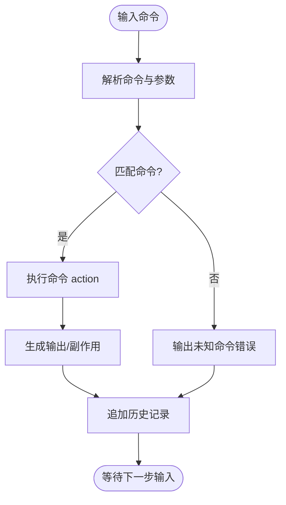

**图表来源**
- [InteractiveCLI.tsx:287-324](file://src/components/InteractiveCLI.tsx#L287-L324)
- [InteractiveCLI.tsx:358-391](file://src/components/InteractiveCLI.tsx#L358-L391)

**章节来源**
- [InteractiveCLI.tsx:37-538](file://src/components/InteractiveCLI.tsx#L37-L538)

### GlobalSearch 全局搜索
- 搜索范围
  - 论坛帖子、问答、博客文章、社区活动、代码片段
  - 代码搜索通过 codeSearch.searchCode(query) 实现
- 结果过滤与展示
  - 关键词大小写不敏感匹配标题/内容/描述
  - 类型图标区分不同结果类型，支持点击跳转
- 交互与快捷键
  - Cmd/Ctrl + K 打开/关闭搜索框，ESC 关闭
  - 点击外部区域自动关闭
- 性能与体验
  - 仅在输入长度≥1时进行搜索，避免无效计算
  - 结果列表滚动优化，空结果友好提示

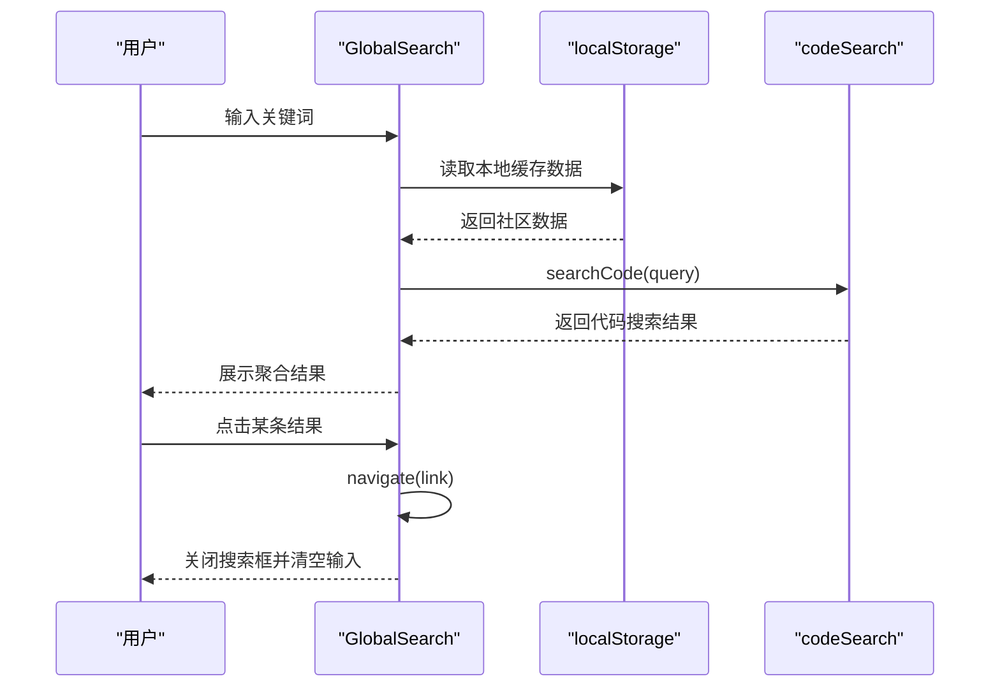

**图表来源**
- [GlobalSearch.tsx:64-135](file://src/components/GlobalSearch.tsx#L64-L135)
- [codeSearch.ts:447-484](file://src/data/codeSearch.ts#L447-L484)
- [communityData.ts:72-371](file://src/data/communityData.ts#L72-L371)

**章节来源**
- [GlobalSearch.tsx:26-216](file://src/components/GlobalSearch.tsx#L26-L216)
- [codeSearch.ts:447-484](file://src/data/codeSearch.ts#L447-L484)
- [communityData.ts:72-371](file://src/data/communityData.ts#L72-L371)
- [BlogPage.tsx:37-209](file://src/pages/BlogPage.tsx#L37-L209)

### NotificationCenter 通知中心
- 状态管理
  - 基于 useLocalStorage 的通知列表，支持新增、标记已读、批量已读
  - 未读计数统计，超过99显示"99+"
- 用户操作
  - 点击通知：若未读则标记已读并跳转链接
  - "全部已读"按钮：一键标记所有通知为已读
- 无障碍与样式
  - 类型配置映射不同图标、颜色与标签
  - 未读红点提示，视觉层次清晰

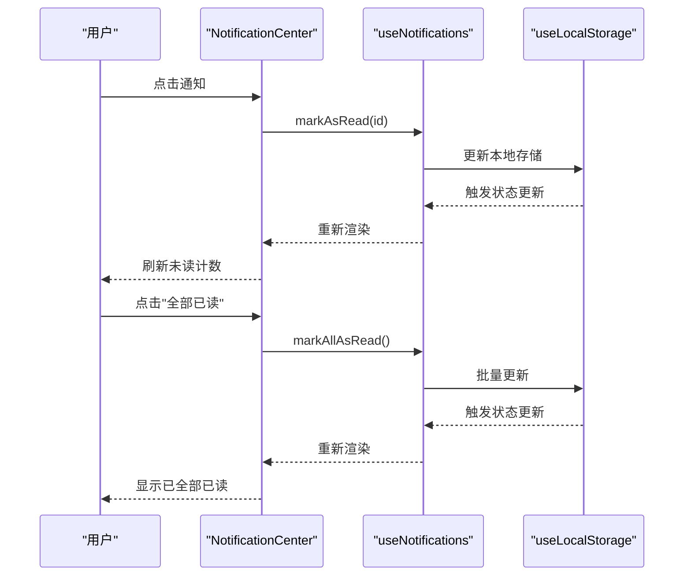

**图表来源**
- [NotificationCenter.tsx:30-36](file://src/components/NotificationCenter.tsx#L30-L36)
- [useNotifications.ts:30-38](file://src/hooks/useNotifications.ts#L30-L38)
- [useLocalStorage.ts:14-25](file://src/hooks/useLocalStorage.ts#L14-L25)

**章节来源**
- [NotificationCenter.tsx:14-103](file://src/components/NotificationCenter.tsx#L14-L103)
- [useNotifications.ts:17-50](file://src/hooks/useNotifications.ts#L17-L50)
- [useLocalStorage.ts:3-60](file://src/hooks/useLocalStorage.ts#L3-L60)

### OfflineIndicator 离线指示器
- 网络状态检测
  - 监听 window.online/offline 事件，实时更新在线状态
- 提示显示
  - 离线时固定顶部显示提示条，包含 Wi-Fi 图标与提示文本
- 自动恢复
  - 网络恢复后自动隐藏，无需手动刷新

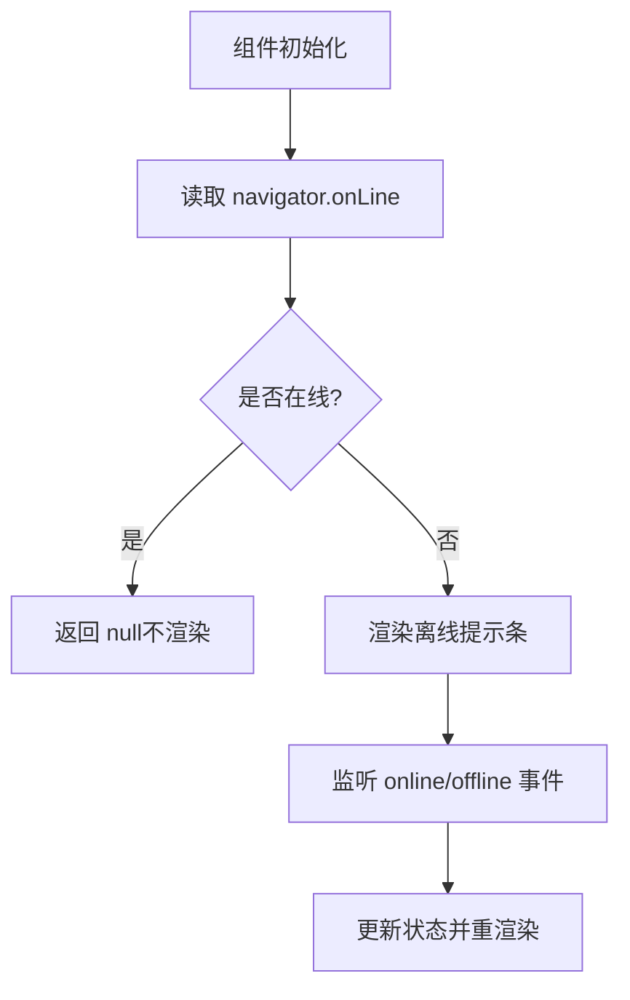

**图表来源**
- [OfflineIndicator.tsx:4-29](file://src/components/OfflineIndicator.tsx#L4-L29)

**章节来源**
- [OfflineIndicator.tsx:4-29](file://src/components/OfflineIndicator.tsx#L4-L29)

### ThemeToggle 主题切换
- 颜色系统
  - 支持 light/dark/system 三种模式，系统模式跟随系统配色偏好
- 过渡动画
  - 快速切换时添加旋转与缩放动画，增强反馈
- 用户偏好保存
  - 通过 ThemeContext.setTheme 持久化到 localStorage，并更新 document.documentElement 类名与 data-theme 属性
- 下拉菜单
  - 右键弹出菜单，支持选择具体主题

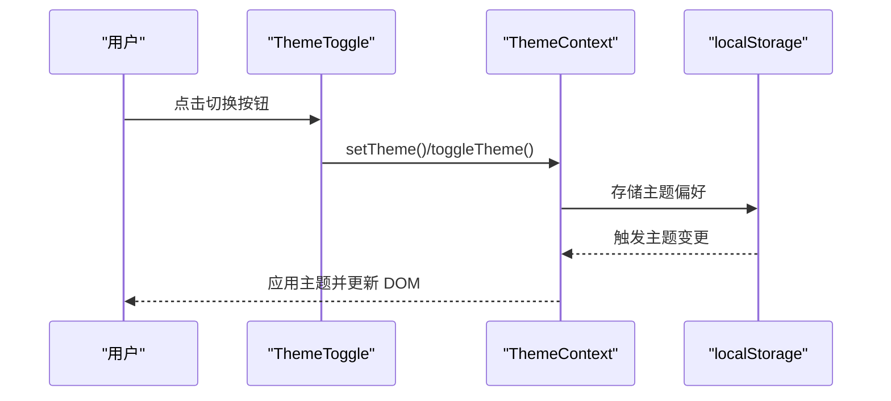

**图表来源**
- [ThemeToggle.tsx:33-44](file://src/components/ThemeToggle.tsx#L33-L44)
- [ThemeContext.tsx:84-93](file://src/contexts/ThemeContext.tsx#L84-L93)
- [ThemeContext.tsx:28-34](file://src/contexts/ThemeContext.tsx#L28-L34)

**章节来源**
- [ThemeToggle.tsx:11-120](file://src/components/ThemeToggle.tsx#L11-L120)
- [ThemeContext.tsx:41-127](file://src/contexts/ThemeContext.tsx#L41-L127)

### PageLoader 页面加载
- 加载状态管理
  - 懒加载路由时显示旋转加载图标与提示文本
- 错误处理
  - 通过 Suspense 与错误边界配合，保证加载失败时的降级显示
- 体验优化
  - 居中布局与最小高度，避免页面抖动
- **新增** 基于 Framer Motion 的流畅动画
  - 旋转和缩放动画提供更好的视觉反馈
  - 无限循环动画营造加载氛围

**章节来源**
- [PageLoader.tsx:1-67](file://src/components/PageLoader.tsx#L1-L67)
- [App.tsx:36-106](file://src/App.tsx#L36-L106)

## 动画组件系统

### AnimatedPage 页面动画
AnimatedPage 提供了完整的页面级动画解决方案，基于 Framer Motion 实现流畅的页面过渡效果。

- 页面切换动画
  - 淡入淡出：初始透明度0，最终1，提供平滑的页面出现效果
  - 滑动过渡：从下方20px位置滑入，增强空间感
  - 退出动画：从上方退出，营造页面消失的自然感觉
- 动画配置
  - 进入动画：0.4秒缓动曲线，提供舒适的视觉体验
  - 退出动画：0.3秒快速退出，响应用户的导航行为
  - 默认类名支持，可直接应用于任何页面组件

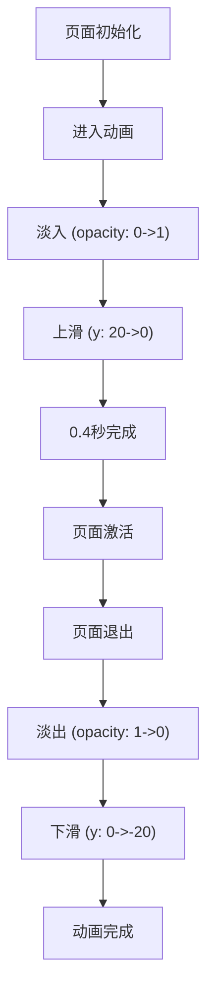

**图表来源**
- [AnimatedPage.tsx:9-29](file://src/components/AnimatedPage.tsx#L9-L29)
- [AnimatedPage.tsx:31-43](file://src/components/AnimatedPage.tsx#L31-L43)

**章节来源**
- [AnimatedPage.tsx:1-149](file://src/components/AnimatedPage.tsx#L1-L149)

### FadeIn 淡入动画
FadeIn 组件提供简单的淡入效果，支持延迟和持续时间自定义。

- 基础动画效果
  - 透明度从0到1的平滑过渡
  - 从下方20px位置滑入
  - 可配置的延迟和持续时间
- 使用场景
  - 单个元素的首次出现
  - 列表项的逐个显示
  - 内容块的渐显效果

**章节来源**
- [AnimatedPage.tsx:45-64](file://src/components/AnimatedPage.tsx#L45-L64)

### StaggerContainer 交错动画
StaggerContainer 和 StaggerItem 组件提供了复杂的交错动画效果，适合列表和网格布局。

- 交错动画原理
  - StaggerContainer 作为容器，定义动画序列
  - StaggerItem 定义每个子项的动画变体
  - 支持自定义交错延迟时间
- 动画特性
  - 子项按顺序依次出现
  - 每个子项具有相同的动画持续时间
  - 平滑的视觉过渡效果

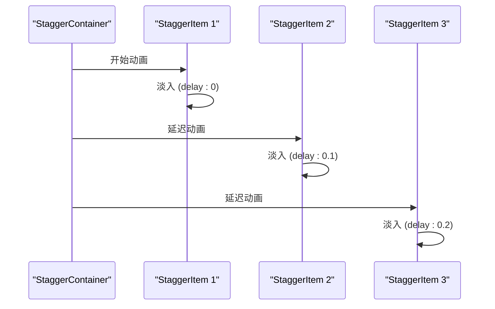

**图表来源**
- [AnimatedPage.tsx:66-108](file://src/components/AnimatedPage.tsx#L66-L108)

**章节来源**
- [AnimatedPage.tsx:66-108](file://src/components/AnimatedPage.tsx#L66-L108)

### ScrollReveal 滚动触发动画
ScrollReveal 组件基于 Intersection Observer API，实现滚动触发动画效果。

- 滚动检测
  - 使用 viewport 配置，支持视口边界调整
  - once 属性确保动画只执行一次
  - margin 参数提供灵活的触发时机
- 动画效果
  - 从下方30px位置滑入
  - 透明度从0到1的渐变
  - 缓动曲线提供自然的运动感觉

**章节来源**
- [AnimatedPage.tsx:110-129](file://src/components/AnimatedPage.tsx#L110-L129)

### HoverCard 悬停卡片动画
HoverCard 为卡片组件提供悬停和点击反馈，增强交互体验。

- 悬停效果
  - scale: 1.02 的轻微放大
  - y: -4 的轻微上移
  - 0.2秒快速过渡
- 点击反馈
  - whileTap 提供点击时的压缩效果
  - 即时反馈增强用户操作感知

**章节来源**
- [AnimatedPage.tsx:131-149](file://src/components/AnimatedPage.tsx#L131-L149)

## 图像优化组件

### OptimizedImage 优化图像
OptimizedImage 是一个全面的图像优化解决方案，集成了多种性能优化技术。

- 懒加载机制
  - 基于 Intersection Observer API
  - 50px 边界提前加载，提升用户体验
  - priority 参数支持优先加载
- 格式优化
  - 自动转换为 WebP 格式（如果可用）
  - 降级支持 JPG/JPEG/PNG 格式
  - 条件加载确保兼容性
- 加载优化
  - 占位符动画：模糊占位符到清晰图像的平滑过渡
  - 渐进式加载：先显示低质量图像，再替换为高质量版本
  - 透明度过渡：避免闪烁效果

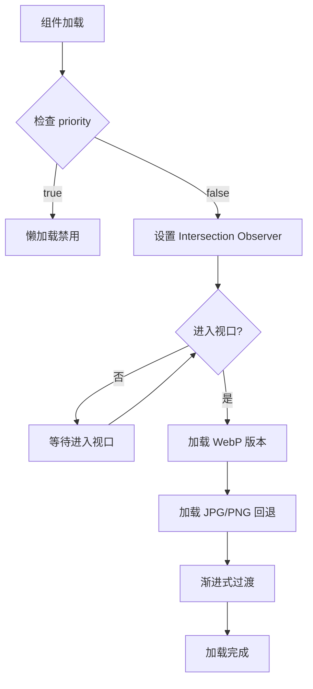

**图表来源**
- [OptimizedImage.tsx:27-49](file://src/components/OptimizedImage.tsx#L27-L49)
- [OptimizedImage.tsx:51-89](file://src/components/OptimizedImage.tsx#L51-L89)

**章节来源**
- [OptimizedImage.tsx:1-181](file://src/components/OptimizedImage.tsx#L1-L181)

### ImageCard 图片卡片
ImageCard 基于 OptimizedImage 构建，提供完整的图片展示卡片功能。

- 卡片布局
  - aspect-video 确保统一的宽高比
  - overflow-hidden 隐藏溢出内容
  - 圆角边框提供现代外观
- 交互效果
  - 悬停时轻微上移，增强立体感
  - 渐变遮罩从透明到半透明的平滑过渡
  - 标题和描述的层级分明
- 状态管理
  - 使用 useState 管理悬停状态
  - 响应式设计适配不同屏幕尺寸

**章节来源**
- [OptimizedImage.tsx:92-135](file://src/components/OptimizedImage.tsx#L92-L135)

### ProgressiveImage 渐进式图像
ProgressiveImage 专门处理渐进式图像加载，提供优秀的视觉体验。

- 渐进式加载原理
  - 使用 blurDataUrl 提供低质量占位符
  - 模糊滤镜（20px）营造加载氛围
  - 高质量图像加载完成后平滑替换
- 动画效果
  - 占位符从不透明到完全透明的渐隐
  - 主图像从不透明到完全透明的渐显
  - 缩放和透明度组合提供自然的过渡

**章节来源**
- [OptimizedImage.tsx:137-181](file://src/components/OptimizedImage.tsx#L137-L181)

## 依赖关系分析
- 组件间耦合
  - InteractiveCLI 与 ThemeContext、react-router-dom 强耦合，用于主题切换与导航
  - GlobalSearch 依赖 codeSearch 与社区数据，且与 BlogPage 的文章数据存在间接关联
  - NotificationCenter 依赖 useNotifications 与 useLocalStorage，形成独立状态域
  - OfflineIndicator 与 ThemeToggle 与 App.tsx 顶层布局强耦合
  - **新增** AnimatedPage 与 Framer Motion 库深度集成，提供页面级动画
  - **新增** OptimizedImage 与 Intersection Observer API 和 Framer Motion 结合
- 外部依赖
  - lucide-react 图标库
  - react-router-dom 路由导航
  - localStorage 本地存储
  - **新增** Framer Motion 动画库
  - **新增** WebP 图像格式支持

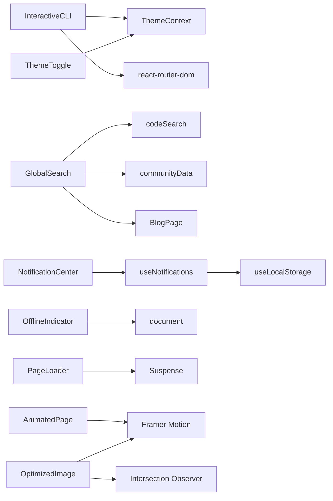

**图表来源**
- [InteractiveCLI.tsx:1-17](file://src/components/InteractiveCLI.tsx#L1-L17)
- [GlobalSearch.tsx:1-7](file://src/components/GlobalSearch.tsx#L1-L7)
- [NotificationCenter.tsx:1-5](file://src/components/NotificationCenter.tsx#L1-L5)
- [OfflineIndicator.tsx:1-2](file://src/components/OfflineIndicator.tsx#L1-L2)
- [ThemeToggle.tsx:1-3](file://src/components/ThemeToggle.tsx#L1-L3)
- [useNotifications.ts:1-3](file://src/hooks/useNotifications.ts#L1-L3)
- [useLocalStorage.ts:1-2](file://src/hooks/useLocalStorage.ts#L1-L2)
- [BlogPage.tsx:1-21](file://src/pages/BlogPage.tsx#L1-L21)
- [AnimatedPage.tsx:1](file://src/components/AnimatedPage.tsx#L1)
- [OptimizedImage.tsx:1-2](file://src/components/OptimizedImage.tsx#L1-L2)

**章节来源**
- [App.tsx:30-115](file://src/App.tsx#L30-L115)

## 性能考量
- 命令行历史与搜索结果
  - 限制历史记录数量与搜索结果数量，避免内存占用过高
  - 仅在输入有效时执行搜索，减少不必要的计算
- 本地存储与事件同步
  - 通过自定义事件与 storage 事件监听，确保多标签页状态一致
- 动画与渲染
  - 主题切换动画时长适中，避免阻塞主线程
  - 组件按需渲染，离线提示仅在离线时显示
  - **新增** 动画组件使用 transform 属性而非改变布局属性，避免重排
  - **新增** 图像组件使用 Intersection Observer 替代滚动事件监听，提升性能
  - **新增** WebP 格式支持减少图像文件大小，提升加载速度
- **新增** 动画性能优化
  - 使用 Framer Motion 的硬件加速属性
  - 合理设置动画持续时间和缓动函数
  - 避免在动画过程中进行昂贵的操作
- **新增** 图像性能优化
  - 懒加载减少初始页面加载时间
  - 渐进式加载提供更好的用户体验
  - 自适应图像格式选择

## 故障排查指南
- 命令行无法打开
  - 检查 Cmd/Ctrl + Shift + K 快捷键是否被浏览器扩展拦截
  - 确认组件未被父容器遮挡或禁用
- 主题切换无效
  - 检查 ThemeContext 是否正确提供，组件是否包裹在 ThemeProvider 中
  - 确认 localStorage 可用且未被浏览器隐私模式阻止
- 搜索无结果
  - 确认输入关键词长度≥1，且数据已正确加载
  - 检查 codeSearch.searchCode 是否返回结果
- 通知未更新
  - 检查 useLocalStorage 是否正常触发 storage 事件
  - 确认未被浏览器扩展阻止本地存储访问
- 离线提示不出现
  - 检查 window.addEventListener('online/offline') 是否成功绑定
  - 确认组件未被 z-index 覆盖或被其他元素遮挡
- **新增** 动画不工作
  - 检查 Framer Motion 库是否正确安装和导入
  - 确认浏览器支持 Web Animations API
  - 验证动画属性值是否在合理范围内
- **新增** 图像加载问题
  - 检查 Intersection Observer API 支持情况
  - 确认 WebP 格式服务器支持
  - 验证图片路径和权限设置

**章节来源**
- [InteractiveCLI.tsx:325-342](file://src/components/InteractiveCLI.tsx#L325-L342)
- [ThemeContext.tsx:41-127](file://src/contexts/ThemeContext.tsx#L41-L127)
- [codeSearch.ts:447-484](file://src/data/codeSearch.ts#L447-L484)
- [useLocalStorage.ts:27-56](file://src/hooks/useLocalStorage.ts#L27-L56)
- [OfflineIndicator.tsx:7-18](file://src/components/OfflineIndicator.tsx#L7-L18)
- [AnimatedPage.tsx:1-149](file://src/components/AnimatedPage.tsx#L1-L149)
- [OptimizedImage.tsx:1-181](file://src/components/OptimizedImage.tsx#L1-L181)

## 结论
交互式组件通过清晰的职责划分与状态管理，实现了良好的用户体验与可维护性。新增的动画组件系统和图像优化组件进一步提升了整体的用户体验质量。

- **动画系统优势**
  - 基于 Framer Motion 的高性能动画引擎
  - 完整的页面级和元素级动画解决方案
  - 流畅的过渡效果和自然的交互反馈
- **图像优化优势**
  - 多种优化技术结合，显著提升加载性能
  - 智能的格式选择和懒加载机制
  - 优秀的用户体验和更低的带宽消耗
- **架构演进**
  - 从基础交互向现代化用户体验转变
  - 性能优化与功能完善的平衡
  - 为未来功能扩展奠定坚实基础

建议在后续迭代中进一步优化动画性能、增强图像优化算法，并完善动画组件的可配置性和可扩展性。同时，可以考虑添加更多类型的动画效果和图像处理功能，以满足更复杂的应用场景需求。