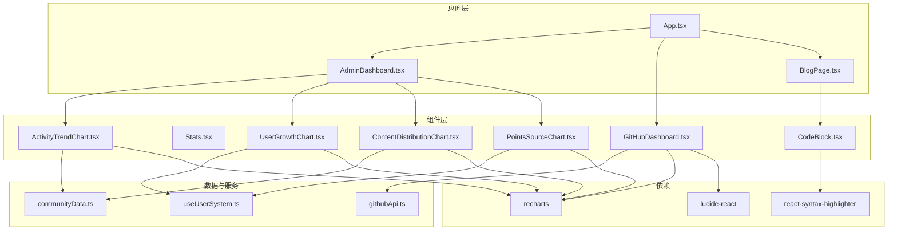
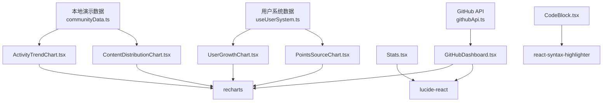
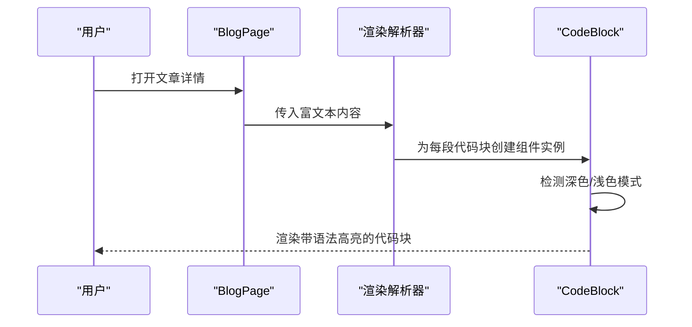
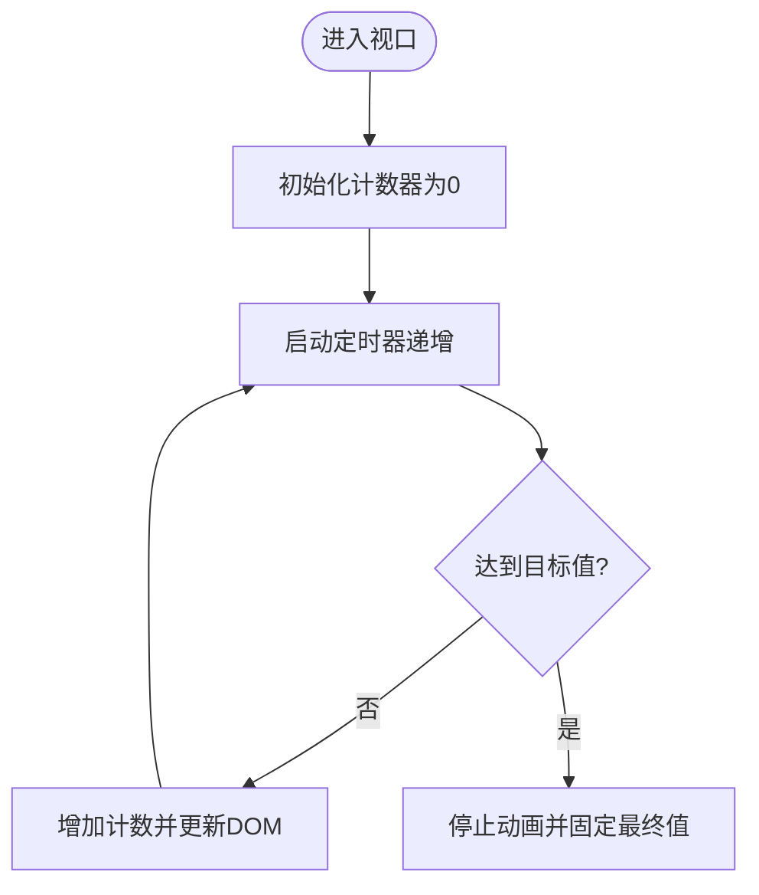
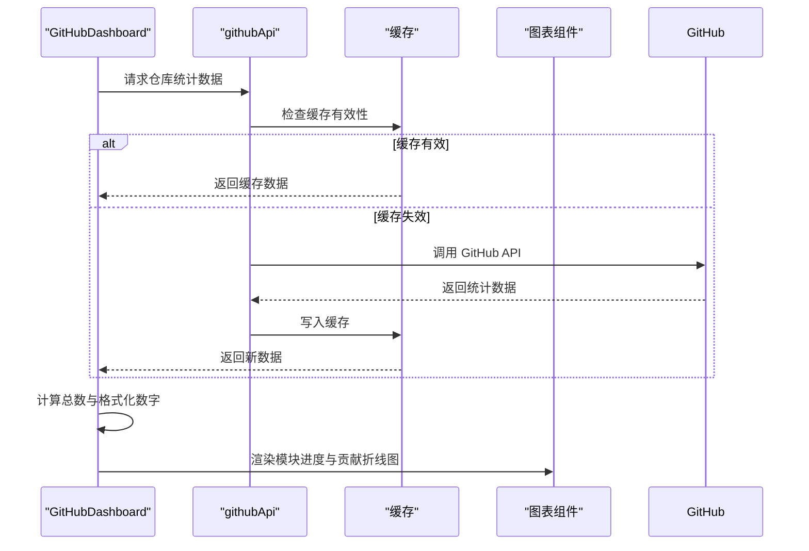
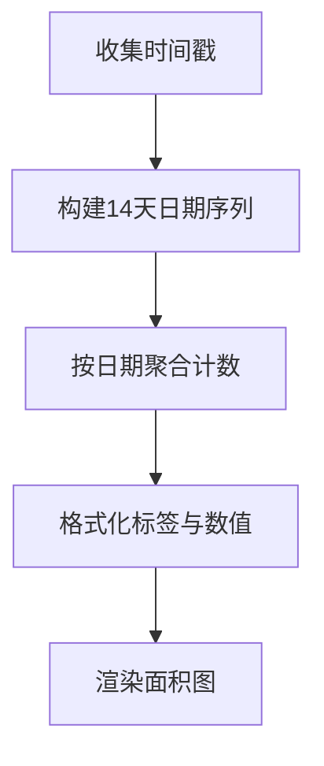
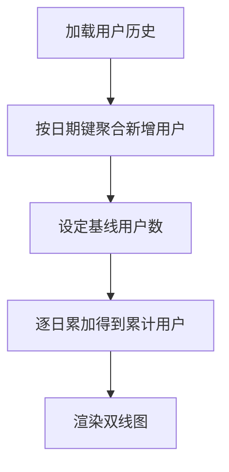
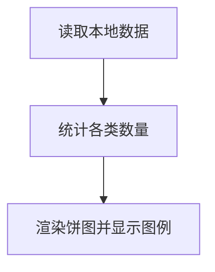
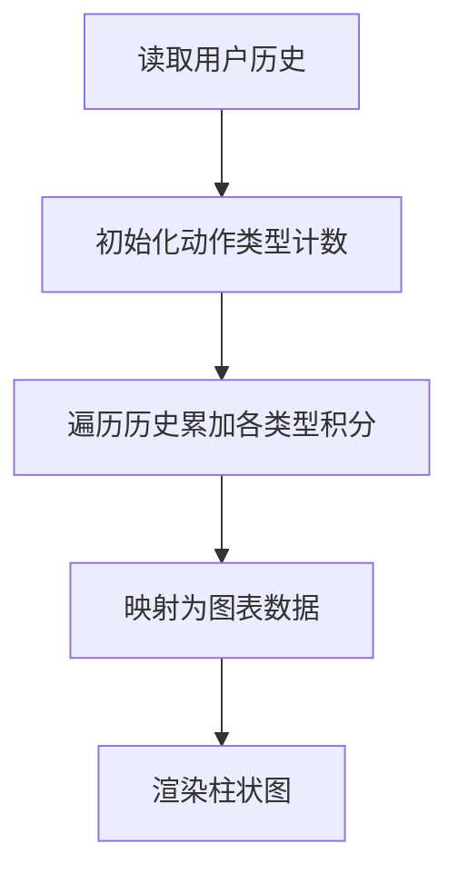
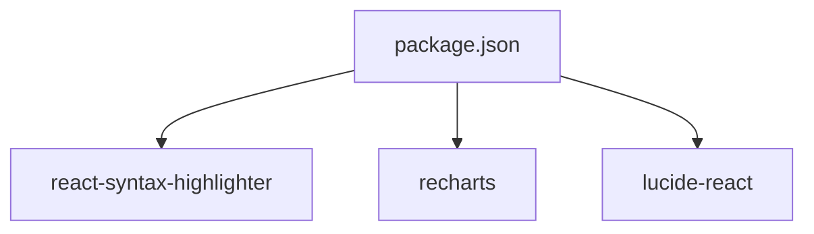

# 数据展示组件

<cite>
**本文档引用的文件**
- [CodeBlock.tsx](file://src/components/CodeBlock.tsx)
- [GitHubDashboard.tsx](file://src/components/GitHubDashboard.tsx)
- [ActivityTrendChart.tsx](file://src/components/admin/ActivityTrendChart.tsx)
- [UserGrowthChart.tsx](file://src/components/admin/UserGrowthChart.tsx)
- [ContentDistributionChart.tsx](file://src/components/admin/ContentDistributionChart.tsx)
- [PointsSourceChart.tsx](file://src/components/admin/PointsSourceChart.tsx)
- [Stats.tsx](file://src/components/Stats.tsx)
- [communityData.ts](file://src/data/communityData.ts)
- [githubApi.ts](file://src/services/githubApi.ts)
- [AdminDashboard.tsx](file://src/pages/AdminDashboard.tsx)
- [BlogPage.tsx](file://src/pages/BlogPage.tsx)
- [App.tsx](file://src/App.tsx)
- [useUserSystem.ts](file://src/hooks/useUserSystem.ts)
- [package.json](file://package.json)
</cite>

## 目录
1. [简介](#简介)
2. [项目结构](#项目结构)
3. [核心组件](#核心组件)
4. [架构总览](#架构总览)
5. [详细组件分析](#详细组件分析)
6. [依赖关系分析](#依赖关系分析)
7. [性能考量](#性能考量)
8. [故障排查指南](#故障排查指南)
9. [结论](#结论)
10. [附录](#附录)

## 简介
本文件聚焦于数据展示类组件，系统性解析以下能力：
- CodeBlock 代码块组件：语法高亮、主题适配与代码美化
- Stats 统计面板：数据聚合、指标展示与动画更新
- GitHubDashboard 仪表盘：开源项目数据可视化、图表集成与性能监控
- 管理后台图表：ActivityTrendChart、UserGrowthChart、ContentDistributionChart、PointsSourceChart 的设计架构与交互效果
- 数据绑定、动画效果与响应式适配的实现细节
- 实际使用示例与性能优化建议

## 项目结构
围绕数据展示组件，项目采用按功能域分层组织：
- 组件层：通用 UI 组件（CodeBlock、Stats）、管理后台专用图表（admin 下各图表）
- 页面层：AdminDashboard、GitHubDashboard、BlogPage 等页面容器
- 数据与服务：communityData.ts（本地演示数据）、githubApi.ts（GitHub 数据服务）
- Hooks：useUserSystem.ts（用户积分与等级体系）
- 依赖：react-syntax-highlighter、recharts、lucide-react 等

**图表来源**
- [App.tsx:30-115](file://src/App.tsx#L30-L115)
- [AdminDashboard.tsx:67-320](file://src/pages/AdminDashboard.tsx#L67-L320)
- [GitHubDashboard.tsx:32-280](file://src/components/GitHubDashboard.tsx#L32-L280)
- [BlogPage.tsx:249-763](file://src/pages/BlogPage.tsx#L249-L763)
- [CodeBlock.tsx:1-49](file://src/components/CodeBlock.tsx#L1-L49)
- [ActivityTrendChart.tsx:29-128](file://src/components/admin/ActivityTrendChart.tsx#L29-L128)
- [UserGrowthChart.tsx:23-118](file://src/components/admin/UserGrowthChart.tsx#L23-L118)
- [ContentDistributionChart.tsx:23-71](file://src/components/admin/ContentDistributionChart.tsx#L23-L71)
- [PointsSourceChart.tsx:22-91](file://src/components/admin/PointsSourceChart.tsx#L22-L91)
- [communityData.ts:1-371](file://src/data/communityData.ts#L1-L371)
- [githubApi.ts:65-150](file://src/services/githubApi.ts#L65-L150)
- [useUserSystem.ts:91-132](file://src/hooks/useUserSystem.ts#L91-L132)

**章节来源**
- [App.tsx:30-115](file://src/App.tsx#L30-L115)
- [AdminDashboard.tsx:67-320](file://src/pages/AdminDashboard.tsx#L67-L320)
- [GitHubDashboard.tsx:32-280](file://src/components/GitHubDashboard.tsx#L32-L280)
- [BlogPage.tsx:249-763](file://src/pages/BlogPage.tsx#L249-L763)

## 核心组件
本节概述四大类组件的功能定位与协作关系。

- CodeBlock 代码块组件
  - 作用：对代码进行语法高亮渲染，并自动适配深浅色主题；提供代码美化与可读性增强
  - 关键特性：主题切换、语言识别、内边距与字体尺寸控制
  - 适用场景：技术博客、文档页面、学习平台等

- Stats 统计面板
  - 作用：以动画形式展示关键指标，提升视觉冲击力与信息密度
  - 关键特性：进入视口触发动画、数值递增、单位后缀处理
  - 适用场景：首页、概览页、营销页

- GitHubDashboard 仪表盘
  - 作用：整合 GitHub 仓库统计数据、模块进度、贡献活跃度与仓库列表，形成统一的开源生态视图
  - 关键特性：缓存机制、格式化数字、进度条颜色分级、响应式容器
  - 适用场景：开源项目主页、社区运营页

- 管理后台图表集合
  - ActivityTrendChart：社区活动趋势（近14天）
  - UserGrowthChart：用户增长（近30天，含累计与新增）
  - ContentDistributionChart：内容分布（论坛、问答、活动、博客）
  - PointsSourceChart：积分来源（发帖、回帖、回答、采纳、活动）

**章节来源**
- [CodeBlock.tsx:14-48](file://src/components/CodeBlock.tsx#L14-L48)
- [Stats.tsx:60-80](file://src/components/Stats.tsx#L60-L80)
- [GitHubDashboard.tsx:32-84](file://src/components/GitHubDashboard.tsx#L32-L84)
- [ActivityTrendChart.tsx:29-128](file://src/components/admin/ActivityTrendChart.tsx#L29-L128)
- [UserGrowthChart.tsx:23-118](file://src/components/admin/UserGrowthChart.tsx#L23-L118)
- [ContentDistributionChart.tsx:23-71](file://src/components/admin/ContentDistributionChart.tsx#L23-L71)
- [PointsSourceChart.tsx:22-91](file://src/components/admin/PointsSourceChart.tsx#L22-L91)

## 架构总览
数据展示组件的总体架构围绕“数据源—计算—渲染—交互”展开：
- 数据源：本地演示数据（communityData.ts）、用户系统（useUserSystem.ts）、GitHub API（githubApi.ts）
- 计算：useMemo 优化数据聚合与格式化；useEffect 控制异步加载与主题监听
- 渲染：React 组件树，配合 recharts、lucide-react、react-syntax-highlighter
- 交互：点击、悬停、滚动进入视口等事件驱动动画与提示

**图表来源**
- [communityData.ts:72-371](file://src/data/communityData.ts#L72-L371)
- [useUserSystem.ts:91-132](file://src/hooks/useUserSystem.ts#L91-L132)
- [githubApi.ts:65-150](file://src/services/githubApi.ts#L65-L150)
- [ActivityTrendChart.tsx:29-128](file://src/components/admin/ActivityTrendChart.tsx#L29-L128)
- [UserGrowthChart.tsx:23-118](file://src/components/admin/UserGrowthChart.tsx#L23-L118)
- [ContentDistributionChart.tsx:23-71](file://src/components/admin/ContentDistributionChart.tsx#L23-L71)
- [PointsSourceChart.tsx:22-91](file://src/components/admin/PointsSourceChart.tsx#L22-L91)
- [CodeBlock.tsx:1-49](file://src/components/CodeBlock.tsx#L1-L49)
- [Stats.tsx:60-80](file://src/components/Stats.tsx#L60-L80)
- [GitHubDashboard.tsx:32-280](file://src/components/GitHubDashboard.tsx#L32-L280)

## 详细组件分析

### CodeBlock 代码块组件
- 设计目标
  - 语法高亮：基于 react-syntax-highlighter，支持多语言
  - 主题适配：自动检测深色/浅色模式并切换样式
  - 代码美化：统一的内边距、字号、行高与背景色
- 实现要点
  - 主题选择：根据根元素是否存在 dark 类名决定使用 oneDark 或 oneLight
  - 样式定制：通过 customStyle 控制字体大小、行高与背景色
  - 结构：标题栏（语言标识）+ 代码区域
- 使用示例
  - 在博客文章中解析三引号代码块，自动注入 CodeBlock 组件
  - 支持语言参数，默认 c

**图表来源**
- [BlogPage.tsx:210-239](file://src/pages/BlogPage.tsx#L210-L239)
- [CodeBlock.tsx:14-48](file://src/components/CodeBlock.tsx#L14-L48)

**章节来源**
- [CodeBlock.tsx:1-49](file://src/components/CodeBlock.tsx#L1-L49)
- [BlogPage.tsx:210-239](file://src/pages/BlogPage.tsx#L210-L239)

### Stats 统计面板
- 设计目标
  - 展示关键指标：代码提交、注册工程师、开源模块、贡献者
  - 动画增强：进入视口后启动数值递增动画，提升用户体验
- 实现要点
  - 可见性检测：IntersectionObserver 在阈值 0.5 时触发
  - 动画逻辑：固定帧数与增量，平滑过渡到目标值
  - 单位处理：千位以上显示 k 格式
- 使用示例
  - 在首页或概览页以网格布局展示四象限统计

**图表来源**
- [Stats.tsx:16-51](file://src/components/Stats.tsx#L16-L51)

**章节来源**
- [Stats.tsx:1-81](file://src/components/Stats.tsx#L1-L81)

### GitHubDashboard 仪表盘
- 设计目标
  - 实时数据：从 GitHub API 获取仓库统计数据并缓存
  - 多维度展示：总星标、分支、观察者、问题数；模块完成度；近期贡献活跃度；热门仓库列表
- 实现要点
  - 数据加载：getCachedRepoStats 缓存 5 分钟；calculateTotals 聚合总数
  - 数字格式化：千位分隔与 k 表示
  - 进度颜色：根据完成度百分比映射不同颜色
  - 响应式：ResponsiveContainer 自适应容器尺寸
- 使用示例
  - 在社区首页或开源页面作为独立区块展示

**图表来源**
- [GitHubDashboard.tsx:44-58](file://src/components/GitHubDashboard.tsx#L44-L58)
- [githubApi.ts:139-150](file://src/services/githubApi.ts#L139-L150)
- [githubApi.ts:75-85](file://src/services/githubApi.ts#L75-L85)

**章节来源**
- [GitHubDashboard.tsx:32-280](file://src/components/GitHubDashboard.tsx#L32-L280)
- [githubApi.ts:65-150](file://src/services/githubApi.ts#L65-L150)

### 管理后台图表

#### ActivityTrendChart 活动趋势图
- 数据来源：本地演示数据（论坛帖子、问答问题、社区活动）
- 计算逻辑：统计近 14 天每日互动量（含回复、答案、活动报名）
- 渲染：面积图，填充渐变，坐标轴与提示框样式统一

**图表来源**
- [ActivityTrendChart.tsx:34-84](file://src/components/admin/ActivityTrendChart.tsx#L34-L84)

**章节来源**
- [ActivityTrendChart.tsx:29-128](file://src/components/admin/ActivityTrendChart.tsx#L29-L128)
- [communityData.ts:72-371](file://src/data/communityData.ts#L72-L371)

#### UserGrowthChart 用户增长图
- 数据来源：用户系统历史记录（从积分历史推导新增用户）
- 计算逻辑：近 30 天每日新增用户，叠加得到累计用户数；无真实数据时模拟
- 渲染：双线图（累计与新增），坐标轴与提示框样式统一

**图表来源**
- [UserGrowthChart.tsx:26-67](file://src/components/admin/UserGrowthChart.tsx#L26-L67)
- [useUserSystem.ts:91-132](file://src/hooks/useUserSystem.ts#L91-L132)

**章节来源**
- [UserGrowthChart.tsx:23-118](file://src/components/admin/UserGrowthChart.tsx#L23-L118)
- [useUserSystem.ts:1-135](file://src/hooks/useUserSystem.ts#L1-L135)

#### ContentDistributionChart 内容分布图
- 数据来源：本地演示数据（论坛、问答、活动、博客文章）
- 计算逻辑：直接统计各类型数量
- 渲染：环形饼图，带外半径、内半径与间距，统一配色

**图表来源**
- [ContentDistributionChart.tsx:28-35](file://src/components/admin/ContentDistributionChart.tsx#L28-L35)

**章节来源**
- [ContentDistributionChart.tsx:23-71](file://src/components/admin/ContentDistributionChart.tsx#L23-L71)
- [communityData.ts:72-371](file://src/data/communityData.ts#L72-L371)
- [BlogPage.tsx:37-208](file://src/pages/BlogPage.tsx#L37-L208)

#### PointsSourceChart 积分来源图
- 数据来源：用户系统历史记录（积分动作类型）
- 计算逻辑：按动作类型汇总积分；无历史时返回演示数据
- 渲染：柱状图，圆角柱头，统一配色

**图表来源**
- [PointsSourceChart.tsx:28-60](file://src/components/admin/PointsSourceChart.tsx#L28-L60)
- [useUserSystem.ts:91-132](file://src/hooks/useUserSystem.ts#L91-L132)

**章节来源**
- [PointsSourceChart.tsx:22-91](file://src/components/admin/PointsSourceChart.tsx#L22-L91)
- [useUserSystem.ts:1-135](file://src/hooks/useUserSystem.ts#L1-L135)

### 数据绑定、动画与响应式适配
- 数据绑定
  - 本地存储：useLocalStorage 读取/写入社区数据与用户系统状态
  - 计算派生：useMemo 对数据聚合与格式化进行缓存
- 动画效果
  - Stats：进入视口触发动画，定时器递增
  - CodeBlock：主题切换通过定时轮询检测根节点类名变化
- 响应式适配
  - recharts 的 ResponsiveContainer 自适应父容器宽高
  - Tailwind 类控制卡片、网格与间距

**章节来源**
- [AdminDashboard.tsx:67-320](file://src/pages/AdminDashboard.tsx#L67-L320)
- [Stats.tsx:16-51](file://src/components/Stats.tsx#L16-L51)
- [CodeBlock.tsx:17-23](file://src/components/CodeBlock.tsx#L17-L23)

## 依赖关系分析
- 第三方依赖
  - react-syntax-highlighter：代码高亮
  - recharts：图表绘制
  - lucide-react：图标
- 内部依赖
  - AdminDashboard 引入各图表组件
  - BlogPage 引入 CodeBlock 并解析富文本
  - GitHubDashboard 引入 githubApi 服务
  - 各图表组件依赖本地数据与用户系统钩子

**图表来源**
- [package.json:12-26](file://package.json#L12-L26)

**章节来源**
- [package.json:1-46](file://package.json#L1-L46)

## 性能考量
- 数据加载与缓存
  - GitHubDashboard 使用 5 分钟缓存，降低 API 调用频率
  - AdminDashboard 通过 useMemo 缓存图表数据，避免重复计算
- 渲染优化
  - 使用 ResponsiveContainer 与 Tailwind 原子类，减少重排
  - CodeBlock 主题检测采用定时轮询，建议在主题切换时集中更新
- 动画与交互
  - Stats 动画帧数与时长可控，避免长时间动画影响首屏
  - 图表 tooltip 与 legend 样式统一，减少 DOM 复杂度

[本节为通用性能建议，不直接分析具体文件]

## 故障排查指南
- GitHub 数据加载失败
  - 现象：控制台出现错误日志，统计面板显示加载中
  - 排查：检查网络请求与 GitHub API 限流；确认缓存是否过期
  - 参考
    - [GitHubDashboard.tsx:44-58](file://src/components/GitHubDashboard.tsx#L44-L58)
    - [githubApi.ts:139-150](file://src/services/githubApi.ts#L139-L150)
- 主题切换不生效
  - 现象：CodeBlock 未随系统主题切换
  - 排查：确认根节点存在 dark 类名；检查定时轮询是否正常
  - 参考
    - [CodeBlock.tsx:10-23](file://src/components/CodeBlock.tsx#L10-L23)
- 图表数据为空
  - 现象：饼图/柱状图无数据
  - 排查：确认本地存储键值是否存在；检查初始数据是否正确
  - 参考
    - [ContentDistributionChart.tsx:23-35](file://src/components/admin/ContentDistributionChart.tsx#L23-L35)
    - [PointsSourceChart.tsx:22-40](file://src/components/admin/PointsSourceChart.tsx#L22-L40)

**章节来源**
- [GitHubDashboard.tsx:44-58](file://src/components/GitHubDashboard.tsx#L44-L58)
- [githubApi.ts:139-150](file://src/services/githubApi.ts#L139-L150)
- [CodeBlock.tsx:10-23](file://src/components/CodeBlock.tsx#L10-L23)
- [ContentDistributionChart.tsx:23-35](file://src/components/admin/ContentDistributionChart.tsx#L23-L35)
- [PointsSourceChart.tsx:22-40](file://src/components/admin/PointsSourceChart.tsx#L22-L40)

## 结论
本项目的数据展示组件以清晰的分层与稳定的第三方依赖为基础，实现了从本地数据到外部 API 的多源聚合，覆盖了代码高亮、统计动画、开源数据可视化与管理后台图表等场景。通过缓存、memo 与响应式容器等手段，兼顾了性能与体验。建议在主题切换与数据刷新时机上进一步优化，以获得更流畅的交互体验。

[本节为总结性内容，不直接分析具体文件]

## 附录
- 实际使用示例
  - 在 BlogPage 中解析富文本中的代码块，自动渲染 CodeBlock
  - 在 AdminDashboard 中组合多类图表，形成完整的社区运营视图
  - 在 GitHubDashboard 中展示开源项目生态数据
- 性能优化建议
  - 对高频主题切换场景，建议使用订阅模式替代轮询
  - 对大数据集图表，启用 recharts 的动画开关或延迟渲染
  - 对本地存储数据，定期清理过期键值，避免占用过多空间

[本节为补充说明，不直接分析具体文件]