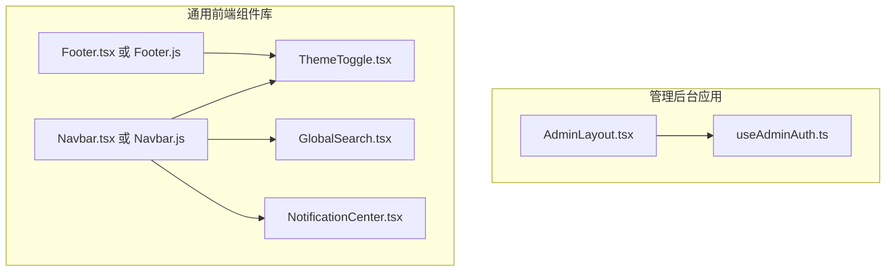
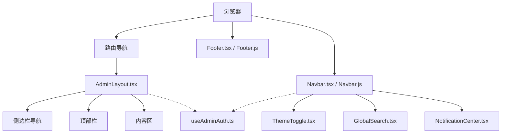
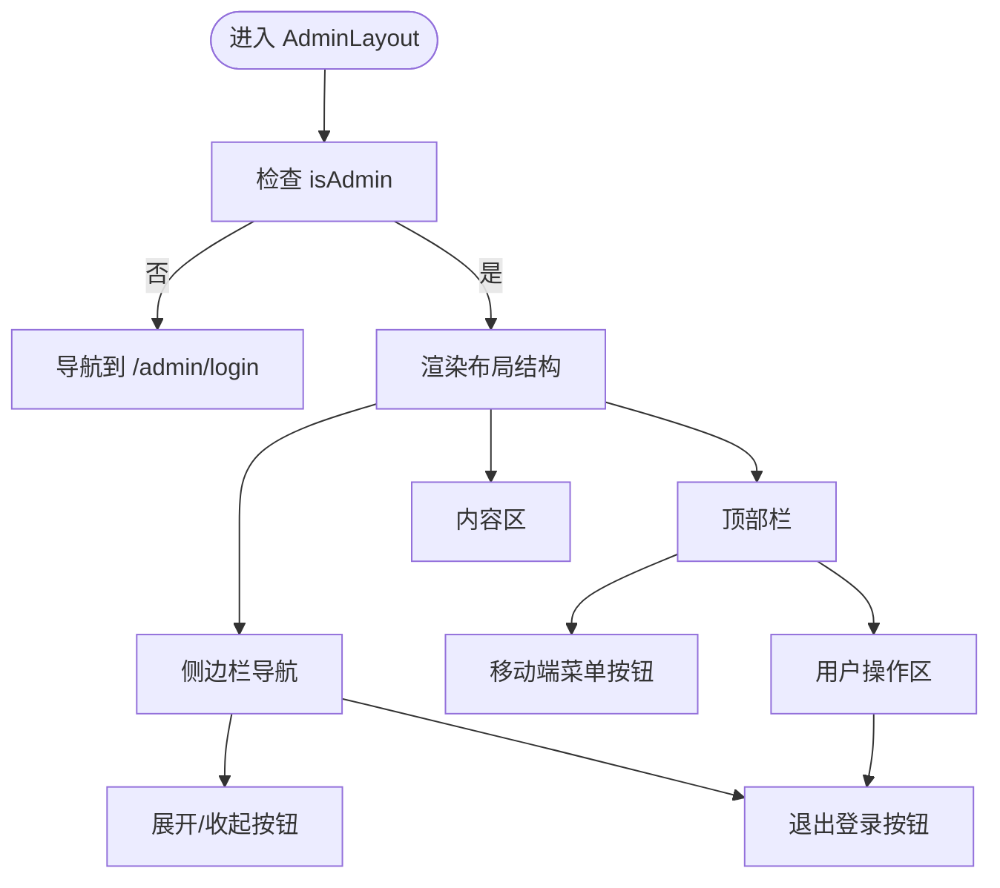
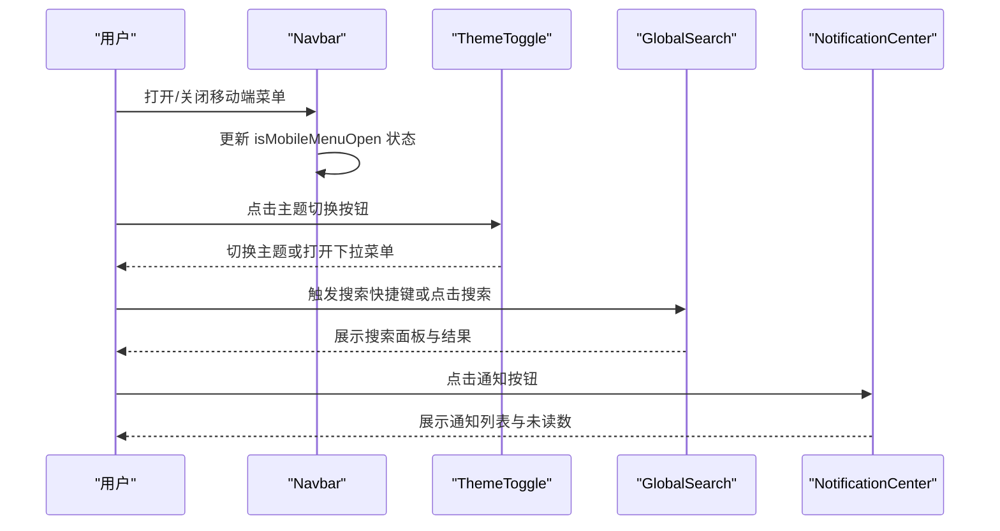
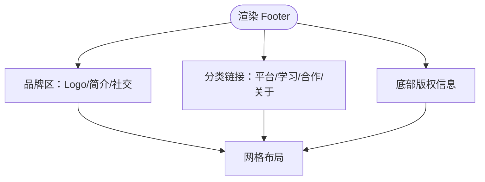
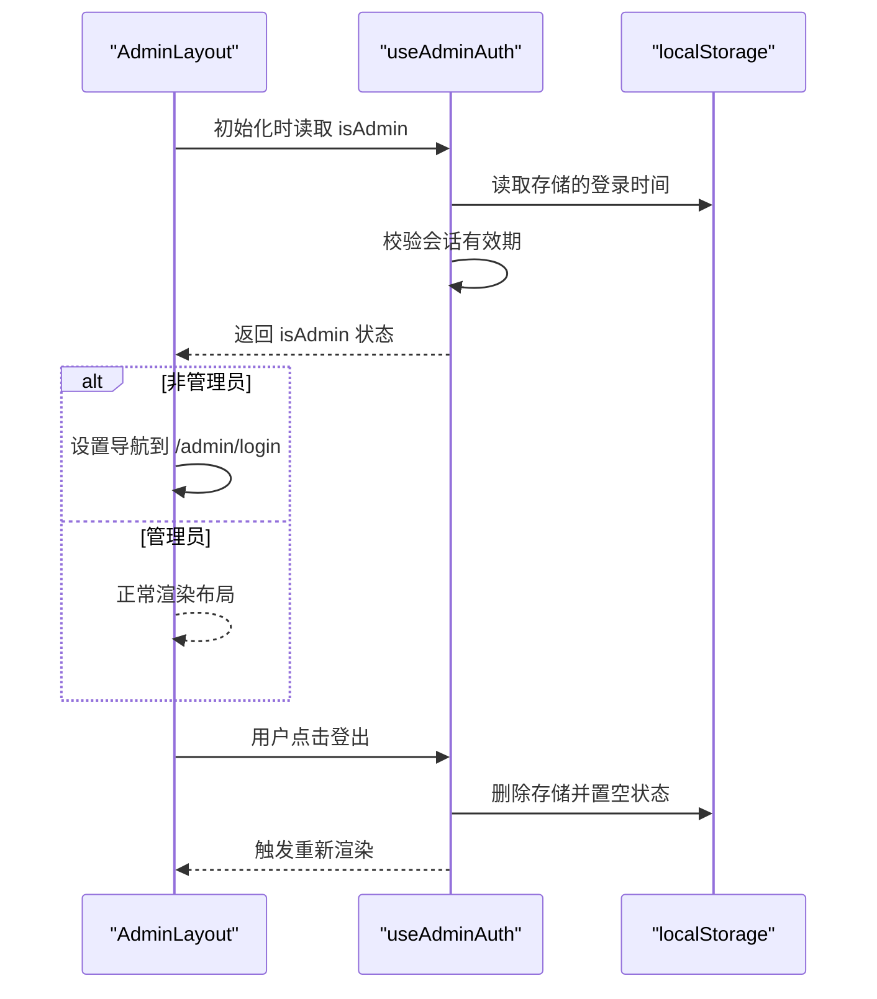
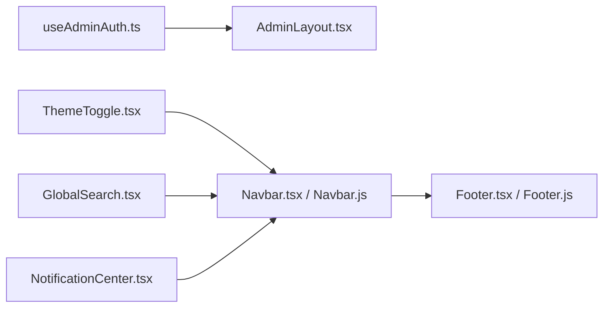

# 核心布局组件

<cite>
**本文引用的文件**
- [AdminLayout.tsx](file://src/components/AdminLayout.tsx)
- [Navbar.tsx](file://archive/src/components/Navbar.tsx)
- [Footer.tsx](file://archive/src/components/Footer.tsx)
- [useAdminAuth.ts](file://src/hooks/useAdminAuth.ts)
- [ThemeToggle.tsx](file://src/components/ThemeToggle.tsx)
- [GlobalSearch.tsx](file://src/components/GlobalSearch.tsx)
- [NotificationCenter.tsx](file://src/components/NotificationCenter.tsx)
- [Navbar.js](file://apps/shell/src/components/Navbar.js)
- [Footer.js](file://apps/shell/src/components/Footer.js)
</cite>

## 目录
1. [引言](#引言)
2. [项目结构](#项目结构)
3. [核心组件](#核心组件)
4. [架构总览](#架构总览)
5. [组件详解](#组件详解)
6. [依赖关系分析](#依赖关系分析)
7. [性能考量](#性能考量)
8. [故障排查指南](#故障排查指南)
9. [结论](#结论)
10. [附录](#附录)

## 引言
本文件聚焦于社区项目的“核心布局组件”，围绕管理后台布局 AdminLayout、导航 Navbar 与页脚 Footer 的设计与实现进行系统性解析。内容涵盖侧边栏导航、响应式布局、权限控制、移动端适配、主题切换、全局搜索、通知中心等关键能力，同时给出属性配置、事件处理、状态管理机制说明，并通过图示展示组件间协作与数据流。

## 项目结构
本仓库采用多包架构（apps/* 与 src/* 并存），核心布局组件在不同应用中存在相似或差异化的实现。本文以 src/components 下的 AdminLayout.tsx 为主线，结合 archive/src/components 下的 Navbar.tsx/Footers.tsx 以及 apps/shell/src 下的 Navbar.js/Footer.js 进行横向对比，帮助理解组件在不同上下文中的职责边界与复用策略。

图表来源
- [AdminLayout.tsx:1-178](file://src/components/AdminLayout.tsx#L1-L178)
- [useAdminAuth.ts:1-67](file://src/hooks/useAdminAuth.ts#L1-L67)
- [Navbar.tsx:1-204](file://archive/src/components/Navbar.tsx#L1-L204)
- [Footer.tsx:1-95](file://archive/src/components/Footer.tsx#L1-L95)
- [ThemeToggle.tsx:1-120](file://src/components/ThemeToggle.tsx#L1-L120)
- [GlobalSearch.tsx:1-216](file://src/components/GlobalSearch.tsx#L1-L216)
- [NotificationCenter.tsx:1-103](file://src/components/NotificationCenter.tsx#L1-L103)
- [Navbar.js:1-47](file://apps/shell/src/components/Navbar.js#L1-L47)
- [Footer.js:1-32](file://apps/shell/src/components/Footer.js#L1-L32)

章节来源
- [AdminLayout.tsx:1-178](file://src/components/AdminLayout.tsx#L1-L178)
- [Navbar.tsx:1-204](file://archive/src/components/Navbar.tsx#L1-L204)
- [Footer.tsx:1-95](file://archive/src/components/Footer.tsx#L1-L95)
- [Navbar.js:1-47](file://apps/shell/src/components/Navbar.js#L1-L47)
- [Footer.js:1-32](file://apps/shell/src/components/Footer.js#L1-L32)

## 核心组件
- 管理后台布局 AdminLayout：负责管理端的整体骨架、侧边栏导航、顶部栏、内容区域渲染与权限拦截。
- 导航 Navbar：提供站点主导航、移动端菜单、搜索与通知入口、主题切换等。
- 页脚 Footer：提供品牌信息、分类链接与版权信息展示。
- 权限钩子 useAdminAuth：提供管理员登录态校验、会话有效期与登出能力。
- 主题切换 ThemeToggle：提供快速切换与下拉选择两种交互方式。
- 全局搜索 GlobalSearch：统一搜索入口，聚合论坛、问答、博客、活动与代码资源。
- 通知中心 NotificationCenter：集中展示与标记通知，支持一键已读。

章节来源
- [AdminLayout.tsx:28-178](file://src/components/AdminLayout.tsx#L28-L178)
- [useAdminAuth.ts:29-66](file://src/hooks/useAdminAuth.ts#L29-L66)
- [ThemeToggle.tsx:11-99](file://src/components/ThemeToggle.tsx#L11-L99)
- [GlobalSearch.tsx:26-216](file://src/components/GlobalSearch.tsx#L26-L216)
- [NotificationCenter.tsx:14-103](file://src/components/NotificationCenter.tsx#L14-L103)

## 架构总览
管理后台布局由 AdminLayout 统一承载，内部包含侧边栏导航与顶部栏，内容区域通过 Outlet 渲染子路由页面。Navbar 与 Footer 在通用页面中作为顶层容器出现，提供跨页面一致的导航体验。权限控制贯穿于 AdminLayout 的渲染流程，未授权用户会被重定向至登录页。Navbar 中集成了主题切换、全局搜索与通知中心等交互组件，提升用户体验。

图表来源
- [AdminLayout.tsx:28-178](file://src/components/AdminLayout.tsx#L28-L178)
- [Navbar.tsx:9-204](file://archive/src/components/Navbar.tsx#L9-L204)
- [Navbar.js:6-47](file://apps/shell/src/components/Navbar.js#L6-L47)
- [Footer.tsx:30-95](file://archive/src/components/Footer.tsx#L30-L95)
- [Footer.js:29-32](file://apps/shell/src/components/Footer.js#L29-L32)
- [useAdminAuth.ts:29-66](file://src/hooks/useAdminAuth.ts#L29-L66)
- [ThemeToggle.tsx:11-99](file://src/components/ThemeToggle.tsx#L11-L99)
- [GlobalSearch.tsx:26-216](file://src/components/GlobalSearch.tsx#L26-L216)
- [NotificationCenter.tsx:14-103](file://src/components/NotificationCenter.tsx#L14-L103)

## 组件详解

### AdminLayout 管理后台布局
- 职责与结构
  - 侧边栏导航：固定/粘性定位，支持移动端抽屉与桌面端折叠/展开。
  - 顶部栏：包含菜单按钮、面包屑级标题与用户操作区。
  - 内容区：通过 Outlet 渲染当前路由页面。
  - 权限控制：基于 useAdminAuth 判断是否管理员，非管理员跳转登录。
- 响应式设计
  - 移动端：侧边栏抽屉覆盖层，点击遮罩或导航项自动关闭。
  - 桌面端：侧边栏可折叠，图标模式下仅显示图标。
- 导航激活态
  - 支持带查询参数的路径匹配，确保多标签页场景下的高亮正确。
- 交互与状态
  - 侧边栏开关与展开状态由本地状态维护。
  - 顶部栏与侧边栏均提供登出入口，统一调用 useAdminAuth.logout。

图表来源
- [AdminLayout.tsx:28-178](file://src/components/AdminLayout.tsx#L28-L178)
- [useAdminAuth.ts:29-66](file://src/hooks/useAdminAuth.ts#L29-L66)

章节来源
- [AdminLayout.tsx:28-178](file://src/components/AdminLayout.tsx#L28-L178)
- [useAdminAuth.ts:29-66](file://src/hooks/useAdminAuth.ts#L29-L66)

### Navbar 导航组件
- 菜单结构
  - 桌面端：水平导航链接集合，支持滚动时背景模糊与阴影效果。
  - 移动端：抽屉式菜单，包含首页、全部导航项、主题切换、个人中心、登录/注册等入口。
- 移动端适配
  - 顶部菜单按钮切换抽屉状态；抽屉内包含主题切换控件与常用入口。
- 用户体验设计
  - 滚动监听动态调整样式；路由变化时自动关闭抽屉并回到顶部。
  - 管理员可见“管理后台”快捷入口，便于快速跳转。
- 与外部组件协作
  - 集成 ThemeToggle、GlobalSearch、NotificationCenter 等交互组件。

图表来源
- [Navbar.tsx:9-204](file://archive/src/components/Navbar.tsx#L9-L204)
- [Navbar.js:6-47](file://apps/shell/src/components/Navbar.js#L6-L47)
- [ThemeToggle.tsx:11-99](file://src/components/ThemeToggle.tsx#L11-L99)
- [GlobalSearch.tsx:26-216](file://src/components/GlobalSearch.tsx#L26-L216)
- [NotificationCenter.tsx:14-103](file://src/components/NotificationCenter.tsx#L14-L103)

章节来源
- [Navbar.tsx:9-204](file://archive/src/components/Navbar.tsx#L9-L204)
- [Navbar.js:6-47](file://apps/shell/src/components/Navbar.js#L6-L47)

### Footer 页脚组件
- 内容组织
  - 左侧品牌区：Logo、简介与社交链接。
  - 右侧分类链接：平台、学习、合作、关于四大板块。
- 版权信息
  - 底部展示公司地址与版权年份。
- 响应式布局
  - 大屏网格布局，小屏堆叠展示，保证可读性与易用性。

图表来源
- [Footer.tsx:30-95](file://archive/src/components/Footer.tsx#L30-L95)
- [Footer.js:29-32](file://apps/shell/src/components/Footer.js#L29-L32)

章节来源
- [Footer.tsx:30-95](file://archive/src/components/Footer.tsx#L30-L95)
- [Footer.js:29-32](file://apps/shell/src/components/Footer.js#L29-L32)

### 权限控制与状态管理
- useAdminAuth 提供
  - 登录态判断：基于本地存储与会话有效期。
  - 登录/登出：写入/清除本地存储并更新状态。
  - 自动过期：定时器每分钟检查一次，超时自动登出。
- 在 AdminLayout 中的应用
  - 组件挂载即检查权限，若非管理员则强制跳转登录页。
  - 顶部栏与侧边栏均提供登出入口，统一调用 logout。

图表来源
- [useAdminAuth.ts:29-66](file://src/hooks/useAdminAuth.ts#L29-L66)
- [AdminLayout.tsx:28-43](file://src/components/AdminLayout.tsx#L28-L43)

章节来源
- [useAdminAuth.ts:29-66](file://src/hooks/useAdminAuth.ts#L29-L66)
- [AdminLayout.tsx:28-43](file://src/components/AdminLayout.tsx#L28-L43)

### 主题切换、全局搜索与通知中心
- ThemeToggle
  - 快速切换：左键循环切换 light/dark/system。
  - 下拉菜单：右键打开选择器，支持精确选择。
  - 动画反馈：切换时带有旋转缩放动画。
- GlobalSearch
  - 快捷键：Cmd/Ctrl+K 打开/关闭。
  - 结果聚合：论坛、问答、博客、活动、代码多类型检索。
  - 交互：点击结果跳转对应页面并清空输入。
- NotificationCenter
  - 未读计数：红点提示，支持一键全部已读。
  - 类型区分：按通知类型分配颜色与图标。
  - 点击行为：未读标记为已读并跳转目标链接。

章节来源
- [ThemeToggle.tsx:11-99](file://src/components/ThemeToggle.tsx#L11-L99)
- [GlobalSearch.tsx:26-216](file://src/components/GlobalSearch.tsx#L26-L216)
- [NotificationCenter.tsx:14-103](file://src/components/NotificationCenter.tsx#L14-L103)

## 依赖关系分析
- AdminLayout 依赖 useAdminAuth 实现权限拦截。
- Navbar 依赖 ThemeToggle、GlobalSearch、NotificationCenter 提升交互能力。
- Footer 与 Navbar 同属顶层容器，分别承担导航与信息展示职责。
- apps/shell 与 src/components 在功能上高度相似，但实现语言与语法略有差异（TSX vs JS），体现了多包架构下的组件复用与差异化落地。

图表来源
- [useAdminAuth.ts:29-66](file://src/hooks/useAdminAuth.ts#L29-L66)
- [AdminLayout.tsx:28-178](file://src/components/AdminLayout.tsx#L28-L178)
- [ThemeToggle.tsx:11-99](file://src/components/ThemeToggle.tsx#L11-L99)
- [GlobalSearch.tsx:26-216](file://src/components/GlobalSearch.tsx#L26-L216)
- [NotificationCenter.tsx:14-103](file://src/components/NotificationCenter.tsx#L14-L103)
- [Navbar.tsx:9-204](file://archive/src/components/Navbar.tsx#L9-L204)
- [Navbar.js:6-47](file://apps/shell/src/components/Navbar.js#L6-L47)
- [Footer.tsx:30-95](file://archive/src/components/Footer.tsx#L30-L95)
- [Footer.js:29-32](file://apps/shell/src/components/Footer.js#L29-L32)

章节来源
- [useAdminAuth.ts:29-66](file://src/hooks/useAdminAuth.ts#L29-L66)
- [AdminLayout.tsx:28-178](file://src/components/AdminLayout.tsx#L28-L178)
- [ThemeToggle.tsx:11-99](file://src/components/ThemeToggle.tsx#L11-L99)
- [GlobalSearch.tsx:26-216](file://src/components/GlobalSearch.tsx#L26-L216)
- [NotificationCenter.tsx:14-103](file://src/components/NotificationCenter.tsx#L14-L103)
- [Navbar.tsx:9-204](file://archive/src/components/Navbar.tsx#L9-L204)
- [Navbar.js:6-47](file://apps/shell/src/components/Navbar.js#L6-L47)
- [Footer.tsx:30-95](file://archive/src/components/Footer.tsx#L30-L95)
- [Footer.js:29-32](file://apps/shell/src/components/Footer.js#L29-L32)

## 性能考量
- 状态最小化：AdminLayout 的侧边栏开关与展开状态仅在组件内维护，避免跨层级传递。
- 事件去抖：Navbar 的滚动监听与路由变更监听在卸载时清理，防止内存泄漏。
- 搜索与通知：GlobalSearch 与 NotificationCenter 使用局部状态与点击外部关闭逻辑，减少全局副作用。
- 图标与动画：ThemeToggle 的切换动画采用过渡类名，避免复杂动画库依赖。

## 故障排查指南
- 管理员权限异常
  - 现象：进入管理后台被重定向到登录页。
  - 排查：确认本地存储中是否存在有效的管理员会话记录，检查会话有效期是否过期。
  - 参考
    - [useAdminAuth.ts:29-66](file://src/hooks/useAdminAuth.ts#L29-L66)
    - [AdminLayout.tsx:35-43](file://src/components/AdminLayout.tsx#L35-L43)
- 移动端菜单无法关闭
  - 现象：抽屉打开后点击内容区域无法关闭。
  - 排查：确认点击外部关闭逻辑是否生效，检查容器引用与事件绑定。
  - 参考
    - [Navbar.tsx:17-28](file://archive/src/components/Navbar.tsx#L17-L28)
    - [GlobalSearch.tsx:40-47](file://src/components/GlobalSearch.tsx#L40-L47)
    - [NotificationCenter.tsx:20-28](file://src/components/NotificationCenter.tsx#L20-L28)
- 主题切换无效
  - 现象：点击主题按钮无反应或下拉菜单不显示。
  - 排查：确认 ThemeContext 是否正确提供 theme/resolvedTheme/setTheme，检查点击外部关闭逻辑。
  - 参考
    - [ThemeToggle.tsx:17-27](file://src/components/ThemeToggle.tsx#L17-L27)
    - [ThemeToggle.tsx:49-67](file://src/components/ThemeToggle.tsx#L49-L67)
- 搜索结果为空
  - 现象：输入关键词无结果。
  - 排查：确认本地存储中是否存在初始数据，检查关键词长度与匹配逻辑。
  - 参考
    - [GlobalSearch.tsx:64-135](file://src/components/GlobalSearch.tsx#L64-L135)

章节来源
- [useAdminAuth.ts:29-66](file://src/hooks/useAdminAuth.ts#L29-L66)
- [AdminLayout.tsx:35-43](file://src/components/AdminLayout.tsx#L35-L43)
- [Navbar.tsx:17-28](file://archive/src/components/Navbar.tsx#L17-L28)
- [GlobalSearch.tsx:40-47](file://src/components/GlobalSearch.tsx#L40-L47)
- [NotificationCenter.tsx:20-28](file://src/components/NotificationCenter.tsx#L20-L28)
- [ThemeToggle.tsx:17-27](file://src/components/ThemeToggle.tsx#L17-L27)
- [ThemeToggle.tsx:49-67](file://src/components/ThemeToggle.tsx#L49-L67)
- [GlobalSearch.tsx:64-135](file://src/components/GlobalSearch.tsx#L64-L135)

## 结论
本项目的核心布局组件以 AdminLayout 为中心，配合 Navbar 与 Footer 形成完整的前台与后台骨架。通过 useAdminAuth 实现权限拦截，结合 ThemeToggle、GlobalSearch、NotificationCenter 等交互组件，构建了良好的可访问性与用户体验。多包架构下，组件在不同应用中保持一致性的同时，也允许根据场景进行差异化实现。

## 附录
- 定制化建议
  - 侧边栏：可根据业务模块扩展导航项，统一图标与文案规范。
  - Navbar：移动端菜单可按需增减入口，注意点击外部关闭逻辑的健壮性。
  - Footer：分类链接与品牌信息应定期更新，确保与产品路线一致。
  - 权限：登录态与会话有效期策略应与后端接口保持一致，避免前后端不一致导致的异常。
- 最佳实践
  - 将通用交互组件（主题、搜索、通知）下沉至公共层，减少重复实现。
  - 对高频交互（滚动、键盘事件）添加防抖与清理逻辑，避免内存泄漏。
  - 使用语义化标签与无障碍属性，提升可访问性。