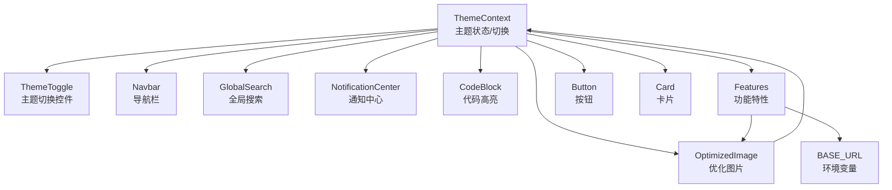
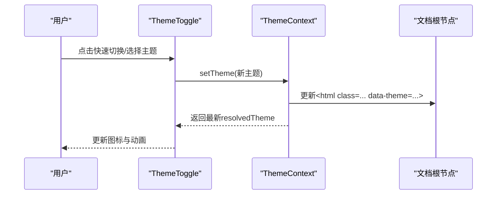
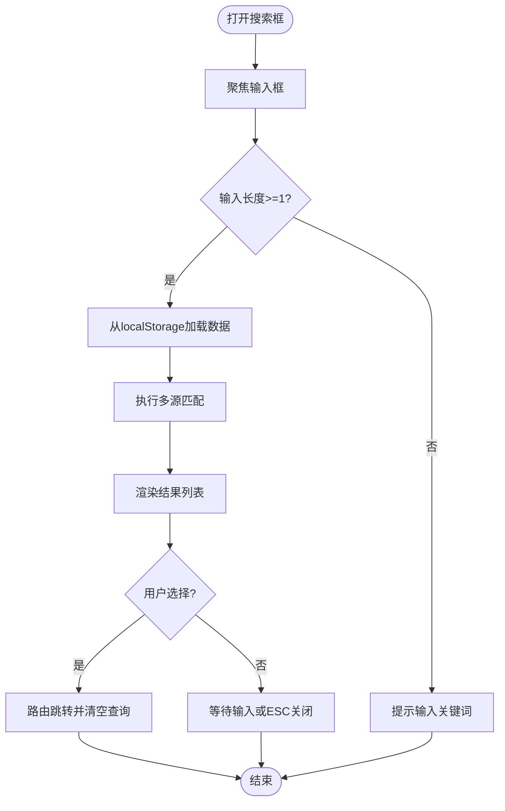
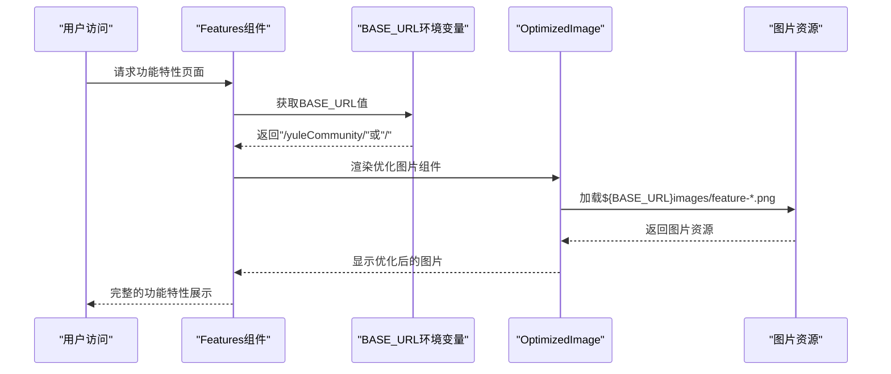
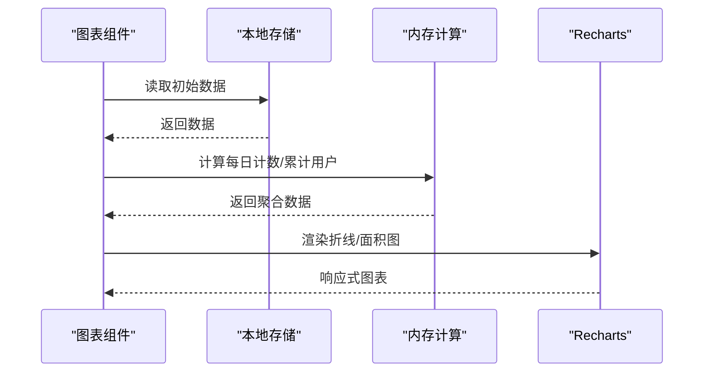
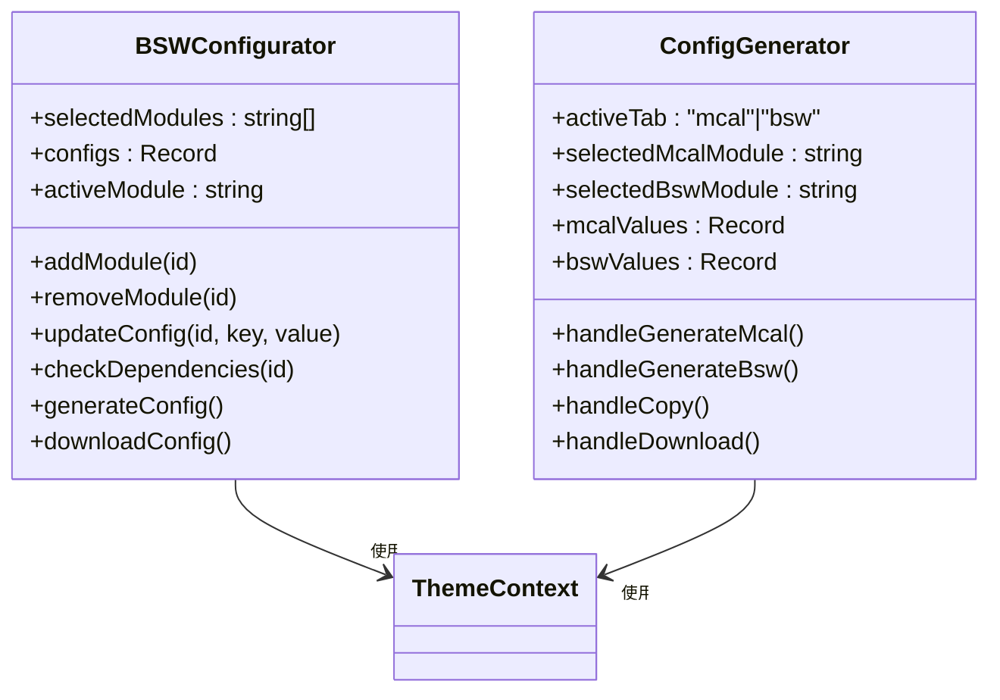
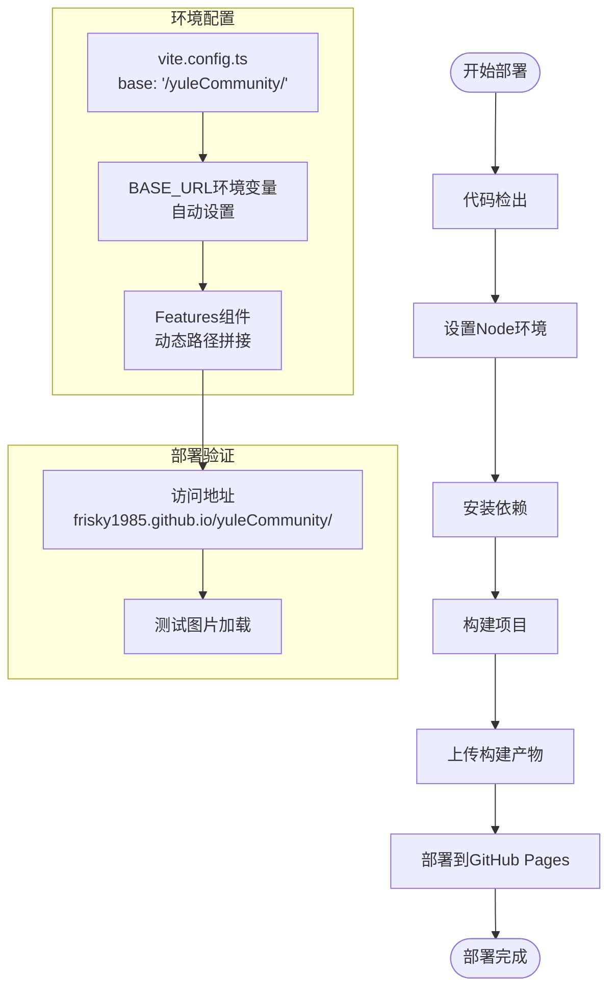
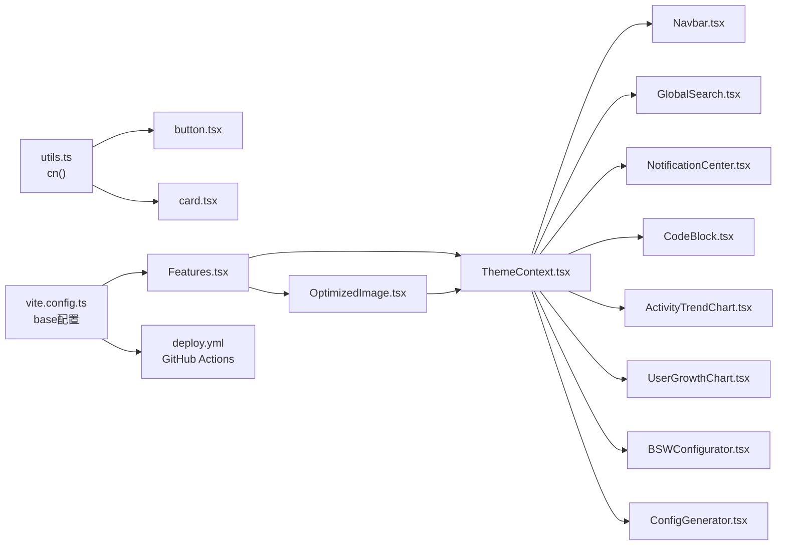

# 组件系统

<cite>
**本文引用的文件**
- [src/components/ui/button.tsx](file://src/components/ui/button.tsx)
- [src/components/ui/card.tsx](file://src/components/ui/card.tsx)
- [src/components/ThemeToggle.tsx](file://src/components/ThemeToggle.tsx)
- [src/contexts/ThemeContext.tsx](file://src/contexts/ThemeContext.tsx)
- [src/components/Navbar.tsx](file://src/components/Navbar.tsx)
- [src/components/Footer.tsx](file://src/components/Footer.tsx)
- [src/components/CodeBlock.tsx](file://src/components/CodeBlock.tsx)
- [src/components/GlobalSearch.tsx](file://src/components/GlobalSearch.tsx)
- [src/components/NotificationCenter.tsx](file://src/components/NotificationCenter.tsx)
- [src/components/admin/ActivityTrendChart.tsx](file://src/components/admin/ActivityTrendChart.tsx)
- [src/components/admin/UserGrowthChart.tsx](file://src/components/admin/UserGrowthChart.tsx)
- [src/components/BSWConfigurator.tsx](file://src/components/BSWConfigurator.tsx)
- [src/components/ConfigGenerator.tsx](file://src/components/ConfigGenerator.tsx)
- [src/components/Features.tsx](file://src/components/Features.tsx)
- [src/components/OptimizedImage.tsx](file://src/components/OptimizedImage.tsx)
- [src/lib/utils.ts](file://src/lib/utils.ts)
- [src/App.tsx](file://src/App.tsx)
- [vite.config.ts](file://vite.config.ts)
- [package.json](file://package.json)
- [.github/workflows/deploy.yml](file://.github/workflows/deploy.yml)
</cite>

## 更新摘要
**变更内容**
- 添加Features组件图片路径动态化修复说明
- 解释BASE_URL环境变量的使用和GitHub Pages子路径部署问题的解决方案
- 更新组件系统架构图以包含图片路径处理机制
- 新增部署配置和环境变量相关章节

## 目录
1. [简介](#简介)
2. [项目结构](#项目结构)
3. [核心组件](#核心组件)
4. [架构总览](#架构总览)
5. [详细组件分析](#详细组件分析)
6. [部署与环境配置](#部署与环境配置)
7. [依赖分析](#依赖分析)
8. [性能考量](#性能考量)
9. [故障排查指南](#故障排查指南)
10. [结论](#结论)
11. [附录](#附录)

## 简介
本文件面向YuleTech社区技术平台的组件系统，系统化梳理组件架构理念与分类体系，覆盖核心UI组件、自定义业务组件、图表组件与配置生成器，并深入解析其设计模式、属性配置、事件处理、组合关系与数据流。文档同时提供响应式设计与主题系统集成说明、可访问性与跨浏览器兼容性建议，以及扩展与定制指南，帮助开发者高效使用与演进组件库。

**更新** 本版本新增了Features组件图片路径动态化修复说明，解决了GitHub Pages子路径部署环境下的资源加载问题。

## 项目结构
组件主要分布于以下目录：
- 原子级UI组件：src/components/ui（如按钮、卡片）
- 业务通用组件：src/components（导航、页脚、主题切换、全局搜索、通知中心、代码高亮、功能特性等）
- 管理后台图表：src/components/admin（活动趋势、用户增长等）
- 配置与生成器：src/components/BSWConfigurator.tsx、src/components/ConfigGenerator.tsx
- 主题上下文：src/contexts/ThemeContext.tsx
- 工具函数：src/lib/utils.ts（Tailwind类名合并）
- 优化组件：src/components/OptimizedImage.tsx（图片懒加载与WebP支持）

```mermaid
graph TB
subgraph "应用入口"
APP["App.tsx"]
end
subgraph "布局与导航"
NAV["Navbar.tsx"]
FOOTER["Footer.tsx"]
end
subgraph "主题系统"
THEMECTX["ThemeContext.tsx"]
THMETOGGLE["ThemeToggle.tsx"]
end
subgraph "通用组件"
SEARCH["GlobalSearch.tsx"]
NOTIF["NotificationCenter.tsx"]
CODEBLK["CodeBlock.tsx"]
FEATURES["Features.tsx"]
OPTIMG["OptimizedImage.tsx"]
END
subgraph "UI原子组件"
BTN["button.tsx"]
CARD["card.tsx"]
end
subgraph "管理图表"
ACTTREND["ActivityTrendChart.tsx"]
USRGROWTH["UserGrowthChart.tsx"]
end
subgraph "配置与生成器"
BSWCFG["BSWConfigurator.tsx"]
CFGGEN["ConfigGenerator.tsx"]
end
APP --> NAV
APP --> FOOTER
NAV --> THMETOGGLE
NAV --> SEARCH
NAV --> NOTIF
NOTIF --> THEMECTX
SEARCH --> THEMECTX
CODEBLK --> THEMECTX
FEATURES --> OPTIMG
FEATURES --> THEMECTX
OPTIMG --> THEMECTX
ACTTREND --> THEMECTX
USRGROWTH --> THEMECTX
BSWCFG --> THEMECTX
CFGGEN --> THEMECTX
BTN --> THEMECTX
CARD --> THEMECTX
```

**图示来源**
- [src/App.tsx:30-115](file://src/App.tsx#L30-L115)
- [src/components/Navbar.tsx:9-203](file://src/components/Navbar.tsx#L9-L203)
- [src/components/ThemeToggle.tsx:11-99](file://src/components/ThemeToggle.tsx#L11-L99)
- [src/contexts/ThemeContext.tsx:41-116](file://src/contexts/ThemeContext.tsx#L41-L116)
- [src/components/GlobalSearch.tsx:26-215](file://src/components/GlobalSearch.tsx#L26-L215)
- [src/components/NotificationCenter.tsx:14-102](file://src/components/NotificationCenter.tsx#L14-L102)
- [src/components/CodeBlock.tsx:14-48](file://src/components/CodeBlock.tsx#L14-L48)
- [src/components/Features.tsx:25-93](file://src/components/Features.tsx#L25-L93)
- [src/components/OptimizedImage.tsx:14-90](file://src/components/OptimizedImage.tsx#L14-L90)
- [src/components/ui/button.tsx:31-48](file://src/components/ui/button.tsx#L31-L48)
- [src/components/ui/card.tsx:4-46](file://src/components/ui/card.tsx#L4-L46)
- [src/components/admin/ActivityTrendChart.tsx:29-128](file://src/components/admin/ActivityTrendChart.tsx#L29-L128)
- [src/components/admin/UserGrowthChart.tsx:23-118](file://src/components/admin/UserGrowthChart.tsx#L23-L118)
- [src/components/BSWConfigurator.tsx:102-507](file://src/components/BSWConfigurator.tsx#L102-L507)
- [src/components/ConfigGenerator.tsx:392-681](file://src/components/ConfigGenerator.tsx#L392-L681)

**章节来源**
- [src/App.tsx:30-115](file://src/App.tsx#L30-L115)
- [src/components/Navbar.tsx:9-203](file://src/components/Navbar.tsx#L9-L203)
- [src/components/ThemeToggle.tsx:11-99](file://src/components/ThemeToggle.tsx#L11-L99)
- [src/contexts/ThemeContext.tsx:41-116](file://src/contexts/ThemeContext.tsx#L41-L116)

## 核心组件
本节聚焦原子UI组件与通用业务组件，阐述其设计理念、API与使用方式。

- 按钮 Button
  - 设计理念：基于变体与尺寸的组合，通过类名变体工厂统一风格；支持前向ref与原生button属性透传。
  - 关键属性：className、variant（default/destructive/outline/secondary/ghost/link）、size（default/sm/lg/icon）。
  - 事件处理：透传onClick等原生事件；禁用态自动添加disabled样式。
  - 复杂度：渲染O(1)，类名合并O(n)（n为传入类名数量）。
  - 使用示例路径：[按钮组件定义:31-48](file://src/components/ui/button.tsx#L31-L48)

- 卡片 Card
  - 设计理念：语义化拆分为容器、头部、标题、描述、内容、底部，便于组合与复用。
  - 关键属性：透传HTML div/button属性；支持className扩展。
  - 使用示例路径：[卡片组件定义:4-46](file://src/components/ui/card.tsx#L4-L46)

- 主题切换 ThemeToggle
  - 功能：快速在 light/dark/system 三者间切换；右键弹出下拉菜单精细选择。
  - 事件：点击触发快速切换动画；点击外部关闭下拉；键盘右键打开菜单。
  - 使用示例路径：[主题切换组件:11-99](file://src/components/ThemeToggle.tsx#L11-L99)

- 全局搜索 GlobalSearch
  - 功能：聚合论坛、问答、博客、活动与代码搜索结果，支持快捷键Cmd/Ctrl+K与Esc。
  - 事件：输入框聚焦、点击外部关闭、选择结果跳转。
  - 使用示例路径：[全局搜索组件:26-215](file://src/components/GlobalSearch.tsx#L26-L215)

- 通知中心 NotificationCenter
  - 功能：展示类型化通知，支持标记已读、一键全部已读、点击跳转。
  - 事件：点击通知标记已读并跳转；点击外部关闭。
  - 使用示例路径：[通知中心组件:14-102](file://src/components/NotificationCenter.tsx#L14-L102)

- 代码高亮 CodeBlock
  - 功能：根据主题自动切换语法高亮样式；动态监听主题变化。
  - 事件：无交互事件；通过effect监听主题状态。
  - 使用示例路径：[代码高亮组件:14-48](file://src/components/CodeBlock.tsx#L14-L48)

- 功能特性 Features
  - 功能：展示四大核心功能模块（开源代码、开发工具链、学习平台、硬件开发板），支持图片懒加载与滚动预览。
  - 图片路径处理：使用BASE_URL环境变量动态拼接图片路径，解决GitHub Pages子路径部署问题。
  - 使用示例路径：[功能特性组件:25-93](file://src/components/Features.tsx#L25-L93)

- 优化图片 OptimizedImage
  - 功能：支持图片懒加载、WebP格式优化、占位符动画、优先级加载。
  - 性能优化：IntersectionObserver实现懒加载；自动检测WebP支持；支持优先级加载。
  - 使用示例路径：[优化图片组件:14-90](file://src/components/OptimizedImage.tsx#L14-L90)

**章节来源**
- [src/components/ui/button.tsx:31-48](file://src/components/ui/button.tsx#L31-L48)
- [src/components/ui/card.tsx:4-46](file://src/components/ui/card.tsx#L4-L46)
- [src/components/ThemeToggle.tsx:11-99](file://src/components/ThemeToggle.tsx#L11-L99)
- [src/components/GlobalSearch.tsx:26-215](file://src/components/GlobalSearch.tsx#L26-L215)
- [src/components/NotificationCenter.tsx:14-102](file://src/components/NotificationCenter.tsx#L14-L102)
- [src/components/CodeBlock.tsx:14-48](file://src/components/CodeBlock.tsx#L14-L48)
- [src/components/Features.tsx:25-93](file://src/components/Features.tsx#L25-L93)
- [src/components/OptimizedImage.tsx:14-90](file://src/components/OptimizedImage.tsx#L14-L90)

## 架构总览
组件系统采用"上下文驱动 + 组合优先"的架构：
- 主题上下文 ThemeContext 提供主题状态与切换能力，贯穿导航、搜索、通知、代码块等组件。
- 原子UI组件通过变体工厂与类名合并工具实现一致的视觉与交互体验。
- 业务组件通过组合原子组件与上下文，形成可复用的页面片段。
- 图表组件与配置生成器作为高级组件，依赖主题上下文与本地存储实现数据持久化与主题适配。
- 图片处理组件通过BASE_URL环境变量实现跨部署环境的资源路径动态化。



**图示来源**
- [src/contexts/ThemeContext.tsx:41-116](file://src/contexts/ThemeContext.tsx#L41-L116)
- [src/components/ThemeToggle.tsx:11-99](file://src/components/ThemeToggle.tsx#L11-L99)
- [src/components/Navbar.tsx:9-203](file://src/components/Navbar.tsx#L9-L203)
- [src/components/GlobalSearch.tsx:26-215](file://src/components/GlobalSearch.tsx#L26-L215)
- [src/components/NotificationCenter.tsx:14-102](file://src/components/NotificationCenter.tsx#L14-L102)
- [src/components/CodeBlock.tsx:14-48](file://src/components/CodeBlock.tsx#L14-L48)
- [src/components/Features.tsx:25-93](file://src/components/Features.tsx#L25-L93)
- [src/components/OptimizedImage.tsx:14-90](file://src/components/OptimizedImage.tsx#L14-L90)
- [src/components/ui/button.tsx:31-48](file://src/components/ui/button.tsx#L31-L48)
- [src/components/ui/card.tsx:4-46](file://src/components/ui/card.tsx#L4-L46)

## 详细组件分析

### 主题系统与主题切换
- 设计模式：提供 Provider/Consumer 模式，支持本地存储与系统偏好联动；首次渲染避免闪烁。
- 属性配置：defaultTheme（默认主题）、setTheme（设置主题）、toggleTheme（快速切换）、resolvedTheme（实际生效主题）。
- 事件处理：媒体查询变更时自动同步；点击外部关闭下拉；右键菜单打开。
- 数据流：ThemeContext -> ThemeToggle -> DOM根节点类名与data-theme属性 -> 所有组件样式适配。



**图示来源**
- [src/components/ThemeToggle.tsx:11-99](file://src/components/ThemeToggle.tsx#L11-L99)
- [src/contexts/ThemeContext.tsx:41-116](file://src/contexts/ThemeContext.tsx#L41-L116)

**章节来源**
- [src/contexts/ThemeContext.tsx:41-116](file://src/contexts/ThemeContext.tsx#L41-L116)
- [src/components/ThemeToggle.tsx:11-99](file://src/components/ThemeToggle.tsx#L11-L99)

### 导航栏与页脚
- 导航栏 Navbar
  - 功能：滚动阴影、移动端菜单、登录/个人中心、管理员入口、主题切换、全局搜索、通知中心。
  - 事件：滚动监听、路由变化自动关闭菜单并回到顶部。
  - 使用示例路径：[导航栏组件:9-203](file://src/components/Navbar.tsx#L9-L203)

- 页脚 Footer
  - 功能：品牌信息、多列链接、社交图标、版权信息。
  - 使用示例路径：[页脚组件:30-94](file://src/components/Footer.tsx#L30-L94)

**章节来源**
- [src/components/Navbar.tsx:9-203](file://src/components/Navbar.tsx#L9-L203)
- [src/components/Footer.tsx:30-94](file://src/components/Footer.tsx#L30-L94)

### 全局搜索与通知中心
- 全局搜索 GlobalSearch
  - 功能：聚合多源数据（论坛、问答、博客、活动、代码），支持快捷键与外部点击关闭。
  - 数据流：从localStorage读取初始数据 -> 搜索匹配 -> 渲染结果列表 -> 路由跳转。
  - 使用示例路径：[全局搜索组件:26-215](file://src/components/GlobalSearch.tsx#L26-L215)

- 通知中心 NotificationCenter
  - 功能：按类型区分图标与颜色，支持标记已读、一键全部已读、点击跳转。
  - 使用示例路径：[通知中心组件:14-102](file://src/components/NotificationCenter.tsx#L14-L102)



**图示来源**
- [src/components/GlobalSearch.tsx:26-215](file://src/components/GlobalSearch.tsx#L26-L215)

**章节来源**
- [src/components/GlobalSearch.tsx:26-215](file://src/components/GlobalSearch.tsx#L26-L215)
- [src/components/NotificationCenter.tsx:14-102](file://src/components/NotificationCenter.tsx#L14-L102)

### 代码高亮
- 设计模式：根据文档根节点的dark类名动态切换高亮主题；定时轮询确保主题切换即时生效。
- 使用示例路径：[代码高亮组件:14-48](file://src/components/CodeBlock.tsx#L14-L48)

**章节来源**
- [src/components/CodeBlock.tsx:14-48](file://src/components/CodeBlock.tsx#L14-L48)

### 功能特性组件与图片路径动态化
- 设计模式：使用BASE_URL环境变量动态拼接图片路径，解决GitHub Pages子路径部署问题。
- 图片优化：集成OptimizedImage组件，支持懒加载、WebP格式、占位符动画。
- 部署适配：在本地开发环境使用"/"基路径，在GitHub Pages部署使用"/yuleCommunity/"子路径。
- 使用示例路径：[功能特性组件:25-93](file://src/components/Features.tsx#L25-L93)

**更新** 修复了GitHub Pages子路径部署下的图片加载问题，通过BASE_URL环境变量实现动态路径拼接。



**图示来源**
- [src/components/Features.tsx:25-93](file://src/components/Features.tsx#L25-L93)
- [src/components/OptimizedImage.tsx:14-90](file://src/components/OptimizedImage.tsx#L14-L90)

**章节来源**
- [src/components/Features.tsx:25-93](file://src/components/Features.tsx#L25-L93)
- [src/components/OptimizedImage.tsx:14-90](file://src/components/OptimizedImage.tsx#L14-L90)

### 图表组件（管理后台）
- 活动趋势 ActivityTrendChart
  - 功能：统计近14天发帖、回复、问答、活动签到等互动趋势，面积图展示。
  - 数据源：本地存储中的论坛、问答、活动数据。
  - 使用示例路径：[活动趋势图表:29-128](file://src/components/admin/ActivityTrendChart.tsx#L29-L128)

- 用户增长 UserGrowthChart
  - 功能：基于积分历史推导新增用户，展示累计用户与日增用户曲线。
  - 数据源：本地存储中的用户系统历史。
  - 使用示例路径：[用户增长图表:23-118](file://src/components/admin/UserGrowthChart.tsx#L23-L118)



**图示来源**
- [src/components/admin/ActivityTrendChart.tsx:29-128](file://src/components/admin/ActivityTrendChart.tsx#L29-L128)
- [src/components/admin/UserGrowthChart.tsx:23-118](file://src/components/admin/UserGrowthChart.tsx#L23-L118)

**章节来源**
- [src/components/admin/ActivityTrendChart.tsx:29-128](file://src/components/admin/ActivityTrendChart.tsx#L29-L128)
- [src/components/admin/UserGrowthChart.tsx:23-118](file://src/components/admin/UserGrowthChart.tsx#L23-L118)

### 配置与生成器组件
- BSWConfigurator
  - 功能：可视化配置BSW模块（MCAL/ECUAL/Service/RTE），校验依赖关系，生成JSON配置并可下载。
  - 设计模式：模块定义与默认配置分离；参数类型驱动UI渲染；依赖检查保障正确性。
  - 使用示例路径：[BSW配置器:102-507](file://src/components/BSWConfigurator.tsx#L102-L507)

- ConfigGenerator
  - 功能：图形化配置MCAL/BSW模块参数，生成符合AutoSAR标准的C语言配置头文件，支持复制与下载。
  - 设计模式：模块参数定义与代码生成器解耦；Tab切换驱动不同模块集。
  - 使用示例路径：[配置生成器:392-681](file://src/components/ConfigGenerator.tsx#L392-L681)



**图示来源**
- [src/components/BSWConfigurator.tsx:102-507](file://src/components/BSWConfigurator.tsx#L102-L507)
- [src/components/ConfigGenerator.tsx:392-681](file://src/components/ConfigGenerator.tsx#L392-L681)
- [src/contexts/ThemeContext.tsx:41-116](file://src/contexts/ThemeContext.tsx#L41-L116)

**章节来源**
- [src/components/BSWConfigurator.tsx:102-507](file://src/components/BSWConfigurator.tsx#L102-L507)
- [src/components/ConfigGenerator.tsx:392-681](file://src/components/ConfigGenerator.tsx#L392-L681)

## 部署与环境配置
本节介绍组件系统在不同部署环境下的配置与优化策略。

### GitHub Pages子路径部署
- 问题背景：项目部署在GitHub Pages的子路径"/yuleCommunity/"下，使用绝对路径"/images/feature-*.png"会导致图片加载失败。
- 解决方案：通过BASE_URL环境变量动态拼接图片路径，实现跨环境路径适配。
- Vite配置：在vite.config.ts中设置`base: '/yuleCommunity/'`，确保构建产物的相对路径正确。

### 环境变量配置
- BASE_URL环境变量：在开发环境为空字符串，在生产环境为"/yuleCommunity/"
- import.meta.env.BASE_URL：Vite内置的环境变量，自动根据base配置设置
- 降级处理：当BASE_URL不存在时，默认使用"/"作为基路径

### 自动化部署流程
- GitHub Actions工作流：自动化构建、测试、部署到GitHub Pages
- 部署步骤：代码检出 -> Node环境设置 -> 依赖安装 -> 构建 -> 上传工件 -> 部署
- 访问地址：https://frisky1985.github.io/yuleCommunity/



**图示来源**
- [.github/workflows/deploy.yml:1-53](file://.github/workflows/deploy.yml#L1-L53)
- [vite.config.ts:6-7](file://vite.config.ts#L6-L7)
- [src/components/Features.tsx:25-33](file://src/components/Features.tsx#L25-L33)

**章节来源**
- [.github/workflows/deploy.yml:1-53](file://.github/workflows/deploy.yml#L1-L53)
- [vite.config.ts:6-7](file://vite.config.ts#L6-L7)
- [src/components/Features.tsx:25-33](file://src/components/Features.tsx#L25-L33)
- [package.json:4](file://package.json#L4)

## 依赖分析
- 组件耦合
  - 通用组件对主题上下文存在弱耦合（读取resolvedTheme、响应主题切换），通过useTheme钩子注入。
  - 图表组件与配置生成器依赖本地存储与上下文，形成数据-视图-交互闭环。
  - Features组件与OptimizedImage组件通过BASE_URL环境变量实现松耦合的资源路径处理。
- 外部依赖
  - Recharts用于图表渲染；react-syntax-highlighter用于代码高亮；lucide-react用于图标。
  - Vite PWA插件用于离线缓存与渐进式应用支持。
- 类名合并
  - 通过工具函数统一处理Tailwind类名合并，避免冲突与重复。



**图示来源**
- [src/lib/utils.ts:4-6](file://src/lib/utils.ts#L4-L6)
- [src/contexts/ThemeContext.tsx:41-116](file://src/contexts/ThemeContext.tsx#L41-L116)
- [src/components/ui/button.tsx:31-48](file://src/components/ui/button.tsx#L31-L48)
- [src/components/ui/card.tsx:4-46](file://src/components/ui/card.tsx#L4-L46)
- [src/components/Navbar.tsx:9-203](file://src/components/Navbar.tsx#L9-L203)
- [src/components/GlobalSearch.tsx:26-215](file://src/components/GlobalSearch.tsx#L26-L215)
- [src/components/NotificationCenter.tsx:14-102](file://src/components/NotificationCenter.tsx#L14-L102)
- [src/components/CodeBlock.tsx:14-48](file://src/components/CodeBlock.tsx#L14-L48)
- [src/components/Features.tsx:25-93](file://src/components/Features.tsx#L25-L93)
- [src/components/OptimizedImage.tsx:14-90](file://src/components/OptimizedImage.tsx#L14-L90)
- [src/components/admin/ActivityTrendChart.tsx:29-128](file://src/components/admin/ActivityTrendChart.tsx#L29-L128)
- [src/components/admin/UserGrowthChart.tsx:23-118](file://src/components/admin/UserGrowthChart.tsx#L23-L118)
- [src/components/BSWConfigurator.tsx:102-507](file://src/components/BSWConfigurator.tsx#L102-L507)
- [src/components/ConfigGenerator.tsx:392-681](file://src/components/ConfigGenerator.tsx#L392-L681)
- [vite.config.ts:6-7](file://vite.config.ts#L6-L7)
- [.github/workflows/deploy.yml:1-53](file://.github/workflows/deploy.yml#L1-L53)

**章节来源**
- [src/lib/utils.ts:4-6](file://src/lib/utils.ts#L4-L6)
- [src/contexts/ThemeContext.tsx:41-116](file://src/contexts/ThemeContext.tsx#L41-L116)

## 性能考量
- 渲染优化
  - 使用React.memo与useMemo缓存计算结果（如图表数据聚合）。
  - 惰性加载与Suspense结合，减少首屏阻塞。
- 事件与副作用
  - 避免在渲染阶段进行昂贵操作；将监听器注册与清理放在useEffect中。
  - 对高频轮询（如CodeBlock主题监听）设置合理间隔与清理。
- 图片优化
  - OptimizedImage组件支持IntersectionObserver懒加载，减少不必要的网络请求。
  - 自动检测WebP格式支持，提供更好的压缩效果。
  - 占位符动画提升用户体验，避免空白图片闪烁。
- 主题切换
  - 首屏防止闪烁：Provider在挂载完成后再暴露真实上下文值；根节点类名切换最小化DOM变更。
- 资源路径优化
  - BASE_URL环境变量确保在不同部署环境下资源路径正确解析。
  - Vite的base配置与import.meta.env.BASE_URL协同工作，实现无缝的路径适配。

**更新** 新增了图片懒加载、WebP优化和环境变量路径适配的性能考量。

## 故障排查指南
- 主题切换无效
  - 检查根节点是否正确添加dark/light类名与data-theme属性。
  - 确认useTheme返回值与resolvedTheme一致。
  - 参考路径：[主题上下文实现:41-116](file://src/contexts/ThemeContext.tsx#L41-L116)

- 搜索框无法关闭或快捷键无效
  - 确认点击外部关闭逻辑与键盘事件绑定正常。
  - 参考路径：[全局搜索实现:26-215](file://src/components/GlobalSearch.tsx#L26-L215)

- 通知未标记已读或无法跳转
  - 检查通知点击事件与路由跳转逻辑。
  - 参考路径：[通知中心实现:14-102](file://src/components/NotificationCenter.tsx#L14-L102)

- 图表数据为空或异常
  - 检查本地存储键名与初始数据一致性；确认日期格式与时间戳转换。
  - 参考路径：[活动趋势图表:29-128](file://src/components/admin/ActivityTrendChart.tsx#L29-L128)、[用户增长图表:23-118](file://src/components/admin/UserGrowthChart.tsx#L23-L118)

- 功能特性图片加载失败
  - 检查BASE_URL环境变量是否正确设置。
  - 确认图片路径拼接逻辑：`${import.meta.env.BASE_URL}images/feature-*.png`。
  - 验证图片文件是否存在于正确的目录结构中。
  - 参考路径：[功能特性组件:25-33](file://src/components/Features.tsx#L25-L33)

- GitHub Pages部署资源路径问题
  - 确认vite.config.ts中的base配置与实际部署路径一致。
  - 检查GitHub Actions工作流是否正确构建和部署。
  - 验证访问地址是否指向正确的子路径。
  - 参考路径：[vite.config.ts:6-7](file://vite.config.ts#L6-L7)、[deploy.yml:1-53](file://.github/workflows/deploy.yml#L1-L53)

**更新** 新增了功能特性图片加载失败和GitHub Pages部署资源路径问题的故障排查指南。

**章节来源**
- [src/contexts/ThemeContext.tsx:41-116](file://src/contexts/ThemeContext.tsx#L41-L116)
- [src/components/GlobalSearch.tsx:26-215](file://src/components/GlobalSearch.tsx#L26-L215)
- [src/components/NotificationCenter.tsx:14-102](file://src/components/NotificationCenter.tsx#L14-L102)
- [src/components/admin/ActivityTrendChart.tsx:29-128](file://src/components/admin/ActivityTrendChart.tsx#L29-L128)
- [src/components/admin/UserGrowthChart.tsx:23-118](file://src/components/admin/UserGrowthChart.tsx#L23-L118)
- [src/components/Features.tsx:25-33](file://src/components/Features.tsx#L25-L33)
- [vite.config.ts:6-7](file://vite.config.ts#L6-L7)
- [.github/workflows/deploy.yml:1-53](file://.github/workflows/deploy.yml#L1-L53)

## 结论
YuleTech组件系统以主题上下文为核心，结合原子UI组件与业务组件，形成清晰的层次化架构。通过变体工厂、类名合并工具与上下文注入，实现了主题一致、易于扩展的组件生态。高级组件（图表、配置生成器）进一步提升了平台的专业性与工程效率。

**更新** 本次更新重点解决了GitHub Pages子路径部署环境下的资源加载问题，通过BASE_URL环境变量实现了跨环境的图片路径动态化处理。新增的OptimizedImage组件提供了图片懒加载和WebP优化功能，显著提升了页面性能。完善的部署配置和故障排查指南确保了组件系统在不同环境下的稳定运行。

建议在后续迭代中持续完善可访问性、跨浏览器兼容性与测试覆盖，以保障长期可维护性。同时可以考虑进一步优化图片加载策略，如预加载关键图片、实现图片格式检测等。

## 附录
- 组件扩展与定制
  - 新增UI变体：在变体工厂中扩展variants与defaultVariants；保持命名规范与语义化。
  - 自定义业务组件：遵循组合优先原则，尽量复用原子组件与上下文；对外暴露稳定属性与事件。
  - 主题适配：统一通过ThemeContext读取resolvedTheme；避免硬编码颜色值。
  - 环境适配：使用BASE_URL环境变量处理不同部署环境的资源路径问题。
- 响应式设计与主题系统集成
  - 使用Tailwind断点与CSS变量；在图表与代码高亮中动态适配主题。
  - 图片优化：通过OptimizedImage组件实现懒加载、WebP格式支持和占位符动画。
- 可访问性与兼容性
  - 为交互元素提供aria-label；键盘可达性（Tab/Enter/Space）；焦点管理；降级策略（无JS场景）。
  - 支持多种图片格式，确保在不同浏览器中的兼容性。
- 使用示例与最佳实践
  - 按钮：优先使用变体与尺寸；避免在组件内硬编码样式。
  - 卡片：严格区分头部/内容/底部；避免在卡片内直接使用全局样式。
  - 搜索与通知：提供占位文案与无障碍标签；避免长任务阻塞UI。
  - 图片资源：使用OptimizedImage组件处理图片加载；确保BASE_URL环境变量正确配置。
  - 部署配置：在vite.config.ts中正确设置base路径；在GitHub Actions中配置正确的构建和部署流程。

**更新** 新增了环境变量配置、图片优化和部署最佳实践的相关内容。