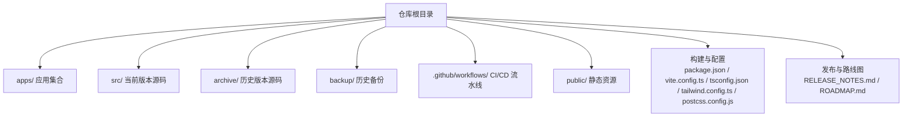
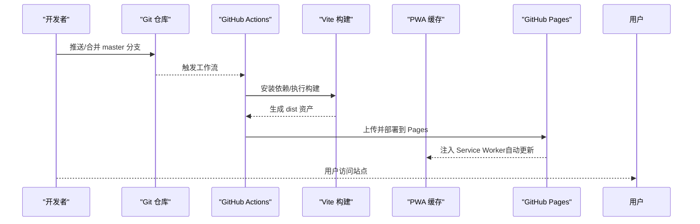
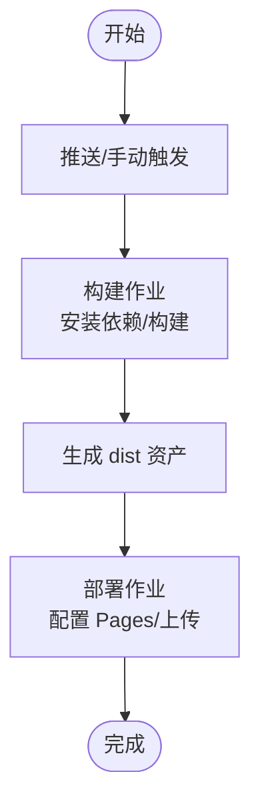
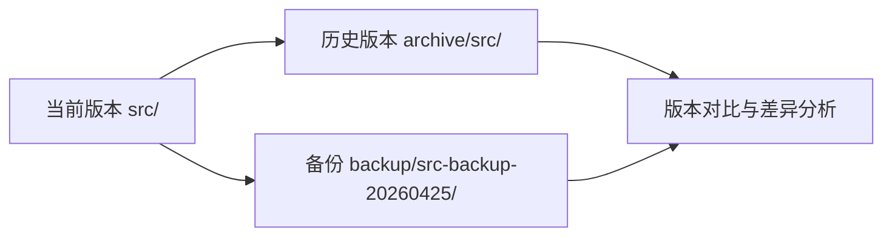
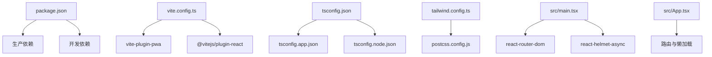

# 维护与更新

<cite>
**本文引用的文件**
- [README.md](file://README.md)
- [RELEASE_NOTES.md](file://RELEASE_NOTES.md)
- [ROADMAP.md](file://ROADMAP.md)
- [package.json](file://package.json)
- [.github/workflows/deploy.yml](file://.github/workflows/deploy.yml)
- [.github/workflows/deploy-static.yml](file://.github/workflows/deploy-static.yml)
- [vite.config.ts](file://vite.config.ts)
- [tsconfig.json](file://tsconfig.json)
- [tailwind.config.ts](file://tailwind.config.ts)
- [postcss.config.js](file://postcss.config.js)
- [src/main.tsx](file://src/main.tsx)
- [src/App.tsx](file://src/App.tsx)
- [src/pages/HomePage.tsx](file://src/pages/HomePage.tsx)
- [archive/src](file://archive/src)
- [backup/src-backup-20260425](file://backup/src-backup-20260425)
</cite>

## 目录
1. [引言](#引言)
2. [项目结构](#项目结构)
3. [核心组件](#核心组件)
4. [架构总览](#架构总览)
5. [详细组件分析](#详细组件分析)
6. [依赖分析](#依赖分析)
7. [性能考虑](#性能考虑)
8. [故障排查指南](#故障排查指南)
9. [结论](#结论)
10. [附录](#附录)

## 引言
本文件面向YuleTech社区技术平台的维护与更新工作，围绕版本管理策略、发布流程、兼容性维护、发布说明与变更日志、备份与历史版本管理、安全更新与紧急补丁、系统升级与依赖更新、维护窗口与停机管理、用户通知策略、故障恢复与灾难恢复、以及维护人员操作手册与应急响应进行系统化梳理与实操指导。文档以仓库现有配置与历史发布记录为基础，结合实际代码结构与部署流水线，给出可落地的维护实践。

## 项目结构
YuleTech社区采用多包/多页面前端架构，核心由React 19 + TypeScript + Vite 7 + Tailwind CSS 4构成，页面通过React Router 7进行路由组织；构建与部署通过GitHub Actions实现自动化发布至GitHub Pages。项目包含当前版本源码、归档版本与备份目录，便于历史版本对比与回滚。

**图表来源**
- [package.json:1-46](file://package.json#L1-L46)
- [vite.config.ts:1-32](file://vite.config.ts#L1-L32)
- [tsconfig.json:1-8](file://tsconfig.json#L1-L8)
- [tailwind.config.ts:1-79](file://tailwind.config.ts#L1-L79)
- [postcss.config.js:1-7](file://postcss.config.js#L1-L7)

**章节来源**
- [README.md:20-46](file://README.md#L20-L46)
- [package.json:1-46](file://package.json#L1-L46)

## 核心组件
- 版本标识与脚本：通过package.json中的version与scripts字段统一管理版本与构建命令。
- 构建与PWA：Vite配置启用PWA自动更新与缓存策略，Tailwind按需扫描组件以最小化CSS体积。
- 路由与页面：App.tsx集中声明路由与懒加载，main.tsx提供Provider与Router上下文。
- 发布与部署：GitHub Actions在master分支推送或手动触发时执行构建与部署。
- 发布说明与路线图：RELEASE_NOTES.md与ROADMAP.md分别记录发布内容与未来规划。

**章节来源**
- [package.json:4](file://package.json#L4)
- [vite.config.ts:10-24](file://vite.config.ts#L10-L24)
- [tailwind.config.ts:4-8](file://tailwind.config.ts#L4-L8)
- [src/App.tsx:30-115](file://src/App.tsx#L30-L115)
- [src/main.tsx:9-23](file://src/main.tsx#L9-L23)
- [.github/workflows/deploy.yml:1-54](file://.github/workflows/deploy.yml#L1-L54)
- [RELEASE_NOTES.md:1-370](file://RELEASE_NOTES.md#L1-L370)
- [ROADMAP.md:1-184](file://ROADMAP.md#L1-L184)

## 架构总览
下图展示了从代码提交到用户访问的端到端维护与发布路径，涵盖版本标记、构建、缓存与部署环节。

**图表来源**
- [.github/workflows/deploy.yml:18-54](file://.github/workflows/deploy.yml#L18-L54)
- [vite.config.ts:10-24](file://vite.config.ts#L10-L24)
- [src/main.tsx:21-23](file://src/main.tsx#L21-L23)

## 详细组件分析

### 版本管理与发布策略
- 版本号来源：package.json的version字段作为当前版本标识，配合RELEASE_NOTES.md记录每次发布的变更摘要。
- 发布节奏：以功能迭代与修复为主，遵循语义化版本管理思路，小版本用于新增功能，修订版用于修复与优化。
- 发布说明规范：RELEASE_NOTES.md采用分级标题与清单格式，包含“概述”“新增功能/修复/优化/部署”等模块，便于用户理解影响范围与升级要点。

**章节来源**
- [package.json:4](file://package.json#L4)
- [RELEASE_NOTES.md:1-370](file://RELEASE_NOTES.md#L1-L370)

### 发布流程与自动化
- 触发条件：master分支push或workflow_dispatch手动触发。
- 步骤拆分：构建阶段与部署阶段分离，确保构建产物稳定后才进行部署。
- 环境与权限：明确对contents/pages/id-token的写权限，保证Pages部署与OIDC令牌可用。
- 并行部署：concurrency组控制并发，避免冲突。

**图表来源**
- [.github/workflows/deploy.yml:3-15](file://.github/workflows/deploy.yml#L3-L15)
- [.github/workflows/deploy.yml:18-54](file://.github/workflows/deploy.yml#L18-L54)

**章节来源**
- [.github/workflows/deploy.yml:1-54](file://.github/workflows/deploy.yml#L1-L54)
- [.github/workflows/deploy-static.yml:1-43](file://.github/workflows/deploy-static.yml#L1-L43)

### 版本兼容性与升级指引
- 路由与页面：App.tsx集中管理路由与懒加载，升级时需关注路由变更与页面组件依赖。
- PWA与缓存：VitePWA启用autoUpdate与缓存策略，升级后客户端会自动更新缓存；若涉及破坏性变更，需在发布说明中明确提示。
- 主题与样式：Tailwind按组件扫描，升级UI库时需检查类名与变量是否变更。
- 依赖升级：package.json列出生产与开发依赖，升级前先锁定版本范围，执行构建与测试。

**章节来源**
- [src/App.tsx:30-115](file://src/App.tsx#L30-L115)
- [vite.config.ts:10-24](file://vite.config.ts#L10-L24)
- [tailwind.config.ts:4-8](file://tailwind.config.ts#L4-L8)
- [package.json:12-44](file://package.json#L12-L44)

### 变更日志管理与用户迁移
- 变更日志：RELEASE_NOTES.md按版本分节，清晰记录新增、修复、优化与部署信息，便于用户迁移与回溯。
- 迁移指导：对于涉及路由、组件API或PWA缓存的重大变更，应在发布说明中提供迁移步骤与回滚建议。

**章节来源**
- [RELEASE_NOTES.md:1-370](file://RELEASE_NOTES.md#L1-L370)

### 代码备份策略与历史版本管理
- 归档与备份：仓库包含archive/src与backup/src-backup-20260425两个历史版本目录，可用于版本对比与回滚。
- 对比工具：建议使用git diff或VS Code的本地比较功能，结合历史目录进行逐文件核对。
- 历史版本管理：归档目录与备份目录应标注版本号与日期，便于维护人员快速定位目标版本。

**图表来源**
- [archive/src](file://archive/src)
- [backup/src-backup-20260425](file://backup/src-backup-20260425)

**章节来源**
- [archive/src](file://archive/src)
- [backup/src-backup-20260425](file://backup/src-backup-20260425)

### 安全更新、漏洞修复与紧急补丁
- 安全基线：定期审查依赖版本，使用package.json中的依赖范围控制风险；优先采用长期支持版本。
- 紧急补丁：针对PWA缓存可能带来的“旧版本残留”，在紧急修复时可在发布说明中提示用户清除浏览器缓存或强制刷新。
- 流程建议：发现安全问题后，先在隔离分支修复并通过CI验证，再合并至master并触发部署。

**章节来源**
- [package.json:12-44](file://package.json#L12-L44)
- [vite.config.ts:10-24](file://vite.config.ts#L10-L24)

### 系统升级指导、依赖更新与兼容性测试
- 依赖更新：优先更新开发工具链与构建相关依赖，随后更新运行时依赖；更新后执行构建、预览与端到端测试。
- 兼容性测试：重点验证路由行为、主题切换、PWA缓存、GitHub API集成（如存在）与页面懒加载。
- 版本回归：在archive与backup目录中选取相近版本进行对比测试，确保升级不引入回归。

**章节来源**
- [package.json:12-44](file://package.json#L12-L44)
- [src/App.tsx:30-115](file://src/App.tsx#L30-L115)
- [src/main.tsx:9-23](file://src/main.tsx#L9-L23)

### 维护窗口、停机时间与用户通知
- 维护窗口：建议在业务低峰时段（如夜间或周末）进行发布，提前在发布说明中标注维护窗口与预期停机时间。
- 停机管理：若需短暂停机，可通过GitHub Pages的自定义404页面或临时公告页进行引导。
- 用户通知：在发布说明中明确告知升级影响、注意事项与回滚方式，必要时通过社区渠道发布通知。

**章节来源**
- [RELEASE_NOTES.md:1-370](file://RELEASE_NOTES.md#L1-L370)
- [src/App.tsx:94-104](file://src/App.tsx#L94-L104)

### 故障恢复流程、数据备份与灾难恢复
- 故障恢复：若发布后出现严重问题，优先回滚至最近一次稳定版本（参考archive与backup目录），并在发布说明中提供回滚步骤。
- 数据备份：用户侧数据主要存储于localStorage（如主页极简模式开关），可在发布说明中提示用户备份关键本地数据。
- 灾难恢复：利用GitHub Pages的静态托管能力，结合归档版本快速恢复服务；若涉及数据库或后端接口，请补充后端恢复流程。

**章节来源**
- [src/pages/HomePage.tsx:13-31](file://src/pages/HomePage.tsx#L13-L31)
- [archive/src](file://archive/src)
- [backup/src-backup-20260425](file://backup/src-backup-20260425)

### 维护人员操作手册与应急响应
- 日常维护：执行npm run build与npm run preview验证构建与预览；通过GitHub Actions监控部署状态。
- 应急响应：遇到PWA缓存导致的“旧版本残留”，在发布说明中提供强制刷新与缓存清理指引；若涉及路由或组件重大变更，提供回滚到上一稳定版本的操作步骤。

**章节来源**
- [package.json:6-10](file://package.json#L6-L10)
- [.github/workflows/deploy.yml:18-54](file://.github/workflows/deploy.yml#L18-L54)
- [vite.config.ts:10-24](file://vite.config.ts#L10-L24)

## 依赖分析
下图展示项目核心依赖与配置文件之间的关系，帮助维护人员快速定位升级范围与影响面。

**图表来源**
- [package.json:12-44](file://package.json#L12-L44)
- [vite.config.ts:1-32](file://vite.config.ts#L1-L32)
- [tsconfig.json:1-8](file://tsconfig.json#L1-L8)
- [tailwind.config.ts:1-79](file://tailwind.config.ts#L1-L79)
- [postcss.config.js:1-7](file://postcss.config.js#L1-L7)
- [src/main.tsx:3-6](file://src/main.tsx#L3-L6)
- [src/App.tsx:2-28](file://src/App.tsx#L2-L28)

**章节来源**
- [package.json:12-44](file://package.json#L12-L44)
- [vite.config.ts:1-32](file://vite.config.ts#L1-L32)
- [tsconfig.json:1-8](file://tsconfig.json#L1-L8)
- [tailwind.config.ts:1-79](file://tailwind.config.ts#L1-L79)
- [postcss.config.js:1-7](file://postcss.config.js#L1-L7)
- [src/main.tsx:3-6](file://src/main.tsx#L3-L6)
- [src/App.tsx:2-28](file://src/App.tsx#L2-L28)

## 性能考虑
- 路由懒加载：App.tsx对所有页面采用懒加载，降低首屏负载。
- PWA缓存：VitePWA配置globPatterns与缓存策略，提升离线与重复访问性能。
- 样式按需：Tailwind按组件扫描，避免未使用样式进入产物。
- 构建与预览：通过npm run build与npm run preview进行端到端验证，确保性能指标稳定。

**章节来源**
- [src/App.tsx:10-28](file://src/App.tsx#L10-L28)
- [vite.config.ts:10-24](file://vite.config.ts#L10-L24)
- [tailwind.config.ts:4-8](file://tailwind.config.ts#L4-L8)
- [package.json:7-10](file://package.json#L7-L10)

## 故障排查指南
- 构建失败：检查package.json中的脚本与依赖版本，确认Node与npm版本满足要求；查看Actions日志定位具体错误。
- 预览异常：执行npm run preview验证本地预览是否正常，排除环境差异。
- PWA缓存问题：若页面显示旧版本，参考发布说明中的缓存清理指引；必要时回滚至稳定版本。
- 路由404：确认App.tsx中的兜底路由配置与页面是否存在；检查路由参数与模块导入是否正确。

**章节来源**
- [package.json:6-10](file://package.json#L6-L10)
- [.github/workflows/deploy.yml:18-54](file://.github/workflows/deploy.yml#L18-L54)
- [src/App.tsx:94-104](file://src/App.tsx#L94-L104)

## 结论
本文件基于仓库现有配置与发布记录，建立了YuleTech社区技术平台的维护与更新体系：以语义化版本与发布说明为核心，结合GitHub Actions自动化部署、VitePWA缓存策略与Tailwind按需样式，辅以归档与备份目录实现历史版本管理与回滚保障。建议在后续实践中进一步完善后端依赖与数据库迁移流程，并将本指南固化为团队SOP，持续提升维护效率与发布质量。

## 附录
- 版本与路线图参考：ROADMAP.md提供了未来阶段规划与优先级，可作为版本规划与资源分配依据。
- 发布说明模板：可参照RELEASE_NOTES.md的结构与语言风格，确保一致性与可读性。

**章节来源**
- [ROADMAP.md:66-126](file://ROADMAP.md#L66-L126)
- [RELEASE_NOTES.md:1-370](file://RELEASE_NOTES.md#L1-L370)