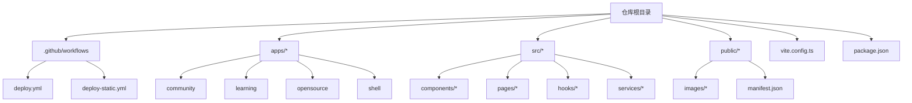
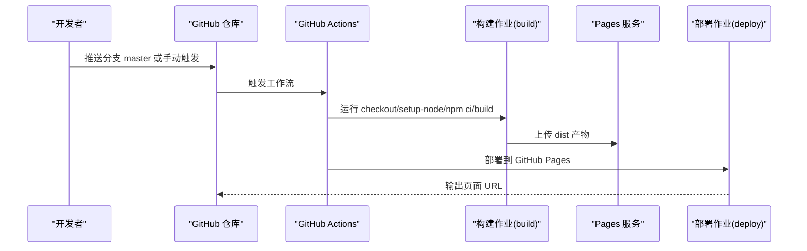
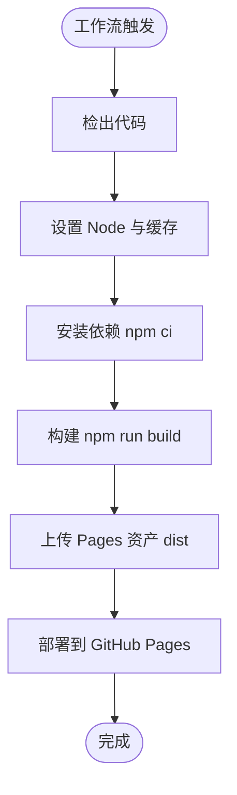
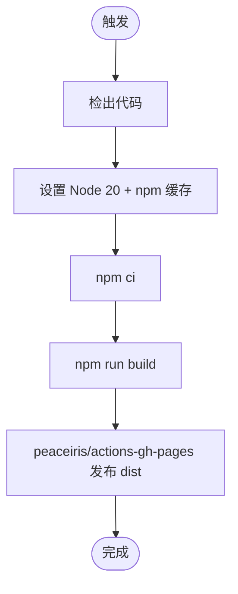
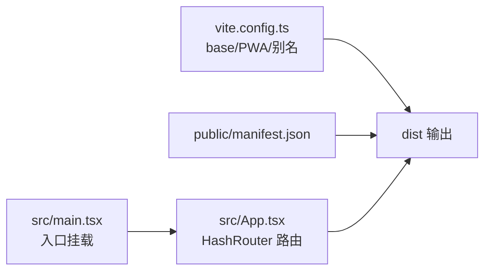
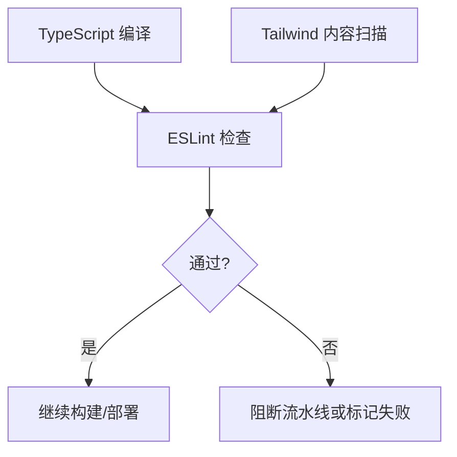
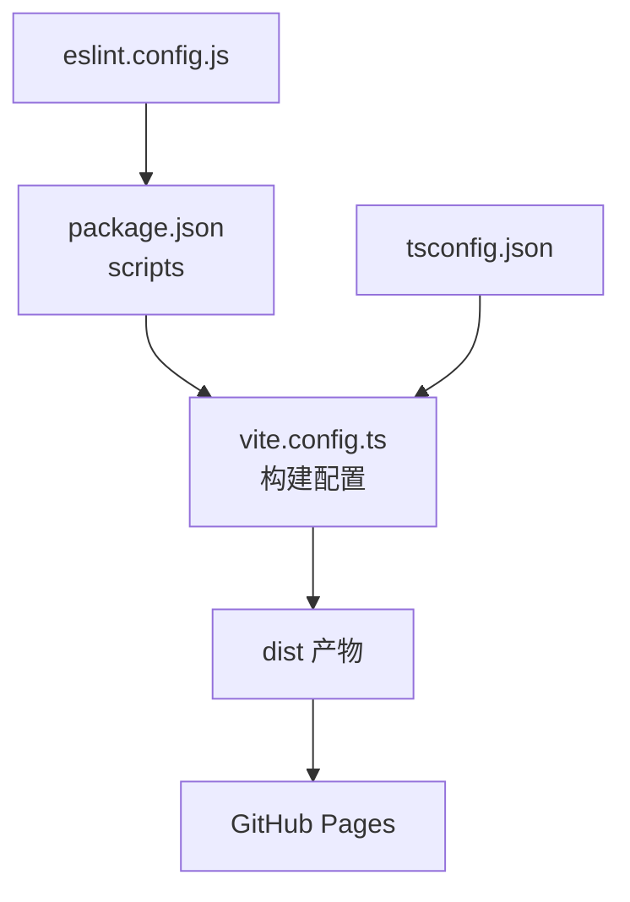

# 部署与CI/CD

<cite>
**本文引用的文件**   
- [deploy.yml](file://.github/workflows/deploy.yml)
- [deploy-static.yml](file://.github/workflows/deploy-static.yml)
- [package.json](file://package.json)
- [vite.config.ts](file://vite.config.ts)
- [README.md](file://README.md)
- [eslint.config.js](file://eslint.config.js)
- [tsconfig.json](file://tsconfig.json)
- [tailwind.config.ts](file://tailwind.config.ts)
- [src/App.tsx](file://src/App.tsx)
- [src/main.tsx](file://src/main.tsx)
- [public/manifest.json](file://public/manifest.json)
- [src/components/Features.tsx](file://src/components/Features.tsx)
- [CHANGELOG-v1.1.1.md](file://CHANGELOG-v1.1.1.md)
- [src/components/OptimizedImage.tsx](file://src/components/OptimizedImage.tsx)
- [scripts/optimize-images.cjs](file://scripts/optimize-images.cjs)
</cite>

## 更新摘要
**变更内容**   
- 添加BASE_URL环境变量配置说明章节
- 解释GitHub Pages子路径部署的图片加载问题及解决方案
- 更新多环境部署策略章节，包含环境变量管理
- 新增图片路径处理的最佳实践
- 补充部署前构建优化与性能检查章节中的图片优化内容

## 目录
1. [引言](#引言)
2. [项目结构](#项目结构)
3. [核心组件](#核心组件)
4. [架构总览](#架构总览)
5. [详细组件分析](#详细组件分析)
6. [依赖关系分析](#依赖关系分析)
7. [性能考虑](#性能考虑)
8. [故障排除指南](#故障排除指南)
9. [结论](#结论)
10. [附录](#附录)

## 引言
本文件面向运维与开发者，系统化梳理 YuleTech 社区技术平台的部署与 CI/CD 实践。内容覆盖 GitHub Actions 工作流配置、自动化构建与部署策略、持续集成流程、代码质量检查与测试集成、多环境部署与配置管理、构建优化与性能检查、部署回滚与蓝绿/金丝雀发布建议、监控告警与日志收集、安全扫描与合规检查，以及运维最佳实践与故障排除指引。

**更新** 新增BASE_URL环境变量配置说明，解释GitHub Pages子路径部署的图片加载问题及解决方案。

## 项目结构
- 采用多应用单仓结构，包含社区、学习、开源、Shell 等前端应用与共享组件库。
- 使用 Vite 作为构建工具，配合 PWA 插件与 Tailwind CSS 样式体系。
- 通过 GitHub Actions 将构建产物部署至 GitHub Pages，支持两种工作流：标准 Pages 工作流与静态部署工作流。

图表来源
- [README.md:20-46](file://README.md#L20-L46)
- [.github/workflows/deploy.yml:1-54](file://.github/workflows/deploy.yml#L1-L54)
- [.github/workflows/deploy-static.yml:1-43](file://.github/workflows/deploy-static.yml#L1-L43)

章节来源
- [README.md:20-46](file://README.md#L20-L46)
- [package.json:1-49](file://package.json#L1-L49)

## 核心组件
- GitHub Actions 工作流
  - deploy.yml：使用 Pages 构建与部署步骤，分 build 与 deploy 两阶段作业。
  - deploy-static.yml：使用 peaceiris/actions-gh-pages 直接部署 master 分支到 gh-pages。
- 构建与打包
  - Vite 配置启用 PWA、路由前缀 base、别名路径与缓存策略。
  - package.json 定义 build、dev、preview、lint 脚本。
- 质量与规范
  - ESLint 配置推荐规则集与全局忽略 dist 目录。
  - TypeScript 多项目引用配置。
  - Tailwind CSS 内容扫描路径与主题扩展。

**更新** Vite配置中的base路径设置为'/yuleCommunity/'，用于支持GitHub Pages子路径部署。

章节来源
- [.github/workflows/deploy.yml:17-53](file://.github/workflows/deploy.yml#L17-L53)
- [.github/workflows/deploy-static.yml:17-43](file://.github/workflows/deploy-static.yml#L17-L43)
- [vite.config.ts:1-51](file://vite.config.ts#L1-L51)
- [package.json:6-11](file://package.json#L6-L11)
- [eslint.config.js:1-24](file://eslint.config.js#L1-L24)
- [tsconfig.json:1-8](file://tsconfig.json#L1-L8)
- [tailwind.config.ts:1-79](file://tailwind.config.ts#L1-L79)

## 架构总览
下图展示了从代码提交到 GitHub Pages 的端到端流水线，包含权限、并发控制、构建与部署阶段。

图表来源
- [.github/workflows/deploy.yml:3-53](file://.github/workflows/deploy.yml#L3-L53)

章节来源
- [.github/workflows/deploy.yml:1-54](file://.github/workflows/deploy.yml#L1-L54)

## 详细组件分析

### GitHub Actions 工作流
- 权限与并发
  - build 与 deploy 作业分别声明读写权限；concurrency 控制组与取消策略避免并行冲突。
- 构建阶段
  - 使用 actions/checkout、actions/setup-node、npm ci、npm run build。
  - 上传 dist 为 Pages 资产。
- 部署阶段
  - 依赖 build 作业完成；environment 包含输出 URL，便于审计与回溯。

图表来源
- [.github/workflows/deploy.yml:20-42](file://.github/workflows/deploy.yml#L20-L42)

章节来源
- [.github/workflows/deploy.yml:1-54](file://.github/workflows/deploy.yml#L1-L54)

### 静态部署工作流（peaceiris）
- 适用于 master 分支直接推送至 gh-pages。
- 使用 peaceiris/actions-gh-pages，指定发布目录与 orphan 策略。

图表来源
- [.github/workflows/deploy-static.yml:21-41](file://.github/workflows/deploy-static.yml#L21-L41)

章节来源
- [.github/workflows/deploy-static.yml:1-43](file://.github/workflows/deploy-static.yml#L1-L43)

### 构建与打包配置
- Vite 基础路径与 PWA
  - base 设置为子路径，确保在 GitHub Pages 子路径下正确加载资源。
  - PWA 自动注册与缓存策略，包含字体缓存与最大文件大小限制。
- 别名与解析
  - @ 别名指向 src，提升导入可读性。
- Manifest 与路由
  - public/manifest.json 指定 start_url 与图标，适配 PWA。
  - React 应用通过 HashRouter 提供前端路由，结合 PWA 与 base 路径。

**更新** Vite配置中的base路径设置为'/yuleCommunity/'，用于支持GitHub Pages子路径部署。

图表来源
- [vite.config.ts:6-31](file://vite.config.ts#L6-L31)
- [public/manifest.json:1-22](file://public/manifest.json#L1-L22)
- [src/App.tsx:30-115](file://src/App.tsx#L30-L115)
- [src/main.tsx:1-23](file://src/main.tsx#L1-L23)

章节来源
- [vite.config.ts:1-51](file://vite.config.ts#L1-L51)
- [public/manifest.json:1-22](file://public/manifest.json#L1-L22)
- [src/App.tsx:1-118](file://src/App.tsx#L1-L118)
- [src/main.tsx:1-23](file://src/main.tsx#L1-L23)

### BASE_URL环境变量配置与图片加载问题解决

**问题背景**
在GitHub Pages子路径部署环境中，使用绝对路径`/images/xxx.png`会导致图片加载失败，因为实际部署路径为`/yuleCommunity/`。

**解决方案**
- 使用动态BASE_URL环境变量：`${import.meta.env.BASE_URL}images/feature-xxx.png`
- Vite在构建时会自动注入BASE_URL环境变量
- 支持本地开发和生产环境的不同路径处理

**实现细节**
- 在Features组件中定义`const baseUrl = import.meta.env.BASE_URL || '/'`
- 所有图片路径统一使用动态拼接：`${baseUrl}images/feature-xxx.png`
- OptimizedImage组件自动处理WebP格式转换和懒加载

**章节来源**
- [src/components/Features.tsx:25-33](file://src/components/Features.tsx#L25-L33)
- [CHANGELOG-v1.1.1.md:5-9](file://CHANGELOG-v1.1.1.md#L5-L9)
- [src/components/OptimizedImage.tsx:51-52](file://src/components/OptimizedImage.tsx#L51-L52)

### 代码质量与规范
- ESLint
  - 推荐规则集、React Hooks 与 React Refresh 集成，忽略 dist 目录。
- TypeScript
  - 多项目引用配置，分离应用与 Node 工具链配置。
- Tailwind CSS
  - content 扫描 src 与 index.html，支持暗色模式与动画插件。

图表来源
- [eslint.config.js:8-23](file://eslint.config.js#L8-L23)
- [tsconfig.json:1-8](file://tsconfig.json#L1-L8)
- [tailwind.config.ts:4-76](file://tailwind.config.ts#L4-L76)

章节来源
- [eslint.config.js:1-24](file://eslint.config.js#L1-L24)
- [tsconfig.json:1-8](file://tsconfig.json#L1-L8)
- [tailwind.config.ts:1-79](file://tailwind.config.ts#L1-L79)

### 多环境与配置差异
- 当前工作流仅针对 master 分支进行部署，未区分 staging/prod 环境变量。
- 建议在仓库 Settings -> Secrets 与 Environments 中新增密钥与环境，按需注入构建变量与 API 凭据。
- 对于不同环境的差异化配置，可在构建阶段通过环境变量注入，再由应用读取。

**更新** 建议在GitHub Pages环境中配置BASE_URL环境变量，确保子路径部署的一致性。

章节来源
- [.github/workflows/deploy.yml:3-15](file://.github/workflows/deploy.yml#L3-L15)
- [.github/workflows/deploy-static.yml:3-15](file://.github/workflows/deploy-static.yml#L3-L15)

### 部署前构建优化与性能检查

**图片优化**
- 使用WebP格式替代JPEG/PNG，减少文件大小约30-40%
- 自动转换脚本：`scripts/optimize-images.cjs`
- 支持批量处理public/images目录下的图片文件

**资源打包**
- PWA 缓存策略与最大文件大小限制，减少网络请求与缓存膨胀。
- base 路径确保子路径部署时资源加载正确。
- 代码分割策略，按需加载大型依赖库。

**性能检查**
- 建议在 CI 中增加体积报告与慢资源检测，结合浏览器性能面板与 Lighthouse。
- 对路由级懒加载组件进行拆分，降低首屏包体。

**章节来源**
- [vite.config.ts:10-24](file://vite.config.ts#L10-L24)
- [package.json:6-11](file://package.json#L6-L11)
- [scripts/optimize-images.cjs:1-56](file://scripts/optimize-images.cjs#L1-L56)
- [src/components/OptimizedImage.tsx:51-87](file://src/components/OptimizedImage.tsx#L51-L87)

### 部署回滚、蓝绿与金丝雀发布
- 回滚
  - GitHub Pages 支持保留历史版本，可通过回退到上一个成功提交或使用 Pages 资产版本。
- 蓝绿
  - 通过两个独立 Pages 站点（如 yuleCommunity-staging 与 yuleCommunity-prod）交替切换，降低风险。
- 金丝雀
  - 通过子路径分流（如 /yuleCommunity/canary）逐步放量，结合健康检查与 A/B 指标评估。

**更新** 在蓝绿部署中，确保BASE_URL环境变量在不同站点间的一致性配置。

章节来源
- [.github/workflows/deploy.yml:44-53](file://.github/workflows/deploy.yml#L44-L53)
- [.github/workflows/deploy-static.yml:36-42](file://.github/workflows/deploy-static.yml#L36-L42)

### 监控告警、日志与性能追踪
- 建议
  - 在应用内集成轻量埋点与错误上报（如前端 SDK），记录用户行为与异常。
  - 结合 GitHub Pages 访问日志与第三方分析服务，建立告警阈值。
  - 对关键页面（首页、开源架构页）设置性能基线与回归告警。

**更新** 建议监控图片加载成功率，特别是在子路径部署环境下的性能表现。

章节来源
- [src/App.tsx:1-118](file://src/App.tsx#L1-L118)

### 安全扫描、漏洞检测与合规
- 建议
  - 在 CI 中集成依赖扫描（如 npm audit 或 SCA 工具），阻断高危依赖。
  - 对前端静态资源进行 XSS 与内容安全策略（CSP）检查。
  - 合规方面，确保许可证与第三方组件合规披露。

**更新** 在安全扫描中重点关注图片资源的安全性，确保WebP转换过程的安全性。

章节来源
- [package.json:12-49](file://package.json#L12-L49)

## 依赖关系分析
- 构建链路
  - package.json 脚本驱动 Vite 构建；Vite 配置决定产物与 PWA 注册。
  - ESLint 与 TypeScript 在 CI 中作为质量门禁。
- 部署链路
  - 工作流将 dist 上传为 Pages 资产并部署；静态工作流直接发布 dist。

图表来源
- [package.json:6-11](file://package.json#L6-L11)
- [vite.config.ts:1-51](file://vite.config.ts#L1-L51)
- [eslint.config.js:1-24](file://eslint.config.js#L1-L24)
- [tsconfig.json:1-8](file://tsconfig.json#L1-L8)

章节来源
- [package.json:1-49](file://package.json#L1-L49)
- [vite.config.ts:1-51](file://vite.config.ts#L1-L51)
- [eslint.config.js:1-24](file://eslint.config.js#L1-L24)
- [tsconfig.json:1-8](file://tsconfig.json#L1-L8)

## 性能考虑
- 资源加载
  - 使用 PWA 缓存与 base 路径，减少二次加载与 404。
  - 动态BASE_URL环境变量确保在不同部署环境下的正确路径解析。
- 体积控制
  - 通过别名与按需引入减少冗余依赖；对大体积外部资源（如字体）采用缓存策略。
  - 图片WebP格式转换显著减少带宽消耗。
- 构建速度
  - 使用 npm ci 与缓存加速依赖安装；合理拆分懒加载页面。

**更新** BASE_URL环境变量的使用提升了部署灵活性，支持不同子路径的动态配置。

章节来源
- [vite.config.ts:6-31](file://vite.config.ts#L6-L31)
- [package.json:6-11](file://package.json#L6-L11)
- [src/components/Features.tsx:25-33](file://src/components/Features.tsx#L25-L33)

## 故障排除指南
- Pages 部署后资源 404
  - 检查 vite.config.ts 的 base 是否与 Pages 仓库路径一致；确认 public/manifest.json 的 start_url。
  - 验证BASE_URL环境变量在不同环境下的正确配置。
- 构建失败
  - 查看 ESLint 与 TypeScript 报错；确保依赖安装与 Node 版本匹配。
- PWA 不生效
  - 确认 PWA 插件已启用且 index.html 注入 service worker；检查缓存策略与最大文件大小。
- 图片加载问题
  - 检查Features组件中的图片路径是否使用BASE_URL动态拼接。
  - 确认public/images目录结构与引用路径一致。

**更新** 新增BASE_URL环境变量和图片加载问题的故障排除指导。

章节来源
- [vite.config.ts:6-31](file://vite.config.ts#L6-L31)
- [public/manifest.json:1-22](file://public/manifest.json#L1-L22)
- [eslint.config.js:8-23](file://eslint.config.js#L8-L23)
- [tsconfig.json:1-8](file://tsconfig.json#L1-L8)
- [src/components/Features.tsx:25-33](file://src/components/Features.tsx#L25-L33)

## 结论
当前仓库已具备完善的 GitHub Pages 自动化部署能力，结合 Vite 与 PWA 可实现快速上线与良好体验。通过BASE_URL环境变量的引入，解决了GitHub Pages子路径部署的图片加载问题，提升了部署的灵活性和可靠性。建议进一步完善多环境配置、质量门禁、安全扫描与监控告警体系，并在 CI 中加入性能基线与回滚策略，以支撑更稳健的交付与运营。

**更新** BASE_URL环境变量配置已成为部署最佳实践的重要组成部分，确保了跨环境部署的一致性和可靠性。

## 附录
- 快速操作清单
  - 在仓库 Settings -> Secrets 添加必要密钥。
  - 在 Environments 新增环境并绑定 Pages 环境变量。
  - 在 CI 中增加 ESLint、TypeScript 与依赖扫描步骤。
  - 在应用中接入轻量埋点与错误上报。
  - 配置BASE_URL环境变量以支持子路径部署。
  - 使用图片优化脚本提升加载性能。