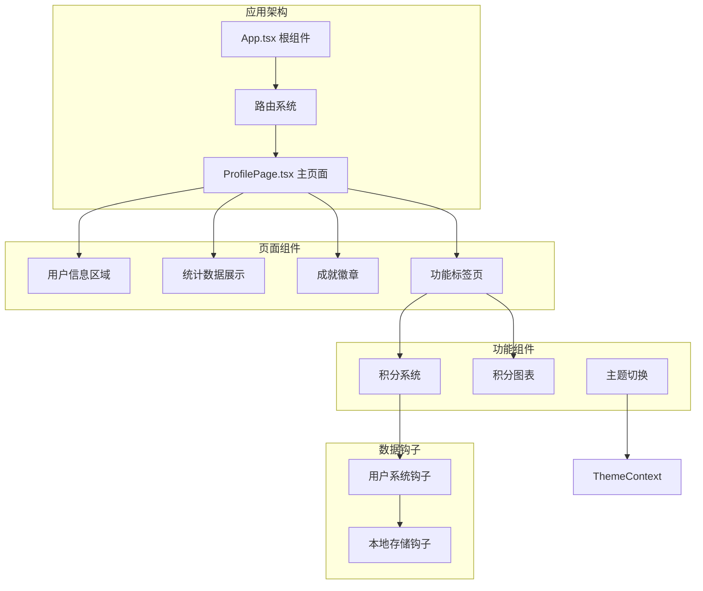
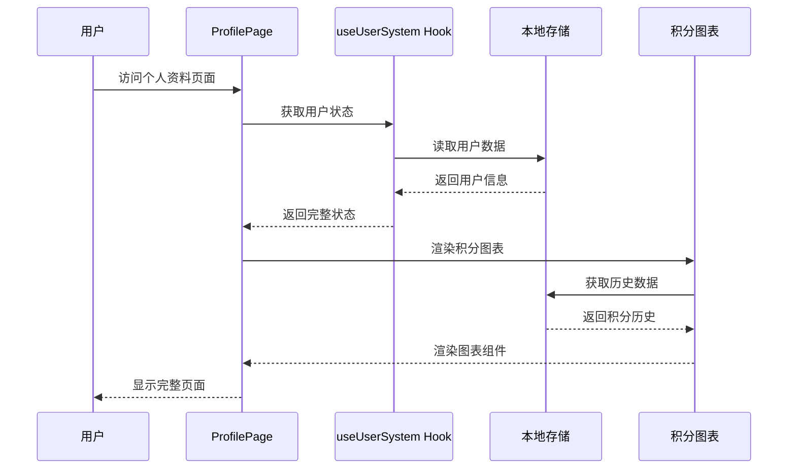
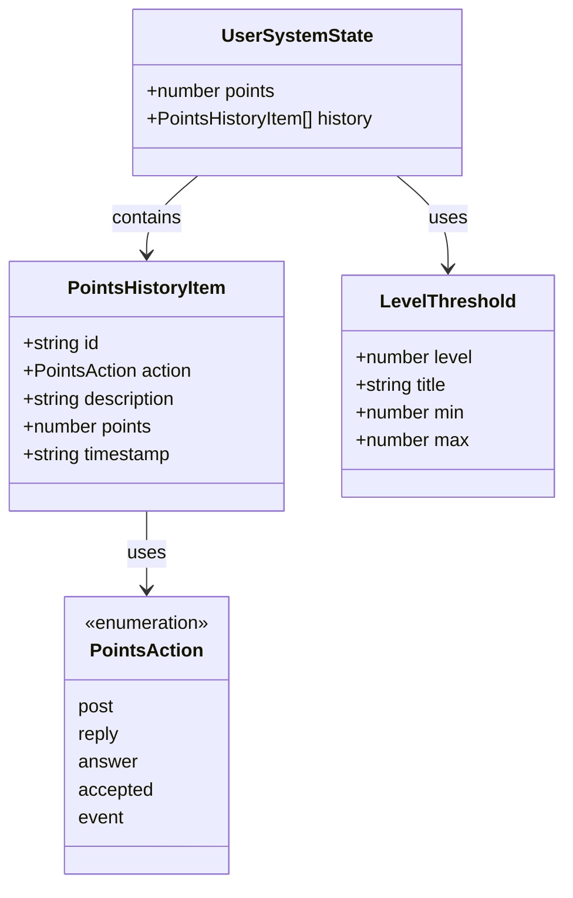
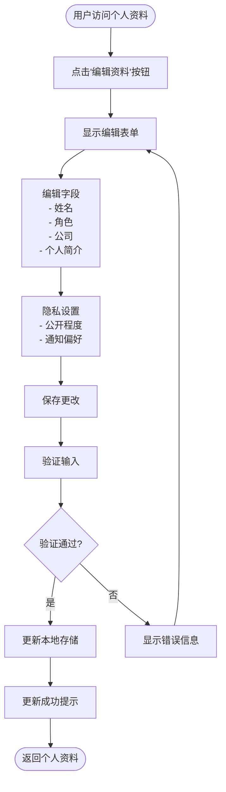
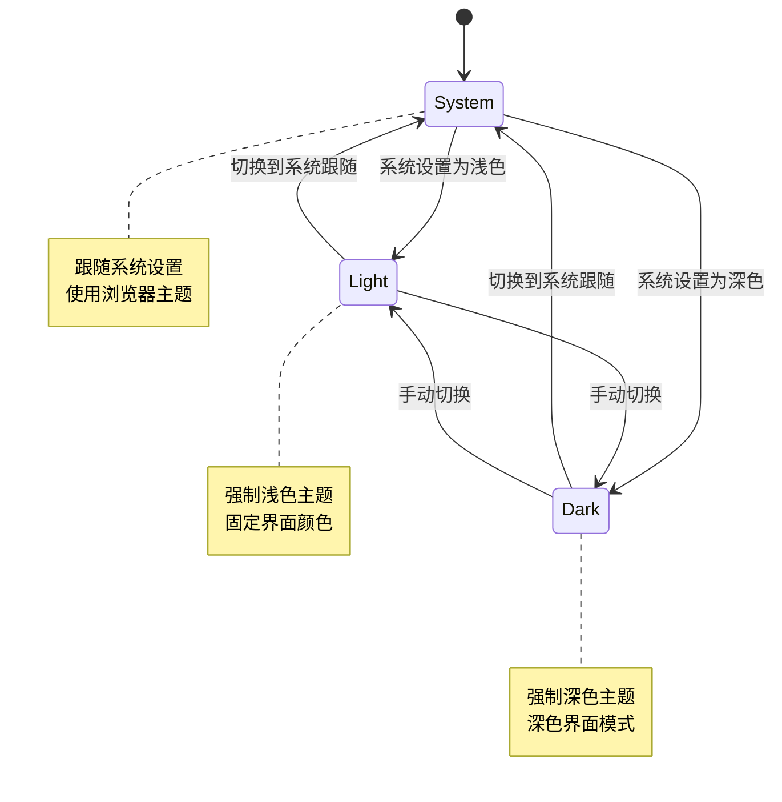
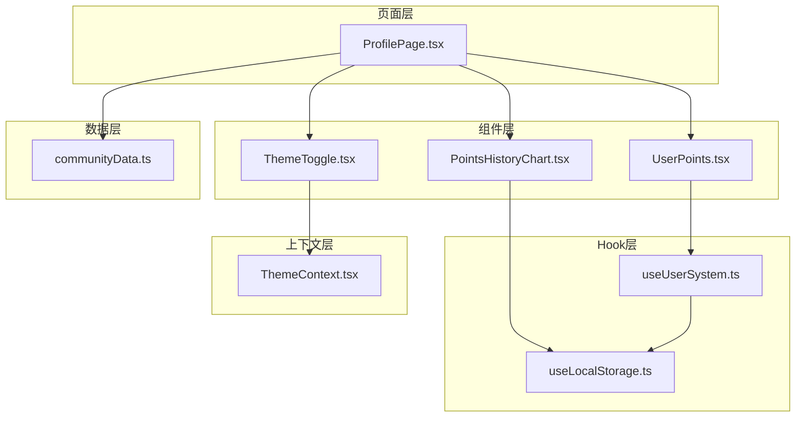

# 个人资料页面

<cite>
**本文档引用的文件**
- [ProfilePage.tsx](file://src/pages/ProfilePage.tsx)
- [UserPoints.tsx](file://src/components/UserPoints.tsx)
- [useUserSystem.ts](file://src/hooks/useUserSystem.ts)
- [useLocalStorage.ts](file://src/hooks/useLocalStorage.ts)
- [PointsHistoryChart.tsx](file://src/components/admin/PointsHistoryChart.tsx)
- [ThemeContext.tsx](file://src/contexts/ThemeContext.tsx)
- [ThemeToggle.tsx](file://src/components/ThemeToggle.tsx)
- [App.tsx](file://src/App.tsx)
- [communityData.ts](file://src/data/communityData.ts)
- [package.json](file://package.json)
- [tailwind.config.ts](file://tailwind.config.ts)
</cite>

## 目录
1. [简介](#简介)
2. [项目结构](#项目结构)
3. [核心组件](#核心组件)
4. [架构概览](#架构概览)
5. [详细组件分析](#详细组件分析)
6. [依赖关系分析](#依赖关系分析)
7. [性能考虑](#性能考虑)
8. [故障排除指南](#故障排除指南)
9. [结论](#结论)
10. [附录](#附录)

## 简介

YuleTech社区技术平台的个人资料页面是一个综合性的用户信息展示和管理系统。该页面集成了用户个人信息展示、积分系统、成就记录、学习进度跟踪、收藏内容管理和账户设置功能。

个人资料页面采用现代化的设计理念，提供了完整的用户成长轨迹追踪功能，包括积分获取、等级提升、成就解锁等激励机制。页面支持主题切换、响应式布局和丰富的交互体验。

## 项目结构

个人资料页面位于应用的前端架构中，采用模块化的组件设计：



**图表来源**
- [App.tsx:85-86](file://src/App.tsx#L85-L86)
- [ProfilePage.tsx:87-393](file://src/pages/ProfilePage.tsx#L87-L393)

**章节来源**
- [App.tsx:30-115](file://src/App.tsx#L30-L115)
- [ProfilePage.tsx:87-393](file://src/pages/ProfilePage.tsx#L87-L393)

## 核心组件

个人资料页面包含以下核心组件：

### 用户信息展示区域
- **头像显示**：圆形头像框，支持自定义头像文本
- **基本信息**：用户名、角色、公司、加入日期
- **个人简介**：用户自我介绍和专业领域
- **等级标识**：显示用户当前等级和等级标题

### 统计数据面板
- **代码贡献**：PR合并数量统计
- **技术文章**：已发布文章数量
- **学习课时**：累计学习时长统计
- **获得赞数**：社区互动获得的点赞数

### 成就系统
- **成就徽章**：可视化展示已获得和未获得的成就
- **解锁条件**：基于用户行为的成就解锁机制
- **视觉反馈**：不同成就对应不同的颜色主题

### 功能标签页
- **贡献记录**：展示用户的PR、Issue和文章贡献
- **学习进度**：跟踪课程学习完成情况
- **收藏内容**：管理用户收藏的技术资源
- **积分等级**：查看积分详情和历史记录

**章节来源**
- [ProfilePage.tsx:32-85](file://src/pages/ProfilePage.tsx#L32-L85)
- [ProfilePage.tsx:156-179](file://src/pages/ProfilePage.tsx#L156-L179)

## 架构概览

个人资料页面采用React Hooks和Context API构建，实现了数据状态管理和UI组件的分离：



**图表来源**
- [ProfilePage.tsx:87-393](file://src/pages/ProfilePage.tsx#L87-L393)
- [useUserSystem.ts:91-132](file://src/hooks/useUserSystem.ts#L91-L132)
- [PointsHistoryChart.tsx:22-68](file://src/components/admin/PointsHistoryChart.tsx#L22-L68)

## 详细组件分析

### 用户积分系统

积分系统是个人资料页面的核心功能之一，实现了完整的积分获取、管理和展示机制：



**图表来源**
- [useUserSystem.ts:15-18](file://src/hooks/useUserSystem.ts#L15-L18)
- [useUserSystem.ts:7-13](file://src/hooks/useUserSystem.ts#L7-L13)
- [useUserSystem.ts:49-54](file://src/hooks/useUserSystem.ts#L49-L54)

#### 积分计算规则
- **发帖奖励**：10积分/次
- **回帖奖励**：5积分/次  
- **回答奖励**：15积分/次
- **被采纳回答**：50积分/次
- **参与活动**：20积分/次

#### 等级系统
- **初级工程师**：0-100积分
- **中级工程师**：101-500积分
- **高级工程师**：501-2000积分
- **技术专家**：2000+积分（无上限）

**章节来源**
- [useUserSystem.ts:20-47](file://src/hooks/useUserSystem.ts#L20-L47)
- [useUserSystem.ts:56-89](file://src/hooks/useUserSystem.ts#L56-L89)

### 成就系统

成就系统通过徽章形式展示用户在社区中的各种成就：

| 成就名称 | 解锁条件 | 奖励积分 | 图标 |
|---------|----------|----------|------|
| 开源先锋 | 提交首个PR并被合并 | 100 | ⭐ |
| 技术作家 | 发布10篇技术文章 | 150 | 📝 |
| 学习达人 | 累计学习80课时 | 200 | 📚 |
| 社区之星 | 获得300+点赞 | 300 | 🏆 |
| Bug猎手 | 发现并报告5个有效Bug | 250 | ⚡ |
| 架构大师 | 达到Lv.10等级 | 500 | 🔺 |

### 个人资料编辑功能

个人资料页面提供了完整的用户信息编辑和管理功能：



**图表来源**
- [ProfilePage.tsx:127-134](file://src/pages/ProfilePage.tsx#L127-L134)

### 主题切换系统

系统支持三种主题模式，提供个性化的视觉体验：



**图表来源**
- [ThemeContext.tsx:41-115](file://src/contexts/ThemeContext.tsx#L41-L115)
- [ThemeToggle.tsx:5-9](file://src/components/ThemeToggle.tsx#L5-L9)

**章节来源**
- [ThemeContext.tsx:1-127](file://src/contexts/ThemeContext.tsx#L1-127)
- [ThemeToggle.tsx:1-120](file://src/components/ThemeToggle.tsx#L1-120)

## 依赖关系分析

个人资料页面的组件间依赖关系清晰，遵循单一职责原则：



**图表来源**
- [ProfilePage.tsx:22-23](file://src/pages/ProfilePage.tsx#L22-L23)
- [UserPoints.tsx:1-2](file://src/components/UserPoints.tsx#L1-L2)
- [PointsHistoryChart.tsx:1-12](file://src/components/admin/PointsHistoryChart.tsx#L1-L12)

**章节来源**
- [package.json:12-26](file://package.json#L12-L26)
- [tailwind.config.ts:1-79](file://tailwind.config.ts#L1-L79)

## 性能考虑

个人资料页面在设计时充分考虑了性能优化：

### 缓存策略
- **本地存储缓存**：用户积分和历史记录存储在localStorage中
- **组件状态缓存**：React状态管理减少不必要的重新渲染
- **图表数据缓存**：积分图表使用useMemo避免重复计算

### 性能优化技术
- **懒加载**：使用React.lazy按需加载页面组件
- **虚拟滚动**：长列表使用虚拟化技术提升渲染性能
- **防抖处理**：输入验证和搜索功能使用防抖优化
- **内存管理**：及时清理事件监听器和定时器

### 响应式设计
- **移动端适配**：使用Tailwind CSS实现响应式布局
- **触摸优化**：按钮和交互元素适合触摸操作
- **性能监控**：集成性能指标监控和错误报告

## 故障排除指南

### 常见问题及解决方案

**积分显示异常**
- 检查本地存储数据完整性
- 验证积分计算逻辑
- 确认等级阈值配置正确

**主题切换失效**
- 检查CSS变量是否正确设置
- 验证系统主题检测功能
- 确认主题存储机制正常

**页面加载缓慢**
- 检查网络请求和API响应时间
- 优化图片和静态资源加载
- 实施适当的缓存策略

**章节来源**
- [useLocalStorage.ts:1-60](file://src/hooks/useLocalStorage.ts#L1-L60)
- [ThemeContext.tsx:41-82](file://src/contexts/ThemeContext.tsx#L41-L82)

## 结论

YuleTech社区技术平台的个人资料页面是一个功能完整、设计精良的用户管理系统。通过积分系统、成就机制、学习跟踪等功能，有效提升了用户的参与度和粘性。

页面采用了现代化的React技术栈，实现了良好的用户体验和性能表现。主题切换、响应式设计和本地存储等特性进一步增强了系统的可用性和可扩展性。

未来可以考虑的功能增强包括：用户数据分析仪表板、社交功能集成、个性化推荐系统等，以进一步提升用户价值和平台活跃度。

## 附录

### 快速开始指南

1. **安装依赖**
   ```bash
   npm install
   ```

2. **启动开发服务器**
   ```bash
   npm run dev
   ```

3. **构建生产版本**
   ```bash
   npm run build
   ```

### 主要功能特性

- **用户信息管理**：完整的个人资料展示和编辑
- **积分激励系统**：基于行为的积分获取和等级提升
- **成就追踪**：可视化展示用户成就和里程碑
- **学习进度**：课程学习状态跟踪和管理
- **收藏功能**：技术资源的收藏和分类管理
- **主题定制**：支持多种主题模式切换
- **响应式设计**：适配各种设备和屏幕尺寸