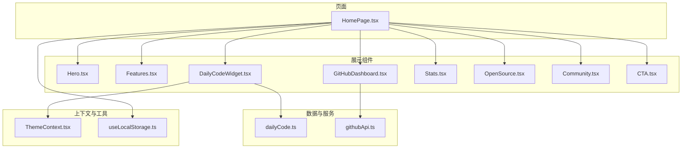
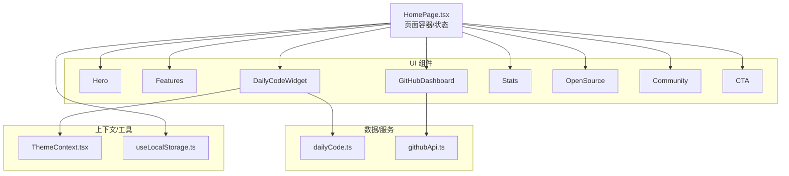
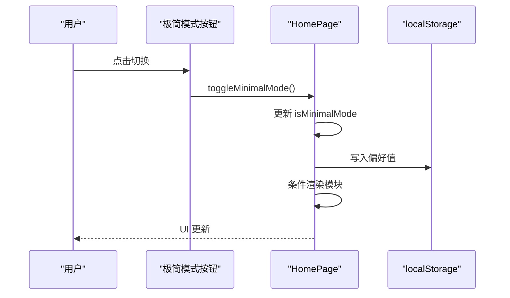
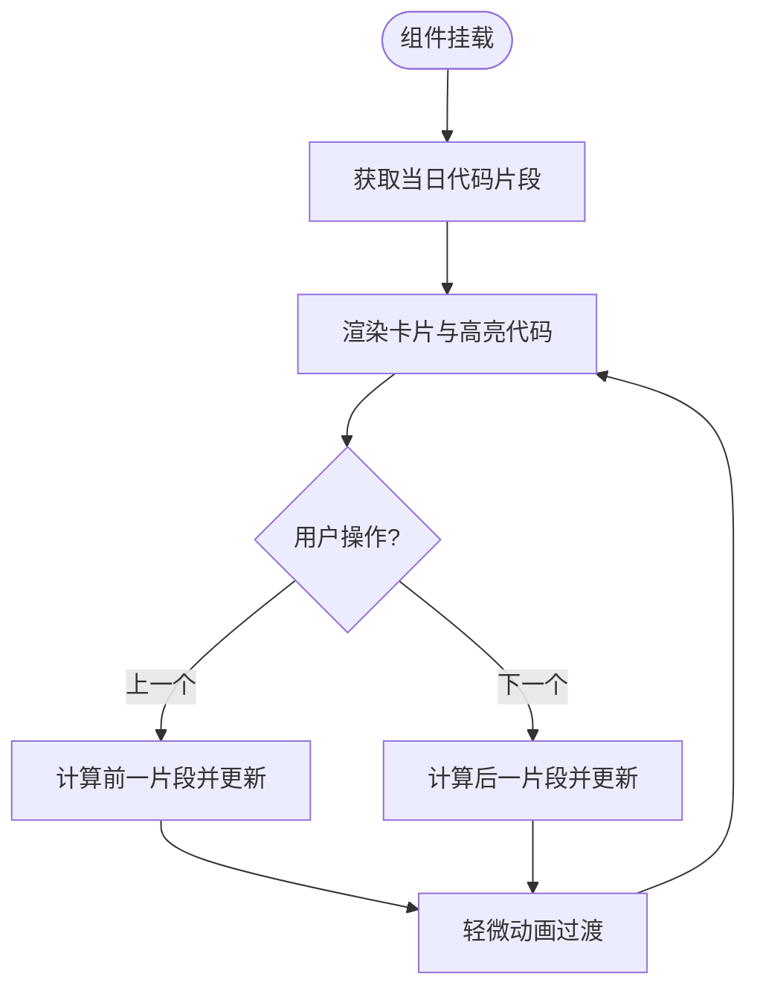
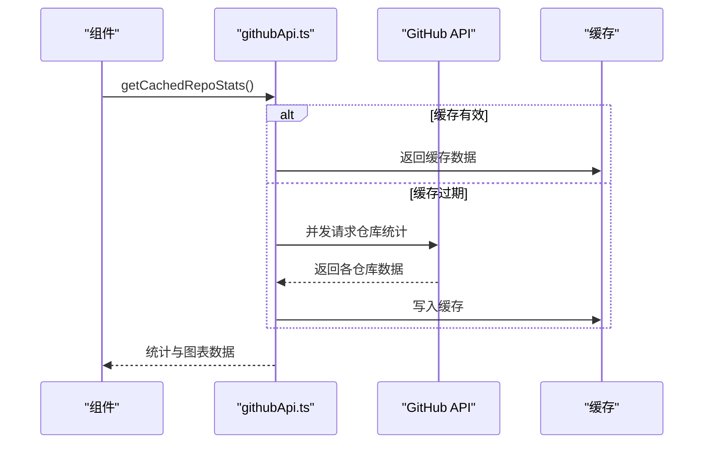
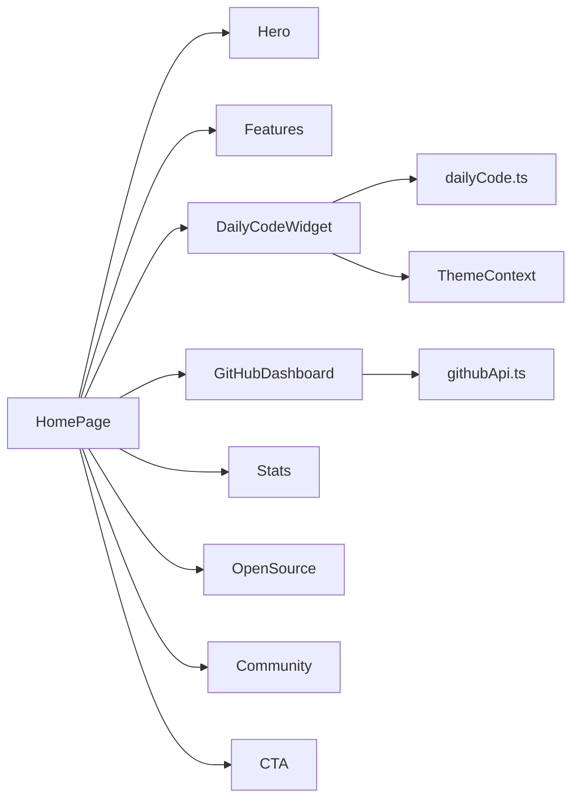

# 主页

<cite>
**本文引用的文件**
- [HomePage.tsx](file://src/pages/HomePage.tsx)
- [Hero.tsx](file://src/components/Hero.tsx)
- [Features.tsx](file://src/components/Features.tsx)
- [DailyCodeWidget.tsx](file://src/components/DailyCodeWidget.tsx)
- [GitHubDashboard.tsx](file://src/components/GitHubDashboard.tsx)
- [Stats.tsx](file://src/components/Stats.tsx)
- [OpenSource.tsx](file://src/components/OpenSource.tsx)
- [Community.tsx](file://src/components/Community.tsx)
- [CTA.tsx](file://src/components/CTA.tsx)
- [dailyCode.ts](file://src/data/dailyCode.ts)
- [githubApi.ts](file://src/services/githubApi.ts)
- [ThemeContext.tsx](file://src/contexts/ThemeContext.tsx)
- [useLocalStorage.ts](file://src/hooks/useLocalStorage.ts)
- [package.json](file://package.json)
- [tailwind.config.ts](file://tailwind.config.ts)
</cite>

## 目录
1. [简介](#简介)
2. [项目结构](#项目结构)
3. [核心组件](#核心组件)
4. [架构总览](#架构总览)
5. [组件详解](#组件详解)
6. [依赖关系分析](#依赖关系分析)
7. [性能与优化](#性能与优化)
8. [SEO 策略](#seo-策略)
9. [响应式设计](#响应式设计)
10. [定制与扩展指南](#定制与扩展指南)
11. [故障排查](#故障排查)
12. [结论](#结论)

## 简介
本文件面向 YuleTech 社区技术平台的主页，系统化梳理其核心功能、用户体验设计与技术实现，覆盖以下主题：
- 极简模式切换机制与用户偏好持久化
- Hero 区域展示与视觉引导
- 特色功能模块介绍与交互
- 每日代码组件（每日 AutoSAR 代码片段）
- GitHub 仓库统计与图表展示
- 社区动态与口碑展示
- CTA 引导转化
- 数据获取流程、组件组合方式与状态管理
- SEO 优化策略、性能优化与响应式设计
- 主页定制与扩展方法
- 不同用户角色在主页上的差异化体验

## 项目结构
主页位于应用壳层的页面目录中，采用“页面 + 组件”的分层组织方式。页面负责布局与状态，组件负责具体业务展示与交互。

图示来源
- [HomePage.tsx:1-88](file://src/pages/HomePage.tsx#L1-L88)
- [Hero.tsx:1-82](file://src/components/Hero.tsx#L1-L82)
- [Features.tsx:1-163](file://src/components/Features.tsx#L1-L163)
- [DailyCodeWidget.tsx:1-174](file://src/components/DailyCodeWidget.tsx#L1-L174)
- [GitHubDashboard.tsx:1-281](file://src/components/GitHubDashboard.tsx#L1-L281)
- [Stats.tsx:1-81](file://src/components/Stats.tsx#L1-L81)
- [OpenSource.tsx:1-124](file://src/components/OpenSource.tsx#L1-L124)
- [Community.tsx:1-114](file://src/components/Community.tsx#L1-L114)
- [CTA.tsx:1-43](file://src/components/CTA.tsx#L1-L43)
- [dailyCode.ts:1-239](file://src/data/dailyCode.ts#L1-L239)
- [githubApi.ts:1-150](file://src/services/githubApi.ts#L1-L150)
- [ThemeContext.tsx:1-127](file://src/contexts/ThemeContext.tsx#L1-L127)
- [useLocalStorage.ts:1-60](file://src/hooks/useLocalStorage.ts#L1-L60)

章节来源
- [HomePage.tsx:1-88](file://src/pages/HomePage.tsx#L1-L88)

## 核心组件
- 页面容器与状态管理：HomePage 负责极简模式状态、页面加载状态与模块渲染控制。
- 内容模块：Hero、Features、GitHubDashboard、DailyCodeWidget、Stats、OpenSource、Community、CTA。
- 数据与服务：dailyCode.ts 提供每日代码片段；githubApi.ts 提供仓库统计与图表数据。
- 主题与本地存储：ThemeContext 提供主题解析与切换；useLocalStorage 提供通用本地存储 Hook。

章节来源
- [HomePage.tsx:13-31](file://src/pages/HomePage.tsx#L13-L31)
- [Hero.tsx:1-82](file://src/components/Hero.tsx#L1-L82)
- [Features.tsx:1-163](file://src/components/Features.tsx#L1-L163)
- [GitHubDashboard.tsx:32-58](file://src/components/GitHubDashboard.tsx#L32-L58)
- [DailyCodeWidget.tsx:8-15](file://src/components/DailyCodeWidget.tsx#L8-L15)
- [Stats.tsx:60-80](file://src/components/Stats.tsx#L60-L80)
- [OpenSource.tsx:47-123](file://src/components/OpenSource.tsx#L47-L123)
- [Community.tsx:55-113](file://src/components/Community.tsx#L55-L113)
- [CTA.tsx:3-42](file://src/components/CTA.tsx#L3-L42)
- [dailyCode.ts:213-239](file://src/data/dailyCode.ts#L213-L239)
- [githubApi.ts:65-149](file://src/services/githubApi.ts#L65-L149)
- [ThemeContext.tsx:41-116](file://src/contexts/ThemeContext.tsx#L41-L116)
- [useLocalStorage.ts:3-59](file://src/hooks/useLocalStorage.ts#L3-L59)

## 架构总览
主页采用“页面 + 组件 + 数据/服务 + 上下文/Hook”的分层架构。页面负责顶层布局与偏好状态，组件专注各自领域的展示与交互，数据/服务封装外部调用与缓存，上下文/工具提供主题与本地存储能力。

图示来源
- [HomePage.tsx:15-86](file://src/pages/HomePage.tsx#L15-L86)
- [DailyCodeWidget.tsx:5-6](file://src/components/DailyCodeWidget.tsx#L5-L6)
- [GitHubDashboard.tsx:25-30](file://src/components/GitHubDashboard.tsx#L25-L30)
- [ThemeContext.tsx:1-1](file://src/contexts/ThemeContext.tsx#L1-L1)
- [useLocalStorage.ts:1-1](file://src/hooks/useLocalStorage.ts#L1-L1)

## 组件详解

### 极简模式切换机制与用户偏好存储
- 状态来源：页面初始化从本地存储读取偏好，设置初始状态；切换时更新状态并写回本地存储。
- 交互元素：固定悬浮按钮，根据当前模式显示“极简模式/完整模式”，点击切换。
- 渲染控制：极简模式下隐藏部分模块（GitHubDashboard、DailyCodeWidget、Stats、OpenSource、Community、CTA）。

图示来源
- [HomePage.tsx:19-31](file://src/pages/HomePage.tsx#L19-L31)
- [HomePage.tsx:75-84](file://src/pages/HomePage.tsx#L75-L84)

章节来源
- [HomePage.tsx:13-31](file://src/pages/HomePage.tsx#L13-L31)
- [HomePage.tsx:75-84](file://src/pages/HomePage.tsx#L75-L84)

### Hero 区域展示
- 视觉设计：背景图 + 渐变蒙层，强调品牌信息与核心价值。
- 信息层次：品牌标语、简述、行动按钮、统计数据。
- 交互：提供“开始探索”“代码仓库”等入口，引导用户进一步浏览。

章节来源
- [Hero.tsx:3-81](file://src/components/Hero.tsx#L3-L81)

### 特色功能介绍（Features）
- 结构：网格布局四个功能卡片，每个卡片包含图标、标题、描述、统计标签、滚动预览与跳转链接。
- 动效：悬停阴影、图片缩放、渐变覆盖、滚动预览增强体验。
- 导航：卡片底部链接指向对应页面锚点或路由。

章节来源
- [Features.tsx:24-89](file://src/components/Features.tsx#L24-L89)
- [Features.tsx:91-162](file://src/components/Features.tsx#L91-L162)

### 每日代码组件（DailyCodeWidget）
- 数据来源：基于日期计算当天片段，支持上一个/下一个切换。
- 视觉：语法高亮（深浅主题适配）、难度标签、模块标识、解释说明。
- 交互：左右切换按钮，动画过渡避免频繁刷新造成抖动。

图示来源
- [DailyCodeWidget.tsx:13-33](file://src/components/DailyCodeWidget.tsx#L13-L33)
- [dailyCode.ts:213-239](file://src/data/dailyCode.ts#L213-L239)

章节来源
- [DailyCodeWidget.tsx:8-173](file://src/components/DailyCodeWidget.tsx#L8-L173)
- [dailyCode.ts:11-239](file://src/data/dailyCode.ts#L11-L239)

### GitHub 仓库统计与图表
- 数据获取：并发请求多个仓库统计，失败时记录告警；结果进行缓存（默认 5 分钟）。
- 总计统计：聚合 Stars/Forks/Watchers/Open Issues。
- 图表展示：模块完成度柱状图、近期贡献折线图；仓库列表卡片展示语言与星级。
- 外链：跳转至 GitHub 仓库与组织主页。

图示来源
- [GitHubDashboard.tsx:44-58](file://src/components/GitHubDashboard.tsx#L44-L58)
- [githubApi.ts:65-149](file://src/services/githubApi.ts#L65-L149)

章节来源
- [GitHubDashboard.tsx:32-280](file://src/components/GitHubDashboard.tsx#L32-L280)
- [githubApi.ts:6-150](file://src/services/githubApi.ts#L6-L150)

### 社区动态与口碑展示（Community）
- 活动卡片：技术问答、活动、圈子、众包开发四大板块，展示数量与引导。
- 口碑展示：三段用户评价卡片，体现社区价值与影响力。

章节来源
- [Community.tsx:3-113](file://src/components/Community.tsx#L3-L113)

### 统计卡片（Stats）
- 数字动画：IntersectionObserver 触发后，使用定时器从 0 动画到目标值，提升视觉体验。
- 数据项：代码提交、注册工程师、开源模块、贡献者。

章节来源
- [Stats.tsx:11-58](file://src/components/Stats.tsx#L11-L58)
- [Stats.tsx:60-80](file://src/components/Stats.tsx#L60-L80)

### 开源模块概览（OpenSource）
- 分类展示：MCAL、ECUAL、Service、RTE+ASW 四大类，每类包含若干模块名称与描述。
- 行为：模块项可点击，底部提供“浏览全部源码”入口。

章节来源
- [OpenSource.tsx:3-123](file://src/components/OpenSource.tsx#L3-L123)

### CTA 引导（CTA）
- 设计：渐变背景 + 蒙版纹理，突出“成为首批贡献者”的号召。
- 行动：两个主按钮分别引导注册与了解权益，附带人数提示。

章节来源
- [CTA.tsx:3-42](file://src/components/CTA.tsx#L3-L42)

## 依赖关系分析
- 组件依赖
  - HomePage 依赖所有展示组件，控制渲染分支。
  - DailyCodeWidget 依赖 dailyCode.ts 与 ThemeContext。
  - GitHubDashboard 依赖 githubApi.ts。
  - Stats 依赖 IntersectionObserver 与浏览器计数格式化。
- 外部依赖
  - 图表：recharts
  - 语法高亮：react-syntax-highlighter
  - SEO：react-helmet-async
  - 图标：lucide-react
  - 主题：Tailwind CSS 自定义变量与暗色类名

图示来源
- [HomePage.tsx:4-11](file://src/pages/HomePage.tsx#L4-L11)
- [DailyCodeWidget.tsx:5-6](file://src/components/DailyCodeWidget.tsx#L5-L6)
- [GitHubDashboard.tsx:25-30](file://src/components/GitHubDashboard.tsx#L25-L30)

章节来源
- [package.json:12-26](file://package.json#L12-L26)
- [tailwind.config.ts:1-79](file://tailwind.config.ts#L1-L79)

## 性能与优化
- 数据缓存
  - GitHub 统计采用 5 分钟缓存，减少重复请求与第三方限流风险。
- 组件懒加载与条件渲染
  - 极简模式下延迟加载非关键模块，缩短首屏渲染路径。
- 动画与交互
  - DailyCodeWidget 使用轻微动画过渡，避免频繁重排。
  - Stats 使用 IntersectionObserver 触发动画，降低不必要的计算。
- 主题与样式
  - Tailwind 自定义变量与暗色类名，减少重复样式与切换闪烁。
- 本地存储
  - useLocalStorage 提供跨标签页同步事件，保证偏好一致性。

章节来源
- [githubApi.ts:139-149](file://src/services/githubApi.ts#L139-L149)
- [HomePage.tsx:75-84](file://src/pages/HomePage.tsx#L75-L84)
- [Stats.tsx:16-31](file://src/components/Stats.tsx#L16-L31)
- [ThemeContext.tsx:41-116](file://src/contexts/ThemeContext.tsx#L41-L116)
- [useLocalStorage.ts:3-59](file://src/hooks/useLocalStorage.ts#L3-L59)

## SEO 策略
- 页面标题与描述：通过 react-helmet-async 注入，包含品牌与定位关键词。
- 结构化语义：语义化标题层级与段落，利于搜索引擎理解内容结构。
- 内容密度：Hero 与 Features 提供高价值文案，Community 与 CTA 提升转化意图表达。
- 外链与社交：GitHub 外链与社区活动展示增强权威性与信任度。

章节来源
- [HomePage.tsx:39-42](file://src/pages/HomePage.tsx#L39-L42)

## 响应式设计
- 容器与断点：Tailwind 容器居中与 2xl 屏幕断点，确保内容在大屏与小屏均舒适阅读。
- 网格布局：Features、Stats、OpenSource、Community 采用响应式网格，随屏幕宽度自适应列数。
- 视觉比例：Hero 使用视口高度与弹性字体，保持品牌信息在不同设备的一致呈现。

章节来源
- [tailwind.config.ts:10-76](file://tailwind.config.ts#L10-L76)
- [Hero.tsx:5-81](file://src/components/Hero.tsx#L5-L81)
- [Features.tsx:110-158](file://src/components/Features.tsx#L110-L158)
- [Stats.tsx:64-78](file://src/components/Stats.tsx#L64-L78)
- [OpenSource.tsx:66-111](file://src/components/OpenSource.tsx#L66-L111)
- [Community.tsx:74-109](file://src/components/Community.tsx#L74-L109)

## 定制与扩展指南
- 添加新模块
  - 在 HomePage 中新增模块导入与渲染分支（极简模式下可选择性隐藏）。
  - 新建组件文件并在 Features 或独立区块中展示，遵循现有样式与交互规范。
- 修改现有组件
  - 保持与 ThemeContext 的集成以适配深浅主题。
  - 若涉及数据，优先复用 githubApi 或 dailyCode 的数据模型与缓存策略。
- 用户偏好与主题
  - 如需新增偏好键，建议沿用 useLocalStorage Hook 的模式，统一事件派发与跨标签页同步。
  - 主题切换逻辑可参考 ThemeContext 的实现，确保系统主题监听与类名更新一致。

章节来源
- [HomePage.tsx:72-84](file://src/pages/HomePage.tsx#L72-L84)
- [useLocalStorage.ts:3-59](file://src/hooks/useLocalStorage.ts#L3-L59)
- [ThemeContext.tsx:41-116](file://src/contexts/ThemeContext.tsx#L41-L116)

## 故障排查
- GitHub 数据加载失败
  - 现象：统计卡片显示加载中或空白。
  - 排查：检查网络请求与第三方 API 可达性；确认缓存是否过期。
  - 参考：组件错误处理与缓存逻辑。
- 极简模式偏好未生效
  - 现象：刷新后偏好丢失或不一致。
  - 排查：确认 localStorage 写入与读取流程；检查跨标签页事件监听。
  - 参考：HomePage 与 useLocalStorage 的实现。
- 代码高亮主题异常
  - 现象：深色/浅色主题下代码配色不正确。
  - 排查：确认 ThemeContext 的 resolvedTheme 与组件样式选择逻辑。
  - 参考：DailyCodeWidget 与 ThemeContext。

章节来源
- [GitHubDashboard.tsx:44-58](file://src/components/GitHubDashboard.tsx#L44-L58)
- [HomePage.tsx:19-31](file://src/pages/HomePage.tsx#L19-L31)
- [useLocalStorage.ts:27-56](file://src/hooks/useLocalStorage.ts#L27-L56)
- [DailyCodeWidget.tsx:9-51](file://src/components/DailyCodeWidget.tsx#L9-L51)
- [ThemeContext.tsx:56-82](file://src/contexts/ThemeContext.tsx#L56-L82)

## 结论
YuleTech 主页通过清晰的页面-组件分层、完善的主题与偏好系统、稳健的数据缓存与图表展示，以及良好的 SEO 与响应式设计，构建了面向汽车软件工程师的高质量首页体验。极简模式为不同用户需求提供了灵活的视图控制；每日代码与社区动态强化了平台的知识传播与社交价值；CTA 明确引导转化。未来可在模块化扩展、A/B 测试与更细粒度的性能监控方面持续优化。