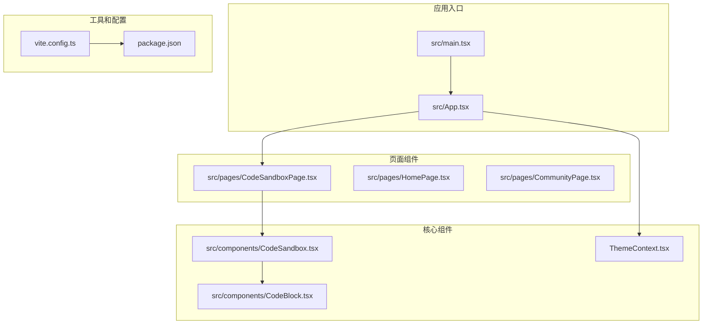
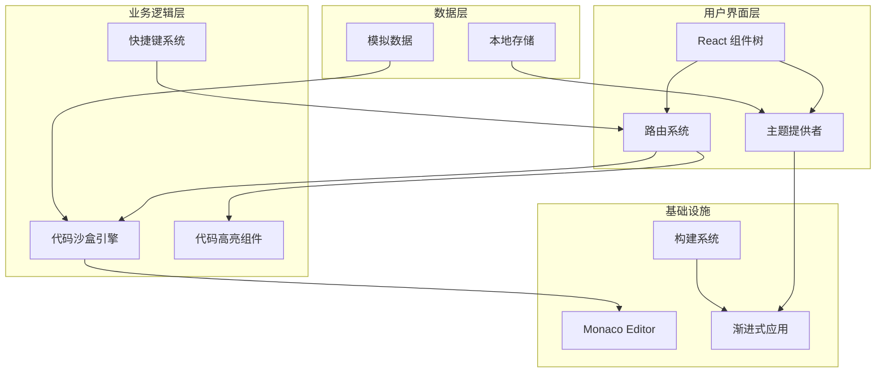
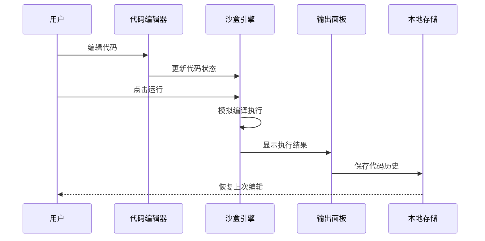
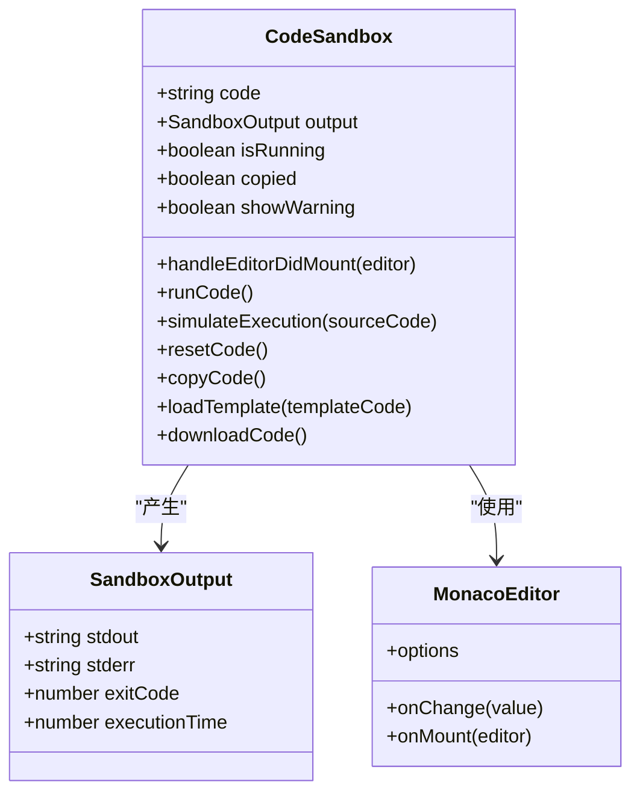
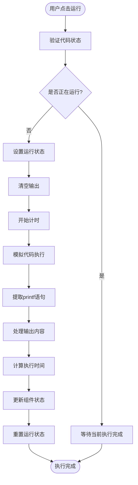
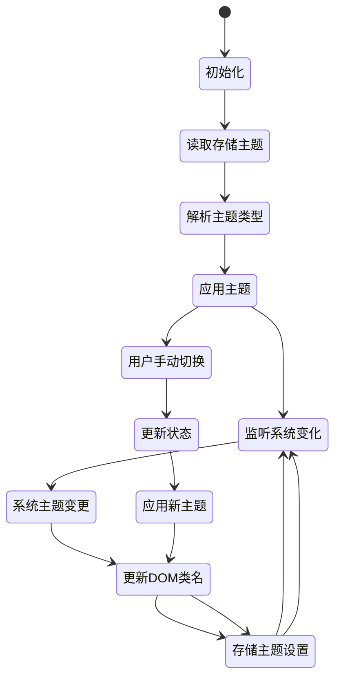

# 代码沙盒环境

<cite>
**本文档引用的文件**
- [README.md](file://README.md)
- [package.json](file://package.json)
- [src/components/CodeSandbox.tsx](file://src/components/CodeSandbox.tsx)
- [src/pages/CodeSandboxPage.tsx](file://src/pages/CodeSandboxPage.tsx)
- [src/components/CodeBlock.tsx](file://src/components/CodeBlock.tsx)
- [src/App.tsx](file://src/App.tsx)
- [src/main.tsx](file://src/main.tsx)
- [vite.config.ts](file://vite.config.ts)
- [src/contexts/ThemeContext.tsx](file://src/contexts/ThemeContext.tsx)
- [src/hooks/useHotkeys.ts](file://src/hooks/useHotkeys.ts)
- [src/data/communityData.ts](file://src/data/communityData.ts)
</cite>

## 目录
1. [项目简介](#项目简介)
2. [项目结构](#项目结构)
3. [核心组件](#核心组件)
4. [架构概览](#架构概览)
5. [详细组件分析](#详细组件分析)
6. [依赖关系分析](#依赖关系分析)
7. [性能考虑](#性能考虑)
8. [故障排除指南](#故障排除指南)
9. [结论](#结论)

## 项目简介

YuleTech 开源技术社区是一个基于 React 19 + TypeScript 的现代化前端应用，专注于 AutoSAR BSW 开发者的在线编程学习平台。该项目提供了完整的代码沙盒环境，支持 C 语言在线编程、实时编译和代码执行。

### 主要特性
- **在线代码沙盒**: 基于 Monaco Editor 的 C 语言编程环境
- **实时编译执行**: 支持代码语法高亮和模拟执行
- **示例模板**: 内置 Hello World、数组、指针、结构体等经典示例
- **响应式设计**: 支持暗黑模式和主题切换
- **PWA 支持**: 渐进式 Web 应用，支持离线访问

**章节来源**
- [README.md:1-95](file://README.md#L1-L95)
- [package.json:1-49](file://package.json#L1-L49)

## 项目结构

项目采用模块化的组织方式，主要分为以下几个核心部分：



**图表来源**
- [src/main.tsx:1-23](file://src/main.tsx#L1-L23)
- [src/App.tsx:1-139](file://src/App.tsx#L1-L139)
- [vite.config.ts:1-51](file://vite.config.ts#L1-L51)

**章节来源**
- [src/main.tsx:1-23](file://src/main.tsx#L1-L23)
- [src/App.tsx:1-139](file://src/App.tsx#L1-L139)
- [vite.config.ts:1-51](file://vite.config.ts#L1-L51)

## 核心组件

### 代码沙盒组件 (CodeSandbox)

代码沙盒是整个应用的核心组件，提供了完整的 C 语言编程环境。它集成了 Monaco Editor 作为代码编辑器，并实现了模拟的代码执行功能。

#### 主要功能特性
- **代码编辑**: 基于 Monaco Editor 的专业级代码编辑体验
- **语法高亮**: 支持 C 语言语法高亮和智能提示
- **示例模板**: 内置多个经典 C 语言示例
- **实时运行**: 模拟代码编译和执行过程
- **输出显示**: 清晰的控制台输出界面
- **工具集成**: 支持复制、下载、重置等实用功能

#### 技术架构
组件采用 React Hooks 模式，使用状态管理来处理代码内容、执行输出和用户交互。通过 Monaco Editor 提供专业的代码编辑体验，同时保持组件的轻量化和高性能。

**章节来源**
- [src/components/CodeSandbox.tsx:1-396](file://src/components/CodeSandbox.tsx#L1-L396)

### 代码块组件 (CodeBlock)

代码块组件用于在文档和页面中展示静态的代码片段，支持语法高亮和主题适配。

#### 核心特性
- **语法高亮**: 基于 react-syntax-highlighter 的代码高亮
- **主题适配**: 自动适配暗黑/明亮主题
- **响应式设计**: 支持不同屏幕尺寸的显示
- **简洁布局**: 专注的代码展示界面

**章节来源**
- [src/components/CodeBlock.tsx:1-49](file://src/components/CodeBlock.tsx#L1-L49)

### 主题管理系统

项目实现了完整的主题管理系统，支持用户自定义主题和系统主题跟随。

#### 功能特点
- **多主题支持**: light、dark、system 三种主题模式
- **持久化存储**: 使用 localStorage 保存用户偏好
- **系统跟随**: 自动跟随操作系统主题设置
- **无闪烁加载**: 防止主题切换时的视觉闪烁

**章节来源**
- [src/contexts/ThemeContext.tsx:1-127](file://src/contexts/ThemeContext.tsx#L1-L127)

## 架构概览

### 整体架构设计



**图表来源**
- [src/App.tsx:1-139](file://src/App.tsx#L1-L139)
- [src/main.tsx:1-23](file://src/main.tsx#L1-L23)
- [vite.config.ts:1-51](file://vite.config.ts#L1-L51)

### 数据流架构



**图表来源**
- [src/components/CodeSandbox.tsx:120-163](file://src/components/CodeSandbox.tsx#L120-L163)
- [src/components/CodeSandbox.tsx:165-187](file://src/components/CodeSandbox.tsx#L165-L187)

**章节来源**
- [src/App.tsx:1-139](file://src/App.tsx#L1-L139)
- [src/main.tsx:1-23](file://src/main.tsx#L1-L23)

## 详细组件分析

### 代码沙盒组件深度解析

#### 组件结构设计



**图表来源**
- [src/components/CodeSandbox.tsx:16-21](file://src/components/CodeSandbox.tsx#L16-L21)
- [src/components/CodeSandbox.tsx:119-125](file://src/components/CodeSandbox.tsx#L119-L125)

#### 代码执行流程



**图表来源**
- [src/components/CodeSandbox.tsx:132-163](file://src/components/CodeSandbox.tsx#L132-L163)
- [src/components/CodeSandbox.tsx:165-187](file://src/components/CodeSandbox.tsx#L165-L187)

#### 示例模板系统

组件内置了四个经典的 C 语言示例模板：

1. **Hello World**: 基础的 C 语言程序示例
2. **数组操作**: 展示数组定义、初始化和遍历
3. **指针示例**: 演示指针的基本概念和使用方法
4. **结构体示例**: 展示结构体的定义和成员访问

每个模板都针对特定的 C 语言概念，帮助用户快速理解和学习。

**章节来源**
- [src/components/CodeSandbox.tsx:43-117](file://src/components/CodeSandbox.tsx#L43-L117)
- [src/components/CodeSandbox.tsx:132-187](file://src/components/CodeSandbox.tsx#L132-L187)

### 页面路由系统

#### 路由配置分析

```mermaid
graph LR
subgraph "公共路由"
Home[/ -> HomePage]
OpenSource[/opensource -> OpenSourcePage]
Toolchain[/toolchain -> ToolchainPage]
Learning[/learning -> LearningPage]
Community[/community -> CommunityPage]
Sandbox[/sandbox -> CodeSandboxPage]
Docs[/docs -> DocsPage]
Forum[/forum -> ForumPage]
QA[/qa -> QAPage]
Events[/events -> EventsPage]
Hardware[/hardware -> HardwarePage]
end
subgraph "管理员路由"
AdminLogin[/admin/login -> AdminLoginPage]
AdminDashboard[/admin -> AdminDashboard]
AdminUsers[/admin/users -> AdminUsers]
AdminContent[/admin/content -> AdminContent]
AdminSettings[/admin/settings -> AdminSettings]
end
```

**图表来源**
- [src/App.tsx:85-132](file://src/App.tsx#L85-L132)

#### 路由懒加载实现

项目采用了 React.lazy 和 Suspense 实现路由级别的代码分割，提高了应用的初始加载性能。每个页面组件都通过动态导入的方式按需加载，减少了首屏包体积。

**章节来源**
- [src/App.tsx:12-38](file://src/App.tsx#L12-L38)

### 主题系统实现

#### 主题切换机制



**图表来源**
- [src/contexts/ThemeContext.tsx:41-82](file://src/contexts/ThemeContext.tsx#L41-L82)

#### 主题持久化策略

主题系统使用 localStorage 来持久化用户的主题偏好，确保用户在重新访问时能够保持相同的主题设置。同时支持系统主题跟随功能，当用户更改操作系统主题时，应用会自动同步变化。

**章节来源**
- [src/contexts/ThemeContext.tsx:14-34](file://src/contexts/ThemeContext.tsx#L14-L34)
- [src/contexts/ThemeContext.tsx:84-93](file://src/contexts/ThemeContext.tsx#L84-L93)

## 依赖关系分析

### 核心依赖关系

```mermaid
graph TB
subgraph "运行时依赖"
React[react@19.2.5]
ReactDOM[react-dom@19.2.5]
Router[react-router-dom@7.14.2]
Monaco[@monaco-editor/react@4.7.0]
Framer[framer-motion@12.38.0]
Lucide[lucide-react@1.8.0]
end
subgraph "开发依赖"
Vite[vite@7.3.2]
TS[typescript@6.0.2]
Tailwind[tailwindcss@3.4.17]
ESLint[eslint@9.39.4]
end
subgraph "构建工具"
PWA[vite-plugin-pwa@1.2.0]
PostCSS[autoprefixer@10.5.0]
Sharp[sharp@0.34.5]
end
React --> ReactDOM
React --> Router
Monaco --> React
Framer --> React
Lucide --> React
Vite --> PWA
Tailwind --> PostCSS
```

**图表来源**
- [package.json:12-27](file://package.json#L12-L27)
- [package.json:29-46](file://package.json#L29-L46)

### 代码分割策略

项目使用 Vite 的代码分割功能，将大型依赖库拆分为独立的代码块：

- **React 核心库**: react、react-dom、react-router-dom
- **图表库**: recharts
- **动画库**: framer-motion
- **代码高亮**: react-syntax-highlighter
- **UI 工具**: lucide-react、clsx、class-variance-authority

这种策略确保了应用的按需加载，提高了首屏性能。

**章节来源**
- [vite.config.ts:26-44](file://vite.config.ts#L26-L44)
- [package.json:12-47](file://package.json#L12-L47)

## 性能考虑

### 代码执行性能

由于当前版本的代码沙盒使用模拟执行而非真实的编译器，因此具有以下性能特征：

- **执行时间**: 模拟执行延迟约 800ms，用于提供真实的编译体验
- **内存使用**: 限制在 128MB 以内，防止内存泄漏
- **CPU 时间**: 限制在 5 秒以内，避免长时间占用
- **I/O 限制**: 不支持文件系统操作，仅支持标准输出

### 前端性能优化

项目采用了多项前端性能优化策略：

1. **路由懒加载**: 使用 React.lazy 实现按需加载
2. **代码分割**: 将大型依赖库拆分为独立代码块
3. **PWA 缓存**: 利用 Service Worker 缓存静态资源
4. **主题预渲染**: 防止主题切换时的视觉闪烁

**章节来源**
- [src/components/CodeSandbox.tsx:136-140](file://src/components/CodeSandbox.tsx#L136-L140)
- [vite.config.ts:10-24](file://vite.config.ts#L10-L24)

## 故障排除指南

### 常见问题及解决方案

#### 代码沙盒无法运行

**问题症状**: 点击运行按钮无响应或出现错误

**可能原因**:
1. 浏览器兼容性问题
2. 网络连接异常
3. 浏览器扩展干扰

**解决步骤**:
1. 检查浏览器控制台是否有错误信息
2. 尝试禁用可能干扰的浏览器扩展
3. 刷新页面并重试
4. 检查网络连接稳定性

#### 主题切换失效

**问题症状**: 主题切换后界面没有变化

**解决步骤**:
1. 检查 localStorage 是否可用
2. 刷新页面重新加载主题
3. 清除浏览器缓存后重试
4. 检查 CSS 类名是否正确应用

#### 代码高亮显示异常

**问题症状**: 代码显示缺少语法高亮

**解决步骤**:
1. 确认 react-syntax-highlighter 依赖已正确安装
2. 检查主题样式是否正确加载
3. 验证代码语言设置是否正确
4. 刷新页面重新渲染

**章节来源**
- [src/components/CodeSandbox.tsx:132-163](file://src/components/CodeSandbox.tsx#L132-L163)
- [src/contexts/ThemeContext.tsx:20-34](file://src/contexts/ThemeContext.tsx#L20-L34)

## 结论

代码沙盒环境是一个功能完整、设计精良的在线编程学习平台。它成功地结合了现代前端技术栈和教育应用场景，为 AutoSAR BSW 开发者提供了优质的在线编程体验。

### 主要优势

1. **技术先进**: 采用 React 19、TypeScript、Vite 等前沿技术
2. **用户体验**: 提供流畅的代码编辑和执行体验
3. **教育导向**: 内置丰富的示例模板和学习资源
4. **性能优化**: 实现了良好的代码分割和懒加载策略
5. **可扩展性**: 模块化设计便于功能扩展和维护

### 发展建议

1. **真实编译执行**: 集成 WebAssembly 或后端服务实现真正的代码编译
2. **协作功能**: 添加多人协作和代码分享功能
3. **学习路径**: 构建完整的 C 语言和 AutoSAR 学习路径
4. **性能监控**: 添加执行性能监控和优化建议
5. **移动端适配**: 改进移动端的代码编辑体验

这个项目为开源社区建设和技术教育提供了优秀的示范，展现了现代前端技术在专业教育领域的应用潜力。