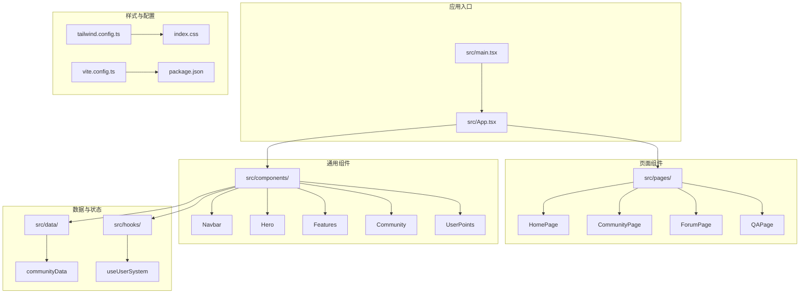
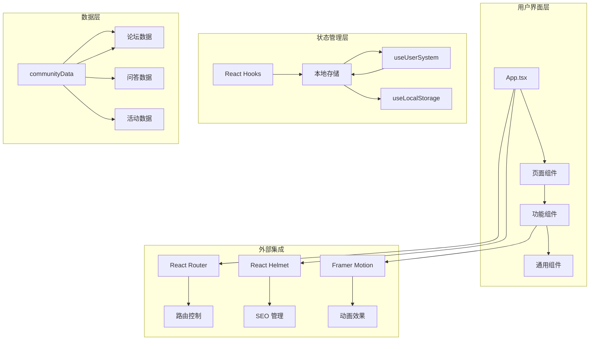
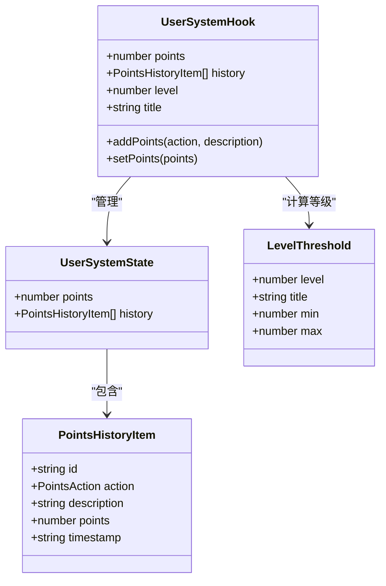
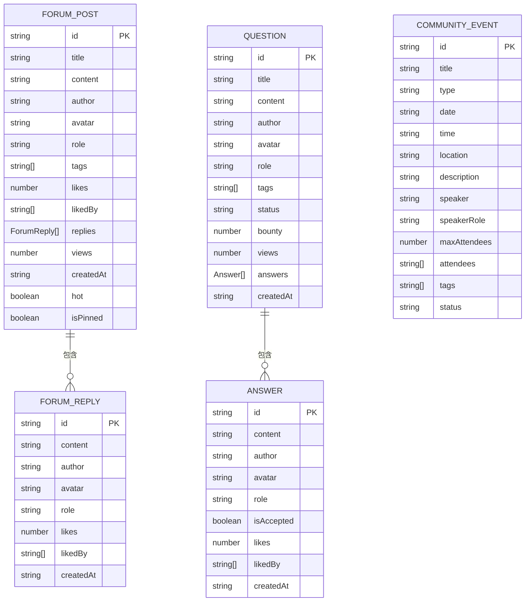
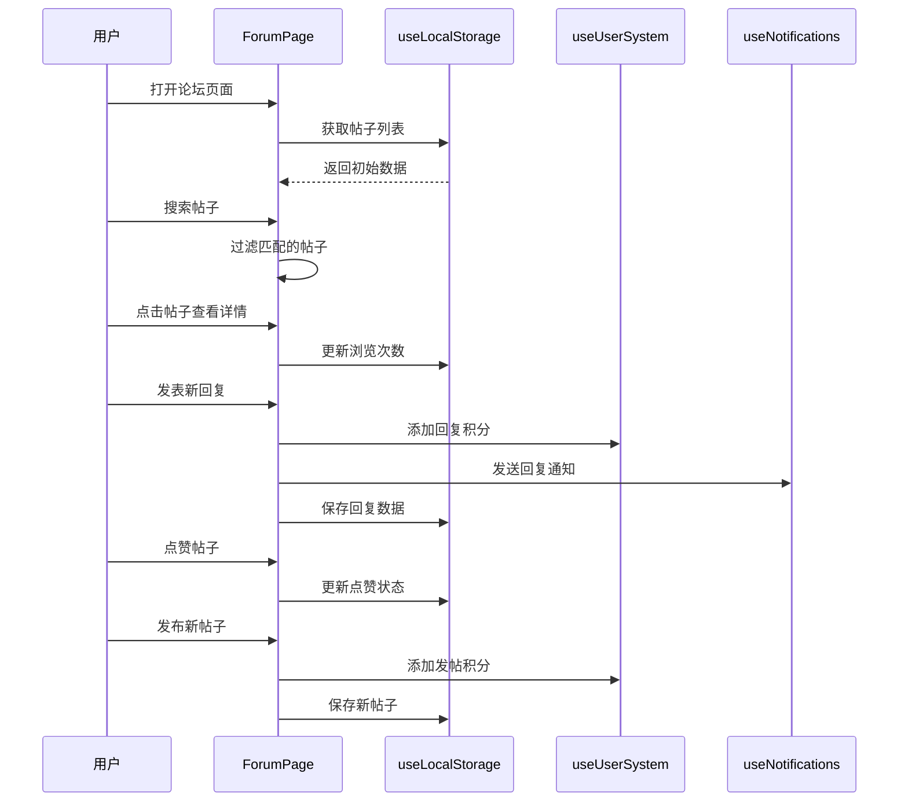
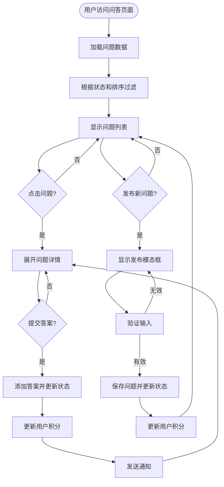

# 企业功能套件

<cite>
**本文档引用的文件**
- [README.md](file://README.md)
- [package.json](file://package.json)
- [src/App.tsx](file://src/App.tsx)
- [src/pages/HomePage.tsx](file://src/pages/HomePage.tsx)
- [src/components/Navbar.tsx](file://src/components/Navbar.tsx)
- [src/components/Hero.tsx](file://src/components/Hero.tsx)
- [src/components/Features.tsx](file://src/components/Features.tsx)
- [src/components/OpenSource.tsx](file://src/components/OpenSource.tsx)
- [src/components/Community.tsx](file://src/components/Community.tsx)
- [src/components/UserPoints.tsx](file://src/components/UserPoints.tsx)
- [src/hooks/useUserSystem.ts](file://src/hooks/useUserSystem.ts)
- [src/data/communityData.ts](file://src/data/communityData.ts)
- [src/pages/CommunityPage.tsx](file://src/pages/CommunityPage.tsx)
- [src/pages/ForumPage.tsx](file://src/pages/ForumPage.tsx)
- [src/pages/QAPage.tsx](file://src/pages/QAPage.tsx)
</cite>

## 目录
1. [项目简介](#项目简介)
2. [项目结构](#项目结构)
3. [核心组件](#核心组件)
4. [架构总览](#架构总览)
5. [详细组件分析](#详细组件分析)
6. [依赖关系分析](#依赖关系分析)
7. [性能考虑](#性能考虑)
8. [故障排除指南](#故障排除指南)
9. [结论](#结论)

## 项目简介
本项目是基于 React 19 + TypeScript 的企业功能套件，服务于 AutoSAR BSW 开发者、汽车电子工程师、芯片厂商和高校研究人员。项目采用 Vite 6 构建，Tailwind CSS 4 样式，shadcn/ui 组件库，Lucide React 图标，Geist 字体，旨在打造一站式汽车基础软件开发生态平台。

项目提供四大核心能力：开源代码平台、开发工具链、学习成长平台和硬件开发板，通过社区互动、技术问答、活动日历等功能促进工程师协作与成长。

**章节来源**
- [README.md:1-95](file://README.md#L1-L95)

## 项目结构
项目采用模块化组织方式，主要目录结构如下：



**图表来源**
- [src/App.tsx:1-139](file://src/App.tsx#L1-L139)
- [src/pages/HomePage.tsx:1-101](file://src/pages/HomePage.tsx#L1-L101)
- [src/components/Navbar.tsx:1-211](file://src/components/Navbar.tsx#L1-L211)

**章节来源**
- [README.md:20-46](file://README.md#L20-L46)
- [package.json:1-49](file://package.json#L1-L49)

## 核心组件
项目的核心组件包括导航栏、英雄区域、功能展示、开源架构展示、社区互动和用户积分系统等。

### 导航系统
导航组件提供响应式设计，支持桌面端和移动端两种布局，包含全局搜索、通知中心、主题切换等功能。

### 内容展示
- **Hero 区域**：全屏首屏展示，包含品牌标语和行动号召按钮
- **Features 功能**：四大核心能力的可视化展示，每个功能配有动态预览
- **OpenSource 开源**：AutoSAR BSW 四层架构的开源模块展示

### 社区功能
- **Community 社区**：展示社区生态和用户评价
- **Forum 论坛**：技术讨论和经验分享
- **QA 问答**：悬赏问答和技术咨询
- **UserPoints 用户积分**：基于行为的积分奖励系统

**章节来源**
- [src/components/Navbar.tsx:37-48](file://src/components/Navbar.tsx#L37-L48)
- [src/components/Hero.tsx:1-82](file://src/components/Hero.tsx#L1-L82)
- [src/components/Features.tsx:26-91](file://src/components/Features.tsx#L26-L91)
- [src/components/OpenSource.tsx:3-32](file://src/components/OpenSource.tsx#L3-L32)
- [src/components/Community.tsx:3-32](file://src/components/Community.tsx#L3-L32)

## 架构总览
项目采用前端单页应用架构，结合 React Router 实现客户端路由，使用 React Hooks 管理状态，通过本地存储实现数据持久化。



**图表来源**
- [src/App.tsx:40-139](file://src/App.tsx#L40-L139)
- [src/hooks/useUserSystem.ts:91-135](file://src/hooks/useUserSystem.ts#L91-L135)
- [src/data/communityData.ts:1-371](file://src/data/communityData.ts#L1-L371)

## 详细组件分析

### 用户积分系统
用户积分系统是社区激励机制的核心，通过行为追踪和等级制度促进用户参与。



**图表来源**
- [src/hooks/useUserSystem.ts:15-135](file://src/hooks/useUserSystem.ts#L15-L135)

#### 积分规则配置
系统支持动态配置积分规则和等级阈值，通过本地存储实现个性化设置。

**章节来源**
- [src/hooks/useUserSystem.ts:20-89](file://src/hooks/useUserSystem.ts#L20-L89)
- [src/components/UserPoints.tsx:8-81](file://src/components/UserPoints.tsx#L8-L81)

### 社区数据模型
社区数据采用 TypeScript 接口定义，确保类型安全和开发体验。



**图表来源**
- [src/data/communityData.ts:1-54](file://src/data/communityData.ts#L1-L54)

**章节来源**
- [src/data/communityData.ts:72-216](file://src/data/communityData.ts#L72-L216)
- [src/data/communityData.ts:218-296](file://src/data/communityData.ts#L218-L296)
- [src/data/communityData.ts:298-371](file://src/data/communityData.ts#L298-L371)

### 论坛页面交互流程
论坛页面实现了完整的讨论区功能，包括帖子浏览、回复、点赞等交互。



**图表来源**
- [src/pages/ForumPage.tsx:63-544](file://src/pages/ForumPage.tsx#L63-L544)
- [src/hooks/useUserSystem.ts:91-135](file://src/hooks/useUserSystem.ts#L91-L135)

**章节来源**
- [src/pages/ForumPage.tsx:86-103](file://src/pages/ForumPage.tsx#L86-L103)
- [src/pages/ForumPage.tsx:105-165](file://src/pages/ForumPage.tsx#L105-L165)

### 问答页面功能流程
问答页面提供悬赏问答功能，支持问题发布、答案提交和采纳机制。



**图表来源**
- [src/pages/QAPage.tsx:37-504](file://src/pages/QAPage.tsx#L37-L504)

**章节来源**
- [src/pages/QAPage.tsx:53-66](file://src/pages/QAPage.tsx#L53-L66)
- [src/pages/QAPage.tsx:88-113](file://src/pages/QAPage.tsx#L88-L113)

## 依赖关系分析

```mermaid
graph TB
subgraph "核心依赖"
A[react@^19.2.5] --> B[react-dom@^19.2.5]
C[react-router-dom@^7.14.2] --> D[路由管理]
E[framer-motion@^12.38.0] --> F[动画效果]
end
subgraph "UI 组件"
G[lucide-react@^1.8.0] --> H[图标库]
I[shadcn/ui] --> J[基础组件]
K[tailwindcss@^3.4.17] --> L[样式系统]
end
subgraph "开发工具"
M[@vitejs/plugin-react@^5.1.4] --> N[Vite 构建]
O[typescript@~6.0.2] --> P[类型检查]
Q[eslint@^9.39.4] --> R[代码规范]
end
subgraph "第三方库"
S[react-helmet-async] --> T[SEO 管理]
U[react-syntax-highlighter] --> V[代码高亮]
W[recharts] --> X[数据可视化]
Y[class-variance-authority] --> Z[样式变体]
end
```

**图表来源**
- [package.json:12-27](file://package.json#L12-L27)
- [package.json:29-46](file://package.json#L29-L46)

**章节来源**
- [package.json:1-49](file://package.json#L1-L49)

## 性能考虑
项目在性能优化方面采用了多项策略：

### 代码分割与懒加载
- 使用 React.lazy 和 Suspense 实现页面级别的代码分割
- 按需加载大型组件和第三方库
- 减少首屏加载时间和内存占用

### 状态管理优化
- 本地存储缓存减少重复请求
- 合理的数据结构设计避免深层嵌套
- 防抖和节流处理高频操作

### 渲染性能
- Framer Motion 提供硬件加速的动画
- Tailwind CSS 生成最小化样式
- React.memo 优化组件重渲染

## 故障排除指南

### 常见问题诊断
1. **页面空白问题**
   - 检查网络连接和资源加载
   - 查看浏览器控制台错误信息
   - 验证路由配置正确性

2. **积分系统异常**
   - 检查本地存储权限
   - 验证积分规则配置
   - 确认用户身份状态

3. **数据同步问题**
   - 检查数据迁移逻辑
   - 验证数据格式兼容性
   - 确认异步操作完成状态

**章节来源**
- [src/hooks/useUserSystem.ts:36-47](file://src/hooks/useUserSystem.ts#L36-L47)
- [src/data/communityData.ts:365-371](file://src/data/communityData.ts#L365-L371)

## 结论
本企业功能套件项目展现了现代前端开发的最佳实践，通过模块化架构、类型安全设计和用户体验优化，成功构建了一个功能完善的汽车基础软件社区平台。项目不仅具备良好的扩展性，还通过积分系统和社区功能促进了用户参与和知识共享。

未来可以考虑的功能增强包括：
- 更完善的企业级权限管理
- 实时通信功能集成
- 更丰富的数据分析和可视化
- 多语言国际化支持
- 离线缓存和 PWA 支持