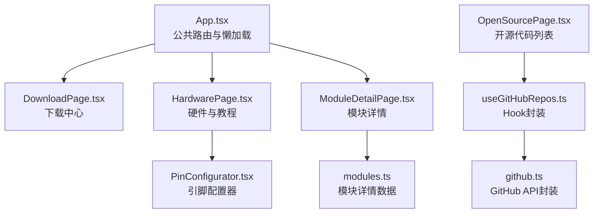
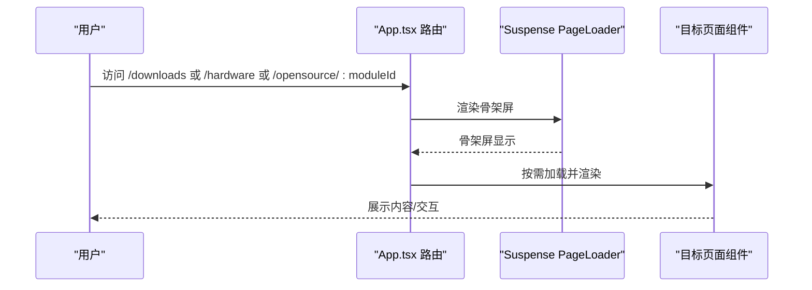
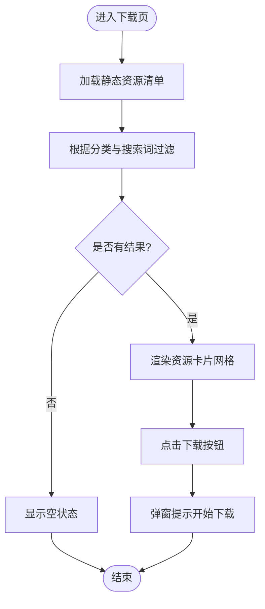
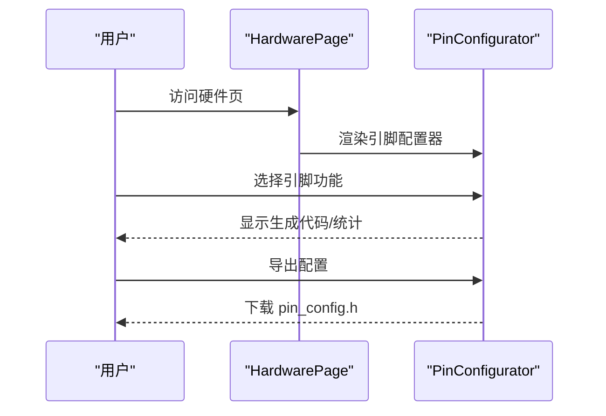
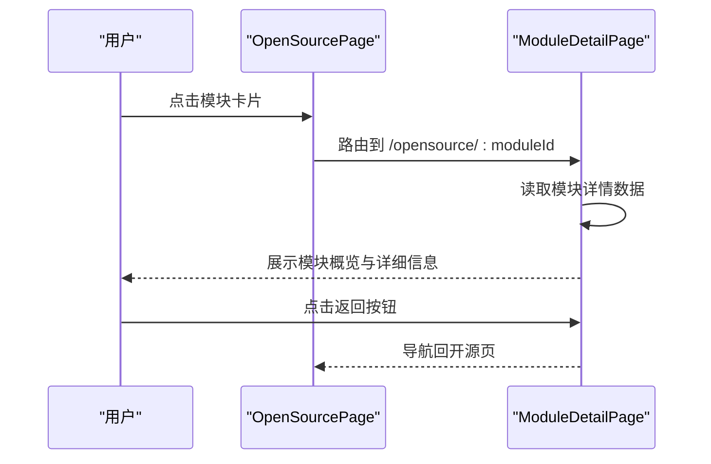
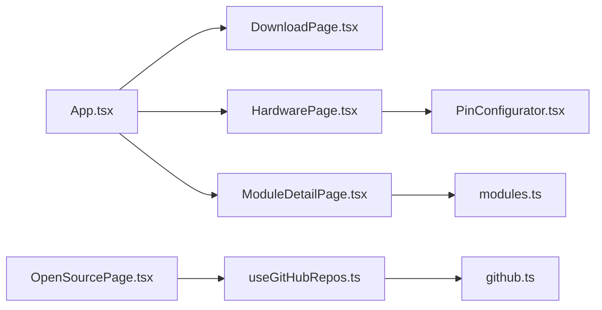

# 其他页面

<cite>
**本文引用的文件**
- [App.tsx](file://src/App.tsx)
- [DownloadPage.tsx](file://src/pages/DownloadPage.tsx)
- [HardwarePage.tsx](file://src/pages/HardwarePage.tsx)
- [ModuleDetailPage.tsx](file://src/pages/ModuleDetailPage.tsx)
- [OpenSourcePage.tsx](file://src/pages/OpenSourcePage.tsx)
- [PageLoader.tsx](file://src/components/PageLoader.tsx)
- [PinConfigurator.tsx](file://src/components/PinConfigurator.tsx)
- [modules.ts](file://src/data/modules.ts)
- [useGitHubRepos.ts](file://src/hooks/useGitHubRepos.ts)
- [github.ts](file://src/services/github.ts)
</cite>

## 目录
1. [简介](#简介)
2. [项目结构](#项目结构)
3. [核心组件](#核心组件)
4. [架构总览](#架构总览)
5. [详细组件分析](#详细组件分析)
6. [依赖分析](#依赖分析)
7. [性能考量](#性能考量)
8. [故障排查指南](#故障排查指南)
9. [结论](#结论)
10. [附录](#附录)

## 简介
本章节面向YuleTech社区技术平台中的“其他辅助页面”，重点覆盖下载页面、硬件页面与模块详情页面的设计与实现。文档将系统阐述：
- 页面功能与数据模型：下载页面的文件分类与搜索、硬件页面的产品展示与购买引导、模块详情页面的技术规格与使用说明。
- 页面加载器与用户体验：懒加载、骨架屏与交互反馈策略。
- SEO与搜索引擎友好性：标题、描述、结构化元信息。
- 响应式布局与移动端适配：Tailwind类名与断点策略。
- 页面间导航关系与跳转逻辑：路由配置与组件间协作。
- 错误处理与异常恢复：空状态、降级显示与用户提示。
- 扩展与定制：如何在现有架构上新增页面或增强功能。

## 项目结构
- 页面组织：下载页、硬件页、模块详情页分别位于 pages 目录，采用按需加载与路由直连。
- 组件复用：PageLoader作为全局骨架屏；PinConfigurator作为硬件页的可复用子组件。
- 数据与服务：模块详情数据来自本地模块库；开源页通过GitHub API聚合仓库统计与链接。
- 路由：App.tsx集中声明公共路由，包含 downloads、hardware、opensource/:moduleId 等路径。

图表来源
- [App.tsx:72-111](file://src/App.tsx#L72-L111)
- [DownloadPage.tsx:116-241](file://src/pages/DownloadPage.tsx#L116-L241)
- [HardwarePage.tsx:37-193](file://src/pages/HardwarePage.tsx#L37-L193)
- [ModuleDetailPage.tsx:36-286](file://src/pages/ModuleDetailPage.tsx#L36-L286)
- [OpenSourcePage.tsx:120-468](file://src/pages/OpenSourcePage.tsx#L120-L468)
- [PinConfigurator.tsx:156-497](file://src/components/PinConfigurator.tsx#L156-L497)
- [modules.ts:15-32](file://src/data/modules.ts#L15-L32)
- [useGitHubRepos.ts:13-44](file://src/hooks/useGitHubRepos.ts#L13-L44)
- [github.ts:52-80](file://src/services/github.ts#L52-L80)

章节来源
- [App.tsx:72-111](file://src/App.tsx#L72-L111)

## 核心组件
- 下载页面（DownloadPage）
  - 功能：资源分类筛选、关键词搜索、下载卡片展示、下载触发提示。
  - 关键点：分类枚举、过滤逻辑、图标映射、下载动作处理。
- 硬件页面（HardwarePage）
  - 功能：产品介绍、规格参数、教程入口、引脚配置工具、原理图预览与下载。
  - 关键点：规格数组、教程列表、PinConfigurator组件集成。
- 模块详情页面（ModuleDetailPage）
  - 功能：模块概览、特性列表、核心API表格、代码示例、变更日志、配置参数与依赖、收藏与Fork按钮。
  - 关键点：路由参数解析、模块数据获取、状态徽章、导航返回。
- 页面加载器（PageLoader）
  - 功能：全局骨架屏，提升首次渲染与路由切换体验。
  - 关键点：动画与文案提示。

章节来源
- [DownloadPage.tsx:116-241](file://src/pages/DownloadPage.tsx#L116-L241)
- [HardwarePage.tsx:37-193](file://src/pages/HardwarePage.tsx#L37-L193)
- [ModuleDetailPage.tsx:36-286](file://src/pages/ModuleDetailPage.tsx#L36-L286)
- [PageLoader.tsx:3-10](file://src/components/PageLoader.tsx#L3-L10)

## 架构总览
- 路由与懒加载：App.tsx中对下载、硬件、模块详情等页面采用React.lazy与Suspense包裹，结合PageLoader提供骨架屏。
- 数据来源：
  - 下载页：静态资源清单与本地过滤。
  - 硬件页：静态规格与教程数据，PinConfigurator内含引脚映射与生成代码能力。
  - 模块详情页：通过getModuleDetail从modules.ts读取模块详情。
  - 开源页：useGitHubRepos Hook封装GitHub API，github.ts提供缓存与请求逻辑。
- 组件复用：PinConfigurator独立封装，既可在硬件页使用，也可作为独立功能模块复用。

图表来源
- [App.tsx:78-106](file://src/App.tsx#L78-L106)
- [PageLoader.tsx:3-10](file://src/components/PageLoader.tsx#L3-L10)

## 详细组件分析

### 下载页面（DownloadPage）
- 页面结构
  - Hero区域：标题、描述、搜索框。
  - 分类筛选栏：固定分类按钮，支持“全部”与“工具链/手册/笔记/代码”。
  - 资源卡片网格：名称、版本、大小、描述、类别图标、下载按钮。
- 数据与逻辑
  - 类型与常量：DownloadCategory枚举、DownloadItem接口、分类标签映射。
  - 过滤：同时匹配分类与搜索关键词，支持大小写不敏感。
  - 下载：当前为弹窗提示，可扩展为真实下载统计与追踪。
- SEO与可访问性
  - 使用react-helmet-async设置标题与描述，利于搜索引擎抓取。
- 响应式与交互
  - 使用Tailwind类名实现自适应布局，搜索框与分类滚动条处理。
- 性能与扩展
  - 当前为静态数据，若未来引入远程API，建议加入分页与缓存策略。

图表来源
- [DownloadPage.tsx:116-241](file://src/pages/DownloadPage.tsx#L116-L241)

章节来源
- [DownloadPage.tsx:116-241](file://src/pages/DownloadPage.tsx#L116-L241)

### 硬件页面（HardwarePage）
- 页面结构
  - Hero：标题、描述、购买与试用按钮。
  - 开发板预览与规格参数：卡片布局，展示核心指标。
  - 教程入口：卡片列表，提供学习路径。
  - 引脚配置工具：PinConfigurator组件，可视化引脚映射与代码生成。
  - 原理图预览：占位区域与下载按钮。
- 组件复用
  - PinConfigurator独立组件，内置引脚映射、功能颜色、统计与导出能力。
- SEO与可访问性
  - 使用react-helmet-async设置标题与描述。
- 响应式与交互
  - 采用栅格布局与卡片组件，适配桌面与移动屏幕。
- 扩展建议
  - 引脚配置工具可扩展为在线配置器，支持实时生成配置代码并下载。

图表来源
- [HardwarePage.tsx:37-193](file://src/pages/HardwarePage.tsx#L37-L193)
- [PinConfigurator.tsx:156-497](file://src/components/PinConfigurator.tsx#L156-L497)

章节来源
- [HardwarePage.tsx:37-193](file://src/pages/HardwarePage.tsx#L37-L193)
- [PinConfigurator.tsx:156-497](file://src/components/PinConfigurator.tsx#L156-L497)

### 模块详情页面（ModuleDetailPage）
- 页面结构
  - 头部：返回按钮、模块徽标、名称、状态徽章、简述与统计。
  - 主体：模块概述、特性列表、核心API表格、代码示例、更新日志。
  - 侧边栏：配置参数、依赖模块、收藏/Fork按钮。
- 数据与逻辑
  - 路由参数：通过useParams解析moduleId，调用getModuleDetail获取模块详情。
  - 状态徽章：根据status渲染不同颜色与图标。
  - 导航：点击返回按钮回到开源代码页。
- SEO与可访问性
  - 使用react-helmet-async设置标题与描述，提升SEO表现。
- 响应式与交互
  - 采用网格布局与表格组件，确保在小屏设备上的可读性。
- 扩展建议
  - 可增加模块评分、评论、相关模块推荐等功能。

图表来源
- [OpenSourcePage.tsx:340-411](file://src/pages/OpenSourcePage.tsx#L340-L411)
- [ModuleDetailPage.tsx:36-286](file://src/pages/ModuleDetailPage.tsx#L36-L286)
- [modules.ts:15-32](file://src/data/modules.ts#L15-L32)

章节来源
- [ModuleDetailPage.tsx:36-286](file://src/pages/ModuleDetailPage.tsx#L36-L286)
- [OpenSourcePage.tsx:340-411](file://src/pages/OpenSourcePage.tsx#L340-L411)
- [modules.ts:15-32](file://src/data/modules.ts#L15-L32)

### 页面加载器（PageLoader）
- 功能：在路由切换或组件懒加载期间显示骨架屏，改善感知性能。
- 样式：居中布局、旋转动画、提示文案。
- 使用：App.tsx中通过Suspense包裹公共路由，统一展示加载状态。

章节来源
- [PageLoader.tsx:3-10](file://src/components/PageLoader.tsx#L3-L10)
- [App.tsx:78-106](file://src/App.tsx#L78-L106)

## 依赖分析
- 路由依赖
  - App.tsx集中声明公共路由，包含 downloads、hardware、opensource/:moduleId 等路径。
- 数据依赖
  - 模块详情：modules.ts提供模块详情数据结构与实例。
  - 开源页：useGitHubRepos Hook封装GitHub API调用，github.ts提供缓存与请求逻辑。
- 组件依赖
  - 硬件页依赖PinConfigurator组件，实现引脚可视化配置与代码生成。
- 外部依赖
  - react-helmet-async用于SEO元信息注入。
  - lucide-react提供图标库。

图表来源
- [App.tsx:72-111](file://src/App.tsx#L72-L111)
- [OpenSourcePage.tsx:120-468](file://src/pages/OpenSourcePage.tsx#L120-L468)
- [useGitHubRepos.ts:13-44](file://src/hooks/useGitHubRepos.ts#L13-L44)
- [github.ts:52-80](file://src/services/github.ts#L52-L80)
- [modules.ts:15-32](file://src/data/modules.ts#L15-L32)

章节来源
- [App.tsx:72-111](file://src/App.tsx#L72-L111)
- [OpenSourcePage.tsx:120-468](file://src/pages/OpenSourcePage.tsx#L120-L468)
- [useGitHubRepos.ts:13-44](file://src/hooks/useGitHubRepos.ts#L13-L44)
- [github.ts:52-80](file://src/services/github.ts#L52-L80)
- [modules.ts:15-32](file://src/data/modules.ts#L15-L32)

## 性能考量
- 懒加载与骨架屏：通过React.lazy与Suspense配合PageLoader，显著减少首屏与路由切换的白屏时间。
- 缓存策略：GitHub API数据通过sessionStorage缓存，TTL为5分钟，避免频繁请求。
- 本地数据：下载页与模块详情页使用本地静态数据，减少网络请求。
- 交互反馈：下载按钮与引脚配置导出均提供即时反馈，提升用户信心。
- 建议优化
  - 下载页可引入虚拟滚动与分页，避免大量卡片一次性渲染。
  - 引脚配置器可增加撤销/重做与配置导入导出，提升可用性。
  - 对于模块详情页，可考虑将大段代码示例懒加载或分页展示。

## 故障排查指南
- 页面空白或长时间加载
  - 检查App.tsx中Suspense包裹与PageLoader是否正确渲染。
  - 确认路由路径与懒加载组件是否匹配。
- 模块详情页显示“模块未找到”
  - 确认路由参数moduleId是否正确传递。
  - 检查modules.ts中是否存在对应模块ID。
- GitHub数据未显示或错误
  - useGitHubRepos Hook会捕获错误并在UI中提示。
  - 检查网络请求与缓存是否正常，必要时手动刷新。
- 引脚配置导出失败
  - 确认浏览器允许下载与剪贴板权限。
  - 检查生成代码内容是否为空。

章节来源
- [App.tsx:78-106](file://src/App.tsx#L78-L106)
- [ModuleDetailPage.tsx:41-56](file://src/pages/ModuleDetailPage.tsx#L41-L56)
- [useGitHubRepos.ts:18-29](file://src/hooks/useGitHubRepos.ts#L18-L29)
- [github.ts:52-80](file://src/services/github.ts#L52-L80)
- [PinConfigurator.tsx:232-244](file://src/components/PinConfigurator.tsx#L232-L244)

## 结论
下载页、硬件页与模块详情页共同构成了YuleTech社区技术平台的重要辅助功能区。它们在保证良好用户体验的同时，兼顾了SEO优化与移动端适配。通过懒加载、骨架屏与本地/远端数据的合理搭配，实现了快速响应与稳定体验。未来可在下载页引入分页与统计、硬件页增强引脚配置器功能，并在模块详情页增加互动与社交元素，进一步提升平台价值。

## 附录
- SEO最佳实践
  - 为每个页面设置独特的<title>与<meta name="description">，已在各页面中实现。
  - 使用语义化HTML与可访问性属性，确保屏幕阅读器友好。
- 响应式布局要点
  - 使用Tailwind的断点类名（sm/md/lg）实现自适应布局。
  - 表格与网格在小屏设备上需注意可读性与交互性。
- 导航与跳转
  - App.tsx集中管理公共路由，确保跳转一致且可预测。
  - 模块详情页提供返回按钮，便于用户快速回到上一页。
- 扩展与定制指南
  - 新增页面：在App.tsx中添加路由与懒加载，页面内使用PageLoader提升体验。
  - 数据扩展：如需引入远程API，参考useGitHubRepos与github.ts的封装方式，统一处理缓存与错误。
  - 组件复用：将通用功能封装为独立组件（如PinConfigurator），提高可维护性与复用率。