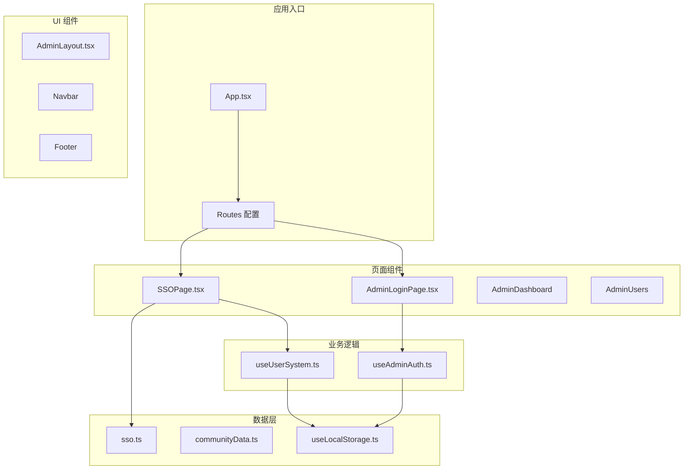
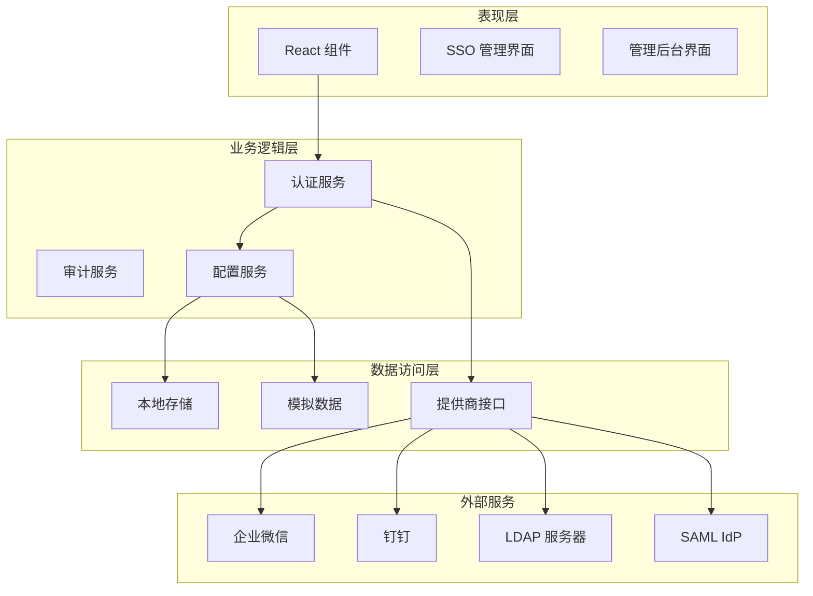
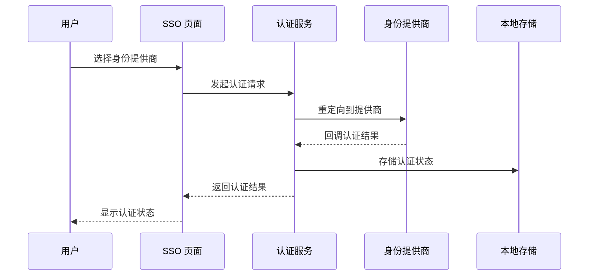
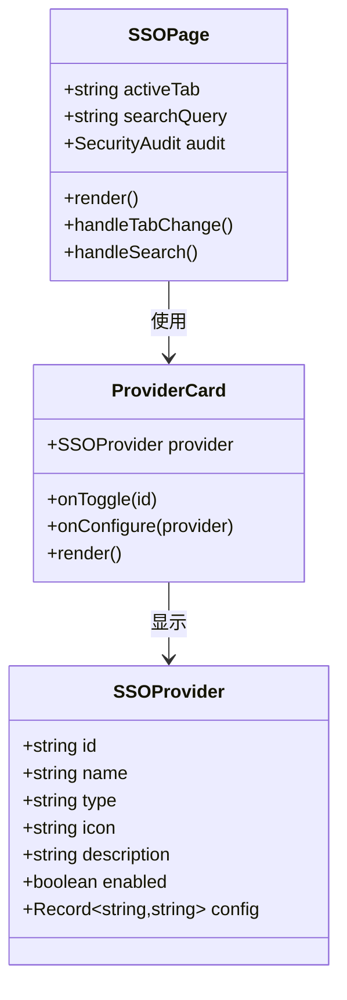
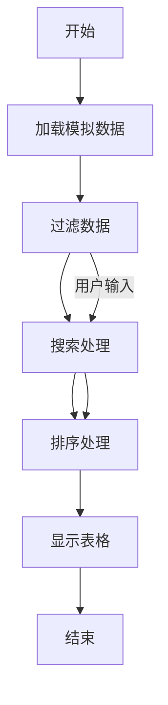
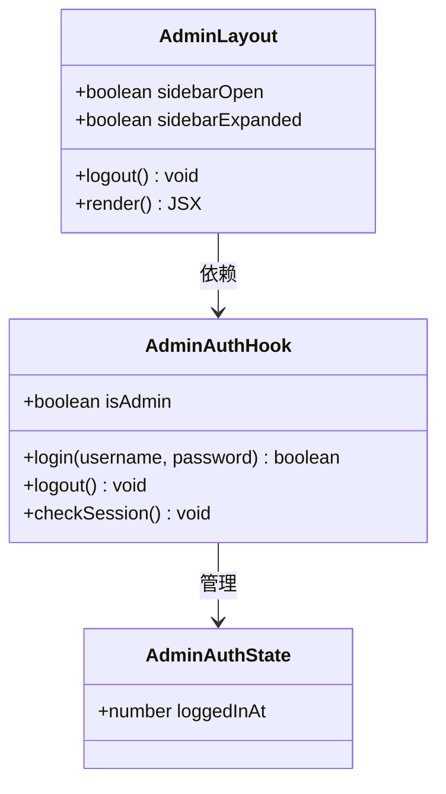
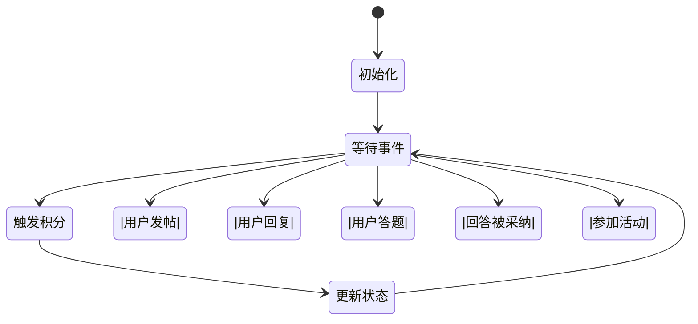
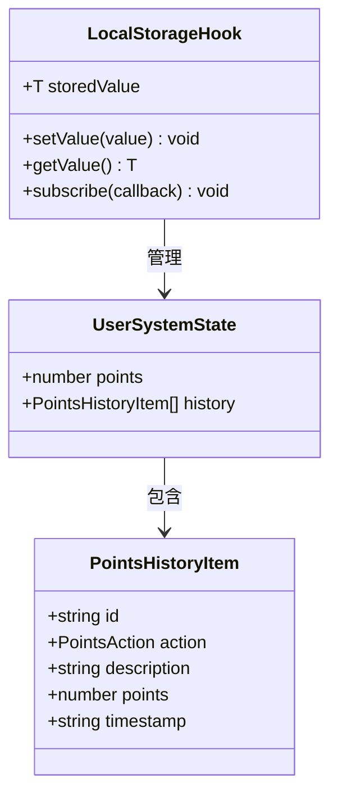

# 单点登录系统

<cite>
**本文档引用的文件**
- [sso.ts](file://src/data/sso.ts)
- [SSOPage.tsx](file://src/pages/SSOPage.tsx)
- [App.tsx](file://src/App.tsx)
- [useUserSystem.ts](file://src/hooks/useUserSystem.ts)
- [useAdminAuth.ts](file://src/hooks/useAdminAuth.ts)
- [AdminLayout.tsx](file://src/components/AdminLayout.tsx)
- [AdminLoginPage.tsx](file://src/pages/AdminLoginPage.tsx)
- [useLocalStorage.ts](file://src/hooks/useLocalStorage.ts)
- [communityData.ts](file://src/data/communityData.ts)
- [package.json](file://package.json)
</cite>

## 目录
1. [简介](#简介)
2. [项目结构](#项目结构)
3. [核心组件](#核心组件)
4. [架构概览](#架构概览)
5. [详细组件分析](#详细组件分析)
6. [依赖关系分析](#依赖关系分析)
7. [性能考虑](#性能考虑)
8. [故障排除指南](#故障排除指南)
9. [结论](#结论)

## 简介

YuleTech 社区平台的单点登录（SSO）系统是一个企业级的身份认证解决方案，支持多种身份提供商集成，包括企业微信、钉钉、LDAP/Active Directory 和 SAML 2.0。该系统提供了完整的身份认证管理界面，包括提供商配置、安全审计和登录日志监控功能。

系统采用现代化的 React 技术栈构建，结合 TypeScript 提供类型安全保障，使用 Tailwind CSS 进行样式设计，通过 Recharts 实现数据可视化展示。整个系统设计注重用户体验和安全性，为企业用户提供统一的身份认证体验。

## 项目结构

该项目采用模块化的前端架构，主要包含以下核心目录结构：



**图表来源**
- [App.tsx:40-139](file://src/App.tsx#L40-L139)
- [SSOPage.tsx:137-387](file://src/pages/SSOPage.tsx#L137-L387)

**章节来源**
- [App.tsx:1-139](file://src/App.tsx#L1-L139)
- [package.json:1-49](file://package.json#L1-L49)

## 核心组件

### SSO 提供商管理

系统支持四种主要的身份提供商类型，每种提供商都有其特定的配置要求和使用场景：

| 提供商类型 | 描述 | 状态 | 主要用途 |
|------------|------|------|----------|
| 企业微信 | 企业内部微信扫码登录 | 已启用 | 内部员工认证 |
| 钉钉 | 钉钉扫码登录认证 | 已启用 | 企业员工认证 |
| LDAP/AD | 企业目录服务认证 | 已禁用 | 传统企业认证 |
| SAML 2.0 | 企业单点登录协议 | 已禁用 | 复杂企业环境 |

### 安全审计功能

系统提供全面的安全审计能力，包括实时监控和历史数据分析：

- **登录统计**：总登录次数、成功率、失败次数
- **用户分析**：独立用户数量、活跃度统计
- **提供商对比**：各提供商的使用情况对比
- **时间趋势**：登录活动的时间分布分析

### 用户系统集成

与社区用户系统深度集成，支持基于用户行为的积分奖励机制：

- **积分规则**：可配置的积分获取规则
- **等级体系**：多级别的用户等级划分
- **历史记录**：完整的积分变动记录
- **动态调整**：支持运行时修改积分规则

**章节来源**
- [sso.ts:24-76](file://src/data/sso.ts#L24-L76)
- [sso.ts:141-176](file://src/data/sso.ts#L141-L176)
- [useUserSystem.ts:91-132](file://src/hooks/useUserSystem.ts#L91-L132)

## 架构概览

系统采用分层架构设计，确保各组件间的职责清晰分离：



**图表来源**
- [SSOPage.tsx:137-387](file://src/pages/SSOPage.tsx#L137-L387)
- [useAdminAuth.ts:29-62](file://src/hooks/useAdminAuth.ts#L29-L62)

### 认证流程



**图表来源**
- [SSOPage.tsx:211-257](file://src/pages/SSOPage.tsx#L211-L257)
- [useAdminAuth.ts:47-55](file://src/hooks/useAdminAuth.ts#L47-L55)

## 详细组件分析

### SSO 管理页面

SSOPage 是整个单点登录系统的核心界面，采用标签页设计提供三种主要功能：

#### 身份提供商管理



**图表来源**
- [SSOPage.tsx:33-85](file://src/pages/SSOPage.tsx#L33-L85)
- [sso.ts:1-9](file://src/data/sso.ts#L1-L9)

#### 安全审计面板

系统提供多层次的安全审计功能：

- **统计卡片**：实时显示关键指标
- **图表展示**：使用 Recharts 进行数据可视化
- **详细日志**：完整的登录历史记录

#### 登录日志管理



**图表来源**
- [SSOPage.tsx:344-383](file://src/pages/SSOPage.tsx#L344-L383)
- [sso.ts:78-130](file://src/data/sso.ts#L78-L130)

**章节来源**
- [SSOPage.tsx:137-387](file://src/pages/SSOPage.tsx#L137-L387)
- [sso.ts:11-22](file://src/data/sso.ts#L11-L22)

### 认证服务组件

#### 管理员认证系统



**图表来源**
- [useAdminAuth.ts:8-10](file://src/hooks/useAdminAuth.ts#L8-L10)
- [AdminLayout.tsx:28-177](file://src/components/AdminLayout.tsx#L28-L177)

#### 会话管理机制

系统采用基于本地存储的安全会话管理：

- **会话持久化**：使用 localStorage 存储认证状态
- **自动过期**：2小时会话超时机制
- **状态同步**：跨标签页状态同步机制
- **安全验证**：定期会话有效性检查

**章节来源**
- [useAdminAuth.ts:29-62](file://src/hooks/useAdminAuth.ts#L29-L62)
- [AdminLayout.tsx:28-177](file://src/components/AdminLayout.tsx#L28-L177)

### 用户系统集成

#### 积分奖励机制



**图表来源**
- [useUserSystem.ts:97-111](file://src/hooks/useUserSystem.ts#L97-L111)
- [useUserSystem.ts:20-26](file://src/hooks/useUserSystem.ts#L20-L26)

#### 等级体系设计

系统支持灵活的等级配置机制：

- **可配置阈值**：支持自定义等级门槛
- **动态计算**：实时计算用户当前等级
- **级别描述**：人性化的等级名称
- **范围管理**：支持无限级数的等级上限

**章节来源**
- [useUserSystem.ts:63-89](file://src/hooks/useUserSystem.ts#L63-L89)
- [useUserSystem.ts:120-131](file://src/hooks/useUserSystem.ts#L120-L131)

### 数据存储机制

#### 本地存储抽象



**图表来源**
- [useLocalStorage.ts:3-25](file://src/hooks/useLocalStorage.ts#L3-L25)
- [useUserSystem.ts:15-18](file://src/hooks/useUserSystem.ts#L15-L18)

#### 数据持久化策略

系统采用统一的本地存储策略：

- **类型安全**：TypeScript 类型保障数据完整性
- **错误处理**：完善的异常处理机制
- **事件通知**：跨组件状态同步通知
- **序列化支持**：自动 JSON 序列化/反序列化

**章节来源**
- [useLocalStorage.ts:1-60](file://src/hooks/useLocalStorage.ts#L1-L60)
- [communityData.ts:361-363](file://src/data/communityData.ts#L361-L363)

## 依赖关系分析

系统依赖关系清晰，遵循单一职责原则：

```mermaid
graph TB
subgraph "核心依赖"
React[react ^19.2.5]
Router[react-router-dom ^7.14.2]
Hooks[react hooks]
end
subgraph "UI 组件库"
Lucide[lucide-react ^1.8.0]
Tailwind[tailwindcss ^3.4.17]
Motion[framer-motion ^12.38.0]
end
subgraph "数据可视化"
Recharts[recharts ^3.8.1]
Monaco[@monaco-editor/react ^4.7.0]
end
subgraph "开发工具"
Vite[vite ^7.3.2]
ESLint[eslint ^9.39.4]
Typescript[typescript ~6.0.2]
end
SSOPage --> React
SSOPage --> Router
SSOPage --> Lucide
SSOPage --> Recharts
AdminLayout --> React
AdminLayout --> Router
AdminLayout --> Lucide
useAdminAuth --> React
useUserSystem --> React
useLocalStorage --> React
```

**图表来源**
- [package.json:12-27](file://package.json#L12-L27)
- [SSOPage.tsx:1-31](file://src/pages/SSOPage.tsx#L1-L31)

### 第三方服务集成

系统设计考虑了与外部服务的集成能力：

- **企业微信集成**：支持扫码登录和回调处理
- **钉钉集成**：提供完整的钉钉认证流程
- **LDAP/AD 支持**：预留企业目录服务接口
- **SAML 2.0 兼容**：支持企业单点登录协议

**章节来源**
- [sso.ts:24-76](file://src/data/sso.ts#L24-L76)
- [SSOPage.tsx:211-257](file://src/pages/SSOPage.tsx#L211-L257)

## 性能考虑

### 渲染优化

系统采用多种性能优化策略：

- **懒加载组件**：使用 React.lazy 实现按需加载
- **虚拟滚动**：大数据量时使用虚拟化技术
- **状态缓存**：合理使用 React.memo 和 useMemo
- **代码分割**：按路由进行代码分割

### 数据处理优化

- **内存管理**：及时清理定时器和事件监听器
- **批量更新**：使用批量状态更新减少重渲染
- **防抖处理**：搜索和筛选操作使用防抖优化
- **数据缓存**：审计数据进行本地缓存

### 网络性能

- **CDN 加速**：静态资源使用 CDN 加速
- **压缩传输**：启用 Gzip 压缩
- **连接复用**：HTTP/2 连接复用
- **缓存策略**：合理的浏览器缓存策略

## 故障排除指南

### 常见问题诊断

#### 认证失败排查

1. **检查提供商配置**
   - 验证应用 ID 和密钥
   - 确认回调 URL 设置正确
   - 检查网络连通性

2. **会话状态检查**
   - 清除浏览器本地存储
   - 检查会话过期时间
   - 验证跨标签页同步

3. **日志分析**
   - 查看浏览器控制台错误
   - 检查网络请求状态
   - 分析认证流程日志

#### 性能问题排查

1. **内存泄漏检测**
   - 检查定时器清理
   - 验证事件监听器移除
   - 监控组件卸载

2. **渲染性能优化**
   - 使用 React DevTools 分析
   - 检查不必要的重渲染
   - 优化大数据量处理

#### 数据一致性问题

1. **本地存储同步**
   - 检查存储权限
   - 验证数据格式
   - 处理存储空间不足

2. **状态管理**
   - 确认状态更新原子性
   - 检查异步操作顺序
   - 验证竞态条件处理

**章节来源**
- [useAdminAuth.ts:35-45](file://src/hooks/useAdminAuth.ts#L35-L45)
- [useLocalStorage.ts:27-56](file://src/hooks/useLocalStorage.ts#L27-L56)

### 调试工具使用

#### 开发工具推荐

- **React DevTools**：组件树分析和性能监控
- **Chrome DevTools**：网络请求和内存分析
- **ESLint**：代码质量检查
- **TypeScript**：编译时错误检测

#### 日志记录策略

- **关键操作日志**：认证流程、配置变更
- **错误日志**：异常捕获和错误追踪
- **性能日志**：渲染时间和内存使用
- **用户行为日志**：交互分析和使用统计

## 结论

YuleTech 单点登录系统是一个功能完整、架构清晰的企业级身份认证解决方案。系统具有以下特点：

**技术优势**
- 采用现代化 React 技术栈，具备良好的可维护性
- 完善的 TypeScript 类型系统，提供编译时安全保障
- 清晰的组件分层架构，便于扩展和维护
- 丰富的数据可视化功能，提供直观的监控界面

**功能特性**
- 支持多种主流身份提供商，满足不同企业需求
- 完整的安全审计功能，提供全面的监控能力
- 深度的用户系统集成，实现统一的用户体验
- 灵活的配置机制，支持动态调整认证策略

**扩展潜力**
- 模块化设计便于功能扩展
- 留有充足的接口用于新提供商集成
- 可配置的规则系统支持业务定制
- 良好的性能优化为大规模部署奠定基础

该系统为企业用户提供了一站式的单点登录解决方案，既满足了当前的认证需求，又为未来的功能扩展和技术演进预留了充足的空间。