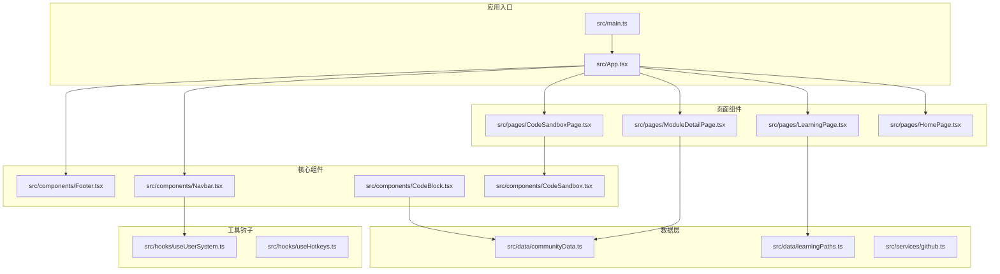
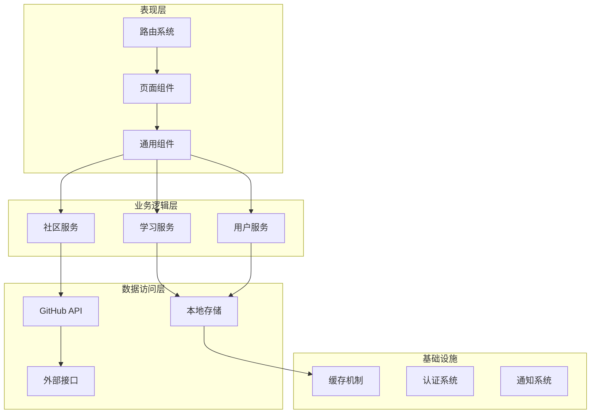
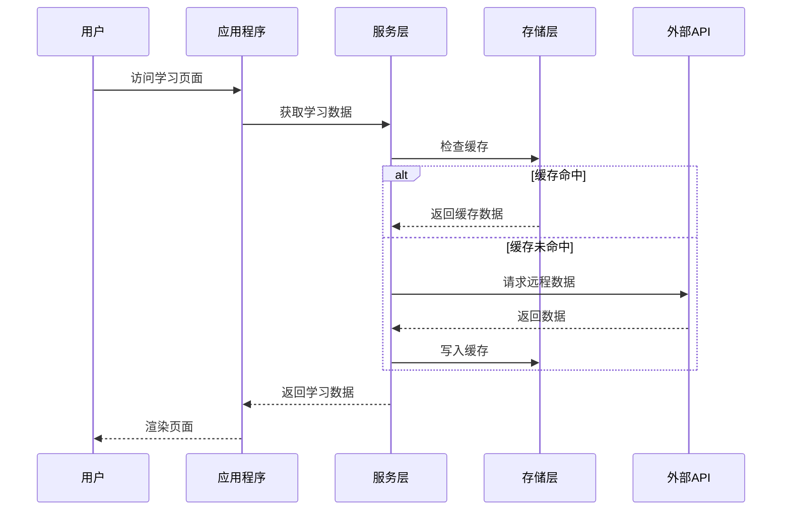
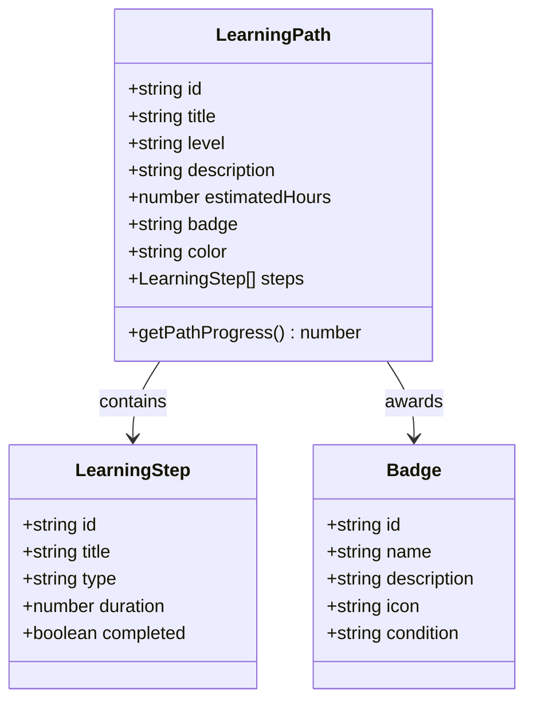
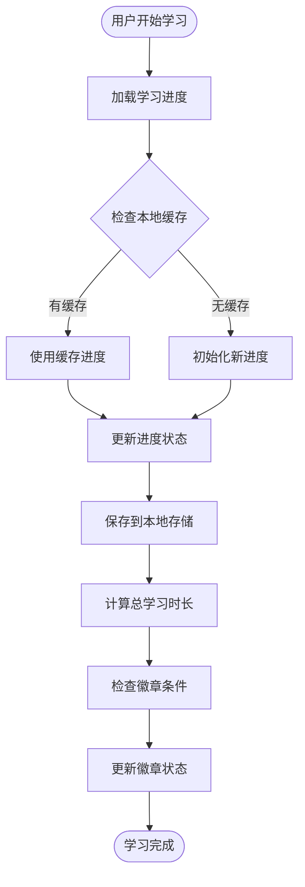
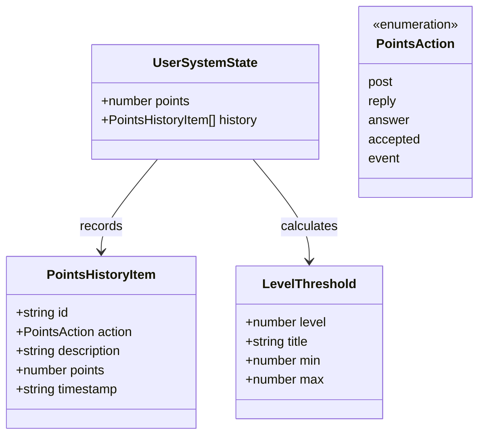
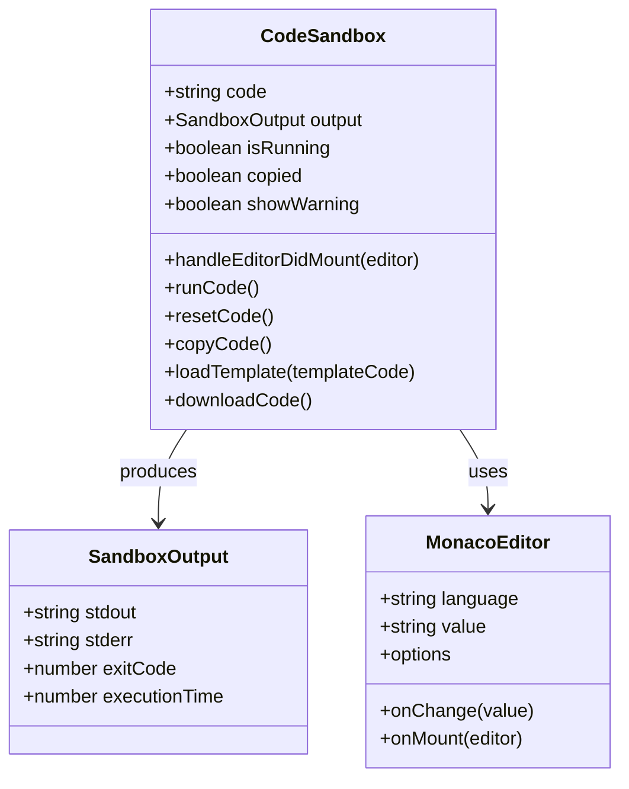
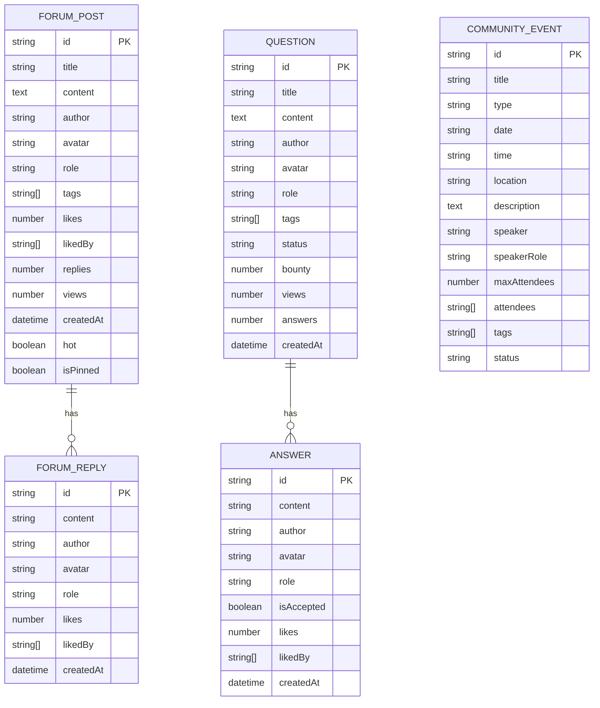
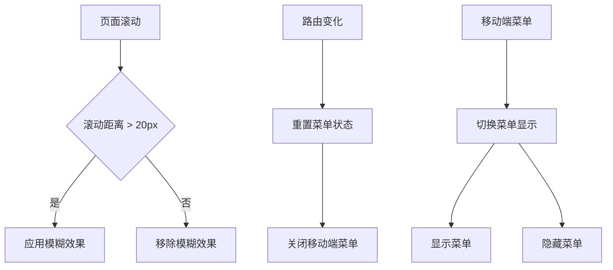
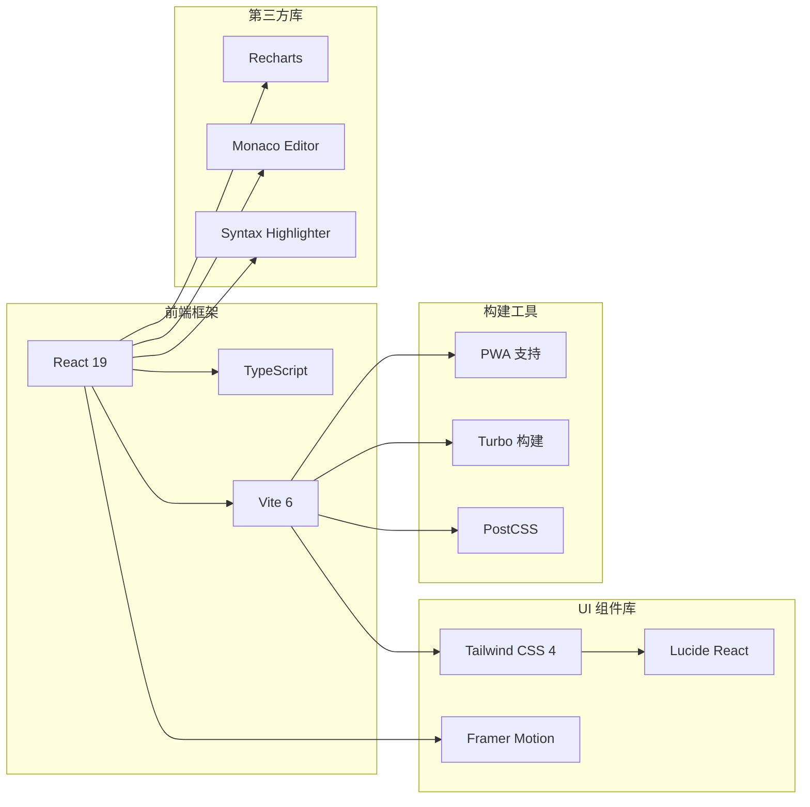

# 学习管理系统

<cite>
**本文档引用的文件**
- [package.json](file://package.json)
- [README.md](file://README.md)
- [App.tsx](file://src/App.tsx)
- [LearningPage.tsx](file://src/pages/LearningPage.tsx)
- [learningPaths.ts](file://src/data/learningPaths.ts)
- [Navbar.tsx](file://src/components/Navbar.tsx)
- [Footer.tsx](file://src/components/Footer.tsx)
- [useUserSystem.ts](file://src/hooks/useUserSystem.ts)
- [HomePage.tsx](file://src/pages/HomePage.tsx)
- [communityData.ts](file://src/data/communityData.ts)
- [CodeBlock.tsx](file://src/components/CodeBlock.tsx)
- [CodeSandbox.tsx](file://src/components/CodeSandbox.tsx)
- [ModuleDetailPage.tsx](file://src/pages/ModuleDetailPage.tsx)
- [github.ts](file://src/services/github.ts)
- [vite.config.ts](file://vite.config.ts)
</cite>

## 目录
1. [项目简介](#项目简介)
2. [项目结构](#项目结构)
3. [核心组件](#核心组件)
4. [架构概览](#架构概览)
5. [详细组件分析](#详细组件分析)
6. [依赖关系分析](#依赖关系分析)
7. [性能考虑](#性能考虑)
8. [故障排除指南](#故障排除指南)
9. [结论](#结论)

## 项目简介

YuleTech 开源技术社区是一个基于 React 19 + TypeScript 构建的现代化学习管理系统，专注于 AutoSAR BSW（汽车基础软件）技术社区平台。该项目旨在为汽车电子工程师、芯片厂商和高校研究人员提供一个集开源代码、工具链、学习成长和硬件开发于一体的综合性技术社区。

### 项目特色

- **技术栈现代化**：采用 React 19 + TypeScript + Vite 6 + Tailwind CSS 4
- **AutoSAR 专业性**：专注于汽车基础软件开源社区建设
- **全栈功能完善**：包含学习管理、社区互动、代码编辑、项目管理等模块
- **响应式设计**：支持桌面端和移动端的无缝体验

**章节来源**
- [README.md:1-95](file://README.md#L1-L95)
- [package.json:1-49](file://package.json#L1-L49)

## 项目结构

项目采用模块化的组织方式，按照功能域进行文件分离：

**图表来源**
- [App.tsx:1-139](file://src/App.tsx#L1-L139)
- [vite.config.ts:1-51](file://vite.config.ts#L1-L51)

**章节来源**
- [README.md:20-46](file://README.md#L20-L46)
- [vite.config.ts:45-50](file://vite.config.ts#L45-L50)

## 核心组件

### 学习管理系统核心功能

系统围绕学习管理这一核心目标，构建了完整的功能体系：

#### 1. 学习路径管理
- **多层级学习路径**：从入门到专家的三个等级路径
- **动态进度跟踪**：基于本地存储的学习进度保存
- **徽章系统**：激励用户完成学习目标

#### 2. 内容分类体系
- **教程类**：AutoSAR 规范解读、MCAL 驱动开发等
- **视频课程**：工具链实操、通信协议解析等
- **实战项目**：开发板项目、全栈开发等
- **专家问答**：FAQ 解答、直播回放、1对1咨询

#### 3. 用户互动机制
- **积分系统**：基于行为的积分奖励机制
- **等级制度**：初级到技术专家的分级体系
- **社区参与**：论坛、问答、活动等功能

**章节来源**
- [LearningPage.tsx:19-191](file://src/pages/LearningPage.tsx#L19-L191)
- [learningPaths.ts:20-142](file://src/data/learningPaths.ts#L20-L142)
- [useUserSystem.ts:91-132](file://src/hooks/useUserSystem.ts#L91-L132)

## 架构概览

系统采用分层架构设计，确保各模块间的松耦合和高内聚：

**图表来源**
- [App.tsx:40-139](file://src/App.tsx#L40-L139)
- [github.ts:52-80](file://src/services/github.ts#L52-L80)

### 数据流架构

**图表来源**
- [github.ts:28-50](file://src/services/github.ts#L28-L50)
- [learningPaths.ts:115-131](file://src/data/learningPaths.ts#L115-L131)

## 详细组件分析

### 学习路径管理系统

#### 数据模型设计

**图表来源**
- [learningPaths.ts:1-18](file://src/data/learningPaths.ts#L1-L18)
- [learningPaths.ts:77-113](file://src/data/learningPaths.ts#L77-L113)

#### 进度跟踪机制

系统实现了智能的学习进度跟踪，通过本地存储持久化用户的学习状态：

**图表来源**
- [learningPaths.ts:115-142](file://src/data/learningPaths.ts#L115-L142)

**章节来源**
- [learningPaths.ts:20-75](file://src/data/learningPaths.ts#L20-L75)
- [LearningPage.tsx:172-191](file://src/pages/LearningPage.tsx#L172-L191)

### 用户积分与等级系统

#### 积分规则配置

系统提供了灵活的积分规则配置机制，支持管理员自定义各种行为的积分奖励：

**图表来源**
- [useUserSystem.ts:15-89](file://src/hooks/useUserSystem.ts#L15-L89)

#### 等级晋升机制

系统根据累计积分自动计算用户等级，提供清晰的晋升路径：

| 等级 | 积分范围 | 称号 | 描述 |
|------|----------|------|------|
| 初级工程师 | 0-100 | 🌱 | 新手入门 |
| 中级工程师 | 101-500 | 🚧 | 技术熟练 |
| 高级工程师 | 501-2000 | 🔨 | 专家水平 |
| 技术专家 | 2001+ | 🚀 | 行业精英 |

**章节来源**
- [useUserSystem.ts:56-89](file://src/hooks/useUserSystem.ts#L56-L89)
- [useUserSystem.ts:20-47](file://src/hooks/useUserSystem.ts#L20-L47)

### 代码编辑与沙盒系统

#### 在线代码编辑器

系统集成了功能强大的在线代码编辑器，支持实时代码高亮和语法检查：

**图表来源**
- [CodeSandbox.tsx:16-22](file://src/components/CodeSandbox.tsx#L16-L22)
- [CodeSandbox.tsx:119-396](file://src/components/CodeSandbox.tsx#L119-L396)

#### 代码高亮组件

支持多种编程语言的语法高亮显示，自动适配深色/浅色主题：

**章节来源**
- [CodeBlock.tsx:14-49](file://src/components/CodeBlock.tsx#L14-L49)
- [CodeSandbox.tsx:23-117](file://src/components/CodeSandbox.tsx#L23-L117)

### 社区数据管理

#### 论坛与问答系统

系统提供了完整的社区互动功能，包括论坛帖子、问答系统和活动管理：

**图表来源**
- [communityData.ts:12-70](file://src/data/communityData.ts#L12-L70)

**章节来源**
- [communityData.ts:72-216](file://src/data/communityData.ts#L72-L216)
- [communityData.ts:218-296](file://src/data/communityData.ts#L218-L296)
- [communityData.ts:298-359](file://src/data/communityData.ts#L298-L359)

### 导航与布局系统

#### 响应式导航栏

系统实现了智能的响应式导航栏，支持桌面端和移动端的不同交互模式：

**图表来源**
- [Navbar.tsx:15-35](file://src/components/Navbar.tsx#L15-L35)

#### 页脚布局设计

采用多列布局的页脚设计，提供清晰的导航和品牌信息展示。

**章节来源**
- [Navbar.tsx:37-48](file://src/components/Navbar.tsx#L37-L48)
- [Footer.tsx:3-28](file://src/components/Footer.tsx#L3-L28)

## 依赖关系分析

### 技术栈依赖

系统采用了现代化的技术栈组合，确保性能和开发效率：

**图表来源**
- [package.json:12-28](file://package.json#L12-L28)
- [package.json:29-46](file://package.json#L29-L46)

### 性能优化策略

系统实施了多项性能优化措施：

1. **代码分割**：通过 Vite 的自动代码分割功能
2. **懒加载**：路由级别的组件懒加载
3. **缓存策略**：本地存储和会话缓存结合
4. **PWA 支持**：离线访问和快速加载

**章节来源**
- [vite.config.ts:26-44](file://vite.config.ts#L26-L44)
- [github.ts:19-26](file://src/services/github.ts#L19-L26)

## 性能考虑

### 加载性能优化

系统在多个层面进行了性能优化：

- **路由懒加载**：所有页面组件都采用懒加载策略
- **资源预加载**：关键资源的预加载和缓存
- **组件优化**：使用 React.memo 和 useMemo 优化渲染
- **CDN 加速**：静态资源通过 CDN 分发

### 学习体验优化

- **进度持久化**：学习进度实时保存到本地存储
- **响应式设计**：适配各种设备尺寸
- **动画优化**：使用 Framer Motion 实现流畅动画
- **无障碍访问**：遵循 WCAG 2.1 标准

## 故障排除指南

### 常见问题及解决方案

#### 学习进度丢失问题

**问题描述**：用户反馈学习进度在浏览器刷新后丢失

**解决方案**：
1. 检查浏览器的本地存储权限设置
2. 确认浏览器没有清理本地数据
3. 建议用户开启浏览器的本地存储功能

#### GitHub API 限流问题

**问题描述**：GitHub API 请求频繁出现限流错误

**解决方案**：
1. 检查网络连接和防火墙设置
2. 确认 API 密钥配置正确
3. 实施重试机制和错误处理

#### 代码编辑器卡顿问题

**问题描述**：在线代码编辑器响应缓慢

**解决方案**：
1. 检查浏览器性能监控工具
2. 减少代码文件大小
3. 调整编辑器配置参数

**章节来源**
- [github.ts:65-67](file://src/services/github.ts#L65-L67)
- [useUserSystem.ts:97-111](file://src/hooks/useUserSystem.ts#L97-L111)

## 结论

YuleTech 学习管理系统是一个功能完整、架构清晰的现代化技术社区平台。系统通过精心设计的数据模型、灵活的组件架构和完善的用户体验，为 AutoSAR BSW 技术学习提供了优质的数字化平台。

### 系统优势

1. **技术先进性**：采用最新的 React 19 + TypeScript 技术栈
2. **功能完整性**：涵盖学习管理、社区互动、代码编辑等核心功能
3. **用户体验**：响应式设计和流畅的交互体验
4. **扩展性强**：模块化架构便于功能扩展和维护

### 发展方向

未来可以考虑的功能增强：
- 集成更多学习资源类型
- 增强社交互动功能
- 优化移动端体验
- 扩展多语言支持