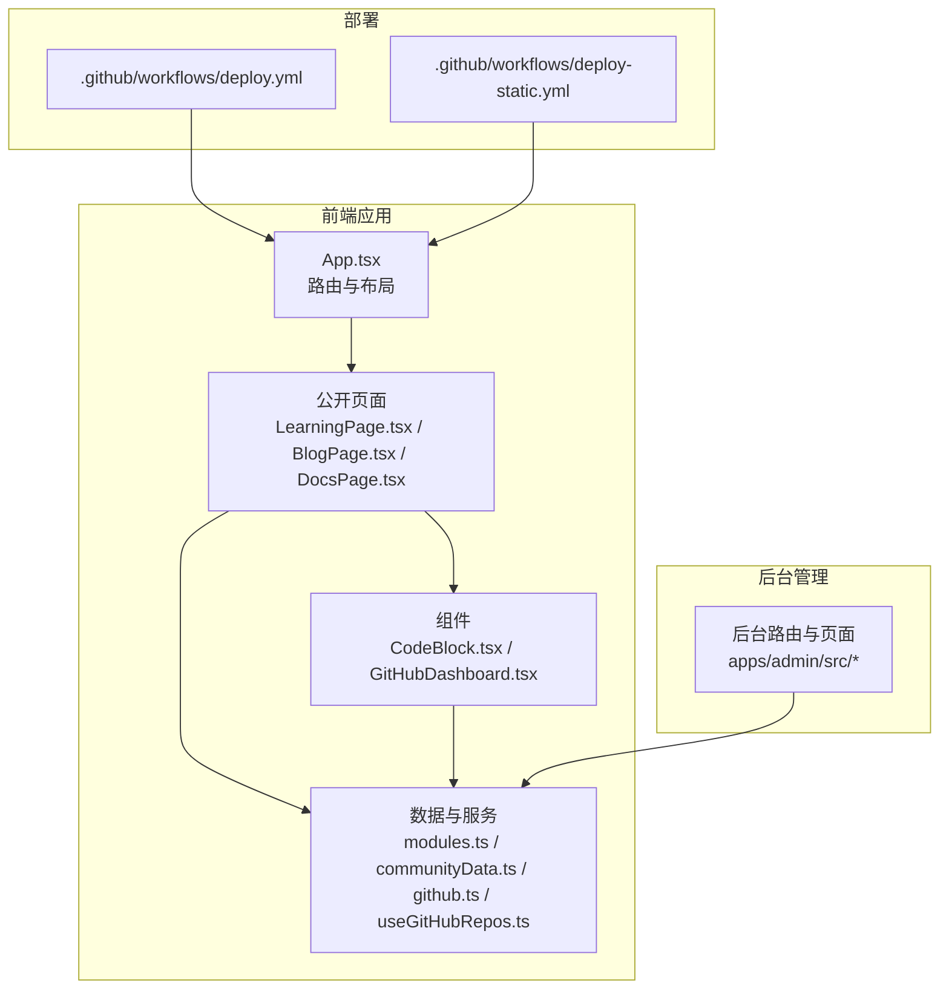
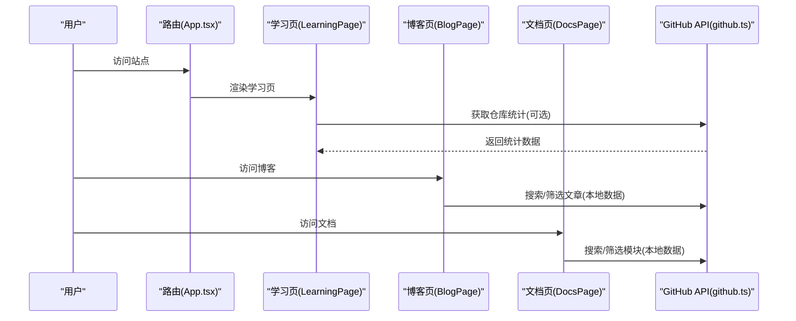
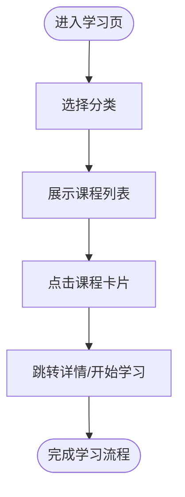
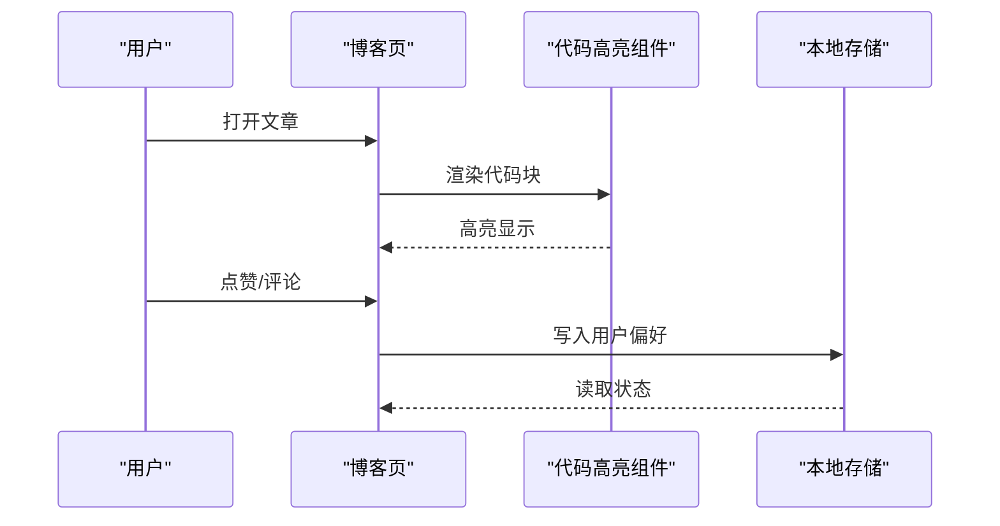
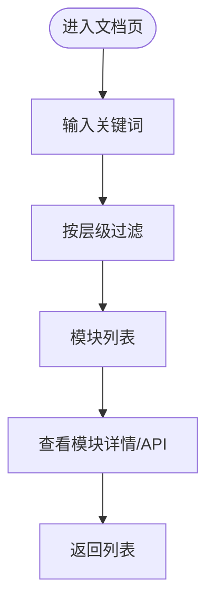
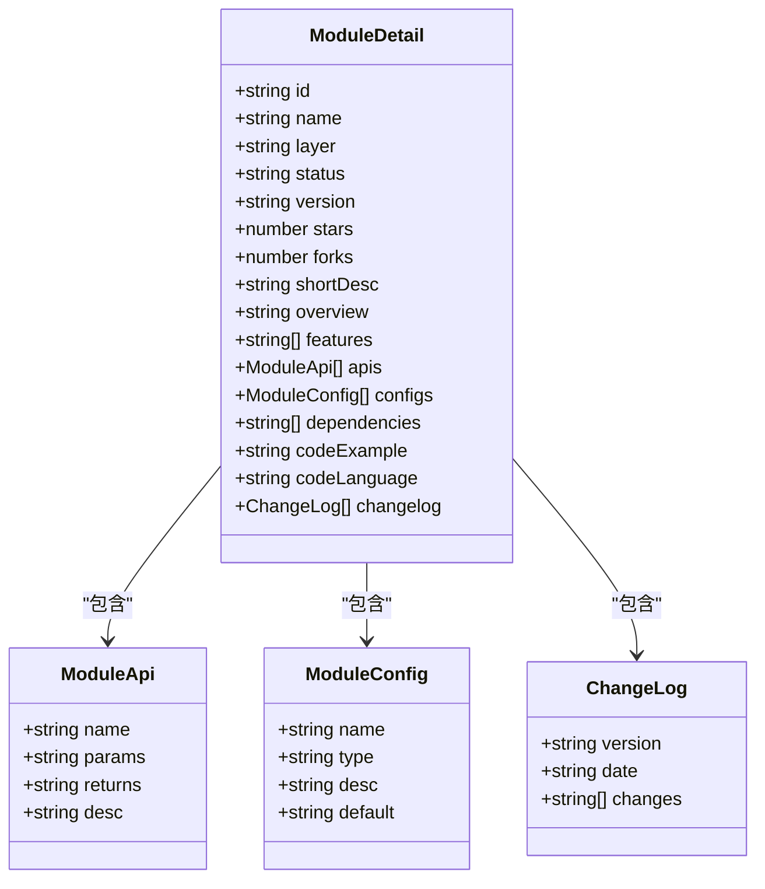
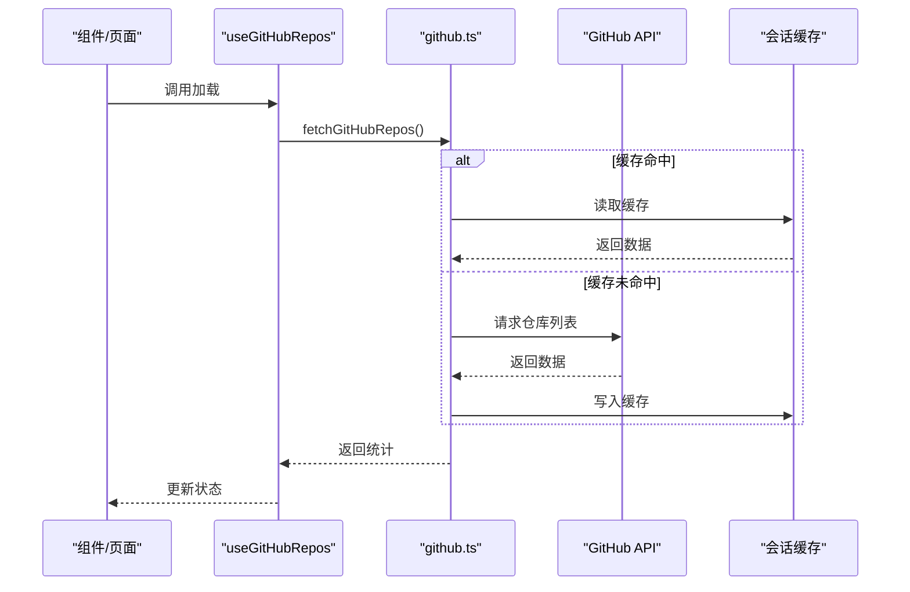
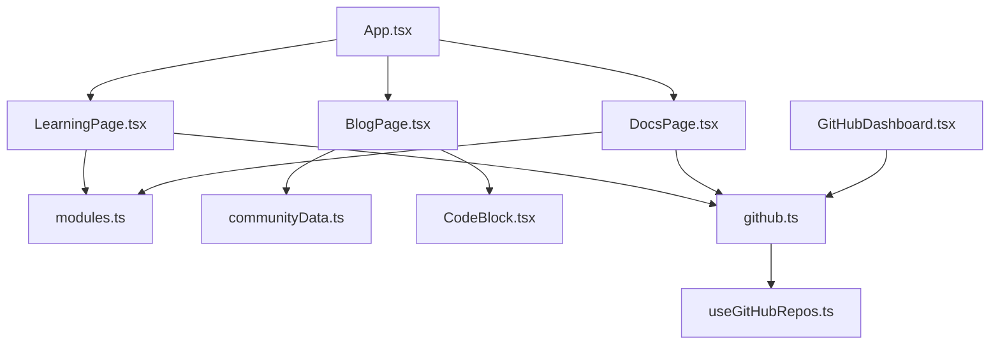

# 内容管理系统

<cite>
**本文引用的文件**
- [README.md](file://README.md)
- [package.json](file://package.json)
- [App.tsx](file://src/App.tsx)
- [LearningPage.tsx](file://src/pages/LearningPage.tsx)
- [BlogPage.tsx](file://src/pages/BlogPage.tsx)
- [DocsPage.tsx](file://src/pages/DocsPage.tsx)
- [CodeBlock.tsx](file://src/components/CodeBlock.tsx)
- [github.ts](file://src/services/github.ts)
- [useGitHubRepos.ts](file://src/hooks/useGitHubRepos.ts)
- [deploy.yml](file://.github/workflows/deploy.yml)
- [deploy-static.yml](file://.github/workflows/deploy-static.yml)
- [modules.ts](file://src/data/modules.ts)
- [communityData.ts](file://src/data/communityData.ts)
- [GitHubDashboard.tsx](file://src/components/GitHubDashboard.tsx)
- [ModuleDetailPage.tsx](file://src/pages/ModuleDetailPage.tsx)
</cite>

## 目录
1. [简介](#简介)
2. [项目结构](#项目结构)
3. [核心组件](#核心组件)
4. [架构总览](#架构总览)
5. [详细组件分析](#详细组件分析)
6. [依赖关系分析](#依赖关系分析)
7. [性能考量](#性能考量)
8. [故障排查指南](#故障排查指南)
9. [结论](#结论)
10. [附录](#附录)

## 简介
本文件为 YuleTech 社区学习内容管理系统的综合文档，围绕学习内容的组织结构、分类管理与发布流程展开；解释课程内容的多媒体支持（文本、视频、代码示例）与交互式学习体验设计；文档化内容的版本控制机制、更新追踪与历史版本管理；涵盖内容质量审核流程、版权与合规性检查；提供内容创作工具使用指南、模板系统与标准化流程；描述内容推荐算法、搜索优化与用户个性化推送机制；最后解释内容管理系统与 GitHub 的集成实现与自动化发布流程。

## 项目结构
本项目采用多页面应用（SPA）架构，基于 React 19 + TypeScript + Vite 7，前端页面分为公开模块与后台管理模块，公共组件与服务位于 src 目录，GitHub 集成通过独立服务与 Hook 实现，自动化部署通过 GitHub Actions 工作流完成。

图表来源
- [App.tsx:1-118](file://src/App.tsx#L1-L118)
- [LearningPage.tsx:1-404](file://src/pages/LearningPage.tsx#L1-L404)
- [BlogPage.tsx:1-764](file://src/pages/BlogPage.tsx#L1-L764)
- [DocsPage.tsx:1-343](file://src/pages/DocsPage.tsx#L1-L343)
- [CodeBlock.tsx:1-49](file://src/components/CodeBlock.tsx#L1-L49)
- [modules.ts:1-800](file://src/data/modules.ts#L1-L800)
- [communityData.ts:1-371](file://src/data/communityData.ts#L1-L371)
- [github.ts:1-97](file://src/services/github.ts#L1-L97)
- [useGitHubRepos.ts:1-45](file://src/hooks/useGitHubRepos.ts#L1-L45)
- [deploy.yml:1-54](file://.github/workflows/deploy.yml#L1-L54)
- [deploy-static.yml:1-43](file://.github/workflows/deploy-static.yml#L1-L43)

章节来源
- [README.md:1-95](file://README.md#L1-L95)
- [package.json:1-46](file://package.json#L1-L46)
- [App.tsx:1-118](file://src/App.tsx#L1-L118)

## 核心组件
- 学习内容页面（LearningPage）：提供课程分类筛选、学习路径展示、课程卡片与标签体系，支持免费与付费内容区分。
- 技术博客页面（BlogPage）：提供文章分类、搜索、热门标签、周榜、评论与点赞等交互功能，并内置富文本渲染与代码高亮。
- 文档中心页面（DocsPage）：提供 AutoSAR BSW 模块 API 文档浏览、搜索与快速入口，支持按层级过滤与覆盖率可视化。
- 代码高亮组件（CodeBlock）：基于 react-syntax-highlighter，适配暗/亮主题自动切换。
- GitHub 集成（github.ts + useGitHubRepos.ts）：封装 GitHub API 请求、缓存与仓库查找逻辑，支持模块详情页与仪表盘数据。
- 模块详情页（ModuleDetailPage）：展示模块概述、特性、API、配置、依赖、代码示例与更新日志。
- GitHub 仪表盘（GitHubDashboard）：展示仓库统计数据、模块进度与贡献活跃度图表。
- 社区数据（communityData.ts）：论坛帖子、问答、活动等社区内容的数据模型与示例数据。

章节来源
- [LearningPage.tsx:193-404](file://src/pages/LearningPage.tsx#L193-L404)
- [BlogPage.tsx:249-764](file://src/pages/BlogPage.tsx#L249-L764)
- [DocsPage.tsx:92-343](file://src/pages/DocsPage.tsx#L92-L343)
- [CodeBlock.tsx:14-49](file://src/components/CodeBlock.tsx#L14-L49)
- [github.ts:52-97](file://src/services/github.ts#L52-L97)
- [useGitHubRepos.ts:13-45](file://src/hooks/useGitHubRepos.ts#L13-L45)
- [ModuleDetailPage.tsx:36-287](file://src/pages/ModuleDetailPage.tsx#L36-L287)
- [GitHubDashboard.tsx:32-281](file://src/components/GitHubDashboard.tsx#L32-L281)
- [communityData.ts:72-371](file://src/data/communityData.ts#L72-L371)

## 架构总览
系统采用前后端分离的 SPA 架构，前端通过路由组织页面，组件化复用公共 UI 与业务逻辑；数据层通过本地数据与 GitHub API 双通道提供内容与统计；自动化部署通过 GitHub Actions 实现一键构建与发布。

图表来源
- [App.tsx:30-115](file://src/App.tsx#L30-L115)
- [LearningPage.tsx:193-404](file://src/pages/LearningPage.tsx#L193-L404)
- [BlogPage.tsx:249-764](file://src/pages/BlogPage.tsx#L249-L764)
- [DocsPage.tsx:92-343](file://src/pages/DocsPage.tsx#L92-L343)
- [github.ts:52-97](file://src/services/github.ts#L52-L97)

## 详细组件分析

### 学习内容组织与分类管理
- 分类体系：教程、视频课程、实战项目、专家问答四大类，每类带专属图标与颜色标识。
- 学习路径：提供“入门/进阶/专家”三阶路径，引导用户系统化学习。
- 交互设计：分类筛选、课程卡片、标签、评分、学习人数、时长等信息直观呈现。
- 付费与免费：通过徽标区分免费与会员内容，引导转化。

图表来源
- [LearningPage.tsx:193-404](file://src/pages/LearningPage.tsx#L193-L404)

章节来源
- [LearningPage.tsx:19-170](file://src/pages/LearningPage.tsx#L19-L170)
- [LearningPage.tsx:172-191](file://src/pages/LearningPage.tsx#L172-L191)
- [LearningPage.tsx:193-404](file://src/pages/LearningPage.tsx#L193-L404)

### 技术博客与多媒体支持
- 内容类型：技术文章、作者、标签、分类、阅读量、点赞、评论、发布时间。
- 多媒体支持：富文本渲染，支持代码块高亮（CodeBlock），Markdown 风格的代码围栏语法。
- 交互功能：分类筛选、搜索、热门标签、周榜、点赞、评论与回复。
- 本地持久化：使用本地存储记录用户点赞与评论，提升交互体验。

图表来源
- [BlogPage.tsx:249-764](file://src/pages/BlogPage.tsx#L249-L764)
- [CodeBlock.tsx:14-49](file://src/components/CodeBlock.tsx#L14-L49)

章节来源
- [BlogPage.tsx:249-764](file://src/pages/BlogPage.tsx#L249-L764)
- [CodeBlock.tsx:14-49](file://src/components/CodeBlock.tsx#L14-L49)

### 文档中心与 API 管理
- 模块分层：MCAL、ECUAL、Service、RTE 四层，每层提供模块清单与状态。
- 搜索与过滤：支持按模块名、描述、版本等字段检索，按层级过滤。
- 快速入口：提供“快速入门、API 参考、配置手册、错误码”等快捷链接。
- 可视化统计：展示模块总数、API 数量、完成度与整体覆盖率。

图表来源
- [DocsPage.tsx:92-343](file://src/pages/DocsPage.tsx#L92-L343)

章节来源
- [DocsPage.tsx:20-83](file://src/pages/DocsPage.tsx#L20-L83)
- [DocsPage.tsx:92-343](file://src/pages/DocsPage.tsx#L92-L343)

### 模块详情与版本控制
- 模块详情：概述、特性、核心 API、配置参数、依赖关系、代码示例、更新日志。
- 版本控制：每个模块维护版本号与变更记录，便于追踪演进与回归。
- 依赖管理：展示模块间的依赖关系，辅助理解架构层次。

图表来源
- [modules.ts:15-32](file://src/data/modules.ts#L15-L32)
- [modules.ts:1-800](file://src/data/modules.ts#L1-L800)

章节来源
- [ModuleDetailPage.tsx:36-287](file://src/pages/ModuleDetailPage.tsx#L36-L287)
- [modules.ts:1-800](file://src/data/modules.ts#L1-L800)

### GitHub 集成与自动化发布
- GitHub 仓库数据：封装 API 请求、缓存与查找逻辑，支持模块详情页与仪表盘。
- Hook 封装：useGitHubRepos 提供加载、错误处理与刷新能力。
- 自动化部署：通过 GitHub Actions 工作流实现构建与发布，支持静态部署与 Pages 部署。

图表来源
- [useGitHubRepos.ts:13-45](file://src/hooks/useGitHubRepos.ts#L13-L45)
- [github.ts:52-97](file://src/services/github.ts#L52-L97)

章节来源
- [github.ts:19-97](file://src/services/github.ts#L19-L97)
- [useGitHubRepos.ts:13-45](file://src/hooks/useGitHubRepos.ts#L13-L45)
- [GitHubDashboard.tsx:32-281](file://src/components/GitHubDashboard.tsx#L32-L281)
- [deploy.yml:1-54](file://.github/workflows/deploy.yml#L1-L54)
- [deploy-static.yml:1-43](file://.github/workflows/deploy-static.yml#L1-L43)

### 社区内容与质量审核
- 数据模型：论坛帖子、问答、活动等，支持标签、热度、点赞、回复等属性。
- 示例数据：提供初始数据集，便于开发与演示。
- 审核与合规：页面未直接实现审核流程，可在后台管理模块扩展审核与合规检查。

章节来源
- [communityData.ts:12-71](file://src/data/communityData.ts#L12-L71)
- [communityData.ts:72-371](file://src/data/communityData.ts#L72-L371)

### 内容创作工具与模板系统
- 代码示例：模块详情页内置代码示例渲染，支持语言高亮与复制。
- 模板建议：可基于模块详情的数据结构扩展“创作模板”，统一字段与格式。
- 标准化流程：建议引入“草稿-初审-修订-终审-发布”的流程，结合后台管理页面实现。

章节来源
- [ModuleDetailPage.tsx:186-202](file://src/pages/ModuleDetailPage.tsx#L186-L202)
- [modules.ts:15-32](file://src/data/modules.ts#L15-L32)

### 搜索优化与个性化推送
- 搜索与过滤：博客页支持关键词搜索与分类筛选；文档页支持模块名与描述搜索。
- 个性化：可基于用户行为（阅读、点赞、评论）构建简单推荐，结合本地存储与后台数据。
- SEO：页面通过 Helmet 设置标题与描述，提升搜索引擎可见性。

章节来源
- [BlogPage.tsx:308-317](file://src/pages/BlogPage.tsx#L308-L317)
- [DocsPage.tsx:96-106](file://src/pages/DocsPage.tsx#L96-L106)
- [App.tsx:203-206](file://src/App.tsx#L203-L206)

## 依赖关系分析

图表来源
- [App.tsx:10-28](file://src/App.tsx#L10-L28)
- [LearningPage.tsx:1-20](file://src/pages/LearningPage.tsx#L1-L20)
- [BlogPage.tsx:1-25](file://src/pages/BlogPage.tsx#L1-L25)
- [DocsPage.tsx:1-20](file://src/pages/DocsPage.tsx#L1-L20)
- [modules.ts:1-800](file://src/data/modules.ts#L1-L800)
- [communityData.ts:1-371](file://src/data/communityData.ts#L1-L371)
- [CodeBlock.tsx:1-49](file://src/components/CodeBlock.tsx#L1-L49)
- [github.ts:1-97](file://src/services/github.ts#L1-L97)
- [useGitHubRepos.ts:1-45](file://src/hooks/useGitHubRepos.ts#L1-L45)
- [GitHubDashboard.tsx:1-281](file://src/components/GitHubDashboard.tsx#L1-L281)

章节来源
- [App.tsx:10-28](file://src/App.tsx#L10-L28)
- [github.ts:1-97](file://src/services/github.ts#L1-L97)
- [useGitHubRepos.ts:1-45](file://src/hooks/useGitHubRepos.ts#L1-L45)

## 性能考量
- 代码分割与懒加载：App.tsx 对页面组件使用懒加载与 Suspense，减少首屏负载。
- 图表与高亮：图表组件使用响应式容器，代码高亮按需渲染，避免不必要的计算。
- 缓存策略：GitHub API 使用会话缓存，降低重复请求成本。
- 构建优化：Vite 与 TypeScript 配置提升构建速度与产物体积控制。

章节来源
- [App.tsx:10-28](file://src/App.tsx#L10-L28)
- [github.ts:28-50](file://src/services/github.ts#L28-L50)
- [package.json:6-11](file://package.json#L6-L11)

## 故障排查指南
- GitHub API 错误：当请求失败时抛出错误，可通过 Hook 的 error 状态进行提示与重试。
- 缓存失效：缓存 TTL 过期后自动清理，确保数据新鲜度。
- 本地存储异常：博客页的点赞与评论依赖本地存储，若异常可清空对应键值或禁用本地存储。
- 路由与页面：App.tsx 提供 404 页面与骨架屏，便于定位路由与加载问题。

章节来源
- [github.ts:65-67](file://src/services/github.ts#L65-L67)
- [useGitHubRepos.ts:18-29](file://src/hooks/useGitHubRepos.ts#L18-L29)
- [BlogPage.tsx:253-292](file://src/pages/BlogPage.tsx#L253-L292)
- [App.tsx:94-104](file://src/App.tsx#L94-L104)

## 结论
本系统以 React + TypeScript 为基础，构建了学习内容、技术博客与文档中心三大核心模块，结合 GitHub 集成与自动化部署，形成从内容生产到发布的闭环。未来可在以下方面进一步完善：引入后台管理模块实现内容审核与合规检查；扩展个性化推荐与搜索优化；完善内容创作模板与标准化流程；强化版本控制与历史版本管理的可视化。

## 附录
- 技术栈：React 19 + TypeScript + Vite 7 + Tailwind CSS 4 + Recharts + Lucide React
- 许可证：MIT © 上海予乐电子科技有限公司