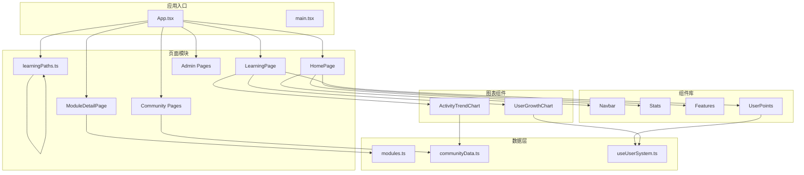
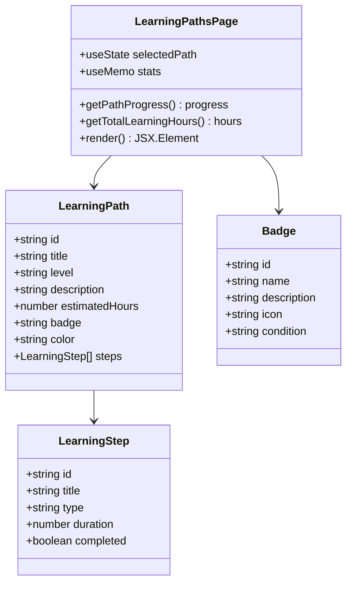
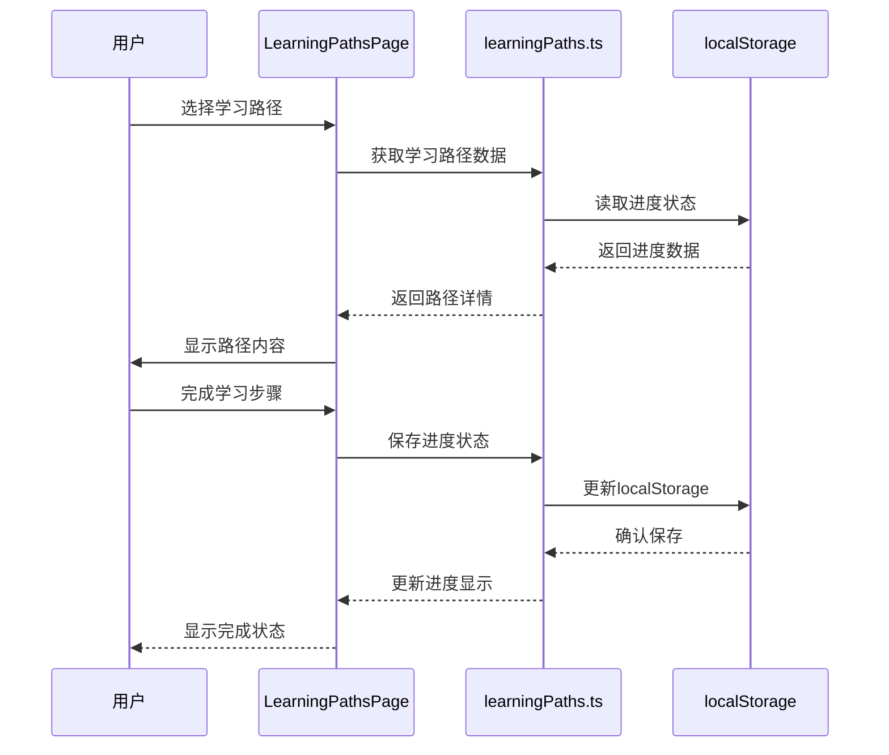
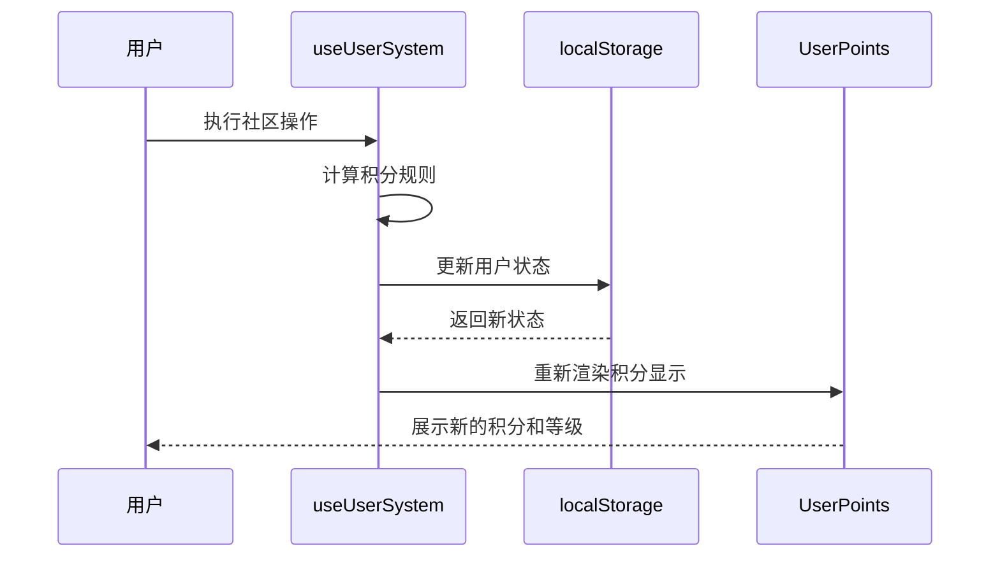
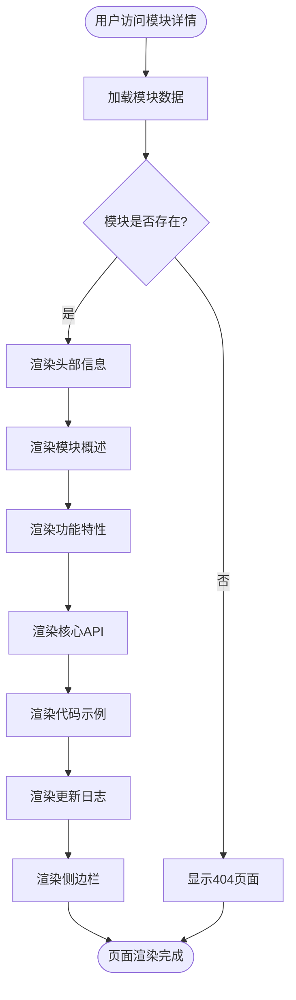
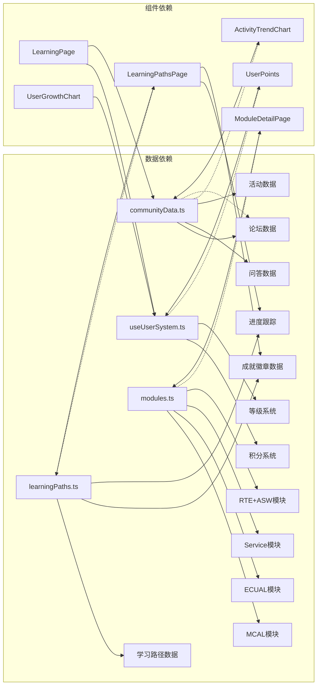

# 学习平台概览

<cite>
**本文档引用的文件**
- [README.md](file://README.md)
- [package.json](file://package.json)
- [App.tsx](file://src/App.tsx)
- [LearningPage.tsx](file://src/pages/LearningPage.tsx)
- [LearningPathsPage.tsx](file://src/pages/LearningPathsPage.tsx)
- [learningPaths.ts](file://src/data/learningPaths.ts)
- [modules.ts](file://src/data/modules.ts)
- [communityData.ts](file://src/data/communityData.ts)
- [UserPoints.tsx](file://src/components/UserPoints.tsx)
- [ActivityTrendChart.tsx](file://src/components/admin/ActivityTrendChart.tsx)
- [UserGrowthChart.tsx](file://src/components/admin/UserGrowthChart.tsx)
- [useUserSystem.ts](file://src/hooks/useUserSystem.ts)
- [ModuleDetailPage.tsx](file://src/pages/ModuleDetailPage.tsx)
- [Stats.tsx](file://src/components/Stats.tsx)
- [Features.tsx](file://src/components/Features.tsx)
- [HomePage.tsx](file://src/pages/HomePage.tsx)
- [Navbar.tsx](file://src/components/Navbar.tsx)
</cite>

## 更新摘要
**变更内容**
- 新增学习管理系统和学习路径功能模块
- 增强学习进度跟踪能力和成就徽章系统
- 完善三条系统化学习路径的设计和实现
- 新增学习统计和进度可视化功能

## 目录
1. [简介](#简介)
2. [项目结构](#项目结构)
3. [核心组件](#核心组件)
4. [架构总览](#架构总览)
5. [详细组件分析](#详细组件分析)
6. [依赖关系分析](#依赖关系分析)
7. [性能考虑](#性能考虑)
8. [故障排除指南](#故障排除指南)
9. [结论](#结论)
10. [附录](#附录)

## 简介
YuleTech 社区学习平台是一个面向 AutoSAR 基础软件工程师的系统化学习生态，提供从入门到专家的完整成长路径。平台通过四大核心能力构建：开源代码、开发工具链、学习成长、硬件开发板，形成"理论-实践-验证"的闭环学习体验。

平台采用 React 19 + TypeScript + Vite 7 + Tailwind CSS 4 技术栈，结合 Recharts 实现数据可视化，为 AutoSAR BSW 开发者、汽车电子工程师、芯片厂商和高校研究人员提供一站式技术社区平台。

**更新** 新增学习管理系统，提供三条完整的 AutoSAR 学习路径，包括入门、进阶和专家三个层级，支持学习进度跟踪和成就徽章系统。

## 项目结构
项目采用模块化组织方式，主要目录结构如下：



**图表来源**
- [App.tsx:1-139](file://src/App.tsx#L1-L139)
- [HomePage.tsx:15-87](file://src/pages/HomePage.tsx#L15-L87)
- [LearningPage.tsx:193-403](file://src/pages/LearningPage.tsx#L193-L403)
- [LearningPathsPage.tsx:1-301](file://src/pages/LearningPathsPage.tsx#L1-L301)

**章节来源**
- [README.md:20-46](file://README.md#L20-L46)
- [package.json:1-46](file://package.json#L1-L46)

## 核心组件
学习平台的核心组件围绕 AutoSAR BSW 工程师的成长需求设计，主要包括：

### 学习管理系统
平台新增了完整的学习管理系统，提供三条系统化学习路径：

#### 入门路径 - AutoSAR BSW 入门
- **学习时长**：20 小时
- **包含内容**：AutoSAR 简介与架构概述、BSW 分层架构详解、MCAL 层基础概念、ECUAL 层接口介绍、入门知识测试、Hello AutoSAR 实践
- **学习类型**：视频课程、文章阅读、在线测试、实践项目
- **成就徽章**：🌱 起步者

#### 进阶路径 - MCAL 驱动开发
- **学习时长**：40 小时  
- **包含内容**：MCAL 规范解读、Port 驱动开发实战、DIO 与中断处理、CAN 控制器配置、SPI 通信协议实现、ADC 采样与 DMA、MCAL 驱动测试
- **学习类型**：视频课程、实践项目、在线测试
- **成就徽章**：🔧 驱动开发者

#### 专家路径 - 系统集成与调试
- **学习时长**：60 小时
- **包含内容**：系统集成架构设计、调试技巧与工具链、JTAG 调试实战、性能分析与优化、内存管理与优化、错误处理与诊断、高级调试案例分析、系统集成综合测试
- **学习类型**：视频课程、文章阅读、实践项目、在线测试
- **成就徽章**：🚀 系统集成专家

### 学习路径功能特性
- **进度跟踪**：基于 localStorage 的学习进度保存和恢复
- **可视化展示**：进度条、完成状态、学习时长统计
- **成就系统**：5 种不同类型的徽章奖励
- **学习统计**：累计学习时间、已完成路径数、进行中路径数

### 课程分类体系
课程内容按照学习难度和实践层次分为四个类别：
- **教程类**：AutoSAR 规范解读、MCAL 驱动开发实战
- **视频课程**：工具链实操、通信协议栈解析
- **实战项目**：开发板入门、控制器全栈开发
- **专家问答**：FAQ 解答、直播回放、1对1咨询

### 用户激励机制
平台通过积分系统和等级制度激励用户参与：
- 发帖：+10 积分
- 回复：+5 积分  
- 专家回答：+15 积分
- 回答被采纳：+50 积分
- 参加活动：+20 积分

**章节来源**
- [LearningPathsPage.tsx:20-141](file://src/pages/LearningPathsPage.tsx#L20-L141)
- [learningPaths.ts:20-141](file://src/data/learningPaths.ts#L20-L141)
- [LearningPage.tsx:172-191](file://src/pages/LearningPage.tsx#L172-L191)
- [LearningPage.tsx:21-170](file://src/pages/LearningPage.tsx#L21-L170)
- [useUserSystem.ts:20-26](file://src/hooks/useUserSystem.ts#L20-L26)

## 架构总览
学习平台采用前后端分离的单页应用架构，通过 React Router 实现客户端路由，使用 React Suspense 实现代码分割和懒加载。

```mermaid
graph TB
subgraph "前端架构"
CLIENT[React 19 应用]
ROUTER[React Router DOM]
LAYOUT[Shell Layout]
COMPONENTS[业务组件]
LEARNINGPATHS[学习管理系统]
END
subgraph "数据层"
LOCAL[localStorage]
API[社区数据]
MODULE[模块数据]
LEARNINGDATA[学习路径数据]
END
subgraph "可视化"
RECHARTS[Recharts]
ICONS[Lucide Icons]
THEME[Tailwind CSS]
FRAMERMOTION[Framer Motion]
END
CLIENT --> ROUTER
CLIENT --> LAYOUT
CLIENT --> COMPONENTS
CLIENT --> LEARNINGPATHS
COMPONENTS --> LOCAL
COMPONENTS --> API
COMPONENTS --> MODULE
LEARNINGPATHS --> LEARNINGDATA
COMPONENTS --> RECHARTS
COMPONENTS --> ICONS
COMPONENTS --> THEME
LEARNINGPATHS --> FRAMERMOTION
```

**图表来源**
- [App.tsx:1-139](file://src/App.tsx#L1-L139)
- [package.json:12-26](file://package.json#L12-L26)
- [LearningPathsPage.tsx:1-301](file://src/pages/LearningPathsPage.tsx#L1-L301)

## 详细组件分析

### 学习路径页面组件分析
学习路径页面是平台新增的核心组件，实现了完整的系统化学习路径展示和进度跟踪功能。



**图表来源**
- [LearningPathsPage.tsx:31-301](file://src/pages/LearningPathsPage.tsx#L31-L301)
- [learningPaths.ts:9-18](file://src/data/learningPaths.ts#L9-L18)

学习路径页面的主要功能包括：
1. **学习路径展示**：三个层级的学习路径，每个路径包含具体的技能步骤
2. **进度跟踪**：实时显示学习进度百分比和完成状态
3. **统计面板**：累计学习时间、已完成路径数、进行中路径数
4. **成就徽章**：展示可获得的徽章和解锁条件
5. **响应式布局**：适配移动端和桌面端的不同显示效果

### 学习管理系统分析
学习管理系统是平台的核心功能模块，通过数据层实现学习路径的持久化存储和状态管理。



**图表来源**
- [LearningPathsPage.tsx:34-47](file://src/pages/LearningPathsPage.tsx#L34-L47)
- [learningPaths.ts:115-141](file://src/data/learningPaths.ts#L115-L141)

学习管理系统的特性：
- **进度持久化**：使用 localStorage 保存学习进度
- **状态管理**：实时计算和显示学习进度
- **统计功能**：累计学习时间和路径完成情况
- **条件判断**：根据完成度解锁徽章和成就

### 用户积分系统分析
用户积分系统是平台激励机制的核心，通过钩子函数实现状态管理和本地持久化。



**图表来源**
- [useUserSystem.ts:91-132](file://src/hooks/useUserSystem.ts#L91-L132)
- [UserPoints.tsx:8-81](file://src/components/UserPoints.tsx#L8-L81)

积分系统的特性：
- **可配置规则**：支持通过 localStorage 自定义积分规则
- **等级阈值**：支持自定义等级阈值配置
- **历史记录**：完整记录用户的积分获取历史
- **实时计算**：根据当前积分计算等级进度条

### 模块详情页面分析
模块详情页面展示了 AutoSAR BSW 各个模块的详细信息，支持 MCAL、ECUAL、Service、RTE + ASW 四个层级。



**图表来源**
- [ModuleDetailPage.tsx:36-56](file://src/pages/ModuleDetailPage.tsx#L36-L56)
- [ModuleDetailPage.tsx:125-227](file://src/pages/ModuleDetailPage.tsx#L125-L227)

模块详情页面包含以下内容：
- **模块基本信息**：名称、状态、星级、版本、层级
- **功能特性列表**：模块支持的所有功能特性
- **核心API表格**：详细的函数签名和说明
- **代码示例**：实际使用的代码片段
- **配置参数**：模块的配置选项和默认值
- **依赖关系**：模块间的依赖关系图

**章节来源**
- [LearningPathsPage.tsx:1-301](file://src/pages/LearningPathsPage.tsx#L1-L301)
- [learningPaths.ts:1-142](file://src/data/learningPaths.ts#L1-L142)
- [UserPoints.tsx:1-81](file://src/components/UserPoints.tsx#L1-L81)
- [ModuleDetailPage.tsx:1-287](file://src/pages/ModuleDetailPage.tsx#L1-L287)

## 依赖关系分析
平台的依赖关系主要体现在数据流和组件间通信上：



**图表来源**
- [learningPaths.ts:1-142](file://src/data/learningPaths.ts#L1-L142)
- [communityData.ts:1-371](file://src/data/communityData.ts#L1-L371)
- [modules.ts:1-1205](file://src/data/modules.ts#L1-L1205)
- [useUserSystem.ts:1-135](file://src/hooks/useUserSystem.ts#L1-L135)

**章节来源**
- [package.json:12-26](file://package.json#L12-L26)
- [App.tsx:1-139](file://src/App.tsx#L1-L139)

## 性能考虑
平台在性能优化方面采用了多项策略：

### 代码分割与懒加载
- 使用 React.lazy 和 Suspense 实现页面级别的代码分割
- 按需加载大型组件如图表组件和学习路径页面
- 减少首屏加载时间和内存占用

### 本地存储优化
- 使用 localStorage 缓存用户状态和配置
- 避免重复的网络请求
- 支持离线状态下的基本功能

### 学习进度优化
- 使用 useMemo 优化学习统计计算
- 按需渲染学习路径详情
- 防抖处理进度更新操作

### 图表性能优化
- Recharts 组件按需渲染
- 使用 useMemo 优化数据计算
- 响应式容器自动适配屏幕尺寸

### 渲染优化
- Framer Motion 实现流畅的动画效果
- Intersection Observer 实现数字动画
- 防抖和节流处理滚动事件
- 条件渲染减少不必要的 DOM 更新

## 故障排除指南
针对学习平台可能遇到的问题提供解决方案：

### 学习路径不显示
**问题描述**：学习路径卡片不显示或显示异常
**解决方案**：
1. 检查浏览器控制台是否有 JavaScript 错误
2. 确认网络连接正常，能够访问静态资源
3. 清除浏览器缓存后重试
4. 检查浏览器是否启用了 JavaScript
5. 验证 localStorage 是否可用

### 学习进度无法保存
**问题描述**：完成学习步骤后进度不保存
**解决方案**：
1. 检查浏览器是否支持 localStorage
2. 确认没有启用无痕浏览模式
3. 清除相关的 localStorage 数据
4. 重启浏览器后重试
5. 检查浏览器隐私设置是否阻止了本地存储

### 课程筛选功能失效
**问题描述**：点击课程分类按钮无响应
**解决方案**：
1. 检查 React Router 是否正确初始化
2. 确认 useState hook 是否正常工作
3. 验证事件处理器绑定是否正确
4. 检查 CSS 样式是否影响了按钮点击区域

### 积分系统异常
**问题描述**：积分不更新或显示错误
**解决方案**：
1. 检查浏览器是否支持 localStorage
2. 清除相关的 localStorage 数据
3. 重启浏览器后重试
4. 检查自定义配置是否格式正确

### 模块详情页面空白
**问题描述**：访问模块详情页面显示空白
**解决方案**：
1. 检查模块 ID 是否正确
2. 确认模块数据是否存在于 modules.ts 中
3. 检查路由参数解析是否正确
4. 验证模块数据结构是否完整

**章节来源**
- [LearningPathsPage.tsx:1-301](file://src/pages/LearningPathsPage.tsx#L1-L301)
- [learningPaths.ts:115-141](file://src/data/learningPaths.ts#L115-L141)
- [UserPoints.tsx:1-81](file://src/components/UserPoints.tsx#L1-L81)
- [ModuleDetailPage.tsx:36-56](file://src/pages/ModuleDetailPage.tsx#L36-L56)

## 结论
YuleTech 社区学习平台通过系统化的学习路径设计、完善的课程分类体系和创新的用户激励机制，为 AutoSAR 基础软件工程师提供了从入门到专家的完整成长路径。平台采用现代化的技术栈和优秀的用户体验设计，不仅满足了工程师的学习需求，还营造了积极向上的社区学习氛围。

**更新** 新增的学习管理系统显著增强了平台的教育功能，通过三条系统化学习路径、进度跟踪机制和成就徽章系统，为用户提供了更加完整和个性化的学习体验。

平台的核心优势在于：
1. **系统化学习体验**：三条学习路径覆盖不同技能层级
2. **实践导向**：实战项目和工具链实操相结合
3. **进度可视化**：实时显示学习进度和统计信息
4. **成就激励**：徽章系统增强学习动力
5. **社区驱动**：积分系统和等级制度促进用户参与
6. **技术前沿**：紧跟 AutoSAR 标准和行业发展趋势
7. **用户体验**：响应式设计和流畅的交互体验

## 附录

### 使用指南
1. **新手入门**：从"AutoSAR BSW 入门"路径开始，完成基础概念学习
2. **技能提升**：根据工作需要选择相应的进阶课程
3. **专家之路**：深入研究架构设计和性能优化
4. **社区参与**：积极参与论坛讨论和问答互动
5. **实践验证**：通过实战项目巩固所学知识
6. **进度跟踪**：定期查看学习进度和统计信息
7. **成就收集**：完成学习目标获得相应徽章

### 最佳实践建议
1. **制定学习计划**：根据三条学习路径制定个人学习计划
2. **理论结合实践**：边学边练，及时动手实践
3. **积极参与社区**：多参与讨论，分享经验和解决问题
4. **循序渐进**：不要急于求成，打好基础很重要
5. **持续学习**：关注平台更新，跟上技术发展步伐
6. **记录学习成果**：利用进度跟踪功能记录学习历程
7. **设定学习目标**：通过成就徽章激励自己不断进步

### 技术特色
- **AutoSAR 标准兼容**：完全遵循 AutoSAR Classic Platform 4.x 规范
- **多芯片平台支持**：支持 NXP、瑞萨、英飞凌等主流芯片
- **开源透明**：所有代码和文档完全开源
- **社区驱动**：由社区成员共同维护和发展
- **持续演进**：定期更新内容和功能
- **个性化学习**：支持用户自定义学习进度和目标
- **成就系统**：通过徽章和积分激励用户持续学习