# 学习路径设计

<cite>
**本文档引用的文件**
- [README.md](file://README.md)
- [LearningPage.tsx](file://src/pages/LearningPage.tsx)
- [modules.ts](file://src/data/modules.ts)
- [BSWConfigurator.tsx](file://src/components/BSWConfigurator.tsx)
- [useUserSystem.ts](file://src/hooks/useUserSystem.ts)
- [useLocalStorage.ts](file://src/hooks/useLocalStorage.ts)
- [communityData.ts](file://src/data/communityData.ts)
- [ModuleDetailPage.tsx](file://src/pages/ModuleDetailPage.tsx)
- [ImageMarquee.tsx](file://src/components/ImageMarquee.tsx)
- [ProfilePage.tsx](file://src/pages/ProfilePage.tsx)
- [package.json](file://package.json)
</cite>

## 目录
1. [项目概述](#项目概述)
2. [学习路径架构设计](#学习路径架构设计)
3. [三套学习路径详解](#三套学习路径详解)
4. [知识体系架构](#知识体系架构)
5. [技能层级划分](#技能层级划分)
6. [学习顺序安排](#学习顺序安排)
7. [可视化展示设计](#可视化展示设计)
8. [进度跟踪机制](#进度跟踪机制)
9. [完成度评估标准](#完成度评估标准)
10. [个性化定制功能](#个性化定制功能)
11. [智能推荐算法](#智能推荐算法)
12. [学习效果分析](#学习效果分析)
13. [维护更新机制](#维护更新机制)
14. [用户反馈收集](#用户反馈收集)
15. [持续改进策略](#持续改进策略)
16. [适应性与灵活性](#适应性与灵活性)
17. [技术实现细节](#技术实现细节)
18. [总结](#总结)

## 项目概述

YuleTech社区是一个面向AutoSAR BSW开发者、汽车电子工程师、芯片厂商和高校研究人员的技术社区平台。该项目基于React 19 + TypeScript，采用现代化的前端技术栈，为用户提供系统化的AutoSAR学习路径和实践环境。

### 核心目标
- 为AutoSAR BSW开发者提供从入门到专家的完整学习路径
- 建立可视化的学习进度跟踪和评估体系
- 实现个性化的学习体验和智能推荐功能
- 构建持续改进的学习生态系统

**章节来源**
- [README.md:1-95](file://README.md#L1-L95)

## 学习路径架构设计

### 整体架构图

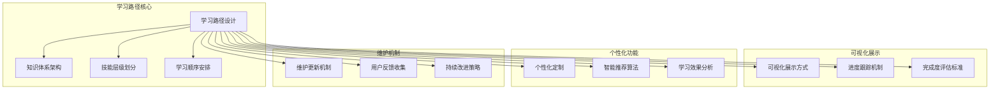

**图表来源**
- [LearningPage.tsx:172-191](file://src/pages/LearningPage.tsx#L172-L191)

### 学习路径设计理念

学习路径设计遵循以下核心原则：
- **渐进式学习**：从基础概念到高级应用的自然递进
- **实践导向**：理论与实践相结合的学习模式
- **个性化定制**：适应不同背景用户的学习需求
- **持续评估**：实时跟踪学习进度和效果

## 三套学习路径详解

### AutoSAR入门路线

#### 路径设计思路
入门路线专注于建立AutoSAR基础概念和核心技能，为后续深入学习奠定坚实基础。

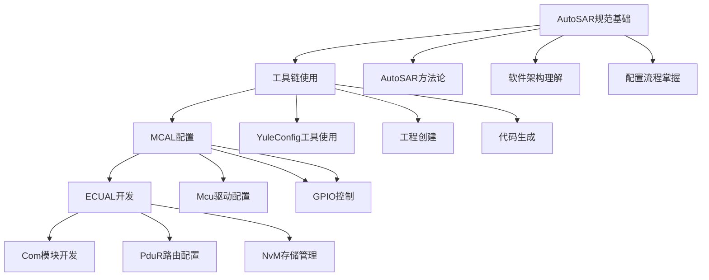

**图表来源**
- [LearningPage.tsx:172-178](file://src/pages/LearningPage.tsx#L172-L178)

#### 实施策略
- **循序渐进**：从概念理解到实践操作的逐步深入
- **理论结合实践**：每个概念都配有相应的代码示例和配置练习
- **基础扎实**：重点培养MCAL和ECUAL的基础开发能力

### AutoSAR进阶路线

#### 路径设计思路
进阶路线专注于提升复杂系统的开发能力和问题解决能力，涵盖通信、诊断、存储等核心领域。

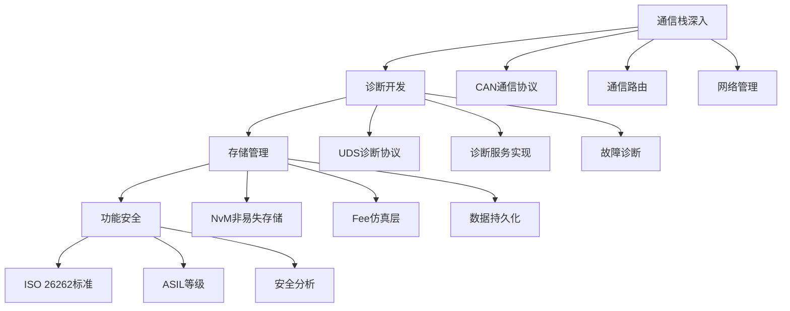

**图表来源**
- [LearningPage.tsx:180-184](file://src/pages/LearningPage.tsx#L180-L184)

#### 实施策略
- **深度学习**：深入理解各个模块的内部机制和实现原理
- **综合应用**：将多个模块组合应用于复杂场景
- **问题解决**：培养独立分析和解决复杂技术问题的能力

### AutoSAR专家路线

#### 路径设计思路
专家路线专注于架构设计和性能优化，培养系统级思维和技术创新能力。

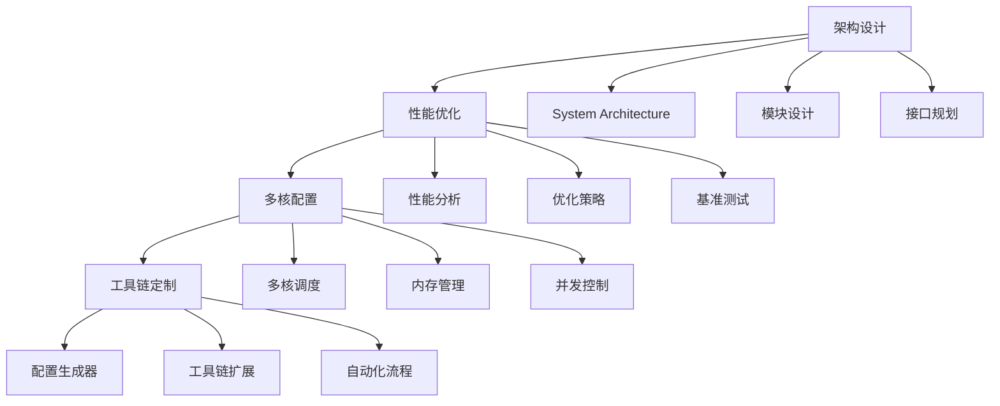

**图表来源**
- [LearningPage.tsx:186-190](file://src/pages/LearningPage.tsx#L186-L190)

#### 实施策略
- **系统思维**：从整体架构角度理解和优化系统性能
- **技术创新**：开发新的工具和方法来解决复杂问题
- **最佳实践**：总结和推广行业内的最佳实践

**章节来源**
- [LearningPage.tsx:172-191](file://src/pages/LearningPage.tsx#L172-L191)

## 知识体系架构

### AutoSAR四层架构

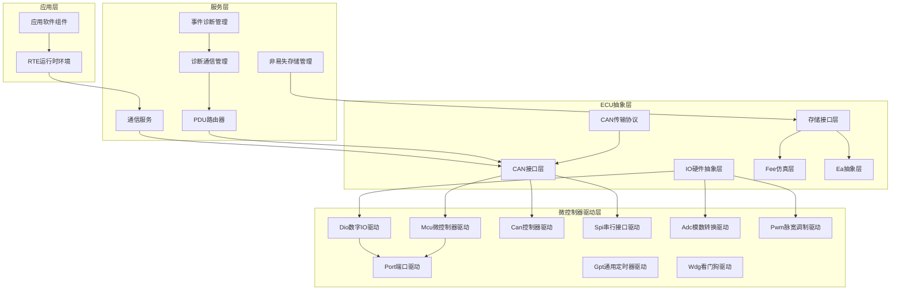

**图表来源**
- [modules.ts:34-522](file://src/data/modules.ts#L34-L522)

### 模块依赖关系

学习路径中的每个模块都有明确的依赖关系，确保学习的连贯性和完整性：

- **MCAL层**：作为最底层，为上层提供硬件抽象
- **ECUAL层**：连接MCAL和Service层，提供通信和存储抽象
- **Service层**：提供应用所需的通用服务
- **RTE层**：作为应用软件组件和底层硬件之间的桥梁

**章节来源**
- [modules.ts:34-522](file://src/data/modules.ts#L34-L522)

## 技能层级划分

### 技能层级设计

学习路径按照三个主要层级进行划分：

#### 入门层级 (Level 1)
- **目标**：理解AutoSAR基本概念和术语
- **技能**：掌握基础配置和简单开发
- **工具**：YuleConfig工具链基础使用
- **项目**：简单的MCAL驱动配置

#### 进阶层级 (Level 2)
- **目标**：能够独立开发复杂应用
- **技能**：掌握通信协议和诊断服务
- **工具**：完整的开发环境和调试工具
- **项目**：多模块集成的完整应用

#### 专家层级 (Level 3)
- **目标**：具备架构设计和性能优化能力
- **技能**：系统级思维和技术创新
- **工具**：自定义工具和自动化流程
- **项目**：大型复杂系统的架构设计

### 技能评估标准

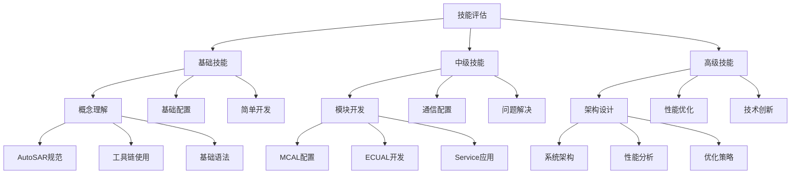

**图表来源**
- [useUserSystem.ts:49-89](file://src/hooks/useUserSystem.ts#L49-L89)

**章节来源**
- [useUserSystem.ts:49-89](file://src/hooks/useUserSystem.ts#L49-L89)

## 学习顺序安排

### 顺序设计原则

学习路径的顺序安排遵循以下原则：

1. **基础先行**：先掌握基础知识，再进行实践操作
2. **循序渐进**：从简单到复杂，从单一到综合
3. **理论实践结合**：每个理论概念都要有相应的实践练习
4. **前后呼应**：前面学的知识要为后面的学习打基础

### 具体学习顺序

#### 第一阶段：基础概念 (4-6周)
- AutoSAR规范和架构理解
- YuleConfig工具链使用
- 基础开发环境搭建

#### 第二阶段：核心模块 (8-12周)
- MCAL层驱动开发
- ECUAL层通信配置
- Service层服务应用

#### 第三阶段：综合应用 (6-8周)
- 多模块集成开发
- 复杂应用场景实现
- 性能优化和调试

#### 第四阶段：架构设计 (4-6周)
- 系统架构设计
- 性能分析和优化
- 技术创新和改进

**章节来源**
- [LearningPage.tsx:172-191](file://src/pages/LearningPage.tsx#L172-L191)

## 可视化展示设计

### 学习路径可视化

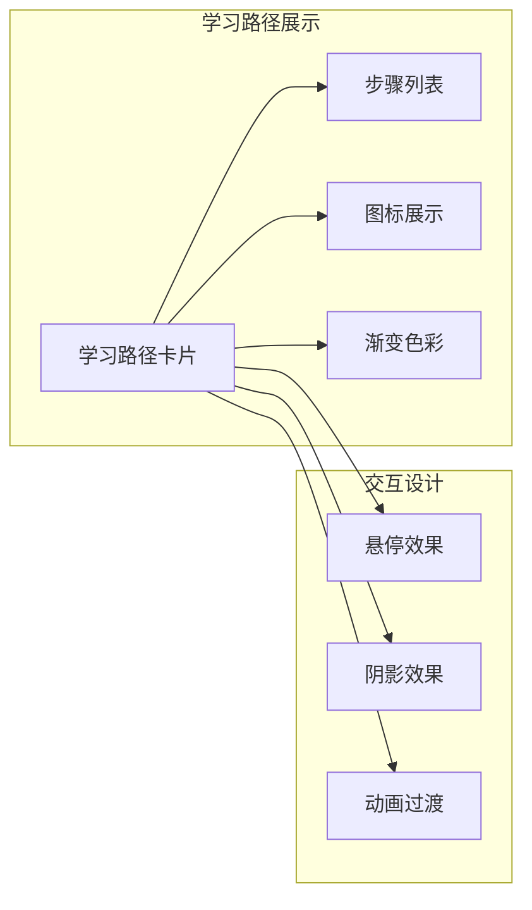

**图表来源**
- [LearningPage.tsx:270-296](file://src/pages/LearningPage.tsx#L270-L296)

### 课程分类展示

学习路径页面提供了多种课程分类，每种分类都有独特的视觉标识：

- **教程类**：蓝色主题，适合系统性学习
- **视频课程**：青绿色主题，适合直观学习
- **实战项目**：青绿色主题，注重实践能力
- **专家问答**：绿色主题，解决疑难问题

### 进度可视化

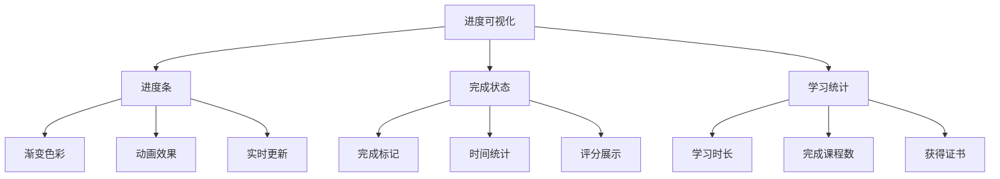

**图表来源**
- [ImageMarquee.tsx:191-214](file://src/components/ImageMarquee.tsx#L191-L214)

**章节来源**
- [LearningPage.tsx:270-296](file://src/pages/LearningPage.tsx#L270-L296)
- [ImageMarquee.tsx:191-214](file://src/components/ImageMarquee.tsx#L191-L214)

## 进度跟踪机制

### 用户积分系统

学习路径建立了完善的积分和等级系统，激励用户持续学习：

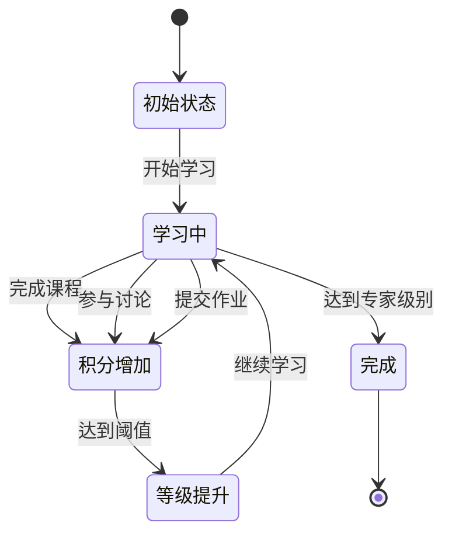

**图表来源**
- [useUserSystem.ts:81-89](file://src/hooks/useUserSystem.ts#L81-L89)

### 进度跟踪功能

系统提供了多种进度跟踪方式：

1. **课程进度**：实时显示每个课程的学习进度
2. **完成状态**：标记已完成的课程和模块
3. **学习统计**：统计学习时长、完成课程数等数据
4. **成就系统**：通过积分和等级激励学习

### 数据存储机制

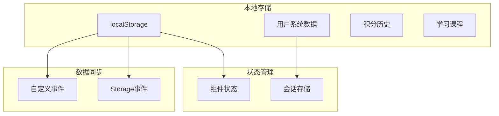

**图表来源**
- [useLocalStorage.ts:1-60](file://src/hooks/useLocalStorage.ts#L1-L60)

**章节来源**
- [useUserSystem.ts:81-89](file://src/hooks/useUserSystem.ts#L81-L89)
- [useLocalStorage.ts:1-60](file://src/hooks/useLocalStorage.ts#L1-L60)

## 完成度评估标准

### 评估维度

学习完成度评估包含以下维度：

#### 知识掌握程度
- **理论理解**：对AutoSAR概念和原理的掌握
- **实践能力**：实际编程和配置能力
- **问题解决**：独立分析和解决问题的能力

#### 技能应用水平
- **基础技能**：MCAL和ECUAL的基础开发能力
- **综合技能**：多模块集成开发能力
- **高级技能**：架构设计和性能优化能力

#### 学习成果质量
- **项目完成度**：实际项目的完成质量和复杂度
- **代码质量**：代码规范和可维护性
- **创新程度**：技术创新和改进能力

### 评估标准

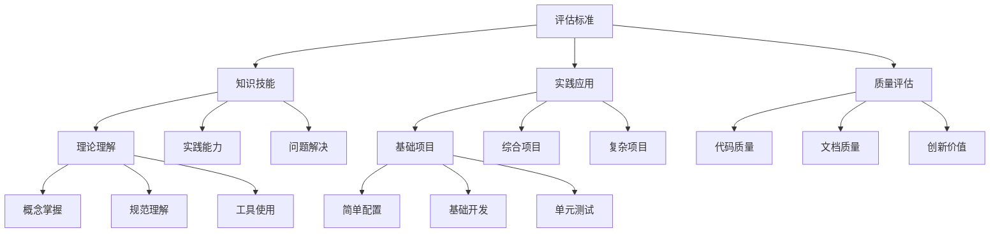

**图表来源**
- [ProfilePage.tsx:292-322](file://src/pages/ProfilePage.tsx#L292-L322)

**章节来源**
- [ProfilePage.tsx:292-322](file://src/pages/ProfilePage.tsx#L292-L322)

## 个性化定制功能

### 用户画像系统

学习路径支持根据用户的不同背景和需求进行个性化定制：

#### 用户类型识别
- **初学者**：零基础或少量经验的开发者
- **工程师**：有一定经验的汽车电子工程师
- **架构师**：需要系统架构设计能力的专家
- **教育工作者**：需要教学和培训资源的教师

#### 学习偏好设置
- **学习风格**：理论学习 vs 实践操作
- **学习节奏**：快节奏 vs 慢节奏
- **技术偏好**：特定的通信协议或开发工具
- **应用场景**：特定的汽车电子应用领域

### 个性化学习路径

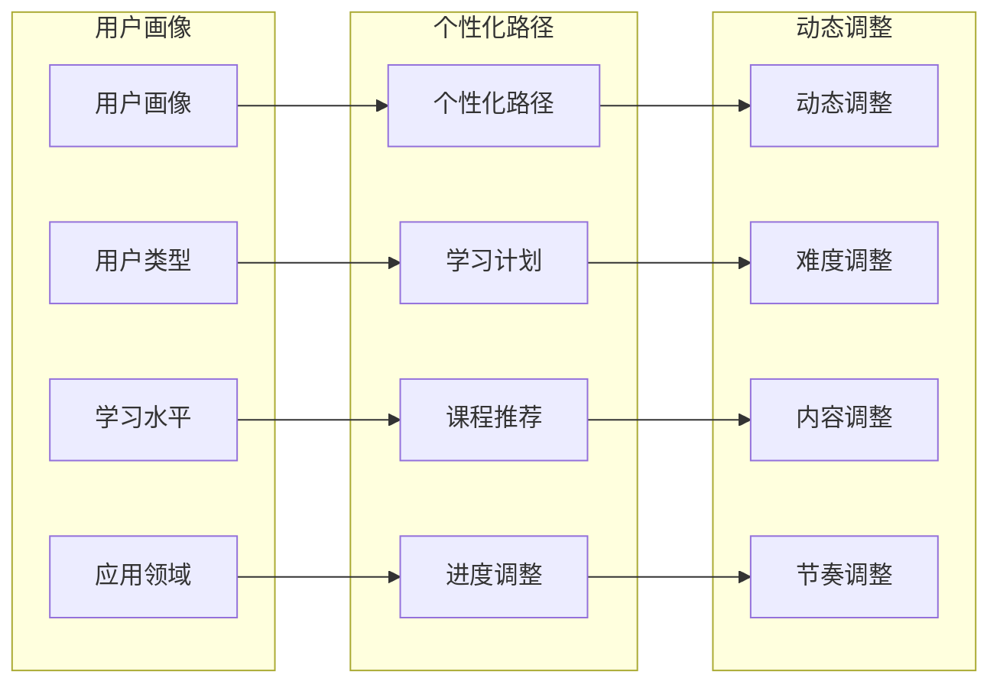

**图表来源**
- [useUserSystem.ts:91-132](file://src/hooks/useUserSystem.ts#L91-L132)

### 自适应学习内容

系统能够根据用户的学习进度和表现自动调整学习内容：

- **难度自适应**：根据用户表现调整课程难度
- **内容自适应**：推荐用户可能感兴趣的学习内容
- **节奏自适应**：调整学习进度和复习频率

**章节来源**
- [useUserSystem.ts:91-132](file://src/hooks/useUserSystem.ts#L91-L132)

## 智能推荐算法

### 推荐算法设计

学习路径采用了多种智能推荐算法来优化用户体验：

#### 协同过滤算法
基于相似用户的行为模式推荐相关内容：
- **用户相似度计算**：分析用户的学习历史和偏好
- **内容相似度分析**：分析课程内容的关联性
- **推荐结果生成**：生成个性化的学习内容推荐

#### 内容过滤算法
基于用户画像和课程特征进行匹配：
- **特征提取**：提取用户和课程的特征向量
- **相似度计算**：计算用户与课程的匹配度
- **排序优化**：对推荐结果进行排序和优化

#### 混合推荐算法
结合多种推荐策略的优势：
- **权重分配**：为不同推荐算法分配合适的权重
- **结果融合**：将多种推荐结果进行融合
- **效果评估**：评估混合推荐的效果并进行优化

### 推荐系统架构

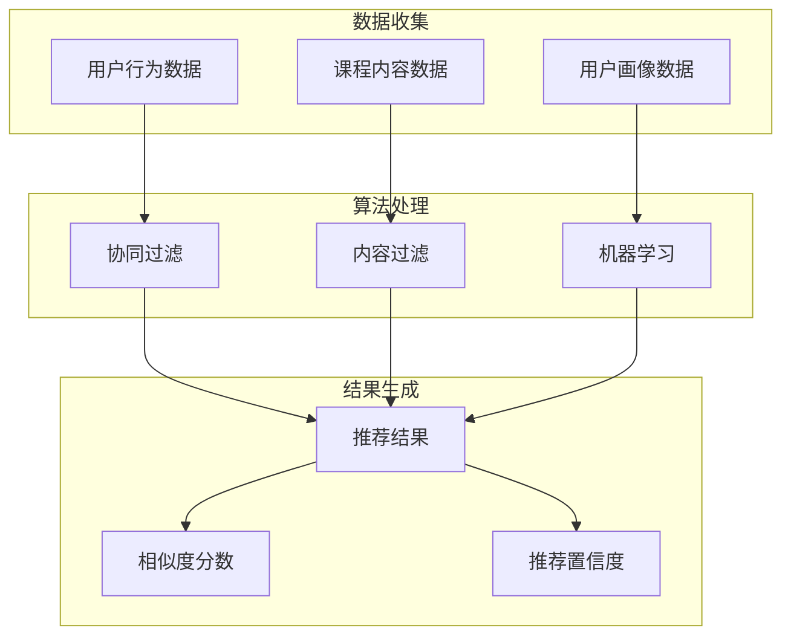

**图表来源**
- [modules.ts:15-32](file://src/data/modules.ts#L15-L32)

### 实时学习分析

系统能够实时分析用户的学习行为并提供即时反馈：

- **学习行为追踪**：记录用户的学习时间和内容
- **理解程度评估**：通过测试和作业评估学习效果
- **学习路径优化**：根据评估结果调整学习计划

**章节来源**
- [modules.ts:15-32](file://src/data/modules.ts#L15-L32)

## 学习效果分析

### 多维度分析指标

学习效果分析系统提供了全面的学习效果评估：

#### 学习行为分析
- **学习时长统计**：用户在不同课程上的学习时间
- **学习频率分析**：用户的学习活跃度和规律性
- **学习路径分析**：用户选择的学习路径和顺序

#### 学习成果分析
- **知识掌握度**：通过测试和作业评估知识掌握情况
- **技能应用能力**：评估用户解决实际问题的能力
- **学习效率**：分析用户的学习速度和效率

#### 学习满意度分析
- **课程评价**：用户对课程内容和质量的评价
- **学习体验**：用户对学习过程的满意度
- **平台使用**：用户对学习平台功能的使用情况

### 数据可视化展示

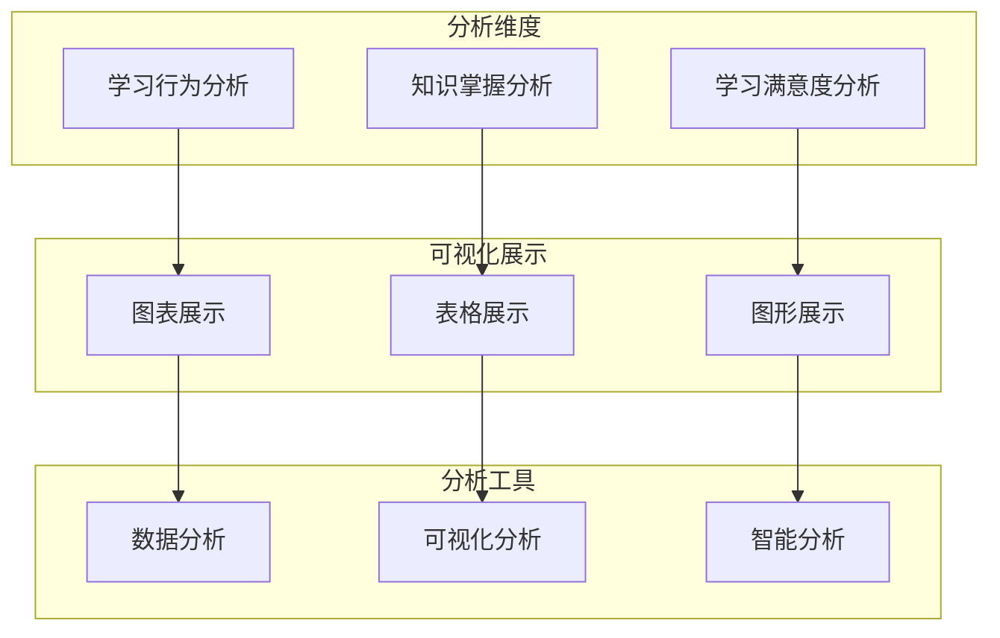

**图表来源**
- [communityData.ts:1-371](file://src/data/communityData.ts#L1-L371)

### 学习效果评估模型

系统采用多层次的评估模型来全面评估学习效果：

- **短期评估**：通过测试和作业评估即时学习效果
- **中期评估**：通过项目完成度评估综合应用能力
- **长期评估**：通过实际工作表现评估学习成果

**章节来源**
- [communityData.ts:1-371](file://src/data/communityData.ts#L1-L371)

## 维护更新机制

### 内容更新流程

学习路径的内容维护采用严格的更新流程：

#### 内容审核机制
- **专家审核**：由AutoSAR专家审核新内容的质量
- **同行评议**：通过社区评议确保内容的准确性
- **质量标准**：建立内容质量评估标准和流程

#### 版本管理机制
- **版本控制**：使用Git进行内容版本管理
- **变更追踪**：记录每次内容更新的详细信息
- **回滚机制**：确保出现问题时能够快速回滚

#### 更新发布流程
- **测试验证**：新内容在正式发布前进行充分测试
- **用户反馈**：收集用户对新内容的反馈意见
- **持续改进**：根据反馈不断优化内容质量

### 技术更新维护

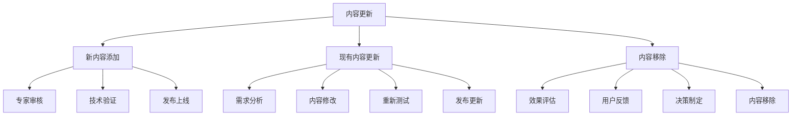

**图表来源**
- [modules.ts:34-522](file://src/data/modules.ts#L34-L522)

### 社区参与机制

学习路径鼓励社区用户参与内容维护：

- **贡献机制**：建立用户贡献内容的激励机制
- **协作平台**：提供内容协作和讨论的平台
- **质量保障**：通过社区监督确保内容质量

**章节来源**
- [modules.ts:34-522](file://src/data/modules.ts#L34-L522)

## 用户反馈收集

### 多渠道反馈收集

系统建立了完善的用户反馈收集机制：

#### 直接反馈渠道
- **在线评价**：用户可以直接对课程内容进行评价
- **问题反馈**：用户可以报告学习过程中遇到的问题
- **建议提交**：用户可以提交改进建议和新想法

#### 间接反馈分析
- **行为分析**：通过用户行为数据分析学习效果
- **使用统计**：分析用户对不同功能的使用情况
- **参与度监测**：监测用户参与社区活动的积极性

#### 主动调研机制
- **定期调查**：定期向用户发送满意度调查
- **焦点小组**：组织用户代表进行深度访谈
- **专家咨询**：邀请行业专家提供专业意见

### 反馈处理流程

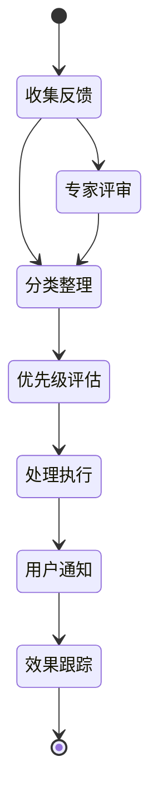

**图表来源**
- [communityData.ts:218-296](file://src/data/communityData.ts#L218-L296)

### 反馈响应机制

系统建立了快速响应用户反馈的机制：

- **响应时间**：设定不同类型的反馈响应时间标准
- **处理流程**：建立标准化的反馈处理流程
- **结果反馈**：及时向用户反馈处理结果和改进措施

**章节来源**
- [communityData.ts:218-296](file://src/data/communityData.ts#L218-L296)

## 持续改进策略

### 数据驱动改进

学习路径采用数据驱动的方法进行持续改进：

#### 学习效果分析
- **学习路径优化**：通过分析用户的学习路径选择优化课程顺序
- **内容质量评估**：通过用户评价和测试结果评估内容质量
- **学习效率分析**：分析不同学习策略的效果并进行优化

#### 用户体验优化
- **界面友好性**：通过用户行为分析优化界面设计
- **功能实用性**：通过使用统计分析优化功能设计
- **交互流畅性**：通过性能监控优化交互体验

#### 技术架构升级
- **性能优化**：通过性能分析持续优化系统性能
- **可扩展性**：通过负载分析优化系统架构
- **安全性**：通过安全审计持续改进系统安全

### 迭代改进机制

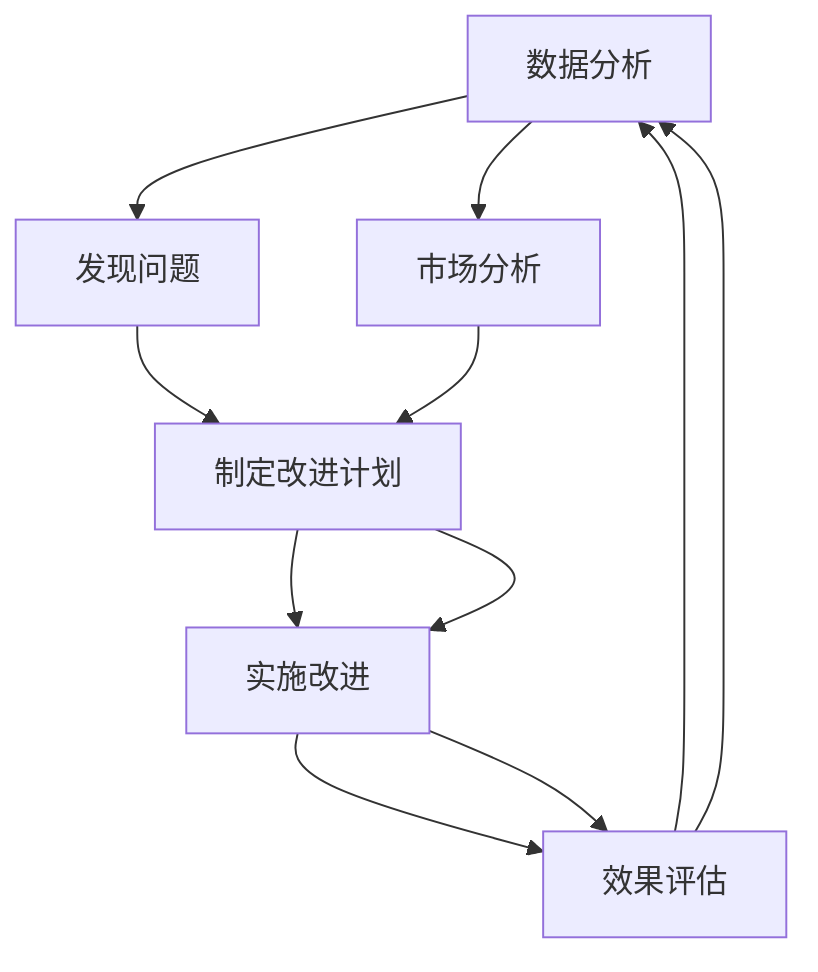

**图表来源**
- [useUserSystem.ts:36-47](file://src/hooks/useUserSystem.ts#L36-L47)

### 最佳实践推广

系统建立了推广最佳实践的机制：

- **案例收集**：收集优秀的学习案例和实践经验
- **经验总结**：总结成功的经验和失败的教训
- **知识分享**：通过社区平台分享最佳实践

**章节来源**
- [useUserSystem.ts:36-47](file://src/hooks/useUserSystem.ts#L36-L47)

## 适应性与灵活性

### 多背景用户适应性

学习路径针对不同背景的用户提供了高度的适应性：

#### 技术背景适应
- **零基础用户**：提供详细的入门指导和基础概念解释
- **有经验用户**：提供高级主题和深入的技术细节
- **转行用户**：提供跨领域的知识衔接和过渡指导

#### 学习习惯适应
- **快节奏学习**：提供紧凑的学习计划和高效的学习方法
- **慢节奏学习**：提供宽松的学习计划和充分的练习时间
- **碎片化学习**：提供短时高效的学习内容和移动学习支持

#### 应用场景适应
- **学术研究**：提供理论研究和实验验证的支持
- **工业应用**：提供实际项目和工程实践的指导
- **教育培训**：提供教学大纲和课程设计的资源

### 灵活调整能力

学习路径具备强大的灵活调整能力：

#### 动态课程调整
- **难度调整**：根据用户水平动态调整课程难度
- **内容调整**：根据用户需求调整学习内容
- **进度调整**：根据用户时间安排调整学习进度

#### 个性化学习支持
- **学习计划定制**：为每个用户制定个性化的学习计划
- **学习资源推荐**：根据用户兴趣推荐相关学习资源
- **学习伙伴匹配**：为用户匹配合适的学习伙伴

#### 多平台支持
- **Web端学习**：提供完整的Web端学习体验
- **移动端学习**：支持手机和平板等移动设备学习
- **离线学习**：提供离线学习包和离线学习支持

**章节来源**
- [LearningPage.tsx:193-404](file://src/pages/LearningPage.tsx#L193-L404)

## 技术实现细节

### 核心技术架构

学习路径采用现代化的技术架构实现：

#### 前端技术栈
- **React 19**：使用最新的React版本提供高性能的用户界面
- **TypeScript**：提供类型安全和更好的开发体验
- **Tailwind CSS**：提供灵活的样式定制和响应式设计
- **Lucide React**：提供丰富的图标库支持

#### 状态管理
- **React Hooks**：使用现代的React状态管理模式
- **本地存储**：使用localStorage实现数据持久化
- **自定义Hook**：封装复杂的业务逻辑和状态管理

#### 数据管理
- **模块化数据结构**：使用模块化的数据结构管理学习内容
- **类型安全的数据访问**：通过TypeScript确保数据访问的安全性
- **数据验证机制**：建立数据验证和错误处理机制

### 关键组件设计

#### 学习路径组件
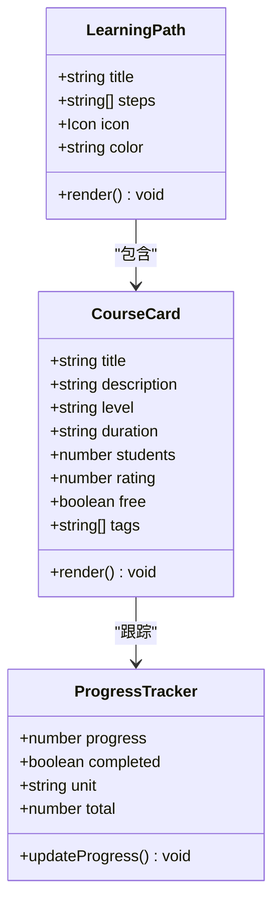

**图表来源**
- [LearningPage.tsx:172-191](file://src/pages/LearningPage.tsx#L172-L191)

#### 用户系统组件
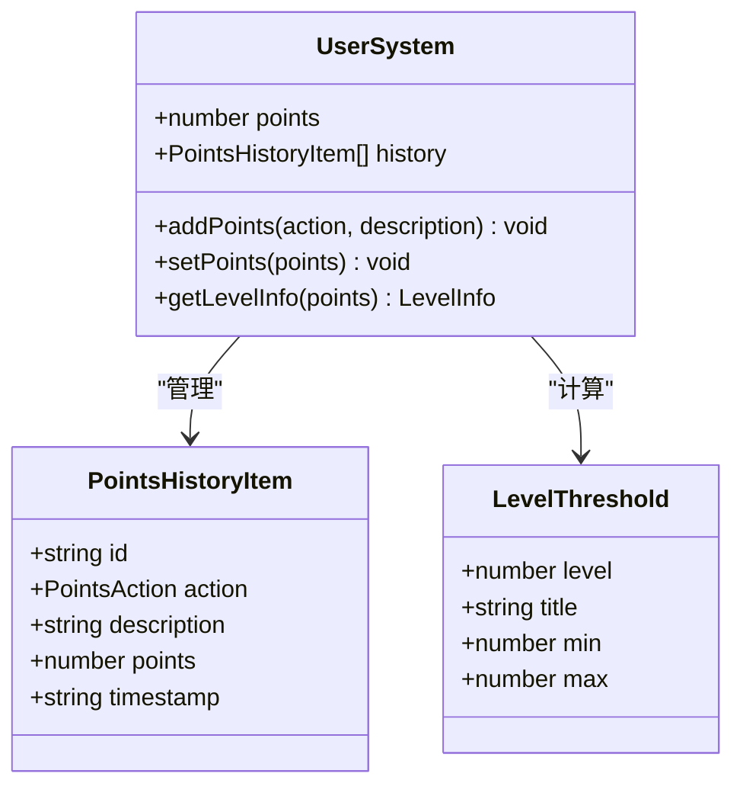

**图表来源**
- [useUserSystem.ts:15-89](file://src/hooks/useUserSystem.ts#L15-L89)

### 数据结构设计

学习路径使用精心设计的数据结构来管理学习内容：

#### 模块数据结构
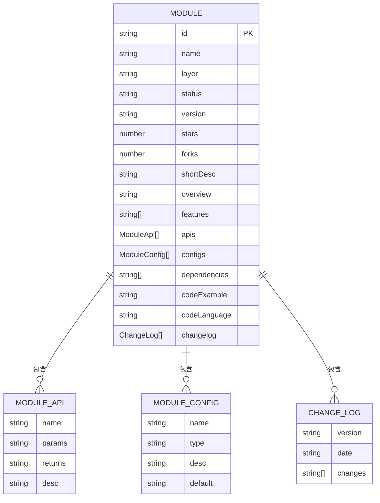

**图表来源**
- [modules.ts:1-32](file://src/data/modules.ts#L1-L32)

**章节来源**
- [LearningPage.tsx:172-191](file://src/pages/LearningPage.tsx#L172-L191)
- [useUserSystem.ts:15-89](file://src/hooks/useUserSystem.ts#L15-L89)
- [modules.ts:1-32](file://src/data/modules.ts#L1-L32)

## 总结

YuleTech社区学习路径设计是一个全面、系统且高度实用的教育平台。通过三套完整的学习路径（入门、进阶、专家），为不同背景和水平的用户提供了清晰的学习方向和实践机会。

### 核心优势

1. **完整的知识体系**：基于AutoSAR四层架构的系统化知识结构
2. **渐进式学习设计**：从基础到高级的自然学习曲线
3. **实践导向**：理论与实践相结合的学习模式
4. **个性化定制**：适应不同用户需求的灵活学习路径
5. **智能化推荐**：基于用户行为的智能内容推荐
6. **完善的评估体系**：多维度的学习效果评估机制

### 技术特色

- **现代化技术栈**：React 19 + TypeScript + Tailwind CSS
- **响应式设计**：支持多设备的学习体验
- **数据驱动**：基于用户行为的持续优化
- **社区协作**：开放的社区参与和贡献机制

### 应用价值

学习路径设计不仅适用于AutoSAR BSW开发者的技能培养，也为其他技术领域的在线学习平台提供了可借鉴的设计模式和实现方案。通过系统化的学习路径设计、智能化的推荐算法和完善的评估体系，为用户提供了高质量的学习体验和技术成长支持。