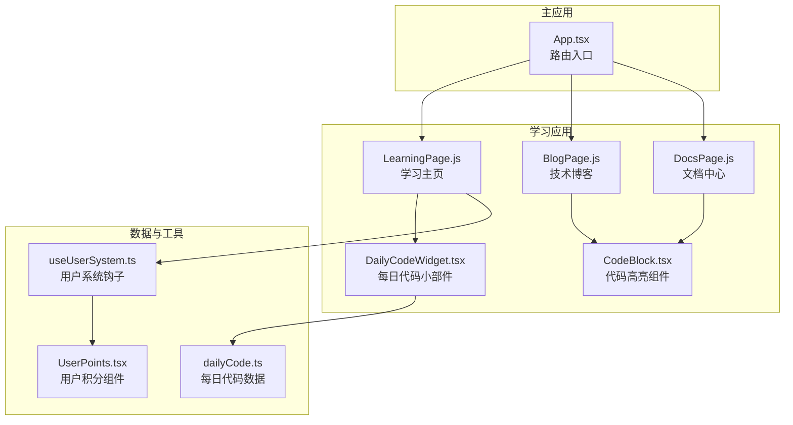
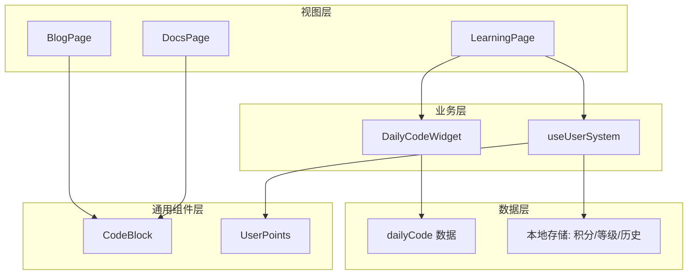
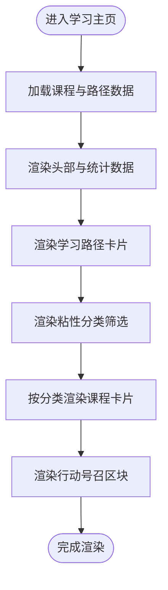
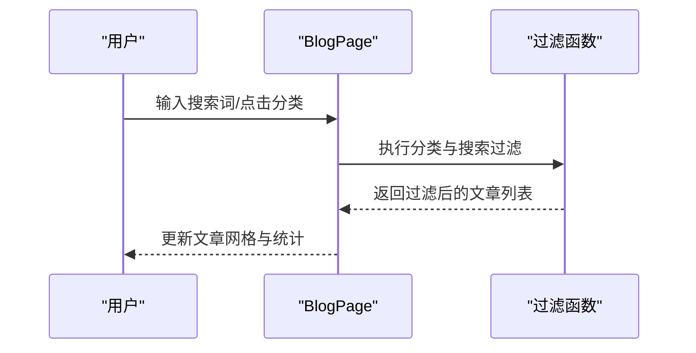
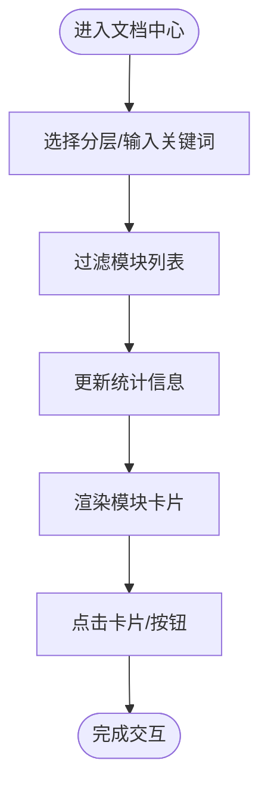
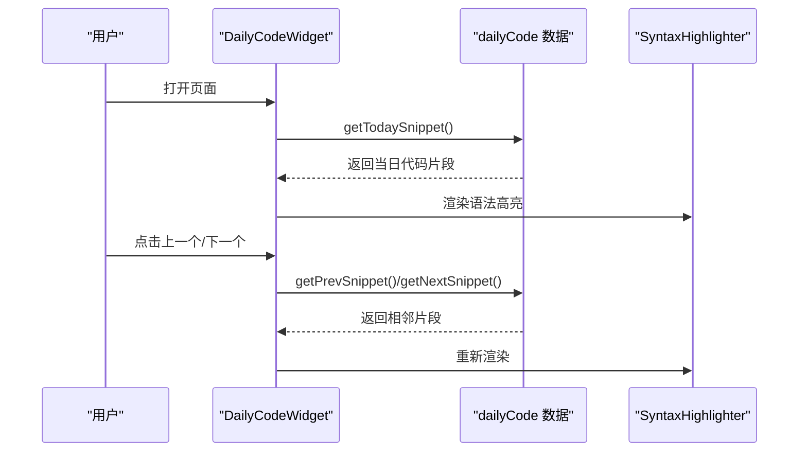
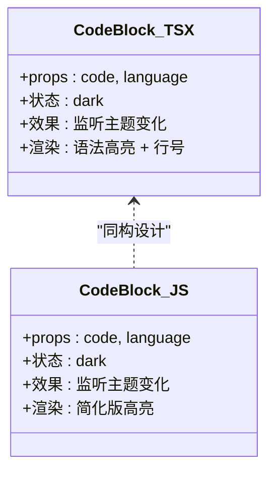
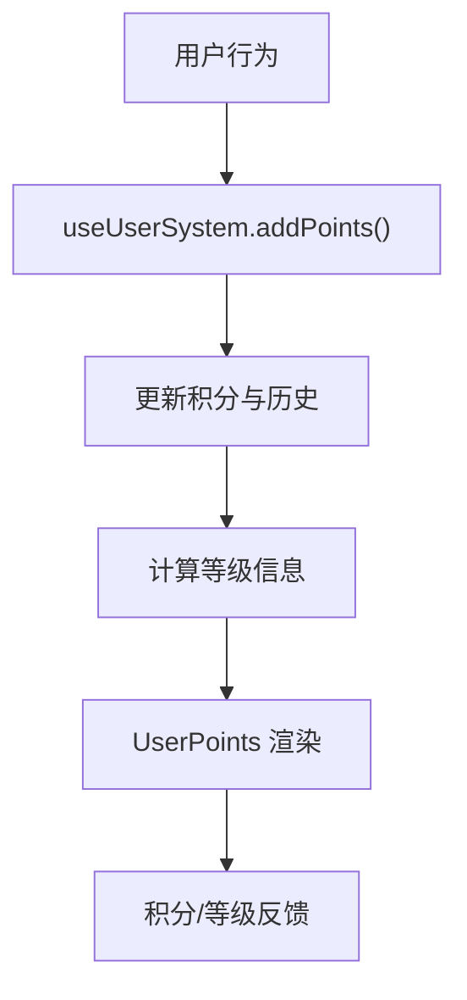
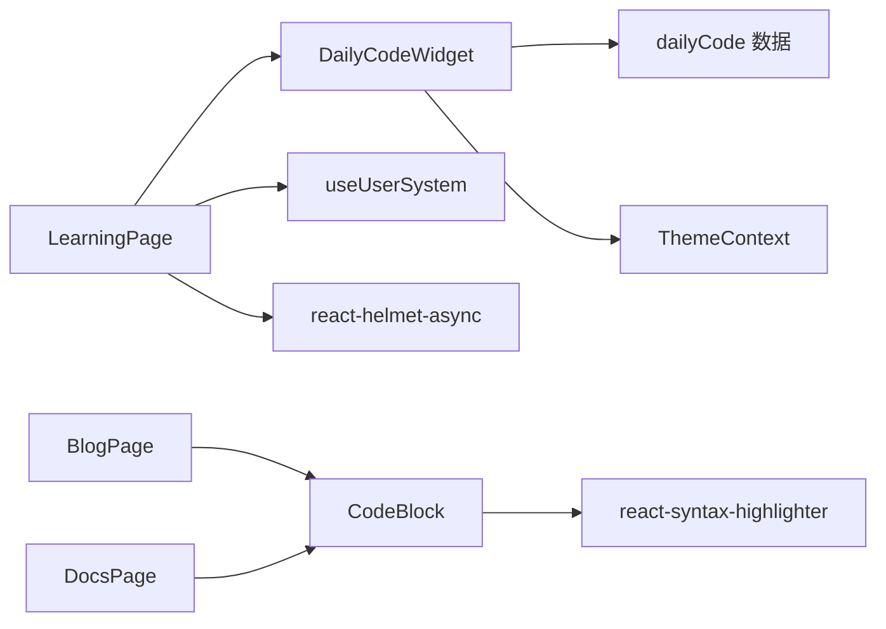

# 学习页面

<cite>
**本文引用的文件**
- [apps/learning/src/pages/LearningPage.js](file://apps/learning/src/pages/LearningPage.js)
- [apps/learning/src/pages/BlogPage.js](file://apps/learning/src/pages/BlogPage.js)
- [apps/learning/src/pages/DocsPage.js](file://apps/learning/src/pages/DocsPage.js)
- [src/components/DailyCodeWidget.tsx](file://src/components/DailyCodeWidget.tsx)
- [src/data/dailyCode.ts](file://src/data/dailyCode.ts)
- [src/components/CodeBlock.tsx](file://src/components/CodeBlock.tsx)
- [apps/community/src/components/CodeBlock.js](file://apps/community/src/components/CodeBlock.js)
- [src/hooks/useUserSystem.ts](file://src/hooks/useUserSystem.ts)
- [src/components/UserPoints.tsx](file://src/components/UserPoints.tsx)
- [src/App.tsx](file://src/App.tsx)
- [package.json](file://package.json)
- [README.md](file://README.md)
</cite>

## 目录
1. [简介](#简介)
2. [项目结构](#项目结构)
3. [核心组件](#核心组件)
4. [架构总览](#架构总览)
5. [详细组件分析](#详细组件分析)
6. [依赖关系分析](#依赖关系分析)
7. [性能考虑](#性能考虑)
8. [故障排查指南](#故障排查指南)
9. [结论](#结论)
10. [附录](#附录)

## 简介
本文件面向教育工作者与学习者，系统化梳理 YuleTech 社区技术平台“学习成长”页面的设计与实现，涵盖技术博客、文档中心、每日代码等学习资源的组织与展示；文档中心的分类检索与版本控制；每日代码的实现机制与语法高亮；学习路径与个性化推荐的可扩展设计；内容管理流程与多语言支持机制；学习进度跟踪与用户成就体系；以及性能优化与缓存策略。目标是帮助读者快速理解并高效使用该学习页面，同时为后续迭代提供参考。

## 项目结构
学习页面位于多应用架构下的独立子应用中，采用 React + TypeScript + Vite 构建，路由通过主应用集中管理。学习页面主要包含三类页面：学习主页、技术博客、文档中心；配套组件包括每日代码小部件、代码高亮组件、用户积分与等级组件等。

图示来源
- [apps/learning/src/pages/LearningPage.js:175-184](file://apps/learning/src/pages/LearningPage.js#L175-L184)
- [apps/learning/src/pages/BlogPage.js:109-124](file://apps/learning/src/pages/BlogPage.js#L109-L124)
- [apps/learning/src/pages/DocsPage.js:73-95](file://apps/learning/src/pages/DocsPage.js#L73-L95)
- [src/components/DailyCodeWidget.tsx:8-50](file://src/components/DailyCodeWidget.tsx#L8-L50)
- [src/data/dailyCode.ts:1-20](file://src/data/dailyCode.ts#L1-L20)
- [src/hooks/useUserSystem.ts:91-132](file://src/hooks/useUserSystem.ts#L91-L132)
- [src/components/UserPoints.tsx:8-51](file://src/components/UserPoints.tsx#L8-L51)
- [src/App.tsx:80-94](file://src/App.tsx#L80-L94)

章节来源
- [README.md:1-95](file://README.md#L1-L95)
- [package.json:1-46](file://package.json#L1-L46)
- [src/App.tsx:80-94](file://src/App.tsx#L80-L94)

## 核心组件
- 学习主页（LearningPage）
  - 展示学习路径、课程分类与筛选、统计数据与行动号召。
  - 关键点：分类标签、课程卡片、学习路径卡片、粘性筛选条。
- 技术博客（BlogPage）
  - 文章列表、分类筛选、搜索、热门标签、周热度榜单、编辑推荐。
  - 关键点：搜索过滤、分类过滤、标签点击、文章卡片信息。
- 文档中心（DocsPage）
  - 模块分层筛选、搜索、快速入口、进度统计、模块卡片。
  - 关键点：分层过滤、搜索匹配、覆盖率进度条、状态徽章。
- 每日代码（DailyCodeWidget）
  - 基于日期的每日代码片段轮播、难度标签、主题切换、模块跳转。
  - 关键点：切换动画、语法高亮、解释说明、模块链接。
- 代码高亮（CodeBlock）
  - 统一的代码块渲染组件，支持主题切换与语言识别。
  - 关键点：主题适配、行号、样式定制。
- 用户系统（useUserSystem + UserPoints）
  - 积分规则、等级阈值、历史记录、等级进度条。
  - 关键点：本地持久化、动态阈值、等级计算。

章节来源
- [apps/learning/src/pages/LearningPage.js:1-184](file://apps/learning/src/pages/LearningPage.js#L1-L184)
- [apps/learning/src/pages/BlogPage.js:1-124](file://apps/learning/src/pages/BlogPage.js#L1-L124)
- [apps/learning/src/pages/DocsPage.js:1-95](file://apps/learning/src/pages/DocsPage.js#L1-L95)
- [src/components/DailyCodeWidget.tsx:1-174](file://src/components/DailyCodeWidget.tsx#L1-L174)
- [src/components/CodeBlock.tsx:1-49](file://src/components/CodeBlock.tsx#L1-L49)
- [apps/community/src/components/CodeBlock.js:1-27](file://apps/community/src/components/CodeBlock.js#L1-L27)
- [src/hooks/useUserSystem.ts:1-135](file://src/hooks/useUserSystem.ts#L1-L135)
- [src/components/UserPoints.tsx:1-81](file://src/components/UserPoints.tsx#L1-L81)

## 架构总览
学习页面采用“页面组件 + 数据/工具钩子 + 通用组件”的分层设计。页面组件负责视图与交互，数据/工具钩子负责状态与业务逻辑，通用组件负责跨页面复用的 UI 与功能。

图示来源
- [apps/learning/src/pages/LearningPage.js:175-184](file://apps/learning/src/pages/LearningPage.js#L175-L184)
- [apps/learning/src/pages/BlogPage.js:109-124](file://apps/learning/src/pages/BlogPage.js#L109-L124)
- [apps/learning/src/pages/DocsPage.js:73-95](file://apps/learning/src/pages/DocsPage.js#L73-L95)
- [src/components/DailyCodeWidget.tsx:8-50](file://src/components/DailyCodeWidget.tsx#L8-L50)
- [src/data/dailyCode.ts:213-238](file://src/data/dailyCode.ts#L213-L238)
- [src/hooks/useUserSystem.ts:91-132](file://src/hooks/useUserSystem.ts#L91-L132)
- [src/components/UserPoints.tsx:8-51](file://src/components/UserPoints.tsx#L8-L51)

## 详细组件分析

### 学习主页（LearningPage）
- 功能要点
  - 学习路径卡片：展示“入门/进阶/专家”三级路径，含步骤清单与查看详情按钮。
  - 课程分类：教程、视频课程、实战项目、专家问答四类，每类带图标、颜色标识与卡片列表。
  - 粘性分类筛选：滚动至顶部时仍可见，便于快速切换。
  - 统计数据：课程数量、学习人次、项目数量、问题解决数。
  - 行动号召：成为讲师的背景渐变区块。
- 性能与体验
  - 本地静态数据，渲染开销低；粘性筛选减少重复滚动。
- 可扩展点
  - 个性化学习路径：基于用户等级/兴趣标签动态排序。
  - 推荐算法：基于相似用户行为与内容特征的协同过滤。

图示来源
- [apps/learning/src/pages/LearningPage.js:1-184](file://apps/learning/src/pages/LearningPage.js#L1-L184)

章节来源
- [apps/learning/src/pages/LearningPage.js:1-184](file://apps/learning/src/pages/LearningPage.js#L1-L184)

### 技术博客（BlogPage）
- 功能要点
  - 分类筛选：全部、MCAL、ECUAL、Service、工具链、功能安全、架构设计。
  - 搜索：标题、摘要、标签模糊匹配。
  - 热门标签：一键筛选。
  - 周热度榜单：Top 文章与阅读量。
  - 编辑推荐：精选文章卡片。
  - 文章卡片：标题、作者、头像、标签、阅读时长、浏览/点赞/评论数。
- 交互流程
  - 输入搜索关键词，实时过滤文章列表。
  - 点击分类标签切换视图。
  - 点击标签快速添加搜索词。
  - 查看周热度榜单与编辑推荐。

图示来源
- [apps/learning/src/pages/BlogPage.js:112-119](file://apps/learning/src/pages/BlogPage.js#L112-L119)

章节来源
- [apps/learning/src/pages/BlogPage.js:1-124](file://apps/learning/src/pages/BlogPage.js#L1-L124)

### 文档中心（DocsPage）
- 功能要点
  - 分层筛选：全部、MCAL、ECUAL、Service、RTE。
  - 搜索：模块名、描述模糊匹配。
  - 快速入口：快速入门、API 参考、配置手册、错误码参考。
  - 统计：模块总数、API 数量、完成模块数、整体覆盖率。
  - 模块卡片：名称、状态徽章、描述、API 数量、覆盖率进度条、版本号与操作按钮。
- 交互流程
  - 选择分层或输入关键词，实时更新模块列表。
  - 点击模块卡片查看文档或跳转详情。

图示来源
- [apps/learning/src/pages/DocsPage.js:76-83](file://apps/learning/src/pages/DocsPage.js#L76-L83)

章节来源
- [apps/learning/src/pages/DocsPage.js:1-95](file://apps/learning/src/pages/DocsPage.js#L1-L95)

### 每日代码（DailyCodeWidget）
- 功能要点
  - 基于日期的轮播：按当年第 N 天循环展示代码片段。
  - 切换动画：前后切换时的淡入淡出过渡。
  - 语法高亮：支持主题切换（深/浅），行号显示。
  - 难度标签：入门/中级/进阶。
  - 模块跳转：点击模块名跳转到对应模块详情页。
- 实现机制
  - 数据源：每日代码数组，按日期取模定位当前片段。
  - 切换：上一个/下一个按钮触发索引移动，防抖动画。
  - 高亮：使用 react-syntax-highlighter，按主题选择样式。

图示来源
- [src/components/DailyCodeWidget.tsx:13-33](file://src/components/DailyCodeWidget.tsx#L13-L33)
- [src/data/dailyCode.ts:213-238](file://src/data/dailyCode.ts#L213-L238)

章节来源
- [src/components/DailyCodeWidget.tsx:1-174](file://src/components/DailyCodeWidget.tsx#L1-L174)
- [src/data/dailyCode.ts:1-239](file://src/data/dailyCode.ts#L1-L239)

### 代码高亮（CodeBlock）
- 组件职责
  - 统一渲染代码块，支持语言与主题切换。
  - 自适应深/浅色主题，定期检测主题变化。
- 两套实现
  - React 版本：src/components/CodeBlock.tsx
  - JS 版本：apps/community/src/components/CodeBlock.js
  - 二者均提供语言参数与主题适配。

图示来源
- [src/components/CodeBlock.tsx:1-49](file://src/components/CodeBlock.tsx#L1-L49)
- [apps/community/src/components/CodeBlock.js:1-27](file://apps/community/src/components/CodeBlock.js#L1-L27)

章节来源
- [src/components/CodeBlock.tsx:1-49](file://src/components/CodeBlock.tsx#L1-L49)
- [apps/community/src/components/CodeBlock.js:1-27](file://apps/community/src/components/CodeBlock.js#L1-L27)

### 用户系统与成就（useUserSystem + UserPoints）
- 用户系统
  - 积分规则：发布帖子、回复、回答、被采纳、参加活动。
  - 等级阈值：可配置，支持动态加载与回退默认值。
  - 历史记录：本地存储，包含时间戳与描述。
- 成就展示
  - 当前积分、等级徽章、等级进度条、历史记录面板。
- 与学习页面的结合
  - 可用于学习行为激励（如完成课程、参与讨论、提交项目）加分。

图示来源
- [src/hooks/useUserSystem.ts:97-111](file://src/hooks/useUserSystem.ts#L97-L111)
- [src/components/UserPoints.tsx:8-51](file://src/components/UserPoints.tsx#L8-L51)

章节来源
- [src/hooks/useUserSystem.ts:1-135](file://src/hooks/useUserSystem.ts#L1-L135)
- [src/components/UserPoints.tsx:1-81](file://src/components/UserPoints.tsx#L1-L81)

## 依赖关系分析
- 组件依赖
  - 学习主页依赖每日代码小部件与用户系统钩子。
  - 博客与文档页面依赖通用代码高亮组件。
  - 每日代码依赖数据模块与主题上下文。
- 外部依赖
  - react-syntax-highlighter：语法高亮。
  - lucide-react：图标库。
  - react-helmet-async：SEO 标题与描述。
  - recharts：图表（用于社区仪表盘，学习页面未直接使用）。

图示来源
- [apps/learning/src/pages/LearningPage.js:1-10](file://apps/learning/src/pages/LearningPage.js#L1-L10)
- [apps/learning/src/pages/BlogPage.js:1-10](file://apps/learning/src/pages/BlogPage.js#L1-L10)
- [apps/learning/src/pages/DocsPage.js:1-10](file://apps/learning/src/pages/DocsPage.js#L1-L10)
- [src/components/DailyCodeWidget.tsx:1-10](file://src/components/DailyCodeWidget.tsx#L1-L10)
- [src/components/CodeBlock.tsx:1-10](file://src/components/CodeBlock.tsx#L1-L10)
- [package.json:12-26](file://package.json#L12-L26)

章节来源
- [package.json:12-26](file://package.json#L12-L26)

## 性能考虑
- 本地静态数据渲染
  - 学习主页、博客、文档中心均使用本地静态数据，避免网络请求，首屏渲染快。
- 代码高亮
  - 仅在需要时渲染，避免不必要的组件重绘；主题切换通过状态控制，减少重复实例化。
- 动画与过渡
  - 每日代码切换使用短时延动画，提升交互流畅度。
- 可选优化
  - 博客/文档搜索可引入防抖与虚拟列表（当数据量增长时）。
  - 用户系统与每日代码可引入缓存与懒加载策略（如按需加载主题样式）。

## 故障排查指南
- 每日代码不显示或空白
  - 检查数据模块是否正确导出；确认主题上下文可用。
  - 参考：[src/components/DailyCodeWidget.tsx:13-15](file://src/components/DailyCodeWidget.tsx#L13-L15)，[src/data/dailyCode.ts:213-220](file://src/data/dailyCode.ts#L213-L220)
- 代码高亮样式异常
  - 确认主题上下文与语言参数传递；检查 react-syntax-highlighter 版本兼容。
  - 参考：[src/components/CodeBlock.tsx:25-26](file://src/components/CodeBlock.tsx#L25-L26)
- 学习路径/课程筛选无效
  - 检查分类状态与过滤逻辑；确认 activeCategory 与过滤函数一致。
  - 参考：[apps/learning/src/pages/LearningPage.js:176-179](file://apps/learning/src/pages/LearningPage.js#L176-L179)
- 积分/等级不更新
  - 检查本地存储键名与 useUserSystem 的 addPoints 调用；确认阈值配置合法。
  - 参考：[src/hooks/useUserSystem.ts:97-111](file://src/hooks/useUserSystem.ts#L97-L111)，[src/components/UserPoints.tsx:8-51](file://src/components/UserPoints.tsx#L8-L51)

章节来源
- [src/components/DailyCodeWidget.tsx:13-15](file://src/components/DailyCodeWidget.tsx#L13-L15)
- [src/data/dailyCode.ts:213-220](file://src/data/dailyCode.ts#L213-L220)
- [src/components/CodeBlock.tsx:25-26](file://src/components/CodeBlock.tsx#L25-L26)
- [apps/learning/src/pages/LearningPage.js:176-179](file://apps/learning/src/pages/LearningPage.js#L176-L179)
- [src/hooks/useUserSystem.ts:97-111](file://src/hooks/useUserSystem.ts#L97-L111)
- [src/components/UserPoints.tsx:8-51](file://src/components/UserPoints.tsx#L8-L51)

## 结论
学习页面以清晰的分类与直观的交互为核心，结合每日代码与用户成就体系，形成“内容 + 习惯 + 激励”的闭环。现有实现稳定可靠，具备良好的扩展性。建议后续在推荐算法、个性化路径、多语言支持与性能优化方面持续演进，以满足更广泛的用户群体与更高的使用体验。

## 附录

### 学习资源组织与展示
- 技术博客：分类筛选 + 搜索 + 热门标签 + 周热度榜单。
- 文档中心：分层筛选 + 搜索 + 快速入口 + 覆盖率统计。
- 学习主页：学习路径卡片 + 课程分类网格 + 粘性筛选条。

章节来源
- [apps/learning/src/pages/BlogPage.js:1-124](file://apps/learning/src/pages/BlogPage.js#L1-L124)
- [apps/learning/src/pages/DocsPage.js:1-95](file://apps/learning/src/pages/DocsPage.js#L1-L95)
- [apps/learning/src/pages/LearningPage.js:1-184](file://apps/learning/src/pages/LearningPage.js#L1-L184)

### 内容管理流程与多语言支持
- 内容管理流程（建议）
  - 博客/文档内容以 Markdown 或结构化数据形式维护，经审核后发布。
  - 分类与标签由运营人员统一维护，确保一致性。
- 多语言支持（建议）
  - 采用 i18n 方案（如 react-i18next），将文案与路由国际化。
  - 代码高亮组件保持语言参数可配置，避免硬编码。

[本节为概念性建议，不直接分析具体文件]

### 学习进度跟踪与用户成就
- 进度跟踪：基于用户系统钩子记录学习行为与积分，结合等级阈值展示进度。
- 成就系统：可扩展“完成课程”“累计学习时长”“提交项目”等成就徽章。

章节来源
- [src/hooks/useUserSystem.ts:1-135](file://src/hooks/useUserSystem.ts#L1-L135)
- [src/components/UserPoints.tsx:1-81](file://src/components/UserPoints.tsx#L1-L81)

### 性能优化与缓存策略
- 本地数据优先：减少网络依赖，提升首屏速度。
- 组件懒加载：按需加载大型模块或重型组件。
- 代码分割：路由级拆分，减小初始包体积。
- 缓存策略：利用浏览器缓存与 Service Worker（PWA）能力，提升离线与弱网体验。

章节来源
- [package.json:12-26](file://package.json#L12-L26)
- [src/App.tsx:80-94](file://src/App.tsx#L80-L94)