# 课程分类体系

<cite>
**本文档引用的文件**
- [README.md](file://README.md)
- [LearningPage.tsx](file://src/pages/LearningPage.tsx)
- [communityData.ts](file://src/data/communityData.ts)
- [QAPage.tsx](file://src/pages/QAPage.tsx)
- [Community.tsx](file://src/components/Community.tsx)
- [useUserSystem.ts](file://src/hooks/useUserSystem.ts)
- [useNotifications.ts](file://src/hooks/useNotifications.ts)
- [AdminLayout.tsx](file://src/components/AdminLayout.tsx)
- [ModuleDetailPage.tsx](file://src/pages/ModuleDetailPage.tsx)
- [package.json](file://package.json)
</cite>

## 目录
1. [引言](#引言)
2. [项目结构](#项目结构)
3. [核心组件](#核心组件)
4. [架构概览](#架构概览)
5. [详细组件分析](#详细组件分析)
6. [依赖分析](#依赖分析)
7. [性能考虑](#性能考虑)
8. [故障排除指南](#故障排除指南)
9. [结论](#结论)
10. [附录](#附录)

## 引言

YuleTech社区课程分类体系是一个面向AutoSAR BSW开发者的综合性学习平台。该体系通过四大核心课程分类——教程、视频课程、实战项目和专家问答，为不同层次的学习者提供系统化的学习路径和个性化的学习体验。

本平台专注于汽车电子工程师、芯片厂商和高校研究人员的技术社区建设，基于AutoSAR Classic Platform 4.x规范，提供从入门到专家的完整学习体系。平台采用React 19 + TypeScript技术栈，结合现代化的UI设计和交互体验。

## 项目结构

YuleTech社区采用模块化的前端架构，主要包含以下核心模块：

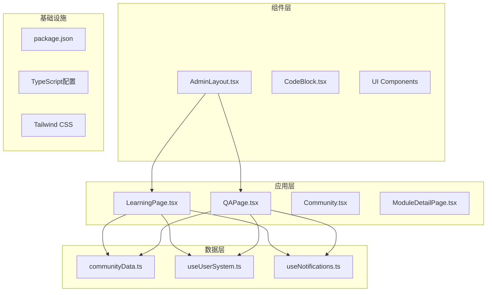

**图表来源**
- [LearningPage.tsx:1-404](file://src/pages/LearningPage.tsx#L1-L404)
- [communityData.ts:1-371](file://src/data/communityData.ts#L1-L371)
- [useUserSystem.ts:1-135](file://src/hooks/useUserSystem.ts#L1-L135)

**章节来源**
- [README.md:20-46](file://README.md#L20-L46)
- [package.json:12-26](file://package.json#L12-L26)

## 核心组件

### 课程分类系统

平台定义了四大核心课程分类，每个分类都有独特的设计理念和内容特色：

#### 教程分类
- **设计理念**: 系统性知识传授，注重理论基础和规范解读
- **内容特色**: 结构化的知识点讲解，完整的章节体系
- **适用人群**: AutoSAR初学者和希望深入理解规范的学习者
- **学习目标**: 掌握AutoSAR方法论、软件架构和配置流程
- **技能要求**: 基础的C语言编程和汽车电子概念

#### 视频课程分类
- **设计理念**: 实践导向的教学方式，强调动手操作
- **内容特色**: 手把手实操演示，工具链使用技巧
- **适用人群**: 偏好视觉学习和实践操作的学习者
- **学习目标**: 熟练掌握YuleConfig工具链和实际开发流程
- **技能要求**: 具备基本的开发环境配置能力

#### 实战项目分类
- **设计理念**: 项目驱动的学习模式，强调真实场景应用
- **内容特色**: 完整的项目案例，从需求分析到产品交付
- **适用人群**: 有一定基础，希望提升实战能力的学习者
- **学习目标**: 独立完成完整的BSW开发项目
- **技能要求**: AutoSAR基础知识和一定的编程经验

#### 专家问答分类
- **设计理念**: 社区驱动的知识分享，强调问题解决导向
- **内容特色**: 高频问题解答，专家经验分享，持续更新
- **适用人群**: 需要针对性问题解决方案的学习者
- **学习目标**: 快速解决开发过程中的具体技术难题
- **技能要求**: 具备基本的问题描述和分析能力

**章节来源**
- [LearningPage.tsx:19-170](file://src/pages/LearningPage.tsx#L19-L170)

### 学习路径规划

平台提供三条系统化的学习路径，帮助学习者制定清晰的学习计划：

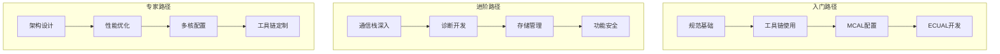

**图表来源**
- [LearningPage.tsx:172-191](file://src/pages/LearningPage.tsx#L172-L191)

**章节来源**
- [LearningPage.tsx:172-191](file://src/pages/LearningPage.tsx#L172-L191)

## 架构概览

### 课程分类架构

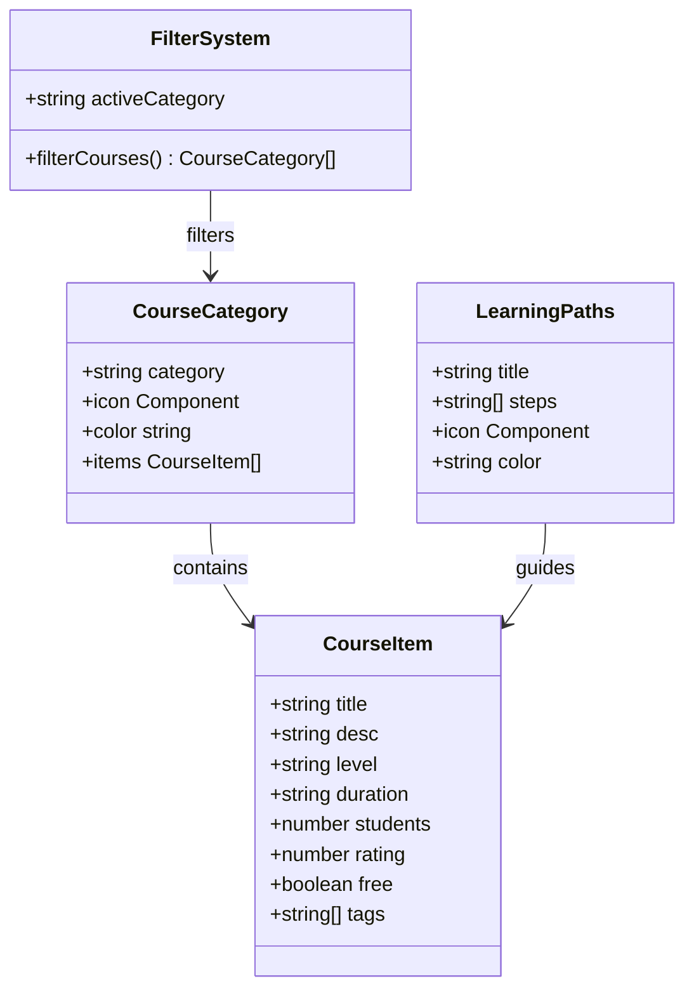

**图表来源**
- [LearningPage.tsx:21-170](file://src/pages/LearningPage.tsx#L21-L170)
- [LearningPage.tsx:193-200](file://src/pages/LearningPage.tsx#L193-L200)

### 用户体验架构

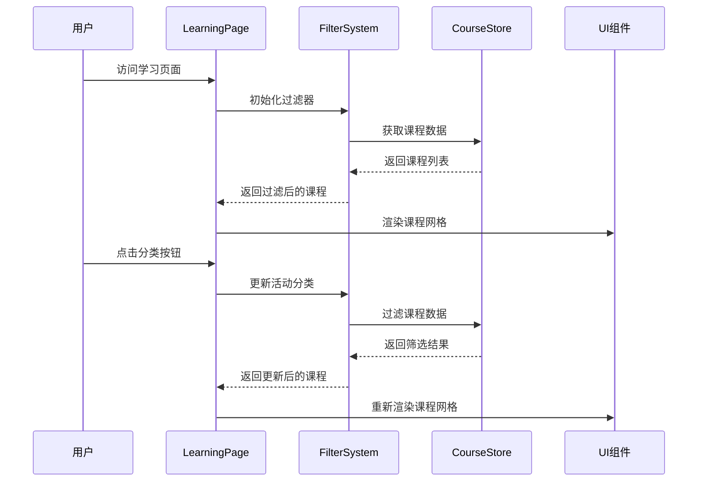

**图表来源**
- [LearningPage.tsx:193-200](file://src/pages/LearningPage.tsx#L193-L200)

## 详细组件分析

### 课程分类组件

#### 分类筛选机制

课程分类采用状态驱动的筛选机制，通过useState管理当前激活的分类状态：

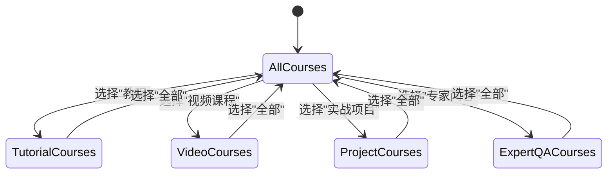

**图表来源**
- [LearningPage.tsx:194-199](file://src/pages/LearningPage.tsx#L194-L199)

#### 标签系统设计

每个课程项都支持多维度过滤标签，包括技术领域、难度级别、工具链使用等：

| 标签类型 | 示例标签 | 用途 |
|---------|---------|------|
| 技术领域 | AutoSAR, MCAL, CAN, UDS | 技术方向分类 |
| 难度级别 | 入门, 进阶, 中级, 高级 | 学习难度标识 |
| 工具链 | 工具链, 实操, 配置 | 开发工具标识 |
| 项目类型 | 开发板, BCM, MBD | 项目应用场景 |

**章节来源**
- [LearningPage.tsx:354-363](file://src/pages/LearningPage.tsx#L354-L363)

### 问答系统组件

#### 问答管理架构

问答系统采用响应式数据管理，支持实时搜索、排序和状态过滤：

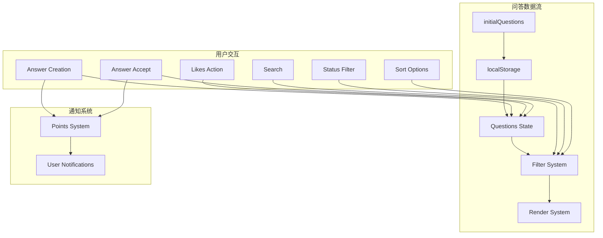

**图表来源**
- [QAPage.tsx:37-66](file://src/pages/QAPage.tsx#L37-L66)
- [QAPage.tsx:88-113](file://src/pages/QAPage.tsx#L88-L113)

**章节来源**
- [QAPage.tsx:37-66](file://src/pages/QAPage.tsx#L37-L66)

### 用户激励系统

#### 积分与等级体系

平台建立了完善的用户激励机制，通过积分系统促进社区参与：

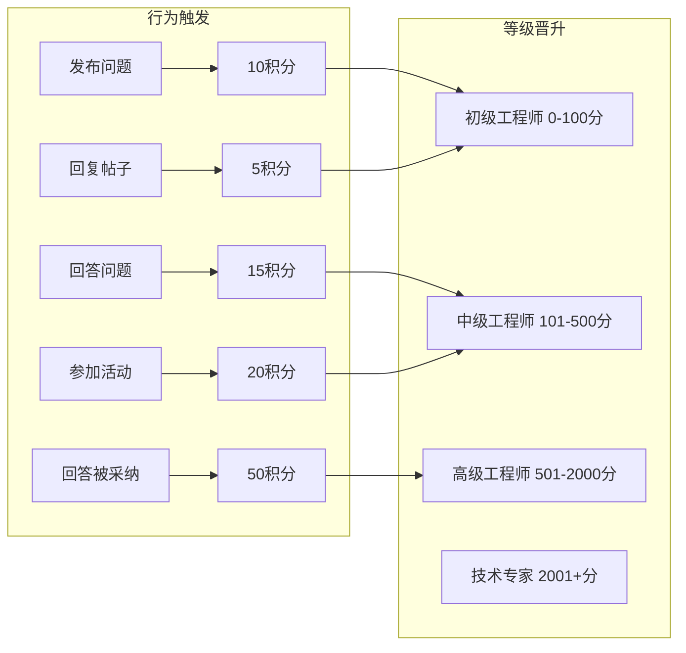

**图表来源**
- [useUserSystem.ts:20-26](file://src/hooks/useUserSystem.ts#L20-L26)
- [useUserSystem.ts:56-61](file://src/hooks/useUserSystem.ts#L56-L61)

**章节来源**
- [useUserSystem.ts:20-26](file://src/hooks/useUserSystem.ts#L20-L26)
- [useUserSystem.ts:56-61](file://src/hooks/useUserSystem.ts#L56-L61)

### 内容质量控制系统

#### 专家认证与审核机制

平台建立了多层次的内容质量控制体系：

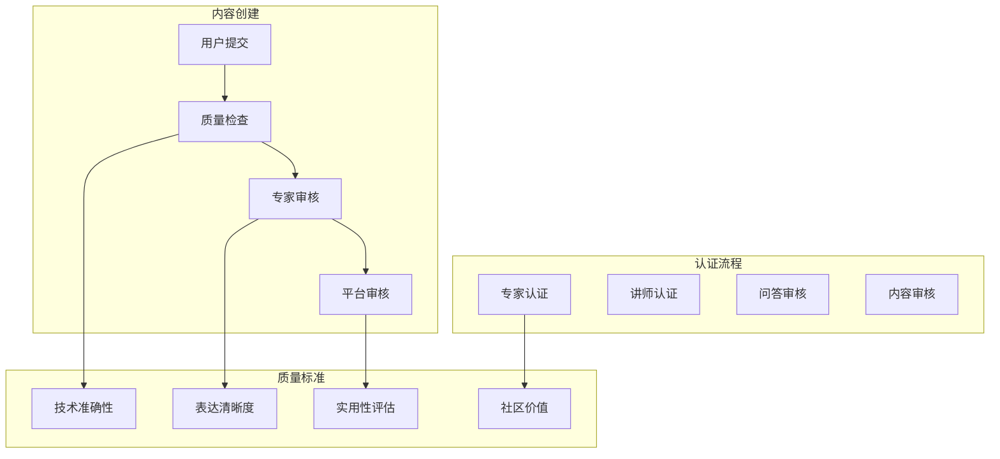

**章节来源**
- [LearningPage.tsx:391-400](file://src/pages/LearningPage.tsx#L391-L400)

## 依赖分析

### 技术栈依赖关系

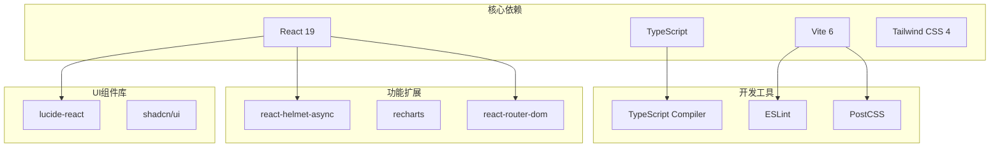

**图表来源**
- [package.json:12-26](file://package.json#L12-L26)
- [package.json:27-44](file://package.json#L27-L44)

**章节来源**
- [package.json:12-26](file://package.json#L12-L26)
- [package.json:27-44](file://package.json#L27-L44)

### 组件间依赖关系

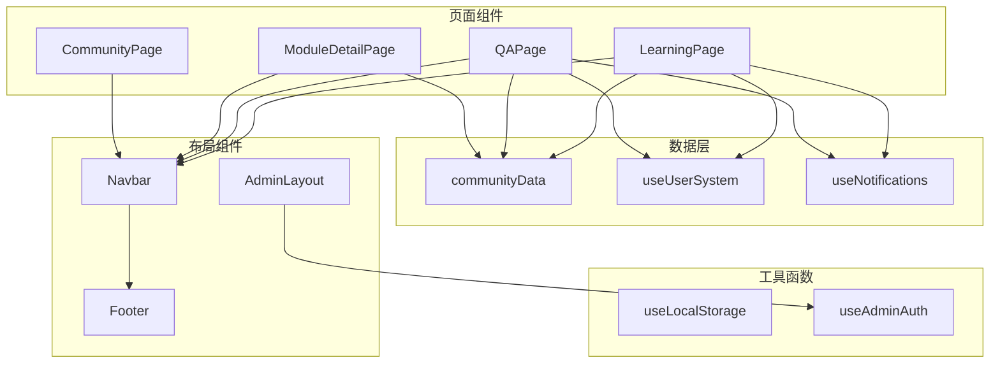

**图表来源**
- [LearningPage.tsx:1-20](file://src/pages/LearningPage.tsx#L1-L20)
- [QAPage.tsx:1-25](file://src/pages/QAPage.tsx#L1-L25)

## 性能考虑

### 前端性能优化策略

平台采用了多项性能优化措施：

1. **懒加载机制**: 使用React.lazy和Suspense实现组件懒加载
2. **状态管理优化**: 本地状态与全局状态分离，避免不必要的重渲染
3. **虚拟滚动**: 对大量数据列表采用虚拟滚动技术
4. **缓存策略**: 利用localStorage缓存用户偏好和会话数据
5. **代码分割**: 按路由进行代码分割，减少初始包体积

### 数据处理优化

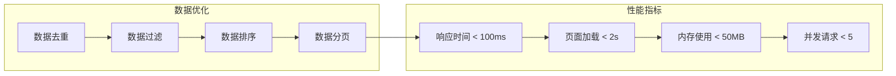

## 故障排除指南

### 常见问题诊断

#### 课程显示问题

**症状**: 课程列表不显示或显示异常
**可能原因**:
- 本地存储损坏
- 网络请求失败
- 组件状态同步问题

**解决方案**:
1. 清除浏览器缓存和localStorage
2. 检查网络连接状态
3. 刷新页面重新加载数据

#### 用户系统异常

**症状**: 积分显示错误或等级计算异常
**可能原因**:
- 积分规则配置错误
- 本地存储格式不兼容
- 并发写入冲突

**解决方案**:
1. 检查积分规则配置
2. 重置用户系统状态
3. 检查浏览器localStorage权限

#### 问答系统问题

**症状**: 问题无法发布或回答无法显示
**可能原因**:
- 用户认证状态异常
- 服务器连接问题
- 输入验证失败

**解决方案**:
1. 检查用户登录状态
2. 验证网络连接
3. 检查输入字段格式

**章节来源**
- [useUserSystem.ts:91-132](file://src/hooks/useUserSystem.ts#L91-L132)
- [QAPage.tsx:144-171](file://src/pages/QAPage.tsx#L144-L171)

## 结论

YuleTech社区课程分类体系通过四大核心分类和系统化的学习路径，为AutoSAR BSW开发者提供了一个完整的学习生态系统。平台不仅关注知识传递，更重视实践经验的积累和社区协作的培养。

该体系的成功关键在于：
1. **层次化设计**: 从入门到专家的渐进式学习路径
2. **多元化内容**: 理论与实践并重的课程体系
3. **社区驱动**: 专家问答和经验分享的互动机制
4. **激励机制**: 完善的积分和等级体系
5. **质量控制**: 多层次的内容审核和认证机制

未来发展方向包括个性化推荐算法的引入、移动端适配的完善、以及更多实战项目的开发，以进一步提升学习体验和效果。

## 附录

### 技术规格

| 项目 | 规格 |
|------|------|
| 框架 | React 19 + TypeScript |
| 构建工具 | Vite 6 |
| 样式框架 | Tailwind CSS 4 |
| UI组件库 | shadcn/ui |
| 图标库 | Lucide React |
| 字体 | Geist Sans + Geist Mono |
| 最低浏览器支持 | Chrome 90+, Firefox 88+, Safari 14+ |

### 开发环境要求

- Node.js 16.0+
- npm 8.0+
- TypeScript 6.0+
- Git版本控制

### 部署要求

- 支持静态文件托管
- HTTPS证书配置
- CDN加速支持
- 浏览器缓存策略