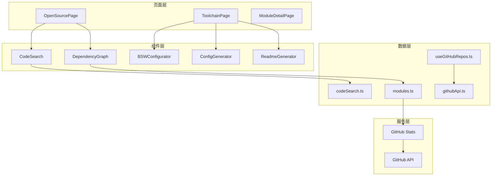
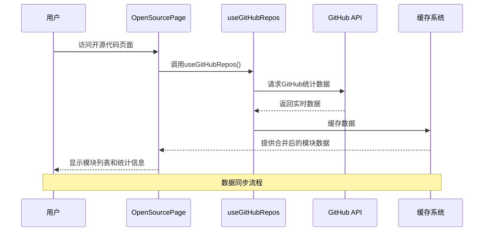
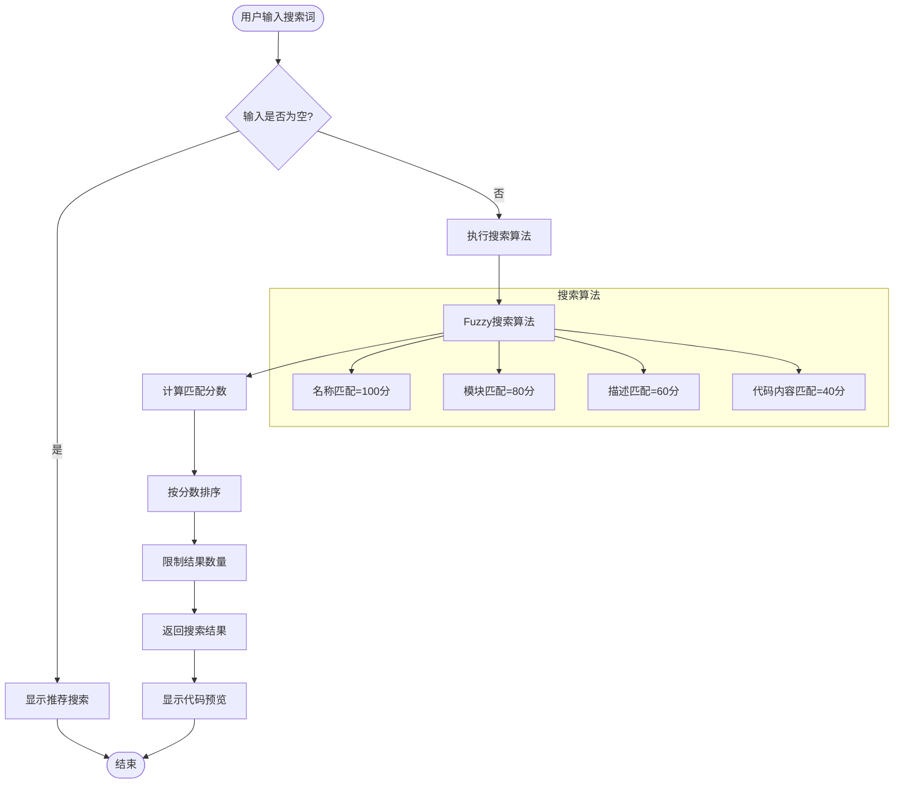
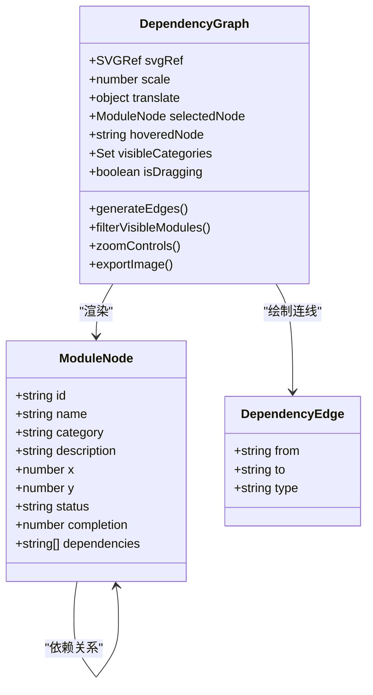
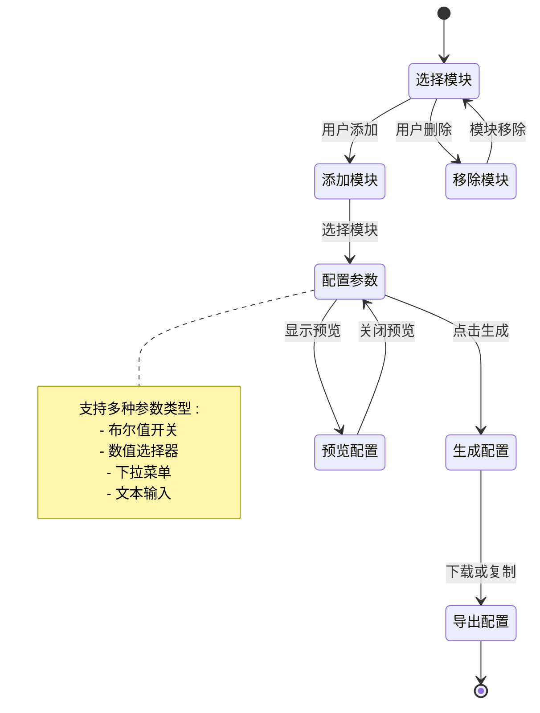
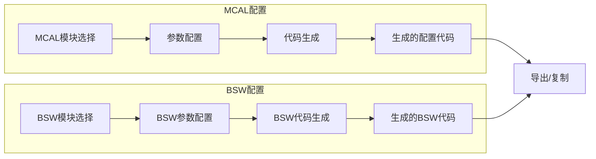
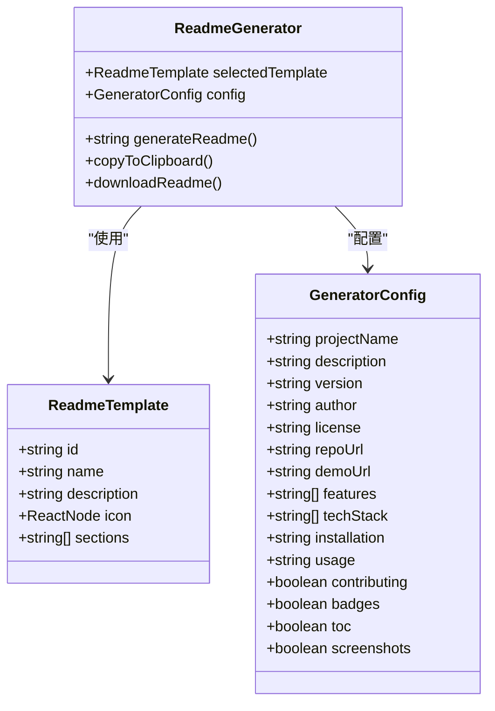
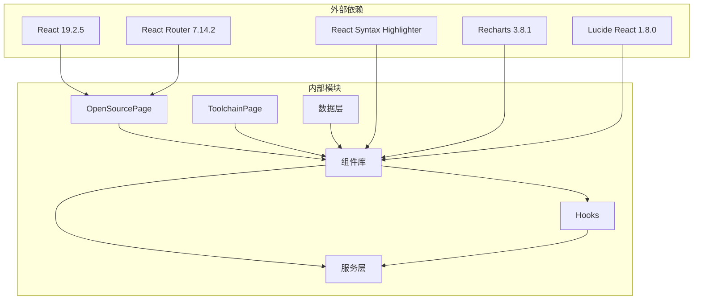

# 开源代码页面

<cite>
**本文档引用的文件**
- [OpenSourcePage.tsx](file://src/pages/OpenSourcePage.tsx)
- [ToolchainPage.tsx](file://src/pages/ToolchainPage.tsx)
- [CodeSearch.tsx](file://src/components/CodeSearch.tsx)
- [DependencyGraph.tsx](file://src/components/DependencyGraph.tsx)
- [BSWConfigurator.tsx](file://src/components/BSWConfigurator.tsx)
- [ConfigGenerator.tsx](file://src/components/ConfigGenerator.tsx)
- [ReadmeGenerator.tsx](file://src/components/ReadmeGenerator.tsx)
- [codeSearch.ts](file://src/data/codeSearch.ts)
- [modules.ts](file://src/data/modules.ts)
- [useGitHubRepos.ts](file://src/hooks/useGitHubRepos.ts)
- [githubApi.ts](file://src/services/githubApi.ts)
- [ModuleDetailPage.tsx](file://src/pages/ModuleDetailPage.tsx)
- [package.json](file://package.json)
</cite>

## 目录
1. [项目概述](#项目概述)
2. [项目结构](#项目结构)
3. [核心组件](#核心组件)
4. [架构概览](#架构概览)
5. [详细组件分析](#详细组件分析)
6. [依赖关系分析](#依赖关系分析)
7. [性能考虑](#性能考虑)
8. [故障排除指南](#故障排除指南)
9. [结论](#结论)

## 项目概述

YuleTech社区技术平台的开源代码页面是一个完整的AutoSAR BSW开源协议栈展示和管理系统。该项目基于React和TypeScript构建，提供了从底层驱动到应用组件的完整AutoSAR Classic Platform 4.x标准实现。

该平台的核心目标是为全球主流芯片公司的处理器构建完整的BSW栈，从底层驱动到应用组件全部开源，永久免费。平台包含32个开源模块，其中18个已完成，涵盖了MCAL、ECUAL、Service和RTE + ASW四个层次的完整AutoSAR架构。

## 项目结构

**图表来源**
- [OpenSourcePage.tsx:120-469](file://src/pages/OpenSourcePage.tsx#L120-L469)
- [ToolchainPage.tsx:180-380](file://src/pages/ToolchainPage.tsx#L180-L380)
- [codeSearch.ts:1-540](file://src/data/codeSearch.ts#L1-L540)

**章节来源**
- [OpenSourcePage.tsx:1-469](file://src/pages/OpenSourcePage.tsx#L1-L469)
- [ToolchainPage.tsx:1-380](file://src/pages/ToolchainPage.tsx#L1-L380)
- [package.json:1-46](file://package.json#L1-L46)

## 核心组件

### 开源代码展示页面

OpenSourcePage是整个平台的核心入口，提供了完整的AutoSAR BSW模块展示功能：

- **模块分类展示**：按MCAL、ECUAL、Service、RTE + ASW四个层次组织模块
- **实时GitHub数据同步**：集成GitHub API获取真实的star、fork数据
- **搜索和过滤功能**：支持按模块名称和描述进行搜索
- **状态统计面板**：显示开源模块总数、已完成数量、总stars和总forks

### 工具链页面

ToolchainPage专注于开发工具链的展示和配置：

- **工具分类**：配置工具、编译脚本、调试工具、测试验证四大类
- **可视化配置器**：BSW可视化配置工具
- **配置生成器**：MCAL和BSW模块的配置代码生成
- **README生成器**：AutoSAR模块专用的README模板生成

### 代码搜索系统

CodeSearch组件提供了强大的代码检索功能：

- **模糊搜索算法**：支持按函数名、变量、宏定义、模块等类型搜索
- **智能排序**：根据匹配度对搜索结果进行排序
- **语法高亮**：使用react-syntax-highlighter提供代码高亮显示
- **键盘快捷键**：支持Cmd/Ctrl+K打开搜索界面

**章节来源**
- [OpenSourcePage.tsx:120-469](file://src/pages/OpenSourcePage.tsx#L120-L469)
- [ToolchainPage.tsx:180-380](file://src/pages/ToolchainPage.tsx#L180-L380)
- [CodeSearch.tsx:14-339](file://src/components/CodeSearch.tsx#L14-L339)

## 架构概览

**图表来源**
- [useGitHubRepos.ts:13-45](file://src/hooks/useGitHubRepos.ts#L13-L45)
- [githubApi.ts:65-150](file://src/services/githubApi.ts#L65-L150)

平台采用响应式架构设计，主要特点包括：

- **数据层分离**：静态模块数据与动态GitHub数据分离
- **缓存机制**：实现5分钟缓存避免频繁API调用
- **错误处理**：优雅降级到缓存数据
- **实时更新**：提供手动刷新功能

## 详细组件分析

### 代码搜索组件分析

CodeSearch组件实现了完整的代码检索系统：

**图表来源**
- [CodeSearch.tsx:25-95](file://src/components/CodeSearch.tsx#L25-L95)
- [codeSearch.ts:447-484](file://src/data/codeSearch.ts#L447-L484)

搜索算法实现要点：
- **多维度匹配**：支持函数名、变量、宏定义、模块、结构体等多种类型
- **智能权重**：不同匹配类型的权重不同，名称匹配优先级最高
- **实时反馈**：输入变化时即时更新搜索结果
- **键盘导航**：支持上下箭头键选择结果

**章节来源**
- [CodeSearch.tsx:14-339](file://src/components/CodeSearch.tsx#L14-L339)
- [codeSearch.ts:1-540](file://src/data/codeSearch.ts#L1-L540)

### 依赖关系图组件分析

DependencyGraph组件提供了可视化的模块依赖关系展示：

**图表来源**
- [DependencyGraph.tsx:11-29](file://src/components/DependencyGraph.tsx#L11-L29)
- [DependencyGraph.tsx:92-531](file://src/components/DependencyGraph.tsx#L92-L531)

依赖图的核心功能：
- **交互式缩放**：支持放大、缩小和平移操作
- **图层筛选**：可选择性显示不同层次的模块
- **状态可视化**：通过颜色和形状表示模块状态
- **导出功能**：支持将依赖图导出为PNG图片

**章节来源**
- [DependencyGraph.tsx:1-531](file://src/components/DependencyGraph.tsx#L1-L531)

### BSW配置器组件分析

BSWConfigurator提供了AutoSAR BSW模块的可视化配置功能：

**图表来源**
- [BSWConfigurator.tsx:102-508](file://src/components/BSWConfigurator.tsx#L102-L508)

配置器的主要特性：
- **模块依赖检查**：自动检查模块间的依赖关系
- **参数类型支持**：支持布尔、数值、选择、文本四种参数类型
- **配置预览**：实时预览生成的配置文件
- **导出功能**：支持下载为JSON格式的配置文件

**章节来源**
- [BSWConfigurator.tsx:1-508](file://src/components/BSWConfigurator.tsx#L1-L508)

### 配置生成器组件分析

ConfigGenerator组件提供了MCAL和BSW模块的配置代码生成功能：

**图表来源**
- [ConfigGenerator.tsx:392-682](file://src/components/ConfigGenerator.tsx#L392-L682)

配置生成器的特点：
- **AutoSAR标准**：生成符合AutoSAR标准的C语言配置头文件
- **参数验证**：自动验证参数的有效性和依赖关系
- **格式化输出**：生成格式化的配置代码，便于集成到项目中
- **实时预览**：配置变化时实时更新生成的代码

**章节来源**
- [ConfigGenerator.tsx:1-682](file://src/components/ConfigGenerator.tsx#L1-L682)

### README生成器组件分析

ReadmeGenerator提供了AutoSAR模块专用的README模板生成功能：

**图表来源**
- [ReadmeGenerator.tsx:15-41](file://src/components/ReadmeGenerator.tsx#L15-L41)
- [ReadmeGenerator.tsx:88-567](file://src/components/ReadmeGenerator.tsx#L88-L567)

README生成器支持的模板类型：
- **标准模板**：通用开源项目README
- **AutoSAR模板**：专为AutoSAR BSW模块设计
- **简洁模板**：只包含必要信息
- **企业模板**：包含完整文档和规范说明

**章节来源**
- [ReadmeGenerator.tsx:1-567](file://src/components/ReadmeGenerator.tsx#L1-L567)

## 依赖关系分析

**图表来源**
- [package.json:12-26](file://package.json#L12-L26)

**章节来源**
- [package.json:1-46](file://package.json#L1-L46)

## 性能考虑

### 数据加载优化

平台采用了多层次的性能优化策略：

1. **缓存机制**：GitHub统计数据缓存5分钟，减少API调用频率
2. **懒加载**：组件按需加载，减少初始包体积
3. **虚拟滚动**：大量模块列表使用虚拟滚动提高渲染性能
4. **防抖搜索**：搜索输入添加防抖，避免频繁搜索调用

### 用户体验改进

- **加载状态指示**：实时显示GitHub数据同步状态
- **错误降级**：API失败时自动使用缓存数据
- **键盘快捷键**：支持Cmd/Ctrl+K快速打开搜索
- **响应式设计**：适配各种屏幕尺寸

### 代码优化策略

- **React.memo**：对昂贵的组件使用记忆化
- **useMemo**：对计算密集型数据使用记忆化
- **useCallback**：稳定函数引用，避免不必要的重渲染
- **代码分割**：按路由分割代码，实现按需加载

## 故障排除指南

### 常见问题及解决方案

**GitHub API限制**
- 问题：API调用频率过高导致限制
- 解决：检查缓存机制是否正常工作，等待缓存过期

**搜索功能异常**
- 问题：搜索结果不准确或无响应
- 解决：检查搜索算法实现，确认数据源完整性

**依赖图渲染问题**
- 问题：SVG渲染异常或性能问题
- 解决：检查浏览器兼容性，优化SVG绘制逻辑

**配置生成失败**
- 问题：配置代码生成异常
- 解决：验证参数配置有效性，检查生成器逻辑

**章节来源**
- [useGitHubRepos.ts:13-45](file://src/hooks/useGitHubRepos.ts#L13-L45)
- [githubApi.ts:131-150](file://src/services/githubApi.ts#L131-L150)

## 结论

YuleTech社区技术平台的开源代码页面是一个功能完整、架构清晰的AutoSAR BSW开源协议栈展示系统。平台通过模块化设计和组件化架构，为开发者提供了从代码浏览、工具使用到配置生成的一站式解决方案。

主要优势包括：
- **完整的AutoSAR覆盖**：涵盖MCAL、ECUAL、Service、RTE + ASW四个层次
- **强大的工具链支持**：提供配置、编译、调试、测试的完整工具集
- **智能化搜索功能**：支持多维度代码检索和智能排序
- **可视化配置工具**：通过图形化界面简化复杂的配置过程
- **实时数据同步**：与GitHub集成，提供最新的项目状态

该平台不仅提升了AutoSAR BSW开发的效率，也为社区协作和知识分享提供了良好的基础设施。通过持续的优化和功能扩展，平台将继续为汽车软件开发者提供更好的技术支持。